# Sharding (Data Partitioning)

!!! success "🏆 Gold Standard Pattern"
    **Horizontal Scaling Foundation** • Discord, Pinterest, YouTube proven at planet scale
    
    Sharding enables linear scaling by distributing data across multiple machines based on a partition key. Essential when vertical scaling hits its limits.
    
    **Key Success Metrics:**
    - Discord: 1T+ messages across 4,096 logical shards
    - Pinterest: 240B+ pins on 8,192 virtual shards  
    - YouTube: 100,000+ MySQL instances via Vitess

## Essential Question
**How do we scale beyond single-machine database limits while maintaining query performance?**

## When to Use / When NOT to Use

✅ **Use Sharding When:**
| Indicator | Threshold | Example |
|-----------|-----------|---------|
| Data size | > 5TB | User profiles, messages |
| Write throughput | > 10K/sec | Social media posts |
| Growth rate | > 2x/year | Viral applications |
| Geographic distribution | Multi-region | Global services |

❌ **Avoid Sharding When:**
| Scenario | Why | Alternative |
|----------|-----|-------------|
| < 1TB data | Complexity not worth it | Vertical scaling |
| Complex JOINs | Cross-shard queries kill performance | Denormalization |
| ACID critical | Distributed transactions are hard | Single master |
| Small team | High operational overhead | Managed services |

## Sharding Decision Framework


## Level 1: Intuition

### The Library Card Catalog Analogy
Think of a massive library with millions of books. Instead of one enormous catalog:
- A-F → Catalog 1
- G-M → Catalog 2  
- N-S → Catalog 3
- T-Z → Catalog 4

Each catalog is smaller, faster to search, and can be updated independently.

### Single Database vs Sharded

| Metric | Single Database | Sharded (4 shards) | Improvement |
|--------|-----------------|--------------------|--------------| 
| Max Storage | 10TB | 40TB | 4x |
| Write Throughput | 10K/s | 40K/s | 4x |
| Fault Impact | 100% down | 25% affected | 75% better |
| Query Latency | 500ms | 50ms | 10x faster |

### Visual Architecture

```mermaid
graph TB
    subgraph "Before: Single Database"
        C1[Clients] --> DB[(100M users<br/>10TB data<br/>🔥 Overloaded)]
    end
    
    subgraph "After: Sharded"
        C2[Clients] --> R[Router]
        R --> S1[(Shard 1<br/>25M users<br/>2.5TB)]
        R --> S2[(Shard 2<br/>25M users<br/>2.5TB)]
        R --> S3[(Shard 3<br/>25M users<br/>2.5TB)]
        R --> S4[(Shard 4<br/>25M users<br/>2.5TB)]
    end
    
    style DB fill:#f99
    style S1 fill:#9f9
    style S2 fill:#9f9
    style S3 fill:#9f9
    style S4 fill:#9f9
```



## Level 2: Foundation

### Sharding Strategy Comparison Matrix

| Strategy | Distribution | Query Support | Resharding | Best For |
|----------|--------------|---------------|------------|----------|
| **Hash-Based** | ⭐⭐⭐⭐⭐ Even | ❌ No range queries | 🔴 Very Hard | User profiles, sessions |
| **Range-Based** | ⭐⭐ Can hotspot | ✅ Range queries | 🟡 Hard | Time-series, logs |
| **Geographic** | ⭐⭐⭐ By region | ✅ Location queries | 🟢 Natural | Global apps, CDN |
| **Directory** | ⭐⭐⭐⭐ Flexible | ✅ Any query type | 🟢 Easy | Multi-tenant SaaS |
| **Composite** | ⭐⭐⭐ Custom | 🟡 Complex | 🔴 Very Complex | Enterprise systems |

### Sharding Key Selection Guide

```mermaid
flowchart TD
    Start["Choose Sharding Key"] --> Access{"Primary Access Pattern?"}
    
    Access -->|"By User"|  User["user_id"]
    Access -->|"By Time"| Time["timestamp"]
    Access -->|"By Location"| Geo["region_id"]
    Access -->|"By Tenant"| Tenant["tenant_id"]
    
    User --> UserCheck{"Even Distribution?"}
    UserCheck -->|"No"| Composite1["hash(user_id)"]
    UserCheck -->|"Yes"| Final1["✓ Use user_id"]
    
    Time --> TimeCheck{"Query Pattern?"}
    TimeCheck -->|"Recent Data"| Recent["year_month partition"]
    TimeCheck -->|"Any Period"| Final2["✓ Use timestamp"]
    
    Geo --> GeoCheck{"Compliance Needs?"}
    GeoCheck -->|"Yes"| Final3["✓ Use region_id"]
    GeoCheck -->|"No"| Consider["Consider hash(user_id)"]
    
    style Final1 fill:#9f9
    style Final2 fill:#9f9
    style Final3 fill:#9f9
```

### Core Implementation Patterns

```python
# Virtual bucket mapping (Discord-style)
def get_shard_with_buckets(key: str, buckets=4096, shards=128):
    bucket = hash(key) % buckets
    # Dynamic mapping allows rebalancing
    shard = bucket_to_shard_map.get(bucket, bucket % shards)
    return f"db_{shard}"

# Consistent hashing (DynamoDB-style)  
def get_shard_consistent(key: str):
    hash_ring = sorted(shard_positions.items())
    key_hash = hash(key) % (2**32)
    for position, shard in hash_ring:
        if key_hash <= position:
            return shard
    return hash_ring[0][1]  # Wrap around

# Directory-based (Slack-style)
def get_shard_directory(tenant_id: str):
    # Centralized mapping for flexibility
    return shard_directory.lookup(tenant_id)
```

## Level 3: Deep Dive

### Rebalancing Strategies

| Strategy | Complexity | Downtime | When to Use |
|----------|------------|----------|-------------|
| **Virtual Shards** | Low | None | Default choice - map multiple logical shards to physical |
| **Consistent Hashing** | Low | None | Dynamic clusters with frequent node changes |
| **Split & Merge** | High | Minimal | When virtual shards insufficient |
| **Shadow Writes** | Medium | None | Zero-downtime migrations |
| **Read-Write Split** | Medium | None | Gradual migration with verification |

### Rebalancing Decision Flow

```mermaid
flowchart TD
    Start["Shard Imbalance Detected"] --> Check{"Using Virtual Shards?"}
    Check -->|Yes| Remap["Remap Virtual→Physical<br/>Zero downtime"]
    Check -->|No| Size{"Imbalance > 50%?"}
    
    Size -->|No| Monitor["Increase monitoring<br/>Plan for future"]
    Size -->|Yes| Critical{"Business Critical?"}
    
    Critical -->|No| Split["Schedule split<br/>during maintenance"]
    Critical -->|Yes| Shadow["Shadow writes<br/>+ gradual migration"]
    
    Remap --> Done["Monitor Balance"]
    Shadow --> Done
    Split --> Done
    
    style Start fill:#ffd
    style Done fill:#9f9
```



### Cross-Shard Query Patterns

| Pattern | Performance | Use Case | Optimization |
|---------|-------------|----------|---------------|
| **Scatter-Gather** | O(n) shards | Global search | Parallel execution, result caching |
| **Targeted Multi-Shard** | O(k) shards | Known subset | Shard pruning, query routing |
| **Shard-Local** | O(1) | 95% of queries | Co-locate related data |
| **Two-Phase Lookup** | 2x latency | Secondary indexes | Denormalize hot paths |

### Common Pitfalls & Solutions

| Pitfall | Impact | Solution |
|---------|--------|----------|
| **Hot Shards** | One shard gets 80% traffic | Composite keys, virtual shards, time-based sub-sharding |
| **Cross-Shard JOINs** | 100x slower queries | Denormalize, maintain read views, use CQRS |
| **Shard Key Changes** | Can't move data | Immutable keys, directory-based sharding |
| **Unbalanced Growth** | Some shards fill faster | Predictive rebalancing, usage-based splitting |

## Level 4: Expert

### Production Case Studies

<div class="failure-vignette">
<h4>💥 Discord's Resharding Crisis (2020)</h4>

**Scale**: 1T+ messages, growing 100M/day
**Problem**: Popular channels created 100x shard imbalance
**Impact**: P99 latency degraded from 50ms → 5 seconds

**Solution Architecture**:
```
Before: channel_id % 128 → Direct shard mapping
After:  channel_id → bucket (1 of 4096) → shard (1 of 128)
```

**Results**: 
- 95% reduction in P99 latency
- Zero-downtime rebalancing capability
- Handles 1M+ messages/second
</div>

### Architecture Comparison

| Company | Sharding Strategy | Scale | Key Innovation |
|---------|------------------|-------|----------------|
| **Discord** | Bucket-based (4096→128) | 1T+ messages | Dynamic bucket remapping |
| **Pinterest** | Virtual shards (8192→800) | 240B+ pins | MySQL at massive scale |
| **YouTube** | Vitess auto-sharding | 100K+ MySQL | Transparent resharding |
| **Uber** | Schemaless layers | 1M+ QPS | Cell-based architecture |

### Discord's Virtual Shard Mapping

```python
# Conceptual implementation
def get_shard_for_channel(channel_id: str) -> str:
    # Step 1: Stable bucket assignment
    bucket = hash(channel_id) % 4096
    
    # Step 2: Dynamic bucket→shard mapping
    # Can be rebalanced without changing bucket
    shard = bucket_to_shard_map[bucket]
    
    # Step 3: Time-based sub-partition for hot buckets
    if is_hot_bucket(bucket):
        month = get_current_month()
        shard = f"{shard}_{month}"
    
    return f"cassandra-{shard}"
```

### Vitess Architecture (YouTube)


## Level 5: Mastery

### Economic Analysis

| Cost Factor | Single DB (10TB) | 4-Shard Setup | Annual Savings |
|-------------|------------------|---------------|----------------|
| **Infrastructure** | $15K/mo (r5.24xl) | $8K/mo (4×r5.4xl) | $84K |
| **Storage + IOPS** | $8K/mo | $7K/mo | $12K |
| **Downtime Impact** | $20K/mo (2hr) | $2K/mo (0.5hr) | $216K |
| **Total Monthly** | $43K | $17K | **$312K/year** |

**ROI Timeline**: 
- Implementation cost: ~$200K (engineering time)
- Payback period: 7.7 months
- 5-year ROI: 680%

### Zero-Downtime Migration Playbook


### Production-Ready Configurations

```yaml
# Discord-style bucket sharding
sharding:
  strategy: virtual_buckets
  buckets: 4096
  initial_shards: 128
  rebalance_threshold: 0.3  # 30% imbalance
  hot_bucket_detection:
    threshold_qps: 1000
    auto_split: true

# Pinterest-style range sharding  
sharding:
  strategy: id_range
  virtual_shards: 8192
  physical_servers: 800
  replication_factor: 3
  shard_size_target: 50GB
  
# Vitess auto-sharding
sharding:
  strategy: hash
  auto_split_size: 100GB
  min_shards: 2
  max_shards: 1024
  resharding_workflow: online
```

## Quick Reference

### Decision Matrix

| Your Situation | Recommended Approach |
|----------------|---------------------|
| 5-10TB, growing slowly | Vertical scaling + read replicas |
| 10TB+, doubling yearly | Start sharding project now |
| Complex queries, <5TB | Optimize queries first |
| Multi-tenant SaaS | Directory-based sharding |
| Time-series data | Range sharding by time |
| Global users | Geographic sharding |

### Common Commands

```sql
-- Check shard balance
SELECT shard_id, COUNT(*) as records, 
       SUM(data_size) as total_size
FROM shard_metadata
GROUP BY shard_id;

-- Find hot shards
SELECT shard_id, queries_per_sec, avg_latency_ms
FROM shard_metrics
WHERE queries_per_sec > 1000
ORDER BY queries_per_sec DESC;
```

### Key Metrics to Monitor

| Metric | Target | Alert Threshold |
|--------|--------|-----------------|
| Shard size variance | < 20% | > 50% |
| Cross-shard queries | < 5% | > 10% |
| Resharding frequency | Quarterly | Monthly |
| Hot shard traffic | < 2x average | > 3x average |

## 🎓 Key Takeaways

1. **Start with more shards than you need** - Merging is easier than splitting
2. **Choose your shard key wisely** - It determines everything
3. **Monitor shard balance religiously** - Hotspots kill performance
4. **Plan for resharding from day one** - You will need it
5. **Avoid cross-shard operations** - They're expensive at scale

## Related Patterns

### Foundation
- [Consistent Hashing](../scaling/consistent-hashing.md) - Core algorithm for sharding
- [Database per Service](../data/database-per-service.md) - Natural sharding boundary
- [CQRS](../data/cqrs.md) - Separate read/write sharding strategies

### Operations  
- [Circuit Breaker](../resilience/circuit-breaker.md) - Handle shard failures
- [Bulkhead](../resilience/bulkhead.md) - Isolate shard impacts
- [Service Mesh](../infrastructure/service-mesh.md) - Shard-aware routing

### Case Studies
- [Discord: Message Sharding](../case-studies/discord-messages.md)
- [Pinterest: MySQL Sharding](../case-studies/pinterest-sharding.md)
- [Uber: Schemaless](../case-studies/uber-schemaless.md)

---

*"The best shard key is the one you'll never need to change."*