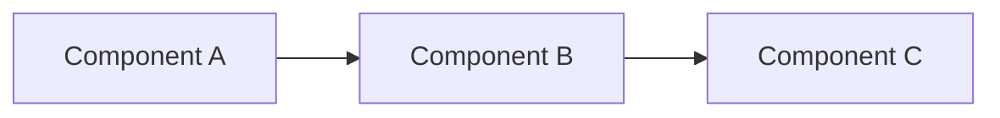
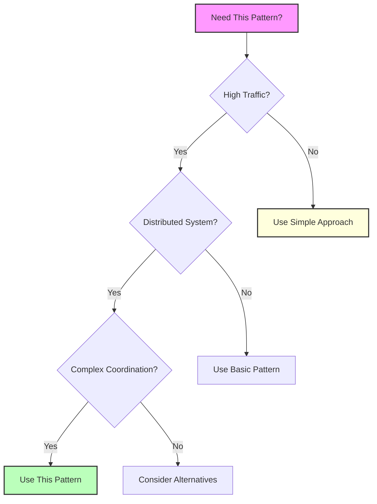

## Essential Question

**How do we handle increasing load without sacrificing performance using tile caching?**

# Tile Caching

**Optimize map rendering with pre-computed tile pyramids**

> *"Why render the world every time when you can cache it once?"*

## When to Use / When NOT to Use

### When to Use

| Scenario | Why It Fits | Alternative If Not |
|----------|-------------|-------------------|
| High availability required | Pattern provides resilience | Consider simpler approach |
| Scalability is critical | Handles load distribution | Monolithic might suffice |
| Distributed coordination needed | Manages complexity | Centralized coordination |

### When NOT to Use

| Scenario | Why to Avoid | Better Alternative |
|----------|--------------|-------------------|
| Simple applications | Unnecessary complexity | Direct implementation |
| Low traffic systems | Overhead not justified | Basic architecture |
| Limited resources | High operational cost | Simpler patterns |

## Overview

Tile caching optimizes the storage and delivery of map tiles by pre-rendering and caching spatial data at multiple zoom levels. This pattern is fundamental to modern mapping applications.

## Key Concepts

- **Tile Pyramid**: Pre-rendered tiles at multiple zoom levels
- **Cache Hierarchy**: Multi-level caching from edge to origin
- **Invalidation Strategy**: Updating tiles when data changes

## Related Patterns
- [CDN Pattern](../scaling/edge-computing/index.md)
- [Cache-Aside](cache-aside.md)
- Spatial Indexing (Coming Soon)
- Vector Maps (Coming Soon)

## References
- [Google Maps Case Study](case-studies/google-maps/index.md) - Implements multi-level tile caching

## Level 1: Intuition (5 minutes)

*Start your journey with relatable analogies*

### The Elevator Pitch
[Pattern explanation in simple terms]

### Real-World Analogy
[Everyday comparison that explains the concept]

## Level 2: Foundation (10 minutes)

*Build core understanding*

### Core Concepts
- Key principle 1
- Key principle 2
- Key principle 3

### Basic Example

## Level 3: Deep Dive (15 minutes)

*Understand implementation details*

### How It Really Works
[Technical implementation details]

### Common Patterns
[Typical usage patterns]

## Level 4: Expert (20 minutes)

*Master advanced techniques*

### Advanced Configurations
[Complex scenarios and optimizations]

### Performance Tuning
[Optimization strategies]

## Level 5: Mastery (30 minutes)

*Apply in production*

### Real-World Case Studies
[Production examples from major companies]

### Lessons from the Trenches
[Common pitfalls and solutions]

## Decision Matrix

### Quick Decision Table

| Factor | Low Complexity | Medium Complexity | High Complexity |
|--------|----------------|-------------------|-----------------|
| Team Size | < 5 developers | 5-20 developers | > 20 developers |
| Traffic | < 1K req/s | 1K-100K req/s | > 100K req/s |
| Data Volume | < 1GB | 1GB-1TB | > 1TB |
| **Recommendation** | ❌ Avoid | ⚠️ Consider | ✅ Implement |
