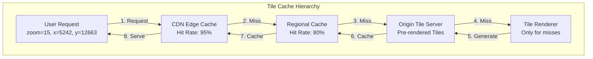
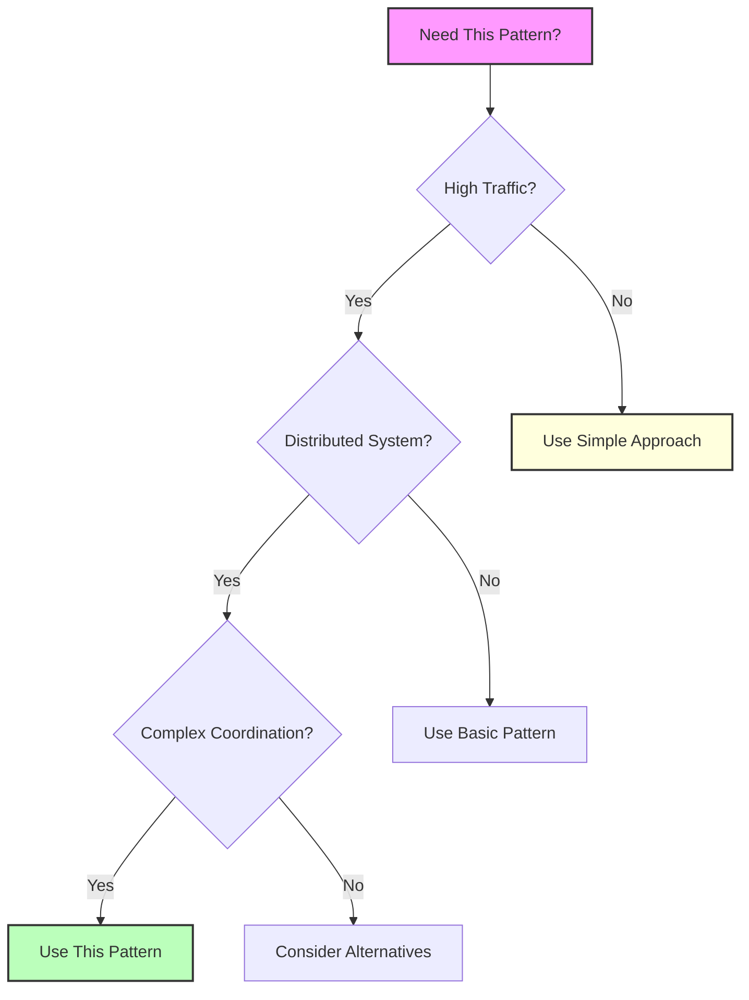

## Essential Question

**How do we handle increasing load without sacrificing performance using tile caching?**


# Tile Caching

**Optimize map rendering with pre-computed tile pyramids**

> *"Why render the world every time when you can cache it once?"*


## When to Use / When NOT to Use

### When to Use

| Scenario | Why It Fits | Alternative If Not |
|----------|-------------|-------------------|
| High availability required | Pattern provides resilience | Consider simpler approach |
| Scalability is critical | Handles load distribution | Monolithic might suffice |
| Distributed coordination needed | Manages complexity | Centralized coordination |

### When NOT to Use

| Scenario | Why to Avoid | Better Alternative |
|----------|--------------|-------------------|
| Simple applications | Unnecessary complexity | Direct implementation |
| Low traffic systems | Overhead not justified | Basic architecture |
| Limited resources | High operational cost | Simpler patterns |

## Overview

Tile caching optimizes the storage and delivery of map tiles by pre-rendering and caching spatial data at multiple zoom levels. This pattern is fundamental to modern mapping applications.

## Key Concepts

- **Tile Pyramid**: Pre-rendered tiles at multiple zoom levels
- **Cache Hierarchy**: Multi-level caching from edge to origin
- **Invalidation Strategy**: Updating tiles when data changes

## Related Patterns
- [CDN Pattern](../scaling/edge-computing.md)
- [Cache-Aside](cache-aside.md)
- Spatial Indexing (Coming Soon)
- Vector Maps (Coming Soon)

## References
- [Google Maps Technical Documentation](https://developers.google.com/maps/documentation/tile) - Tile API implementation
- [Mapbox Vector Tile Specification](https://github.com/mapbox/vector-tile-spec) - MVT format standard
- [OpenStreetMap Tile Usage Policy](https://operations.osmfoundation.org/policies/tiles/) - Community tile serving
- [Bing Maps Tile System](https://docs.microsoft.com/en-us/bingmaps/articles/bing-maps-tile-system) - Quadkey addressing
- ["Serving Tiles at Scale" - Uber Engineering](https://eng.uber.com/engineering-h3/) - H3 hexagonal tiling

## Related Laws and Principles
- **[Law of Economic Reality](../../core-principles/laws/economic-reality.md)**: Tile caching reduces compute costs by 1000x through pre-computation
- **[Law of Distributed Knowledge](../../core-principles/laws/distributed-knowledge.md)**: Each cache layer has partial knowledge of tile freshness
- **[Work Distribution Pillar](../../core-principles/pillars/work-distribution.md)**: Distributing tile rendering across multiple servers
- **[State Distribution Pillar](../../core-principles/pillars/state-distribution.md)**: Replicating tile data across geographic regions

## Level 1: Intuition (5 minutes)

*Start your journey with relatable analogies*

### The Elevator Pitch
Tile caching pre-generates and stores map data as small image tiles at multiple zoom levels, serving millions of users without re-rendering the same geographic area repeatedly. Instead of computing San Francisco's street map for every user request, we render it once per zoom level and serve cached tiles in milliseconds.

### Real-World Analogy
Imagine a jigsaw puzzle factory. Instead of custom-cutting a new puzzle for each customer from a photo, they pre-cut standard puzzle pieces for popular images at different sizes (256-piece, 500-piece, 1000-piece versions). When someone orders the Eiffel Tower puzzle, they just grab the pre-cut pieces from inventory. Similarly, tile caching pre-cuts the world map into standard tiles (256x256 pixels) at zoom levels 0-20, serving pre-rendered pieces instantly rather than generating custom maps for each user.

## Level 2: Foundation (10 minutes)

*Build core understanding*

### Core Concepts
- **Quadtree Structure**: World divided recursively - zoom 0 has 1 tile, zoom 1 has 4 tiles, zoom n has 4^n tiles
- **Z/X/Y Addressing**: Each tile uniquely identified by zoom level (Z) and coordinates (X, Y)
- **Cache Pyramids**: Pre-rendered tiles from zoom 0 (entire world) to zoom 20+ (building level)
- **Vector vs Raster**: Raster tiles are pre-rendered images; vector tiles contain data rendered client-side

### Basic Example


## Level 3: Deep Dive (15 minutes)

*Understand implementation details*

### How It Really Works

**Tile Generation Pipeline:**
```python
class TileCache:
    def __init__(self, max_zoom=20):
        self.max_zoom = max_zoom
        self.cache_layers = [
            EdgeCDN(ttl=86400),      # 24 hour edge cache
            RegionalCache(ttl=3600),  # 1 hour regional
            OriginCache(ttl=300)      # 5 min origin
        ]
    
    def get_tile(self, z, x, y):
        # Validate tile coordinates
        if not self.is_valid_tile(z, x, y):
            return None
            
        # Check cache hierarchy
        for cache in self.cache_layers:
            tile = cache.get(f"{z}/{x}/{y}")
            if tile:
                return tile
        
        # Generate if not cached
        tile = self.render_tile(z, x, y)
        
        # Populate caches (write-through)
        for cache in reversed(self.cache_layers):
            cache.put(f"{z}/{x}/{y}", tile)
        
        return tile
    
    def render_tile(self, z, x, y):
        # Convert tile coords to lat/lon bounds
        bounds = self.tile_to_bounds(z, x, y)
        
        # Query spatial data within bounds
        features = self.query_features(bounds)
        
        # Render to 256x256 image
        return self.render_features(features, z)
```

### Common Patterns

**1. Tile Seeding (Pre-warming):**
- Generate popular tiles before users request them
- Seed zoom levels 0-10 globally (covers continents)
- Seed zoom 11-15 for populated areas
- Generate zoom 16+ on-demand

**2. Differential Updates:**
- Track changed regions using bounding boxes
- Invalidate only affected tiles
- Use tile dependencies to cascade updates

**3. Overzooming:**
- Serve zoom 18 tiles scaled up for zoom 19-20
- Reduces storage by 75% for detailed levels
- Client-side scaling maintains quality

## Level 4: Expert (20 minutes)

*Master advanced techniques*

### Advanced Configurations

**Multi-Resolution Tile Serving:**
```yaml
tile_config:
  standard_tiles:  # 256x256 PNG
    format: png
    size: 256
    compression: 8
    cache_control: "public, max-age=86400"
  
  retina_tiles:    # 512x512 for high-DPI
    format: png
    size: 512
    compression: 9
    cache_control: "public, max-age=86400"
  
  vector_tiles:    # Mapbox Vector Tile format
    format: mvt
    compression: gzip
    simplification:
      0-5: 100     # No simplification
      6-10: 50     # Moderate simplification
      11-15: 10    # Heavy simplification
      16+: 1       # Maximum detail
```

**Intelligent Cache Invalidation:**
```python
class SmartInvalidator:
    def invalidate_region(self, bbox, min_zoom=0, max_zoom=20):
        affected_tiles = []
        
        for z in range(min_zoom, max_zoom + 1):
            # Calculate which tiles intersect bbox at this zoom
            tiles = self.bbox_to_tiles(bbox, z)
            affected_tiles.extend(tiles)
            
            # Prioritize invalidation by popularity
            tiles_by_popularity = self.sort_by_access_frequency(tiles)
            
            # Invalidate popular tiles immediately
            for tile in tiles_by_popularity[:100]:
                self.immediate_invalidate(tile)
            
            # Queue rest for background invalidation
            for tile in tiles_by_popularity[100:]:
                self.queue_invalidation(tile)
```

### Performance Tuning

**Storage Optimization:**
- **MBTiles Format**: SQLite database reduces small file overhead by 60%
- **Tile Compositing**: Overlay transparent tiles instead of storing combinations
- **Progressive Enhancement**: Serve low-quality immediately, upgrade asynchronously

**Network Optimization:**
```nginx
# Nginx configuration for tile serving
location ~ ^/tiles/(?<z>\d+)/(?<x>\d+)/(?<y>\d+)\.png$ {
    # Enable caching headers
    expires 7d;
    add_header Cache-Control "public, immutable";
    
    # Enable HTTP/2 Server Push for adjacent tiles
    http2_push /tiles/$z/$x/$arg_y_minus_1.png;
    http2_push /tiles/$z/$x/$arg_y_plus_1.png;
    
    # Serve from cache with fallback
    try_files /cache/tiles/$z/$x/$y.png @tile_generator;
}
```

**Metrics to Monitor:**
- Cache hit rate per zoom level (target: >90% for z0-15)
- Tile generation time percentiles (p99 < 100ms)
- Storage growth rate (typically 2-3TB for global street-level)
- CDN bandwidth costs (optimize tile format/compression)

## Level 5: Mastery (30 minutes)

*Apply in production*

### Real-World Case Studies

**Google Maps: 1 Billion+ Users, 20+ Zoom Levels**
- **Scale**: Serves 100+ billion tile requests daily
- **Architecture**: Multi-tier caching with regional Points of Presence (PoPs)
- **Innovation**: Vector tiles for mobile to reduce bandwidth by 80%
- **Challenge**: Coordinating updates across global cache infrastructure
- **Solution**: Event-driven invalidation with 5-minute global propagation

**Mapbox: 600+ Million Monthly Users**
- **Scale**: 2+ billion API requests daily across 200+ countries
- **Architecture**: CloudFront CDN with 400+ edge locations
- **Innovation**: Client-side rendering with Mapbox GL for dynamic styling
- **Storage**: 15+ PB of pre-rendered tiles in S3
- **Cost Optimization**: Reduced CDN costs 60% through intelligent pre-fetching

**OpenStreetMap: Community-Driven Global Mapping**
- **Scale**: 50+ TB of tile data, 10+ million map edits monthly
- **Architecture**: Volunteer-run tile servers with mod_tile/renderd
- **Challenge**: Limited resources for global coverage
- **Solution**: Dynamic rendering with aggressive caching (1-week TTL)
- **Innovation**: Overpass API for real-time data queries bypassing tiles

### Lessons from the Trenches

**Common Pitfalls:**

1. **Cache Stampede on Popular Areas**
   - **Problem**: Thousands of requests for Times Square tiles after cache expiry
   - **Solution**: Implement cache warming and request coalescing
   ```python
   # Request coalescing pattern
   pending_renders = {}  # Track in-flight renders
   
   def get_tile_with_coalescing(z, x, y):
       key = f"{z}/{x}/{y}"
       if key in pending_renders:
           # Wait for existing render
           return pending_renders[key].wait()
       
       # Start new render
       future = Future()
       pending_renders[key] = future
       tile = render_tile(z, x, y)
       future.set_result(tile)
       del pending_renders[key]
       return tile
   ```

2. **Storage Explosion at High Zoom Levels**
   - **Problem**: Zoom 20 requires 1 trillion tiles for global coverage
   - **Solution**: Generate high-zoom tiles on-demand with short TTL
   - **Math**: Each zoom level quadruples tile count: 4^20 = 1.1 trillion tiles

3. **Inconsistent Updates Across Cache Layers**
   - **Problem**: Users see old tiles next to new tiles after partial update
   - **Solution**: Atomic invalidation with version vectors
   - **Implementation**: Tag tile sets with version, invalidate entire version

4. **Mobile Data Consumption**
   - **Problem**: Raster tiles consume 100+ MB for city navigation
   - **Solution**: Vector tiles reduce to 10-20 MB with client-side rendering
   - **Trade-off**: Higher CPU usage on device vs bandwidth savings


## Decision Matrix



### Quick Decision Table

| Factor | Low Complexity | Medium Complexity | High Complexity |
|--------|----------------|-------------------|-----------------|
| Team Size | < 5 developers | 5-20 developers | > 20 developers |
| Traffic | < 1K req/s | 1K-100K req/s | > 100K req/s |
| Data Volume | < 1GB | 1GB-1TB | > 1TB |
| **Recommendation** | ❌ Avoid | ⚠️ Consider | ✅ Implement |
