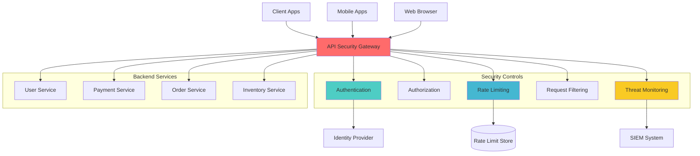

# API Security Gateway

## Problem Statement

Microservices architectures expose numerous API endpoints that require consistent security controls. Implementing security in each service leads to code duplication, inconsistent policies, and increased attack surface. Security vulnerabilities in any service can compromise the entire system.

**Real-World Impact**: The 2019 Capital One breach affected 100M+ customers due to inadequate API security controls, resulting in $80M+ in fines and remediation costs.

## Solution Overview

API Security Gateway provides centralized security enforcement through:
- Authentication and authorization
- Rate limiting and DDoS protection
- Request/response filtering and validation
- Threat detection and monitoring
- SSL termination and certificate management



## Architecture Components

### 1. Authentication Layer
```yaml
Authentication Methods:
  - OAuth 2.0 / OpenID Connect
  - JWT (JSON Web Tokens)
  - API keys with HMAC signing
  - mTLS (mutual TLS)
  - SAML 2.0 integration

Token Management:
  - Token validation and verification
  - Token refresh handling
  - Token revocation support
  - Claims extraction and forwarding
```

### 2. Authorization Engine
```yaml
Authorization Models:
  - Role-Based Access Control (RBAC)
  - Attribute-Based Access Control (ABAC)
  - Policy-Based Access Control (PBAC)
  - Resource-level permissions

Policy Sources:
  - Static configuration files
  - External policy servers (OPA)
  - Database-driven policies
  - Real-time policy updates
```

### 3. Threat Protection
```yaml
Security Features:
  - DDoS protection and rate limiting
  - SQL injection detection
  - XSS (Cross-Site Scripting) filtering
  - CSRF (Cross-Site Request Forgery) protection
  - IP allowlist/blocklist
  - Geo-blocking capabilities

Threat Intelligence:
  - Real-time threat feeds
  - Behavioral analysis
  - Anomaly detection
  - Bot detection and mitigation
```

## Implementation Guide

### Phase 1: Core Gateway (Weeks 1-2)

1. **Deploy Kong Gateway**
```bash
# Install Kong on Kubernetes
kubectl create namespace kong
kubectl apply -f https://bit.ly/kong-ingress-dbless

# Configure basic gateway
kubectl apply -f - <<EOF
apiVersion: configuration.konghq.com/v1
kind: KongPlugin
metadata:
  name: rate-limit-global
config:
  minute: 1000
  hour: 10000
  limit_by: ip
protocol: http
EOF
```

2. **SSL/TLS Configuration**
```yaml
apiVersion: networking.k8s.io/v1
kind: Ingress
metadata:
  name: api-gateway
  annotations:
    cert-manager.io/cluster-issuer: "letsencrypt-prod"
    nginx.ingress.kubernetes.io/ssl-redirect: "true"
spec:
  tls:
  - hosts:
    - api.company.com
    secretName: api-gateway-tls
  rules:
  - host: api.company.com
    http:
      paths:
      - path: /
        pathType: Prefix
        backend:
          service:
            name: kong-proxy
            port:
              number: 80
```

### Phase 2: Authentication Integration (Weeks 3-4)

1. **OAuth 2.0 Configuration**
```yaml
apiVersion: configuration.konghq.com/v1
kind: KongPlugin
metadata:
  name: oauth2
config:
  scopes:
  - read
  - write
  - admin
  token_expiration: 3600
  enable_authorization_code: true
  enable_client_credentials: true
  enable_implicit_grant: false
  enable_password_grant: false
protocol: http
```

2. **JWT Validation**
```yaml
apiVersion: configuration.konghq.com/v1
kind: KongPlugin
metadata:
  name: jwt-auth
config:
  uri_param_names:
  - token
  header_names:
  - Authorization
  claims_to_verify:
  - exp
  - aud
  - iss
  key_claim_name: iss
  secret_is_base64: false
protocol: http
```

### Phase 3: Advanced Security (Weeks 5-6)

1. **Rate Limiting Configuration**
```lua
-- Advanced rate limiting with Redis
local rate_limit_plugin = {
  name = "advanced-rate-limit",
  redis_host = "redis.default.svc.cluster.local",
  redis_port = 6379,
  
  limits = {
    {
      route = "/api/v1/users",
      limit = 100,
      window = 60,
      key = "ip"
    },
    {
      route = "/api/v1/payments",
      limit = 10,
      window = 60,
      key = "user_id"
    }
  }
}

function rate_limit_plugin:access(config)
  local key = kong.client.get_ip()
  local current_time = os.time()
  local window_start = current_time - (current_time % config.window)
  local cache_key = config.route .. ":" .. key .. ":" .. window_start
  
  local current_count = kong.cache:get(cache_key) or 0
  
  if current_count >= config.limit then
    kong.response.exit(429, {message = "Rate limit exceeded"})
  end
  
  kong.cache:set(cache_key, current_count + 1, config.window)
end
```

2. **Request Validation**
```yaml
apiVersion: configuration.konghq.com/v1
kind: KongPlugin
metadata:
  name: request-validation
config:
  body_schema: |
    {
      "type": "object",
      "properties": {
        "name": {"type": "string", "maxLength": 100},
        "email": {"type": "string", "format": "email"},
        "age": {"type": "integer", "minimum": 0, "maximum": 150}
      },
      "required": ["name", "email"]
    }
  allowed_content_types:
  - application/json
protocol: http
```

### Phase 4: Monitoring and Analytics (Weeks 7-8)

1. **Security Monitoring**
```python
# Security monitoring service
import asyncio
import logging
from dataclasses import dataclass
from typing import Dict, List

@dataclass
class SecurityEvent:
    timestamp: float
    source_ip: str
    endpoint: str
    threat_type: str
    risk_score: float
    user_agent: str
    request_size: int

class SecurityMonitor:
    def __init__(self, threshold_config: Dict):
        self.thresholds = threshold_config
        self.threat_patterns = self.load_threat_patterns()
        self.blocked_ips = set()
    
    async def analyze_request(self, request_data: Dict) -> SecurityEvent:
        risk_score = 0.0
        threat_type = "none"
        
        # Check for SQL injection patterns
        if self.detect_sql_injection(request_data.get('body', '')):
            risk_score += 0.8
            threat_type = "sql_injection"
        
        # Check for XSS patterns
        if self.detect_xss(request_data.get('body', '')):
            risk_score += 0.7
            threat_type = "xss"
        
        # Check rate limits
        if await self.check_rate_limit_violation(request_data['source_ip']):
            risk_score += 0.5
            threat_type = "rate_limit_violation"
        
        # Check for bot behavior
        if self.detect_bot_behavior(request_data):
            risk_score += 0.6
            threat_type = "bot_activity"
        
        event = SecurityEvent(
            timestamp=request_data['timestamp'],
            source_ip=request_data['source_ip'],
            endpoint=request_data['endpoint'],
            threat_type=threat_type,
            risk_score=risk_score,
            user_agent=request_data.get('user_agent', ''),
            request_size=len(request_data.get('body', ''))
        )
        
        # Take action based on risk score
        if risk_score >= 0.8:
            await self.block_ip(request_data['source_ip'])
            await self.send_alert(event)
        elif risk_score >= 0.5:
            await self.rate_limit_ip(request_data['source_ip'])
        
        return event
    
    def detect_sql_injection(self, content: str) -> bool:
        sql_patterns = [
            r"union\s+select",
            r"or\s+1=1",
            r"drop\s+table",
            r"insert\s+into",
            r"delete\s+from"
        ]
        
        for pattern in sql_patterns:
            if re.search(pattern, content, re.IGNORECASE):
                return True
        return False
    
    async def send_alert(self, event: SecurityEvent):
        alert_data = {
            "severity": "high",
            "title": f"Security threat detected: {event.threat_type}",
            "description": f"High-risk activity from {event.source_ip}",
            "risk_score": event.risk_score,
            "timestamp": event.timestamp
        }
        
        # Send to SIEM/alerting system
        await self.send_to_siem(alert_data)
```

2. **Analytics Dashboard**
```yaml
# Prometheus metrics configuration
monitoring:
  metrics:
    - name: api_requests_total
      type: counter
      help: "Total number of API requests"
      labels: ["method", "endpoint", "status"]
    
    - name: api_request_duration
      type: histogram
      help: "API request duration in seconds"
      labels: ["method", "endpoint"]
      buckets: [0.1, 0.5, 1.0, 2.0, 5.0]
    
    - name: security_events_total
      type: counter
      help: "Total number of security events"
      labels: ["threat_type", "action_taken"]
    
    - name: rate_limit_violations
      type: counter
      help: "Number of rate limit violations"
      labels: ["endpoint", "client_ip"]

  alerts:
    - alert: HighErrorRate
      expr: rate(api_requests_total{status=~"5.."}[5m]) > 0.1
      for: 5m
      labels:
        severity: warning
      annotations:
        summary: "High error rate detected"
    
    - alert: SecurityThreatDetected
      expr: increase(security_events_total[5m]) > 10
      for: 1m
      labels:
        severity: critical
      annotations:
        summary: "Multiple security threats detected"
```

## Real-World Examples

### Shopify Implementation
```yaml
Scale: 1M+ requests/second, 500K+ merchants
Components:
  - Custom API gateway built on Envoy
  - OAuth 2.0 with JWT tokens
  - Multi-layer rate limiting
  - Real-time threat detection
  - Global load balancing

Results:
  - 99.95% API availability
  - <50ms authentication latency
  - 99.9% reduction in security incidents
  - $2M+ saved in fraud prevention
```

### Netflix Implementation
```yaml
Scale: 2B+ API calls/day, 200M+ users
Components:
  - Zuul API Gateway
  - Dynamic request routing
  - Circuit breaker integration
  - Comprehensive monitoring
  - A/B testing capabilities

Results:
  - 99.99% gateway uptime
  - <10ms routing overhead
  - 80% reduction in service-to-service attacks
  - 50% faster feature deployment
```

## Metrics and Success Criteria

### Security Metrics
```yaml
Threat Protection:
  - Blocked malicious requests: >99%
  - False positive rate: <1%
  - Mean time to threat detection: <30 seconds
  - DDoS mitigation effectiveness: >95%

Authentication:
  - Authentication success rate: >99.9%
  - Token validation latency: <10ms p95
  - Unauthorized access attempts blocked: 100%
  - Session hijacking prevention: 100%

API Security:
  - API abuse prevention: >98%
  - Rate limit effectiveness: >95%
  - Schema validation compliance: 100%
  - SSL/TLS coverage: 100%
```

### Performance Metrics
```yaml
Latency:
  - Gateway processing time: <50ms p95
  - End-to-end request latency: <200ms p95
  - Authentication overhead: <20ms p95

Throughput:
  - Requests per second: 100K+ sustained
  - Concurrent connections: 50K+
  - Peak load handling: 5x normal traffic

Availability:
  - Gateway uptime: >99.95%
  - Health check success rate: >99.9%
  - Failover time: <30 seconds
```

### Cost Impact Analysis
```yaml
Implementation Costs:
  - Gateway software licensing: $100K-500K annually
  - Infrastructure and hosting: $200K-800K annually
  - Implementation and setup: $300K-1M
  - Operations and maintenance: $200K-500K annually

Cost Savings:
  - Security breach prevention: $3.86M average per avoided incident
  - Reduced service complexity: 40% decrease in security-related development
  - Compliance automation: 30% reduction in audit costs
  - Operational efficiency: 50% reduction in security incident response time

ROI Timeline: 8-12 months
```

## Common Pitfalls and Solutions

### 1. Single Point of Failure
**Problem**: Gateway becomes bottleneck and single point of failure
**Solution**:
```yaml
High Availability Design:
  - Multi-region deployment
  - Load balancer with health checks
  - Circuit breaker patterns
  - Graceful degradation modes

Failover Strategies:
  - Active-active configuration
  - Automatic failover (RTO <30s)
  - Health monitoring and alerts
  - Disaster recovery procedures
```

### 2. Performance Bottlenecks
**Problem**: Gateway adds significant latency
**Solution**:
```yaml
Performance Optimization:
  - Caching of authentication tokens
  - Connection pooling
  - Asynchronous processing
  - Geographic distribution

Scaling Strategies:
  - Horizontal pod autoscaling
  - Request batching
  - Intelligent routing
  - Edge deployment
```

### 3. Configuration Complexity
**Problem**: Complex security policies become unmanageable
**Solution**:
```yaml
Configuration Management:
  - Policy templates and inheritance
  - GitOps-based configuration
  - Automated policy testing
  - Visual policy editors

Governance:
  - Policy review processes
  - Change management workflows
  - Compliance validation
  - Regular security audits
```

## Migration Strategy

### From Service-Level Security
```yaml
Phase 1 (Parallel Deployment):
  - Deploy gateway alongside existing services
  - Route non-critical traffic through gateway
  - Monitor performance and security metrics
  - Fine-tune policies and configurations

Phase 2 (Gradual Migration):
  - Migrate services one by one
  - Remove duplicate security code
  - Implement centralized monitoring
  - Train development teams

Phase 3 (Full Migration):
  - Route all traffic through gateway
  - Decommission service-level security
  - Implement advanced features
  - Optimize for performance
```

## Related Patterns

- **Complementary**: [Zero-Trust Architecture](zero-trust-architecture/) - Identity verification
- **Complementary**: [Secrets Management](secrets-management/) - API key management
- **Building Block**: Load balancer for high availability
- **Alternative**: Service mesh (for service-to-service communication)
- **Extension**: Web Application Firewall (WAF) for additional protection

## Further Reading

- [OWASP API Security Top 10](https://owasp.org/www-project-api-security/)
- [Kong Gateway Documentation](https://docs.konghq.com/gateway/)
- [AWS API Gateway Security Best Practices](https://docs.aws.amazon.com/apigateway/latest/developerguide/security.html)
- [Google Cloud API Gateway](https://cloud.google.com/api-gateway/docs/best-practices)
