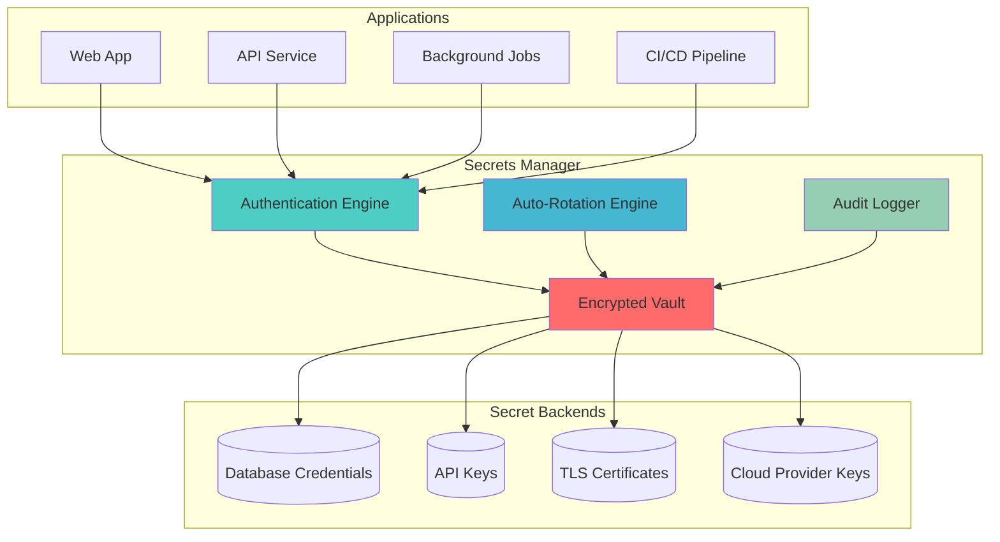
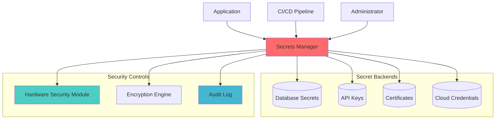

# Secrets Management

## The Complete Blueprint

Secrets Management transforms application security from a vulnerability nightmare into a centralized, auditable, and automated defense system. Instead of having API keys, database passwords, and certificates scattered across code, configuration files, and environment variables, this pattern consolidates all sensitive data into a secure vault with encrypted storage, automatic rotation, and granular access controls.

Think of it as a high-security bank vault for your digital credentials - only authorized applications can access specific secrets, every access is logged, credentials automatically expire and rotate, and if a breach occurs, you can instantly revoke access without touching your application code. Major breaches like the 2021 Codecov incident, which exposed 29,000+ customers' secrets through improper handling, demonstrate why centralized secrets management isn't optional for production systems.



### What You'll Master

- **Zero Hardcoded Secrets**: Eliminate credentials from code and configuration files
- **Dynamic Secret Generation**: Create temporary database passwords and API tokens on-demand
- **Automatic Rotation**: Implement scheduled credential rotation without downtime
- **Granular Access Control**: Define who can access what secrets based on roles and time windows
- **Compliance Automation**: Meet GDPR, SOX, and security audit requirements with automated logging

## Problem Statement

Applications require sensitive data like API keys, database passwords, certificates, and encryption keys. Hardcoding secrets in code or configuration files creates security vulnerabilities, compliance issues, and operational challenges.

**Real-World Impact**: The 2021 Codecov breach exposed 29,000+ customers' secrets due to improper secret handling, leading to secondary breaches across the software supply chain.

## Solution Overview

Secrets Management provides centralized, secure storage and distribution of sensitive data with:
- Encrypted storage with access controls
- Automatic rotation and expiration
- Audit logging and compliance reporting
- Dynamic secret generation
- Integration with application workflows



## Architecture Components

### 1. Secret Storage Engine
```yaml
Storage Types:
  Static Secrets:
    - API keys and tokens
    - Database passwords
    - Encryption keys
    - SSL/TLS certificates
  
  Dynamic Secrets:
    - Database credentials (generated on-demand)
    - Cloud IAM roles (temporary)
    - SSH keys (time-limited)
    - OAuth tokens (refreshable)

Encryption:
  - AES-256-GCM for data at rest
  - TLS 1.3 for data in transit
  - Hardware security modules (HSM)
  - Key derivation functions (KDF)
```

### 2. Access Control System
```yaml
Authentication Methods:
  - Kubernetes service accounts
  - AWS IAM roles
  - LDAP/Active Directory
  - Certificate-based authentication
  - Token-based authentication

Authorization Policies:
  - Path-based access control
  - Role-based permissions
  - Time-based access windows
  - IP address restrictions
  - Request rate limiting
```

### 3. Secret Lifecycle Management
```yaml
Rotation Strategies:
  - Automatic rotation (configurable intervals)
  - Event-triggered rotation (breach detection)
  - Manual rotation (emergency procedures)
  - Coordinated rotation (multi-service secrets)

Expiration Policies:
  - Time-based expiration
  - Usage-based expiration
  - Conditional expiration
  - Grace period handling
```

## Implementation Guide

### Phase 1: Core Infrastructure (Weeks 1-2)

1. **Deploy HashiCorp Vault**
```bash
## Install Vault on Kubernetes
helm repo add hashicorp https://helm.releases.hashicorp.com
helm install vault hashicorp/vault \
  --set="server.ha.enabled=true" \
  --set="server.ha.replicas=3" \
  --set="ui.enabled=true"

## Initialize and unseal Vault
kubectl exec vault-0 -- vault operator init
kubectl exec vault-0 -- vault operator unseal
```

2. **Configure Authentication**
```bash
## Enable Kubernetes auth method
vault auth enable kubernetes

## Configure Kubernetes auth
vault write auth/kubernetes/config \
    token_reviewer_jwt="$(cat /var/run/secrets/kubernetes.io/serviceaccount/token)" \
    kubernetes_host="https://kubernetes.default.svc.cluster.local" \
    kubernetes_ca_cert=@/var/run/secrets/kubernetes.io/serviceaccount/ca.crt
```

### Phase 2: Secret Backends (Weeks 3-4)

1. **Database Secret Engine**
```bash
## Enable database secret engine
vault secrets enable database

## Configure PostgreSQL connection
vault write database/config/postgresql \
    plugin_name=postgresql-database-plugin \
    connection_url="postgresql:/{{username}}:{{password}}@postgres:5432/mydb" \
    allowed_roles="readonly,readwrite" \
    username="vaultadmin" \
    password="secretpassword"

## Create dynamic role
vault write database/roles/readonly \
    db_name=postgresql \
    creation_statements="CREATE ROLE \"{{name}}\" WITH LOGIN PASSWORD '{{password}}' VALID UNTIL '{{expiration}}'; GRANT SELECT ON ALL TABLES IN SCHEMA public TO \"{{name}}\";"
    default_ttl="1h" \
    max_ttl="24h"
```

2. **PKI Secret Engine**
```bash
## Enable PKI engine
vault secrets enable pki

## Configure CA certificate
vault write pki/root/generate/internal \
    common_name="Company Internal CA" \
    ttl=87600h

## Configure certificate role
vault write pki/roles/server-cert \
    allowed_domains="company.com" \
    allow_subdomains=true \
    max_ttl="72h"
```

### Phase 3: Application Integration (Weeks 5-6)

1. **Vault Agent Configuration**
```yaml
apiVersion: v1
kind: ConfigMap
metadata:
  name: vault-agent-config
data:
  vault-agent.hcl: |
    pid_file = "/vault/config/pidfile"
    
    auto_auth {
      method "kubernetes" {
        config = {
          role = "myapp"
        }
      }
      
      sink "file" {
        config = {
          path = "/vault/secrets/.vault-token"
        }
      }
    }
    
    template {
      source = "/vault/templates/database.tpl"
      destination = "/vault/secrets/database.env"
      command = "sh -c 'kill -HUP $(pidof myapp)'"
    }
```

2. **Application Secret Injection**
```yaml
## Kubernetes Deployment with Vault Agent
apiVersion: apps/v1
kind: Deployment
metadata:
  name: myapp
spec:
  template:
    metadata:
      annotations:
        vault.hashicorp.com/agent-inject: "true"
        vault.hashicorp.com/role: "myapp"
        vault.hashicorp.com/agent-inject-secret-database: "database/creds/readonly"
        vault.hashicorp.com/agent-inject-template-database: |
          export DB_USERNAME="{{ .Data.username }}"
          export DB_PASSWORD="{{ .Data.password }}"
    spec:
      serviceAccountName: myapp
      containers:
      - name: myapp
        image: myapp:latest
        command: ["/bin/sh"]
        args: ["-c", "source /vault/secrets/database && exec /app/myapp"]
```

### Phase 4: Advanced Features (Weeks 7-8)

1. **Secret Rotation Automation**
```python
## Automated rotation script
import hvac
import schedule
import time

class SecretRotator:
    def __init__(self, vault_url, vault_token):
        self.client = hvac.Client(url=vault_url, token=vault_token)
    
    def rotate_database_secrets(self):
        # Get current secrets
        response = self.client.secrets.database.generate_credentials(
            name='readwrite'
        )
        
        new_credentials = response['data']
        
        # Update application configuration
        self.update_app_config(new_credentials)
        
        # Verify connectivity
        if self.verify_database_connection(new_credentials):
            print("Database secret rotation successful")
        else:
            print("Database secret rotation failed - rolling back")
            self.rollback_secrets()
    
    def schedule_rotations(self):
        schedule.every(24).hours.do(self.rotate_database_secrets)
        schedule.every(7).days.do(self.rotate_api_keys)
        schedule.every(30).days.do(self.rotate_certificates)
        
        while True:
            schedule.run_pending()
            time.sleep(3600)  # Check every hour

if __name__ == "__main__":
    rotator = SecretRotator(
        vault_url="https://vault.company.com",
        vault_token=os.environ['VAULT_TOKEN']
    )
    rotator.schedule_rotations()
```

2. **Compliance and Auditing**
```yaml
## Audit configuration
auditing:
  enabled: true
  backends:
    file:
      type: file
      path: /vault/logs/audit.log
    syslog:
      type: syslog
      facility: local0
  
  log_format: json
  log_raw: false
  hmac_accessor: true
  
  filters:
    - path: "sys/health"
      exclude: true
    - path: "auth/kubernetes/login"
      exclude_request_keys: ["password"]
```

## Real-World Examples

### Uber Implementation
```yaml
Scale: 4000+ services, 100K+ secrets
Components:
  - Multi-region Vault cluster
  - Custom secret injection system
  - Automated rotation for 95% of secrets
  - Integration with CI/CD pipelines

Results:
  - 99.99% secret availability
  - 95% reduction in credential-related incidents
  - 60% faster application deployment
  - 100% audit compliance
```

### Airbnb Implementation
```yaml
Scale: 1000+ services, 50K+ secrets
Components:
  - HashiCorp Vault with Consul backend
  - Custom Kubernetes operators
  - Integration with identity providers
  - Automated certificate management

Results:
  - Zero hardcoded secrets in production
  - 30-second average secret retrieval
  - 80% reduction in security incidents
  - 50% faster incident response
```

## Metrics and Success Criteria

### Security Metrics
```yaml
Secret Security:
  - Hardcoded secrets in code: 0
  - Secret exposure incidents: <1 per quarter
  - Rotation compliance: >95%
  - Audit trail completeness: 100%

Access Control:
  - Unauthorized access attempts: <0.1%
  - Policy violations: 0
  - Authentication success rate: >99.9%
  - Token expiry compliance: >98%

Operational Metrics:
  - Secret retrieval latency: <100ms p95
  - Vault availability: >99.9%
  - Rotation success rate: >99%
  - Mean time to rotate: <5 minutes
```

### Cost Impact Analysis
```yaml
Implementation Costs:
  - Vault Enterprise license: $100K-500K annually
  - Implementation services: $200K-500K
  - Operations and maintenance: $150K-300K annually

Cost Savings:
  - Security incident prevention: $1.5M+ per avoided breach
  - Compliance automation: 40% reduction in audit costs
  - Developer productivity: 20% faster deployment cycles
  - Operational efficiency: 30% reduction in secret-related tickets

ROI Timeline: 6-12 months
```

## Common Pitfalls and Solutions

### 1. Secret Sprawl
**Problem**: Secrets stored in multiple locations
**Solution**:
```yaml
Consolidation Strategy:
  - Inventory existing secret stores
  - Implement gradual migration plan
  - Use automation for bulk migration
  - Establish governance policies

Governance Policies:
  - All secrets must use centralized store
  - Regular secret audits and cleanup
  - Automated compliance checking
  - Training and awareness programs
```

### 2. Application Downtime During Rotation
**Problem**: Service interruption when secrets change
**Solution**:
```yaml
Zero-Downtime Rotation:
  - Blue-green secret deployment
  - Rolling update strategies
  - Connection pooling with graceful refresh
  - Circuit breaker patterns

Fallback Strategies:
  - Grace period for old secrets
  - Emergency rollback procedures
  - Health check integration
  - Monitoring and alerting
```

### 3. Performance Impact
**Problem**: Latency from secret retrieval
**Solution**:
```yaml
Performance Optimization:
  - Local secret caching
  - Batch secret retrieval
  - Connection pooling
  - Geographic distribution

Caching Strategies:
  - Memory-based caching (5-15 minute TTL)
  - Encrypted disk caching for long-running processes
  - Cache invalidation on rotation
  - Fallback to direct retrieval
```

## Migration Strategy

### From Environment Variables
```yaml
Phase 1 (Assessment):
  - Scan codebases for hardcoded secrets
  - Identify secret types and usage patterns
  - Assess rotation requirements
  - Plan migration priorities

Phase 2 (Gradual Migration):
  - Start with new applications
  - Migrate non-critical secrets first
  - Implement secret injection patterns
  - Test rotation procedures

Phase 3 (Full Migration):
  - Migrate all production secrets
  - Remove environment variable secrets
  - Implement monitoring and alerting
  - Train operations teams
```

## Related Patterns

- **Complementary**: [Zero-Trust Architecture](zero-trust-architecture.md) - Identity-based access control
- **Complementary**: [API Security Gateway](api-security-gateway.md) - Secure API key management
- **Complementary**: [Security Scanning Pipeline](security-scanning-pipeline.md) - Secret detection in code
- **Building Block**: Service mesh for secure secret distribution
- **Alternative**: Cloud-native secret stores (AWS Secrets Manager, Azure Key Vault)

## Further Reading

- [HashiCorp Vault Documentation](https://www.vaultproject.io/docs.md)
- [NIST Cybersecurity Framework](https://www.nist.gov/cyberframework.md)
- [OWASP Secrets Management Cheat Sheet](https://cheatsheetseries.owasp.org/cheatsheets/Secrets_Management_Cheat_Sheet.html.md)
- [Google Secret Manager Best Practices](https://cloud.google.com/secret-manager/docs/best-practices.md)
