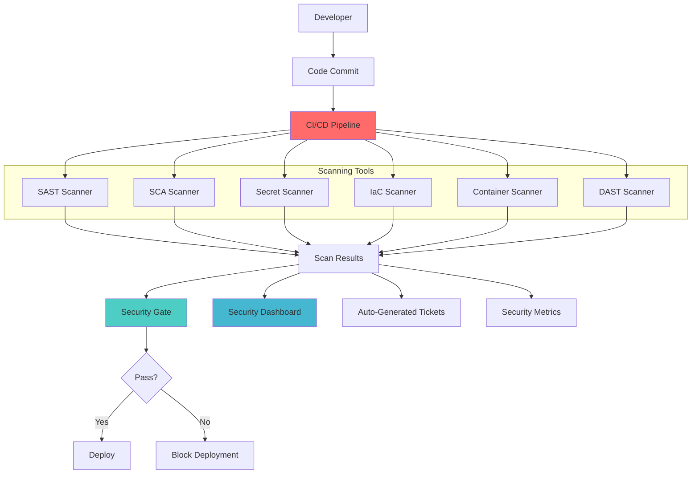

# Security Scanning Pipeline

## Problem Statement

Manual security reviews and periodic security assessments cannot keep pace with modern development velocities. Vulnerabilities introduced during development often remain undetected until production, leading to security incidents, compliance violations, and costly remediation efforts.

**Real-World Impact**: The 2017 Equifax breach exploited a known vulnerability in Apache Struts that could have been detected by automated scanning, affecting 147M+ people and costing $1.4B+ in remediation.

## Solution Overview

Security Scanning Pipeline provides automated, continuous security validation through:
- Static Application Security Testing (SAST)
- Dynamic Application Security Testing (DAST)
- Software Composition Analysis (SCA)
- Infrastructure as Code (IaC) security scanning
- Container image vulnerability scanning
- Secrets detection and prevention



## Architecture Components

### 1. Static Analysis Tools
```yaml
SAST (Static Application Security Testing):
  - Code vulnerability analysis
  - Security anti-pattern detection
  - Compliance rule checking
  - Custom rule configuration
  
Tools:
  - SonarQube Security Hotspots
  - Checkmarx CxSAST
  - Veracode Static Analysis
  - CodeQL (GitHub Advanced Security)
  - Semgrep (open source)

Supported Languages:
  - Java, C#, Python, JavaScript, TypeScript
  - Go, Rust, PHP, Ruby, Swift
  - SQL, HTML, XML, YAML
```

### 2. Dependency Analysis
```yaml
SCA (Software Composition Analysis):
  - Open source vulnerability detection
  - License compliance checking
  - Dependency risk assessment
  - Supply chain security analysis

Tools:
  - Snyk
  - WhiteSource (Mend)
  - Black Duck
  - OWASP Dependency-Check
  - GitHub Dependabot

Vulnerability Sources:
  - National Vulnerability Database (NVD)
  - GitHub Security Advisory Database
  - Vendor-specific databases
  - Security research feeds
```

### 3. Dynamic Testing
```yaml
DAST (Dynamic Application Security Testing):
  - Runtime vulnerability detection
  - API security testing
  - Authentication/authorization testing
  - Input validation testing

Tools:
  - OWASP ZAP
  - Burp Suite Enterprise
  - Rapid7 InsightAppSec
  - Checkmarx CxDAST
  - Acunetix

Test Categories:
  - OWASP Top 10 vulnerabilities
  - Business logic flaws
  - Session management issues
  - Configuration vulnerabilities
```

## Implementation Guide

### Phase 1: Foundation Setup (Weeks 1-2)

1. **Pipeline Infrastructure**
```yaml
# GitLab CI security pipeline
stages:
  - build
  - security-scan
  - deploy

security-sast:
  stage: security-scan
  image: registry.gitlab.com/gitlab-org/security-products/analyzers/semgrep
  script:
    - semgrep --config=auto --json --output=sast-report.json .
  artifacts:
    reports:
      sast: sast-report.json
    expire_in: 1 week
  rules:
    - if: $CI_COMMIT_BRANCH

security-dependency:
  stage: security-scan
  image: owasp/dependency-check:latest
  script:
    - dependency-check --scan . --format JSON --out dependency-report.json
  artifacts:
    reports:
      dependency_scanning: dependency-report.json
    expire_in: 1 week

security-secrets:
  stage: security-scan
  image: trufflesecurity/trufflehog:latest
  script:
    - trufflehog filesystem . --json > secrets-report.json
  artifacts:
    reports:
      secret_detection: secrets-report.json
    expire_in: 1 week
```

2. **Security Gate Configuration**
```python
# Security gate implementation
import json
from typing import Dict, List, Tuple
from enum import Enum

class SeverityLevel(Enum):
    CRITICAL = "critical"
    HIGH = "high"
    MEDIUM = "medium"
    LOW = "low"
    INFO = "info"

class SecurityGate:
    def __init__(self, config: Dict):
        self.thresholds = config.get('thresholds', {})
        self.blocking_rules = config.get('blocking_rules', {})
        self.exceptions = config.get('exceptions', [])
    
    def evaluate_scan_results(self, scan_results: Dict) -> Tuple[bool, List[str]]:
        """
        Evaluate scan results against security gate criteria
        Returns: (should_pass, violations)
        """
        violations = []
        should_pass = True
        
        # Check SAST results
        if 'sast' in scan_results:
            sast_violations = self._check_sast_results(scan_results['sast'])
            violations.extend(sast_violations)
        
        # Check dependency vulnerabilities
        if 'dependencies' in scan_results:
            dep_violations = self._check_dependency_results(scan_results['dependencies'])
            violations.extend(dep_violations)
        
        # Check secrets detection
        if 'secrets' in scan_results:
            secret_violations = self._check_secrets_results(scan_results['secrets'])
            violations.extend(secret_violations)
        
        # Check container vulnerabilities
        if 'container' in scan_results:
            container_violations = self._check_container_results(scan_results['container'])
            violations.extend(container_violations)
        
        # Apply blocking rules
        blocking_violations = [v for v in violations if self._is_blocking_violation(v)]
        
        if blocking_violations:
            should_pass = False
        
        return should_pass, violations
    
    def _check_sast_results(self, sast_results: Dict) -> List[str]:
        violations = []
        severity_counts = self._count_by_severity(sast_results.get('vulnerabilities', []))
        
        for severity, count in severity_counts.items():
            threshold = self.thresholds.get('sast', {}).get(severity, float('inf'))
            if count > threshold:
                violations.append(f"SAST: {count} {severity} vulnerabilities exceed threshold of {threshold}")
        
        return violations
    
    def _is_blocking_violation(self, violation: str) -> bool:
        for rule in self.blocking_rules:
            if rule.get('type') == 'severity' and rule.get('level') in violation.lower():
                return True
            if rule.get('type') == 'category' and rule.get('category') in violation.lower():
                return True
        return False

# Example usage
config = {
    'thresholds': {
        'sast': {
            'critical': 0,
            'high': 2,
            'medium': 10
        },
        'dependencies': {
            'critical': 0,
            'high': 1
        }
    },
    'blocking_rules': [
        {'type': 'severity', 'level': 'critical'},
        {'type': 'category', 'category': 'secrets'}
    ]
}

gate = SecurityGate(config)
```

### Phase 2: Tool Integration (Weeks 3-4)

1. **SAST Integration**
```yaml
# SonarQube integration
sonarqube-scan:
  stage: security-scan
  image: sonarqube:latest
  script:
    - sonar-scanner \
        -Dsonar.projectKey=$CI_PROJECT_NAME \
        -Dsonar.sources=src \
        -Dsonar.host.url=$SONAR_HOST_URL \
        -Dsonar.login=$SONAR_TOKEN \
        -Dsonar.qualitygate.wait=true
  variables:
    SONAR_USER_HOME: "${CI_PROJECT_DIR}/.sonar"
    GIT_DEPTH: "0"
  cache:
    key: "${CI_JOB_NAME}"
    paths:
      - .sonar/cache
  rules:
    - if: $CI_COMMIT_BRANCH == $CI_DEFAULT_BRANCH
```

2. **Container Scanning**
```bash
#!/bin/bash
# Container vulnerability scanning script

IMAGE_NAME=$1
REPORT_FILE="container-scan-report.json"

# Scan with Trivy
trivy image --format json --output $REPORT_FILE $IMAGE_NAME

# Parse results and apply policy
python3 << EOF
import json

with open('$REPORT_FILE', 'r') as f:
    results = json.load(f)

critical_count = 0
high_count = 0

for result in results.get('Results', []):
    for vuln in result.get('Vulnerabilities', []):
        severity = vuln.get('Severity', '').lower()
        if severity == 'critical':
            critical_count += 1
        elif severity == 'high':
            high_count += 1

print(f"Found {critical_count} critical and {high_count} high severity vulnerabilities")

if critical_count > 0:
    print("FAIL: Critical vulnerabilities found")
    exit(1)
elif high_count > 5:
    print("FAIL: Too many high severity vulnerabilities")
    exit(1)
else:
    print("PASS: Container security scan passed")
    exit(0)
EOF
```

### Phase 3: Advanced Automation (Weeks 5-6)

1. **Automated Remediation**
```python
# Automated vulnerability remediation
import requests
import json
from typing import Dict, List

class AutoRemediation:
    def __init__(self, github_token: str, jira_token: str):
        self.github_token = github_token
        self.jira_token = jira_token
    
    def process_vulnerability(self, vulnerability: Dict) -> str:
        """
        Process vulnerability and attempt automated remediation
        Returns: action_taken
        """
        vuln_type = vulnerability.get('type')
        severity = vulnerability.get('severity')
        
        if vuln_type == 'dependency' and severity in ['critical', 'high']:
            return self._update_dependency(vulnerability)
        elif vuln_type == 'secret':
            return self._handle_secret_exposure(vulnerability)
        elif vuln_type == 'code' and severity == 'critical':
            return self._create_urgent_ticket(vulnerability)
        else:
            return self._create_standard_ticket(vulnerability)
    
    def _update_dependency(self, vulnerability: Dict) -> str:
        package_name = vulnerability.get('package')
        current_version = vulnerability.get('current_version')
        fixed_version = vulnerability.get('fixed_version')
        
        if not fixed_version:
            return self._create_urgent_ticket(vulnerability)
        
        # Create pull request with dependency update
        pr_data = {
            "title": f"Security: Update {package_name} to {fixed_version}",
            "body": f"""## Security Update
            
            **Vulnerability**: {vulnerability.get('title')}
            **Severity**: {vulnerability.get('severity')}
            **Current Version**: {current_version}
            **Fixed Version**: {fixed_version}
            
            This PR was automatically generated to address a security vulnerability.
            
            **CVSS Score**: {vulnerability.get('cvss_score')}
            **CVE**: {vulnerability.get('cve_id')}
            """,
            "head": f"security/update-{package_name}",
            "base": "main"
        }
        
        response = self._create_github_pr(pr_data)
        return f"Created PR #{response.get('number')} for dependency update"
    
    def _handle_secret_exposure(self, vulnerability: Dict) -> str:
        # Immediately revoke the exposed secret
        secret_type = vulnerability.get('secret_type')
        secret_value = vulnerability.get('secret_value')
        
        if secret_type == 'github_token':
            self._revoke_github_token(secret_value)
        elif secret_type == 'aws_key':
            self._revoke_aws_key(secret_value)
        
        # Create urgent ticket for investigation
        ticket = self._create_urgent_ticket(vulnerability)
        
        # Send alert to security team
        self._send_security_alert(vulnerability)
        
        return f"Revoked secret and created urgent ticket: {ticket}"
    
    def _create_urgent_ticket(self, vulnerability: Dict) -> str:
        ticket_data = {
            "fields": {
                "project": {"key": "SEC"},
                "summary": f"URGENT: {vulnerability.get('title')}",
                "description": self._format_vulnerability_description(vulnerability),
                "issuetype": {"name": "Bug"},
                "priority": {"name": "Critical"},
                "labels": ["security", "urgent", vulnerability.get('type')]
            }
        }
        
        response = requests.post(
            f"{self.jira_base_url}/rest/api/2/issue",
            headers={"Authorization": f"Bearer {self.jira_token}"},
            json=ticket_data
        )
        
        return response.json().get('key')
```

2. **Security Metrics Dashboard**
```python
# Security metrics collection
import time
from dataclasses import dataclass
from typing import Dict, List
from datetime import datetime, timedelta

@dataclass
class SecurityMetrics:
    timestamp: datetime
    total_scans: int
    vulnerabilities_found: Dict[str, int]  # severity -> count
    vulnerabilities_fixed: Dict[str, int]
    scan_duration: float
    false_positives: int
    security_gate_failures: int

class SecurityMetricsCollector:
    def __init__(self):
        self.metrics_history: List[SecurityMetrics] = []
    
    def collect_pipeline_metrics(self, pipeline_results: Dict) -> SecurityMetrics:
        metrics = SecurityMetrics(
            timestamp=datetime.now(),
            total_scans=1,
            vulnerabilities_found=self._count_vulnerabilities(pipeline_results),
            vulnerabilities_fixed={},  # Will be updated later
            scan_duration=pipeline_results.get('duration', 0),
            false_positives=pipeline_results.get('false_positives', 0),
            security_gate_failures=1 if not pipeline_results.get('passed', True) else 0
        )
        
        self.metrics_history.append(metrics)
        return metrics
    
    def generate_security_report(self, days: int = 30) -> Dict:
        cutoff_date = datetime.now() - timedelta(days=days)
        recent_metrics = [
            m for m in self.metrics_history 
            if m.timestamp >= cutoff_date
        ]
        
        if not recent_metrics:
            return {"error": "No metrics available for the specified period"}
        
        total_vulnerabilities = sum(
            sum(m.vulnerabilities_found.values()) for m in recent_metrics
        )
        total_scans = sum(m.total_scans for m in recent_metrics)
        
        return {
            "period_days": days,
            "total_scans": total_scans,
            "total_vulnerabilities": total_vulnerabilities,
            "average_vulnerabilities_per_scan": total_vulnerabilities / total_scans if total_scans > 0 else 0,
            "vulnerability_trends": self._calculate_trends(recent_metrics),
            "scan_performance": {
                "average_duration": sum(m.scan_duration for m in recent_metrics) / len(recent_metrics),
                "gate_failure_rate": sum(m.security_gate_failures for m in recent_metrics) / total_scans * 100
            }
        }
```

### Phase 4: Advanced Features (Weeks 7-8)

1. **ML-Based False Positive Reduction**
```python
# Machine learning for false positive detection
import pandas as pd
from sklearn.ensemble import RandomForestClassifier
from sklearn.feature_extraction.text import TfidfVectorizer
import joblib

class FalsePositiveDetector:
    def __init__(self):
        self.model = None
        self.vectorizer = None
        self.trained = False
    
    def train_model(self, training_data: pd.DataFrame):
        """
        Train ML model on historical vulnerability data
        training_data should have columns: vulnerability_text, is_false_positive
        """
        # Feature extraction
        features = self._extract_features(training_data)
        
        # Prepare text features
        self.vectorizer = TfidfVectorizer(max_features=1000, stop_words='english')
        text_features = self.vectorizer.fit_transform(training_data['vulnerability_text'])
        
        # Combine features
        X = pd.concat([features, pd.DataFrame(text_features.toarray())], axis=1)
        y = training_data['is_false_positive']
        
        # Train model
        self.model = RandomForestClassifier(n_estimators=100, random_state=42)
        self.model.fit(X, y)
        
        self.trained = True
        
        # Save model
        joblib.dump(self.model, 'false_positive_model.pkl')
        joblib.dump(self.vectorizer, 'vectorizer.pkl')
    
    def predict_false_positive(self, vulnerability: Dict) -> float:
        """
        Predict probability that vulnerability is a false positive
        Returns probability between 0 and 1
        """
        if not self.trained:
            return 0.0  # Conservative approach
        
        features = self._extract_single_vulnerability_features(vulnerability)
        text_features = self.vectorizer.transform([vulnerability.get('description', '')])
        
        X = pd.concat([features, pd.DataFrame(text_features.toarray())], axis=1)
        probability = self.model.predict_proba(X)[0][1]  # Probability of being false positive
        
        return probability
    
    def _extract_features(self, data: pd.DataFrame) -> pd.DataFrame:
        features = pd.DataFrame()
        features['severity_score'] = data['severity'].map({
            'critical': 4, 'high': 3, 'medium': 2, 'low': 1, 'info': 0
        })
        features['has_cve'] = data['cve_id'].notna().astype(int)
        features['tool_confidence'] = data['confidence'].fillna(0.5)
        features['line_count'] = data['affected_lines'].fillna(1)
        
        return features
```

## Real-World Examples

### GitLab Implementation
```yaml
Scale: 1000+ projects, 50K+ scans/month
Components:
  - Integrated security scanner suite
  - Custom vulnerability management
  - Automated dependency updates
  - Security dashboard and reporting

Results:
  - 85% reduction in time to detect vulnerabilities
  - 70% fewer security incidents in production
  - 90% of critical vulnerabilities fixed within 24 hours
  - 50% reduction in false positive reports
```

### Microsoft Implementation
```yaml
Scale: 10K+ repositories, 1M+ scans/month
Components:
  - Azure DevOps security extensions
  - Custom SAST/DAST tools
  - AI-powered threat detection
  - Automated remediation bots

Results:
  - 95% of vulnerabilities caught before production
  - 60% reduction in security review time
  - 80% automated vulnerability remediation
  - $5M+ saved in manual security testing
```

## Metrics and Success Criteria

### Security Metrics
```yaml
Vulnerability Detection:
  - Vulnerability detection rate: >95%
  - Time to detection: <24 hours
  - False positive rate: <10%
  - Critical vulnerability escape rate: <1%

Remediation Efficiency:
  - Mean time to remediation (critical): <24 hours
  - Mean time to remediation (high): <7 days
  - Automated remediation rate: >60%
  - Remediation success rate: >95%

Pipeline Performance:
  - Scan completion rate: >99%
  - Security gate accuracy: >98%
  - Pipeline blocking false positive rate: <2%
  - Developer satisfaction score: >4/5
```

### Cost Impact Analysis
```yaml
Implementation Costs:
  - Tool licensing and subscriptions: $200K-1M annually
  - Implementation and integration: $500K-2M
  - Training and adoption: $100K-300K
  - Operations and maintenance: $200K-500K annually

Cost Savings:
  - Security incident prevention: $1.76M average per avoided breach
  - Manual security testing reduction: 70% cost savings
  - Faster vulnerability remediation: 50% time savings
  - Compliance automation: 40% audit cost reduction

ROI Timeline: 6-9 months
```

## Common Pitfalls and Solutions

### 1. Tool Fatigue and Alert Overload
**Problem**: Too many tools generating excessive alerts
**Solution**:
```yaml
Alert Management:
  - Consolidate similar vulnerabilities
  - Implement intelligent deduplication
  - Priority-based alerting
  - Context-aware notifications

Tool Rationalization:
  - Regular tool effectiveness review
  - Consolidate overlapping capabilities
  - Focus on high-value, low-noise tools
  - Implement unified reporting
```

### 2. False Positive Management
**Problem**: High false positive rates reduce trust and effectiveness
**Solution**:
```yaml
False Positive Reduction:
  - Implement ML-based filtering
  - Maintain suppression databases
  - Regular rule tuning and updates
  - Community-driven rule improvements

Feedback Loops:
  - Developer feedback collection
  - Regular accuracy assessments
  - Tool configuration optimization
  - Custom rule development
```

### 3. Pipeline Performance Impact
**Problem**: Security scans slow down development velocity
**Solution**:
```yaml
Performance Optimization:
  - Parallel scan execution
  - Incremental scanning
  - Caching of scan results
  - Smart scan scheduling

Developer Experience:
  - Fast feedback loops
  - IDE integration
  - Pre-commit hooks
  - Clear remediation guidance
```

## Related Patterns

- **Complementary**: [Zero-Trust Architecture](zero-trust-architecture/) - Runtime security validation
- **Complementary**: [Secrets Management](secrets-management/) - Preventing secret leaks
- **Building Block**: CI/CD pipeline for automation
- **Extension**: Security monitoring for production workloads
- **Alternative**: Manual security reviews (not scalable)

## Further Reading

- [OWASP DevSecOps Guideline](https://owasp.org/www-project-devsecops-guideline/)
- [NIST Secure Software Development Framework](https://csrc.nist.gov/Projects/ssdf)
- [GitHub Security Lab](https://securitylab.github.com/)
- [SANS Secure Coding Practices](https://www.sans.org/white-papers/2172/)
