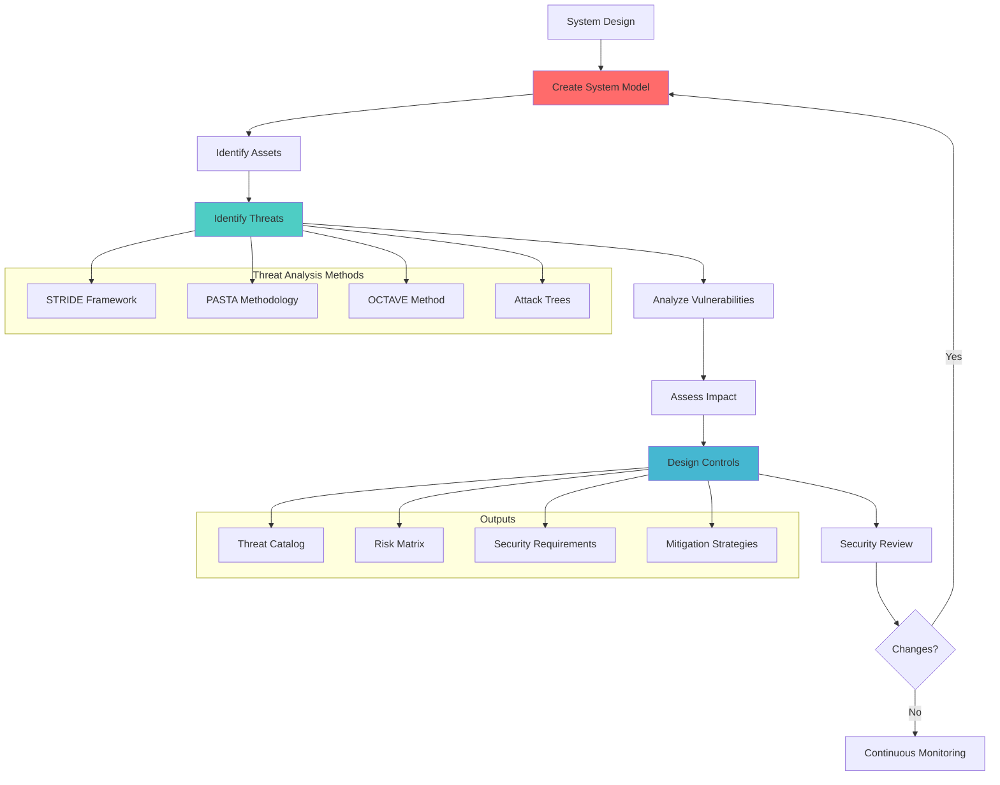

# Threat Modeling

## Problem Statement

Building secure systems requires understanding potential attack vectors and security vulnerabilities before implementation. Ad-hoc security considerations often miss critical threats, leading to expensive post-deployment security fixes and potential security breaches.

**Real-World Impact**: The 2013 Target breach could have been prevented through proper threat modeling of payment card systems, affecting 40M+ customers and costing $292M+ in remediation.

## Solution Overview

Threat Modeling provides systematic security analysis through:
- Structured threat identification methodologies
- Risk assessment and prioritization
- Security control design and validation
- Continuous threat landscape analysis
- Integration with development workflows



## Architecture Components

### 1. System Modeling
```yaml
Data Flow Diagrams (DFD):
  - External entities (users, systems)
  - Processes (business logic)
  - Data stores (databases, caches)
  - Data flows (communication paths)
  - Trust boundaries (security perimeters)

Architectural Views:
  - Logical architecture
  - Physical deployment
  - Network topology
  - Component interactions
  - Security boundaries

Asset Classification:
  - Data assets (PII, financial, IP)
  - System assets (servers, databases)
  - Process assets (business logic)
  - Network assets (connections, protocols)
```

### 2. Threat Analysis Methods
```yaml
STRIDE Framework:
  - Spoofing (identity)
  - Tampering (data integrity)
  - Repudiation (non-repudiation)
  - Information Disclosure (confidentiality)
  - Denial of Service (availability)
  - Elevation of Privilege (authorization)

PASTA (Process for Attack Simulation):
  - Define objectives
  - Define technical scope
  - Application decomposition
  - Threat analysis
  - Weakness analysis
  - Attack modeling
  - Risk impact analysis

Attack Trees:
  - Goal-oriented threat modeling
  - Hierarchical attack scenarios
  - Attack path analysis
  - Cost-benefit analysis of attacks
```

### 3. Risk Assessment Framework
```yaml
Risk Calculation:
  Risk = Likelihood × Impact × Exploitability
  
Likelihood Factors:
  - Threat agent capability
  - Threat agent motivation
  - Control effectiveness
  - Historical attack data

Impact Categories:
  - Financial impact
  - Operational impact
  - Reputation impact
  - Legal/compliance impact
  - Technical impact

Risk Ratings:
  - Critical (9-10): Immediate action required
  - High (7-8): Action required within 30 days
  - Medium (5-6): Action required within 90 days
  - Low (3-4): Monitor and review
  - Minimal (1-2): Accept risk
```

## Implementation Guide

### Phase 1: Foundation Setup (Weeks 1-2)

1. **Establish Threat Modeling Process**
```yaml
# Threat modeling workflow
process:
  trigger_events:
    - New system design
    - Major architecture changes
    - New technology adoption
    - Security incident lessons learned
  
  participants:
    - Security architect
    - System architect
    - Development team lead
    - Product owner
    - Security engineer
  
  deliverables:
    - System model diagrams
    - Threat catalog
    - Risk assessment matrix
    - Security requirements
    - Mitigation action plan
  
  review_cycle:
    - Initial review: Within 2 weeks of design
    - Updates: On significant changes
    - Periodic review: Quarterly
    - Post-incident review: After security events
```

2. **Create System Model Template**
```python
# System modeling framework
from dataclasses import dataclass
from typing import List, Dict, Optional
from enum import Enum

class TrustLevel(Enum):
    UNTRUSTED = "untrusted"
    PARTIALLY_TRUSTED = "partially_trusted"
    TRUSTED = "trusted"
    FULLY_TRUSTED = "fully_trusted"

class AssetType(Enum):
    DATA = "data"
    SYSTEM = "system"
    PROCESS = "process"
    NETWORK = "network"

@dataclass
class Asset:
    name: str
    asset_type: AssetType
    description: str
    sensitivity_level: str  # public, internal, confidential, secret
    business_value: int  # 1-10 scale
    technical_value: int  # 1-10 scale

@dataclass
class TrustBoundary:
    name: str
    description: str
    trust_level: TrustLevel
    security_controls: List[str]

@dataclass
class DataFlow:
    source: str
    destination: str
    data_description: str
    protocol: str
    encryption: bool
    authentication_required: bool
    crosses_trust_boundary: bool
    trust_boundary: Optional[str] = None

@dataclass
class SystemComponent:
    name: str
    component_type: str  # web_server, database, api, etc.
    description: str
    trust_boundary: str
    assets: List[Asset]
    incoming_flows: List[DataFlow]
    outgoing_flows: List[DataFlow]
    security_controls: List[str]

class SystemModel:
    def __init__(self, system_name: str):
        self.system_name = system_name
        self.components: List[SystemComponent] = []
        self.trust_boundaries: List[TrustBoundary] = []
        self.data_flows: List[DataFlow] = []
        self.assets: List[Asset] = []
    
    def add_component(self, component: SystemComponent):
        self.components.append(component)
        self.assets.extend(component.assets)
    
    def add_trust_boundary(self, boundary: TrustBoundary):
        self.trust_boundaries.append(boundary)
    
    def get_high_value_assets(self, threshold: int = 7) -> List[Asset]:
        return [
            asset for asset in self.assets 
            if max(asset.business_value, asset.technical_value) >= threshold
        ]
    
    def get_cross_boundary_flows(self) -> List[DataFlow]:
        return [flow for flow in self.data_flows if flow.crosses_trust_boundary]
```

### Phase 2: STRIDE Analysis (Weeks 3-4)

1. **STRIDE Threat Assessment**
```python
# STRIDE-based threat analysis
from enum import Enum
from dataclasses import dataclass
from typing import List, Dict

class STRIDECategory(Enum):
    SPOOFING = "spoofing"
    TAMPERING = "tampering"
    REPUDIATION = "repudiation"
    INFORMATION_DISCLOSURE = "information_disclosure"
    DENIAL_OF_SERVICE = "denial_of_service"
    ELEVATION_OF_PRIVILEGE = "elevation_of_privilege"

@dataclass
class Threat:
    id: str
    title: str
    description: str
    stride_category: STRIDECategory
    affected_component: str
    affected_asset: str
    attack_vector: str
    likelihood: int  # 1-10 scale
    impact: int  # 1-10 scale
    risk_score: float
    mitigation_status: str  # identified, planned, implemented, verified
    mitigations: List[str]

class STRIDEThreatAnalyzer:
    def __init__(self, system_model: SystemModel):
        self.system_model = system_model
        self.threats: List[Threat] = []
        self.threat_templates = self._load_threat_templates()
    
    def analyze_component_threats(self, component: SystemComponent) -> List[Threat]:
        component_threats = []
        
        # Check for spoofing threats
        if not self._has_authentication(component):
            threat = Threat(
                id=f"{component.name}_SPOOF_001",
                title=f"Identity Spoofing in {component.name}",
                description=f"Attacker could impersonate legitimate user/system to access {component.name}",
                stride_category=STRIDECategory.SPOOFING,
                affected_component=component.name,
                affected_asset="user_identity",
                attack_vector="credential_theft",
                likelihood=self._assess_likelihood(component, "spoofing"),
                impact=self._assess_impact(component.assets),
                risk_score=0,  # Will be calculated
                mitigation_status="identified",
                mitigations=["implement_strong_authentication", "multi_factor_authentication"]
            )
            component_threats.append(threat)
        
        # Check for tampering threats
        if not self._has_integrity_protection(component):
            threat = Threat(
                id=f"{component.name}_TAMP_001",
                title=f"Data Tampering in {component.name}",
                description=f"Attacker could modify data in transit or at rest in {component.name}",
                stride_category=STRIDECategory.TAMPERING,
                affected_component=component.name,
                affected_asset="data_integrity",
                attack_vector="man_in_the_middle",
                likelihood=self._assess_likelihood(component, "tampering"),
                impact=self._assess_impact(component.assets),
                risk_score=0,
                mitigation_status="identified",
                mitigations=["implement_encryption", "digital_signatures", "integrity_checks"]
            )
            component_threats.append(threat)
        
        # Calculate risk scores
        for threat in component_threats:
            threat.risk_score = self._calculate_risk_score(threat)
        
        self.threats.extend(component_threats)
        return component_threats
    
    def _calculate_risk_score(self, threat: Threat) -> float:
        # Risk = Likelihood × Impact × Exploitability
        exploitability = self._assess_exploitability(threat)
        return (threat.likelihood * threat.impact * exploitability) / 1000
    
    def _assess_exploitability(self, threat: Threat) -> float:
        # Factors affecting exploitability
        base_exploitability = 5.0
        
        # Adjust based on attack vector complexity
        complexity_factors = {
            "credential_theft": 1.2,
            "man_in_the_middle": 0.8,
            "code_injection": 1.5,
            "privilege_escalation": 0.6
        }
        
        multiplier = complexity_factors.get(threat.attack_vector, 1.0)
        return base_exploitability * multiplier
    
    def generate_threat_report(self) -> Dict:
        high_risk_threats = [t for t in self.threats if t.risk_score >= 7.0]
        medium_risk_threats = [t for t in self.threats if 4.0 <= t.risk_score < 7.0]
        low_risk_threats = [t for t in self.threats if t.risk_score < 4.0]
        
        return {
            "summary": {
                "total_threats": len(self.threats),
                "high_risk": len(high_risk_threats),
                "medium_risk": len(medium_risk_threats),
                "low_risk": len(low_risk_threats)
            },
            "threats_by_category": self._group_threats_by_category(),
            "mitigation_recommendations": self._generate_mitigation_recommendations(),
            "security_requirements": self._generate_security_requirements()
        }
```

### Phase 3: Attack Tree Analysis (Weeks 5-6)

1. **Attack Tree Modeling**
```python
# Attack tree implementation
from typing import List, Optional, Dict
from dataclasses import dataclass
from enum import Enum

class NodeType(Enum):
    AND = "and"
    OR = "or"
    LEAF = "leaf"

@dataclass
class AttackNode:
    name: str
    description: str
    node_type: NodeType
    cost: float  # Attacker effort/resources required
    probability: float  # Likelihood of success (0-1)
    detection_probability: float  # Likelihood of being detected (0-1)
    children: Optional[List['AttackNode']] = None
    mitigations: Optional[List[str]] = None

class AttackTree:
    def __init__(self, root: AttackNode):
        self.root = root
    
    def calculate_attack_probability(self, node: AttackNode = None) -> float:
        """
        Calculate the overall probability of attack success
        """
        if node is None:
            node = self.root
        
        if node.node_type == NodeType.LEAF:
            return node.probability
        
        if not node.children:
            return 0.0
        
        child_probabilities = [
            self.calculate_attack_probability(child) 
            for child in node.children
        ]
        
        if node.node_type == NodeType.AND:
            # All children must succeed
            return min(child_probabilities) if child_probabilities else 0.0
        elif node.node_type == NodeType.OR:
            # At least one child must succeed
            # P(A or B) = P(A) + P(B) - P(A and B)
            # Simplified: 1 - (1-P(A)) * (1-P(B)) * ...
            failure_prob = 1.0
            for prob in child_probabilities:
                failure_prob *= (1.0 - prob)
            return 1.0 - failure_prob
        
        return 0.0
    
    def calculate_attack_cost(self, node: AttackNode = None) -> float:
        """
        Calculate minimum cost for successful attack
        """
        if node is None:
            node = self.root
        
        if node.node_type == NodeType.LEAF:
            return node.cost
        
        if not node.children:
            return float('inf')
        
        child_costs = [
            self.calculate_attack_cost(child) 
            for child in node.children
        ]
        
        if node.node_type == NodeType.AND:
            # Must execute all children
            return sum(child_costs)
        elif node.node_type == NodeType.OR:
            # Choose cheapest path
            return min(child_costs) if child_costs else float('inf')
        
        return float('inf')
    
    def identify_critical_paths(self) -> List[List[str]]:
        """
        Identify the most likely attack paths
        """
        paths = []
        self._find_paths(self.root, [], paths)
        
        # Sort by probability (descending)
        path_probabilities = []
        for path in paths:
            prob = self._calculate_path_probability(path)
            path_probabilities.append((path, prob))
        
        path_probabilities.sort(key=lambda x: x[1], reverse=True)
        return [path for path, _ in path_probabilities[:5]]  # Top 5 paths
    
    def _find_paths(self, node: AttackNode, current_path: List[str], all_paths: List[List[str]]):
        current_path = current_path + [node.name]
        
        if node.node_type == NodeType.LEAF:
            all_paths.append(current_path)
            return
        
        if node.children:
            for child in node.children:
                self._find_paths(child, current_path, all_paths)

# Example attack tree for data breach
def create_data_breach_attack_tree() -> AttackTree:
    # Leaf nodes (actual attacks)
    sql_injection = AttackNode(
        name="SQL Injection",
        description="Exploit SQL injection vulnerability to access database",
        node_type=NodeType.LEAF,
        cost=100,
        probability=0.3,
        detection_probability=0.7,
        mitigations=["input_validation", "parameterized_queries", "waf"]
    )
    
    credential_theft = AttackNode(
        name="Credential Theft",
        description="Steal user credentials through phishing or malware",
        node_type=NodeType.LEAF,
        cost=200,
        probability=0.4,
        detection_probability=0.5,
        mitigations=["mfa", "security_awareness_training", "endpoint_protection"]
    )
    
    privilege_escalation = AttackNode(
        name="Privilege Escalation",
        description="Escalate privileges once inside the system",
        node_type=NodeType.LEAF,
        cost=300,
        probability=0.2,
        detection_probability=0.8,
        mitigations=["least_privilege", "access_monitoring", "regular_access_reviews"]
    )
    
    # Intermediate nodes
    gain_access = AttackNode(
        name="Gain System Access",
        description="Attacker gains access to the system",
        node_type=NodeType.OR,
        cost=0,
        probability=0,
        detection_probability=0,
        children=[sql_injection, credential_theft]
    )
    
    # Root node
    data_breach = AttackNode(
        name="Data Breach",
        description="Attacker successfully accesses sensitive data",
        node_type=NodeType.AND,
        cost=0,
        probability=0,
        detection_probability=0,
        children=[gain_access, privilege_escalation]
    )
    
    return AttackTree(data_breach)
```

### Phase 4: Integration and Automation (Weeks 7-8)

1. **Automated Threat Analysis**
```python
# Automated threat modeling integration
import json
from typing import Dict, List
from dataclasses import asdict

class ThreatModelingPlatform:
    def __init__(self):
        self.models: Dict[str, SystemModel] = {}
        self.threat_analyzers: Dict[str, STRIDEThreatAnalyzer] = {}
        self.attack_trees: Dict[str, AttackTree] = {}
    
    def create_threat_model(self, system_name: str, architecture_config: Dict) -> str:
        """
        Create threat model from architecture configuration
        """
        model = SystemModel(system_name)
        
        # Parse architecture configuration
        for component_config in architecture_config.get('components', []):
            component = self._create_component_from_config(component_config)
            model.add_component(component)
        
        for boundary_config in architecture_config.get('trust_boundaries', []):
            boundary = TrustBoundary(
                name=boundary_config['name'],
                description=boundary_config['description'],
                trust_level=TrustLevel(boundary_config['trust_level']),
                security_controls=boundary_config.get('security_controls', [])
            )
            model.add_trust_boundary(boundary)
        
        self.models[system_name] = model
        
        # Perform STRIDE analysis
        analyzer = STRIDEThreatAnalyzer(model)
        for component in model.components:
            analyzer.analyze_component_threats(component)
        
        self.threat_analyzers[system_name] = analyzer
        
        return system_name
    
    def generate_security_requirements(self, system_name: str) -> List[Dict]:
        """
        Generate security requirements based on threat analysis
        """
        if system_name not in self.threat_analyzers:
            return []
        
        analyzer = self.threat_analyzers[system_name]
        requirements = []
        
        # Group threats by mitigation strategy
        mitigation_groups = {}
        for threat in analyzer.threats:
            for mitigation in threat.mitigations:
                if mitigation not in mitigation_groups:
                    mitigation_groups[mitigation] = []
                mitigation_groups[mitigation].append(threat)
        
        # Generate requirements
        for mitigation, threats in mitigation_groups.items():
            max_risk = max(threat.risk_score for threat in threats)
            requirement = {
                "id": f"SEC-REQ-{len(requirements) + 1:03d}",
                "category": "security",
                "title": self._mitigation_to_requirement_title(mitigation),
                "description": self._generate_requirement_description(mitigation, threats),
                "priority": self._risk_to_priority(max_risk),
                "verification_criteria": self._generate_verification_criteria(mitigation),
                "related_threats": [threat.id for threat in threats]
            }
            requirements.append(requirement)
        
        return requirements
    
    def export_threat_model(self, system_name: str, format: str = "json") -> str:
        """
        Export threat model in specified format
        """
        if system_name not in self.models:
            return ""
        
        model = self.models[system_name]
        analyzer = self.threat_analyzers.get(system_name)
        
        export_data = {
            "system_name": system_name,
            "model": {
                "components": [asdict(comp) for comp in model.components],
                "trust_boundaries": [asdict(boundary) for boundary in model.trust_boundaries],
                "assets": [asdict(asset) for asset in model.assets]
            },
            "threats": [asdict(threat) for threat in analyzer.threats] if analyzer else [],
            "security_requirements": self.generate_security_requirements(system_name),
            "risk_summary": self._generate_risk_summary(system_name)
        }
        
        if format == "json":
            return json.dumps(export_data, indent=2, default=str)
        elif format == "markdown":
            return self._export_as_markdown(export_data)
        
        return ""
    
    def _generate_risk_summary(self, system_name: str) -> Dict:
        if system_name not in self.threat_analyzers:
            return {}
        
        analyzer = self.threat_analyzers[system_name]
        threats = analyzer.threats
        
        if not threats:
            return {"total_threats": 0}
        
        risk_scores = [threat.risk_score for threat in threats]
        
        return {
            "total_threats": len(threats),
            "average_risk_score": sum(risk_scores) / len(risk_scores),
            "max_risk_score": max(risk_scores),
            "high_risk_count": len([s for s in risk_scores if s >= 7.0]),
            "medium_risk_count": len([s for s in risk_scores if 4.0 <= s < 7.0]),
            "low_risk_count": len([s for s in risk_scores if s < 4.0])
        }
```

## Real-World Examples

### Microsoft Implementation
```yaml
Scale: 10K+ products, 100K+ threat models
Components:
  - Microsoft Threat Modeling Tool (TMT)
  - Integrated with Azure DevOps
  - Automated threat analysis
  - Security Development Lifecycle integration

Results:
  - 60% reduction in security vulnerabilities
  - 40% faster security reviews
  - 95% of products have threat models
  - $50M+ saved in post-deployment fixes
```

### Amazon Implementation
```yaml
Scale: 1000+ services, threat modeling for all new services
Components:
  - Custom threat modeling platform
  - Integration with architectural reviews
  - Automated security requirement generation
  - Continuous threat intelligence updates

Results:
  - 80% of threats identified in design phase
  - 70% reduction in security design iterations
  - 99% compliance with security requirements
  - $100M+ in avoided security incidents
```

## Metrics and Success Criteria

### Process Metrics
```yaml
Coverage:
  - Systems with threat models: >90%
  - Threat model completeness: >95%
  - Review cycle compliance: >90%
  - Stakeholder participation: >80%

Effectiveness:
  - Threats identified in design: >70%
  - Security requirements generation: >95%
  - Risk assessment accuracy: >85%
  - Mitigation strategy effectiveness: >80%

Efficiency:
  - Time to complete threat model: <2 weeks
  - Review cycle time: <5 days
  - Update time for changes: <3 days
  - Tool automation level: >60%
```

### Security Outcomes
```yaml
Threat Prevention:
  - Design-phase vulnerability detection: >70%
  - Post-deployment security issues: <30% of baseline
  - Security requirement coverage: >95%
  - Mitigation implementation rate: >90%

Risk Management:
  - High-risk threat mitigation: 100% within 30 days
  - Medium-risk threat mitigation: 100% within 90 days
  - Risk assessment accuracy: >85%
  - Residual risk acceptance rate: <5%
```

### Cost Impact Analysis
```yaml
Implementation Costs:
  - Tool licensing and setup: $50K-200K
  - Training and process development: $100K-300K
  - Ongoing operations: $200K-500K annually
  - Tool development/customization: $300K-1M

Cost Savings:
  - Early vulnerability detection: 10x cheaper than post-deployment
  - Security incident prevention: $3.86M average per avoided breach
  - Faster security reviews: 40% time savings
  - Reduced rework: 30% development cost savings

ROI Timeline: 3-6 months
```

## Common Pitfalls and Solutions

### 1. Analysis Paralysis
**Problem**: Over-analysis leading to delayed deliveries
**Solution**:
```yaml
Pragmatic Approach:
  - Focus on high-risk components first
  - Use threat model templates
  - Time-box threat modeling sessions
  - Iterative refinement approach

Prioritization Strategy:
  - Critical business processes first
  - High-value assets priority
  - External-facing components
  - Recent vulnerability areas
```

### 2. Outdated Threat Models
**Problem**: Threat models become stale and irrelevant
**Solution**:
```yaml
Continuous Updates:
  - Trigger-based updates (architecture changes)
  - Scheduled reviews (quarterly)
  - Incident-driven reviews
  - Automated change detection

Version Control:
  - Git-based threat model storage
  - Change tracking and approval
  - Automated difference detection
  - Rollback capabilities
```

### 3. Limited Stakeholder Engagement
**Problem**: Security team works in isolation
**Solution**:
```yaml
Collaborative Process:
  - Cross-functional threat modeling sessions
  - Developer-friendly tools and interfaces
  - Integration with development workflows
  - Gamification of security practices

Training and Awareness:
  - Threat modeling workshops
  - Security champion programs
  - Regular knowledge sharing sessions
  - Success story communication
```

## Related Patterns

- **Complementary**: [Zero-Trust Architecture](zero-trust-architecture/) - Implementation of threat model findings
- **Complementary**: [Security Scanning Pipeline](security-scanning-pipeline/) - Validation of threat controls
- **Building Block**: Secure software development lifecycle
- **Extension**: Penetration testing for threat validation
- **Alternative**: Ad-hoc security reviews (not recommended)

## Further Reading

- [Microsoft Threat Modeling](https://docs.microsoft.com/en-us/azure/security/develop/threat-modeling-tool/)
- [OWASP Threat Modeling](https://owasp.org/www-community/Threat_Modeling/)
- [NIST Cybersecurity Framework](https://www.nist.gov/cyberframework/)
- [STRIDE Threat Modeling](https://docs.microsoft.com/en-us/archive/msdn-magazine/2006/november/uncover-security-design-flaws-using-the-stride-approach/)
