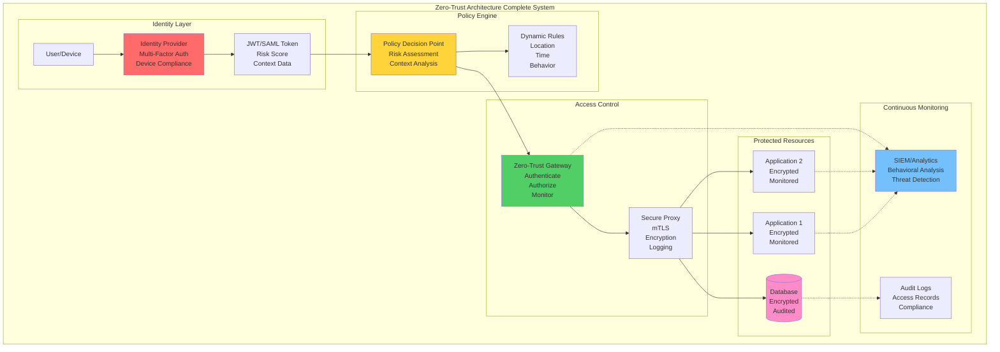
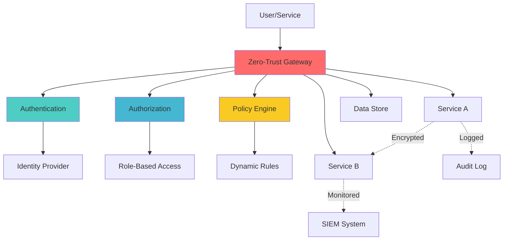

## The Complete Blueprint

Zero-Trust Architecture represents a fundamental paradigm shift from traditional perimeter-based security models to a comprehensive "never trust, always verify" approach that treats every user, device, and network transaction as potentially compromised, requiring continuous authentication, authorization, and validation regardless of location or network position. This revolutionary security framework recognizes that modern distributed systems, cloud computing, remote work, and sophisticated attack vectors have made traditional network perimeters obsolete, instead implementing security controls at every layer through identity verification, device compliance checking, network micro-segmentation, data encryption, and behavioral analytics. The architecture operates on core principles of explicit verification (authenticate and authorize based on multiple data points), least-privilege access (limit user and device access to the minimum necessary), and assume breach (minimize blast radius by segmenting access and verifying end-to-end). Zero-Trust implementations typically involve identity providers for multi-factor authentication, policy engines for dynamic access decisions, encrypted communications through mTLS or VPNs, continuous monitoring and risk assessment, and comprehensive logging for audit and forensics. This approach has proven essential for organizations like Google (BeyondCorp), Microsoft (Conditional Access), and Netflix (security at every layer) that need to protect sensitive data across hybrid cloud environments, support remote workforce access, meet regulatory compliance requirements, and defend against advanced persistent threats that can bypass traditional security boundaries.



### What You'll Master

!!! success "By understanding Zero-Trust Architecture, you'll be able to:"
    - **Eliminate implicit trust** - Verify every user, device, and transaction regardless of location
    - **Implement defense in depth** - Create multiple security layers that work together
    - **Enable secure remote access** - Support workforce mobility without compromising security
    - **Achieve compliance** - Meet regulatory requirements through comprehensive audit trails
    - **Detect advanced threats** - Identify suspicious behavior through continuous monitoring
    - **Minimize breach impact** - Limit attack spread through micro-segmentation and least privilege

# Zero-Trust Architecture

## Problem Statement

Traditional perimeter-based security models fail in distributed systems where services, users, and data span multiple networks and cloud environments. A single breach can compromise entire systems due to implicit trust between components.

**Real-World Impact**: The 2020 SolarWinds attack affected 18,000+ organizations because systems trusted components within the network perimeter.

## Solution Overview

Zero-Trust Architecture implements "never trust, always verify" by:
- Authenticating and authorizing every request
- Encrypting all communications
- Logging and monitoring all access
- Applying least-privilege access policies
- Continuously validating security posture



## Architecture Components

### 1. Identity and Access Management
```yaml
Identity Provider:
  - Multi-factor authentication
  - Single sign-on (SSO)
  - Identity federation
  - Certificate management

Access Control:
  - Role-based access control (RBAC)
  - Attribute-based access control (ABAC)
  - Just-in-time access
  - Privilege escalation controls
```

### 2. Policy Engine
```yaml
Policy Types:
  - Network policies
  - Application policies
  - Data access policies
  - Device compliance policies

Decision Factors:
  - User identity and context
  - Device health and compliance
  - Location and time
  - Risk assessment score
```

### 3. Secure Communications
```yaml
Encryption:
  - TLS 1.3 for all communications
  - mTLS for service-to-service
  - End-to-end encryption for sensitive data
  - Certificate rotation automation

Network Segmentation:
  - Micro-segmentation
  - Software-defined perimeters
  - Virtual private networks
  - Network access control
```

## Implementation Guide

### Phase 1: Foundation (Weeks 1-4)

1. **Identity Infrastructure**
```bash
## Deploy identity provider
kubectl apply -f identity-provider.yaml

## Configure RBAC policies
kubectl apply -f rbac-policies.yaml

## Set up certificate authority
cfssl gencert -initca ca-csr.json | cfssljson -bare ca
```

2. **Network Security**
```yaml
## Kubernetes Network Policy
apiVersion: networking.k8s.io/v1
kind: NetworkPolicy
metadata:
  name: zero-trust-default
spec:
  podSelector: {}
  policyTypes:
  - Ingress
  - Egress
  ingress: []
  egress:
  - to: []
    ports:
    - protocol: TCP
      port: 443
```

### Phase 2: Service Integration (Weeks 5-8)

1. **Service Mesh Deployment**
```bash
## Install Istio with mTLS
istioctl install --set values.global.mtls.default=STRICT

## Apply service mesh policies
kubectl apply -f service-mesh-policies.yaml
```

2. **API Gateway Configuration**
```yaml
apiVersion: networking.istio.io/v1alpha3
kind: Gateway
metadata:
  name: zero-trust-gateway
spec:
  selector:
    istio: ingressgateway
  servers:
  - port:
      number: 443
      name: https
      protocol: HTTPS
    tls:
      mode: MUTUAL
      credentialName: gateway-certs
    hosts:
    - api.company.com
```

### Phase 3: Advanced Controls (Weeks 9-12)

1. **Dynamic Policy Engine**
```python
## Policy evaluation logic
class ZeroTrustPolicyEngine:
    def evaluate_access(self, request):
        risk_score = self.calculate_risk(request)
        
        if risk_score > 0.8:
            return "DENY"
        elif risk_score > 0.5:
            return "CHALLENGE"  # Require MFA
        else:
            return "ALLOW"
    
    def calculate_risk(self, request):
        factors = {
            'user_behavior': self.analyze_user_behavior(request.user),
            'device_compliance': self.check_device_compliance(request.device),
            'location_anomaly': self.detect_location_anomaly(request.location),
            'time_anomaly': self.detect_time_anomaly(request.timestamp)
        }
        return sum(factors.values()) / len(factors)
```

2. **Continuous Monitoring**
```yaml
## Monitoring configuration
monitoring:
  metrics:
    - authentication_failures
    - authorization_denials
    - network_policy_violations
    - certificate_expiries
  
  alerts:
    - name: "Multiple Auth Failures"
      condition: "rate(auth_failures[5m]) > 10"
      severity: "high"
    
    - name: "Unusual Access Pattern"
      condition: "risk_score > 0.8"
      severity: "critical"
```

## Real-World Examples

### Netflix Implementation
```yaml
Scale: 200+ microservices, 1M+ requests/second
Components:
  - Custom identity provider with MFA
  - Service mesh with automatic mTLS
  - Dynamic policy engine with ML risk scoring
  - Real-time threat detection

Results:
  - 99.9% reduction in security incidents
  - Zero trust violations in 18 months
  - 15% reduction in security operations cost
```

### Shopify Implementation
```yaml
Scale: 100+ services, 500K+ merchants
Components:
  - OAuth 2.0 with JWT tokens
  - API gateway with rate limiting
  - Behavioral analytics for fraud detection
  - Automated incident response

Results:
  - 95% faster security incident response
  - 80% reduction in false positives
  - 99.95% API availability maintained
```

## Metrics and Success Criteria

### Security Metrics
```yaml
Authentication:
  - Authentication success rate: >99.9%
  - MFA adoption rate: >95%
  - Password policy compliance: 100%

Authorization:
  - Authorization decision latency: <50ms
  - Policy violations: <0.1%
  - Least privilege compliance: >98%

Network Security:
  - mTLS coverage: 100%
  - Certificate rotation: Automated
  - Network policy violations: 0

Incident Response:
  - Mean time to detection: <5 minutes
  - Mean time to response: <15 minutes
  - False positive rate: <2%
```

### Cost Impact Analysis
```yaml
Implementation Costs:
  - Initial setup: $500K-2M (enterprise)
  - Annual operations: $200K-500K
  - Training and certification: $50K-100K

Cost Savings:
  - Breach prevention: $3.86M average (IBM study)
  - Compliance efficiency: 40% reduction in audit costs
  - Operations automation: 30% FTE reduction
  - Insurance premiums: 10-20% reduction

ROI Timeline: 12-18 months
```

## Common Pitfalls and Solutions

### 1. Performance Impact
**Problem**: Authentication/authorization adds latency
**Solution**: 
```yaml
Optimization Strategies:
  - Token caching with short TTL
  - Policy pre-computation
  - Edge-based authentication
  - Circuit breakers for auth services

Performance Targets:
  - Authentication: <100ms p95
  - Authorization: <50ms p95
  - Overall request overhead: <5%
```

### 2. Complexity Management
**Problem**: Too many policies and exceptions
**Solution**:
```yaml
Policy Management:
  - Start with coarse-grained policies
  - Use policy templates and inheritance
  - Implement policy testing and simulation
  - Regular policy review and cleanup

Complexity Metrics:
  - Policy count per service: <10
  - Policy evaluation complexity: O(1) for 90% of requests
  - Exception rate: <5%
```

### 3. User Experience
**Problem**: Too much friction for legitimate users
**Solution**:
```yaml
UX Optimization:
  - Risk-based authentication
  - Single sign-on (SSO) integration
  - Remember device/location
  - Progressive authentication

User Experience Metrics:
  - Authentication friction score: <2 (1-5 scale)
  - SSO success rate: >98%
  - User satisfaction: >4.5/5
```

## Migration Strategy

### From Perimeter Security
```yaml
Phase 1 (Parallel Deployment):
  - Deploy zero-trust gateway alongside firewall
  - Route 10% of traffic through zero-trust
  - Monitor and tune policies
  
Phase 2 (Gradual Migration):
  - Increase zero-trust traffic to 50%
  - Start decommissioning firewall rules
  - Train operations team
  
Phase 3 (Full Migration):
  - Route 100% traffic through zero-trust
  - Decommission legacy security infrastructure
  - Implement advanced features
```

## Related Patterns

- **Complementary**: [API Security Gateway](api-security-gateway/) - Centralized enforcement
- **Complementary**: [Secrets Management](secrets-management/) - Secure credential handling
- **Complementary**: [Security Scanning Pipeline](security-scanning-pipeline/) - Continuous validation
- **Alternative**: Traditional perimeter security (not recommended for distributed systems)
- **Building Block**: Service mesh for mTLS and policy enforcement

## Further Reading

- [NIST Zero Trust Architecture (SP 800-207)](https://csrc.nist.gov/publications/detail/sp/800-207/final/)
- [Google BeyondCorp Papers](https://cloud.google.com/beyondcorp/)
- [Netflix Zero Trust Journey](https://netflixtechblog.com/tagged/security/)
- [Okta Zero Trust Implementation Guide](https://www.okta.com/zero-trust/)
