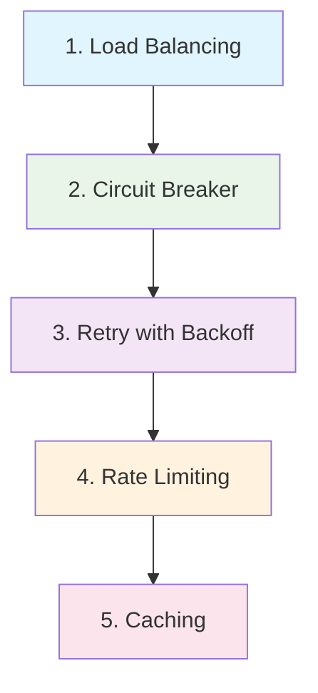
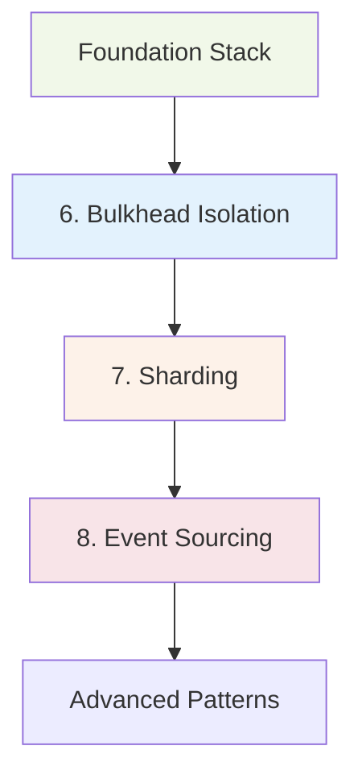
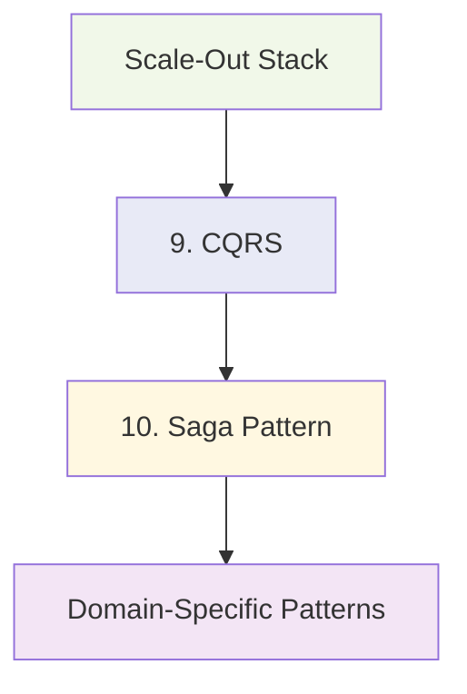
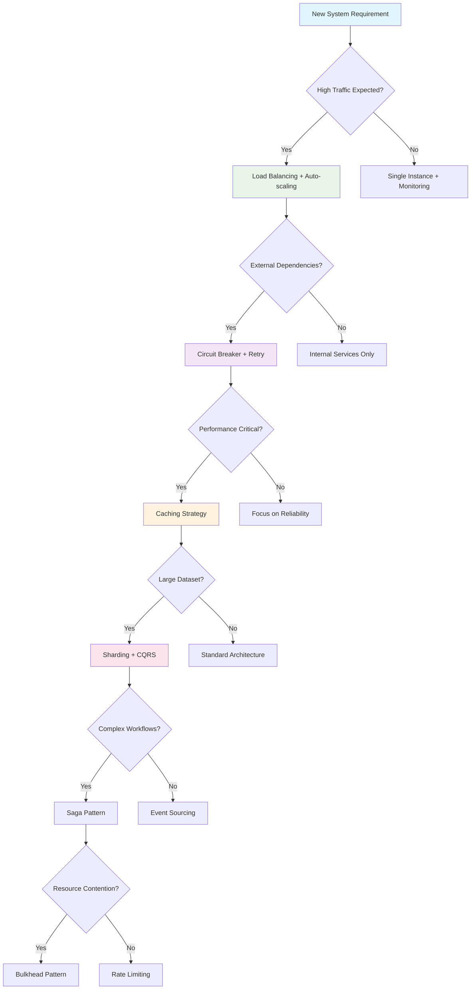

# Top 10 Patterns Every Architect Should Know

**The foundational patterns that power every major distributed system from Netflix to Google**

Building reliable distributed systems requires mastering a core set of battle-tested patterns. These 10 patterns form the essential toolkit that every architect needs to design systems that can handle real-world scale, failures, and complexity. Whether you're building a startup MVP or architecting systems for millions of users, these patterns provide the proven solutions to the most common challenges in distributed systems.

Each pattern in this guide has been validated at massive scale by industry leaders like Netflix, Google, Amazon, and Uber. They represent decades of collective experience in building systems that handle billions of requests, petabytes of data, and serve users across the globe.

## Quick Reference Matrix

| Pattern | Primary Purpose | When to Use | Impact Level |
|---------|-----------------|-------------|--------------|
| [Circuit Breaker](#circuit-breaker) | Prevent cascade failures | External dependencies | Critical |
| [Retry with Backoff](#retry-with-backoff) | Handle transient failures | Network operations | Essential |
| [Load Balancing](#load-balancing) | Distribute traffic | Multiple servers | Fundamental |
| [Sharding](#sharding) | Scale data layer | Large datasets | High |
| [Caching](#caching) | Improve performance | Repeated operations | High |
| [Event Sourcing](#event-sourcing) | Audit and replay | Critical transactions | Strategic |
| [CQRS](#cqrs) | Separate read/write | Complex queries | Advanced |
| [Saga](#saga) | Distributed transactions | Business workflows | Critical |
| [Bulkhead](#bulkhead) | Isolate failures | Resource separation | Important |
| [Rate Limiting](#rate-limiting) | Control traffic | Public APIs | Essential |

---

## 1. Circuit Breaker {#circuit-breaker}

**Pattern Summary**: Automatically stops calling a failing service to prevent cascade failures and allows time for recovery.

### Why Every Architect Needs This

Circuit Breaker is your first line of defense against cascade failures in distributed systems. When a dependency starts failing, this pattern prevents your system from wasting resources on doomed requests while giving the failing service time to recover.

**Core Mechanism**: The pattern operates in three states:
- **CLOSED**: Normal operation, requests flow through
- **OPEN**: Service is failing, requests fail fast
- **HALF-OPEN**: Testing recovery, limited requests allowed

### When to Use

| Scenario | Example | Expected Outcome |
|----------|---------|------------------|
| External API calls | Payment processing | Prevent payment system overload |
| Database connections | High-traffic reads | Avoid connection pool exhaustion |
| Microservice communication | Service mesh calls | Isolate service failures |
| Third-party integrations | Email/SMS providers | Graceful degradation with fallbacks |

### Real-World Impact

**Netflix Hystrix**: Handles 2+ billion thread-isolated command executions daily. When services fail beyond 50% error rate in 20 seconds, circuits trip, preventing thread pool exhaustion and enabling fallback responses.

**Production Configuration**:
```yaml
Payment Service:
  failure_threshold: 3 consecutive failures
  success_threshold: 5 consecutive successes
  timeout: 60 seconds
  fallback: Queue for retry

User Service:
  failure_threshold: 5 consecutive failures  
  success_threshold: 3 consecutive successes
  timeout: 30 seconds
  fallback: Cached user data
```

### Integration Pattern

Always combine Circuit Breaker with:
- **[Retry with Backoff](#retry-with-backoff)**: Retry before circuit opens
- **[Bulkhead](#bulkhead)**: Isolate circuit breakers per resource pool
- **Timeout**: Circuit timeout must be shorter than client timeout

---

## 2. Retry with Backoff {#retry-with-backoff}

**Pattern Summary**: Intelligently retry failed operations with increasing delays to handle transient failures without creating thundering herds.

### Why Every Architect Needs This

Transient failures are inevitable in distributed systems. Poor retry patterns can turn minor issues into major outages through retry storms. Exponential backoff with jitter transforms these failure scenarios into graceful recovery opportunities.

**Core Mechanism**: 
- Exponential delay: 1s, 2s, 4s, 8s...
- Jitter prevents synchronized retries
- Smart error classification (retry 5xx, not 4xx)
- Retry budget prevents resource exhaustion

### When to Use

| Error Type | Retry Strategy | Example |
|------------|----------------|---------|
| Network timeouts | Exponential backoff | API calls, database connections |
| Rate limiting (429) | Respect rate limit headers | Third-party APIs |
| Server errors (5xx) | Limited retries with backoff | Internal service calls |
| Transient database errors | Query-specific retry | Deadlocks, connection issues |

### Don't Retry When

| Error Type | Why | Better Approach |
|------------|-----|-----------------|
| Authentication failures (401) | Credentials won't improve | Refresh tokens |
| Client errors (4xx) | Request is malformed | Fix the request |
| Business logic errors | Logic won't change | Handle the error |

### Real-World Impact

**AWS SDK Strategy**: Uses token bucket retry limiter with adaptive rate adjustment. Base delay of 50ms, maximum 20s, with capacity-based retry limits handles traffic spikes 10x normal load.

**Anti-Pattern Example**: In 2019, a major e-commerce platform had synchronized retries without jitter. During a 15-minute database slowdown, all 10,000 application servers retried at exactly 1s, 2s, 4s intervals. The synchronized retry waves created 10x normal load, turning a minor slowdown into a 3-hour outage.

### Production Configuration

```python
# Recommended retry configuration
payment_retries = {
    'max_attempts': 5,
    'base_delay': 0.5,  # 500ms
    'max_delay': 30.0,  # 30 seconds
    'jitter': True,     # ±25% randomization
    'retry_budget': 0.1 # 10% of requests can be retries
}

cache_retries = {
    'max_attempts': 3,
    'base_delay': 0.1,  # 100ms
    'max_delay': 2.0,   # 2 seconds
    'jitter': True,
    'fast_failure': True  # Fail fast for cache misses
}
```

---

## 3. Load Balancing {#load-balancing}

**Pattern Summary**: Distribute incoming requests across multiple backend servers to achieve high availability and horizontal scalability.

### Why Every Architect Needs This

Load balancing is the foundation of horizontal scaling. It transforms multiple servers into a single, more powerful and reliable system while providing seamless failover capabilities.

**Core Capabilities**:
- Traffic distribution across healthy backends
- Automatic failover when servers fail
- SSL termination and certificate management
- Geographic routing for global applications
- Zero-downtime deployments through traffic shifting

### Algorithm Selection Guide

| Algorithm | Use Case | Traffic Pattern | Example |
|-----------|----------|-----------------|---------|
| **Least Connections** | Variable request processing time | Database connections, API gateways | Payment processing |
| **Round Robin** | Similar server capacity | Web servers, stateless services | Static content |
| **Weighted** | Mixed server capacity | Different instance types | Auto-scaling groups |
| **Geographic** | Global applications | Location-based routing | CDN, multi-region |

### When to Use

| Scenario | Load Balancer Type | Expected Benefit |
|----------|-------------------|------------------|
| Multiple web servers | Application Load Balancer (L7) | HTTP routing, SSL termination |
| Database read replicas | Network Load Balancer (L4) | High-performance TCP routing |
| Global applications | Global Load Balancer | Geographic traffic routing |
| Microservices | Service Mesh (Istio/Envoy) | Advanced routing, observability |

### Real-World Impact

**Google Maglev**: Handles 1M+ requests/sec per instance with consistent hashing. Uses Equal Cost Multi-Path (ECMP) routing to eliminate load balancer as single point of failure.

**Cloudflare Global LB**: Processes 45M+ requests/sec globally with <50ms latency to nearest edge location.

### Production Considerations

```yaml
# Health check configuration
health_check:
  interval: 10s
  timeout: 3s
  healthy_threshold: 2
  unhealthy_threshold: 3
  path: "/health"
  expected_codes: [200, 202]

# Connection draining for deployments
connection_draining:
  enabled: true
  timeout: 300s  # 5 minutes for graceful shutdown
  
# SSL configuration
ssl:
  certificate_management: automatic
  protocols: [TLSv1.2, TLSv1.3]
  cipher_suites: secure_modern
```

---

## 4. Sharding {#sharding}

**Pattern Summary**: Horizontally partition data across multiple databases or services to scale beyond single-machine limits.

### Why Every Architect Needs This

When your data grows beyond what a single database can handle efficiently, sharding is the path to unlimited horizontal scale. Every major web company relies on sharding strategies to handle petabytes of data and millions of operations per second.

**Core Approaches**:
- **Range-based**: Partition by data ranges (A-M, N-Z)
- **Hash-based**: Use consistent hashing for even distribution
- **Directory-based**: Lookup service maps data to shards
- **Geographic**: Partition by user location or region

### Sharding Strategies

| Strategy | Best For | Trade-offs | Example |
|----------|----------|------------|---------|
| **User ID Hash** | User-centric applications | Even distribution, complex queries | Social media platforms |
| **Geographic** | Global applications | Data locality, regulatory compliance | Multi-region apps |
| **Time-based** | Time-series data | Efficient time-range queries | Logging, metrics |
| **Feature-based** | Microservices | Service independence, data isolation | E-commerce (users, orders, inventory) |

### When to Use

| Indicator | Threshold | Action |
|-----------|-----------|--------|
| Database size | >100GB single table | Consider vertical partitioning first |
| Write throughput | >10K writes/sec | Hash-based sharding |
| Query latency | >100ms for simple queries | Add read replicas first, then shard |
| Storage cost | >$1000/month | Analyze hot vs cold data partitioning |

### Real-World Impact

**Instagram Sharding**: Uses hash-based sharding on user ID to distribute billions of photos across thousands of database shards. Each shard handles ~4000 users with sub-100ms query times.

**Discord Message Storage**: Combines time-based and server-based sharding. Messages are partitioned by (server_id, timestamp) enabling efficient real-time queries while scaling to billions of messages.

### Implementation Patterns

```python
# Consistent hashing sharding
def get_shard(user_id: int, num_shards: int) -> int:
    return hash(str(user_id)) % num_shards

# Range-based sharding  
def get_time_shard(timestamp: datetime, shard_duration_days: int) -> str:
    epoch_days = (timestamp - datetime(2020, 1, 1)).days
    shard_id = epoch_days // shard_duration_days
    return f"logs_{shard_id:04d}"

# Directory-based sharding (for complex logic)
class ShardingService:
    def get_shard_for_user(self, user_id: int) -> str:
        # Consider user location, tier, feature flags
        user = self.user_service.get_user(user_id)
        if user.region == 'EU':
            return f"eu_shard_{hash(user_id) % 16}"
        return f"us_shard_{hash(user_id) % 32}"
```

### Cross-Shard Query Patterns

| Query Type | Strategy | Performance Impact |
|------------|----------|-------------------|
| Single-shard queries | Direct routing | Optimal (no overhead) |
| Cross-shard aggregation | Scatter-gather | High latency, use sparingly |
| Global secondary indexes | Denormalized views | Storage overhead, eventual consistency |
| Federation queries | Query service layer | Added complexity, caching critical |

---

## 5. Caching {#caching}

**Pattern Summary**: Store frequently accessed data in fast storage layers to reduce latency and backend load.

### Why Every Architect Needs This

Caching is often the highest-impact performance optimization you can implement. It reduces latency by 10-100x, decreases backend load by 50-90%, and improves user experience while reducing infrastructure costs.

**Caching Layers**:
- **Browser**: Static assets, API responses
- **CDN**: Geographic content distribution
- **Application**: In-memory data, computed results
- **Database**: Query result caching

### Cache Patterns

| Pattern | Use Case | Consistency Model | Example |
|---------|----------|-------------------|---------|
| **Cache-Aside** | General purpose | Read-through, manual invalidation | User profiles, product catalogs |
| **Write-Through** | Critical data consistency | Synchronous writes | Financial transactions |
| **Write-Behind** | High write throughput | Asynchronous writes | Analytics events, logs |
| **Refresh-Ahead** | Predictable access patterns | Proactive refresh | Daily reports, trending data |

### When to Use Each Pattern

| Scenario | Recommended Pattern | Cache Duration | Invalidation Strategy |
|----------|-------------------|----------------|----------------------|
| User profiles | Cache-aside | 1-4 hours | Event-driven invalidation |
| Product prices | Write-through | 5-15 minutes | Time-based + event-driven |
| Search results | Cache-aside | 10-30 minutes | LRU eviction |
| Session data | Write-through | Session lifetime | Explicit invalidation |

### Real-World Impact

**Facebook TAO**: Distributed caching layer serves 1+ billion read requests/second with 99.8% cache hit rate. Reduces database load by 99%+ while maintaining consistency through write-through invalidation.

**Netflix EVCache**: Handles 30+ million requests/second with sub-millisecond response times. Uses multi-zone replication for high availability with 99.99% uptime.

### Cache Configuration

```yaml
# Redis cluster configuration
redis_config:
  cluster_mode: enabled
  nodes: 6
  memory_per_node: 16GB
  eviction_policy: allkeys-lru
  persistence: rdb_snapshot
  backup_interval: 6h

# Application cache settings
app_cache:
  user_profiles:
    ttl: 3600  # 1 hour
    max_size: 10000
    eviction: lru
    
  product_catalog:
    ttl: 900   # 15 minutes  
    max_size: 50000
    eviction: lfu  # Least frequently used
    
  session_data:
    ttl: 86400 # 24 hours
    max_size: 100000
    eviction: ttl_first
```

### Cache Coherency Strategies

| Strategy | Consistency Level | Complexity | Use Case |
|----------|------------------|------------|----------|
| **TTL-based** | Eventual consistency | Low | Static content, analytics |
| **Event invalidation** | Strong consistency | Medium | User profiles, preferences |
| **Write-through** | Immediate consistency | High | Critical business data |
| **Version-based** | Strong consistency | High | Distributed caches |

---

## 6. Event Sourcing {#event-sourcing}

**Pattern Summary**: Store all changes to application state as a sequence of immutable events, enabling perfect audit trails and time-travel debugging.

### Why Every Architect Needs This

Event Sourcing provides unparalleled audit capabilities, enables temporal queries ("what was the account balance on March 15th?"), and makes complex business logic easier to understand and debug by capturing the full history of what happened.

**Core Concepts**:
- **Events**: Immutable facts about what happened
- **Event Store**: Append-only database of all events  
- **Projections**: Current state derived from events
- **Snapshots**: Performance optimization for long event streams

### When to Use

| Scenario | Event Sourcing Benefit | Traditional Approach Limitation |
|----------|----------------------|------------------------------|
| Financial systems | Perfect audit trail, regulatory compliance | Lost historical data |
| E-commerce orders | Track every status change | Can't recreate order history |
| User behavior analytics | Replay events for new insights | Aggregated data only |
| Collaborative editing | Conflict resolution, undo/redo | Complex merge logic |

### Domain Suitability

| Domain | Fit Level | Primary Benefit |
|--------|-----------|----------------|
| **Banking/Finance** | Excellent | Regulatory audit requirements |
| **E-commerce** | Very Good | Order lifecycle tracking |
| **Gaming** | Good | Player action replay |
| **Content Management** | Good | Version control, collaboration |
| **Simple CRUD** | Poor | Unnecessary complexity |

### Real-World Impact

**Klarna Payment Processing**: Uses event sourcing for all payment flows. Can replay any payment to understand exactly what happened, enabling rapid fraud investigation and regulatory reporting.

**GitHub Activity Stream**: Every action (commit, issue, PR) is stored as immutable events. Enables rich activity feeds, contribution analytics, and audit trails.

### Implementation Example

```python
# Event sourcing core concepts
@dataclass
class AccountCreated:
    account_id: str
    user_id: str
    initial_balance: Decimal
    timestamp: datetime

@dataclass  
class MoneyDeposited:
    account_id: str
    amount: Decimal
    transaction_id: str
    timestamp: datetime

class AccountAggregate:
    def __init__(self):
        self.account_id = None
        self.balance = Decimal('0')
        self.version = 0
    
    def apply_event(self, event):
        if isinstance(event, AccountCreated):
            self.account_id = event.account_id
            self.balance = event.initial_balance
        elif isinstance(event, MoneyDeposited):
            self.balance += event.amount
        self.version += 1
    
    @classmethod
    def from_events(cls, events):
        aggregate = cls()
        for event in events:
            aggregate.apply_event(event)
        return aggregate

# Event store interface
class EventStore:
    def append_events(self, stream_id: str, events: List, expected_version: int):
        # Append events with optimistic concurrency control
        pass
        
    def get_events(self, stream_id: str, from_version: int = 0) -> List:
        # Retrieve events for aggregate reconstruction
        pass
```

### Event Design Patterns

| Pattern | Purpose | Example Event |
|---------|---------|---------------|
| **Business Events** | Domain-meaningful occurrences | OrderPlaced, PaymentProcessed |
| **State Change Events** | Attribute modifications | PriceChanged, StatusUpdated |
| **Integration Events** | Cross-boundary communication | UserRegistered, OrderShipped |
| **System Events** | Technical occurrences | SessionStarted, CacheCleared |

### Performance Considerations

| Aspect | Strategy | Trade-off |
|--------|----------|-----------|
| **Read Performance** | Projections + snapshots | Storage overhead |
| **Write Performance** | Async projections | Eventual consistency |
| **Storage Growth** | Event archiving | Historical query limitations |
| **Query Complexity** | Multiple projections | Increased maintenance |

---

## 7. CQRS (Command Query Responsibility Segregation) {#cqrs}

**Pattern Summary**: Separate read and write operations using different models, optimizing each for their specific use case.

### Why Every Architect Needs This

CQRS enables independent scaling and optimization of reads vs writes, supports complex reporting without impacting operational systems, and provides flexibility to use different storage technologies optimized for each access pattern.

**Core Separation**:
- **Commands**: Change state, validated, can fail
- **Queries**: Read state, optimized for specific views
- **Write Model**: Optimized for business logic consistency
- **Read Model**: Optimized for query performance

### When to Use CQRS

| Scenario | CQRS Benefit | Without CQRS |
|----------|--------------|---------------|
| Complex reporting | Optimized read models | Expensive joins, slow queries |
| High read/write ratio | Independent scaling | Write bottlenecks affect reads |
| Multiple client types | Tailored views | One-size-fits-all responses |
| Event-driven architecture | Natural fit with events | Impedance mismatch |

### Implementation Patterns

| Pattern | Use Case | Complexity | Example |
|---------|----------|------------|---------|
| **Simple CQRS** | Different read/write models | Low | Separate query/command services |
| **CQRS + Events** | Event-driven updates | Medium | Event-sourced write, projected reads |
| **CQRS + Different DBs** | Optimized storage | High | SQL writes, NoSQL reads |
| **CQRS + Read Replicas** | Read scaling | Medium | Write to master, read from replicas |

### Real-World Impact

**Stack Overflow Architecture**: Uses CQRS to handle 5,000+ questions/day and millions of page views. Write operations go through business logic validation while reads are served from optimized denormalized views.

**Netflix Viewing History**: Commands update viewing events while queries serve multiple read models - recent views (Redis), viewing analytics (Cassandra), and recommendations (Elasticsearch).

### CQRS Implementation

```python
# Command side - focused on business logic
class CreateOrderCommand:
    def __init__(self, user_id: str, items: List[OrderItem]):
        self.user_id = user_id
        self.items = items

class OrderCommandHandler:
    def handle(self, command: CreateOrderCommand):
        # Business validation
        if not self.user_service.is_valid_user(command.user_id):
            raise InvalidUserError()
        
        # Create domain aggregate
        order = Order.create(command.user_id, command.items)
        
        # Persist to write store
        self.order_repository.save(order)
        
        # Publish domain events
        for event in order.uncommitted_events:
            self.event_bus.publish(event)

# Query side - optimized for reads
class OrderQueryHandler:
    def get_user_orders(self, user_id: str) -> List[OrderView]:
        # Query optimized read model
        return self.order_view_repository.get_by_user(user_id)
    
    def get_order_analytics(self, date_range: DateRange) -> OrderAnalytics:
        # Query analytics-optimized store
        return self.analytics_repository.get_order_stats(date_range)

# Read model projection
class OrderViewProjection:
    def on_order_created(self, event: OrderCreated):
        view = OrderView(
            order_id=event.order_id,
            user_id=event.user_id,
            status='pending',
            total=event.total,
            created_at=event.timestamp
        )
        self.order_view_repository.save(view)
```

### Storage Strategy Options

| Strategy | Write Store | Read Store | Use Case |
|----------|-------------|------------|----------|
| **Same Database** | PostgreSQL | PostgreSQL views | Simple CQRS |
| **Read Replicas** | PostgreSQL master | PostgreSQL replicas | Read scaling |
| **Polyglot** | PostgreSQL | Elasticsearch | Complex search |
| **Event Store** | Event store | Multiple projections | Event sourcing |

---

## 8. Saga {#saga}

**Pattern Summary**: Manage distributed transactions across microservices using a sequence of local transactions with compensating actions for failures.

### Why Every Architect Needs This

In microservices architectures, traditional ACID transactions can't span multiple services. Saga pattern provides a way to maintain data consistency across services while avoiding distributed locking and embracing eventual consistency.

**Two Implementation Styles**:
- **Choreography**: Services publish events, others react
- **Orchestration**: Central coordinator manages the workflow

### Saga Patterns Comparison

| Style | Pros | Cons | Best For |
|-------|------|------|----------|
| **Choreography** | Decentralized, loose coupling | Complex debugging, implicit flow | Simple workflows, event-driven systems |
| **Orchestration** | Centralized control, explicit flow | Single point of failure, tight coupling | Complex workflows, clear business processes |

### When to Use

| Scenario | Saga Type | Example |
|----------|-----------|---------|
| E-commerce checkout | Orchestration | Payment → Inventory → Shipping → Notification |
| User registration | Choreography | Profile creation → Email verification → Welcome message |
| Financial transfers | Orchestration | Debit account → Credit account → Update balances |
| Document workflow | Orchestration | Submit → Review → Approve → Publish |

### Real-World Impact

**Uber Trip Booking**: Uses saga orchestration for trip requests. Coordinates driver matching, route calculation, pricing, and payment processing with compensating actions for cancellations.

**Netflix Content Pipeline**: Uses choreographed sagas for content processing. Video upload triggers encoding, thumbnail generation, metadata extraction, and catalog updates.

### Implementation Examples

```python
# Orchestration-based saga
class OrderSaga:
    def __init__(self, order_id: str):
        self.order_id = order_id
        self.state = SagaState.STARTED
        self.compensations = []
    
    async def execute(self):
        try:
            # Step 1: Reserve inventory
            await self.inventory_service.reserve_items(self.order_id)
            self.compensations.append(
                lambda: self.inventory_service.release_items(self.order_id)
            )
            
            # Step 2: Process payment
            await self.payment_service.charge_customer(self.order_id)
            self.compensations.append(
                lambda: self.payment_service.refund_customer(self.order_id)
            )
            
            # Step 3: Create shipment
            await self.shipping_service.create_shipment(self.order_id)
            self.compensations.append(
                lambda: self.shipping_service.cancel_shipment(self.order_id)
            )
            
            self.state = SagaState.COMPLETED
            
        except Exception as e:
            await self.compensate()
            self.state = SagaState.COMPENSATED
            raise SagaFailedException(f"Saga failed: {e}")
    
    async def compensate(self):
        # Execute compensations in reverse order
        for compensation in reversed(self.compensations):
            try:
                await compensation()
            except Exception as e:
                logger.error(f"Compensation failed: {e}")
                # Continue with other compensations

# Choreography-based saga using events
class UserRegistrationSaga:
    def __init__(self, event_bus):
        self.event_bus = event_bus
        self.setup_handlers()
    
    def setup_handlers(self):
        self.event_bus.subscribe('UserRegistered', self.on_user_registered)
        self.event_bus.subscribe('EmailVerificationSent', self.on_email_sent)
        self.event_bus.subscribe('EmailVerified', self.on_email_verified)
    
    async def on_user_registered(self, event: UserRegistered):
        try:
            await self.email_service.send_verification(event.user_id)
            self.event_bus.publish(EmailVerificationSent(event.user_id))
        except Exception:
            self.event_bus.publish(UserRegistrationFailed(event.user_id))
    
    async def on_email_verified(self, event: EmailVerified):
        try:
            await self.welcome_service.send_welcome_message(event.user_id)
            self.event_bus.publish(WelcomeMessageSent(event.user_id))
        except Exception:
            logger.error(f"Failed to send welcome message for {event.user_id}")
            # Non-critical failure, don't fail the saga
```

### Error Handling Strategies

| Error Type | Strategy | Implementation |
|------------|----------|----------------|
| **Transient Failures** | Retry with backoff | Circuit breaker + exponential backoff |
| **Business Failures** | Compensating transaction | Explicit rollback operations |
| **Timeout Failures** | Saga timeout + compensation | Maximum saga duration limits |
| **Partial Failures** | Continue or compensate decision | Business logic determines action |

---

## 9. Bulkhead {#bulkhead}

**Pattern Summary**: Isolate critical resources to prevent failures in one area from cascading to other parts of the system.

### Why Every Architect Needs This

Just as ship bulkheads prevent a single hull breach from sinking the entire vessel, this pattern prevents resource exhaustion in one component from bringing down unrelated system functionality.

**Isolation Strategies**:
- **Thread Pool Isolation**: Separate thread pools for different operations
- **Connection Pool Isolation**: Dedicated database connections per service
- **Process Isolation**: Separate processes/containers for critical functions  
- **Network Isolation**: Dedicated network resources

### Bulkhead Types

| Type | Isolation Level | Resource Cost | Use Case |
|------|----------------|---------------|----------|
| **Thread Pools** | High | Low | HTTP clients, database operations |
| **Connection Pools** | High | Medium | Database access, external APIs |
| **Process Isolation** | Very High | High | Critical vs non-critical services |
| **Physical Isolation** | Complete | Very High | Regulatory compliance, security |

### When to Use

| Scenario | Bulkhead Strategy | Expected Benefit |
|----------|------------------|------------------|
| Mixed criticality workloads | Separate thread pools | Protect critical operations |
| Multiple external dependencies | Per-service connection pools | Isolate dependency failures |
| Batch vs real-time processing | Process isolation | Prevent resource contention |
| Multi-tenant applications | Tenant isolation | Prevent noisy neighbor |

### Real-World Impact

**Netflix Hystrix**: Uses thread pool isolation for every external dependency. When one API becomes slow, it only exhausts its dedicated thread pool, leaving other operations unaffected.

**Amazon Cell-Based Architecture**: Isolates customer workloads into cells. When one cell experiences issues, only customers in that cell are affected, not the entire service.

### Implementation Examples

```python
# Thread pool bulkhead
import concurrent.futures
from typing import Dict
import asyncio

class ThreadPoolBulkhead:
    def __init__(self):
        self.executors: Dict[str, concurrent.futures.ThreadPoolExecutor] = {
            'payment': concurrent.futures.ThreadPoolExecutor(max_workers=10),
            'inventory': concurrent.futures.ThreadPoolExecutor(max_workers=5),
            'notification': concurrent.futures.ThreadPoolExecutor(max_workers=3),
            'analytics': concurrent.futures.ThreadPoolExecutor(max_workers=2)
        }
    
    async def execute(self, pool_name: str, func, *args, **kwargs):
        executor = self.executors.get(pool_name)
        if not executor:
            raise ValueError(f"Unknown pool: {pool_name}")
        
        loop = asyncio.get_event_loop()
        return await loop.run_in_executor(executor, func, *args, **kwargs)

# Connection pool bulkhead
class ConnectionPoolBulkhead:
    def __init__(self):
        self.pools = {
            'user_db': create_pool(max_connections=20),
            'analytics_db': create_pool(max_connections=5),
            'cache': create_pool(max_connections=10),
            'session_store': create_pool(max_connections=15)
        }
    
    def get_connection(self, pool_name: str):
        pool = self.pools.get(pool_name)
        if not pool:
            raise ValueError(f"Unknown connection pool: {pool_name}")
        return pool.get_connection()

# Usage in service layer
class OrderService:
    def __init__(self, bulkhead: ThreadPoolBulkhead):
        self.bulkhead = bulkhead
    
    async def process_order(self, order_id: str):
        # Each operation uses its dedicated resource pool
        payment_result = await self.bulkhead.execute(
            'payment', self.charge_payment, order_id
        )
        
        inventory_result = await self.bulkhead.execute(
            'inventory', self.reserve_items, order_id
        )
        
        # Non-critical notification won't block order processing
        asyncio.create_task(
            self.bulkhead.execute(
                'notification', self.send_notification, order_id
            )
        )
        
        return {'payment': payment_result, 'inventory': inventory_result}
```

### Resource Allocation Strategy

| Service Criticality | Thread Pool Size | Connection Pool Size | Timeout |
|---------------------|------------------|-------------------|---------|
| **Critical (Payment)** | 50% of available | 40% of max connections | 30s |
| **Important (User Operations)** | 30% of available | 35% of max connections | 15s |
| **Background (Analytics)** | 15% of available | 15% of max connections | 60s |
| **Best Effort (Notifications)** | 5% of available | 10% of max connections | 5s |

### Circuit Breaker Integration

Combine bulkheads with circuit breakers for comprehensive isolation:

```python
class IsolatedService:
    def __init__(self, thread_pool_size: int, circuit_breaker_config: dict):
        self.executor = ThreadPoolExecutor(max_workers=thread_pool_size)
        self.circuit_breaker = CircuitBreaker(**circuit_breaker_config)
    
    async def call(self, operation, *args, **kwargs):
        # Circuit breaker prevents calls to failing dependencies
        if self.circuit_breaker.is_open():
            raise CircuitOpenException("Service circuit is open")
        
        # Bulkhead isolates this operation's resource usage
        try:
            loop = asyncio.get_event_loop()
            result = await loop.run_in_executor(
                self.executor, operation, *args, **kwargs
            )
            self.circuit_breaker.record_success()
            return result
        except Exception as e:
            self.circuit_breaker.record_failure()
            raise
```

---

## 10. Rate Limiting {#rate-limiting}

**Pattern Summary**: Control the rate of incoming requests to protect systems from overload and ensure fair resource allocation.

### Why Every Architect Needs This

Rate limiting is your system's immune system against traffic spikes, abuse, and resource exhaustion. It prevents any single client from consuming all available resources while maintaining service quality for legitimate users.

**Core Algorithms**:
- **Token Bucket**: Allows bursts up to bucket capacity
- **Fixed Window**: Simple counting per time window  
- **Sliding Window**: More accurate but complex
- **Leaky Bucket**: Smooth constant rate output

### Rate Limiting Algorithms Comparison

| Algorithm | Burst Handling | Memory Usage | Accuracy | Use Case |
|-----------|----------------|--------------|----------|----------|
| **Token Bucket** | Excellent | Low | Good | API endpoints, user requests |
| **Fixed Window** | Poor | Very Low | Poor | Simple DoS protection |
| **Sliding Window** | Good | High | Excellent | Precise rate control |
| **Leaky Bucket** | None | Low | Good | Traffic shaping |

### When to Use

| Scenario | Algorithm | Rate Limit | Window |
|----------|-----------|------------|--------|
| Public API | Token Bucket | 1000 req/hour | 1 hour |
| User login attempts | Fixed Window | 5 attempts | 15 minutes |
| File uploads | Leaky Bucket | 10 MB/minute | Continuous |
| Search queries | Sliding Window | 100 req/minute | 1 minute |

### Real-World Impact

**Twitter API**: Uses a complex rate limiting system with different limits for different endpoints. Standard APIs allow 300 requests per 15-minute window, while search API allows 180 queries per 15 minutes.

**GitHub API**: Implements token bucket algorithm with 5000 requests per hour for authenticated users. Provides rate limit headers to help clients manage their usage.

### Implementation Examples

```python
import time
import asyncio
from collections import defaultdict, deque
from typing import Dict, Tuple

class TokenBucket:
    def __init__(self, capacity: int, refill_rate: float):
        self.capacity = capacity
        self.tokens = capacity
        self.refill_rate = refill_rate  # tokens per second
        self.last_refill = time.time()
    
    def consume(self, tokens: int = 1) -> bool:
        now = time.time()
        
        # Refill tokens based on elapsed time
        elapsed = now - self.last_refill
        self.tokens = min(
            self.capacity,
            self.tokens + elapsed * self.refill_rate
        )
        self.last_refill = now
        
        # Check if we have enough tokens
        if self.tokens >= tokens:
            self.tokens -= tokens
            return True
        return False

class SlidingWindowRateLimiter:
    def __init__(self, limit: int, window_seconds: int):
        self.limit = limit
        self.window_seconds = window_seconds
        self.requests: Dict[str, deque] = defaultdict(deque)
    
    def is_allowed(self, identifier: str) -> bool:
        now = time.time()
        window_start = now - self.window_seconds
        
        # Remove old requests outside the window
        user_requests = self.requests[identifier]
        while user_requests and user_requests[0] <= window_start:
            user_requests.popleft()
        
        # Check if under limit
        if len(user_requests) < self.limit:
            user_requests.append(now)
            return True
        
        return False

class DistributedRateLimiter:
    def __init__(self, redis_client, key_prefix: str = "rate_limit"):
        self.redis = redis_client
        self.key_prefix = key_prefix
    
    async def is_allowed(self, identifier: str, limit: int, window_seconds: int) -> Tuple[bool, dict]:
        key = f"{self.key_prefix}:{identifier}"
        now = int(time.time())
        window_start = now - window_seconds
        
        # Lua script for atomic sliding window rate limiting
        lua_script = """
        local key = KEYS[1]
        local now = tonumber(ARGV[1])
        local window_start = tonumber(ARGV[2])
        local limit = tonumber(ARGV[3])
        
        -- Remove old entries
        redis.call('zremrangebyscore', key, '-inf', window_start)
        
        -- Count current requests
        local current_requests = redis.call('zcard', key)
        
        if current_requests < limit then
            -- Add current request
            redis.call('zadd', key, now, now)
            redis.call('expire', key, ARGV[4])
            return {1, current_requests + 1, limit}
        else
            return {0, current_requests, limit}
        end
        """
        
        result = await self.redis.eval(
            lua_script, 1, key, now, window_start, limit, window_seconds
        )
        
        allowed = bool(result[0])
        current_count = result[1]
        total_limit = result[2]
        
        return allowed, {
            'allowed': allowed,
            'current_count': current_count,
            'limit': total_limit,
            'reset_time': now + window_seconds
        }

# Rate limiter middleware
class RateLimitMiddleware:
    def __init__(self, rate_limiter):
        self.rate_limiter = rate_limiter
        self.limits = {
            '/api/search': (100, 60),      # 100 requests per minute
            '/api/upload': (10, 3600),     # 10 requests per hour
            '/api/login': (5, 900),        # 5 requests per 15 minutes
            'default': (1000, 3600)        # Default: 1000 per hour
        }
    
    async def process_request(self, request):
        # Determine rate limit based on endpoint
        endpoint = request.path
        limit, window = self.limits.get(endpoint, self.limits['default'])
        
        # Check rate limit (use IP or user ID as identifier)
        identifier = self.get_identifier(request)
        allowed, info = await self.rate_limiter.is_allowed(
            identifier, limit, window
        )
        
        if not allowed:
            return self.rate_limit_exceeded_response(info)
        
        # Add rate limit headers
        request.rate_limit_info = info
        return None  # Continue processing
    
    def get_identifier(self, request):
        # Prefer user ID over IP for authenticated requests
        if hasattr(request, 'user') and request.user:
            return f"user:{request.user.id}"
        return f"ip:{request.remote_addr}"
    
    def rate_limit_exceeded_response(self, info):
        return {
            'error': 'Rate limit exceeded',
            'retry_after': info['reset_time'] - int(time.time()),
            'limit': info['limit'],
            'current': info['current_count']
        }, 429
```

### Advanced Rate Limiting Strategies

| Strategy | Use Case | Implementation |
|----------|----------|----------------|
| **Hierarchical Limits** | Multiple limit levels | Global + per-user + per-endpoint |
| **Adaptive Limits** | Dynamic based on system load | Increase limits when CPU < 50% |
| **Quota-based** | Monthly/daily allowances | Track cumulative usage over longer periods |
| **Priority-based** | Different limits by user tier | Premium users get higher limits |

### Rate Limiting Headers

Always include informative headers in your API responses:

```python
def add_rate_limit_headers(response, rate_limit_info):
    response.headers.update({
        'X-RateLimit-Limit': str(rate_limit_info['limit']),
        'X-RateLimit-Remaining': str(rate_limit_info['limit'] - rate_limit_info['current_count']),
        'X-RateLimit-Reset': str(rate_limit_info['reset_time']),
        'Retry-After': str(max(0, rate_limit_info['reset_time'] - int(time.time())))
    })
    return response
```

---

## Pattern Integration Strategy

### The Foundation Stack (Start Here)

For any new distributed system, implement these patterns in this order:



### The Scale-Out Stack (Growth Phase)

When you need to scale beyond single instances:



### The Complexity Stack (Enterprise Phase)

For complex business workflows and compliance:



## Pattern Selection Decision Tree



## Success Metrics by Pattern

| Pattern | Key Metric | Success Threshold | Measurement Method |
|---------|------------|-------------------|-------------------|
| Circuit Breaker | False positive rate | <1% | Monitor circuit state changes |
| Retry w/ Backoff | Eventual success rate | >95% | Track retry outcomes |
| Load Balancing | Request distribution | <10% variance | Monitor backend utilization |
| Sharding | Query response time | <100ms P95 | Database performance metrics |
| Caching | Cache hit rate | >80% | Application metrics |
| Event Sourcing | Event replay time | <5s for 10K events | Benchmark event reconstruction |
| CQRS | Read/write performance | 10x read throughput | Compare query performance |
| Saga | Compensation success | >99.9% | Track saga outcomes |
| Bulkhead | Failure isolation | No cascade failures | Monitor cross-component failures |
| Rate Limiting | Fair resource allocation | <5% user complaints | Monitor rate limit violations |

## Common Anti-Patterns to Avoid

| Anti-Pattern | Description | Fix |
|--------------|-------------|-----|
| **Distributed Monolith** | CQRS/Saga without proper boundaries | Define clear service boundaries first |
| **Premature Sharding** | Sharding before proving single-DB limits | Scale vertically first, then horizontally |
| **Cache Stampede** | No cache warming strategy | Implement refresh-ahead caching |
| **Retry Storms** | Synchronous retries without jitter | Add randomized backoff delays |
| **Over-Engineering** | Using all patterns for simple problems | Start simple, add complexity only when needed |

## Next Steps

1. **Start with the Foundation Stack** - Implement load balancing, circuit breaker, and retry patterns
2. **Measure and Monitor** - Establish baseline metrics before adding complexity  
3. **Scale Incrementally** - Add patterns as you encounter specific challenges
4. **Learn from Production** - Monitor pattern effectiveness and adjust configurations
5. **Team Education** - Ensure your team understands the patterns before implementation

These 10 patterns form the core toolkit for building resilient, scalable distributed systems. Master them progressively, measure their impact, and adapt their configurations to your specific requirements. Remember: the best pattern is the simplest one that solves your problem effectively.