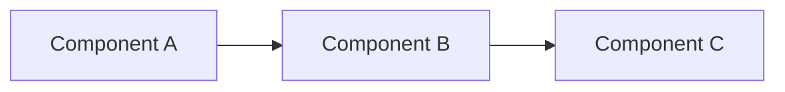
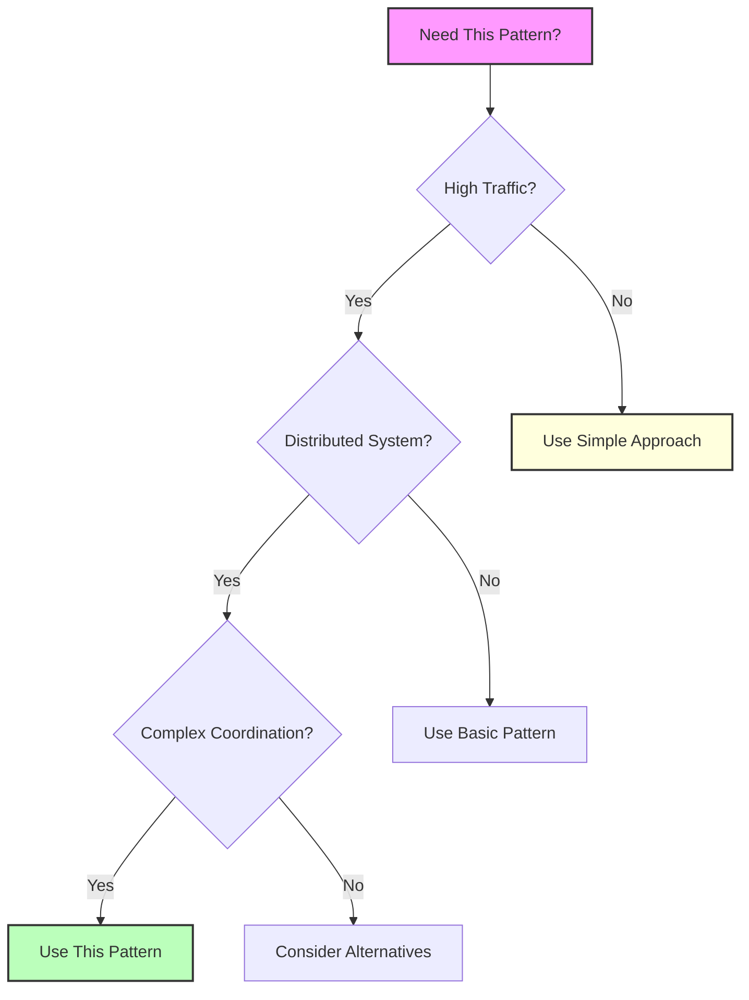

# Visual Asset Creation Plan for Pattern Library
## Essential Question

**When and how should we implement pattern in our distributed system?**


## When to Use / When NOT to Use

### When to Use

| Scenario | Why It Fits | Alternative If Not |
|----------|-------------|-------------------|
| High availability required | Pattern provides resilience | Consider simpler approach |
| Scalability is critical | Handles load distribution | Monolithic might suffice |
| Distributed coordination needed | Manages complexity | Centralized coordination |

### When NOT to Use

| Scenario | Why to Avoid | Better Alternative |
|----------|--------------|-------------------|
| Simple applications | Unnecessary complexity | Direct implementation |
| Low traffic systems | Overhead not justified | Basic architecture |
| Limited resources | High operational cost | Simpler patterns |

## Overview
This document outlines the visual asset creation strategy for the distributed systems pattern library, focusing on creating clear, informative diagrams that enhance understanding of complex patterns.

## Key Visual Types

### 1. State Machine Diagrams
- **Purpose**: Show state transitions and conditions
- **Best for**: Circuit Breaker, Saga, State Machine patterns
- **Tools**: Mermaid stateDiagram-v2

### 2. Sequence Diagrams
- **Purpose**: Show interaction flow over time
- **Best for**: API Gateway, Service Mesh, Request-Reply patterns
- **Tools**: Mermaid sequenceDiagram

### 3. Architecture Diagrams
- **Purpose**: Show system components and relationships
- **Best for**: All architectural patterns
- **Tools**: Mermaid graph TB/LR

### 4. Comparison Matrices
- **Purpose**: Quick decision-making guides
- **Best for**: Pattern selection, trade-offs
- **Format**: Markdown tables with clear headers

### 5. Timeline Visualizations
- **Purpose**: Show timing and delays
- **Best for**: Retry patterns, timeout patterns
- **Tools**: Mermaid graph with temporal annotations

## Priority Patterns for Visual Enhancement

### Tier 1 - Critical Patterns (Immediate)
1. **Circuit Breaker** ✅ COMPLETED
   - Enhanced state machine with annotations
   - Real-time monitoring dashboard mockup
   - Failure detection strategy diagram

2. **Retry with Backoff** ✅ COMPLETED
   - Exponential backoff timeline
   - Thundering herd visualization
   - Strategy comparison diagram

3. **API Gateway** ✅ COMPLETED
   - Request flow sequence diagram
   - Internal architecture components
   - Pattern selection matrix

4. **Load Balancer** (TODO)
   - Algorithm comparison flowchart
   - Health check sequence
   - Traffic distribution visualization

5. **Service Mesh** (TODO)
   - Sidecar proxy architecture
   - Traffic flow diagram
   - Control/data plane separation

### Tier 2 - High-Value Patterns (Week 1)
1. **Rate Limiting**
   - Token bucket visualization
   - Sliding window diagram
   - Algorithm comparison

2. **Saga Pattern**
   - Choreography vs Orchestration
   - Compensation flow
   - State machine diagram

3. **CQRS**
   - Command/Query separation
   - Event flow diagram
   - Consistency boundaries

4. **Event Sourcing**
   - Event stream visualization
   - Snapshot strategy
   - Replay mechanism

5. **Bulkhead**
   - Resource isolation diagram
   - Failure containment
   - Pool allocation strategy

### Tier 3 - Supporting Patterns (Week 2)
1. **Sidecar**
   - Container architecture
   - Communication flow
   - Deployment models

2. **Ambassador**
   - Proxy pattern diagram
   - Protocol translation
   - Service discovery flow

3. **Queue-Based Load Leveling**
   - Queue dynamics
   - Backpressure visualization
   - Scaling behavior

## Visual Standards

### Color Palette
```css
/* Status Colors */
--success: #4ade80;
--warning: #fbbf24;
--error: #f87171;
--info: #60a5fa;

/* Component Colors */
--client: #5448C8;
--gateway: #00BCD4;
--service: #81c784;
--database: #ffb74d;
--queue: #ce93d8;
--cache: #95e1d3;

/* State Colors */
--active: #4ade80;
--inactive: #94a3b8;
--transitioning: #fbbf24;
```

### Diagram Best Practices
1. **Consistency**: Use same shapes/colors for same concepts
2. **Annotations**: Add brief explanations for complex flows
3. **Progressive Disclosure**: Simple overview → detailed view
4. **Real Examples**: Include production metrics where possible
5. **Mobile Friendly**: Ensure readability on small screens

### Mermaid Styling Guidelines
```mermaid
%%{init: {
  'theme': 'base',
  'themeVariables': {
    'primaryColor': '#5448C8',
    'primaryTextColor': '#fff',
    'primaryBorderColor': '#3f33a6',
    'lineColor': '#64748b',
    'secondaryColor': '#00BCD4',
    'tertiaryColor': '#81c784',
    'background': '#f8fafc',
    'mainBkg': '#ffffff',
    'secondBkg': '#f1f5f9'
  }
}}%%
```


## Level 1: Intuition (5 minutes)

*Start your journey with relatable analogies*

### The Elevator Pitch
[Pattern explanation in simple terms]

### Real-World Analogy
[Everyday comparison that explains the concept]

## Level 2: Foundation (10 minutes)

*Build core understanding*

### Core Concepts
- Key principle 1
- Key principle 2
- Key principle 3

### Basic Example


## Level 3: Deep Dive (15 minutes)

*Understand implementation details*

### How It Really Works
[Technical implementation details]

### Common Patterns
[Typical usage patterns]

## Level 4: Expert (20 minutes)

*Master advanced techniques*

### Advanced Configurations
[Complex scenarios and optimizations]

### Performance Tuning
[Optimization strategies]

## Level 5: Mastery (30 minutes)

*Apply in production*

### Real-World Case Studies
[Production examples from major companies]

### Lessons from the Trenches
[Common pitfalls and solutions]


## Decision Matrix



### Quick Decision Table

| Factor | Low Complexity | Medium Complexity | High Complexity |
|--------|----------------|-------------------|-----------------|
| Team Size | < 5 developers | 5-20 developers | > 20 developers |
| Traffic | < 1K req/s | 1K-100K req/s | > 100K req/s |
| Data Volume | < 1GB | 1GB-1TB | > 1TB |
| **Recommendation** | ❌ Avoid | ⚠️ Consider | ✅ Implement |

## Implementation Instructions

### For Each Pattern:
1. **Identify Key Concepts**: What's the core mechanism?
2. **Choose Diagram Type**: State, sequence, architecture, or hybrid
3. **Create Progressive Views**:
   - Simple conceptual diagram
   - Detailed technical diagram
   - Production example with metrics
4. **Add Decision Helpers**:
   - When to use matrix
   - Comparison with alternatives
   - Anti-pattern warnings

### SVG/PNG Export Process
1. **Mermaid to SVG**:
   ```bash
   # Install mermaid-cli
   npm install -g @mermaid-js/mermaid-cli
   
   # Convert .mmd files to SVG
   mmdc -i diagram.mmd -o diagram.svg -t dark -b transparent
   ```

2. **SVG to PNG** (for presentations):
   ```bash
   # Using Inkscape
   inkscape diagram.svg --export-png=diagram.png --export-dpi=300
   
   # Using ImageMagick
   convert -density 300 diagram.svg diagram.png
   ```

3. **Optimization**:
   ```bash
   # Optimize SVG
   svgo diagram.svg -o diagram.min.svg
   
   # Optimize PNG
   optipng -o7 diagram.png
   ```

## Metrics for Success
- **Clarity**: Can a developer understand the pattern in <30 seconds?
- **Completeness**: Does it show all key states/flows?
- **Actionability**: Does it help make implementation decisions?
- **Accessibility**: Is it readable on all devices?

## Next Steps
1. Complete Tier 1 patterns (Load Balancer, Service Mesh)
2. Create reusable Mermaid templates
3. Build pattern comparison tool with visual guides
4. Develop interactive diagram components

## Visual Asset Repository Structure
```
/docs/pattern-library/
├── visual-assets/
│   ├── circuit-breaker/
│   │   ├── state-machine.mmd
│   │   ├── state-machine.svg
│   │   └── monitoring-dashboard.mmd
│   ├── retry-backoff/
│   │   ├── exponential-timeline.mmd
│   │   ├── thundering-herd.mmd
│   │   └── strategy-comparison.mmd
│   └── api-gateway/
│       ├── request-flow.mmd
│       ├── architecture.mmd
│       └── pattern-selection.md
└── templates/
    ├── state-machine-template.mmd
    ├── sequence-diagram-template.mmd
    └── architecture-template.mmd
```