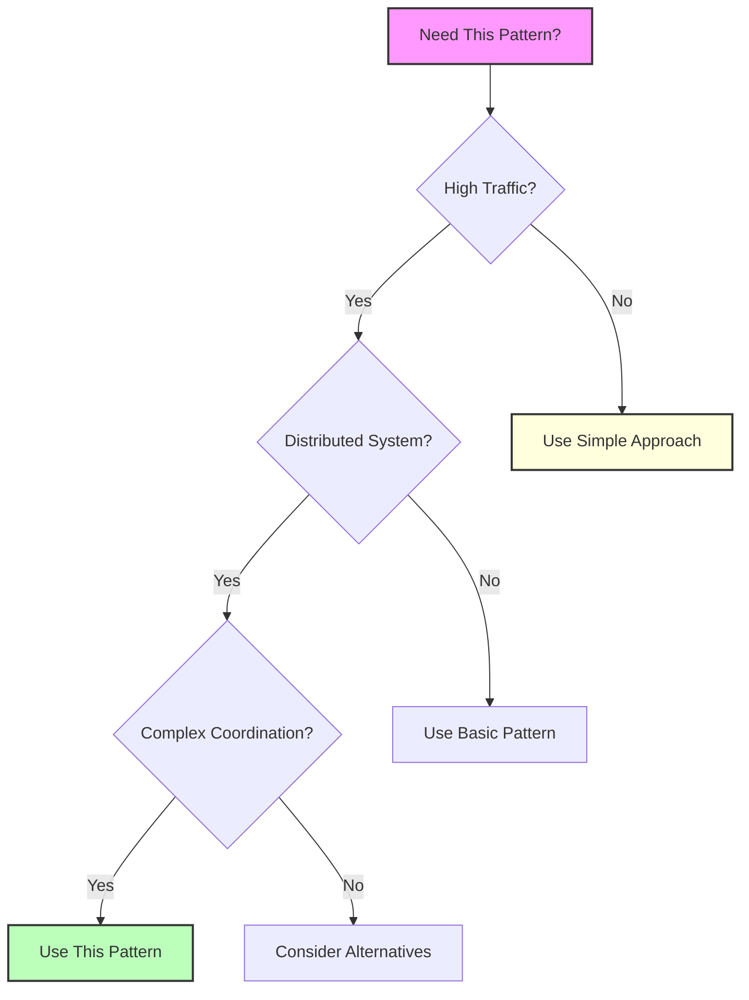

# Pattern Selection Matrices
## Essential Question
## When to Use / When NOT to Use

### When to Use

| Scenario | Why It Fits | Alternative If Not |
|----------|-------------|-------------------|
| High availability required | Pattern provides resilience | Consider simpler approach |
| Scalability is critical | Handles load distribution | Monolithic might suffice |
| Distributed coordination needed | Manages complexity | Centralized coordination |

### When NOT to Use

| Scenario | Why to Avoid | Better Alternative |
|----------|--------------|-------------------|
| Simple applications | Unnecessary complexity | Direct implementation |
| Low traffic systems | Overhead not justified | Basic architecture |
| Limited resources | High operational cost | Simpler patterns |
**When and how should we implement pattern in our distributed system?**

## Resilience Patterns Comparison

| Pattern | Use Case | Failure Type | Response Time | Complexity | When to Use |
|---------|----------|--------------|---------------|------------|-------------|
| **Circuit Breaker** | External services | Cascading failures | Immediate (fail fast) | Medium | • Multiple microservices<br/>• External API calls<br/>• High failure risk |
| **Retry with Backoff** | Transient failures | Temporary issues | Delayed (exponential) | Low | • Network timeouts<br/>• Rate limiting<br/>• Service overload |
| **Bulkhead** | Resource isolation | Resource exhaustion | Normal | Medium | • Multi-tenant systems<br/>• Critical path isolation<br/>• Resource protection |
| **Timeout** | Slow operations | Hanging requests | Bounded | Low | • All network calls<br/>• Database queries<br/>• External APIs |
| **Health Check** | Service monitoring | Service degradation | Proactive | Low | • Load balancer config<br/>• Service discovery<br/>• Auto-scaling |

## API Architecture Patterns

| Pattern | Client Types | Scale | Latency | Flexibility | Example |
|---------|--------------|-------|---------|-------------|---------|
| **API Gateway** | Multiple external | Internet-scale | +5-10ms | High | Netflix Zuul<br/>AWS API Gateway |
| **Service Mesh** | Internal services | Large clusters | +1-2ms | Very High | Istio, Linkerd |
| **BFF (Backend for Frontend)** | Specific clients | Per-client | +10-15ms | Client-optimized | Netflix Mobile BFF |
| **GraphQL Gateway** | Complex queries | Medium-Large | +20-50ms | Query flexibility | GitHub, Shopify |
| **Direct Service** | Single purpose | Small | Minimal | Low | Simple microservices |

## Data Management Patterns

| Pattern | Consistency | Latency | Complexity | Use Case | Trade-offs |
|---------|-------------|---------|------------|----------|------------|
| **CQRS** | Eventual | Read: Low<br/>Write: Normal | High | • Read-heavy workloads<br/>• Complex queries<br/>• Different read/write models | ✅ Optimized reads<br/>✅ Scalable<br/>❌ Complexity<br/>❌ Eventual consistency |
| **Event Sourcing** | Eventual | Write: Low<br/>Read: Variable | Very High | • Audit requirements<br/>• Time travel queries<br/>• Event-driven systems | ✅ Complete history<br/>✅ Audit trail<br/>❌ Storage costs<br/>❌ Query complexity |
| **Saga** | Eventual | Transaction time | High | • Distributed transactions<br/>• Long-running processes<br/>• Cross-service workflows | ✅ No distributed locks<br/>✅ Resilient<br/>❌ Complex rollback<br/>❌ Debugging difficulty |
| **Database per Service** | Service-level | Normal | Medium | • Microservices<br/>• Team autonomy<br/>• Technology diversity | ✅ Independence<br/>✅ Technology choice<br/>❌ Data duplication<br/>❌ Cross-service queries |

## Scaling Patterns Decision Matrix

| Pattern | Scale Type | Cost | Complexity | Response Time | Best For |
|---------|------------|------|------------|---------------|----------|
| **Load Balancing** | Horizontal | Low | Low | No impact | • Stateless services<br/>• Request distribution |
| **Caching** | Read scale | Very Low | Low | Microseconds | • Static content<br/>• Repeated queries |
| **Sharding** | Data scale | Medium | High | Normal | • Large datasets<br/>• Geographic distribution |
| **Queue-Based Load Leveling** | Async scale | Low | Medium | Async delay | • Bursty traffic<br/>• Background jobs |
| **Auto-scaling** | Dynamic | Variable | Medium | Provision time | • Variable load<br/>• Cost optimization |

## Pattern Combination Recommendations

### For High-Traffic APIs
```
API Gateway + Circuit Breaker + Rate Limiting + Caching
```
- **Why**: Complete protection and performance optimization
- **Example**: Netflix, Amazon

### For Microservices Communication
```
Service Mesh + Circuit Breaker + Retry + Distributed Tracing
```
- **Why**: Service-to-service reliability and observability
- **Example**: Uber, Lyft

### For E-commerce Platforms
```
CQRS + Event Sourcing + Saga + API Gateway
```
- **Why**: Handle complex transactions with high read loads
- **Example**: Shopify, eBay

### For Real-time Systems
```
WebSocket + Pub-Sub + Circuit Breaker + Bulkhead
```
- **Why**: Low latency with failure isolation
- **Example**: Discord, Slack

## Quick Decision Flowchart


<details>
<summary>View implementation code</summary>


</details>

## Level 1: Intuition (5 minutes)

*Start your journey with relatable analogies*

### The Elevator Pitch
[Pattern explanation in simple terms]

### Real-World Analogy
[Everyday comparison that explains the concept]

## Level 2: Foundation (10 minutes)

*Build core understanding*

### Core Concepts
- Key principle 1
- Key principle 2
- Key principle 3

### Basic Example


## Level 3: Deep Dive (15 minutes)

*Understand implementation details*

### How It Really Works
[Technical implementation details]

### Common Patterns
[Typical usage patterns]

## Level 4: Expert (20 minutes)

*Master advanced techniques*

### Advanced Configurations
[Complex scenarios and optimizations]

### Performance Tuning
[Optimization strategies]

## Level 5: Mastery (30 minutes)

*Apply in production*

### Real-World Case Studies
[Production examples from major companies]

### Lessons from the Trenches
[Common pitfalls and solutions]


## Decision Matrix



### Quick Decision Table

| Factor | Low Complexity | Medium Complexity | High Complexity |
|--------|----------------|-------------------|-----------------|
| Team Size | < 5 developers | 5-20 developers | > 20 developers |
| Traffic | < 1K req/s | 1K-100K req/s | > 100K req/s |
| Data Volume | < 1GB | 1GB-1TB | > 1TB |
| **Recommendation** | ❌ Avoid | ⚠️ Consider | ✅ Implement |
