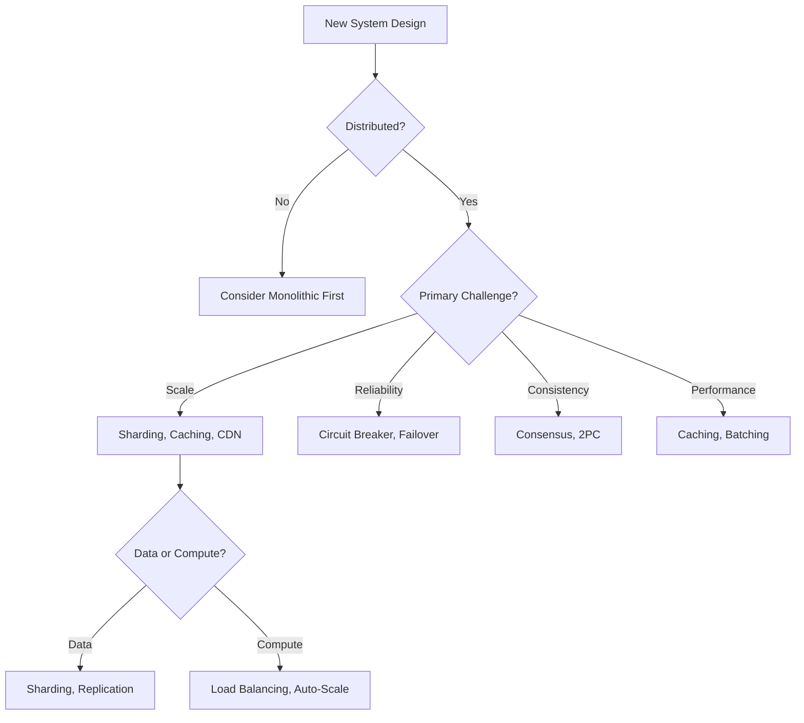
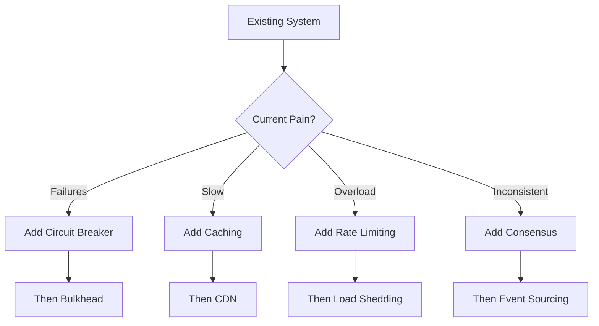

# Pattern Organization Framework

## Overview

DStudio contains 119+ distributed systems patterns. This document provides a comprehensive organization framework to make patterns discoverable through multiple dimensions.

## Primary Organization: By Problem Domain

### 1. Core Distributed Primitives (Foundation)
**Purpose**: Fundamental building blocks that other patterns depend on

#### Consensus & Coordination
- **[Consensus](patterns/consensus)** - Agreement in distributed systems
- **[Leader Election](patterns/leader-election)** - Choosing a coordinator
- **[Emergent Leader](patterns/emergent-leader)** - Gossip-based leadership
- **[Distributed Lock](patterns/distributed-lock)** - Mutual exclusion
- **[Lease](patterns/lease)** - Time-bound ownership
- **[Generation Clock](patterns/generation-clock)** - Epoch tracking

#### Time & Ordering
- **[Logical Clocks](patterns/logical-clocks)** - Event ordering
- **[Vector Clocks](patterns/vector-clocks)** - Causality tracking
- **[HLC](patterns/hlc)** - Hybrid logical clocks
- **[Clock Sync](patterns/clock-sync)** - Time synchronization

#### Communication Primitives
- **[Heartbeat](patterns/heartbeat)** - Failure detection
- **[Gossip Protocol](patterns/gossip-protocol)** - Information dissemination
- **[Single-Socket Channel](patterns/single-socket-channel)** - Connection multiplexing
- **[Request Batching](patterns/request-batching)** - Performance optimization

### 2. Data Management Patterns

#### Storage & Persistence
- **[WAL (Write-Ahead Log)](patterns/wal)** - Durability guarantee
- **[Segmented Log](patterns/segmented-log)** - Log management
- **[LSM Tree](patterns/lsm-tree)** - Write-optimized storage
- **[Distributed Storage](patterns/distributed-storage)** - Multi-node storage

#### Replication & Consistency
- **[Leader-Follower](patterns/leader-follower)** - Primary-backup replication
- **[State Watch](patterns/state-watch)** - Change notifications
- **[Anti-Entropy](patterns/anti-entropy)** - Repair divergence
- **[Low/High-Water Marks](patterns/low-high-water-marks)** - Flow control
- **[Eventual Consistency](patterns/eventual-consistency)** - Convergence guarantee
- **[Tunable Consistency](patterns/tunable-consistency)** - Configurable guarantees

#### Partitioning & Sharding
- **[Sharding](patterns/sharding)** - Horizontal partitioning
- **[Consistent Hashing](patterns/consistent-hashing)** - Dynamic partitioning
- **[Shared Nothing](patterns/shared-nothing)** - Isolation architecture

#### Distributed Transactions
- **[Two-Phase Commit](patterns/two-phase-commit)** - Atomic transactions
- **[Saga](patterns/saga)** - Long-running transactions
- **[Outbox](patterns/outbox)** - Transactional messaging
- **[Distributed Transactions](patterns/distributed-transactions)** - Transaction patterns

### 3. Resilience & Fault Tolerance

#### Circuit Protection
- **[Circuit Breaker](patterns/circuit-breaker)** - Failure isolation
- **[Bulkhead](patterns/bulkhead)** - Resource isolation
- **[Timeout](patterns/timeout)** - Bounded waiting
- **[Retry with Backoff](patterns/retry-backoff)** - Intelligent retries

#### Load Management
- **[Rate Limiting](patterns/rate-limiting)** - Request throttling
- **[Load Shedding](patterns/load-shedding)** - Overload protection
- **[Backpressure](patterns/backpressure)** - Flow control
- **[Graceful Degradation](patterns/graceful-degradation)** - Feature reduction

#### Fault Recovery
- **[Failover](patterns/failover)** - Backup activation
- **[Health Check](patterns/health-check)** - Liveness monitoring
- **[Fault Tolerance](patterns/fault-tolerance)** - Comprehensive resilience
- **[Byzantine Fault Tolerance](patterns/byzantine-fault-tolerance)** - Malicious failures

### 4. Performance & Caching

#### Caching Strategies
- **[Cache Aside](patterns/cache-aside)** - Lazy loading
- **[Read-Through Cache](patterns/read-through-cache)** - Transparent reads
- **[Write-Through Cache](patterns/write-through-cache)** - Synchronous writes
- **[Write-Behind Cache](patterns/write-behind-cache)** - Asynchronous writes
- **[Caching Strategies](patterns/caching-strategies)** - Comprehensive guide

#### Performance Optimization
- **[Bloom Filter](patterns/bloom-filter)** - Probabilistic membership
- **[Materialized View](patterns/materialized-view)** - Precomputed results
- **[CDN](patterns/cdn)** - Content distribution
- **[Auto-Scaling](patterns/auto-scaling)** - Dynamic capacity

### 5. Architectural Patterns

#### Microservices Architecture
- **[Service Mesh](patterns/service-mesh)** - Service communication
- **[API Gateway](patterns/api-gateway)** - Single entry point
- **[Service Registry](patterns/service-registry)** - Service discovery
- **[Sidecar](patterns/sidecar)** - Proxy pattern
- **[Ambassador](patterns/ambassador)** - Remote proxy
- **[Anti-Corruption Layer](patterns/anti-corruption-layer)** - Domain isolation

#### Event-Driven Architecture
- **[Event Sourcing](patterns/event-sourcing)** - Event storage
- **[CQRS](patterns/cqrs)** - Read/write separation
- **[Event Streaming](patterns/event-streaming)** - Real-time events
- **[CDC](patterns/cdc)** - Change data capture
- **[Choreography](patterns/choreography)** - Decentralized workflow

#### Data Architecture
- **[Data Lake](patterns/data-lake)** - Raw data storage
- **[Data Mesh](patterns/data-mesh)** - Domain-oriented data
- **[Lambda Architecture](patterns/lambda-architecture)** - Batch + stream
- **[Kappa Architecture](patterns/kappa-architecture)** - Stream-only
- **[Polyglot Persistence](patterns/polyglot-persistence)** - Multiple databases

### 6. Specialized Domains

#### Edge & IoT
- **[Edge Computing](patterns/edge-computing)** - Distributed edge
- **[Delta Sync](patterns/delta-sync)** - Efficient sync
- **[Battery Optimization](patterns/battery-optimization)** - Power efficiency
- **[Network Optimization](patterns/network-optimization)** - Bandwidth efficiency

#### Geospatial
- **[Geohashing](patterns/geohashing)** - Spatial indexing
- **[Tile Pyramid](patterns/tile-pyramid)** - Map tiles
- **[Vector Tiles](patterns/vector-tiles)** - Efficient maps
- **[Geofencing](patterns/geofencing)** - Location boundaries

#### Security & Privacy
- **[Valet Key](patterns/valet-key)** - Temporary access
- **[E2E Encryption](patterns/e2e-encryption)** - End-to-end security
- **[Key Management](patterns/key-management)** - Cryptographic keys
- **[Consent Management](patterns/consent-management)** - Privacy compliance

#### Analytics & ML
- **[ML Pipeline](patterns/ml-pipeline)** - Machine learning workflow
- **[Time Series IDs](patterns/time-series-ids)** - Temporal data
- **[Analytics Scale](patterns/analytics-scale)** - Big data processing

## Secondary Organization: By System Layer

### Infrastructure Layer
- Consensus, Leader Election, Distributed Lock
- Clock Sync, Heartbeat, Gossip Protocol
- Distributed Storage, WAL, Segmented Log

### Platform Layer
- Service Mesh, API Gateway, Service Registry
- Circuit Breaker, Rate Limiting, Load Balancing
- Caching Strategies, Auto-Scaling

### Application Layer
- CQRS, Event Sourcing, Saga
- Data Mesh, Polyglot Persistence
- ML Pipeline, Analytics Scale

### Cross-Cutting Concerns
- Observability, Health Check, Timeout
- Security patterns, Key Management
- FinOps, Cost Optimization

## Tertiary Organization: By Problem-Solution Matrix

### High Availability Problems
| Problem | Primary Patterns | Supporting Patterns |
|---------|-----------------|-------------------|
| **Single point of failure** | Leader-Follower, Failover | Health Check, Heartbeat |
| **Cascading failures** | Circuit Breaker, Bulkhead | Timeout, Retry |
| **Overload** | Load Shedding, Rate Limiting | Backpressure, Auto-Scaling |
| **Network partitions** | Split-Brain, Consensus | Generation Clock, Lease |

### Scalability Problems
| Problem | Primary Patterns | Supporting Patterns |
|---------|-----------------|-------------------|
| **Data volume** | Sharding, Partitioning | Consistent Hashing |
| **Request volume** | Load Balancing, Caching | CDN, Edge Computing |
| **Geographic scale** | Geo-Replication, Multi-Region | Vector Clocks, CRDTs |

### Consistency Problems
| Problem | Primary Patterns | Supporting Patterns |
|---------|-----------------|-------------------|
| **Distributed state** | Consensus, Two-Phase Commit | Vector Clocks, HLC |
| **Concurrent updates** | CAS, Optimistic Locking | Version Vectors |
| **Eventual consistency** | Anti-Entropy, CRDTs | Gossip, Merkle Trees |

## Pattern Selection Decision Trees

### For New Systems


### For Existing Systems


## Pattern Learning Paths

### 1. Beginner Path (Start Here)
1. **Health Check** → **Timeout** → **Retry**
2. **Circuit Breaker** → **Rate Limiting**
3. **Cache Aside** → **Load Balancing**
4. **Leader-Follower** → **Failover**

### 2. Intermediate Path
1. **Consensus** → **Leader Election** → **Distributed Lock**
2. **Sharding** → **Consistent Hashing**
3. **Event Sourcing** → **CQRS** → **Saga**
4. **Service Mesh** → **API Gateway**

### 3. Advanced Path
1. **Vector Clocks** → **CRDTs** → **Anti-Entropy**
2. **Two-Phase Commit** → **Byzantine Fault Tolerance**
3. **Data Mesh** → **Lambda Architecture**
4. **Emergent Leader** → **Gossip Protocol**

## Pattern Relationships

### Dependency Graph (Core Patterns)
```
Consensus
├── Leader Election
│   ├── Distributed Lock
│   └── Lease
├── State Machine Replication
└── Two-Phase Commit

Gossip Protocol
├── Anti-Entropy
├── Emergent Leader
└── Membership

Circuit Breaker
├── Health Check
├── Timeout
└── Retry with Backoff

Event Sourcing
├── CQRS
├── Saga
└── Outbox
```

### Composition Patterns
- **Service Mesh** = Sidecar + Service Discovery + Load Balancing + Circuit Breaker
- **Data Lake** = Distributed Storage + Partitioning + Schema-on-Read
- **Microservices** = API Gateway + Service Registry + Circuit Breaker + Distributed Tracing

## Implementation Complexity Matrix

| Pattern | Complexity | Time to Implement | Maintenance Burden |
|---------|------------|-------------------|-------------------|
| **Health Check** | Low | Hours | Low |
| **Circuit Breaker** | Low | Days | Low |
| **Caching** | Medium | Days | Medium |
| **Sharding** | High | Weeks | High |
| **Consensus** | Very High | Months | Very High |
| **Service Mesh** | High | Weeks | Medium |
| **Event Sourcing** | High | Weeks | High |

## Anti-Pattern Warnings

### Common Mistakes
1. **Premature Distribution**: Using distributed patterns when monolithic would suffice
2. **Pattern Overload**: Applying too many patterns at once
3. **Wrong Pattern**: Using consensus when eventual consistency is sufficient
4. **Missing Basics**: Advanced patterns without health checks or timeouts

### Pattern Combinations to Avoid
- Two-Phase Commit + Microservices (use Saga instead)
- Synchronous communication + Event Sourcing (defeats purpose)
- Strong consistency + Geo-distribution (physics limits)

## Quick Reference Cards

### For High Availability
```
Essential: Health Check, Circuit Breaker, Timeout
Important: Failover, Load Balancing, Retry
Advanced: Bulkhead, Graceful Degradation
```

### For Scalability
```
Essential: Caching, Load Balancing, Sharding
Important: Consistent Hashing, Auto-Scaling
Advanced: Edge Computing, CDN
```

### For Consistency
```
Essential: Leader Election, Distributed Lock
Important: Vector Clocks, Two-Phase Commit
Advanced: Consensus, CRDTs
```

## Navigation Structure Proposal

```
/patterns/
├── by-domain/
│   ├── core-primitives/
│   ├── data-management/
│   ├── resilience/
│   ├── performance/
│   ├── architecture/
│   └── specialized/
├── by-layer/
│   ├── infrastructure/
│   ├── platform/
│   └── application/
├── by-problem/
│   ├── availability/
│   ├── scalability/
│   ├── consistency/
│   └── performance/
├── learning-paths/
│   ├── beginner/
│   ├── intermediate/
│   └── advanced/
└── quick-reference/
    ├── decision-trees/
    ├── comparison-tables/
    └── anti-patterns/
```

## Conclusion

This organization framework provides multiple ways to discover and understand DStudio's 119+ patterns:
1. **Domain-based**: Natural problem domains
2. **Layer-based**: System architecture layers
3. **Problem-based**: Specific challenges
4. **Learning-based**: Progressive complexity
5. **Relationship-based**: Pattern dependencies

The key is providing multiple entry points so users can find patterns based on their current needs, knowledge level, and system architecture.