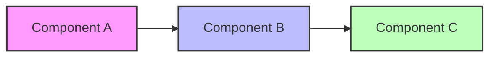

# Pattern Name

**One-line description - The key insight**

> *"A memorable quote that captures the essence of this pattern"*

---

## 🎯 Pattern Overview

### The Problem
Clear description of the problem this pattern solves, including:
- Context where it arises
- Consequences of not addressing it
- Why traditional approaches fail

### The Solution
High-level description of how this pattern addresses the problem:
- Core concept
- Key benefits
- Trade-offs accepted

### When to Use
| ✅ Use When | ❌ Don't Use When |
|-------------|-------------------|
| • Condition 1 | • Opposite condition 1 |
| • Condition 2 | • Opposite condition 2 |
| • Condition 3 | • Opposite condition 3 |

---

## 🏗️ Architecture & Implementation

### Conceptual Model



### Key Components

| Component | Purpose | Responsibilities |
|-----------|---------|------------------|
| **Component A** | What it does | • Task 1<br>• Task 2 |
| **Component B** | What it does | • Task 1<br>• Task 2 |
| **Component C** | What it does | • Task 1<br>• Task 2 |

### Implementation Example

```python
# Clean, commented example showing the pattern in action
class PatternImplementation:
    def __init__(self):
        # Initialize pattern components
        pass
    
    def key_method(self):
        # Demonstrate core pattern behavior
        pass
```

---

## 📊 Analysis & Trade-offs

### Axiom Relationships

| Axiom | How This Pattern Addresses It |
|-------|-------------------------------|
| **Latency** | Impact on response times |
| **Capacity** | Scaling characteristics |
| **Failure** | Failure handling approach |
| **Concurrency** | Concurrent operation support |
| **Coordination** | Coordination requirements |
| **Observability** | Monitoring capabilities |
| **Human Interface** | Operational complexity |
| **Economics** | Cost implications |

### Trade-off Analysis

| Aspect | Gains | Losses |
|--------|-------|--------|
| **Performance** | What improves | What degrades |
| **Complexity** | What simplifies | What complicates |
| **Reliability** | What strengthens | What weakens |
| **Cost** | What saves money | What costs more |

### Common Pitfalls

1. **Pitfall 1**: Description and how to avoid
2. **Pitfall 2**: Description and how to avoid
3. **Pitfall 3**: Description and how to avoid

---

## 🔧 Practical Considerations

### Configuration Guidelines

| Parameter | Description | Typical Range | Default |
|-----------|-------------|---------------|---------|
| **Parameter 1** | What it controls | Min-Max | Value |
| **Parameter 2** | What it controls | Min-Max | Value |
| **Parameter 3** | What it controls | Min-Max | Value |

### Monitoring & Metrics

| Metric | What It Tells You | Alert Threshold |
|--------|-------------------|-----------------|
| **Metric 1** | System health indicator | > X |
| **Metric 2** | Performance indicator | < Y |
| **Metric 3** | Error indicator | > Z |

### Integration Patterns

How this pattern works with others:
- **With Pattern X**: Complementary benefits
- **With Pattern Y**: Potential conflicts
- **With Pattern Z**: Synergistic effects

---

## 🚀 Real-World Examples

### Example 1: Company X
- **Challenge**: Specific problem they faced
- **Implementation**: How they applied this pattern
- **Results**: Measurable outcomes

### Example 2: Company Y
- **Challenge**: Different problem scenario
- **Implementation**: Their approach
- **Results**: What they achieved

---

## 📚 References & Further Reading

1. Original paper or article introducing the pattern
2. Canonical implementation or library
3. Related patterns and concepts
4. Advanced topics and variations

---

## 🎓 Key Takeaways

1. **Core Insight**: The fundamental principle
2. **When It Shines**: Optimal use cases
3. **What to Watch**: Critical success factors
4. **Remember**: Most important thing to remember

---

*"Final thought or quote that reinforces the pattern's value"*