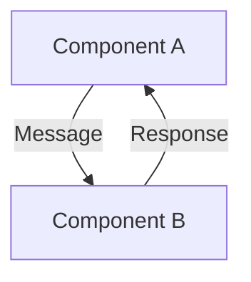

# Pattern Library - Contributor Guide

Welcome to the Distributed Systems Pattern Library! This guide explains our organization, approach, and guidelines for contributing patterns.

## Overview

This pattern library contains 119 distributed systems patterns organized into 14 categories. Each pattern follows a visual-first approach that emphasizes clarity, practical understanding, and real-world applicability.

## Pattern Organization

### Categories

1. **Resilience & Reliability** - Patterns for building fault-tolerant systems
2. **Caching Patterns** - Strategies for optimizing data access
3. **Data Management** - Patterns for distributed data handling
4. **Distributed Coordination** - Consensus and coordination mechanisms
5. **Communication Patterns** - Service-to-service communication strategies
6. **Architectural Patterns** - High-level system organization approaches
7. **Performance & Scaling** - Patterns for optimization and growth
8. **Geographic Distribution** - Multi-region and location-aware patterns
9. **Security Patterns** - Patterns for secure distributed systems
10. **Data Structures** - Distributed data structure implementations
11. **Operations & Monitoring** - Patterns for system observability
12. **URL Shortener Patterns** - Specialized patterns for URL services
13. **Web Crawling Patterns** - Patterns for distributed web crawling
14. **Deduplication Patterns** - Strategies for removing duplicates

### Special Files

- `index.md` - Main pattern library landing page with visual navigation
- `pattern-selector.md` - Interactive tool for finding the right pattern
- `pattern-comparison.md` - Side-by-side pattern comparisons
- `pattern-quiz.md` - Interactive quiz for testing pattern knowledge
- `pattern-combinations.md` - Common pattern combinations and recipes
- `PATTERN_TEMPLATE.md` - Template for new patterns

## Visual-First Approach

Our patterns emphasize visual learning through:

### 1. Visual Components

We use custom-styled boxes to highlight different types of information:

```html
<div class="pattern-box">
  <h4>🎯 Pattern Essence</h4>
  <p>Core concept explained visually</p>
</div>

!!! note "💡 When to Use"
    Decision criteria and use cases

!!! danger "💥 Failure Story"
    Real-world failure scenarios

!!! info "🔍 Key Insight"
    Fundamental truth about the pattern
```

### 2. Mermaid Diagrams

Every pattern should include at least one Mermaid diagram:



### 3. Implementation Guides

Each pattern includes practical implementation with:
- Code examples in multiple languages
- Step-by-step instructions
- Configuration samples
- Common pitfalls

## Quality Standards

### High-Quality Pattern Criteria

A pattern is considered high-quality when it includes:

1. **Complete Documentation** (no TODOs or placeholders)
2. **Visual Elements** (at least one visual box)
3. **Mermaid Diagrams** (illustrating the concept)
4. **Implementation Guide** (practical code examples)
5. **Real-World Examples** (production use cases)
6. **Performance Analysis** (metrics and benchmarks)
7. **Failure Stories** (what can go wrong)
8. **Trade-offs Section** (pros and cons)
9. **Law/Pillar References** (theoretical foundations)
10. **Related Patterns** (connections to other patterns)

### Current Status (as of 2025-01-23)

- **Total Patterns**: 119
- **Complete**: 83 (69.7%)
- **With Visual Elements**: 15 (12.6%)
- **With Diagrams**: 58 (48.7%)
- **High Quality**: 13 (10.9%)

## Contributing Guidelines

### Adding a New Pattern

1. **Start with the Template**
   ```bash
   cp PATTERN_TEMPLATE.md new-pattern-name.md
   ```

2. **Follow the Structure**
   - Pattern name and category
   - Visual introduction with diagram
   - Core concepts with visual boxes
   - Implementation guide
   - Real-world examples
   - Performance considerations
   - Failure scenarios
   - Related patterns

3. **Visual Requirements**
   - At least one Mermaid diagram
   - Use visual boxes for key concepts
   - Include comparison tables where relevant
   - Add metrics and benchmarks

4. **Code Examples**
   - Provide examples in at least 2 languages
   - Include configuration snippets
   - Show both correct and incorrect usage
   - Add performance measurements

### Improving Existing Patterns

Priority areas for improvement:

1. **Add Visual Elements** to patterns lacking them
2. **Create Mermaid Diagrams** for visual learners
3. **Add Failure Stories** from production experiences
4. **Include Performance Data** with benchmarks
5. **Connect to Laws/Pillars** for theoretical grounding
6. **Update Implementation Guides** with modern practices

### Style Guide

1. **Tone**: Educational but practical
2. **Length**: Comprehensive but scannable
3. **Examples**: Real-world, not toy problems
4. **Visuals**: Diagram first, explain second
5. **Code**: Production-ready, not pseudocode

## Pattern Relationships

### Cross-References

Patterns should reference:
- Related patterns in the same category
- Complementary patterns from other categories
- Alternative approaches
- Common combinations

### Law and Pillar Connections

Each pattern should explicitly connect to:
- Relevant Laws from Part 1 (Fundamental constraints)
- Applicable Pillars from Part 2 (Architectural foundations)

## Next Steps for Contributors

### High-Priority Improvements

1. **Complete Incomplete Patterns** (36 remaining)
   - Focus on specialized categories (URL Shortener, Web Crawling, Deduplication)
   
2. **Add Visual Elements** (104 patterns need visuals)
   - Start with high-traffic patterns
   - Use the visual box templates above

3. **Enhance with Diagrams** (61 patterns need diagrams)
   - Create sequence diagrams for communication patterns
   - Add state diagrams for coordination patterns
   - Include architecture diagrams for system patterns

4. **Add Real-World Context**
   - Failure stories from major outages
   - Performance benchmarks from production
   - Case studies from well-known systems

### Tools and Resources

- **Mermaid Live Editor**: https://mermaid.live/
- **Visual Box CSS**: See `/stylesheets/extra.css`
- **Pattern Template**: `PATTERN_TEMPLATE.md`
- **Audit Report**: `AUDIT_REPORT.md` (updated weekly)

## Maintenance

### Regular Tasks

1. **Weekly Audit**: Run the audit script to track progress
2. **Link Checking**: Verify all cross-references work
3. **Consistency Review**: Ensure patterns follow the template
4. **Performance Updates**: Add new benchmarks as available

### Quality Metrics

Track these metrics over time:
- Pattern completion percentage
- Visual element coverage
- Diagram coverage
- High-quality pattern count
- Cross-reference completeness

## Questions?

For questions about the pattern library:
1. Check existing high-quality patterns as examples
2. Review the pattern template
3. Consult the audit report for current status
4. Open an issue for clarification

Remember: The goal is to make distributed systems patterns accessible, visual, and practical for engineers at all levels.