# Ambassador Pattern

**Your diplomatic representative: Bridging the gap between modern and legacy systems**

> *"The Ambassador pattern is like having a multilingual diplomat who speaks both your language and the foreign service's language, handling all the complex negotiations and translations so you don't have to."*

---

## Level 1: Intuition

### The Embassy Analogy

```
Citizen in Country A                    Embassy (Ambassador)
         ↓                                      ↓
"I need a visa"                        Translates request
(Simple request)                       Handles bureaucracy
                                      Knows local customs
                                              ↓
                                      Foreign Government
                                      (Complex protocols)

Application World:                     Ambassador Service:

Modern App                             Ambassador
    ↓                                      ↓
REST/JSON                             Translates to:
(Simple)                              - SOAP/XML
                                     - Custom protocols
                                     - Legacy formats
                                             ↓
                                     Legacy System
                                     (Complex protocols)
```

### Visual Architecture Comparison


### Real-World Examples

| Company | Ambassador Implementation | Purpose | Impact |
|---------|--------------------------|---------|---------|
| **Netflix** | Zuul API Gateway | Protocol translation, routing | 100B+ requests/day |
| **Uber** | Edge Gateway | Mobile API optimization | 50% latency reduction |
| **PayPal** | Legacy adapter services | SOAP to REST translation | 90% faster integration |
| **Stripe** | API compatibility layer | Version bridging | Zero downtime upgrades |
| **Salesforce** | Integration services | Multi-protocol support | 1000+ integrations |


### Common Ambassador Scenarios

```
Scenario 1: Protocol Translation
┌─────────────┐     ┌─────────────┐     ┌─────────────┐
│  REST API   │────▶│  Ambassador │────▶│ SOAP Service│
│   Client    │◀────│  Translates │◀────│   (Legacy)  │
└─────────────┘     └─────────────┘     └─────────────┘

Scenario 2: Authentication Handling
┌─────────────┐     ┌─────────────┐     ┌─────────────┐
│   Modern    │────▶│  Ambassador │────▶│   Complex   │
│    App      │     │ Handles Auth│     │Auth Protocol│
│ (API Keys)  │◀────│  (OAuth→SAML)│◀────│   (SAML)   │
└─────────────┘     └─────────────┘     └─────────────┘

Scenario 3: Retry & Circuit Breaking
┌─────────────┐     ┌─────────────┐     ┌─────────────┐
│   Client    │────▶│  Ambassador │────▶│ Unreliable  │
│   (Simple)  │     │Retry Logic  │     │   Service   │
│             │◀────│Circuit Break│◀──X─│ (May fail)  │
└─────────────┘     └─────────────┘     └─────────────┘
```

---

## Level 2: Foundation

### Core Concepts

```mermaid
graph TB
    subgraph "Ambassador Pattern Architecture"
        subgraph "Client Side"
            C1[Client App 1]
            C2[Client App 2]
            C3[Client App 3]
        end
        
        subgraph "Ambassador Layer"
            AMB[Ambassador Service<br/>━━━━━━━━━━━━━<br/>• Protocol Translation<br/>• Connection Management<br/>• Authentication<br/>• Retry Logic<br/>• Circuit Breaking<br/>• Monitoring]
        end
        
        subgraph "External Services"
            LS1[Legacy SOAP Service]
            LS2[Proprietary Protocol]
            LS3[Third-party API]
            LS4[Mainframe System]
        end
        
        C1 -->|REST| AMB
        C2 -->|GraphQL| AMB
        C3 -->|gRPC| AMB
        
        AMB -->|SOAP/XML| LS1
        AMB -->|Binary Protocol| LS2
        AMB -->|Custom Auth| LS3
        AMB -->|COBOL Gateway| LS4
    end
    
    style AMB fill:#f9f,stroke:#333,stroke-width:4px
```



### Ambassador Pattern Types

| Type | Purpose | Use Case | Complexity |
|------|---------|----------|------------|
| **Protocol Ambassador** | Translate between protocols | REST ↔ SOAP | Medium |
| **Authentication Ambassador** | Handle complex auth flows | OAuth ↔ SAML | High |
| **Resilience Ambassador** | Add reliability patterns | Retry, circuit breaking | Medium |
| **Optimization Ambassador** | Optimize communication | Batching, caching | High |
| **Security Ambassador** | Add security layers | Encryption, validation | High |


### Decision Framework


### Protocol Translation Matrix

| From/To | REST | SOAP | GraphQL | gRPC | Binary |
|---------|------|------|---------|------|--------|
| **REST** | ✓ | Ambassador | Ambassador | Ambassador | Ambassador |
| **SOAP** | Ambassador | ✓ | Ambassador | Ambassador | Ambassador |
| **GraphQL** | Ambassador | Ambassador | ✓ | Ambassador | Ambassador |
| **gRPC** | Ambassador | Ambassador | Ambassador | ✓ | Ambassador |
| **Binary** | Ambassador | Ambassador | Ambassador | Ambassador | ✓ |


### Implementation Strategies

#### 1. Standalone Service Ambassador

```
┌─────────────────────────────────────────────────────┐
│                   Ambassador Service                 │
│  ┌─────────────┐  ┌─────────────┐  ┌─────────────┐ │
│  │   HTTP      │  │  Protocol   │  │   Legacy    │ │
│  │  Handler    │─▶│ Translator  │─▶│   Client    │ │
│  └─────────────┘  └─────────────┘  └─────────────┘ │
│  ┌─────────────┐  ┌─────────────┐  ┌─────────────┐ │
│  │   Cache     │  │   Retry     │  │  Circuit    │ │
│  │  Manager    │  │   Logic     │  │  Breaker    │ │
│  └─────────────┘  └─────────────┘  └─────────────┘ │
└─────────────────────────────────────────────────────┘
```

#### 2. Sidecar Ambassador

```
Pod Boundary
┌───────────────────────────────────────┐
│ ┌─────────────┐    ┌─────────────┐   │
│ │     App     │───▶│ Ambassador  │   │
│ │  Container  │    │  Sidecar    │   │
│ └─────────────┘    └─────────────┘   │
│                           │           │
└───────────────────────────┼───────────┘
                           │
                           ▼
                    External Service
```

#### 3. Library Ambassador

```
Application Process
┌─────────────────────────────────────┐
│  ┌─────────────────────────────┐   │
│  │     Business Logic          │   │
│  └──────────┬──────────────────┘   │
│             │                       │
│  ┌──────────▼──────────────────┐   │
│  │   Ambassador Library         │   │
│  │  • Protocol translation     │   │
│  │  • Connection pooling       │   │
│  │  • Retry handling           │   │
│  └─────────────────────────────┘   │
└─────────────────────────────────────┘
```

### Common Integration Patterns

#### SOAP to REST Translation


#### Legacy Authentication Bridge


### Performance Considerations

| Aspect | Without Ambassador | With Ambassador | Optimization Strategy |
|--------|-------------------|-----------------|----------------------|
| **Latency** | Direct call | +5-10ms | Connection pooling, caching |
| **Throughput** | Native | 80-95% | Async processing, batching |
| **Memory** | App only | +50-200MB | Efficient buffering |
| **CPU** | Protocol in app | Dedicated | Horizontal scaling |
| **Complexity** | High in app | Isolated | Single responsibility |


---

## Level 3: Deep Dive

### Advanced Ambassador Patterns

#### 1. Multi-Protocol Ambassador


#### 2. Intelligent Retry Ambassador


### Protocol Translation Deep Dive

#### SOAP ↔ REST Translation Table

| SOAP Element | REST Equivalent | Translation Strategy |
|--------------|-----------------|---------------------|
| **Envelope** | HTTP Headers | Extract/Generate |
| **Header** | Custom Headers | Map security tokens |
| **Body** | Request Body | XML ↔ JSON |
| **Fault** | Error Response | Status codes + body |
| **Namespace** | URL Path | Namespace → Resource |
| **Operation** | HTTP Method | Action → CRUD |


#### Translation Example Flow

```
REST Request:
POST /api/orders
{
  "customerId": 123,
  "items": [
    {"productId": 456, "quantity": 2}
  ]
}

↓ Ambassador Translation ↓

SOAP Request:
<soap:Envelope xmlns:soap="http://schemas.xmlsoap.org/soap/envelope/">
  <soap:Header>
    <auth:Security>...</auth:Security>
  </soap:Header>
  <soap:Body>
    <ns:CreateOrder xmlns:ns="http://legacy.com/orders">
      <ns:CustomerId>123</ns:CustomerId>
      <ns:Items>
        <ns:Item>
          <ns:ProductId>456</ns:ProductId>
          <ns:Quantity>2</ns:Quantity>
        </ns:Item>
      </ns:Items>
    </ns:CreateOrder>
  </soap:Body>
</soap:Envelope>
```

### Performance Optimization Strategies

#### 1. Connection Pooling


#### 2. Request Batching


### Resilience Patterns

#### Circuit Breaker States


#### Fallback Strategies

| Strategy | Use Case | Example |
|----------|----------|---------|
| **Cache** | Read operations | Return last known good value |
| **Default** | Non-critical data | Return empty/placeholder |
| **Degrade** | Feature toggle | Disable non-essential features |
| **Queue** | Write operations | Store and retry later |
| **Redirect** | Service migration | Route to alternative service |


### Security Considerations

#### Authentication Translation


### Monitoring and Observability

#### Key Metrics to Track

| Metric | Purpose | Alert Threshold |
|--------|---------|-----------------|
| **Translation Latency** | Protocol conversion time | > 10ms |
| **Connection Pool Usage** | Resource utilization | > 80% |
| **Error Rate** | Failed translations | > 1% |
| **Cache Hit Rate** | Performance optimization | < 60% |
| **Circuit Breaker Trips** | System health | > 5/hour |
| **Request Queue Size** | Backpressure indicator | > 1000 |


#### Distributed Tracing


---

## Level 4: Expert

### Production Case Studies

#### Netflix's Edge Gateway Ambassador

Netflix uses Zuul as an ambassador pattern implementation at the edge:

```mermaid
graph TB
    subgraph "Netflix Architecture"
        subgraph "Clients"
            Mobile[Mobile Apps]
            Web[Web Apps]
            TV[Smart TVs]
            Game[Game Consoles]
        end
        
        subgraph "Edge Layer"
            Zuul[Zuul Gateway<br/>━━━━━━━━━━<br/>• Device Detection<br/>• Protocol Adaptation<br/>• A/B Testing<br/>• Rate Limiting<br/>• Authentication]
        end
        
        subgraph "Microservices"
            API1[API Service 1]
            API2[API Service 2]
            Legacy[Legacy Service]
            ThirdParty[3rd Party APIs]
        end
        
        Mobile --> Zuul
        Web --> Zuul
        TV --> Zuul
        Game --> Zuul
        
        Zuul --> API1
        Zuul --> API2
        Zuul --> Legacy
        Zuul --> ThirdParty
    end
    
    style Zuul fill:#f9f,stroke:#333,stroke-width:4px
```



**Key Achievements:**
- 100+ billion requests per day
- 50+ different device types supported
- 99.99% availability
- Sub-50ms added latency

#### PayPal's Legacy Integration Ambassador

PayPal uses ambassador pattern for modernization:

| Metric | Before Ambassador | After Ambassador |
|--------|-------------------|------------------|
| **Integration Time** | 6-12 months | 2-4 weeks |
| **Error Rate** | 5-10% | < 0.1% |
| **Development Speed** | Slow (SOAP complexity) | Fast (REST simplicity) |
| **Maintenance Cost** | High | 70% reduction |


### Advanced Implementation Patterns

#### 1. Adaptive Ambassador


**Adaptive Strategies:**

| Condition | Adaptation | Benefit |
|-----------|------------|---------|
| **High Latency** | Increase cache TTL | Reduce backend calls |
| **Error Spike** | Aggressive circuit breaking | Protect backend |
| **Low Traffic** | Reduce connection pool | Save resources |
| **Peak Hours** | Enable request batching | Improve throughput |


#### 2. Multi-Region Ambassador

```
Region A (US-East)              Region B (EU-West)
┌─────────────────┐            ┌─────────────────┐
│   Ambassador    │◀──────────▶│   Ambassador    │
│  ┌───────────┐  │            │  ┌───────────┐  │
│  │   Cache   │  │            │  │   Cache   │  │
│  │  (Local)  │  │            │  │  (Local)  │  │
│  └───────────┘  │            │  └───────────┘  │
└────────┬────────┘            └────────┬────────┘
         │                              │
         └──────────────┬───────────────┘
                        │
                   Legacy System
                   (Single Region)
```

### Performance Optimization Deep Dive

#### Request Coalescing


#### Intelligent Caching Strategy

| Cache Level | What to Cache | TTL | Invalidation |
|-------------|---------------|-----|--------------|
| **L1: Memory** | Hot data | 1-5 min | Time-based |
| **L2: Redis** | Warm data | 5-60 min | Event-based |
| **L3: CDN** | Static translations | 1-24 hours | Version-based |


### Error Handling Strategies

#### Error Translation Matrix

| Legacy Error | HTTP Status | Client Message | Retry Strategy |
|--------------|-------------|----------------|----------------|
| **SOAP Fault** | 500 | "Service error" | Exponential backoff |
| **Timeout** | 504 | "Request timeout" | Immediate retry once |
| **Auth Failed** | 401 | "Invalid credentials" | No retry |
| **Rate Limited** | 429 | "Too many requests" | Retry after header |
| **Not Found** | 404 | "Resource not found" | No retry |


### Security Best Practices

#### Zero-Trust Ambassador


### Deployment Strategies

#### Blue-Green Ambassador Deployment

```
Current State (Blue Active):
┌─────────────┐     ┌─────────────┐
│   Clients   │────▶│ Blue (v1.0) │────▶ Legacy
└─────────────┘     └─────────────┘

Deploy Green:
┌─────────────┐     ┌─────────────┐
│   Clients   │────▶│ Blue (v1.0) │────▶ Legacy
└─────────────┘     └─────────────┘
                    ┌─────────────┐
                    │Green (v2.0) │────▶ Legacy
                    └─────────────┘

Test & Switch:
┌─────────────┐     ┌─────────────┐
│   Clients   │────▶│Green (v2.0) │────▶ Legacy
└─────────────┘     └─────────────┘
```

---

## Level 5: Mastery

### Theoretical Foundations

#### Ambassador Pattern Principles

1. **Separation of Concerns**
   - Business logic stays clean
   - Infrastructure complexity isolated
   - Protocol details abstracted

2. **Single Responsibility**
   - Ambassador handles ONLY translation/adaptation
   - No business logic in ambassador
   - Clear boundaries

3. **Dependency Inversion**
   - Clients depend on abstractions
   - Legacy details hidden
   - Flexible implementation

### Mathematical Models

#### Performance Impact Model

```
Total_Latency = Network_Latency + Processing_Latency + Queue_Wait

Where:
- Network_Latency = 2 * RTT (extra hop)
- Processing_Latency = Translation_Time + Validation_Time
- Queue_Wait = (λ / (μ - λ)) * Service_Time (M/M/1 queue)

Optimization Goal:
Minimize: Total_Latency
Subject to: Error_Rate < 0.1%
           CPU_Usage < 80%
           Memory_Usage < 2GB
```

#### Capacity Planning

| Metric | Formula | Example |
|--------|---------|---------|
| **Requests/sec** | Client_RPS * Translation_Factor | 1000 * 1.2 = 1200 |
| **CPU Cores** | RPS / (1000 / Latency_ms) | 1200 / (1000/5) = 6 |
| **Memory** | Connections * Buffer_Size + Cache_Size | 1000 * 10KB + 1GB |
| **Network** | RPS * (Request_Size + Response_Size) | 1200 * 5KB = 6MB/s |


### Future Directions

#### AI-Powered Ambassador


**AI Capabilities:**
- Predict request patterns
- Auto-generate protocol mappings
- Optimize caching strategies
- Detect anomalies
- Self-heal configurations

---

## Quick Reference

### When to Use Ambassador Pattern

✅ **Use When:**
- Integrating with legacy systems
- Protocol translation needed
- Complex authentication flows
- Adding resilience to external calls
- Gradual migration strategy

❌ **Don't Use When:**
- Simple, compatible services
- Performance is critical
- Direct integration is possible
- Overhead not justified

### Implementation Checklist

- [ ] Define translation requirements
- [ ] Choose deployment model
- [ ] Design error handling
- [ ] Implement monitoring
- [ ] Add security layers
- [ ] Plan caching strategy
- [ ] Set up circuit breakers
- [ ] Configure connection pools
- [ ] Document mappings
- [ ] Test failure scenarios

### Common Anti-Patterns

1. **Business Logic in Ambassador** - Keep it pure translation
2. **Synchronous Everything** - Use async where possible
3. **No Circuit Breakers** - Always protect backend
4. **Over-caching** - Balance freshness vs performance
5. **Tight Coupling** - Ambassador should be replaceable

### Related Patterns

- **Adapter Pattern** - Similar but typically in-process
- **Facade Pattern** - Simplifies interface but same process
- **Proxy Pattern** - Focuses on access control
- **Gateway Pattern** - Broader routing responsibilities
- **Anti-Corruption Layer** - Domain-driven design context

---

## 🎓 Key Takeaways

1. **Protocol Agnostic** - Clients use simple protocols
2. **Complexity Isolation** - Legacy details hidden
3. **Evolution Enabler** - Gradual migration path
4. **Resilience Layer** - Protect against failures
5. **Operational Benefits** - Monitoring, security, caching

---

*"The Ambassador pattern is your diplomatic solution to the Tower of Babel problem in distributed systems - letting everyone speak their preferred language while ensuring the message gets through."*

---

**Previous**: [← Backends for Frontends](backends-for-frontends.md) | **Next**: Anti-Corruption Layer → (Coming Soon)