# Anti-Corruption Layer (ACL)

**Your domain's immune system: Protecting clean architecture from foreign concepts**

> *"The Anti-Corruption Layer is like a translator at the United Nations - ensuring each domain speaks its own language while still enabling meaningful communication between vastly different systems."*

---

## Level 1: Intuition

### The Immigration Control Analogy

```
Country A (Your Domain)          Border Control (ACL)         Country B (External System)
     Clean Laws                   Translation                  Different Laws
     Pure Culture          ←→     Validation           ←→      Foreign Culture
     Local Currency               Quarantine                   Foreign Currency
     
     
Your Domain:                     Anti-Corruption Layer:        External System:
┌─────────────────┐             ┌─────────────────┐          ┌─────────────────┐
│  Clean Models   │             │   Translators   │          │  Legacy Models  │
│  Domain Logic   │◀───────────▶│   Validators    │◀────────▶│  Complex APIs   │
│  Pure Language  │             │   Adapters      │          │  External Rules │
└─────────────────┘             └─────────────────┘          └─────────────────┘
       Safe                          Checkpoint                    Dangerous
```

### Visual Architecture Comparison

```mermaid
graph TB
    subgraph "Without ACL - Domain Contamination"
        YD1[Your Domain] -->|Direct Integration| ES1[External System 1]
        YD1 -->|Foreign Concepts Leak In| ES2[External System 2]
        YD1 -->|Coupled to External Models| ES3[External System 3]
        
        ES1 -.->|Pollution| YD1
        ES2 -.->|Corruption| YD1
        ES3 -.->|Dependencies| YD1
    end
    
    subgraph "With ACL - Protected Domain"
        YD2[Your Domain<br/>Clean & Pure] --> ACL[Anti-Corruption Layer<br/>━━━━━━━━━━━<br/>• Translation<br/>• Validation<br/>• Isolation]
        
        ACL --> ES4[External System 1]
        ACL --> ES5[External System 2]
        ACL --> ES6[External System 3]
    end
    
    style YD1 fill:#faa,stroke:#333,stroke-width:2px
    style YD2 fill:#afa,stroke:#333,stroke-width:2px
    style ACL fill:#f9f,stroke:#333,stroke-width:4px
```



### Real-World Examples

<div class="responsive-table" markdown>

| Company | ACL Implementation | Purpose | Impact |
|---------|-------------------|---------|---------|
| **Amazon** | Order Service ACL | Isolate from legacy fulfillment | Clean microservices |
| **Netflix** | Billing System ACL | Protect from partner APIs | Domain integrity |
| **Spotify** | Music Rights ACL | Shield from label systems | Flexible licensing |
| **Uber** | Payment Provider ACL | Abstract payment complexity | Provider independence |
| **Airbnb** | Property System ACL | Isolate from partner feeds | Consistent data model |

</div>


### Common ACL Scenarios

```
Scenario 1: Legacy System Integration
┌─────────────┐     ┌─────────────┐     ┌─────────────┐
│   Modern    │────▶│     ACL     │────▶│   Legacy    │
│  Microservice│     │ Translates  │     │  Mainframe  │
│   (DDD)     │◀────│   Models    │◀────│  (COBOL)    │
└─────────────┘     └─────────────┘     └─────────────┘

Scenario 2: Third-Party API Protection
┌─────────────┐     ┌─────────────┐     ┌─────────────┐
│    Your     │────▶│     ACL     │────▶│  External   │
│   Domain    │     │  Validates  │     │    API      │
│   Models    │◀────│  & Adapts   │◀────│ (Unstable)  │
└─────────────┘     └─────────────┘     └─────────────┘

Scenario 3: Multi-System Aggregation
┌─────────────┐     ┌─────────────┐     ┌─────────────┐
│    Core     │────▶│     ACL     │────▶│  System A   │
│  Business   │     │ Orchestrates│────▶│  System B   │
│   Logic     │◀────│ & Combines  │────▶│  System C   │
└─────────────┘     └─────────────┘     └─────────────┘
```

---

## Level 2: Foundation

### Core Concepts


### ACL Pattern Components

<div class="responsive-table" markdown>

| Component | Purpose | Responsibility | Example |
|-----------|---------|----------------|---------|
| **Translator** | Model conversion | Map between domain and external models | Customer ↔ LegacyUser |
| **Validator** | Rule enforcement | Ensure data integrity | Email format validation |
| **Adapter** | Protocol handling | Handle communication details | REST ↔ SOAP |
| **Facade** | Simple interface | Hide complexity from domain | Single method for multi-step process |
| **Repository** | Data access | Abstract storage details | Domain-specific queries |

</div>


### Translation Strategies

#### 1. Model Translation Matrix

```mermaid
graph LR
    subgraph "Domain Model"
        DM[Customer<br/>━━━━━━━<br/>• id: UUID<br/>• email: Email<br/>• name: Name<br/>• tier: CustomerTier]
    end
    
    subgraph "Translation Layer"
        TL[Translator<br/>━━━━━━━<br/>• mapToDomain()<br/>• mapToExternal()<br/>• validate()]
    end
    
    subgraph "External Model"
        EM[USER_RECORD<br/>━━━━━━━<br/>• USER_ID: NUMBER<br/>• EMAIL_ADDR: VARCHAR<br/>• FIRST_NM: VARCHAR<br/>• LAST_NM: VARCHAR<br/>• CUST_TYPE: CHAR]
    end
    
    DM <--> TL <--> EM
```

#### 2. Data Flow Patterns


### Implementation Patterns

#### 1. Repository Pattern with ACL

```
Domain Layer:
┌─────────────────────────────────┐
│   CustomerRepository            │
│   (Interface)                   │
│   ━━━━━━━━━━━━━━━━━━━         │
│   + find(CustomerId): Customer  │
│   + save(Customer): void        │
└─────────────────────────────────┘
                ↓
ACL Implementation:
┌─────────────────────────────────┐
│   LegacyCustomerRepository      │
│   (ACL Implementation)          │
│   ━━━━━━━━━━━━━━━━━━━         │
│   - translator: Translator      │
│   - legacyClient: LegacyAPI     │
│   ─────────────────────         │
│   + find(CustomerId): Customer  │
│   + save(Customer): void        │
└─────────────────────────────────┘
                ↓
External System:
┌─────────────────────────────────┐
│   LegacyDatabaseAPI             │
│   ━━━━━━━━━━━━━━━━━           │
│   + SELECT_USER(ID): USER_REC   │
│   + UPDATE_USER(USER_REC): BOOL │
└─────────────────────────────────┘
```

#### 2. Event Translation

```mermaid
graph TB
    subgraph "Domain Events"
        DE1[OrderPlaced]
        DE2[PaymentReceived]
        DE3[OrderShipped]
    end
    
    subgraph "ACL Event Translator"
        ET[Event Translator<br/>━━━━━━━━━━━<br/>• Domain → External<br/>• External → Domain<br/>• Event Enrichment]
    end
    
    subgraph "External Events"
        EE1[ORDER_CREATED_V1]
        EE2[PAYMENT_NOTIFICATION]
        EE3[SHIPMENT_UPDATE]
    end
    
    DE1 --> ET --> EE1
    DE2 --> ET --> EE2
    DE3 --> ET --> EE3
    
    EE1 --> ET --> DE1
    EE2 --> ET --> DE2
    EE3 --> ET --> DE3
```



### Common Translation Challenges

<div class="responsive-table" markdown>

| Challenge | Problem | ACL Solution |
|-----------|---------|--------------|
| **Impedance Mismatch** | Different data models | Multi-step translation |
| **Missing Data** | External lacks required fields | Default values, enrichment |
| **Format Differences** | Date, currency formats | Format converters |
| **Validation Rules** | Different business rules | Rule adaptation layer |
| **Versioning** | External API changes | Version-specific translators |

</div>


---

## Level 3: Deep Dive

### Advanced ACL Patterns

#### 1. Context Mapping with ACL


#### 2. Multi-Layer Translation


### Translation Patterns Deep Dive

#### 1. Bidirectional Mapping Strategy

```
Domain → External Mapping:
┌────────────────────┐         ┌────────────────────┐
│   Order            │         │   PURCHASE_ORDER    │
│   ────────────     │         │   ─────────────    │
│   orderId: UUID    │   →→→   │   PO_NUM: CHAR(10) │
│   customer: Customer│   →→→   │   CUST_ID: NUMBER  │
│   items: LineItem[] │   →→→   │   (Separate table) │
│   total: Money     │   →→→   │   TOTAL_AMT: DECIMAL│
│   status: Status   │   →→→   │   STATUS_CD: CHAR(1)│
└────────────────────┘         └────────────────────┘

Mapping Rules:
• UUID → Legacy ID (lookup table)
• Customer → Customer ID only
• LineItems → Separate PO_LINES table
• Money → Decimal (currency conversion)
• Status Enum → Status Code
```

#### 2. Validation and Enrichment Pipeline


### Complex Integration Scenarios

#### 1. Aggregating Multiple External Systems


#### 2. Event Stream Translation


### Performance Optimization Strategies

<div class="responsive-table" markdown>

| Strategy | Description | Use Case | Trade-off |
|----------|-------------|----------|-----------|
| **Caching** | Cache translations | Stable mappings | Memory usage |
| **Batch Processing** | Translate in batches | High volume | Latency |
| **Lazy Loading** | Translate on demand | Large objects | First-call penalty |
| **Pre-computation** | Pre-translate common cases | Predictable patterns | Storage |
| **Streaming** | Stream-based translation | Large datasets | Complexity |

</div>


### Error Handling in ACL

#### Error Translation Matrix

<div class="responsive-table" markdown>

| External Error | Domain Exception | Recovery Strategy |
|----------------|------------------|-------------------|
| **Connection Timeout** | ServiceUnavailableException | Retry with backoff |
| **Invalid Data Format** | DataIntegrityException | Log and reject |
| **Business Rule Violation** | DomainRuleException | Return validation error |
| **Authentication Failed** | UnauthorizedException | Refresh credentials |
| **Rate Limited** | ThrottledException | Queue and retry |

</div>


#### Failure Isolation


### Testing Strategies for ACL

#### 1. Contract Testing

```
External Contract Tests:
┌─────────────────────────┐
│   Contract Test Suite   │
│   ─────────────────    │
│   • Request Format      │
│   • Response Format     │
│   • Error Scenarios     │
│   • Edge Cases          │
└───────────┬─────────────┘
            │
            ▼
┌─────────────────────────┐
│   ACL Implementation    │
│   ─────────────────    │
│   ✓ Validates contracts │
│   ✓ Handles all cases   │
└─────────────────────────┘
```

#### 2. Translation Testing Matrix

<div class="responsive-table" markdown>

| Test Type | What to Test | Example |
|-----------|--------------|---------|
| **Unit Tests** | Individual translators | Field mapping logic |
| **Integration Tests** | Full translation pipeline | End-to-end flow |
| **Property Tests** | Translation properties | Roundtrip consistency |
| **Contract Tests** | External system contracts | API compatibility |
| **Performance Tests** | Translation overhead | Latency impact |

</div>


---

## Level 4: Expert

### Production Case Studies

#### Spotify's Music Rights ACL

Spotify uses ACL to integrate with multiple music label systems:


**Key Achievements:**
- 70+ label system integrations
- 99.9% licensing accuracy
- 50% reduction in integration time
- Complete domain isolation

#### Amazon's Order Fulfillment ACL

Amazon uses ACL for warehouse system integration:

<div class="responsive-table" markdown>

| Metric | Before ACL | After ACL |
|--------|------------|-----------|
| **Integration Time** | 6-9 months | 2-3 weeks |
| **Error Rate** | 2-5% | < 0.01% |
| **Change Impact** | System-wide | Isolated to ACL |
| **Testing Coverage** | 60% | 99% |

</div>


### Advanced Implementation Patterns

#### 1. Versioned ACL Strategy


#### 2. Smart Translation Cache


### Evolutionary Architecture with ACL

#### Migration Strategy Using ACL

```
Phase 1: Strangler Fig with ACL
┌─────────────┐     ┌─────────────┐     ┌─────────────┐
│   New       │────▶│     ACL     │────▶│   Legacy    │
│  Service    │     │  (Full)     │     │   System    │
│   (10%)     │◀────│             │◀────│   (90%)     │
└─────────────┘     └─────────────┘     └─────────────┘

Phase 2: Gradual Migration
┌─────────────┐     ┌─────────────┐     ┌─────────────┐
│   New       │────▶│     ACL     │────▶│   Legacy    │
│  Service    │     │  (Partial)  │     │   System    │
│   (50%)     │◀────│             │◀────│   (50%)     │
└─────────────┘     └─────────────┘     └─────────────┘

Phase 3: Complete Migration
┌─────────────┐     ┌─────────────┐     ┌─────────────┐
│   New       │────▶│     ACL     │────▶│   Legacy    │
│  Service    │     │  (Minimal)  │     │   System    │
│   (90%)     │◀────│             │◀────│   (10%)     │
└─────────────┘     └─────────────┘     └─────────────┘
```

### Performance Optimization Deep Dive

#### Translation Performance Metrics

<div class="responsive-table" markdown>

| Operation | Without Optimization | With Optimization | Technique |
|-----------|---------------------|-------------------|-----------|
| **Simple Mapping** | 5ms | 0.5ms | Compiled mappers |
| **Complex Translation** | 50ms | 10ms | Caching + batching |
| **Bulk Operations** | 5000ms | 500ms | Parallel processing |
| **Validation** | 20ms | 2ms | Schema pre-validation |

</div>


#### Memory-Efficient Translation


### Security in ACL

#### Security Layer Architecture


---

## Level 5: Mastery

### Theoretical Foundations

#### Domain-Driven Design Principles

1. **Bounded Context Integrity**
   - Protect domain model purity
   - Maintain ubiquitous language
   - Isolate external influences

2. **Strategic Design**
   - Context mapping
   - Upstream/downstream relationships
   - Integration patterns

3. **Tactical Patterns**
   - Repository abstraction
   - Domain service isolation
   - Value object translation

### Mathematical Models

#### Translation Complexity Model

```
Complexity = M * N * C * V

Where:
- M = Number of source model fields
- N = Number of target model fields
- C = Conversion complexity factor (1-10)
- V = Validation rules count

Example:
- Simple mapping: 10 * 10 * 1 * 5 = 500
- Complex mapping: 50 * 30 * 8 * 20 = 240,000
```

#### Performance Impact Formula

```
Total_Latency = Network_Latency + Translation_Time + Validation_Time

Translation_Time = Base_Time + (Field_Count * Field_Complexity)
Validation_Time = Rule_Count * Average_Rule_Time

Optimization_Target = min(Total_Latency) while maintaining correctness
```

### Design Patterns in ACL

<div class="responsive-table" markdown>

| Pattern | Purpose | When to Use |
|---------|---------|-------------|
| **Translator** | Model conversion | Different representations |
| **Adapter** | Interface matching | Protocol differences |
| **Facade** | Simplification | Complex external APIs |
| **Repository** | Data access abstraction | Storage isolation |
| **Factory** | Object creation | Complex initialization |
| **Strategy** | Algorithm selection | Multiple translation approaches |

</div>


### Future Directions

#### AI-Powered ACL


**AI Capabilities:**
- Auto-generate mappings from examples
- Predict translation patterns
- Optimize caching strategies
- Detect anomalies in data
- Self-healing translations

---

## Quick Reference

### When to Use ACL

✅ **Use When:**
- Integrating with legacy systems
- Protecting domain model purity
- External system has poor design
- Multiple external integrations
- Planning future migrations

❌ **Don't Use When:**
- Simple, well-designed APIs
- Internal service communication
- Performance is critical
- Overhead exceeds benefits

### Implementation Checklist

- [ ] Define bounded context boundaries
- [ ] Map external models to domain
- [ ] Design translation strategy
- [ ] Implement validation rules
- [ ] Add error handling
- [ ] Create comprehensive tests
- [ ] Document mappings
- [ ] Plan versioning strategy
- [ ] Monitor performance
- [ ] Implement security measures

### Common Anti-Patterns

1. **Leaky ACL** - Domain concepts leak out
2. **Fat ACL** - Business logic in translation layer
3. **Synchronous Everything** - No async operations
4. **No Caching** - Repeated translations
5. **Tight Coupling** - ACL depends on internals

### ACL vs Related Patterns

<div class="responsive-table" markdown>

| Pattern | Focus | Scope | Complexity |
|---------|-------|-------|------------|
| **ACL** | Domain protection | Strategic | High |
| **Adapter** | Interface matching | Tactical | Medium |
| **Facade** | Simplification | Tactical | Low |
| **Translator** | Data conversion | Tactical | Medium |
| **Gateway** | Routing | Infrastructure | High |

</div>


---

## 🎓 Key Takeaways

1. **Domain Purity** - Keep your domain model clean
2. **Isolation Layer** - Protect from external changes
3. **Translation Logic** - Centralized and testable
4. **Evolution Enabler** - Easier system migration
5. **Maintainability** - Changes isolated to ACL

---

*"The Anti-Corruption Layer is your domain's diplomatic immunity - allowing interaction with the outside world while maintaining sovereignty over your internal affairs."*

---

**Previous**: [← Sidecar](sidecar.md) | **Next**: GraphQL Federation → (Coming Soon)