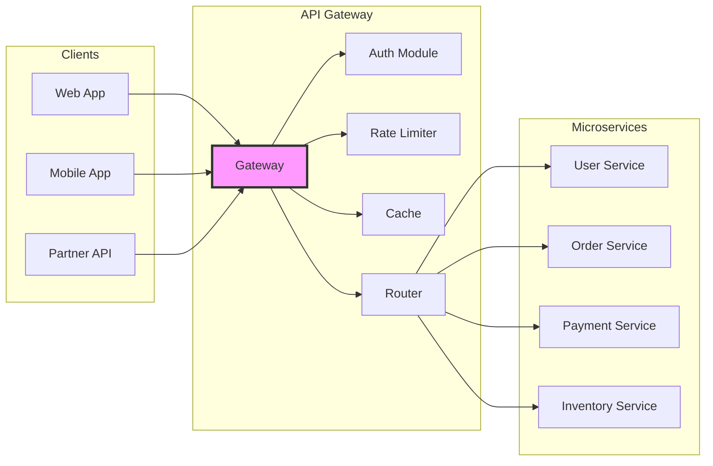
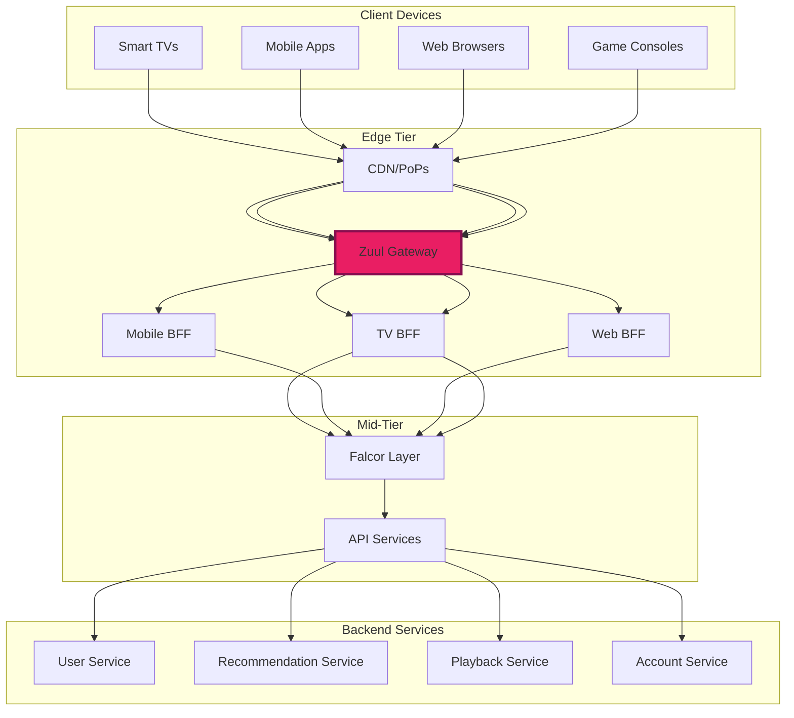

# API Gateway Pattern

<div class="navigation-breadcrumb">
<a href="/">Home</a> > <a href="/patterns/">Patterns</a> > API Gateway
</div>

> "The API Gateway is the front door to your microservices"
> — Chris Richardson

## The Essential Question

**How can we provide a unified interface to multiple microservices while handling cross-cutting concerns like authentication, rate limiting, and protocol translation?**

---

## Level 1: Intuition (5 minutes)

### The Story

A hotel concierge handles all guest requests - restaurant reservations, theater tickets, transportation. Guests don't need to know which staff member handles what; they just ask the concierge who routes their request appropriately.

API Gateway works the same way: clients make requests to one endpoint, and the gateway handles routing, authentication, and coordination.

### Visual Metaphor

```
Without API Gateway:             With API Gateway:

Client → Auth Service            Client → API Gateway
      → User Service                      ├─→ Auth (handled)
      → Order Service                     ├─→ User Service
      → Payment Service                   ├─→ Order Service
      → Inventory Service                 └─→ Payment Service
                                         
Multiple connections              Single entry point
Complex client logic             Simple client interface
```

### In One Sentence

**API Gateway**: A single entry point that routes requests to appropriate microservices while handling cross-cutting concerns like authentication, rate limiting, and protocol translation.

### Real-World Parallel

Like an airport hub - all flights go through the hub which handles security, customs, and routing to final destinations.

---

## Level 2: Foundation (10 minutes)

### The Problem Space

<div class="failure-vignette">
<h4>🔥 Without API Gateway: Mobile App Meltdown</h4>
E-commerce app talking directly to 20 microservices:
- 20 different authentication checks
- Network calls increased battery drain by 300%
- API changes broke the app constantly
- Customer complaints about slow performance
</div>

### Core Responsibilities

1. **Request Routing**: Direct requests to appropriate services
2. **Authentication/Authorization**: Centralized security
3. **Rate Limiting**: Protect backend services
4. **Protocol Translation**: HTTP to gRPC, REST to GraphQL
5. **Response Aggregation**: Combine multiple service responses
6. **Caching**: Reduce backend load
7. **Monitoring**: Track API usage and performance

### Basic Architecture



### Gateway Patterns

| Pattern | Description | Use Case |
|---------|-------------|----------|
| **Single Gateway** | One gateway for all clients | Simple architectures |
| **BFF (Backend for Frontend)** | Separate gateway per client type | Different client needs |
| **Federated Gateway** | Multiple gateways with shared config | Large organizations |
| **GraphQL Gateway** | GraphQL interface to REST services | Flexible querying |

### Key Benefits vs Trade-offs

| Benefit | Trade-off |
|---------|----------|
| Simplified client interface | Additional network hop |
| Centralized security | Single point of failure |
| Protocol flexibility | Gateway complexity |
| Request aggregation | Potential bottleneck |

---

## Level 3: Deep Dive (20 minutes)

### Detailed Implementation

```python
from typing import Dict, List, Optional, Any, Callable
from dataclasses import dataclass
from datetime import datetime, timedelta
import asyncio
import json
import hashlib
from abc import ABC, abstractmethod

# Core Gateway Components
@dataclass
class Request:
    method: str
    path: str
    headers: Dict[str, str]
    body: Optional[str]
    client_ip: str
    timestamp: datetime = None
    
    def __post_init__(self):
        if self.timestamp is None:
            self.timestamp = datetime.utcnow()

@dataclass
class Response:
    status_code: int
    headers: Dict[str, str]
    body: str

# Plugin Interface
class GatewayPlugin(ABC):
    """Base class for gateway plugins"""
    
    @abstractmethod
    async def process_request(self, request: Request) -> Optional[Response]:
        """Process incoming request. Return Response to short-circuit."""
        pass
    
    @abstractmethod
    async def process_response(self, response: Response) -> Response:
        """Process outgoing response."""
        pass

# Authentication Plugin
class AuthenticationPlugin(GatewayPlugin):
    """JWT-based authentication"""
    
    def __init__(self, jwt_secret: str, excluded_paths: List[str] = None):
        self.jwt_secret = jwt_secret
        self.excluded_paths = excluded_paths or ['/health', '/metrics']
        
    async def process_request(self, request: Request) -> Optional[Response]:
        # Skip auth for excluded paths
        if request.path in self.excluded_paths:
            return None
            
        # Extract token
        auth_header = request.headers.get('Authorization', '')
        if not auth_header.startswith('Bearer '):
            return Response(
                status_code=401,
                headers={'Content-Type': 'application/json'},
                body=json.dumps({'error': 'Missing authentication token'})
            )
            
        token = auth_header[7:]  # Remove 'Bearer ' prefix
        
        # Validate token (simplified)
        try:
            payload = self._validate_jwt(token)
            # Add user info to request headers for downstream services
            request.headers['X-User-ID'] = payload['user_id']
            request.headers['X-User-Role'] = payload['role']
            return None  # Continue processing
        except Exception as e:
            return Response(
                status_code=401,
                headers={'Content-Type': 'application/json'},
                body=json.dumps({'error': 'Invalid token'})
            )
            
    async def process_response(self, response: Response) -> Response:
        return response  # No response processing needed
        
    def _validate_jwt(self, token: str) -> Dict:
        # Simplified JWT validation
        # In production, use proper JWT library
        return {'user_id': '123', 'role': 'user'}

# Rate Limiting Plugin
class RateLimitPlugin(GatewayPlugin):
    """Token bucket rate limiting"""
    
    def __init__(self, requests_per_minute: int = 60):
        self.requests_per_minute = requests_per_minute
        self.buckets: Dict[str, List[datetime]] = {}
        
    async def process_request(self, request: Request) -> Optional[Response]:
        # Get client identifier
        client_id = request.headers.get('X-User-ID', request.client_ip)
        
        # Clean old entries
        now = datetime.utcnow()
        if client_id in self.buckets:
            self.buckets[client_id] = [
                ts for ts in self.buckets[client_id]
                if now - ts < timedelta(minutes=1)
            ]
        else:
            self.buckets[client_id] = []
            
        # Check rate limit
        if len(self.buckets[client_id]) >= self.requests_per_minute:
            return Response(
                status_code=429,
                headers={
                    'Content-Type': 'application/json',
                    'X-RateLimit-Limit': str(self.requests_per_minute),
                    'X-RateLimit-Remaining': '0',
                    'X-RateLimit-Reset': str(int((now + timedelta(minutes=1)).timestamp()))
                },
                body=json.dumps({'error': 'Rate limit exceeded'})
            )
            
        # Record request
        self.buckets[client_id].append(now)
        
        # Add rate limit headers
        remaining = self.requests_per_minute - len(self.buckets[client_id])
        request.headers['X-RateLimit-Limit'] = str(self.requests_per_minute)
        request.headers['X-RateLimit-Remaining'] = str(remaining)
        
        return None
        
    async def process_response(self, response: Response) -> Response:
        return response

# Caching Plugin
class CachingPlugin(GatewayPlugin):
    """Simple in-memory cache"""
    
    def __init__(self, ttl_seconds: int = 300):
        self.ttl_seconds = ttl_seconds
        self.cache: Dict[str, tuple[Response, datetime]] = {}
        
    async def process_request(self, request: Request) -> Optional[Response]:
        # Only cache GET requests
        if request.method != 'GET':
            return None
            
        # Generate cache key
        cache_key = self._generate_key(request)
        
        # Check cache
        if cache_key in self.cache:
            response, timestamp = self.cache[cache_key]
            if datetime.utcnow() - timestamp < timedelta(seconds=self.ttl_seconds):
                # Cache hit
                response.headers['X-Cache'] = 'HIT'
                return response
            else:
                # Expired
                del self.cache[cache_key]
                
        return None
        
    async def process_response(self, response: Response) -> Response:
        # Only cache successful responses
        if response.status_code == 200:
            request = response.headers.get('X-Original-Request')
            if request:
                cache_key = self._generate_key(request)
                self.cache[cache_key] = (response, datetime.utcnow())
                response.headers['X-Cache'] = 'MISS'
                
        return response
        
    def _generate_key(self, request: Request) -> str:
        # Generate cache key from request
        key_parts = [
            request.method,
            request.path,
            json.dumps(sorted(request.headers.items())),
            request.body or ''
        ]
        return hashlib.sha256(''.join(key_parts).encode()).hexdigest()

# Service Registry
class ServiceRegistry:
    """Manages backend service endpoints"""
    
    def __init__(self):
        self.services: Dict[str, List[str]] = {}
        self.health_status: Dict[str, bool] = {}
        
    def register_service(self, name: str, endpoints: List[str]):
        """Register service endpoints"""
        self.services[name] = endpoints
        for endpoint in endpoints:
            self.health_status[endpoint] = True
            
    def get_endpoint(self, service_name: str) -> Optional[str]:
        """Get healthy endpoint for service (round-robin)"""
        if service_name not in self.services:
            return None
            
        # Find healthy endpoints
        healthy_endpoints = [
            ep for ep in self.services[service_name]
            if self.health_status.get(ep, False)
        ]
        
        if not healthy_endpoints:
            return None
            
        # Simple round-robin
        return healthy_endpoints[0]  # In production, implement proper LB
        
    async def health_check(self):
        """Periodic health checks"""
        while True:
            for service, endpoints in self.services.items():
                for endpoint in endpoints:
                    # Simplified health check
                    self.health_status[endpoint] = await self._check_endpoint(endpoint)
            await asyncio.sleep(30)  # Check every 30 seconds
            
    async def _check_endpoint(self, endpoint: str) -> bool:
        # In production, make actual health check request
        return True

# Main API Gateway
class APIGateway:
    """Main gateway orchestrator"""
    
    def __init__(self):
        self.plugins: List[GatewayPlugin] = []
        self.routes: Dict[str, str] = {}  # path pattern -> service name
        self.service_registry = ServiceRegistry()
        self.request_id_counter = 0
        
    def add_plugin(self, plugin: GatewayPlugin):
        """Add plugin to processing pipeline"""
        self.plugins.append(plugin)
        
    def add_route(self, path_pattern: str, service_name: str):
        """Add routing rule"""
        self.routes[path_pattern] = service_name
        
    async def handle_request(self, request: Request) -> Response:
        """Main request processing pipeline"""
        # Generate request ID
        self.request_id_counter += 1
        request_id = f"req-{self.request_id_counter}"
        request.headers['X-Request-ID'] = request_id
        
        # Process request through plugins
        for plugin in self.plugins:
            response = await plugin.process_request(request)
            if response:
                # Plugin returned response, short-circuit
                return response
                
        # Route request
        service_name = self._match_route(request.path)
        if not service_name:
            return Response(
                status_code=404,
                headers={'Content-Type': 'application/json'},
                body=json.dumps({'error': 'Route not found'})
            )
            
        # Get service endpoint
        endpoint = self.service_registry.get_endpoint(service_name)
        if not endpoint:
            return Response(
                status_code=503,
                headers={'Content-Type': 'application/json'},
                body=json.dumps({'error': 'Service unavailable'})
            )
            
        # Forward request (simplified)
        response = await self._forward_request(request, endpoint)
        
        # Process response through plugins
        for plugin in reversed(self.plugins):
            response = await plugin.process_response(response)
            
        return response
        
    def _match_route(self, path: str) -> Optional[str]:
        """Match request path to service"""
        # Simplified pattern matching
        for pattern, service in self.routes.items():
            if path.startswith(pattern):
                return service
        return None
        
    async def _forward_request(self, request: Request, endpoint: str) -> Response:
        """Forward request to backend service"""
        # In production, use proper HTTP client
        # This is simplified for illustration
        return Response(
            status_code=200,
            headers={'Content-Type': 'application/json'},
            body=json.dumps({'message': 'Success', 'service': endpoint})
        )

# Advanced Features

# Request Aggregation
class AggregationPlugin(GatewayPlugin):
    """Aggregate multiple backend requests"""
    
    def __init__(self, aggregation_rules: Dict[str, List[str]]):
        self.aggregation_rules = aggregation_rules
        
    async def process_request(self, request: Request) -> Optional[Response]:
        # Check if this is an aggregation endpoint
        if request.path in self.aggregation_rules:
            # Make parallel requests to multiple services
            services = self.aggregation_rules[request.path]
            results = await asyncio.gather(*[
                self._fetch_from_service(service, request)
                for service in services
            ])
            
            # Combine results
            aggregated = {}
            for service, result in zip(services, results):
                aggregated[service] = result
                
            return Response(
                status_code=200,
                headers={'Content-Type': 'application/json'},
                body=json.dumps(aggregated)
            )
            
        return None
        
    async def process_response(self, response: Response) -> Response:
        return response
        
    async def _fetch_from_service(self, service: str, request: Request) -> Dict:
        # In production, make actual service call
        return {'data': f'Response from {service}'}

# Circuit Breaker Integration
class CircuitBreakerPlugin(GatewayPlugin):
    """Circuit breaker for backend services"""
    
    def __init__(self, failure_threshold: int = 5, timeout: int = 60):
        self.failure_threshold = failure_threshold
        self.timeout = timeout
        self.failures: Dict[str, int] = {}
        self.circuit_open: Dict[str, datetime] = {}
        
    async def process_request(self, request: Request) -> Optional[Response]:
        service = request.headers.get('X-Target-Service')
        if not service:
            return None
            
        # Check circuit state
        if service in self.circuit_open:
            if datetime.utcnow() - self.circuit_open[service] < timedelta(seconds=self.timeout):
                return Response(
                    status_code=503,
                    headers={'Content-Type': 'application/json'},
                    body=json.dumps({'error': 'Circuit breaker open'})
                )
            else:
                # Reset circuit
                del self.circuit_open[service]
                self.failures[service] = 0
                
        return None
        
    async def process_response(self, response: Response) -> Response:
        service = response.headers.get('X-Target-Service')
        if not service:
            return response
            
        if response.status_code >= 500:
            # Record failure
            self.failures[service] = self.failures.get(service, 0) + 1
            
            # Open circuit if threshold reached
            if self.failures[service] >= self.failure_threshold:
                self.circuit_open[service] = datetime.utcnow()
                
        else:
            # Reset failure count on success
            self.failures[service] = 0
            
        return response
```

### BFF (Backend for Frontend) Pattern

```python
class BFFGateway(APIGateway):
    """Specialized gateway for specific client types"""
    
    def __init__(self, client_type: str):
        super().__init__()
        self.client_type = client_type
        self.transformers: Dict[str, Callable] = {}
        
    def add_transformer(self, service: str, transformer: Callable):
        """Add response transformer for service"""
        self.transformers[service] = transformer
        
    async def handle_request(self, request: Request) -> Response:
        # Add client type header
        request.headers['X-Client-Type'] = self.client_type
        
        # Process normally
        response = await super().handle_request(request)
        
        # Apply client-specific transformations
        service = request.headers.get('X-Target-Service')
        if service in self.transformers:
            response = await self.transformers[service](response)
            
        return response

# Mobile BFF Example
def mobile_user_transformer(response: Response) -> Response:
    """Transform user data for mobile clients"""
    data = json.loads(response.body)
    
    # Remove unnecessary fields for mobile
    mobile_data = {
        'id': data.get('id'),
        'name': data.get('name'),
        'avatar_url': data.get('avatar_url'),
        # Exclude detailed profile data
    }
    
    response.body = json.dumps(mobile_data)
    return response
```

### GraphQL Gateway

```python
class GraphQLGateway:
    """GraphQL interface to REST microservices"""
    
    def __init__(self):
        self.resolvers: Dict[str, Callable] = {}
        self.schema = None
        
    def add_resolver(self, field: str, resolver: Callable):
        """Add field resolver"""
        self.resolvers[field] = resolver
        
    async def execute_query(self, query: str) -> Dict:
        """Execute GraphQL query"""
        # Parse query (simplified)
        fields = self._parse_query(query)
        
        # Execute resolvers in parallel
        results = await asyncio.gather(*[
            self.resolvers[field]() for field in fields
            if field in self.resolvers
        ])
        
        # Build response
        response = {}
        for field, result in zip(fields, results):
            response[field] = result
            
        return response
        
    def _parse_query(self, query: str) -> List[str]:
        # Simplified query parsing
        # In production, use proper GraphQL parser
        return ['user', 'orders', 'recommendations']
```

---

## Level 4: Expert Practitioner (30 minutes)

### Advanced Gateway Features

#### Dynamic Routing with Service Discovery

```python
class DynamicRouter:
    """Dynamic routing with service discovery"""
    
    def __init__(self, consul_client):
        self.consul = consul_client
        self.route_cache: Dict[str, List[str]] = {}
        self.last_update = datetime.utcnow()
        
    async def discover_routes(self):
        """Discover services from Consul"""
        services = await self.consul.catalog.services()
        
        for service_name, tags in services.items():
            # Get healthy instances
            instances = await self.consul.health.service(
                service_name, 
                passing=True
            )
            
            endpoints = [
                f"{inst['Service']['Address']}:{inst['Service']['Port']}"
                for inst in instances
            ]
            
            self.route_cache[service_name] = endpoints
            
        self.last_update = datetime.utcnow()
        
    async def get_endpoint(self, service_name: str) -> Optional[str]:
        """Get endpoint with auto-refresh"""
        # Refresh cache if stale
        if datetime.utcnow() - self.last_update > timedelta(seconds=30):
            await self.discover_routes()
            
        endpoints = self.route_cache.get(service_name, [])
        if not endpoints:
            return None
            
        # Load balance with weighted round-robin
        return self._weighted_select(endpoints)
```

#### API Versioning

```python
class VersioningPlugin(GatewayPlugin):
    """Handle API versioning"""
    
    def __init__(self, default_version: str = 'v1'):
        self.default_version = default_version
        self.version_routes: Dict[str, Dict[str, str]] = {}
        
    async def process_request(self, request: Request) -> Optional[Response]:
        # Extract version from header or path
        version = request.headers.get('API-Version')
        if not version:
            # Check path: /v2/users -> v2
            path_parts = request.path.split('/')
            if len(path_parts) > 1 and path_parts[1].startswith('v'):
                version = path_parts[1]
            else:
                version = self.default_version
                
        # Update routing based on version
        request.headers['X-API-Version'] = version
        
        # Validate version
        if version not in self.version_routes:
            return Response(
                status_code=400,
                headers={'Content-Type': 'application/json'},
                body=json.dumps({'error': f'Unsupported API version: {version}'})
            )
            
        return None
        
    async def process_response(self, response: Response) -> Response:
        # Add version header to response
        version = response.headers.get('X-API-Version', self.default_version)
        response.headers['API-Version'] = version
        return response
```

### Performance Optimization

<div class="decision-box">
<h4>🎯 Performance Best Practices</h4>

- **Connection Pooling**: Reuse connections to backend services
- **Async I/O**: Use non-blocking I/O for all operations
- **Response Streaming**: Stream large responses instead of buffering
- **Compression**: Enable gzip/brotli for responses
- **HTTP/2**: Use multiplexing for backend connections
- **Cache Headers**: Leverage browser and CDN caching
- **Request Coalescing**: Combine duplicate concurrent requests
- **Timeout Management**: Set appropriate timeouts for each service
</div>

### Monitoring and Observability

```yaml
metrics:
  # Request Metrics
  - name: gateway_requests_total
    description: Total requests processed
    labels: [method, path, status, client_type]
    
  - name: gateway_request_duration
    description: Request processing time
    type: histogram
    labels: [method, path, service]
    
  - name: gateway_backend_duration
    description: Backend service call duration
    type: histogram
    labels: [service, endpoint]
    
  # Error Metrics
  - name: gateway_errors_total
    description: Total errors by type
    labels: [error_type, service]
    
  - name: gateway_circuit_breaker_state
    description: Circuit breaker state
    labels: [service, state]
    
  # Performance Metrics
  - name: gateway_cache_hit_rate
    description: Cache hit ratio
    labels: [cache_type]
    
  - name: gateway_active_connections
    description: Active client connections
    type: gauge
```

### Security Considerations

<div class="failure-vignette">
<h4>⚠️ Common Security Pitfall: Insufficient Rate Limiting</h4>
API Gateway without proper rate limiting → DDoS attack overwhelmed backend services.

**Solution**:
- Multiple rate limit levels (global, per-user, per-endpoint)
- Distributed rate limiting with Redis
- Adaptive rate limiting based on backend health
</div>

---

## Level 5: Mastery (45 minutes)

### Case Study: Netflix's Edge Gateway

<div class="truth-box">
<h4>🏢 Real-World Implementation</h4>

**Company**: Netflix
**Scale**: 200M+ subscribers, 1000+ microservices, 100B+ requests/day

**Challenge**: Provide optimal API for diverse clients (TV, mobile, web) across global infrastructure.

**Architecture**:



**Key Decisions**:
1. **Device-specific BFFs**: Optimize for each client's needs
2. **Falcor for data fetching**: Efficient JSON graph queries
3. **Zuul for edge routing**: Dynamic routing and filtering
4. **Hystrix integration**: Circuit breaking and fallbacks

**Results**:
- 50% reduction in client requests
- 75% decrease in payload sizes for mobile
- 99.99% availability despite backend failures
- Sub-second response times globally

**Lessons**:
1. One size doesn't fit all clients
2. Edge caching crucial for performance
3. Graceful degradation over perfect consistency
4. Observability is non-negotiable
</div>

### Economic Analysis

```python
def calculate_gateway_roi(
    requests_per_day: int,
    microservices_count: int,
    average_payload_kb: float,
    client_types: int
) -> dict:
    """Calculate ROI of implementing API Gateway"""
    
    # Cost without gateway
    without_gateway = {
        'bandwidth': requests_per_day * microservices_count * average_payload_kb * 0.00001,
        'client_development': client_types * microservices_count * 1000,  # Integration cost
        'security_implementation': microservices_count * 5000,  # Per-service security
        'monitoring': microservices_count * 100,  # Per-service monitoring
    }
    
    # Cost with gateway
    with_gateway = {
        'gateway_infrastructure': 10000,  # Monthly
        'bandwidth': requests_per_day * average_payload_kb * 0.7 * 0.00001,  # 30% reduction
        'development': 20000,  # One-time
        'maintenance': 5000,  # Monthly
    }
    
    # Benefits
    monthly_savings = sum(without_gateway.values()) - sum(with_gateway.values())
    
    return {
        'monthly_savings': monthly_savings,
        'payback_months': with_gateway['development'] / monthly_savings,
        'bandwidth_reduction': '30%',
        'development_time_saved': f'{client_types * microservices_count * 40} hours'
    }
```

### Future Directions

**Service Mesh Integration**: API Gateway + Service Mesh for complete traffic management

**AI-Powered Routing**: ML models for intelligent request routing and caching

**Edge Computing**: Push gateway logic to edge locations for ultra-low latency

**WebAssembly Plugins**: High-performance, sandboxed plugin execution

---

## Quick Reference

### Decision Matrix

```mermaid
graph TD
    Start[Need unified API?] --> Q1{Multiple<br/>microservices?}
    Q1 -->|No| Direct[Direct service<br/>access]
    Q1 -->|Yes| Q2{Different<br/>client types?}
    
    Q2 -->|No| Q3{Complex<br/>routing?}
    Q2 -->|Yes| Q4{Shared<br/>logic?}
    
    Q3 -->|No| LoadBalancer[Use load<br/>balancer]
    Q3 -->|Yes| Gateway[Use API<br/>Gateway]
    
    Q4 -->|No| MultipleBFF[Separate BFF<br/>per client]
    Q4 -->|Yes| SharedGateway[Shared gateway<br/>with BFF]
    
    Gateway --> Q5{High<br/>performance?}
    Q5 -->|Yes| Compiled[Compiled gateway<br/>(Envoy, NGINX)]
    Q5 -->|No| Flexible[Flexible gateway<br/>(Kong, Zuul)]
```

### Configuration Template

```yaml
# API Gateway Configuration
api_gateway:
  server:
    port: 8080
    host: 0.0.0.0
    timeout: 30s
    
  routing:
    routes:
      - path: /api/users/*
        service: user-service
        methods: [GET, POST, PUT, DELETE]
        
      - path: /api/orders/*
        service: order-service
        strip_prefix: true
        
      - path: /api/products/*
        service: product-service
        load_balancer: round_robin
        
  plugins:
    - name: authentication
      config:
        type: jwt
        secret: ${JWT_SECRET}
        excluded_paths: [/health, /metrics]
        
    - name: rate_limiting
      config:
        requests_per_minute: 60
        burst: 100
        by: user_id
        
    - name: caching
      config:
        ttl: 300
        max_size: 1000
        
    - name: cors
      config:
        origins: ["https://example.com"]
        methods: [GET, POST, PUT, DELETE]
        headers: [Content-Type, Authorization]
        
  service_discovery:
    type: consul
    address: consul:8500
    refresh_interval: 30s
    
  circuit_breaker:
    failure_threshold: 5
    timeout: 60s
    half_open_requests: 3
    
  observability:
    metrics:
      enabled: true
      endpoint: /metrics
      
    tracing:
      enabled: true
      sample_rate: 0.1
      exporter: jaeger
      
    logging:
      level: info
      format: json
```

### Common Patterns

```bash
# Health Checks
GET /health
GET /ready

# Metrics
GET /metrics

# Service Discovery
GET /services
GET /services/{name}/endpoints

# Configuration
GET /config
POST /config/reload

# Circuit Breaker Status
GET /circuit-breakers
POST /circuit-breakers/{service}/reset
```

### Performance Benchmarks

| Gateway Type | Requests/sec | Latency (p99) | CPU Usage | Memory |
|--------------|--------------|---------------|-----------|---------|
| NGINX | 50,000 | 2ms | 20% | 100MB |
| Envoy | 45,000 | 3ms | 25% | 150MB |
| Kong | 25,000 | 5ms | 40% | 300MB |
| Zuul 2 | 20,000 | 8ms | 50% | 500MB |
| Express Gateway | 15,000 | 10ms | 60% | 200MB |

---

## Related Resources

### Patterns
- [Service Mesh](../patterns/service-mesh.md) - Service-to-service communication
- [Circuit Breaker](../patterns/circuit-breaker.md) - Handling downstream failures
- [Rate Limiting](../patterns/rate-limiting.md) - Protecting backend services
- [Saga Pattern](../patterns/saga.md) - Distributed transactions through gateway

### Laws
- [Law 6 (Cognitive Load 🤯)](../part1-axioms/axiom6-human-api/index.md) - API design principles
- [Law 2 (Asynchronous Reality ⏳)](../part1-axioms/axiom2-asynchrony/index.md) - Performance implications
- [Law 5 (Distributed Knowledge 🧠)](../part1-axioms/axiom5-epistemology/index.md) - Monitoring and tracing

### Tools & Technologies
- **Open Source**: Kong, Zuul, Tyk, Express Gateway
- **Cloud Native**: Envoy, NGINX, HAProxy, Traefik
- **Commercial**: AWS API Gateway, Azure API Management, Google Apigee
- **Service Mesh**: Istio Gateway, Linkerd, Consul Connect

### Further Reading
- [Building Microservices](https://www.oreilly.com/library/view/building-microservices-2nd/9781492034018/) - Sam Newman
- [API Gateway Pattern](https://microservices.io/patterns/apigateway.html) - Chris Richardson
- [Netflix Zuul](https://github.com/Netflix/zuul/wiki) - How Netflix does API Gateway
- [API Design Patterns](https://www.manning.com/books/api-design-patterns) - JJ Geewax

---

<div class="navigation-links">
<div class="prev-link">
<a href="/patterns/">← Back to Patterns</a>
</div>
<div class="next-link">
<a href="/patterns/service-mesh">Next: Service Mesh →</a>
</div>
</div>