<!-- Navigation -->
[Home](../introduction/index.md) → [Part III: Patterns](index.md) → **Backends For Frontends**

# Backends For Frontends (BFF)

**One API doesn't fit all: Tailored backends for optimal frontend experiences**

> *"The best API is the one designed specifically for its consumer. In a world of diverse clients—mobile, web, TV, voice—one size fits none."*

---

## 🎯 Level 1: Intuition

### The Restaurant Menu Analogy

```
Traditional API (Single Menu):              BFF Pattern (Custom Menus):

         Restaurant                              Restaurant Kitchen
             ↓                                          ↓
    📋 One Giant Menu                        ┌──────────┬──────────┐
         ↓       ↓                           │          │          │
    👨 Diner  📱 Delivery                   🍽️ Diner   🚴 Delivery  🏠 Home
    (confused) (scrolling)                   Menu      Menu       Cook Kit
                                            (full)    (photos)   (recipes)

Problems:                                   Solutions:
- Mobile users scroll forever               - Each client gets what it needs
- Voice orders need descriptions           - Optimized for use case
- Kids menu mixed with wine list           - No over/under-fetching
- Vegetarians hunt through meat           - Perfect fit for UI
```

```
Traditional Single API:                     BFF Architecture:

    Mobile  Web  TV  IoT                    Mobile  Web  TV  IoT
      ↓     ↓    ↓   ↓                        ↓     ↓    ↓   ↓
      └─────┴────┴───┘                        │     │    │   │
             ↓                           Mobile  Web   TV   IoT
        Generic API                        BFF   BFF  BFF  BFF
             ↓                                └─────┴────┴───┘
     ┌───────┴────────┐                              ↓
     │                │                       Core Services
  Service A      Service B                    (Unchanged)
```

### Real-World Examples

| Company | BFF Implementation | Impact |
|---------|-------------------|---------|
| **Netflix** | Separate BFFs for 1000+ device types | 50% reduction in client code |
| **SoundCloud** | Mobile BFF vs Web BFF | 60% faster mobile app |
| **Spotify** | BFFs for iOS, Android, Web, TV | Device-specific optimizations |
| **Airbnb** | GraphQL BFF layer | 10x developer productivity |
| **LinkedIn** | Pemberton BFF framework | 50% API response time reduction |

### Basic Implementation

```python
# Traditional monolithic API approach
class UniversalAPI:
    """One API trying to serve all clients"""
    
    def get_product(self, product_id: str, client_type: str = None):
        # Fetch everything
        product = db.get_product(product_id)
        reviews = db.get_reviews(product_id)
        recommendations = db.get_recommendations(product_id)
        inventory = db.get_inventory(product_id)
        shipping = db.get_shipping_options(product_id)
        
        # Client tries to filter (but gets everything)
        return {
            'product': product,
            'reviews': reviews[:100],  # Mobile doesn't need all
            'recommendations': recommendations,
            'inventory': inventory,
            'shipping': shipping,
            'related_products': self.get_related(product_id),
            'seller_info': self.get_seller(product.seller_id),
            'questions': self.get_questions(product_id),
            # ... 20 more fields mobile doesn't use
        }

# BFF Pattern - Mobile-specific backend
class MobileBFF:
    """Backend specifically for mobile app"""
    
    def __init__(self):
        self.product_service = ProductService()
        self.cache = RedisCache()
        
    def get_product_mobile(self, product_id: str, screen_size: str):
        """Optimized for mobile constraints"""
        
        # Check cache first (mobile needs speed)
        cached = self.cache.get(f"mobile:product:{product_id}")
        if cached:
            return cached
        
        # Fetch only what mobile needs
        product = self.product_service.get_basic_info(product_id)
        
        # Mobile-optimized response
        response = {
            'id': product_id,
            'title': self._truncate_title(product.title, screen_size),
            'price': product.price,
            'image': self._get_optimized_image(product.images, screen_size),
            'in_stock': product.inventory > 0,
            'rating': product.rating,
            'review_count': product.review_count,
            # Only 2 reviews for preview
            'top_reviews': self._get_top_reviews(product_id, limit=2),
            # Simplified shipping
            'delivery': self._calculate_delivery_estimate(product_id)
        }
        
        self.cache.set(f"mobile:product:{product_id}", response, ttl=300)
        return response
    
    def _get_optimized_image(self, images: list, screen_size: str):
        """Return image URL optimized for device"""
        if screen_size == 'small':
            return images[0].replace('.jpg', '_320x320.jpg')
        elif screen_size == 'medium':
            return images[0].replace('.jpg', '_750x750.jpg')
        else:
            return images[0].replace('.jpg', '_1024x1024.jpg')

# BFF Pattern - Web-specific backend
class WebBFF:
    """Backend specifically for web application"""
    
    def get_product_web(self, product_id: str):
        """Rich experience for desktop users"""
        
        # Parallel fetching for performance
        with concurrent.futures.ThreadPoolExecutor() as executor:
            product_future = executor.submit(
                self.product_service.get_full_details, product_id
            )
            reviews_future = executor.submit(
                self.review_service.get_paginated_reviews, product_id
            )
            qna_future = executor.submit(
                self.qna_service.get_questions, product_id
            )
            
        return {
            'product': product_future.result(),
            'reviews': reviews_future.result(),
            'questions': qna_future.result(),
            'recommendations': self._get_personalized_recs(product_id),
            'recently_viewed': self._get_recently_viewed(),
            'comparison_tools': self._get_comparison_data(product_id),
            'social_proof': self._get_social_signals(product_id)
        }

# BFF Pattern - Smart TV backend
class SmartTVBFF:
    """Backend for TV interfaces"""
    
    def get_product_tv(self, product_id: str, voice_command: bool = False):
        """Optimized for 10-foot UI and remote control"""
        
        product = self.product_service.get_basic_info(product_id)
        
        response = {
            'id': product_id,
            'title': product.title,
            'price': self._format_price_for_tv(product.price),
            # Large images for TV
            'hero_image': self._get_tv_optimized_image(product.images),
            'gallery': self._create_tv_gallery(product.images[:5]),
            # Simplified navigation
            'actions': [
                {'label': 'Buy Now', 'action': 'purchase', 'button': 'OK'},
                {'label': 'Add to Cart', 'action': 'cart', 'button': 'GREEN'},
                {'label': 'More Info', 'action': 'details', 'button': 'BLUE'}
            ]
        }
        
        if voice_command:
            # Add voice-friendly descriptions
            response['voice_description'] = self._generate_voice_description(product)
            response['voice_actions'] = ['buy', 'add to cart', 'show reviews']
        
        return response
```

---

## 🏗️ Level 2: Foundation

### Core Concepts

```mermaid
graph TB
    subgraph "BFF Architecture Pattern"
        subgraph "Client Layer"
            Mobile[📱 Mobile App]
            Web[💻 Web App]
            TV[📺 Smart TV]
            Voice[🔊 Voice Assistant]
        end
        
        subgraph "BFF Layer"
            MobileBFF[Mobile BFF<br/>- Optimized payloads<br/>- Offline support<br/>- Push notifications]
            WebBFF[Web BFF<br/>- Rich features<br/>- SEO data<br/>- Real-time updates]
            TVBFF[TV BFF<br/>- Large UI elements<br/>- Remote navigation<br/>- Video previews]
            VoiceBFF[Voice BFF<br/>- NLP integration<br/>- Audio responses<br/>- Context aware]
        end
        
        subgraph "Core Services"
            Auth[Auth Service]
            Product[Product Service]
            Order[Order Service]
            User[User Service]
            Recommend[Recommendation Service]
        end
        
        Mobile --> MobileBFF
        Web --> WebBFF
        TV --> TVBFF
        Voice --> VoiceBFF
        
        MobileBFF --> Auth
        MobileBFF --> Product
        MobileBFF --> User
        
        WebBFF --> Auth
        WebBFF --> Product
        WebBFF --> Order
        WebBFF --> Recommend
        
        TVBFF --> Auth
        TVBFF --> Product
        
        VoiceBFF --> Auth
        VoiceBFF --> Product
        VoiceBFF --> Order
    end
    
    style MobileBFF fill:#f9f,stroke:#333,stroke-width:4px
    style WebBFF fill:#9f9,stroke:#333,stroke-width:4px
```



### BFF Patterns

#### 1. Mobile BFF Pattern

```python
class MobileBFFService:
    """
    Mobile-specific optimizations:
    - Minimize payload size
    - Handle offline scenarios  
    - Battery-conscious operations
    - Network-aware fetching
    """
    
    def __init__(self):
        self.cache = MobileOptimizedCache()
        self.push_service = PushNotificationService()
        
    async def get_home_feed(self, user_id: str, connection_type: str):
        """Adapt response based on network conditions"""
        
        # Network-aware data fetching
        if connection_type == '2G':
            return await self._get_lite_feed(user_id)
        elif connection_type == '3G':
            return await self._get_standard_feed(user_id)
        else:  # 4G/5G/WiFi
            return await self._get_rich_feed(user_id)
    
    async def _get_lite_feed(self, user_id: str):
        """Ultra-light feed for slow connections"""
        
        # Only essential data
        posts = await self.post_service.get_latest(user_id, limit=10)
        
        return {
            'posts': [
                {
                    'id': p.id,
                    'text': p.text[:100],  # Truncated
                    'author': p.author_name,
                    # No images on 2G
                    'has_image': bool(p.images)
                }
                for p in posts
            ],
            'next_sync': self._calculate_sync_interval('2G')
        }
    
    async def _get_rich_feed(self, user_id: str):
        """Full experience for fast connections"""
        
        # Parallel fetching
        posts, stories, notifications = await asyncio.gather(
            self.post_service.get_latest(user_id, limit=50),
            self.story_service.get_active_stories(user_id),
            self.notification_service.get_unread(user_id)
        )
        
        return {
            'posts': [self._enrich_post(p) for p in posts],
            'stories': [self._prepare_story(s) for s in stories],
            'notifications': notifications,
            'prefetch_hints': self._generate_prefetch_hints(posts)
        }
    
    def _generate_prefetch_hints(self, posts: list):
        """Tell mobile app what to cache"""
        
        # Images likely to be viewed
        image_urls = []
        for post in posts[:10]:  # First 10 posts
            if post.images:
                # Mobile-optimized sizes
                image_urls.append(
                    self._get_cdn_url(post.images[0], size='mobile')
                )
        
        return {
            'images': image_urls,
            'cache_duration': 3600,  # 1 hour
            'cache_strategy': 'lru'
        }
    
    def handle_offline_action(self, action: dict):
        """Queue actions taken while offline"""
        
        # Store in local queue
        self.offline_queue.add({
            'action': action,
            'timestamp': time.time(),
            'retry_count': 0
        })
        
        # Sync when online
        if self.is_online():
            return self.sync_offline_queue()
        
        return {'queued': True, 'queue_size': self.offline_queue.size()}
```

#### 2. Web BFF Pattern

```python
class WebBFFService:
    """
    Web-specific features:
    - SEO optimization
    - Rich interactions
    - Real-time updates
    - Progressive enhancement
    """
    
    def __init__(self):
        self.ssr_renderer = ServerSideRenderer()
        self.websocket_manager = WebSocketManager()
        self.seo_service = SEOService()
        
    async def get_product_page(self, product_id: str, request_context: dict):
        """Rich product page with SEO and interactivity"""
        
        # Check if crawler for SEO
        is_crawler = self._is_search_crawler(request_context['user_agent'])
        
        if is_crawler:
            return await self._get_seo_optimized_page(product_id)
        
        # Regular user - rich experience
        product_data = await self._get_full_product_data(product_id)
        
        # Server-side rendering for fast initial paint
        initial_html = self.ssr_renderer.render_product(product_data)
        
        return {
            'html': initial_html,
            'data': product_data,
            'websocket_url': self._create_realtime_session(product_id),
            'feature_flags': self._get_web_features(request_context)
        }
    
    async def _get_seo_optimized_page(self, product_id: str):
        """Optimized for search engines"""
        
        product = await self.product_service.get_details(product_id)
        
        return {
            'html': self._render_seo_html(product),
            'structured_data': {
                '@context': 'https://schema.org',
                '@type': 'Product',
                'name': product.name,
                'description': product.description,
                'image': product.primary_image,
                'offers': {
                    '@type': 'Offer',
                    'price': product.price,
                    'priceCurrency': 'USD',
                    'availability': 'https://schema.org/InStock'
                },
                'aggregateRating': {
                    '@type': 'AggregateRating',
                    'ratingValue': product.rating,
                    'reviewCount': product.review_count
                }
            },
            'meta_tags': self.seo_service.generate_meta_tags(product)
        }
    
    def create_realtime_channel(self, channel_id: str):
        """WebSocket channel for real-time updates"""
        
        class RealtimeChannel:
            def __init__(self, channel_id):
                self.channel_id = channel_id
                self.subscribers = set()
                
            async def subscribe(self, websocket):
                self.subscribers.add(websocket)
                await websocket.send_json({
                    'type': 'subscribed',
                    'channel': self.channel_id
                })
                
            async def broadcast(self, event_type: str, data: dict):
                message = {
                    'type': event_type,
                    'data': data,
                    'timestamp': time.time()
                }
                
                # Send to all subscribers
                disconnected = set()
                for ws in self.subscribers:
                    try:
                        await ws.send_json(message)
                    except:
                        disconnected.add(ws)
                
                # Clean up disconnected
                self.subscribers -= disconnected
        
        return RealtimeChannel(channel_id)
```

#### 3. GraphQL BFF Pattern

```python
class GraphQLBFF:
    """
    Flexible BFF using GraphQL for client-specific queries
    """
    
    def __init__(self):
        self.schema = self._build_schema()
        self.data_loader = DataLoader()
        
    def _build_schema(self):
        """Define GraphQL schema"""
        
        return graphene.Schema(
            query=Query,
            mutation=Mutation,
            subscription=Subscription
        )
    
    class Query(graphene.ObjectType):
        """Client can request exactly what they need"""
        
        product = graphene.Field(
            Product,
            id=graphene.ID(required=True),
            include_reviews=graphene.Boolean(default_value=False),
            review_limit=graphene.Int(default_value=10)
        )
        
        def resolve_product(self, info, id, include_reviews, review_limit):
            # Get base product
            product = ProductService.get_by_id(id)
            
            # Only fetch reviews if requested
            if include_reviews:
                product.reviews = ReviewService.get_reviews(
                    id, 
                    limit=review_limit
                )
            
            return product
        
        # Mobile-optimized query
        mobile_home = graphene.Field(MobileHome)
        
        def resolve_mobile_home(self, info):
            # Optimized single query for mobile home screen
            return {
                'featured_products': ProductService.get_featured(limit=5),
                'categories': CategoryService.get_top(limit=8),
                'user_stats': UserService.get_summary(info.context.user_id)
            }
    
    class Product(graphene.ObjectType):
        """Product type with optional fields"""
        
        id = graphene.ID()
        name = graphene.String()
        price = graphene.Float()
        
        # Expensive fields resolved only if requested
        reviews = graphene.List(Review)
        recommendations = graphene.List(lambda: Product)
        
        # Device-specific image URLs
        image_url = graphene.String(
            size=graphene.String(default_value='medium')
        )
        
        def resolve_image_url(self, info, size):
            # Return appropriate image based on requested size
            return ImageService.get_optimized_url(self.images[0], size)
```

### BFF Aggregation Patterns

```python
class BFFAggregator:
    """
    Common aggregation patterns for BFFs
    """
    
    def __init__(self):
        self.circuit_breaker = CircuitBreaker()
        self.cache = LayeredCache()
        
    async def aggregate_parallel(self, requests: list):
        """
        Parallel aggregation with partial failure handling
        """
        
        results = {}
        errors = {}
        
        # Execute all requests in parallel
        tasks = {
            name: self._execute_with_fallback(name, func)
            for name, func in requests
        }
        
        # Gather results
        for name, task in tasks.items():
            try:
                results[name] = await task
            except Exception as e:
                errors[name] = str(e)
                results[name] = self._get_fallback_data(name)
        
        return {
            'data': results,
            'errors': errors,
            'partial': len(errors) > 0
        }
    
    async def aggregate_sequential(self, operations: list):
        """
        Sequential aggregation with data dependencies
        """
        
        context = {}
        
        for operation in operations:
            # Check if dependencies are met
            if not self._check_dependencies(operation, context):
                continue
            
            # Execute operation with context
            result = await operation['func'](context)
            
            # Update context for next operations
            context[operation['name']] = result
            
            # Early exit conditions
            if operation.get('stop_on_failure') and not result:
                break
        
        return context
    
    def create_field_resolver(self, field_map: dict):
        """
        Create efficient field resolvers
        """
        
        class DynamicResolver:
            def __init__(self, loaders):
                self.loaders = loaders
                
            async def resolve(self, requested_fields: set):
                # Only load requested fields
                results = {}
                
                # Batch similar operations
                batch_operations = defaultdict(list)
                
                for field in requested_fields:
                    if field in self.loaders:
                        loader_name = self.loaders[field]['loader']
                        batch_operations[loader_name].append(field)
                
                # Execute batched operations
                for loader_name, fields in batch_operations.items():
                    loader = self.get_loader(loader_name)
                    data = await loader.load_many(fields)
                    
                    for field, value in zip(fields, data):
                        results[field] = value
                
                return results
        
        return DynamicResolver(field_map)
```

---

## 🔧 Level 3: Deep Dive

### Advanced BFF Patterns

#### Netflix's Device-Specific BFF Architecture

```python
class NetflixBFFArchitecture:
    """
    Netflix's approach to handling 1000+ device types
    Each device gets optimized experience
    """
    
    def __init__(self):
        self.device_registry = DeviceRegistry()
        self.ab_testing = ABTestingService()
        self.performance_monitor = PerformanceMonitor()
        
    def create_device_bff(self, device_profile: dict):
        """
        Dynamic BFF based on device capabilities
        """
        
        class DeviceSpecificBFF:
            def __init__(self, profile):
                self.profile = profile
                self.capabilities = self._parse_capabilities(profile)
                
            async def get_home_screen(self, user_id: str):
                """
                Tailored home screen for specific device
                """
                
                # Base data
                user_profile = await self._get_user_profile(user_id)
                
                # Device-specific optimizations
                if self.capabilities['screen_size'] == 'small':
                    # Mobile optimization
                    return await self._build_mobile_home(user_profile)
                elif self.capabilities['input_method'] == 'remote':
                    # TV optimization
                    return await self._build_tv_home(user_profile)
                elif self.capabilities['bandwidth'] == 'limited':
                    # Low bandwidth optimization
                    return await self._build_lite_home(user_profile)
                else:
                    # Standard experience
                    return await self._build_standard_home(user_profile)
            
            async def _build_tv_home(self, user_profile):
                """
                TV-specific layout with rows and minimal interaction
                """
                
                rows = []
                
                # Continue watching row
                if user_profile.watching:
                    rows.append({
                        'id': 'continue_watching',
                        'title': 'Continue Watching',
                        'layout': 'large_tiles',
                        'items': await self._format_for_tv(
                            user_profile.watching,
                            tile_size='large'
                        )
                    })
                
                # Recommendations
                recommendations = await self._get_tv_recommendations(user_profile)
                for category in recommendations:
                    rows.append({
                        'id': category['id'],
                        'title': category['title'],
                        'layout': 'standard_tiles',
                        'items': await self._format_for_tv(
                            category['items'],
                            tile_size='medium'
                        )
                    })
                
                return {
                    'rows': rows,
                    'navigation': {
                        'type': 'remote_control',
                        'default_focus': 'continue_watching'
                    },
                    'background_video': await self._get_ambient_video(),
                    'ui_sounds': True
                }
            
            async def _format_for_tv(self, items: list, tile_size: str):
                """
                Format content for TV display
                """
                
                formatted = []
                
                for item in items:
                    # Get TV-optimized artwork
                    artwork = await self._get_artwork(
                        item.id,
                        format='tv',
                        size=tile_size
                    )
                    
                    formatted.append({
                        'id': item.id,
                        'title': item.title,
                        'artwork': artwork,
                        'duration': item.duration,
                        'progress': item.user_progress,
                        # TV-specific actions
                        'actions': {
                            'primary': 'play',
                            'secondary': 'add_to_list',
                            'info': 'show_details'
                        }
                    })
                
                return formatted
            
            def _get_playback_manifest(self, content_id: str):
                """
                Device-specific streaming manifest
                """
                
                manifest = {
                    'content_id': content_id,
                    'profiles': []
                }
                
                # Add profiles based on device capabilities
                if self.capabilities['max_resolution'] >= 2160:
                    manifest['profiles'].append({
                        'name': '4K HDR',
                        'bitrate': 15000,
                        'resolution': '3840x2160',
                        'hdr': True
                    })
                
                if self.capabilities['max_resolution'] >= 1080:
                    manifest['profiles'].append({
                        'name': '1080p',
                        'bitrate': 5000,
                        'resolution': '1920x1080'
                    })
                
                # Always include low quality for adaptive streaming
                manifest['profiles'].append({
                    'name': 'Low',
                    'bitrate': 300,
                    'resolution': '640x360'
                })
                
                return manifest
        
        return DeviceSpecificBFF(device_profile)
```

#### Spotify's Platform-Specific BFFs

```python
class SpotifyBFFPlatform:
    """
    Spotify's approach to platform-specific experiences
    """
    
    def __init__(self):
        self.feature_flags = FeatureFlagService()
        self.personalization = PersonalizationEngine()
        
    class WebBFF:
        """
        Rich web experience with full features
        """
        
        async def get_discover_page(self, user_id: str):
            """
            Web discover page with rich interactions
            """
            
            # Get all data in parallel
            user_data, playlists, podcasts, concerts = await asyncio.gather(
                self.user_service.get_profile(user_id),
                self.playlist_service.get_discover_weekly(user_id),
                self.podcast_service.get_recommendations(user_id),
                self.concert_service.get_nearby(user_id)
            )
            
            return {
                'sections': [
                    {
                        'id': 'made_for_you',
                        'type': 'playlist_carousel',
                        'title': f"Made for {user_data.name}",
                        'playlists': self._format_playlists_web(playlists),
                        'view_all_link': '/made-for-you'
                    },
                    {
                        'id': 'podcast_episodes',
                        'type': 'episode_list',
                        'title': 'Episodes for you',
                        'episodes': self._format_episodes_web(podcasts),
                        'filters': ['duration', 'topic', 'mood']
                    },
                    {
                        'id': 'concerts',
                        'type': 'event_map',
                        'title': 'Concerts near you',
                        'events': concerts,
                        'map_enabled': True,
                        'calendar_sync': True
                    }
                ],
                'player_state': await self._get_web_player_state(user_id),
                'social_features': {
                    'friend_activity': await self._get_friend_activity(user_id),
                    'collaborative_playlists': True,
                    'listening_party': True
                }
            }
    
    class MobileBFF:
        """
        Mobile-optimized experience
        """
        
        async def get_home_screen(self, user_id: str, context: dict):
            """
            Context-aware mobile home
            """
            
            # Determine context
            is_commuting = context.get('activity') == 'commuting'
            is_offline = context.get('connection') == 'offline'
            battery_low = context.get('battery_level', 100) < 20
            
            if is_offline:
                return self._get_offline_home(user_id)
            
            # Optimize for context
            home_config = {
                'quick_picks': await self._get_quick_picks(
                    user_id,
                    context=context
                ),
                'recently_played': await self._get_recent(user_id, limit=6)
            }
            
            if is_commuting:
                # Commute-friendly content
                home_config['commute_playlist'] = await self._generate_commute_playlist(
                    user_id,
                    duration=context.get('commute_duration', 30)
                )
            
            if battery_low:
                # Disable animations and background refresh
                home_config['low_power_mode'] = True
                home_config['background_refresh'] = False
            
            return home_config
        
        async def _get_quick_picks(self, user_id: str, context: dict):
            """
            AI-powered quick picks based on context
            """
            
            time_of_day = context.get('time_of_day')
            location = context.get('location_type')
            weather = context.get('weather')
            
            # Generate contextual recommendations
            picks = await self.ai_service.generate_picks({
                'user_id': user_id,
                'time': time_of_day,
                'location': location,
                'weather': weather,
                'limit': 4
            })
            
            return [
                {
                    'type': pick['type'],
                    'id': pick['id'],
                    'title': pick['title'],
                    'reason': pick['context_reason'],
                    'quick_action': 'play',
                    'duration': pick['duration']
                }
                for pick in picks
            ]
    
    class CarBFF:
        """
        Automotive-optimized experience
        """
        
        async def get_car_interface(self, user_id: str, car_info: dict):
            """
            Safe, voice-first interface for cars
            """
            
            return {
                'voice_commands': [
                    'play my drive playlist',
                    'play something upbeat',
                    'play the news',
                    'call home'
                ],
                'quick_access': await self._get_driving_favorites(user_id),
                'now_playing': {
                    'simplified_controls': True,
                    'large_artwork': True,
                    'gesture_support': car_info.get('has_touch', False)
                },
                'safety_mode': {
                    'no_video': True,
                    'voice_only_selection': True,
                    'auto_play_next': True,
                    'simplified_ui': True
                }
            }
```

#### Aggregation Gateway Pattern

```python
class AggregationGateway:
    """
    Smart aggregation layer for BFFs
    """
    
    def __init__(self):
        self.service_mesh = ServiceMesh()
        self.cache_layer = MultiLevelCache()
        self.query_planner = QueryPlanner()
        
    async def execute_query(self, query: dict, context: dict):
        """
        Intelligent query execution with optimization
        """
        
        # Parse and analyze query
        query_plan = self.query_planner.create_plan(query)
        
        # Check cache first
        cached_parts = await self._check_cache(query_plan)
        
        # Determine what needs to be fetched
        missing_data = query_plan.get_missing(cached_parts)
        
        if missing_data:
            # Optimize service calls
            execution_plan = self._optimize_execution(missing_data)
            
            # Execute with circuit breakers
            fresh_data = await self._execute_plan(execution_plan)
            
            # Cache results
            await self._cache_results(fresh_data)
            
            # Merge with cached data
            complete_data = {**cached_parts, **fresh_data}
        else:
            complete_data = cached_parts
        
        # Apply transformations
        return self._transform_response(complete_data, context)
    
    def _optimize_execution(self, queries: list):
        """
        Optimize query execution order and batching
        """
        
        optimizer = QueryOptimizer()
        
        # Group by service
        by_service = defaultdict(list)
        for query in queries:
            by_service[query.service].append(query)
        
        # Find opportunities for batching
        execution_plan = []
        
        for service, service_queries in by_service.items():
            if self._can_batch(service_queries):
                # Batch compatible queries
                batched = self._create_batch_query(service_queries)
                execution_plan.append(batched)
            else:
                # Execute individually
                execution_plan.extend(service_queries)
        
        # Order by dependencies
        return optimizer.order_by_dependencies(execution_plan)
    
    async def _execute_plan(self, plan: list):
        """
        Execute with resilience patterns
        """
        
        results = {}
        
        for step in plan:
            try:
                # Execute with circuit breaker
                data = await self.circuit_breaker.call(
                    step.service,
                    step.method,
                    step.params
                )
                results[step.id] = data
                
            except ServiceUnavailable:
                # Try fallback
                if step.fallback:
                    results[step.id] = await step.fallback()
                else:
                    results[step.id] = None
                    results[f"{step.id}_error"] = "Service unavailable"
                    
            except Timeout:
                # Return partial data
                results[step.id] = None
                results[f"{step.id}_error"] = "Timeout"
        
        return results
```

---

## 🚀 Level 4: Expert

### Production Case Study: Netflix's Federated BFF

Netflix serves 200+ million users across 1000+ device types with their federated BFF architecture.

```python
class NetflixFederatedBFF:
    """
    Netflix's production BFF system handling billions of requests daily
    """
    
    def __init__(self):
        self.device_db = DeviceCapabilityDatabase()
        self.edge_cache = EdgeCacheNetwork()
        self.falcor = FalcorRouter()  # Netflix's data fetching library
        
    class DeviceAdapter:
        """
        Adapts responses for specific device capabilities
        """
        
        def __init__(self, device_id: str):
            self.device = self._load_device_profile(device_id)
            self.capabilities = self._extract_capabilities()
            
        def adapt_response(self, data: dict) -> dict:
            """
            Transform generic response for specific device
            """
            
            adapted = {}
            
            # Adapt based on device type
            if self.device.type == 'mobile':
                adapted = self._adapt_for_mobile(data)
            elif self.device.type == 'tv':
                adapted = self._adapt_for_tv(data)
            elif self.device.type == 'web':
                adapted = self._adapt_for_web(data)
            elif self.device.type == 'game_console':
                adapted = self._adapt_for_gaming(data)
            
            # Apply device-specific constraints
            adapted = self._apply_constraints(adapted)
            
            # Add device-specific features
            adapted = self._add_device_features(adapted)
            
            return adapted
        
        def _adapt_for_tv(self, data: dict) -> dict:
            """
            TV-specific adaptations
            """
            
            return {
                'lolomo': self._build_lolomo(data),  # List of lists of movies
                'hero': self._select_hero_content(data),
                'navigation': {
                    'type': 'grid',
                    'rows': len(data.get('rows', [])),
                    'focus_memory': True,
                    'wrap_around': True
                },
                'artwork': {
                    'format': self._get_tv_artwork_format(),
                    'quality': self._calculate_artwork_quality()
                },
                'playback': {
                    'auto_play_next': True,
                    'skip_intro_enabled': True,
                    'preview_on_hover': self.capabilities.get('ram_mb', 0) > 512
                }
            }
        
        def _build_lolomo(self, data: dict) -> list:
            """
            Build List-of-Lists-of-Movies structure
            """
            
            lolomo = []
            
            # Priority rows based on device
            priority_order = self._get_row_priority()
            
            for row_type in priority_order:
                if row_type in data:
                    row = {
                        'id': row_type,
                        'title': self._localize_row_title(row_type),
                        'items': self._format_row_items(
                            data[row_type],
                            self._get_items_per_row()
                        ),
                        'layout': self._get_row_layout(row_type)
                    }
                    lolomo.append(row)
            
            return lolomo
        
        def _calculate_artwork_quality(self) -> str:
            """
            Determine optimal artwork quality
            """
            
            # Consider multiple factors
            factors = {
                'resolution': self.capabilities.get('resolution', 720),
                'bandwidth': self.capabilities.get('bandwidth_mbps', 5),
                'storage': self.capabilities.get('storage_available_mb', 1000)
            }
            
            if factors['resolution'] >= 2160 and factors['bandwidth'] > 25:
                return 'ultra_hd'
            elif factors['resolution'] >= 1080 and factors['bandwidth'] > 10:
                return 'hd'
            elif factors['bandwidth'] < 2:
                return 'low'
            else:
                return 'standard'
    
    class FalcorBFF:
        """
        Netflix's Falcor-based data fetching
        """
        
        def __init__(self):
            self.router = self._build_routes()
            self.model_cache = ModelCache()
            
        def _build_routes(self):
            """
            Define Falcor routes for efficient data fetching
            """
            
            router = FalcorRouter()
            
            # Route for fetching multiple videos by ID
            @router.route('videos[{integers:videoIds}]["title", "rating", "artwork"]')
            def get_video_basics(video_ids, fields):
                # Batch fetch from video service
                videos = VideoService.get_many(video_ids, fields)
                
                # Return in Falcor format
                result = []
                for video_id in video_ids:
                    if video_id in videos:
                        for field in fields:
                            result.append({
                                'path': ['videos', video_id, field],
                                'value': videos[video_id].get(field)
                            })
                
                return result
            
            # Route for personalized rows
            @router.route('lolomo[{integers:indices}]')
            def get_lolomo_rows(indices):
                # Get user's personalized rows
                user_id = request.user_id
                rows = PersonalizationService.get_rows(user_id, indices)
                
                result = []
                for idx in indices:
                    if idx < len(rows):
                        result.append({
                            'path': ['lolomo', idx],
                            'value': {'$type': 'ref', 'value': ['rows', rows[idx].id]}
                        })
                
                return result
            
            return router
        
        async def execute_query(self, paths: list, context: dict):
            """
            Execute Falcor query with optimizations
            """
            
            # Check cache
            cached_paths = []
            missing_paths = []
            
            for path in paths:
                cached = self.model_cache.get(path)
                if cached:
                    cached_paths.append(cached)
                else:
                    missing_paths.append(path)
            
            # Fetch missing data
            if missing_paths:
                # Optimize query
                optimized = self._optimize_paths(missing_paths)
                
                # Execute
                results = await self.router.get(optimized)
                
                # Cache results
                for result in results:
                    self.model_cache.set(result['path'], result['value'])
                
                # Combine with cached
                all_results = cached_paths + results
            else:
                all_results = cached_paths
            
            # Build JSON graph response
            return self._build_json_graph(all_results)
    
    class EdgeOptimizedBFF:
        """
        BFF optimized for edge deployment
        """
        
        def __init__(self, region: str):
            self.region = region
            self.edge_cache = RegionalCache(region)
            self.origin = OriginConnection()
            
        async def handle_request(self, request: dict):
            """
            Handle request at edge with minimal latency
            """
            
            # Device detection at edge
            device = self._detect_device(request['user_agent'])
            
            # Check edge cache
            cache_key = self._generate_cache_key(request, device)
            cached = await self.edge_cache.get(cache_key)
            
            if cached and self._is_fresh(cached):
                return cached['data']
            
            # Partial cache hit?
            if cached:
                # Fetch only missing/stale data
                fresh_data = await self._fetch_delta(cached, request)
                merged = self._merge_data(cached['data'], fresh_data)
            else:
                # Full fetch from origin
                merged = await self._fetch_from_origin(request, device)
            
            # Cache at edge
            await self.edge_cache.set(cache_key, {
                'data': merged,
                'timestamp': time.time(),
                'device': device.id
            })
            
            return merged
        
        def _generate_cache_key(self, request: dict, device) -> str:
            """
            Generate cache key considering device and personalization
            """
            
            # Base key components
            components = [
                request['path'],
                device.category,  # mobile, tv, web
                request.get('country', 'US'),
                request.get('language', 'en')
            ]
            
            # Add user segment for personalization
            if request.get('user_id'):
                segment = self._get_user_segment(request['user_id'])
                components.append(f"seg_{segment}")
            
            return ':'.join(components)
```

### BFF Performance Optimization

```python
class BFFPerformanceOptimizer:
    """
    Advanced performance optimization techniques
    """
    
    def __init__(self):
        self.profiler = RequestProfiler()
        self.optimizer = QueryOptimizer()
        
    async def optimize_request_pipeline(self, request: dict):
        """
        Multi-stage request optimization
        """
        
        # Stage 1: Request deduplication
        deduped = self._deduplicate_requests(request)
        
        # Stage 2: Query planning
        plan = self._create_execution_plan(deduped)
        
        # Stage 3: Predictive prefetching
        with_prefetch = await self._add_prefetch_hints(plan)
        
        # Stage 4: Adaptive batching
        batched = self._adaptive_batch(with_prefetch)
        
        # Stage 5: Priority execution
        return await self._priority_execute(batched)
    
    def _deduplicate_requests(self, request: dict):
        """
        Remove duplicate data requests
        """
        
        seen_queries = set()
        deduped = []
        
        for query in request['queries']:
            query_hash = self._hash_query(query)
            if query_hash not in seen_queries:
                seen_queries.add(query_hash)
                deduped.append(query)
            else:
                # Map to existing query result
                query['duplicate_of'] = query_hash
        
        return deduped
    
    async def _add_prefetch_hints(self, plan: dict):
        """
        Add predictive prefetching based on patterns
        """
        
        # Analyze user behavior
        user_pattern = await self._analyze_user_pattern(plan['user_id'])
        
        # Predict next likely requests
        predictions = self.ml_model.predict_next_requests(
            current_request=plan,
            user_pattern=user_pattern,
            confidence_threshold=0.8
        )
        
        # Add as low-priority prefetch
        for prediction in predictions:
            plan['prefetch'].append({
                'query': prediction['query'],
                'probability': prediction['confidence'],
                'cache_ttl': 300  # 5 minutes
            })
        
        return plan
    
    def _adaptive_batch(self, queries: list):
        """
        Dynamically batch queries based on load
        """
        
        current_load = self._get_system_load()
        
        if current_load > 0.8:
            # High load - aggressive batching
            batch_size = 50
            delay_ms = 10
        elif current_load > 0.5:
            # Medium load - moderate batching
            batch_size = 20
            delay_ms = 5
        else:
            # Low load - minimal batching
            batch_size = 5
            delay_ms = 1
        
        batches = []
        current_batch = []
        
        for query in queries:
            if self._can_batch_together(current_batch, query):
                current_batch.append(query)
                
                if len(current_batch) >= batch_size:
                    batches.append(current_batch)
                    current_batch = []
            else:
                # Can't batch - finish current and start new
                if current_batch:
                    batches.append(current_batch)
                current_batch = [query]
        
        if current_batch:
            batches.append(current_batch)
        
        return {
            'batches': batches,
            'delay_ms': delay_ms
        }
```

---

## 🎯 Level 5: Mastery

### Theoretical Foundations

#### BFF Design Principles

```python
class BFFDesignPrinciples:
    """
    Fundamental principles for BFF architecture
    """
    
    def demonstrate_single_responsibility(self):
        """
        Each BFF serves one client type well
        """
        
        # Bad: Generic BFF trying to serve all
        class GenericBFF:
            def get_data(self, client_type):
                if client_type == 'mobile':
                    # Mobile logic mixed with others
                    pass
                elif client_type == 'web':
                    # Web logic mixed
                    pass
                # Becomes unmaintainable
        
        # Good: Dedicated BFFs
        class MobileBFF:
            """Only mobile concerns"""
            def get_data(self):
                return self.optimize_for_mobile()
        
        class WebBFF:
            """Only web concerns"""
            def get_data(self):
                return self.optimize_for_web()
    
    def demonstrate_client_ownership(self):
        """
        Client team owns their BFF
        """
        
        return {
            'ownership_model': {
                'mobile_bff': {
                    'owner': 'mobile_team',
                    'repository': 'mobile-bff',
                    'deployment': 'mobile-cluster',
                    'sla': '99.9% availability'
                },
                'web_bff': {
                    'owner': 'web_team',
                    'repository': 'web-bff',
                    'deployment': 'web-cluster',
                    'sla': '99.95% availability'
                }
            },
            'benefits': [
                'Fast iteration',
                'No cross-team dependencies',
                'Optimized for specific needs',
                'Clear ownership'
            ]
        }
    
    def demonstrate_api_evolution(self):
        """
        BFFs enable independent API evolution
        """
        
        class VersionedBFF:
            def __init__(self):
                self.versions = {
                    'v1': self.handle_v1,
                    'v2': self.handle_v2,
                    'v3': self.handle_v3
                }
            
            def handle_v1(self, request):
                # Legacy mobile apps
                return {'data': 'v1 format'}
            
            def handle_v2(self, request):
                # Current mobile apps
                return {'data': 'v2 format', 'new_field': 'value'}
            
            def handle_v3(self, request):
                # Beta mobile apps
                return {'data': 'v3 format', 'experimental': True}
```

#### Mathematical Models for BFF Optimization

```python
class BFFOptimizationModels:
    """
    Mathematical models for BFF design decisions
    """
    
    def calculate_bff_overhead(self, 
                              num_clients: int,
                              requests_per_client: int,
                              cache_hit_rate: float) -> dict:
        """
        Model the overhead of BFF layer
        
        Total_requests = Σ(client_requests)
        Backend_requests = Total_requests * (1 - cache_hit_rate)
        Overhead = BFF_compute_cost - Backend_savings
        """
        
        total_requests = num_clients * requests_per_client
        
        # Without BFF - each client makes multiple backend calls
        without_bff = {
            'backend_requests': total_requests * 5,  # Average 5 services per request
            'network_overhead': total_requests * 5 * 0.001,  # 1ms per call
            'client_complexity': 'high'
        }
        
        # With BFF
        with_bff = {
            'backend_requests': total_requests * (1 - cache_hit_rate) * 3,  # Better batching
            'network_overhead': total_requests * 0.002,  # 2ms to BFF
            'bff_compute_cost': total_requests * 0.0001,  # Compute cost
            'client_complexity': 'low'
        }
        
        savings = {
            'backend_reduction': (without_bff['backend_requests'] - with_bff['backend_requests']) / without_bff['backend_requests'],
            'latency_improvement': without_bff['network_overhead'] - with_bff['network_overhead'],
            'development_velocity': 'increased'
        }
        
        return {
            'without_bff': without_bff,
            'with_bff': with_bff,
            'savings': savings,
            'break_even_cache_rate': 0.4  # 40% cache hit rate to break even
        }
    
    def model_client_specific_optimization(self):
        """
        Optimization model for client-specific features
        """
        
        # Response time model
        # T_total = T_network + T_processing + T_rendering
        
        mobile_model = {
            't_network': lambda bandwidth: 1000 / bandwidth,  # ms
            't_processing': lambda cpu: 100 / cpu,  # ms  
            't_rendering': lambda complexity: complexity * 10,  # ms
            'constraints': {
                'bandwidth': (0.5, 100),  # 0.5-100 Mbps
                'cpu': (1, 4),  # 1-4 cores
                'battery': 'limited'
            }
        }
        
        web_model = {
            't_network': lambda bandwidth: 500 / bandwidth,
            't_processing': lambda cpu: 50 / cpu,
            't_rendering': lambda complexity: complexity * 5,
            'constraints': {
                'bandwidth': (10, 1000),  # 10-1000 Mbps
                'cpu': (2, 16),  # 2-16 cores
                'battery': 'unlimited'
            }
        }
        
        # Optimize payload size
        def optimize_payload(model, target_time_ms):
            """Find optimal payload size for target response time"""
            
            max_complexity = (target_time_ms - 
                            model['t_network'](10) - 
                            model['t_processing'](2)) / 10
            
            return {
                'max_payload_kb': max_complexity * 100,
                'recommended_kb': max_complexity * 80,  # 80% for safety
                'features_to_include': int(max_complexity)
            }
        
        return {
            'mobile_optimization': optimize_payload(mobile_model, 1000),  # 1s target
            'web_optimization': optimize_payload(web_model, 500)  # 500ms target
        }
```

### Future Directions

#### AI-Powered BFFs

```python
class AIOptimizedBFF:
    """
    Next generation: AI-driven BFF optimization
    """
    
    def __init__(self):
        self.ml_models = {
            'response_predictor': ResponsePredictor(),
            'field_selector': FieldSelector(),
            'cache_optimizer': CacheOptimizer()
        }
        
    async def handle_request_with_ai(self, request: dict, context: dict):
        """
        AI optimizes every aspect of the request
        """
        
        # Predict what fields client will actually use
        predicted_fields = self.ml_models['field_selector'].predict(
            client_type=context['client_type'],
            user_segment=context['user_segment'],
            request_pattern=context['history']
        )
        
        # Fetch only predicted fields
        data = await self._fetch_predicted_fields(predicted_fields)
        
        # AI-driven response transformation
        optimized_response = self.ml_models['response_predictor'].transform(
            data=data,
            client_context=context,
            network_conditions=context['network']
        )
        
        # Predictive caching
        cache_strategy = self.ml_models['cache_optimizer'].determine_strategy(
            request_pattern=context['history'],
            data_volatility=self._analyze_volatility(data),
            cost_constraints=context['cost_budget']
        )
        
        await self._apply_cache_strategy(optimized_response, cache_strategy)
        
        return optimized_response
    
    def train_field_predictor(self, historical_data: list):
        """
        Train ML model to predict field usage
        """
        
        # Extract features
        features = []
        labels = []
        
        for request in historical_data:
            features.append({
                'client_type': request['client_type'],
                'time_of_day': request['timestamp'].hour,
                'day_of_week': request['timestamp'].weekday(),
                'user_segment': request['user_segment'],
                'request_path': request['path']
            })
            
            # Label: which fields were actually rendered
            labels.append(request['fields_used'])
        
        # Train model
        self.ml_models['field_selector'].train(features, labels)
        
        # Validate accuracy
        accuracy = self.ml_models['field_selector'].validate()
        
        return {
            'model': 'field_selector',
            'accuracy': accuracy,
            'potential_savings': f"{(1 - accuracy) * 100}% bandwidth reduction"
        }
```

#### Edge-Native BFFs

```python
class EdgeNativeBFF:
    """
    BFFs deployed at edge locations
    """
    
    def __init__(self, edge_location: str):
        self.location = edge_location
        self.local_cache = EdgeCache()
        self.ai_engine = EdgeAI()
        
    async def handle_at_edge(self, request: dict):
        """
        Process entirely at edge when possible
        """
        
        # Determine if can handle at edge
        edge_capable = self._analyze_request_complexity(request)
        
        if edge_capable:
            # Full edge processing
            response = await self._process_at_edge(request)
        else:
            # Hybrid: edge preprocessing + origin call
            preprocessed = await self._edge_preprocess(request)
            origin_data = await self._call_origin(preprocessed)
            response = await self._edge_postprocess(origin_data)
        
        # Edge-specific optimizations
        response = self._apply_edge_optimizations(response, {
            'user_location': request['geo'],
            'network_latency': request['ping_ms'],
            'device_type': request['device']
        })
        
        return response
    
    def _apply_edge_optimizations(self, response: dict, context: dict):
        """
        Location-aware optimizations
        """
        
        optimized = response.copy()
        
        # CDN URL rewriting for nearest edge
        optimized['assets'] = self._rewrite_cdn_urls(
            response.get('assets', []),
            self.location
        )
        
        # Locale-specific content
        optimized['content'] = self._localize_content(
            response['content'],
            context['user_location']
        )
        
        # Network-aware quality
        if context['network_latency'] > 100:
            optimized['media_quality'] = 'adaptive_low'
        
        return optimized
```

---

## 📊 Quick Reference

### BFF Decision Matrix

| Factor | Use BFF | Use Direct API |
|--------|---------|----------------|
| **Client Diversity** | Multiple client types | Single client type |
| **API Complexity** | Complex aggregation | Simple CRUD |
| **Team Structure** | Separate client teams | Single team |
| **Performance Needs** | Client-specific optimization | Generic performance |
| **Development Speed** | Fast client iteration | Stable requirements |

### BFF Architecture Patterns


### Implementation Checklist

- [ ] Identify client types and needs
- [ ] Define ownership model
- [ ] Design client-specific APIs
- [ ] Implement aggregation layer
- [ ] Add caching strategy
- [ ] Handle partial failures
- [ ] Optimize for each client
- [ ] Set up monitoring
- [ ] Plan versioning strategy
- [ ] Document API contracts
- [ ] Implement security
- [ ] Test client scenarios

### Common Anti-Patterns

1. **Generic BFF** - One BFF trying to serve all clients
2. **Chatty BFF** - Not aggregating backend calls
3. **Logic-heavy BFF** - Business logic in BFF layer
4. **Shared BFF** - Multiple teams sharing one BFF
5. **Pass-through BFF** - No value-add aggregation

---

## 🎓 Key Takeaways

1. **Client-First Design** - Each client gets exactly what it needs
2. **Team Autonomy** - Client teams own their BFF
3. **Optimized Experience** - Tailored for specific platforms
4. **Simplified Clients** - Move complexity to server-side
5. **Independent Evolution** - Change without coordination

---

*"The best backend is the one you don't see—it just delivers exactly what your frontend needs, when it needs it."*

---

**Previous**: [← Auto-Scaling](auto-scaling.md) | **Next**: [Bulkhead Pattern →](bulkhead.md)