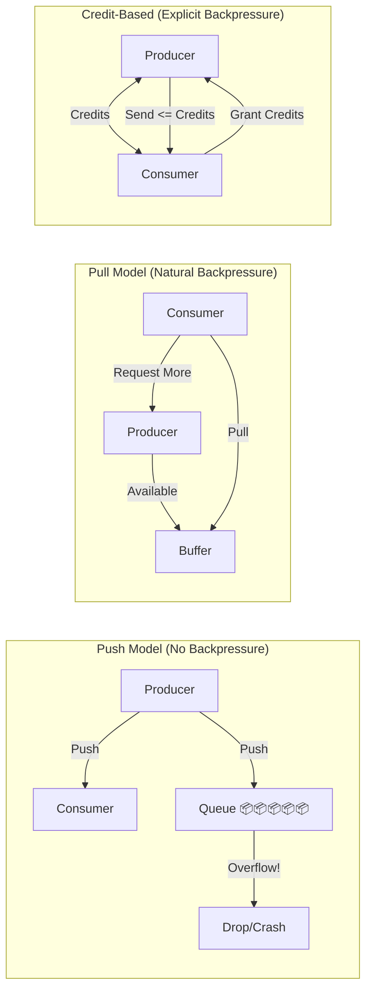
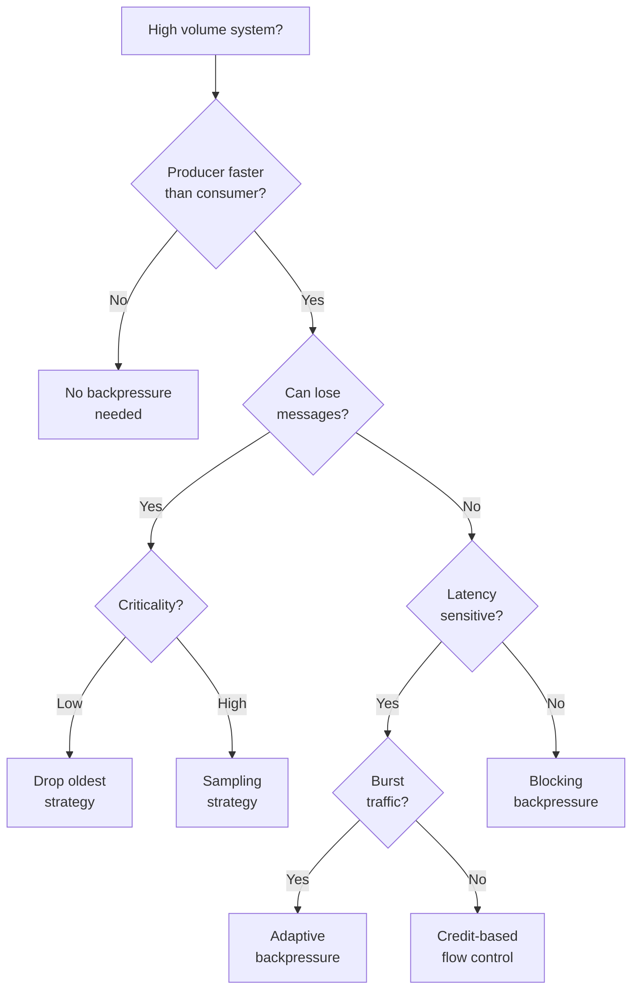

# Backpressure Pattern


## The Essential Question

**How can we prevent fast producers from overwhelming slow consumers in a system while maintaining optimal throughput?**

---

## Level 1: Intuition (5 minutes)

### The Story

A highway on-ramp has traffic lights that control how many cars enter. When the highway is congested, the light stays red longer. This prevents more cars from entering an already jammed highway, which would make things worse for everyone.

Backpressure works the same way: when a system component is overwhelmed, it signals upstream to slow down rather than accepting more work it can't handle.

### Visual Metaphor

```
Without Backpressure: With Backpressure:

Producer (1000/s) Producer (1000/s)
 ↓↓↓↓↓↓↓↓↓↓ ↓↓↓↓↓ (slowed)
┌─────────────┐ ┌─────────────┐
│ Queue: FULL │ │ Queue: OK │
│ 📦📦📦📦📦📦📦 │ ← Overflow │ 📦📦📦📦 │ ← "Slow down!"
└─────────────┘ └─────────────┘
 ↓ ↓↓↓
Consumer (100/s) Consumer (100/s)

Result: OOM, crashes Result: Stable flow
```

### In One Sentence

**Backpressure**: A flow control mechanism where slow consumers signal fast producers to reduce their rate, preventing system overload.

### Real-World Parallel

Like a restaurant that stops taking orders when the kitchen is backed up - better to slow incoming orders than to have the kitchen crash.

---

## Level 2: Foundation (10 minutes)

### The Problem Space

!!! danger "🔥 Without Backpressure: Log Processing Meltdown"
 Log aggregation system receiving from 1000 servers:
 - Spike during outage: 100x normal log volume
 - Processing queue grew unbounded
 - System ran out of memory and crashed
 - Lost 6 hours of critical debugging logs
 - 12-hour recovery to restart pipeline

### Core Strategies

| Strategy | Mechanism | Use Case | Complexity |
|----------|-----------|----------|------------||
| **Blocking** | Producer waits when full | Simple flows | Low |
| **Dropping** | Discard excess messages | Lossy acceptable | Low |
| **Buffering** | Temporary storage | Burst handling | Medium |
| **Credit-Based** | Explicit capacity signals | Precise control | High |
| **Adaptive** | Dynamic rate adjustment | Variable load | High |


### Flow Control Models



### Key Properties

1. **Responsiveness**: How quickly backpressure signals propagate
2. **Fairness**: How work is distributed among consumers
3. **Efficiency**: Overhead of flow control mechanism
4. **Lossiness**: Whether messages can be dropped
5. **Elasticity**: Ability to handle burst traffic

### Trade-offs

| Approach | Pros | Cons |
|----------|------|------||
| Unbounded Queues | Simple, absorbs bursts | OOM risk, unpredictable latency |
| Bounded Queues | Memory safe, predictable | Can block or drop |
| Dynamic Buffers | Flexible capacity | Complex management |
| Rate Limiting | Predictable load | May underutilize |


---

## Level 3: Deep Dive (20 minutes)

### Implementing Backpressure Patterns

```python
from typing import Optional, Callable, Any, List
from dataclasses import dataclass
from abc import ABC, abstractmethod
import asyncio
import time
from collections import deque
from enum import Enum

# Backpressure Strategies
class BackpressureStrategy(Enum):
 BLOCK = "block" # Block producer when full
 DROP_NEWEST = "drop_newest" # Drop new messages
 DROP_OLDEST = "drop_oldest" # Drop old messages 
 THROTTLE = "throttle" # Slow down producer

# Bounded Queue with Backpressure
class BoundedQueue:
 """Queue with configurable backpressure strategy"""
 
 def __init__(self, 
 capacity: int,
 strategy: BackpressureStrategy = BackpressureStrategy.BLOCK):
 self.capacity = capacity
 self.strategy = strategy
 self.queue = deque(maxlen=capacity if strategy == BackpressureStrategy.DROP_OLDEST else None)
 self.dropped_count = 0
 self.blocked_time = 0
 
 async def put(self, item: Any, timeout: Optional[float] = None) -> bool:
 """Put item in queue with backpressure handling"""
 
 if self.strategy == BackpressureStrategy.BLOCK:
# Block until space available
 start_time = time.time()
 while len(self.queue) >= self.capacity:
 await asyncio.sleep(0.01) # Small delay
 if timeout and (time.time() - start_time) > timeout:
 return False # Timeout
 self.blocked_time += time.time() - start_time
 self.queue.append(item)
 return True
 
 elif self.strategy == BackpressureStrategy.DROP_NEWEST:
# Drop new item if full
 if len(self.queue) >= self.capacity:
 self.dropped_count += 1
 return False
 self.queue.append(item)
 return True
 
 elif self.strategy == BackpressureStrategy.DROP_OLDEST:
# Always accept, drop oldest if needed
 self.queue.append(item) # deque with maxlen handles dropping
 if len(self.queue) < self.capacity:
 return True
 self.dropped_count += 1
 return True
 
 async def get(self) -> Optional[Any]:
 """Get item from queue"""
 if self.queue:
 return self.queue.popleft()
 return None
 
 def size(self) -> int:
 return len(self.queue)
 
 def is_full(self) -> bool:
 return len(self.queue) >= self.capacity

# Credit-Based Flow Control
class CreditBasedFlowControl:
 """Explicit credit-based backpressure"""
 
 def __init__(self, initial_credits: int = 10):
 self.credits = initial_credits
 self.pending_requests = 0
 self.total_sent = 0
 self.total_received = 0
 
 async def request_send(self, count: int = 1) -> bool:
 """Producer requests to send messages"""
 if self.credits >= count:
 self.credits -= count
 self.pending_requests += count
 return True
 return False # Not enough credits
 
 async def grant_credits(self, count: int):
 """Consumer grants credits after processing"""
 self.credits += count
 self.total_received += count
 
 async def send_complete(self, count: int = 1):
 """Producer confirms send completion"""
 self.pending_requests -= count
 self.total_sent += count
 
 def available_credits(self) -> int:
 return self.credits
 
 def utilization(self) -> float:
 """Credit utilization percentage"""
 max_credits = self.credits + self.pending_requests
 if max_credits == 0:
 return 0
 return (self.pending_requests / max_credits) * 100

# Reactive Stream Implementation
class Publisher(ABC):
 @abstractmethod
 async def subscribe(self, subscriber: 'Subscriber'):
 pass

class Subscriber(ABC):
 @abstractmethod
 async def on_subscribe(self, subscription: 'Subscription'):
 pass
 
 @abstractmethod
 async def on_next(self, item: Any):
 pass
 
 @abstractmethod
 async def on_error(self, error: Exception):
 pass
 
 @abstractmethod 
 async def on_complete(self):
 pass

class Subscription(ABC):
 @abstractmethod
 async def request(self, n: int):
 pass
 
 @abstractmethod
 async def cancel(self):
 pass

# Concrete Reactive Stream with Backpressure
class ReactivePublisher(Publisher):
 """Publisher that respects backpressure"""
 
 def __init__(self, data_source: Callable):
 self.data_source = data_source
 self.subscriptions: List[ReactiveSubscription] = []
 
 async def subscribe(self, subscriber: Subscriber):
 subscription = ReactiveSubscription(self, subscriber)
 self.subscriptions.append(subscription)
 await subscriber.on_subscribe(subscription)
 
class ReactiveSubscription(Subscription):
 """Subscription with demand management"""
 
 def __init__(self, publisher: ReactivePublisher, subscriber: Subscriber):
 self.publisher = publisher
 self.subscriber = subscriber
 self.demand = 0 # Current demand from subscriber
 self.cancelled = False
 self.sending = False
 
 async def request(self, n: int):
 """Subscriber requests n items"""
 if n <= 0:
 await self.subscriber.on_error(
 ValueError("Request count must be positive")
 )
 return
 
 self.demand += n
 
 if not self.sending:
 await self._send_data()
 
 async def _send_data(self):
 """Send data respecting demand"""
 self.sending = True
 
 try:
 while self.demand > 0 and not self.cancelled:
# Get next item from source
 item = await self.publisher.data_source()
 
 if item is None:
# No more data
 await self.subscriber.on_complete()
 break
 
# Send item and decrease demand
 await self.subscriber.on_next(item)
 self.demand -= 1
 
 except Exception as e:
 await self.subscriber.on_error(e)
 finally:
 self.sending = False
 
 async def cancel(self):
 """Cancel subscription"""
 self.cancelled = True

# Adaptive Backpressure
class AdaptiveBackpressure:
 """Dynamically adjust rate based on system metrics"""
 
 def __init__(self, 
 target_latency_ms: float = 100,
 min_rate: int = 10,
 max_rate: int = 1000):
 self.target_latency = target_latency_ms
 self.min_rate = min_rate
 self.max_rate = max_rate
 self.current_rate = (min_rate + max_rate) // 2
 self.latency_history = deque(maxlen=10)
 
 async def should_send(self) -> bool:
 """Check if we should send based on current rate"""
# Simple token bucket
 current_time = time.time()
 if not hasattr(self, 'last_send_time'):
 self.last_send_time = current_time
 return True
 
 time_since_last = current_time - self.last_send_time
 expected_interval = 1.0 / self.current_rate
 
 if time_since_last >= expected_interval:
 self.last_send_time = current_time
 return True
 return False
 
 async def record_latency(self, latency_ms: float):
 """Record processing latency and adjust rate"""
 self.latency_history.append(latency_ms)
 
 if len(self.latency_history) < 5:
 return # Not enough data
 
 avg_latency = sum(self.latency_history) / len(self.latency_history)
 
 if avg_latency > self.target_latency * 1.2:
# Latency too high, decrease rate
 self.current_rate = max(
 self.min_rate,
 int(self.current_rate * 0.9)
 )
 elif avg_latency < self.target_latency * 0.8:
# Latency low, increase rate
 self.current_rate = min(
 self.max_rate,
 int(self.current_rate * 1.1)
 )
 
 def get_current_rate(self) -> int:
 return self.current_rate

# Stream Processing with Backpressure
class BackpressureStreamProcessor:
 """Stream processor with multiple backpressure strategies"""
 
 def __init__(self, process_fn: Callable):
 self.process_fn = process_fn
 self.input_queue = BoundedQueue(1000, BackpressureStrategy.BLOCK)
 self.output_queue = BoundedQueue(1000, BackpressureStrategy.DROP_OLDEST)
 self.flow_control = CreditBasedFlowControl(100)
 self.adaptive_bp = AdaptiveBackpressure()
 self.processing = False
 
 async def submit(self, item: Any) -> bool:
 """Submit item for processing"""
# Check if we have credits
 if not await self.flow_control.request_send():
 return False # No credits, backpressure
 
# Check adaptive rate
 if not await self.adaptive_bp.should_send():
 return False # Rate limit
 
# Try to queue
 success = await self.input_queue.put(item, timeout=1.0)
 if success:
 await self.flow_control.send_complete()
 
 return success
 
 async def process_stream(self):
 """Main processing loop"""
 self.processing = True
 
 while self.processing:
# Get item from input queue
 item = await self.input_queue.get()
 if item is None:
 await asyncio.sleep(0.01)
 continue
 
# Process with timing
 start_time = time.time()
 try:
 result = await self.process_fn(item)
 
# Put in output queue
 await self.output_queue.put(result)
 
# Record latency
 latency_ms = (time.time() - start_time) * 1000
 await self.adaptive_bp.record_latency(latency_ms)
 
# Grant credits back
 await self.flow_control.grant_credits(1)
 
 except Exception as e:
 print(f"Processing error: {e}")
# Still grant credits to prevent deadlock
 await self.flow_control.grant_credits(1)

# TCP-like Congestion Control
class CongestionControl:
 """TCP-inspired congestion control for streams"""
 
 def __init__(self):
 self.cwnd = 1 # Congestion window
 self.ssthresh = 64 # Slow start threshold
 self.in_flight = 0
 self.acks_received = 0
 self.timeouts = 0
 self.state = "slow_start"
 
 async def can_send(self) -> bool:
 """Check if we can send based on congestion window"""
 return self.in_flight < self.cwnd
 
 async def on_send(self):
 """Called when message is sent"""
 self.in_flight += 1
 
 async def on_ack(self):
 """Called when acknowledgment received"""
 self.in_flight -= 1
 self.acks_received += 1
 
 if self.state == "slow_start":
# Exponential increase
 self.cwnd += 1
 if self.cwnd >= self.ssthresh:
 self.state = "congestion_avoidance"
 
 elif self.state == "congestion_avoidance":
# Linear increase (1/cwnd per ACK)
 if self.acks_received >= self.cwnd:
 self.cwnd += 1
 self.acks_received = 0
 
 async def on_timeout(self):
 """Called on timeout/loss"""
 self.timeouts += 1
 
# Set ssthresh to half of current window
 self.ssthresh = max(self.cwnd // 2, 2)
 
# Reset to slow start
 self.cwnd = 1
 self.state = "slow_start"
 self.in_flight = 0
 
 def get_metrics(self) -> dict:
 return {
 'cwnd': self.cwnd,
 'ssthresh': self.ssthresh,
 'in_flight': self.in_flight,
 'state': self.state,
 'timeouts': self.timeouts
 }
```

### Integration with Message Queues

```python
# Kafka-style Consumer with Backpressure
class KafkaStyleConsumer:
 """Consumer that manages its consumption rate"""
 
 def __init__(self, 
 max_poll_records: int = 500,
 max_poll_interval_ms: int = 300000):
 self.max_poll_records = max_poll_records
 self.max_poll_interval_ms = max_poll_interval_ms
 self.last_poll_time = time.time()
 self.processing_times = deque(maxlen=100)
 
 async def poll(self) -> List[Any]:
 """Poll for messages with automatic backpressure"""
 
# Calculate how many messages we can handle
 capacity = self._calculate_capacity()
 
# Fetch only what we can process
 messages = await self._fetch_messages(min(capacity, self.max_poll_records))
 
 self.last_poll_time = time.time()
 return messages
 
 def _calculate_capacity(self) -> int:
 """Calculate processing capacity based on history"""
 
 if not self.processing_times:
 return self.max_poll_records
 
# Average processing time per message
 avg_process_time = sum(self.processing_times) / len(self.processing_times)
 
# Time remaining before session timeout
 time_since_poll = (time.time() - self.last_poll_time) * 1000
 time_remaining = self.max_poll_interval_ms - time_since_poll
 
# Calculate how many we can process
 if avg_process_time > 0:
 capacity = int(time_remaining / avg_process_time * 0.8) # 80% safety
 return max(1, min(capacity, self.max_poll_records))
 
 return self.max_poll_records
```

---

## Level 4: Expert Practitioner (30 minutes)

### Advanced Backpressure Patterns

#### Hierarchical Backpressure

```python
class HierarchicalBackpressure:
 """Multi-level backpressure propagation"""
 
 def __init__(self):
 self.levels = {
 'application': {'threshold': 0.8, 'current': 0},
 'service': {'threshold': 0.7, 'current': 0},
 'system': {'threshold': 0.9, 'current': 0}
 }
 
 def update_pressure(self, level: str, utilization: float):
 """Update pressure at specific level"""
 if level in self.levels:
 self.levels[level]['current'] = utilization
 
 def should_apply_backpressure(self) -> tuple[bool, str]:
 """Check if backpressure needed at any level"""
 
 for level, metrics in self.levels.items():
 if metrics['current'] > metrics['threshold']:
 return True, level
 
 return False, None
 
 def get_throttle_factor(self) -> float:
 """Calculate throttling factor based on pressure"""
 
 max_pressure = 0
 for metrics in self.levels.values():
 if metrics['threshold'] > 0:
 pressure = metrics['current'] / metrics['threshold']
 max_pressure = max(max_pressure, pressure)
 
# Convert pressure to throttle factor (0.0 to 1.0)
 if max_pressure <= 1.0:
 return 1.0 # No throttling
 else:
# Exponential backoff as pressure increases
 return 1.0 / (2 ** (max_pressure - 1))
```

#### Distributed Backpressure Coordination

```python
class DistributedBackpressureCoordinator:
 """Coordinate backpressure across distributed system"""
 
 def __init__(self, node_id: str, redis_client):
 self.node_id = node_id
 self.redis = redis_client
 self.local_pressure = 0.0
 self.global_pressure_cache = {}
 self.last_update = time.time()
 
 async def report_pressure(self, pressure: float):
 """Report local pressure to cluster"""
 self.local_pressure = pressure
 
# Publish to Redis with TTL
 key = f"backpressure:{self.node_id}"
 await self.redis.setex(key, 60, pressure) # 60s TTL
 
# Publish event for real-time updates
 await self.redis.publish(
 "backpressure:updates",
 json.dumps({
 'node_id': self.node_id,
 'pressure': pressure,
 'timestamp': time.time()
 })
 )
 
 async def get_global_pressure(self) -> dict:
 """Get pressure from all nodes"""
 
# Get all backpressure keys
 keys = await self.redis.keys("backpressure:*")
 
 if not keys:
 return {self.node_id: self.local_pressure}
 
# Get all values
 pressures = {}
 for key in keys:
 node_id = key.decode().split(":")[1]
 pressure = await self.redis.get(key)
 if pressure:
 pressures[node_id] = float(pressure)
 
 return pressures
 
 async def should_accept_work(self) -> bool:
 """Decide if this node should accept more work"""
 
 pressures = await self.get_global_pressure()
 
 if not pressures:
 return self.local_pressure < 0.8
 
# Find least loaded node
 min_pressure_node = min(pressures, key=pressures.get)
 min_pressure = pressures[min_pressure_node]
 
# Accept work if we're the least loaded or reasonably close
 if self.node_id == min_pressure_node:
 return True
 
# Or if we're within 10% of least loaded
 return self.local_pressure <= min_pressure * 1.1
```

### Performance Optimization

!!! note "🎯 Backpressure Performance Tips"
 - **Batch Signals**: Aggregate backpressure signals to reduce overhead
 - **Local First**: Handle backpressure locally before propagating
 - **Async Propagation**: Don't block on backpressure signals
 - **Predictive**: Use trends to predict and prevent overload
 - **Tiered Strategies**: Different strategies for different load levels
 - **Circuit Breaking**: Combine with circuit breakers for protection
 - **Metrics**: Monitor backpressure effectiveness
 - **Testing**: Load test backpressure scenarios

### Monitoring Backpressure

```yaml
metrics:
# Flow Metrics
 - name: backpressure_applied
 description: Times backpressure was applied
 type: counter
 labels: [component, strategy]
 
 - name: messages_dropped
 description: Messages dropped due to backpressure
 type: counter
 labels: [component, reason]
 
 - name: queue_utilization
 description: Queue fill percentage
 type: gauge
 labels: [queue_name]
 
# Performance Metrics
 - name: processing_latency
 description: Message processing time
 type: histogram
 labels: [component]
 
 - name: throughput_rate
 description: Messages processed per second
 type: gauge
 labels: [component]
 
# Credit Flow Metrics
 - name: credits_available
 description: Available flow control credits
 type: gauge
 labels: [flow_name]
 
 - name: credit_starvation
 description: Times producer starved for credits
 type: counter
 labels: [flow_name]
```

---

## Level 5: Mastery (45 minutes)

### Case Study: LinkedIn's Kafka Streams

!!! info "🏢 Real-World Implementation"
 **Company**: LinkedIn
 **Scale**: 7 trillion messages/day, 100K+ partitions, 4PB+ data
 **Challenge**: Process massive data streams without overwhelming consumers or losing data.
 **Architecture**:
 ```mermaid
 graph TB
 subgraph "Producers"
 P1[Service A]
 P2[Service B]
 P3[Service C]
 end
 subgraph "Kafka Cluster"
 K1[Broker 1
 Partition 1-100]
 K2[Broker 2
 Partition 101-200]
 K3[Broker 3
 Partition 201-300]
 end
 subgraph "Stream Processing"
 SP1[Stream App 1
 Credits: 1000]
 SP2[Stream App 2
 Credits: 500]
 SP3[Stream App 3
 Credits: 2000]
 end
 subgraph "Backpressure Signals"
 CG[Consumer Group
 Lag Monitor]
 FC[Flow Controller]
 RM[Rate Manager]
 end
 P1 --> K1
 P2 --> K2
 P3 --> K3
 K1 --> SP1
 K2 --> SP2
 K3 --> SP3
 SP1 --> CG
 SP2 --> CG
 SP3 --> CG
 CG --> FC
 FC --> RM
 RM -->|Throttle| P1
 RM -->|Throttle| P2
 RM -->|Throttle| P3
 style CG fill:#ff9800,stroke:#e65100,stroke-width:3px
 ```
 **Implementation Details**:
 1. **Consumer Lag Monitoring**: Track lag for early warning
 2. **Adaptive Batch Sizing**: Adjust batch size based on processing time
 3. **Credit-Based Flow**: Explicit credits between stages
 4. **Tiered Storage**: Move old data to cheaper storage under pressure
 5. **Smart Partitioning**: Rebalance hot partitions
 **Results**:
 - 99.99% message delivery
 - 60% reduction in consumer lag spikes
 - 40% improvement in throughput
 - Zero OOM incidents
 **Lessons**:
 1. Monitor end-to-end, not just queues
 2. Predictive backpressure beats reactive
 3. Different data needs different strategies
 4. Coordination crucial at scale

### Economic Impact of Backpressure

```python
def calculate_backpressure_roi(
 messages_per_second: int,
 message_value: float,
 infra_cost_per_hour: float,
 drop_rate_without_bp: float = 0.05,
 crash_rate_without_bp: float = 0.001
) -> dict:
 """Calculate ROI of implementing backpressure"""
 
# Daily volumes
 messages_per_day = messages_per_second * 86400
 
# Without backpressure
 dropped_messages = messages_per_day * drop_rate_without_bp
 dropped_value = dropped_messages * message_value
 
# Crash impact (assume 1 hour recovery)
 crashes_per_day = crash_rate_without_bp * 24
 crash_lost_messages = messages_per_second * 3600 * crashes_per_day
 crash_lost_value = crash_lost_messages * message_value
 
# With backpressure
 bp_drop_rate = drop_rate_without_bp * 0.1 # 90% reduction
 bp_dropped_value = messages_per_day * bp_drop_rate * message_value
 
# Costs
 bp_overhead_cost = infra_cost_per_hour * 24 * 0.1 # 10% overhead
 
# ROI
 daily_benefit = (dropped_value + crash_lost_value) - (bp_dropped_value + bp_overhead_cost)
 
 return {
 'daily_benefit': daily_benefit,
 'annual_benefit': daily_benefit * 365,
 'dropped_prevention': dropped_messages * 0.9,
 'crash_prevention': crashes_per_day,
 'roi_percentage': (daily_benefit / bp_overhead_cost) * 100
 }

# Example: Ad tech platform
roi = calculate_backpressure_roi(
 messages_per_second=100000,
 message_value=0.001, # $0.001 per ad event
 infra_cost_per_hour=500,
 drop_rate_without_bp=0.05,
 crash_rate_without_bp=0.001
)

print(f"Daily benefit: ${roi['daily_benefit']:,.2f}")
print(f"Annual benefit: ${roi['annual_benefit']:,.2f}")
print(f"ROI: {roi['roi_percentage']:.1f}%")
```

### Future Directions

**AI-Driven Backpressure**: ML models predict pressure points before they occur

**Hardware Offload**: FPGA/SmartNIC backpressure handling

**Quantum Networks**: Instant backpressure signals via quantum entanglement

**Autonomous Systems**: Self-adjusting backpressure without configuration

---

## Quick Reference

### Decision Matrix



### Implementation Checklist

- [ ] **Identify Pressure Points**
 - [ ] Measure queue depths
 - [ ] Monitor processing times
 - [ ] Track resource utilization
 - [ ] Identify slowest component
 
- [ ] **Choose Strategy**
 - [ ] Define data criticality
 - [ ] Set latency requirements
 - [ ] Determine burst patterns
 - [ ] Select appropriate strategy
 
- [ ] **Implement Controls**
 - [ ] Add bounded queues
 - [ ] Implement flow control
 - [ ] Add monitoring hooks
 - [ ] Configure thresholds
 
- [ ] **Test Scenarios**
 - [ ] Normal load
 - [ ] Burst traffic
 - [ ] Sustained overload
 - [ ] Component failures
 
- [ ] **Monitor & Tune**
 - [ ] Track effectiveness
 - [ ] Measure impact
 - [ ] Adjust thresholds
 - [ ] Optimize performance

### Configuration Templates

```yaml
# Backpressure Configuration
backpressure:
# Queue Configuration
 queues:
 input_queue:
 size: 10000
 strategy: block # block, drop_newest, drop_oldest
 timeout: 5s
 
 processing_queue:
 size: 5000
 strategy: drop_oldest
 high_watermark: 0.8 # Apply backpressure at 80%
 low_watermark: 0.6 # Release at 60%
 
# Flow Control
 flow_control:
 type: credit_based # credit_based, rate_based, adaptive
 initial_credits: 1000
 credit_timeout: 30s
 min_credits: 100
 
# Adaptive Settings
 adaptive:
 target_latency_ms: 100
 adjustment_interval: 10s
 increase_rate: 1.1
 decrease_rate: 0.9
 
# Monitoring
 monitoring:
 metrics_interval: 10s
 alert_thresholds:
 queue_depth: 0.9
 drop_rate: 0.01
 blocked_time: 5s
```

### Common Patterns

```python
# Simple Bounded Queue
queue = BoundedQueue(capacity=1000)
if not queue.try_put(item, timeout=1.0):
# Handle backpressure
 metrics.record_drop()

# Credit-Based Flow
flow = CreditBasedFlow(initial=100)
if flow.try_acquire(1):
 process_item(item)
 flow.release(1)
else:
# No credits available
 wait_for_credits()

# Adaptive Rate
limiter = AdaptiveRateLimiter(target_latency=100)
if limiter.try_acquire():
 start = time.time()
 process_item(item)
 limiter.record_latency(time.time() - start)
else:
# Rate limited
 defer_item(item)

# Reactive Streams
publisher.subscribe(
 subscriber,
 on_next=lambda x: process(x),
 on_error=lambda e: handle_error(e),
 on_complete=lambda: cleanup()
)
subscriber.request(10) # Request 10 items
```

### Performance Guidelines

| Strategy | CPU Overhead | Memory Usage | Latency Impact | Throughput |
|----------|--------------|--------------|----------------|------------|
| Unbounded | None | High/Unsafe | Variable | Maximum |
| Blocking | Low | Controlled | Can spike | Reduced |
| Dropping | Minimal | Controlled | Stable | Maintained |
| Credit-Based | Medium | Controlled | Predictable | Optimized |
| Adaptive | High | Controlled | Stable | Dynamic |


---

## Related Resources

### Patterns
- [Circuit Breaker](/patterns/circuit-breaker) - Fail fast under overload
- [Bulkhead](/patterns/bulkhead) - Resource isolation
- [Rate Limiting](/patterns/rate-limiting) - Request throttling
- [Queues & Streaming](/patterns/queues-streaming) - Message patterns

### Laws
- [Law 4 (Multidimensional Optimization )](/part1-axioms/law4-tradeoffs/) - Finite resources
- [Law 1 (Correlated Failure )](/part1-axioms/law1-failure/) - Cascade prevention
- [Law 3 (Emergent Chaos )](/part1-axioms/law3-emergence/) - Parallel flows
- [Law 7 (Economic Reality )](/part1-axioms/law7-economics/) - Cost of dropping

### Quantitative Analysis
- [Queueing Theory](/quantitative/queueing-models.md) - Mathematical models
- [Little's Law](/quantitative/littles-law.md) - Capacity relationships
- [Backpressure Mathematics](/quantitative/backpressure-math.md) - Flow control theory

### Tools & Libraries
- **Java**: Reactor, RxJava, Akka Streams
- **Python**: asyncio, aiostream, RxPY
- **Go**: Channel-based, go-streams
- **Rust**: tokio-stream, async-stream
- **Node.js**: Highland.js, RxJS, Backpressure-stream

### Standards & Specifications
- [Reactive Streams](https://www.reactive-streams.org/) - Standard for async streams
- [TCP Flow Control](https://tools.ietf.org/html/rfc793) - Network backpressure
- [HTTP/2 Flow Control](https://tools.ietf.org/html/rfc7540#section-5.2) - Stream multiplexing
- [AMQP Credit Flow](https://www.amqp.org/) - Message queue standard

### Further Reading
- [Reactive Design Patterns](https://www.manning.com/books/reactive-design-patterns) - Roland Kuhn
- [Stream Processing with Apache Flink](https://www.oreilly.com/library/view/stream-processing-with/9781491974285/) - Fabian Hueske
- [The Reactive Manifesto](https://www.reactivemanifesto.org/) - Principles
- [Backpressure Explained](https://mechanical-sympathy.blogspot.com/) - Martin Thompson

---

<div class="prev-link">
<a href="/patterns/bulkhead">← Previous: Bulkhead Pattern</a>
<a href="/patterns/rate-limiting">Next: Rate Limiting →</a>
</div>