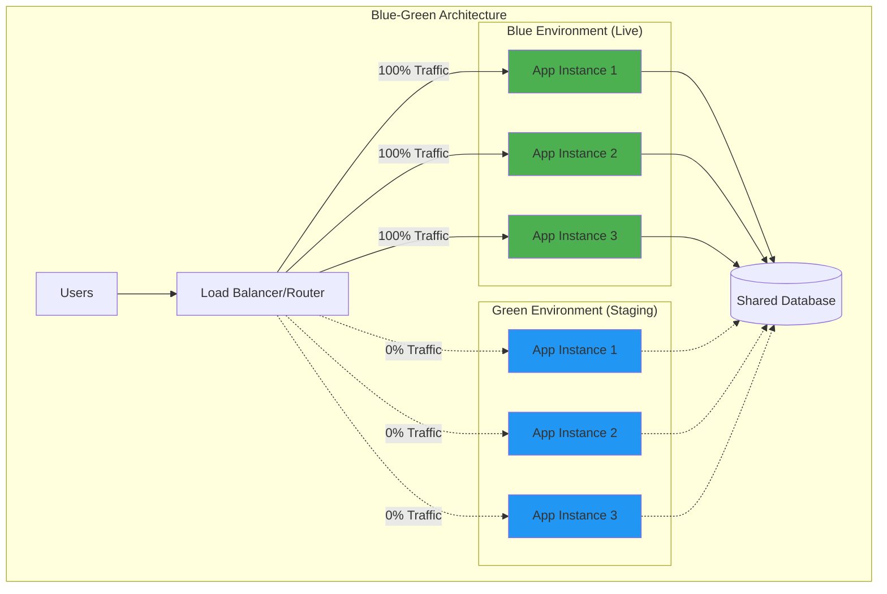
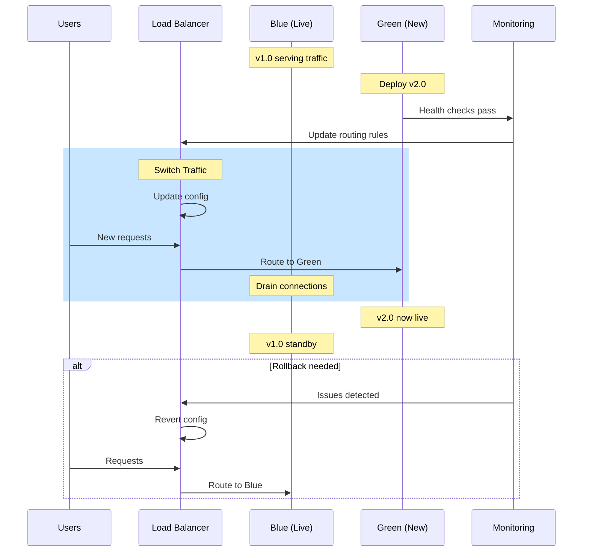
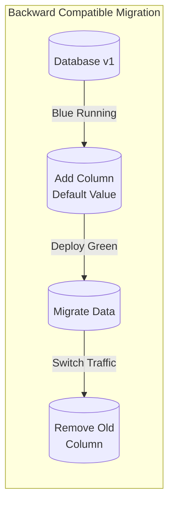
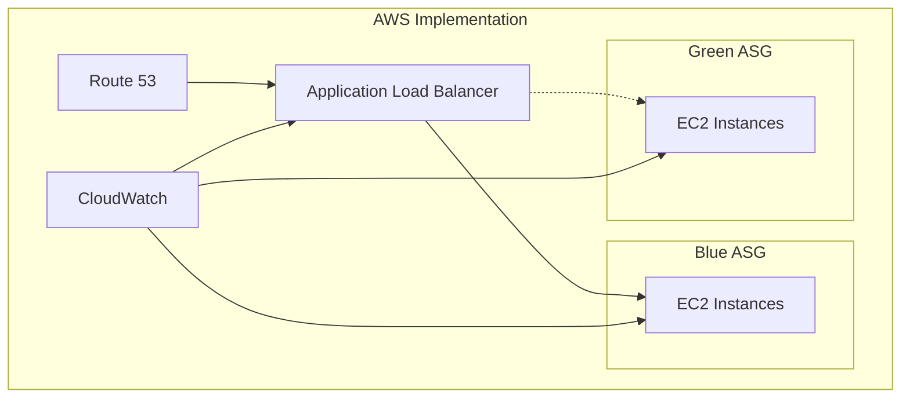
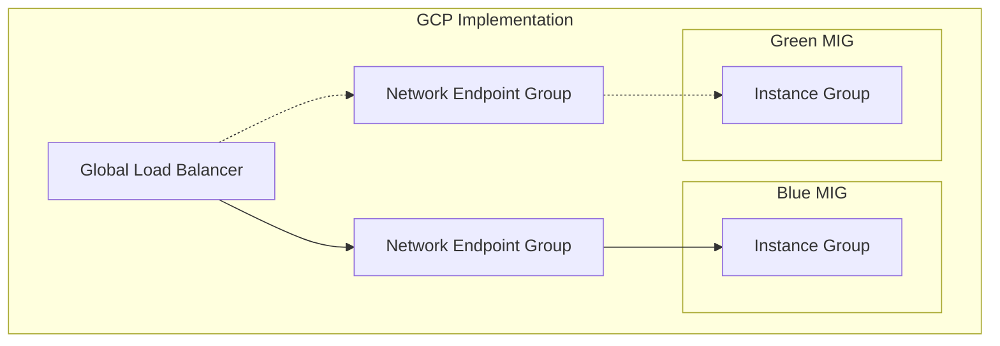
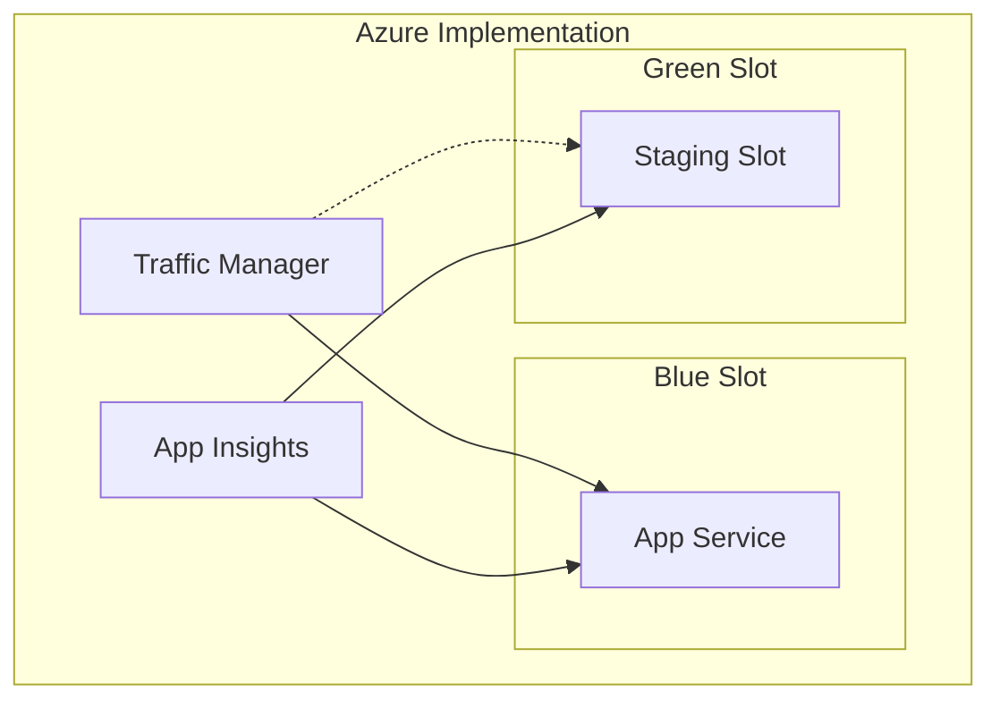
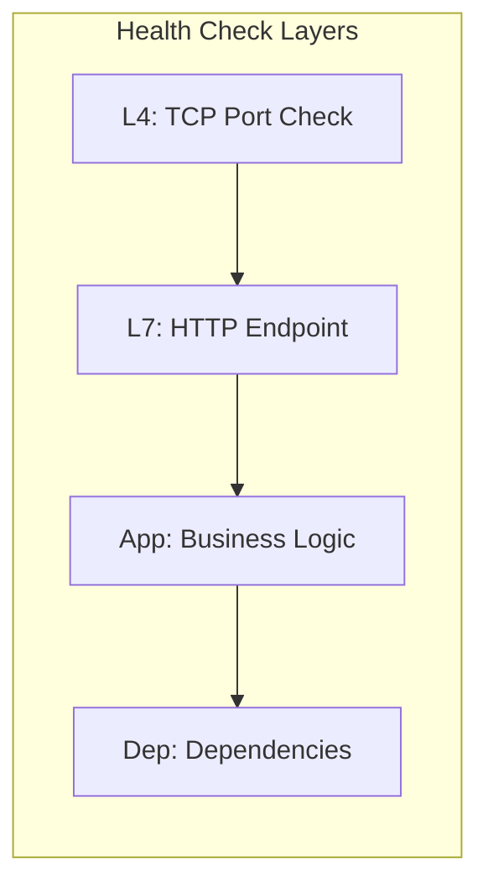
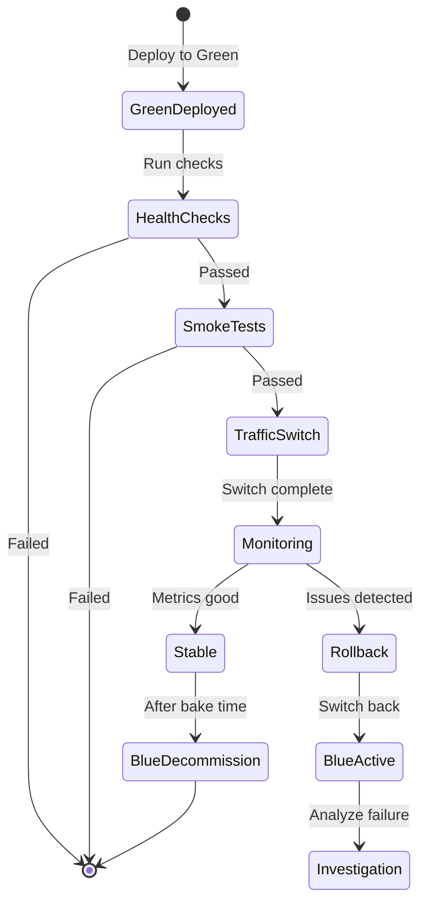
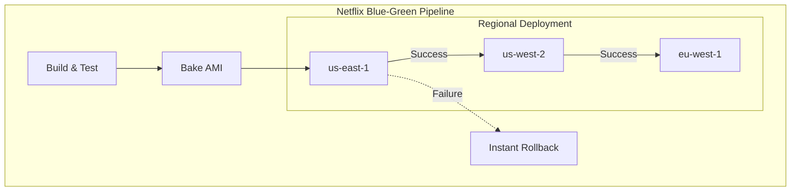
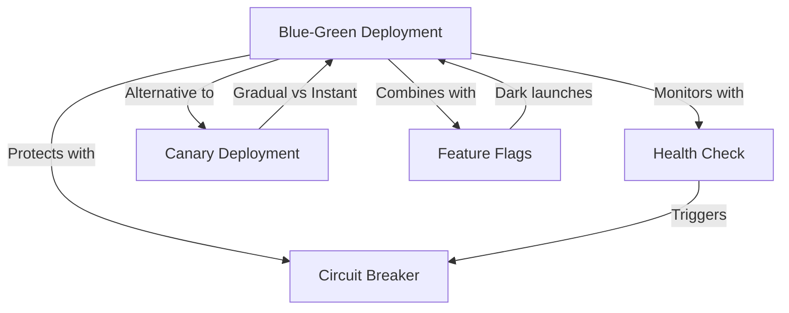

# Blue-Green Deployment

!!! warning "🥈 Silver Tier Pattern"
    **Zero-Downtime Deployment Strategy** • Best for critical production systems
    
    A proven deployment pattern that eliminates downtime by using two identical environments. While excellent for stateless applications, it requires double infrastructure and careful handling of database changes.

## The Pattern

Blue-Green deployment eliminates downtime and reduces risk by maintaining two identical production environments - only one serving live traffic at any time.

## Problem-Solution Matrix

| Problem | Blue-Green Solution |
|---------|-------------------|
| Deployment downtime | Zero-downtime switch between environments |
| Rollback complexity | Instant rollback by switching back |
| Testing in production | Full production testing before switch |
| Configuration drift | Identical environments enforced |
| Partial deployment failures | All-or-nothing deployment |

## Traffic Switching Process

## Database Migration Strategies

| Strategy | Approach | Use Case |
|----------|----------|----------|
| **Backward Compatible** | Schema changes support both versions | Most common approach |
| **Blue-Green Database** | Separate databases with sync | Complete isolation needed |
| **Expand-Contract** | Gradual schema evolution | Complex migrations |
| **Feature Flags** | Code handles both schemas | Conditional logic |

## Deployment Comparison

| Aspect | Blue-Green | Canary | Rolling Update |
|--------|------------|--------|----------------|
| **Rollback Speed** | Instant (< 1s) | Minutes | 10-30 minutes |
| **Resource Cost** | 2x infrastructure | 1.1-1.5x | 1x |
| **Risk Profile** | Very low | Low | Medium |
| **Testing Scope** | Full environment | Partial users | Progressive |
| **Complexity** | Low | Medium | High |
| **Database Changes** | Challenging | Easier | Easiest |

## Cloud Provider Implementation

### AWS Blue-Green

| AWS Service | Blue-Green Feature | Configuration |
|-------------|-------------------|---------------|
| **Route 53** | Weighted routing | 100-0 or 0-100 split |
| **ALB** | Target group switching | Instant switch |
| **CodeDeploy** | Native blue-green | Automated process |
| **ECS** | Service update | Task definition swap |

### GCP Blue-Green

### Azure Blue-Green

## Health Check Configuration

| Check Type | Endpoint | Frequency | Timeout | Threshold |
|------------|----------|-----------|---------|-----------|
| **Liveness** | `/health` | 5s | 3s | 3 failures |
| **Readiness** | `/ready` | 10s | 5s | 2 failures |
| **Deep** | `/health/full` | 30s | 10s | 1 failure |

## Rollback Procedures

## Real-World Metrics

| Metric | Traditional | Blue-Green | Improvement |
|--------|-------------|------------|-------------|
| **Deployment Time** | 20-30 min | 2-5 min | 85% faster |
| **Rollback Time** | 20-30 min | < 30 sec | 98% faster |
| **Downtime** | 5-10 min | 0 min | 100% eliminated |
| **Failed Deployments** | 5-10% | < 1% | 90% reduction |
| **MTTR** | 45 min | 2 min | 95% reduction |

### Netflix Case Study

**Netflix Results:**
- 4,000+ deployments/day
- < 0.001% failure rate
- Average rollback: 15 seconds
- Zero customer-facing downtime

### Etsy Case Study

| Phase | Duration | Actions |
|-------|----------|---------|
| **Build** | 5 min | CI/CD pipeline |
| **Deploy Green** | 2 min | Provision new environment |
| **Smoke Test** | 3 min | Automated test suite |
| **Switch** | 30 sec | DNS/LB update |
| **Monitor** | 15 min | Error rate, latency |
| **Decommission** | 1 min | Remove blue |

## Implementation Checklist

- [ ] **Infrastructure as Code**: Terraform/CloudFormation templates
- [ ] **Environment Parity**: Identical blue/green configurations
- [ ] **Database Strategy**: Backward compatible migrations
- [ ] **Load Balancer**: Instant switching capability
- [ ] **Health Checks**: Multi-layer validation
- [ ] **Monitoring**: Real-time metrics comparison
- [ ] **Rollback Plan**: Automated switch-back procedure
- [ ] **Testing Suite**: Smoke tests for green environment
- [ ] **Documentation**: Runbooks for operations team

## When to Use Blue-Green

### Ideal For
- **Critical Systems**: Zero downtime requirements
- **Predictable Load**: Known traffic patterns
- **Stateless Apps**: Easy to replicate
- **Quick Rollback**: Instant recovery needed
- **Full Testing**: Production-like validation

### Not Suitable For
- **Stateful Systems**: Complex session management
- **Database Heavy**: Frequent schema changes
- **Resource Constrained**: Can't afford 2x infrastructure
- **Long Transactions**: Can't drain connections quickly
- **Continuous Deployment**: Many daily deployments

## Pattern Relationships

## Key Decisions

1. **Switch Mechanism**: DNS vs Load Balancer vs Service Mesh
2. **Database Handling**: Shared vs Separate vs Replicated
3. **State Management**: Stateless vs Session draining vs Replication
4. **Validation Depth**: Basic health vs Full integration tests
5. **Bake Time**: How long before decommissioning old environment

## References

- [Circuit Breaker Pattern](circuit-breaker.md) - Protecting during switches
- [Health Check Pattern](health-check.md) - Validating green environment
- [Distributed Tracing](distributed-tracing.md) - Monitoring both environments
- [Work Distribution Pillar](../part2-pillars/work-distribution/index.md) - Load balancing strategies