<!-- Navigation -->
[Home](../index.md) → [Part III: Patterns](index.md) → **Bulkhead Pattern**

# Bulkhead Pattern

**From Titanic's Lesson to Distributed Systems: Engineering Failure Isolation at Scale**

> *"In distributed systems, as in ships, compartmentalization isn't pessimism—it's engineering wisdom."*

---

## 🎯 Level 1: Intuition

### The Ship Compartment Metaphor

Imagine the Titanic, but with proper bulkheads:

```mermaid
graph TB
    subgraph "Without Bulkheads: Total System Failure"
        A1[Breach in Search] --> B1[Water Floods Everything]
        B1 --> C1[Checkout Drowns]
        B1 --> D1[Analytics Drowns]
        B1 --> E1[Ship Sinks 🚢💀]
    end
    
    subgraph "With Bulkheads: Isolated Failure"
        A2[Breach in Search] --> B2[Only Search Floods]
        C2[Checkout Safe ✅]
        D2[Analytics Safe ✅]
        E2[Ship Survives 🚢✨]
    end
```



**The Problem**: In distributed systems:
- 🌊 **Resource Flooding**: One bad service consumes all threads/memory/connections
- 🔗 **Cascade Failures**: Resource exhaustion spreads system-wide
- 💥 **Total Collapse**: Entire system fails from single component issue
- 😱 **No Isolation**: Shared resource pools = shared fate

**The Solution**: Bulkheads create isolated compartments:
- ✅ **Resource Isolation**: Each service gets dedicated resources
- ✅ **Failure Containment**: Problems stay localized
- ✅ **Graceful Degradation**: Non-critical services can fail safely
- ✅ **Predictable Capacity**: Known limits per component

### Simple Mental Model

```python
# Bad: Shared resource pool (Titanic without bulkheads)
class SharedSystemPool:
    def __init__(self):
        self.thread_pool = ThreadPool(100)  # All services share this
    
    def handle_request(self, service_type, request):
        # Search service goes crazy? Takes all 100 threads!
        return self.thread_pool.execute(request)

# Good: Bulkhead isolation (Modern ship design)
class BulkheadSystem:
    def __init__(self):
        self.pools = {
            'search': ThreadPool(20),      # Search can only use 20
            'checkout': ThreadPool(50),    # Checkout protected with 50
            'analytics': ThreadPool(10)    # Analytics limited to 10
        }
    
    def handle_request(self, service_type, request):
        # Search goes crazy? Only affects its 20 threads!
        return self.pools[service_type].execute(request)
```

### Why This Matters

| Without Bulkheads | With Bulkheads |
|-------------------|----------------|
| One service kills entire system | Failures stay isolated |
| Unpredictable resource usage | Guaranteed resource allocation |
| Complete outages common | Partial degradation only |
| Debugging is nightmare | Clear failure boundaries |

---

## 🏗️ Level 2: Foundation

### Core Bulkhead Strategies

#### Strategy Comparison Matrix

| Isolation Type | Resource | Overhead | Use Case | Isolation Level |
|----------------|----------|----------|----------|------------------|
| **Thread Pool** | CPU/Threads | Medium | Compute-heavy tasks | ⭐⭐⭐⭐ |
| **Semaphore** | Concurrency | Low | I/O operations | ⭐⭐⭐ |
| **Connection Pool** | Network | Low | Database/API calls | ⭐⭐⭐ |
| **Process** | Everything | High | Critical isolation | ⭐⭐⭐⭐⭐ |
| **Container** | Everything | Medium | Microservices | ⭐⭐⭐⭐⭐ |

### Visual Isolation Patterns


### The Mathematics of Bulkhead Sizing

```python
# Little's Law applied to bulkheads
# L = λ × W
# L = number of requests in system
# λ = arrival rate
# W = average time in system

def calculate_bulkhead_size(arrival_rate: float, 
                           avg_processing_time: float,
                           target_utilization: float = 0.8) -> int:
    """
    Calculate optimal bulkhead size using queueing theory
    """
    # Base calculation using Little's Law
    min_size = arrival_rate * avg_processing_time
    
    # Add buffer for variance (using M/M/c queue model)
    variance_factor = 1 + (1 / target_utilization - 1)
    
    # Account for burst capacity
    burst_factor = 1.5  # Handle 50% traffic spikes
    
    optimal_size = int(min_size * variance_factor * burst_factor)
    
    return max(optimal_size, 1)  # At least 1

# Example calculation
# 100 requests/second, 50ms average processing
size = calculate_bulkhead_size(100, 0.05, 0.8)
print(f"Recommended bulkhead size: {size}")  # ~10 threads
```

### Production-Ready Implementation

```python
import asyncio
import time
import threading
from concurrent.futures import ThreadPoolExecutor, Future
from typing import Optional, Callable, Any, Dict, List, TypeVar, Generic
from contextlib import asynccontextmanager, contextmanager
from dataclasses import dataclass, field
from enum import Enum
import logging
from abc import ABC, abstractmethod
import psutil
import weakref

T = TypeVar('T')

class BulkheadState(Enum):
    """Bulkhead operational states"""
    CLOSED = "closed"      # Normal operation
    OPEN = "open"          # Rejecting all requests
    HALF_OPEN = "half_open"  # Testing recovery

@dataclass
class BulkheadConfig:
    """Configuration for bulkhead behavior"""
    name: str
    size: int = 10
    queue_size: int = 0  # 0 = no queueing
    timeout: float = 30.0  # seconds
    
    # Circuit breaker integration
    failure_threshold: int = 5
    recovery_timeout: float = 60.0
    
    # Adaptive sizing
    adaptive_enabled: bool = False
    min_size: int = 5
    max_size: int = 100
    
    # Monitoring
    track_latency: bool = True
    alert_on_rejection: bool = True

@dataclass
class BulkheadMetrics:
    """Runtime metrics for bulkhead"""
    total_calls: int = 0
    active_calls: int = 0
    rejected_calls: int = 0
    failed_calls: int = 0
    total_latency: float = 0.0
    max_latency: float = 0.0
    last_rejection_time: Optional[float] = None
    
    def get_stats(self) -> Dict[str, Any]:
        avg_latency = self.total_latency / max(self.total_calls, 1)
        success_rate = 1 - (self.failed_calls / max(self.total_calls, 1))
        
        return {
            'total_calls': self.total_calls,
            'active_calls': self.active_calls,
            'rejected_calls': self.rejected_calls,
            'failed_calls': self.failed_calls,
            'success_rate': success_rate,
            'avg_latency': avg_latency,
            'max_latency': self.max_latency,
            'rejection_rate': self.rejected_calls / max(self.total_calls, 1)
        }

class BulkheadFullError(Exception):
    """Raised when bulkhead cannot accept more requests"""
    pass

class ThreadPoolBulkhead:
    """Production-grade thread pool isolation"""
    
    def __init__(self, config: BulkheadConfig):
        self.config = config
        self.metrics = BulkheadMetrics()
        self.state = BulkheadState.CLOSED
        self.logger = logging.getLogger(f"bulkhead.{config.name}")
        
        # Thread pool with queue
        self.pool = ThreadPoolExecutor(
            max_workers=config.size,
            thread_name_prefix=f"bulkhead-{config.name}-"
        )
        
        # Tracking
        self._active_futures: weakref.WeakSet[Future] = weakref.WeakSet()
        self._lock = threading.RLock()
        self._semaphore = threading.Semaphore(config.size + config.queue_size)
        
        # Circuit breaker state
        self._consecutive_failures = 0
        self._circuit_opened_at = None
        
        # Adaptive sizing
        if config.adaptive_enabled:
            self._start_adaptive_sizing()
    
    def execute(self, func: Callable[..., T], *args, **kwargs) -> T:
        """Execute function with bulkhead protection"""
        
        # Check circuit breaker
        if not self._is_accepting_requests():
            self.metrics.rejected_calls += 1
            raise BulkheadFullError(f"Bulkhead {self.config.name} is open")
        
        # Try to acquire permit
        acquired = self._semaphore.acquire(blocking=False)
        if not acquired:
            with self._lock:
                self.metrics.rejected_calls += 1
                self.metrics.last_rejection_time = time.time()
            
            if self.config.alert_on_rejection:
                self.logger.warning(
                    f"Bulkhead {self.config.name} full: "
                    f"{self.metrics.active_calls}/{self.config.size} active"
                )
            
            raise BulkheadFullError(f"Bulkhead {self.config.name} is full")
        
        # Track metrics
        with self._lock:
            self.metrics.total_calls += 1
            self.metrics.active_calls += 1
        
        start_time = time.time()
        
        try:
            # Submit to thread pool
            future = self.pool.submit(func, *args, **kwargs)
            self._active_futures.add(future)
            
            # Wait with timeout
            result = future.result(timeout=self.config.timeout)
            
            # Record success
            self._record_success(time.time() - start_time)
            
            return result
            
        except Exception as e:
            # Record failure
            self._record_failure(time.time() - start_time)
            raise
            
        finally:
            # Release resources
            with self._lock:
                self.metrics.active_calls -= 1
            self._semaphore.release()

    def execute(self, func: Callable, *args, **kwargs) -> Any:
        """Execute function in isolated thread pool"""

        with self.lock:
            if self.active_count >= self.size:
                self.rejected_count += 1
                raise BulkheadFullError(f"Bulkhead '{self.name}' is full")

            self.active_count += 1

        try:
            future = self.pool.submit(func, *args, **kwargs)
            return future.result()
        finally:
            with self.lock:
                self.active_count -= 1

    def get_stats(self) -> dict:
        """Get bulkhead statistics"""
        return {
            'name': self.name,
            'size': self.size,
            'active': self.active_count,
            'rejected': self.rejected_count,
            'utilization': self.active_count / self.size
        }

class SemaphoreBulkhead:
    """Limit concurrent operations with semaphore"""

    def __init__(self, name: str, permits: int = 10):
        self.name = name
        self.permits = permits
        self.semaphore = asyncio.Semaphore(permits)
        self.active_count = 0
        self.rejected_count = 0
        self.total_count = 0

    @asynccontextmanager
    async def acquire(self, timeout: Optional[float] = None):
        """Acquire permit with optional timeout"""

        acquired = False
        try:
            if timeout:
                # Try to acquire with timeout
                try:
                    await asyncio.wait_for(
                        self.semaphore.acquire(),
                        timeout=timeout
                    )
                    acquired = True
                except asyncio.TimeoutError:
                    self.rejected_count += 1
                    raise BulkheadTimeoutError(
                        f"Timeout acquiring permit for '{self.name}'"
                    )
            else:
                # Try to acquire without blocking
                acquired = self.semaphore.locked() == False
                if acquired:
                    await self.semaphore.acquire()
                else:
                    self.rejected_count += 1
                    raise BulkheadFullError(f"Bulkhead '{self.name}' is full")

            self.active_count += 1
            self.total_count += 1
            yield

        finally:
            if acquired:
                self.active_count -= 1
                self.semaphore.release()

class BulkheadManager:
    """Manage multiple bulkheads"""

    def __init__(self):
        self.bulkheads: Dict[str, SemaphoreBulkhead] = {}
        self.default_permits = 10

    def create_bulkhead(self, name: str, permits: int = None) -> SemaphoreBulkhead:
        """Create or get bulkhead"""

        if name not in self.bulkheads:
            self.bulkheads[name] = SemaphoreBulkhead(
                name=name,
                permits=permits or self.default_permits
            )
        return self.bulkheads[name]

    def get_all_stats(self) -> Dict[str, dict]:
        """Get stats for all bulkheads"""
        return {
            name: bulkhead.get_stats()
            for name, bulkhead in self.bulkheads.items()
        }

# Connection pool bulkhead
class ConnectionPoolBulkhead:
    """Isolate database connections by function"""

    def __init__(self, pools_config: dict):
        self.pools = {}

        for name, config in pools_config.items():
            self.pools[name] = self._create_pool(name, config)

    def _create_pool(self, name: str, config: dict):
        """Create isolated connection pool"""

        return ConnectionPool(
            host=config['host'],
            port=config['port'],
            min_size=config.get('min_size', 1),
            max_size=config.get('max_size', 10),
            name=f"bulkhead-{name}"
        )

    async def execute(self, bulkhead_name: str, query: str, *args):
        """Execute query in specific bulkhead"""

        if bulkhead_name not in self.pools:
            raise ValueError(f"Unknown bulkhead: {bulkhead_name}")

        pool = self.pools[bulkhead_name]

        async with pool.acquire() as conn:
            return await conn.execute(query, *args)

# HTTP client with bulkheads
class BulkheadHTTPClient:
    """HTTP client with endpoint isolation"""

    def __init__(self):
        self.bulkheads = {}
        self.default_config = {
            'max_connections': 10,
            'timeout': 5.0
        }

    def configure_endpoint(self, pattern: str, **config):
        """Configure bulkhead for endpoint pattern"""

        merged_config = {**self.default_config, **config}

        self.bulkheads[pattern] = {
            'connector': aiohttp.TCPConnector(
                limit=merged_config['max_connections']
            ),
            'timeout': aiohttp.ClientTimeout(
                total=merged_config['timeout']
            ),
            'semaphore': asyncio.Semaphore(
                merged_config['max_connections']
            )
        }

    async def request(self, method: str, url: str, **kwargs):
        """Make request with appropriate bulkhead"""

        # Find matching bulkhead
        bulkhead = self._find_bulkhead(url)

        if not bulkhead:
            raise ValueError(f"No bulkhead configured for {url}")

        # Acquire semaphore
        async with bulkhead['semaphore']:
            # Create session with bulkhead connector
            async with aiohttp.ClientSession(
                connector=bulkhead['connector'],
                timeout=bulkhead['timeout']
            ) as session:
                async with session.request(method, url, **kwargs) as response:
                    return await response.json()

    def _find_bulkhead(self, url: str):
        """Find bulkhead for URL"""

        for pattern, bulkhead in self.bulkheads.items():
            if pattern in url:
                return bulkhead
        return None

# Process isolation with containers
class ContainerBulkhead:
    """Run operations in isolated containers"""

    def __init__(self, docker_client):
        self.docker = docker_client
        self.containers = {}

    async def execute_in_container(
        self,
        bulkhead_name: str,
        image: str,
        command: str,
        resources: dict = None
    ):
        """Execute command in isolated container"""

        # Default resource limits
        if not resources:
            resources = {
                'mem_limit': '512m',
                'cpu_quota': 50000,  # 0.5 CPU
                'cpu_period': 100000
            }

        # Run container with resource limits
        container = self.docker.containers.run(
            image=image,
            command=command,
            detach=True,
            remove=True,
            name=f"bulkhead-{bulkhead_name}-{time.time()}",
            **resources
        )

        # Wait for completion
        result = container.wait()
        logs = container.logs().decode('utf-8')

        if result['StatusCode'] != 0:
            raise ContainerExecutionError(
                f"Container failed with status {result['StatusCode']}: {logs}"
            )

        return logs

# Adaptive bulkhead that adjusts size based on load
class AdaptiveBulkhead:
    """Dynamically adjust bulkhead size"""

    def __init__(
        self,
        name: str,
        min_size: int = 5,
        max_size: int = 50,
        target_utilization: float = 0.7
    ):
        self.name = name
        self.min_size = min_size
        self.max_size = max_size
        self.target_utilization = target_utilization

        self.current_size = min_size
        self.semaphore = asyncio.Semaphore(min_size)
        self.active_count = 0

        # Metrics for adaptation
        self.utilization_history = []
        self.rejection_count = 0

        # Start adaptation loop
        asyncio.create_task(self._adapt_loop())

    async def _adapt_loop(self):
        """Periodically adjust bulkhead size"""

        while True:
            await asyncio.sleep(10)  # Adjust every 10 seconds

            # Calculate average utilization
            if self.utilization_history:
                avg_utilization = sum(self.utilization_history) / len(self.utilization_history)

                if avg_utilization > self.target_utilization + 0.1:
                    # Increase size
                    await self._resize(min(
                        self.max_size,
                        int(self.current_size * 1.5)
                    ))
                elif avg_utilization < self.target_utilization - 0.1:
                    # Decrease size
                    await self._resize(max(
                        self.min_size,
                        int(self.current_size * 0.8)
                    ))

            # Reset history
            self.utilization_history = []

    async def _resize(self, new_size: int):
        """Resize bulkhead"""

        if new_size == self.current_size:
            return

        print(f"Resizing bulkhead '{self.name}' from {self.current_size} to {new_size}")

        # Create new semaphore
        new_semaphore = asyncio.Semaphore(new_size)

        # Copy current permits
        for _ in range(self.current_size - self.active_count):
            await self.semaphore.acquire()

        self.semaphore = new_semaphore
        self.current_size = new_size
    
    def _record_success(self, latency: float):
        """Record successful execution"""
        with self._lock:
            self._consecutive_failures = 0
            if self.config.track_latency:
                self.metrics.total_latency += latency
                self.metrics.max_latency = max(self.metrics.max_latency, latency)
        
        # Check if circuit should close
        if self.state == BulkheadState.HALF_OPEN:
            self.state = BulkheadState.CLOSED
            self.logger.info(f"Bulkhead {self.config.name} circuit closed")
    
    def _record_failure(self, latency: float):
        """Record failed execution"""
        with self._lock:
            self.metrics.failed_calls += 1
            self._consecutive_failures += 1
            
            # Check if circuit should open
            if self._consecutive_failures >= self.config.failure_threshold:
                self.state = BulkheadState.OPEN
                self._circuit_opened_at = time.time()
                self.logger.error(
                    f"Bulkhead {self.config.name} circuit opened after "
                    f"{self._consecutive_failures} failures"
                )
    
    def _is_accepting_requests(self) -> bool:
        """Check if bulkhead accepts new requests"""
        if self.state == BulkheadState.CLOSED:
            return True
        
        if self.state == BulkheadState.OPEN:
            # Check if recovery timeout passed
            if time.time() - self._circuit_opened_at > self.config.recovery_timeout:
                self.state = BulkheadState.HALF_OPEN
                self.logger.info(f"Bulkhead {self.config.name} entering half-open state")
                return True
            return False
        
        # HALF_OPEN - accept limited requests
        return True
```

---

## 🔧 Level 3: Deep Dive

### Advanced Bulkhead Patterns

#### Adaptive Bulkhead Sizing
```python
import numpy as np
from collections import deque

class AdaptiveBulkhead:
    """
    Dynamically adjust bulkhead size based on system conditions
    Used by Netflix, Uber, and AWS
    """
    
    def __init__(self, config: BulkheadConfig):
        self.config = config
        self.current_size = config.size
        
        # Metrics for adaptation
        self.latency_window = deque(maxlen=1000)
        self.rejection_window = deque(maxlen=100)
        self.cpu_usage_window = deque(maxlen=60)
        
        # Control parameters
        self.target_latency_p99 = 100  # ms
        self.target_rejection_rate = 0.01  # 1%
        self.target_cpu_usage = 0.7  # 70%
        
        # Start adaptation loop
        self._start_adaptation_loop()
    
    def _calculate_optimal_size(self) -> int:
        """
        Calculate optimal bulkhead size using control theory
        """
        if not self.latency_window:
            return self.current_size
        
        # Calculate current metrics
        latency_p99 = np.percentile(list(self.latency_window), 99)
        rejection_rate = sum(self.rejection_window) / max(len(self.rejection_window), 1)
        cpu_usage = np.mean(list(self.cpu_usage_window)) if self.cpu_usage_window else 0.5
        
        # PID controller for size adjustment
        error_latency = (self.target_latency_p99 - latency_p99) / self.target_latency_p99
        error_rejection = (rejection_rate - self.target_rejection_rate) / max(self.target_rejection_rate, 0.001)
        error_cpu = (self.target_cpu_usage - cpu_usage) / self.target_cpu_usage
        
        # Weighted combination of errors
        total_error = (
            0.4 * error_latency +  # Latency is important
            0.4 * error_rejection +  # Rejections are critical
            0.2 * error_cpu  # CPU is a constraint
        )
        
        # Calculate adjustment
        adjustment = int(self.current_size * total_error * 0.1)  # 10% max change
        
        # Apply bounds
        new_size = self.current_size + adjustment
        new_size = max(self.config.min_size, min(new_size, self.config.max_size))
        
        return new_size
    
    async def _adaptation_loop(self):
        """
        Periodically adjust bulkhead size
        """
        while True:
            await asyncio.sleep(10)  # Adjust every 10 seconds
            
            # Collect current metrics
            self.cpu_usage_window.append(psutil.cpu_percent() / 100)
            
            # Calculate new size
            new_size = self._calculate_optimal_size()
            
            if new_size != self.current_size:
                self.logger.info(
                    f"Adapting bulkhead {self.config.name} size: "
                    f"{self.current_size} → {new_size}"
                )
                await self._resize(new_size)

#### Multi-Level Bulkheads
```python
class HierarchicalBulkhead:
    """
    Nested bulkheads for fine-grained isolation
    """
    
    def __init__(self):
        # Top-level bulkheads
        self.service_bulkheads = {
            'api': BulkheadConfig(name='api', size=1000),
            'batch': BulkheadConfig(name='batch', size=200),
            'admin': BulkheadConfig(name='admin', size=50)
        }
        
        # Sub-bulkheads per service
        self.endpoint_bulkheads = {
            'api': {
                '/search': BulkheadConfig(name='api-search', size=300),
                '/checkout': BulkheadConfig(name='api-checkout', size=500),
                '/profile': BulkheadConfig(name='api-profile', size=200)
            },
            'batch': {
                '/import': BulkheadConfig(name='batch-import', size=50),
                '/export': BulkheadConfig(name='batch-export', size=150)
            }
        }
        
        # User-level bulkheads
        self.user_bulkheads = {}  # Created dynamically
    
    async def acquire_nested(self, service: str, endpoint: str, 
                           user_id: str) -> AsyncContextManager:
        """
        Acquire permits from all levels of hierarchy
        """
        # Acquire in order: service → endpoint → user
        permits = []
        
        try:
            # Service level
            service_permit = await self.service_bulkheads[service].acquire()
            permits.append(service_permit)
            
            # Endpoint level
            if endpoint in self.endpoint_bulkheads[service]:
                endpoint_permit = await self.endpoint_bulkheads[service][endpoint].acquire()
                permits.append(endpoint_permit)
            
            # User level (with dynamic creation)
            user_bulkhead = self._get_or_create_user_bulkhead(user_id)
            user_permit = await user_bulkhead.acquire()
            permits.append(user_permit)
            
            # Return composite context manager
            return CompositeContext(permits)
            
        except Exception:
            # Release any acquired permits
            for permit in reversed(permits):
                await permit.release()
            raise
    
    def _get_or_create_user_bulkhead(self, user_id: str) -> Bulkhead:
        """
        Create user-specific bulkheads with rate limiting
        """
        if user_id not in self.user_bulkheads:
            # Determine user tier
            user_tier = self._get_user_tier(user_id)
            
            size = {
                'free': 10,
                'premium': 100,
                'enterprise': 1000
            }.get(user_tier, 10)
            
            self.user_bulkheads[user_id] = BulkheadConfig(
                name=f'user-{user_id}',
                size=size
            )
        
        return self.user_bulkheads[user_id]

#### Container-Based Bulkheads
```python
import docker
import kubernetes

class KubernetesBulkhead:
    """
    Kubernetes-native bulkhead implementation
    """
    
    def __init__(self):
        self.k8s_client = kubernetes.client.ApiClient()
        self.apps_v1 = kubernetes.client.AppsV1Api(self.k8s_client)
    
    def create_bulkhead_deployment(self, name: str, config: Dict) -> None:
        """
        Create isolated deployment with resource limits
        """
        deployment = {
            'apiVersion': 'apps/v1',
            'kind': 'Deployment',
            'metadata': {
                'name': f'bulkhead-{name}',
                'labels': {
                    'bulkhead': name,
                    'isolation': 'container'
                }
            },
            'spec': {
                'replicas': config['replicas'],
                'selector': {
                    'matchLabels': {'bulkhead': name}
                },
                'template': {
                    'metadata': {
                        'labels': {'bulkhead': name}
                    },
                    'spec': {
                        'containers': [{
                            'name': 'app',
                            'image': config['image'],
                            'resources': {
                                'requests': {
                                    'memory': config['memory_request'],
                                    'cpu': config['cpu_request']
                                },
                                'limits': {
                                    'memory': config['memory_limit'],
                                    'cpu': config['cpu_limit']
                                }
                            },
                            'env': [
                                {'name': 'BULKHEAD_NAME', 'value': name},
                                {'name': 'MAX_CONNECTIONS', 'value': str(config['max_connections'])}
                            ]
                        }],
                        'nodeSelector': config.get('node_selector', {}),
                        'tolerations': config.get('tolerations', []),
                        'affinity': {
                            'podAntiAffinity': {
                                'requiredDuringSchedulingIgnoredDuringExecution': [{
                                    'labelSelector': {
                                        'matchExpressions': [{
                                            'key': 'bulkhead',
                                            'operator': 'In',
                                            'values': [name]
                                        }]
                                    },
                                    'topologyKey': 'kubernetes.io/hostname'
                                }]
                            }
                        }
                    }
                }
            }
        }
        
        # Create horizontal pod autoscaler
        hpa = {
            'apiVersion': 'autoscaling/v2',
            'kind': 'HorizontalPodAutoscaler',
            'metadata': {
                'name': f'bulkhead-{name}-hpa'
            },
            'spec': {
                'scaleTargetRef': {
                    'apiVersion': 'apps/v1',
                    'kind': 'Deployment',
                    'name': f'bulkhead-{name}'
                },
                'minReplicas': config['min_replicas'],
                'maxReplicas': config['max_replicas'],
                'metrics': [{
                    'type': 'Resource',
                    'resource': {
                        'name': 'cpu',
                        'target': {
                            'type': 'Utilization',
                            'averageUtilization': 70
                        }
                    }
                }]
            }
        }
        
        # Apply configurations
        self.apps_v1.create_namespaced_deployment(
            namespace='default',
            body=deployment
        )

### Real-World Implementation Patterns

#### Netflix's Hystrix Bulkheads
```java
public class NetflixBulkheadExample {
    
    // Separate thread pools for different service types
    private static final HystrixThreadPoolKey SEARCH_POOL = 
        HystrixThreadPoolKey.Factory.asKey("SearchPool");
    private static final HystrixThreadPoolKey RECOMMENDATION_POOL = 
        HystrixThreadPoolKey.Factory.asKey("RecommendationPool");
    private static final HystrixThreadPoolKey PLAYBACK_POOL = 
        HystrixThreadPoolKey.Factory.asKey("PlaybackPool");
    
    public static class SearchCommand extends HystrixCommand<SearchResults> {
        private final String query;
        
        public SearchCommand(String query) {
            super(Setter
                .withGroupKey(HystrixCommandGroupKey.Factory.asKey("Search"))
                .andThreadPoolKey(SEARCH_POOL)
                .andThreadPoolPropertiesDefaults(
                    HystrixThreadPoolProperties.Setter()
                        .withCoreSize(20)  // Bulkhead size
                        .withMaximumSize(30)  // Allow bursting
                        .withKeepAliveTimeMinutes(1)
                        .withQueueSizeRejectionThreshold(100)  // Queue limit
                )
                .andCommandPropertiesDefaults(
                    HystrixCommandProperties.Setter()
                        .withExecutionTimeoutInMilliseconds(1000)
                        .withCircuitBreakerEnabled(true)
                        .withCircuitBreakerRequestVolumeThreshold(20)
                        .withCircuitBreakerErrorThresholdPercentage(50)
                )
            );
            this.query = query;
        }
        
        @Override
        protected SearchResults run() throws Exception {
            // Isolated in search thread pool
            return searchService.search(query);
        }
        
        @Override
        protected SearchResults getFallback() {
            // Return cached or default results
            return SearchCache.getCachedResults(query);
        }
    }
}
```

---

## 🚀 Level 4: Expert

### Real-World Case Study: Amazon's Cell-Based Architecture

#### The Challenge (2015)


**Impact of Shared Fate**:
- 🌍 **Global outages**: One issue affects all regions
- 💣 **Blast radius**: Bad deployments impact everyone
- 🎯 **Single points of failure**: Shared components = shared risk
- 💰 **Revenue impact**: $66M per hour of downtime

#### The Solution: Cellular Architecture

```python
class AmazonCellArchitecture:
    """
    Amazon's approach to bulkhead isolation at massive scale
    """
    
    def __init__(self):
        self.cells = {
            'us-east-1a': Cell(capacity=1000000),  # 1M customers
            'us-east-1b': Cell(capacity=1000000),
            'us-west-2a': Cell(capacity=1000000),
            'eu-west-1a': Cell(capacity=1000000),
            # ... 100+ cells globally
        }
        
        # Each cell is completely isolated
        self.cell_components = {
            'load_balancer': 'Dedicated ALB per cell',
            'compute': 'Isolated EC2 instances',
            'database': 'Separate RDS instances',
            'cache': 'Isolated ElastiCache',
            'queue': 'Separate SQS queues',
            'storage': 'Isolated S3 buckets'
        }
    
    def route_customer(self, customer_id: str) -> str:
        """
        Deterministic routing to cells
        """
        # Hash-based cell assignment
        cell_index = hash(customer_id) % len(self.cells)
        cell_name = list(self.cells.keys())[cell_index]
        
        # Customer always goes to same cell
        return cell_name
    
    def deploy_to_cell(self, cell_name: str, version: str):
        """
        Safe cell-by-cell deployment
        """
        cell = self.cells[cell_name]
        
        # Deploy to single cell first
        cell.deploy(version)
        
        # Monitor for issues
        if cell.health_check():
            self.logger.info(f"Cell {cell_name} healthy with {version}")
            return True
        else:
            # Rollback just this cell
            cell.rollback()
            self.logger.error(f"Cell {cell_name} unhealthy, rolled back")
            return False
    
    def calculate_blast_radius(self, failed_cells: List[str]) -> Dict:
        """
        Determine impact of cell failures
        """
        total_capacity = sum(cell.capacity for cell in self.cells.values())
        failed_capacity = sum(
            self.cells[name].capacity 
            for name in failed_cells
        )
        
        return {
            'affected_customers': failed_capacity,
            'percentage_impact': failed_capacity / total_capacity * 100,
            'healthy_cells': len(self.cells) - len(failed_cells),
            'can_handle_load': failed_capacity < total_capacity * 0.2
        }

# Real deployment example
deployer = AmazonCellDeployer()

# Progressive cell deployment
for cell in cells_ordered_by_criticality():
    success = deployer.deploy_to_cell(cell, 'v2.0')
    
    if not success:
        print(f"Deployment failed at cell {cell}")
        print(f"Only {deployed_cells}/{total_cells} affected")
        break
    
    # Bake time between cells
    time.sleep(300)  # 5 minutes

```

#### Implementation Results

```python
class AmazonBulkheadMetrics:
    """
    Actual impact metrics from Amazon's cellular architecture
    """
    
    def __init__(self):
        self.before_cells = {
            'availability': 0.999,  # 99.9% (8.76 hours downtime/year)
            'blast_radius': 1.0,    # 100% of customers affected
            'deployment_risk': 'high',
            'recovery_time_minutes': 47,
            'revenue_at_risk_per_incident': 51_000_000  # $51M
        }
        
        self.after_cells = {
            'availability': 0.99999,  # 99.999% (5.26 minutes/year)
            'blast_radius': 0.01,     # 1% of customers affected
            'deployment_risk': 'low',
            'recovery_time_minutes': 3,
            'revenue_at_risk_per_incident': 510_000  # $510K
        }
        
        self.improvements = {
            'availability_improvement': '100x fewer customer-impacting minutes',
            'blast_radius_reduction': '99% smaller impact',
            'deployment_confidence': '10x more deployments',
            'recovery_speed': '15x faster',
            'cost_structure': 'Only 8% overhead for isolation'
        }
```

### Case Study: Spotify's Squad Isolation

```python
class SpotifySquadBulkheads:
    """
    Spotify's approach to team and service isolation
    """
    
    def __init__(self):
        # Each squad owns isolated services
        self.squad_ownership = {
            'discover_weekly': {
                'services': ['recommendation-engine', 'playlist-generator'],
                'infrastructure': 'isolated-kubernetes-namespace',
                'database': 'dedicated-cassandra-keyspace',
                'budget': 'separate-aws-account'
            },
            'playback': {
                'services': ['streaming-api', 'codec-service'],
                'infrastructure': 'dedicated-cluster',
                'cdn': 'isolated-cdn-configuration',
                'monitoring': 'squad-specific-dashboards'
            },
            'social': {
                'services': ['social-graph', 'activity-feed'],
                'database': 'separate-postgres-cluster',
                'cache': 'dedicated-redis-cluster'
            }
        }
    
    def enforce_squad_isolation(self, squad: str, request: Request) -> Response:
        """
        Ensure squads can't affect each other
        """
        # Get squad's resource limits
        limits = self.get_squad_limits(squad)
        
        # Check current usage
        usage = self.get_squad_usage(squad)
        
        # Enforce bulkheads
        if usage['cpu'] >= limits['cpu']:
            return Response(429, "Squad CPU limit exceeded")
        
        if usage['memory'] >= limits['memory']:
            return Response(429, "Squad memory limit exceeded")
        
        if usage['requests_per_second'] >= limits['rps']:
            return Response(429, "Squad RPS limit exceeded")
        
        # Process within squad's isolated environment
        with self.squad_context(squad):
            return process_request(request)
    
    def squad_deployment_pipeline(self, squad: str, service: str):
        """
        Isolated deployment per squad
        """
        pipeline = {
            'build': f'{squad}-specific-jenkins',
            'test': f'{squad}-test-environment',
            'staging': f'{squad}-staging-cluster',
            'production': f'{squad}-production-cells',
            'rollback': f'Affects only {squad} services'
        }
        
        return pipeline

# Results from Spotify's isolation
spotify_metrics = {
    'squad_autonomy': '10x faster feature delivery',
    'incident_isolation': '95% of incidents affect single squad',
    'deployment_frequency': 'From weekly to 1000+ daily',
    'cross_squad_dependencies': 'Reduced by 73%',
    'system_reliability': '99.95% availability'
}
```

### Production Monitoring Dashboard

```python
class BulkheadMonitoringDashboard:
    """
    Real-time bulkhead monitoring for production systems
    """
    
    def generate_dashboard(self) -> str:
        return """
╔══════════════════════════════════════════════════════════╗
║                 Bulkhead Isolation Status                 ║
╠══════════════════════════════════════════════════════════╣
║ Service Bulkheads                                        ║
║ ├─ Search:     20/30 threads (67%) ✅                    ║
║ ├─ Checkout:   45/50 threads (90%) ⚠️                    ║
║ ├─ Analytics:  8/10 threads (80%) ⚠️                     ║
║ └─ Admin:      2/5 threads (40%) ✅                      ║
╠══════════════════════════════════════════════════════════╣
║ Cell Health (Amazon-style)                               ║
║ ├─ Cell-A: 142K active users (14.2%) ✅                  ║
║ ├─ Cell-B: 156K active users (15.6%) ✅                  ║
║ ├─ Cell-C: DRAINING - Issue detected 🔴                  ║
║ └─ Cell-D: 201K active users (20.1%) ⚠️                  ║
╠══════════════════════════════════════════════════════════╣
║ Resource Isolation                                       ║
║ ├─ CPU Isolation: 8 cores dedicated per service ✅       ║
║ ├─ Memory: 16GB per bulkhead (hard limit) ✅             ║
║ ├─ Network: Separate NICs per service ✅                 ║
║ └─ Disk I/O: Cgroup limits enforced ✅                   ║
╠══════════════════════════════════════════════════════════╣
║ Failure Isolation Metrics                                ║
║ ├─ Failures contained: 47/48 (97.9%) 🎆                 ║
║ ├─ Cross-bulkhead impact: 1 incident                    ║
║ ├─ Avg blast radius: 8.3% of users                      ║
║ └─ Recovery time: 2.4 minutes average                   ║
╚══════════════════════════════════════════════════════════╝
        """
```

### Enterprise Implementation Patterns

#### Microsoft Azure's Deployment Stamps
```python
class AzureDeploymentStamps:
    """
    Microsoft's bulkhead pattern for Azure services
    """
    
    def __init__(self):
        self.stamps = self._initialize_stamps()
        
    def _initialize_stamps(self) -> Dict:
        """
        Each stamp is a complete isolated copy
        """
        return {
            'stamp-001': {
                'region': 'eastus',
                'capacity': 100000,  # users
                'components': [
                    'app-service-plan',
                    'sql-database',
                    'storage-account',
                    'redis-cache',
                    'service-bus'
                ],
                'health': 'healthy',
                'version': 'v2.3.1'
            },
            # ... 50+ stamps globally
        }
    
    def stamp_allocation_strategy(self, tenant: Dict) -> str:
        """
        Intelligent stamp assignment
        """
        # Consider multiple factors
        factors = {
            'data_residency': tenant['country'],
            'size': tenant['expected_users'],
            'compliance': tenant['compliance_requirements'],
            'features': tenant['required_features']
        }
        
        # Find best stamp
        scores = {}
        for stamp_id, stamp in self.stamps.items():
            score = self._calculate_stamp_score(stamp, factors)
            scores[stamp_id] = score
        
        # Return highest scoring stamp with capacity
        return max(scores, key=scores.get)

# Configuration used by Office 365
office365_bulkheads = {
    'isolation_levels': [
        'Geographic (continents)',
        'Regional (countries)',
        'Stamps (100K users each)',
        'Tenants (organizations)',
        'Users (individuals)'
    ],
    'results': {
        'availability': '99.97%',
        'largest_incident_impact': '< 0.1% of users',
        'deployment_frequency': '1000+ per day',
        'rollback_time': '< 5 minutes per stamp'
    }
}
```

---

## 🎯 Level 5: Mastery

### Theoretical Foundations of Isolation

#### Queueing Theory Applied to Bulkheads

```python
import numpy as np
from scipy import stats
from scipy.optimize import minimize

class BulkheadOptimizer:
    """
    Mathematical optimization of bulkhead sizing
    """
    
    def calculate_optimal_bulkhead_size(self,
                                      arrival_rate: float,  # λ requests/second
                                      service_rate: float,  # μ requests/second
                                      target_wait_time: float,  # W seconds
                                      target_rejection_rate: float) -> Dict:
        """
        Use M/M/c/K queue model for bulkhead sizing
        """
        # Traffic intensity
        rho = arrival_rate / service_rate
        
        def erlang_c_formula(c: int, a: float) -> float:
            """
            Erlang C formula for probability of queueing
            """
            numerator = (a**c / np.math.factorial(c)) * (c / (c - a))
            denominator = sum(a**n / np.math.factorial(n) for n in range(c))
            denominator += numerator
            return numerator / denominator
        
        def calculate_metrics(servers: int, queue_size: int) -> Dict:
            """
            Calculate performance metrics for M/M/c/K queue
            """
            # Effective arrival rate (considering rejections)
            lambda_eff = arrival_rate * (1 - self.blocking_probability(servers, queue_size, rho))
            
            # Average number in system (Little's Law)
            L = lambda_eff / service_rate
            
            # Average wait time
            W = L / lambda_eff
            
            # Rejection rate
            rejection_rate = 1 - (lambda_eff / arrival_rate)
            
            return {
                'servers': servers,
                'queue_size': queue_size,
                'avg_wait_time': W,
                'rejection_rate': rejection_rate,
                'utilization': lambda_eff / (servers * service_rate)
            }
        
        # Optimize for target metrics
        best_config = None
        min_cost = float('inf')
        
        for servers in range(1, 100):
            for queue_size in range(0, 50):
                metrics = calculate_metrics(servers, queue_size)
                
                # Check constraints
                if (metrics['avg_wait_time'] <= target_wait_time and
                    metrics['rejection_rate'] <= target_rejection_rate):
                    
                    # Cost function (servers + queue memory)
                    cost = servers + 0.1 * queue_size
                    
                    if cost < min_cost:
                        min_cost = cost
                        best_config = metrics
                        best_config['total_size'] = servers + queue_size
        
        return best_config
    
    def blocking_probability(self, c: int, K: int, rho: float) -> float:
        """
        Calculate blocking probability for M/M/c/K queue
        """
        # Simplified calculation for demonstration
        if K == 0:
            return self.erlang_b(c, rho)
        
        # Full M/M/c/K calculation
        p0_inv = sum(rho**n / np.math.factorial(n) for n in range(c))
        p0_inv += sum(
            rho**c * rho**(n-c) / (np.math.factorial(c) * c**(n-c))
            for n in range(c, c + K + 1)
        )
        
        p0 = 1 / p0_inv
        
        # Blocking occurs when all servers busy and queue full
        pK = rho**c * rho**K / (np.math.factorial(c) * c**K) * p0
        
        return pK

#### Chaos Engineering for Bulkheads

```python
import random
import asyncio
from dataclasses import dataclass
from typing import List, Callable

@dataclass
class ChaosExperiment:
    name: str
    description: str
    blast_radius: float  # 0.0 to 1.0
    duration: int  # seconds
    
class BulkheadChaosEngineer:
    """
    Systematic testing of bulkhead resilience
    """
    
    def __init__(self, system: BulkheadSystem):
        self.system = system
        self.experiments = self._define_experiments()
        
    def _define_experiments(self) -> List[ChaosExperiment]:
        return [
            ChaosExperiment(
                name="bulkhead_overflow",
                description="Flood single bulkhead to test isolation",
                blast_radius=0.1,  # Affects 10% of system
                duration=300  # 5 minutes
            ),
            ChaosExperiment(
                name="cascading_failure",
                description="Fail multiple bulkheads in sequence",
                blast_radius=0.3,
                duration=600
            ),
            ChaosExperiment(
                name="resource_starvation",
                description="Gradually consume all resources in bulkhead",
                blast_radius=0.2,
                duration=900
            ),
            ChaosExperiment(
                name="byzantine_behavior",
                description="Bulkhead returns wrong results",
                blast_radius=0.05,
                duration=300
            )
        ]
    
    async def run_experiment(self, experiment: ChaosExperiment) -> Dict:
        """
        Execute chaos experiment and measure impact
        """
        self.logger.warning(f"Starting chaos experiment: {experiment.name}")
        
        # Record baseline metrics
        baseline = await self.system.get_metrics()
        
        # Inject failure
        affected_bulkheads = self._select_targets(experiment.blast_radius)
        
        # Apply chaos
        chaos_tasks = []
        for bulkhead in affected_bulkheads:
            if experiment.name == "bulkhead_overflow":
                task = self._flood_bulkhead(bulkhead, experiment.duration)
            elif experiment.name == "resource_starvation":
                task = self._starve_resources(bulkhead, experiment.duration)
            # ... other experiments
            
            chaos_tasks.append(task)
        
        # Run chaos
        start_time = time.time()
        await asyncio.gather(*chaos_tasks)
        
        # Measure impact
        impact_metrics = await self.system.get_metrics()
        recovery_start = time.time()
        
        # Wait for recovery
        while not self._system_recovered(baseline, await self.system.get_metrics()):
            await asyncio.sleep(1)
            if time.time() - recovery_start > 300:  # 5 min timeout
                break
        
        recovery_time = time.time() - recovery_start
        
        return {
            'experiment': experiment.name,
            'blast_radius_target': experiment.blast_radius,
            'blast_radius_actual': self._calculate_actual_blast_radius(
                baseline, impact_metrics
            ),
            'recovery_time_seconds': recovery_time,
            'data_loss': self._check_data_loss(),
            'sla_violations': self._check_sla_violations(start_time),
            'lessons_learned': self._analyze_experiment_results()
        }
    
    async def _flood_bulkhead(self, bulkhead: Bulkhead, duration: int):
        """
        Generate massive load on single bulkhead
        """
        end_time = time.time() + duration
        request_count = 0
        
        while time.time() < end_time:
            # Fire requests as fast as possible
            tasks = []
            for _ in range(1000):  # 1000 concurrent requests
                task = bulkhead.handle_request(
                    self._generate_heavy_request()
                )
                tasks.append(task)
                request_count += 1
            
            # Don't wait for completion, just fire
            asyncio.gather(*tasks, return_exceptions=True)
            
            # Small delay to prevent total system crash
            await asyncio.sleep(0.01)
        
        self.logger.info(f"Flooded {bulkhead.name} with {request_count} requests")

### Future Directions

#### Quantum-Inspired Superposition Bulkheads

```python
class QuantumBulkhead:
    """
    Theoretical quantum-inspired bulkhead design
    """
    
    def __init__(self):
        self.quantum_states = []
        self.entangled_bulkheads = {}
        
    def create_superposition_bulkhead(self, configs: List[BulkheadConfig]) -> 'SuperpositionBulkhead':
        """
        Bulkhead exists in multiple configuration states simultaneously
        """
        # In quantum computing future, this would use actual qubits
        # For now, we simulate probabilistic resource allocation
        
        superposition = SuperpositionBulkhead()
        
        # Each configuration has a probability amplitude
        total_weight = sum(c.priority for c in configs)
        
        for config in configs:
            amplitude = np.sqrt(config.priority / total_weight)
            superposition.add_state(config, amplitude)
        
        return superposition
    
    def entangle_bulkheads(self, bulkhead1: Bulkhead, bulkhead2: Bulkhead):
        """
        Create quantum entanglement between bulkheads
        When one fails, the other instantly knows
        """
        # Simulated entanglement for instant state propagation
        self.entangled_bulkheads[bulkhead1.id] = bulkhead2.id
        self.entangled_bulkheads[bulkhead2.id] = bulkhead1.id
        
        # In theory, this would allow:
        # 1. Instant failure detection (faster than network)
        # 2. Coordinated resource reallocation
        # 3. Quantum tunneling for request routing

#### AI-Driven Autonomous Bulkheads

```python
class AutonomousBulkheadSystem:
    """
    Self-managing bulkhead system using reinforcement learning
    """
    
    def __init__(self):
        self.rl_agent = BulkheadRLAgent()
        self.state_space = self._define_state_space()
        self.action_space = self._define_action_space()
        
    def _define_state_space(self) -> Dict:
        return {
            'dimensions': [
                'current_load',
                'failure_rate',
                'latency_p99',
                'resource_utilization',
                'time_of_day',
                'day_of_week',
                'recent_incidents',
                'deployment_status'
            ],
            'size': 2**20  # ~1M possible states
        }
    
    def _define_action_space(self) -> List[str]:
        return [
            'increase_bulkhead_size',
            'decrease_bulkhead_size',
            'create_new_bulkhead',
            'merge_bulkheads',
            'change_isolation_level',
            'adjust_timeout',
            'enable_circuit_breaker',
            'trigger_cell_failover',
            'no_action'
        ]
    
    async def autonomous_management_loop(self):
        """
        Continuously optimize bulkhead configuration
        """
        while True:
            # Observe current state
            state = await self._observe_system_state()
            
            # Agent decides action
            action = self.rl_agent.select_action(state)
            
            # Execute action
            reward = await self._execute_action(action)
            
            # Learn from outcome
            next_state = await self._observe_system_state()
            self.rl_agent.learn(state, action, reward, next_state)
            
            # Log decision
            self.logger.info(
                f"AI Decision: {action} | "
                f"Reward: {reward:.2f} | "
                f"Confidence: {self.rl_agent.confidence:.2%}"
            )
            
            await asyncio.sleep(60)  # Decision every minute

### Economic Impact Calculator

```python
class BulkheadEconomics:
    """
    Calculate ROI of bulkhead implementation
    """
    
    def calculate_total_value(self, metrics: Dict) -> Dict:
        # Amazon's actual numbers
        amazon_case = {
            'revenue_per_minute': 837_500,  # $837.5K
            'outage_minutes_before': 873,    # Per year
            'outage_minutes_after': 5.26,    # 99.999% availability
            'blast_radius_before': 1.0,      # 100% affected
            'blast_radius_after': 0.01       # 1% affected
        }
        
        # Calculate prevented losses
        prevented_outage_minutes = (
            amazon_case['outage_minutes_before'] - 
            amazon_case['outage_minutes_after']
        )
        
        revenue_protected = (
            prevented_outage_minutes * 
            amazon_case['revenue_per_minute'] * 
            (amazon_case['blast_radius_before'] - amazon_case['blast_radius_after'])
        )
        
        # Additional benefits
        faster_deployments = {
            'deployments_per_year_before': 52,   # Weekly
            'deployments_per_year_after': 5000,  # Multiple daily
            'value_per_deployment': 50_000       # Feature value
        }
        
        deployment_value = (
            (faster_deployments['deployments_per_year_after'] - 
             faster_deployments['deployments_per_year_before']) * 
            faster_deployments['value_per_deployment']
        )
        
        # Implementation costs
        costs = {
            'initial_implementation': 2_000_000,
            'additional_infrastructure': 500_000,  # 8% overhead
            'ongoing_maintenance': 200_000  # Annual
        }
        
        return {
            'annual_revenue_protected': revenue_protected,
            'deployment_acceleration_value': deployment_value,
            'total_annual_value': revenue_protected + deployment_value,
            'implementation_cost': sum(costs.values()),
            'roi_percentage': ((revenue_protected + deployment_value - costs['ongoing_maintenance']) / 
                             costs['initial_implementation']) * 100,
            'payback_period_days': (costs['initial_implementation'] / 
                                  ((revenue_protected + deployment_value) / 365))
        }

# Real calculation
calculator = BulkheadEconomics()
roi = calculator.calculate_total_value({})
print(f"Amazon's Bulkhead ROI: {roi['roi_percentage']:.0f}% first year")
print(f"Payback period: {roi['payback_period_days']:.0f} days")
```

---

## 📋 Quick Reference

### Decision Matrix: Choosing Bulkhead Strategy


### Configuration Cheat Sheet

| Service Type | Bulkhead Type | Size Formula | Queue Size |
|-------------|---------------|--------------|------------|
| **User-facing API** | Thread Pool | 2 × cores × expected_rps / avg_response_time | 50-100 |
| **Background Jobs** | Process | Number of job types | 0 (no queue) |
| **Database Queries** | Connection Pool | concurrent_users / avg_query_time | 10-20 |
| **Microservices** | Container/Cell | Services × redundancy_factor | N/A |
| **External APIs** | Semaphore | Rate limit / 2 | 0-10 |

### Common Bulkhead Sizes

```yaml
# Production-tested configurations
bulkhead_configs:
  search_service:
    type: thread_pool
    size: 30
    queue: 100
    timeout: 5s
    
  payment_processing:
    type: thread_pool
    size: 50
    queue: 0  # No queueing for payments
    timeout: 30s
    circuit_breaker: true
    
  analytics:
    type: process
    count: 4
    memory_limit: 2GB
    cpu_limit: 2
    
  database:
    read_pool:
      size: 100
      timeout: 5s
    write_pool:
      size: 20
      timeout: 10s
```

### Implementation Checklist

#### Basic Bulkhead
- [ ] Identify resource boundaries
- [ ] Choose isolation strategy
- [ ] Set initial size (start conservative)
- [ ] Implement basic monitoring
- [ ] Add timeout handling

#### Production-Ready
- [ ] Add circuit breaker integration
- [ ] Implement adaptive sizing
- [ ] Create comprehensive dashboards
- [ ] Set up alerting thresholds
- [ ] Document runbooks
- [ ] Load test isolation

#### Advanced Implementation
- [ ] Multi-level bulkheads
- [ ] Cell-based architecture
- [ ] Chaos engineering tests
- [ ] AI-driven optimization
- [ ] Cost tracking per bulkhead
- [ ] Cross-region failover

---

## Summary

### Key Takeaways by Level

| Level | Core Concept | When You're Ready |
|-------|--------------|-------------------|
| **Level 1** | Bulkheads are like ship compartments - isolate failures | Building any multi-component system |
| **Level 2** | Different isolation strategies for different resources | Implementing production services |
| **Level 3** | Adaptive sizing and hierarchical isolation | Scaling beyond single service |
| **Level 4** | Cell architecture eliminates shared fate | Building planet-scale systems |
| **Level 5** | Mathematical optimization and autonomous management | Pushing isolation boundaries |

### Economic Impact Summary

```python
def calculate_bulkhead_value(your_metrics: Dict) -> Dict:
    """
    Quick calculator for bulkhead pattern value
    """
    # Typical improvements
    availability_gain = 0.99999 / 0.999  # 100x fewer outage minutes
    blast_radius_reduction = 0.99  # 99% smaller impact
    deployment_confidence = 10  # 10x more deployments
    
    prevented_outage_cost = (
        your_metrics['revenue_per_hour'] * 
        your_metrics['outage_hours_per_year'] * 
        (1 - 1/availability_gain) * 
        blast_radius_reduction
    )
    
    faster_innovation_value = (
        your_metrics['feature_value'] * 
        your_metrics['features_per_year'] * 
        (deployment_confidence - 1)
    )
    
    return {
        'annual_value': prevented_outage_cost + faster_innovation_value,
        'implementation_cost': 500_000,  # Typical
        'roi_percentage': ((prevented_outage_cost + faster_innovation_value - 50_000) / 500_000) * 100,
        'payback_months': 500_000 / ((prevented_outage_cost + faster_innovation_value) / 12)
    }
```

### Best Practices Summary

1. **Start small** - Begin with coarse-grained isolation
2. **Monitor everything** - You can't improve what you don't measure  
3. **Test isolation** - Regular chaos engineering
4. **Size dynamically** - Traffic patterns change
5. **Document boundaries** - Make isolation visible
6. **Plan for growth** - Design for 10x scale
7. **Automate operations** - Reduce human overhead

---

## Related Patterns

- **[Circuit Breaker](circuit-breaker.md)**: Fail fast when bulkheads are overwhelmed
- **[Retry & Backoff](retry-backoff.md)**: Handle bulkhead rejections gracefully
- **[Rate Limiting](rate-limiting.md)**: Complement bulkheads with rate limits
- **[Load Shedding](load-shedding.md)**: Drop requests when bulkheads full
- **[Service Mesh](service-mesh.md)**: Implement bulkheads at infrastructure level

---

## References

1. [Amazon's Cell-Based Architecture](https://aws.amazon.com/builders-library/avoiding-insurmountable-queue-backlogs/)
2. [Azure's Deployment Stamps Pattern](https://docs.microsoft.com/en-us/azure/architecture/patterns/deployment-stamp)
3. [Netflix's Hystrix Documentation](https://github.com/Netflix/Hystrix/wiki/How-it-Works#isolation)
4. [Spotify's Autonomous Teams](https://engineering.atspotify.com/2014/03/spotify-engineering-culture-part-1/)

---

*"In distributed systems, isolation isn't paranoia—it's engineering. The bulkhead pattern transforms catastrophic failures into minor inconveniences."*

---

**Previous**: [← Retry & Backoff](retry-backoff.md) | **Next**: [Timeout Pattern →](timeout.md)

async def handle_checkout_request(cart_id: str):
    async with checkout_bulkhead.acquire(timeout=5.0):
        # Checkout operations isolated
        return await checkout_service.process(cart_id)

# Example 2: Database connection isolation
db_bulkheads = ConnectionPoolBulkhead({
    'transactional': {
        'host': 'db-primary',
        'port': 5432,
        'min_size': 10,
        'max_size': 50
    },
    'analytics': {
        'host': 'db-analytics',
        'port': 5432,
        'min_size': 5,
        'max_size': 20
    },
    'batch': {
        'host': 'db-batch',
        'port': 5432,
        'min_size': 2,
        'max_size': 10
    }
})

# Use appropriate bulkhead for operation type
await db_bulkheads.execute('transactional',
    "UPDATE orders SET status = $1 WHERE id = $2",
    'completed', order_id
)

await db_bulkheads.execute('analytics',
    "INSERT INTO metrics (timestamp, value) VALUES ($1, $2)",
    datetime.now(), metric_value
)
```

## ✓ CHOOSE THIS WHEN:
• Preventing cascade failures
• Resource isolation needed
• Multi-tenant systems
• Mixed workload types
• Protecting critical paths

## ⚠️ BEWARE OF:
• Resource overhead
• Configuration complexity
• Bulkhead sizing
• Monitoring many bulkheads
• Cross-bulkhead dependencies

## REAL EXAMPLES
• **Netflix Hystrix**: Thread pool isolation
• **Kubernetes**: Resource quotas/limits
• **AWS Lambda**: Function concurrency limits

---

**Previous**: [← Auto-scaling Pattern](auto-scaling.md) | **Next**: [Caching Strategies →](caching-strategies.md)
---

## ✅ When to Use

### Ideal Scenarios
- **Distributed systems** with external dependencies
- **High-availability services** requiring reliability
- **External service integration** with potential failures
- **High-traffic applications** needing protection

### Environmental Factors
- **High Traffic**: System handles significant load
- **External Dependencies**: Calls to other services or systems
- **Reliability Requirements**: Uptime is critical to business
- **Resource Constraints**: Limited connections, threads, or memory

### Team Readiness
- Team understands distributed systems concepts
- Monitoring and alerting infrastructure exists
- Operations team can respond to pattern-related alerts

### Business Context
- Cost of downtime is significant
- User experience is a priority
- System is customer-facing or business-critical

## ❌ When NOT to Use

### Inappropriate Scenarios
- **Simple applications** with minimal complexity
- **Development environments** where reliability isn't critical
- **Single-user systems** without scale requirements
- **Internal tools** with relaxed availability needs

### Technical Constraints
- **Simple Systems**: Overhead exceeds benefits
- **Development/Testing**: Adds unnecessary complexity
- **Performance Critical**: Pattern overhead is unacceptable
- **Legacy Systems**: Cannot be easily modified

### Resource Limitations
- **No Monitoring**: Cannot observe pattern effectiveness
- **Limited Expertise**: Team lacks distributed systems knowledge
- **Tight Coupling**: System design prevents pattern implementation

### Anti-Patterns
- Adding complexity without clear benefit
- Implementing without proper monitoring
- Using as a substitute for fixing root causes
- Over-engineering simple problems

## ⚖️ Trade-offs

### Benefits vs Costs

| Benefit | Cost | Mitigation |
|---------|------|------------|
| **Improved Reliability** | Implementation complexity | Use proven libraries/frameworks |
| **Better Performance** | Resource overhead | Monitor and tune parameters |
| **Faster Recovery** | Operational complexity | Invest in monitoring and training |
| **Clearer Debugging** | Additional logging | Use structured logging |

### Performance Impact
- **Latency**: Small overhead per operation
- **Memory**: Additional state tracking
- **CPU**: Monitoring and decision logic
- **Network**: Possible additional monitoring calls

### Operational Complexity
- **Monitoring**: Need dashboards and alerts
- **Configuration**: Parameters must be tuned
- **Debugging**: Additional failure modes to understand
- **Testing**: More scenarios to validate

### Development Trade-offs
- **Initial Cost**: More time to implement correctly
- **Maintenance**: Ongoing tuning and monitoring
- **Testing**: Complex failure scenarios to validate
- **Documentation**: More concepts for team to understand

## 💻 Code Sample

### Basic Implementation

```python
class BulkheadPattern:
    def __init__(self, config):
        self.config = config
        self.metrics = Metrics()
        self.state = "ACTIVE"

    def process(self, request):
        """Main processing logic with pattern protection"""
        if not self._is_healthy():
            return self._fallback(request)

        try:
            result = self._protected_operation(request)
            self._record_success()
            return result
        except Exception as e:
            self._record_failure(e)
            return self._fallback(request)

    def _is_healthy(self):
        """Check if the protected resource is healthy"""
        return self.metrics.error_rate < self.config.threshold

    def _protected_operation(self, request):
        """The operation being protected by this pattern"""
        # Implementation depends on specific use case
        pass

    def _fallback(self, request):
        """Fallback behavior when protection activates"""
        return {"status": "fallback", "message": "Service temporarily unavailable"}

    def _record_success(self):
        self.metrics.record_success()

    def _record_failure(self, error):
        self.metrics.record_failure(error)

# Usage example
pattern = BulkheadPattern(config)
result = pattern.process(user_request)
```

### Configuration Example

```yaml
bulkhead:
  enabled: true
  thresholds:
    failure_rate: 50%
    response_time: 5s
    error_count: 10
  timeouts:
    operation: 30s
    recovery: 60s
  fallback:
    enabled: true
    strategy: "cached_response"
  monitoring:
    metrics_enabled: true
    health_check_interval: 30s
```

### Testing the Implementation

```python
def test_bulkhead_behavior():
    pattern = BulkheadPattern(test_config)

    # Test normal operation
    result = pattern.process(normal_request)
    assert result['status'] == 'success'

    # Test failure handling
    with mock.patch('external_service.call', side_effect=Exception):
        result = pattern.process(failing_request)
        assert result['status'] == 'fallback'

    # Test recovery
    result = pattern.process(normal_request)
    assert result['status'] == 'success'
```

## 💪 Hands-On Exercises

### Exercise 1: Pattern Recognition ⭐⭐
**Time**: ~15 minutes
**Objective**: Identify Bulkhead in existing systems

**Task**:
Find 2 real-world examples where Bulkhead is implemented:
1. **Example 1**: A well-known tech company or service
2. **Example 2**: An open-source project or tool you've used

For each example:
- Describe how the pattern is implemented
- What problems it solves in that context
- What alternatives could have been used

### Exercise 2: Implementation Planning ⭐⭐⭐
**Time**: ~25 minutes
**Objective**: Design an implementation of Bulkhead

**Scenario**: You need to implement Bulkhead for an e-commerce checkout system processing 10,000 orders/hour.

**Requirements**:
- 99.9% availability required
- Payment processing must be reliable
- Orders must not be lost or duplicated

**Your Task**:
1. Design the architecture using Bulkhead
2. Identify key components and their responsibilities
3. Define interfaces between components
4. Consider failure scenarios and mitigation strategies

**Deliverable**: Architecture diagram + 1-page implementation plan

### Exercise 3: Trade-off Analysis ⭐⭐⭐⭐
**Time**: ~20 minutes
**Objective**: Evaluate when NOT to use Bulkhead

**Challenge**: You're consulting for a startup building their first product.

**Analysis Required**:
1. **Context Assessment**: Under what conditions would Bulkhead be overkill?
2. **Cost-Benefit**: Compare implementation costs vs. benefits
3. **Alternatives**: What simpler approaches could work initially?
4. **Evolution Path**: How would you migrate to Bulkhead later?

**Anti-Pattern Warning**: Identify one common mistake teams make when implementing this pattern.

---

## 🛠️ Code Challenge

### Beginner: Basic Implementation
Implement a minimal version of Bulkhead in your preferred language.
- Focus on core functionality
- Include basic error handling
- Add simple logging

### Intermediate: Production Features
Extend the basic implementation with:
- Configuration management
- Metrics collection
- Unit tests
- Documentation

### Advanced: Performance & Scale
Optimize for production use:
- Handle concurrent access
- Implement backpressure
- Add monitoring hooks
- Performance benchmarks

---

## 🎯 Real-World Application

**Project Integration**:
- How would you introduce Bulkhead to an existing system?
- What migration strategy would minimize risk?
- How would you measure success?

**Team Discussion Points**:
1. When team members suggest this pattern, what questions should you ask?
2. How would you explain the value to non-technical stakeholders?
3. What monitoring would indicate the pattern is working well?

---
