# Byzantine Fault Tolerance Pattern

**Achieving consensus when nodes can lie, collude, or act maliciously**

> *"In the Byzantine Generals Problem, we must reach agreement even when some generals are traitors actively trying to prevent consensus."*

---

## Level 1: Intuition

### The Byzantine Generals Problem

Imagine Byzantine generals surrounding a city, needing to coordinate their attack:

```mermaid
graph TB
    subgraph "The Classic Problem"
        City[🏰 City]
        G1[General 1<br/>ATTACK]
        G2[General 2<br/>ATTACK] 
        G3[General 3<br/>RETREAT]
        T[Traitor General<br/>Sends conflicting<br/>messages]
        
        G1 -.->|"ATTACK"| G2
        G1 -.->|"ATTACK"| G3
        G1 -.->|"ATTACK"| T
        
        T -->|"ATTACK"| G2
        T -->|"RETREAT"| G3
        
        Note1[Need consensus despite<br/>traitors sending<br/>conflicting messages]
    end
    
    style T fill:#ef4444,stroke:#dc2626,stroke-width:3px
    style City fill:#fbbf24,stroke:#f59e0b,stroke-width:2px
```



### Crash vs Byzantine Failures

```mermaid
graph LR
    subgraph "Crash Failures (Benign)"
        CF[Node Crashes]
        CS[Stops responding]
        CN[No messages]
        CF --> CS --> CN
        
        CFix[✅ Detectable<br/>✅ Predictable<br/>✅ 2f+1 nodes]
    end
    
    subgraph "Byzantine Failures (Malicious)"
        BF[Node Compromised]
        BL[Sends lies]
        BC[Colludes]
        BD[Delays messages]
        BF --> BL
        BF --> BC  
        BF --> BD
        
        BFix[❌ Undetectable<br/>❌ Unpredictable<br/>❌ 3f+1 nodes]
    end
    
    style CF fill:#94a3b8,stroke:#475569
    style BF fill:#ef4444,stroke:#dc2626,stroke-width:3px
```



### Real-World Byzantine Failures

| System | Byzantine Behavior | Impact |
|--------|-------------------|---------|
| **Blockchain** | Double-spending attacks | Financial loss |
| **Flight Control** | Faulty sensor sends wrong altitude | Catastrophic failure |
| **Nuclear Plant** | Compromised controller | Safety violation |
| **Banking Network** | Malicious node approves fraud | Monetary theft |

---

## Level 2: Foundation

### Byzantine Agreement Requirements


### The 3f+1 Requirement


### PBFT (Practical Byzantine Fault Tolerance)


### PBFT State Machine


---

## Level 3: Deep Dive

### Modern BFT Consensus Algorithms

#### Tendermint Consensus


#### HotStuff BFT

```mermaid
graph TB
    subgraph "HotStuff: Linear View Change"
        subgraph "3-Phase Protocol"
            Prepare[PREPARE Phase<br/>Leader proposes]
            PreCommit[PRE-COMMIT Phase<br/>Lock on value]
            Commit[COMMIT Phase<br/>Decide value]
            Decide[DECIDE Phase<br/>Execute]
            
            Prepare --> PreCommit
            PreCommit --> Commit
            Commit --> Decide
        end
        
        subgraph "Optimizations"
            Linear[Linear Communication<br/>O(n) messages]
            Pipeline[Pipelined Phases<br/>Overlap rounds]
            Responsive[Responsive<br/>2Δ + O(δ) latency]
            
            Note1[Leader aggregates<br/>signatures]
            Note2[No all-to-all<br/>communication]
        end
    end
    
    style Linear fill:#10b981,stroke:#059669,stroke-width:2px
    style Pipeline fill:#3b82f6,stroke:#2563eb,stroke-width:2px
```

### BFT Performance Comparison

| Algorithm | Message Complexity | Latency | View Change | Production Use |
|-----------|-------------------|---------|-------------|----------------|
| **PBFT** | O(n²) | 3 rounds | O(n³) | Hyperledger Fabric |
| **Tendermint** | O(n²) | 3 rounds | O(n²) | Cosmos, Binance |
| **HotStuff** | O(n) | 3 rounds | O(n) | Facebook Libra/Diem |
| **SBFT** | O(n) | 2 rounds* | O(n) | VMware Blockchain |

*SBFT achieves 2 rounds in optimistic case

### Byzantine Failure Scenarios


### BFT in Blockchain Systems


---

## Level 4: Expert

### Advanced BFT Optimizations

#### Speculative Execution


#### Threshold Signatures

```mermaid
graph TB
    subgraph "Traditional BFT"
        T1[n signatures]
        T2[O(n) verification]
        T3[O(n) storage]
        T4[O(n²) messages]
        
        T1 --> T2 --> T3 --> T4
    end
    
    subgraph "Threshold Signatures"
        TS1[1 combined signature]
        TS2[O(1) verification]
        TS3[O(1) storage]
        TS4[Still O(n²) shares]
        
        TS1 --> TS2 --> TS3 --> TS4
        
        Note1[t-of-n threshold<br/>t = 2f+1]
    end
    
    subgraph "Benefits"
        B1[Compact certificates]
        B2[Fast verification]
        B3[Bandwidth savings]
        B4[Storage efficiency]
    end
    
    style TS1 fill:#10b981,stroke:#059669,stroke-width:2px
    style B1 fill:#3b82f6,stroke:#2563eb,stroke-width:2px
```

### BFT Implementation Checklist

<div class="decision-box">

**Before Implementing BFT:**
- [ ] Threat model defined (Byzantine vs crash-only)
- [ ] f determined (maximum Byzantine nodes)
- [ ] n ≥ 3f + 1 nodes provisioned
- [ ] Cryptographic primitives selected
- [ ] Network assumptions documented
- [ ] Performance requirements clear
- [ ] View change protocol designed
- [ ] Recovery mechanisms planned

</div>

### Production BFT Deployment


---

## Level 5: Mastery

### Theoretical Bounds and Impossibilities

```mermaid
graph TB
    subgraph "BFT Impossibility Results"
        FLP[FLP Impossibility<br/>No deterministic consensus<br/>in async + 1 fault]
        
        Byzantine[Byzantine Generals<br/>No solution with<br/>n ≤ 3f]
        
        CAP[CAP Theorem<br/>Can't have C+A+P<br/>simultaneously]
        
        Bounds[Lower Bounds<br/>≥ 3 rounds<br/>≥ O(n²) messages]
    end
    
    subgraph "Circumventing Impossibilities"
        Sync[Partial Synchrony<br/>Eventually synchronous]
        Random[Randomization<br/>Probabilistic termination]
        Crypto[Cryptography<br/>Digital signatures]
        Oracle[Trusted Components<br/>SGX, timestamps]
    end
    
    FLP -->|solved by| Sync
    FLP -->|solved by| Random
    Byzantine -->|solved by| Crypto
    CAP -->|relaxed by| Oracle
    
    style FLP fill:#ef4444,stroke:#dc2626,stroke-width:2px
    style Byzantine fill:#ef4444,stroke:#dc2626,stroke-width:2px
```

### Future Directions in BFT

| Research Area | Innovation | Impact |
|---------------|------------|---------|
| **Quantum-Resistant BFT** | Post-quantum cryptography | Future-proof consensus |
| **Machine Learning BFT** | Adaptive protocols | Self-tuning systems |
| **Asynchronous BFT** | Pure async protocols | Network-agnostic |
| **Scalable BFT** | Sharding + BFT | 100k+ nodes |

---

## 🎴 Quick Reference Cards

### BFT Decision Tree

```mermaid
flowchart TD
    Start[Need Consensus?]
    
    Start --> Q1{Trust all<br/>participants?}
    Q1 -->|Yes| CFT[Use Crash Fault<br/>Tolerant (Raft/Paxos)]
    Q1 -->|No| Q2{Network type?}
    
    Q2 -->|Permissioned| Q3{Performance<br/>critical?}
    Q2 -->|Permissionless| Blockchain[Use PoS/PoW<br/>Blockchain]
    
    Q3 -->|Yes| Fast[HotStuff/SBFT<br/>O(n) complexity]
    Q3 -->|No| Classic[PBFT/Tendermint<br/>Proven systems]
    
    style CFT fill:#10b981,stroke:#059669,stroke-width:2px
    style Fast fill:#3b82f6,stroke:#2563eb,stroke-width:2px
    style Classic fill:#f59e0b,stroke:#d97706,stroke-width:2px
    style Blockchain fill:#8b5cf6,stroke:#7c3aed,stroke-width:2px
```

### Common BFT Pitfalls

<div class="failure-vignette">

**⚠️ Avoid These Mistakes:**
1. **Using BFT when unnecessary** - Adds complexity for internal systems
2. **Underestimating f** - Too few nodes for fault tolerance
3. **Ignoring network assumptions** - BFT needs partial synchrony
4. **Poor key management** - Compromised keys = Byzantine node
5. **No view change testing** - Liveness failures under attack
6. **Sequential processing** - Not leveraging parallelism

</div>

---

## Implementation Example: Simple PBFT

```python
# Conceptual PBFT implementation (simplified)
class PBFTNode:
    def __init__(self, node_id, total_nodes):
        self.id = node_id
        self.total_nodes = total_nodes
        self.f = (total_nodes - 1) // 3  # Byzantine faults tolerated
        self.view = 0
        self.sequence = 0
        self.log = []
        self.state = "IDLE"
        
    def is_primary(self):
        return self.id == (self.view % self.total_nodes)
        
    def broadcast_preprepare(self, request):
        if not self.is_primary():
            return
            
        message = {
            "type": "PRE-PREPARE",
            "view": self.view,
            "sequence": self.sequence,
            "digest": hash(request),
            "request": request
        }
        self.broadcast(message)
        self.sequence += 1
        
    def handle_preprepare(self, message):
        # Verify message from primary
        if not self.verify_primary(message):
            return
            
        # Send PREPARE to all
        prepare = {
            "type": "PREPARE",
            "view": message["view"],
            "sequence": message["sequence"],
            "digest": message["digest"],
            "node": self.id
        }
        self.broadcast(prepare)
        
    def handle_prepare(self, message):
        # Count prepares
        count = self.count_prepares(message["sequence"])
        
        # If 2f prepares received, send COMMIT
        if count >= 2 * self.f:
            commit = {
                "type": "COMMIT",
                "view": message["view"],
                "sequence": message["sequence"],
                "digest": message["digest"],
                "node": self.id
            }
            self.broadcast(commit)
            
    def handle_commit(self, message):
        # Count commits
        count = self.count_commits(message["sequence"])
        
        # If 2f+1 commits, execute
        if count >= 2 * self.f + 1:
            self.execute(message["sequence"])
```

---

## Related Laws & Pillars

### Fundamental Laws
This pattern directly addresses:

- **[Law 1: Correlated Failure ⛓️](part1-axioms/law1-failure)**: Byzantine nodes can coordinate attacks
- **[Law 2: Asynchronous Reality ⏱️](part1-axioms/law2-asynchrony)**: BFT must handle async networks
- **[Law 5: Distributed Knowledge 🧠](part1-axioms/law5-epistemology)**: No single node knows who's Byzantine
- **[Law 7: Economic Reality 💰](part1-axioms/law7-economics)**: BFT has high resource costs (3f+1 nodes)

### Foundational Pillars
BFT implements:

- **[Pillar 3: Distribution of Truth 🔍](part2-pillars/truth)**: Agreement despite lies
- **[Pillar 4: Distribution of Control 🎮](part2-pillars/control)**: No single point of trust

## Related Patterns

### Core Dependencies
- **[Consensus Pattern](patterns/consensus)**: BFT extends consensus for Byzantine faults
- **[Leader Election](patterns/leader-election)**: Used in leader-based BFT protocols
- **[Distributed Lock](patterns/distributed-lock)**: Can be built on BFT primitives

### Complementary Patterns
- **[Gossip Protocol](patterns/gossip-protocol)**: Disseminates messages in BFT
- **[Vector Clocks](patterns/vector-clocks)**: Orders events in async BFT
- **[Merkle Trees](patterns/merkle-trees)**: Efficient state verification

### Security Patterns
- **[E2E Encryption](patterns/e2e-encryption)**: Protects BFT messages
- **[Key Management](patterns/key-management)**: Critical for BFT node identity
- **[Audit Logging](patterns/audit-logging)**: Forensics for Byzantine behavior

---

**Previous**: [← Bulkhead Pattern](bulkhead.md) | **Next**: [Cache Aside Pattern →](cache-aside.md)