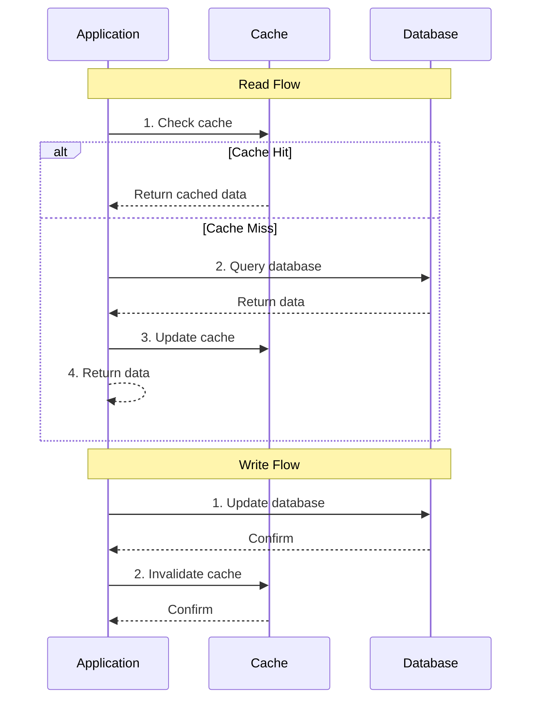
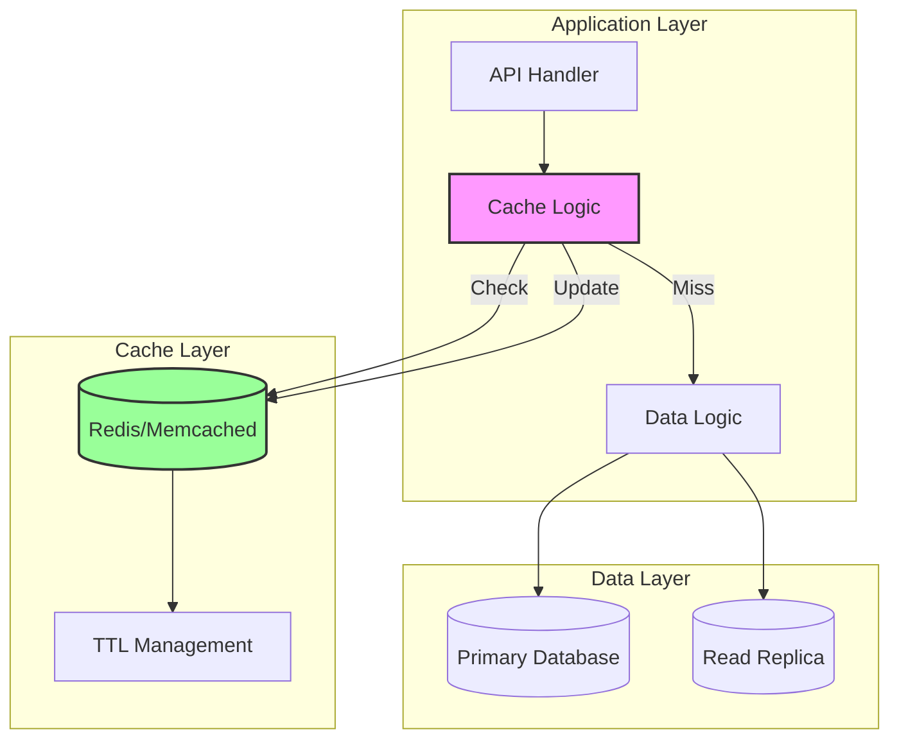
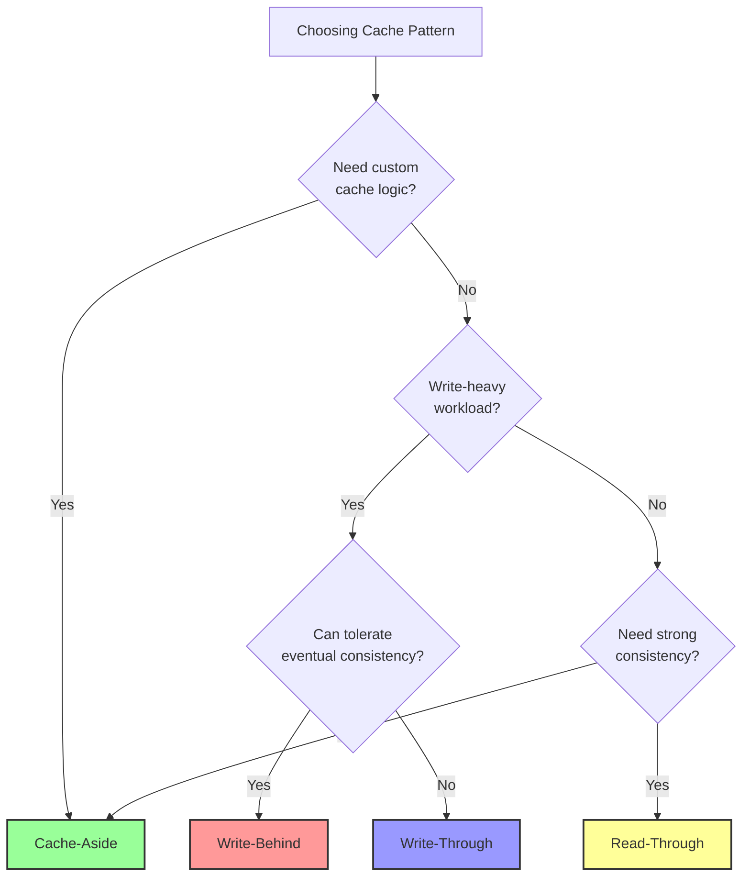

# Cache-Aside Pattern

**You fetch it, you cache it - Application-controlled caching for flexible data management**

> *"The best cache is the one you control completely." - Anonymous Systems Architect*

---

## Level 1: Intuition

### The Personal Assistant Analogy

Cache-aside is like having a personal assistant who remembers answers to frequently asked questions. When someone asks a question:
1. The assistant checks their notebook (cache)
2. If the answer is there, they respond immediately
3. If not, they research it (database), write it down, then respond
4. For updates, they cross out old answers and let you fetch fresh ones next time

### Visual Pattern Flow



### Key Characteristics

!!! tip
    **Cache-Aside Pattern**
    - **Control**: Application manages all cache operations
    - **Flexibility**: Can implement custom caching logic
    - **Consistency**: Eventual consistency through invalidation
    - **Use Case**: When you need fine-grained cache control

---

## Level 2: Deep Dive

### Implementation Architecture



### Complete Implementation Example

```python
import redis
import json
import hashlib
from typing import Optional, Any, Dict
from datetime import datetime, timedelta
import logging

class CacheAsidePattern:
    """
    Production-ready Cache-Aside implementation with:
    - Configurable TTL
    - Cache stampede prevention
    - Metrics and monitoring
    - Error handling and fallback
    """
    
    def __init__(self, redis_client: redis.Redis, default_ttl: int = 3600):
        self.cache = redis_client
        self.default_ttl = default_ttl
        self.logger = logging.getLogger(__name__)
        self.metrics = CacheMetrics()
        
    def _generate_key(self, namespace: str, identifier: str) -> str:
        """Generate consistent cache keys"""
        return f"{namespace}:{identifier}"
    
    def _serialize(self, data: Any) -> str:
        """Serialize data for cache storage"""
        return json.dumps(data, default=str)
    
    def _deserialize(self, data: str) -> Any:
        """Deserialize data from cache"""
        return json.loads(data)
    
    async def get_with_cache(
        self, 
        key: str, 
        fetch_func, 
        ttl: Optional[int] = None,
        cache_stampede_protection: bool = True
    ) -> Any:
        """
        Get data with cache-aside pattern
        
        Args:
            key: Cache key
            fetch_func: Async function to fetch data if cache miss
            ttl: Time to live in seconds
            cache_stampede_protection: Prevent multiple requests fetching same data
        """
        start_time = datetime.now()
        
        try:
# Step 1: Check cache
            cached_data = await self._get_from_cache(key)
            
            if cached_data is not None:
                self.metrics.record_hit(key)
                self.logger.debug(f"Cache hit for key: {key}")
                return cached_data
            
# Step 2: Cache miss - fetch from source
            self.metrics.record_miss(key)
            self.logger.debug(f"Cache miss for key: {key}")
            
# Optional: Implement cache stampede protection
            if cache_stampede_protection:
                lock_key = f"lock:{key}"
                lock_acquired = await self._acquire_lock(lock_key, ttl=30)
                
                if not lock_acquired:
# Another process is fetching, wait and retry
                    await asyncio.sleep(0.1)
                    cached_data = await self._get_from_cache(key)
                    if cached_data:
                        return cached_data
            
# Step 3: Fetch fresh data
            fresh_data = await fetch_func()
            
# Step 4: Update cache
            await self._set_in_cache(key, fresh_data, ttl or self.default_ttl)
            
# Record metrics
            fetch_time = (datetime.now() - start_time).total_seconds()
            self.metrics.record_fetch_time(key, fetch_time)
            
            return fresh_data
            
        except Exception as e:
            self.logger.error(f"Error in cache-aside pattern for key {key}: {e}")
            self.metrics.record_error(key)
            
# Fallback: Try to fetch without cache
            try:
                return await fetch_func()
            except Exception as fallback_error:
                self.logger.error(f"Fallback fetch also failed: {fallback_error}")
                raise
    
    async def _get_from_cache(self, key: str) -> Optional[Any]:
        """Get value from cache with error handling"""
        try:
            cached_value = await self.cache.get(key)
            if cached_value:
                return self._deserialize(cached_value)
            return None
        except Exception as e:
            self.logger.warning(f"Cache get failed for key {key}: {e}")
            return None
    
    async def _set_in_cache(self, key: str, value: Any, ttl: int) -> bool:
        """Set value in cache with error handling"""
        try:
            serialized = self._serialize(value)
            await self.cache.setex(key, ttl, serialized)
            return True
        except Exception as e:
            self.logger.warning(f"Cache set failed for key {key}: {e}")
            return False
    
    async def invalidate(self, key: str) -> bool:
        """Invalidate cache entry"""
        try:
            await self.cache.delete(key)
            self.metrics.record_invalidation(key)
            self.logger.debug(f"Invalidated cache key: {key}")
            return True
        except Exception as e:
            self.logger.error(f"Failed to invalidate key {key}: {e}")
            return False
    
    async def invalidate_pattern(self, pattern: str) -> int:
        """Invalidate all keys matching pattern"""
        try:
            keys = await self.cache.keys(pattern)
            if keys:
                deleted = await self.cache.delete(*keys)
                self.logger.info(f"Invalidated {deleted} keys matching pattern: {pattern}")
                return deleted
            return 0
        except Exception as e:
            self.logger.error(f"Failed to invalidate pattern {pattern}: {e}")
            return 0

# Example usage with a real application
class UserService:
    def __init__(self, db_connection, cache_aside: CacheAsidePattern):
        self.db = db_connection
        self.cache_pattern = cache_aside
    
    async def get_user(self, user_id: str) -> Dict:
        """Get user with cache-aside pattern"""
        cache_key = f"user:{user_id}"
        
        async def fetch_from_db():
# Expensive database query
            query = "SELECT * FROM users WHERE id = %s"
            result = await self.db.fetch_one(query, [user_id])
            return dict(result) if result else None
        
        return await self.cache_pattern.get_with_cache(
            key=cache_key,
            fetch_func=fetch_from_db,
            ttl=3600  # Cache for 1 hour
        )
    
    async def update_user(self, user_id: str, updates: Dict) -> bool:
        """Update user and invalidate cache"""
# Update database first
        query = "UPDATE users SET ... WHERE id = %s"
        await self.db.execute(query, [..., user_id])
        
# Then invalidate cache
        cache_key = f"user:{user_id}"
        await self.cache_pattern.invalidate(cache_key)
        
        return True
```

### Advanced Features

```python
class AdvancedCacheAside(CacheAsidePattern):
    """Extended cache-aside with advanced features"""
    
    async def get_with_refresh(
        self, 
        key: str, 
        fetch_func, 
        ttl: int,
        refresh_threshold: float = 0.8
    ) -> Any:
        """
        Proactive cache refresh when TTL is almost expired
        """
        cached_data = await self._get_from_cache(key)
        
        if cached_data:
# Check remaining TTL
            remaining_ttl = await self.cache.ttl(key)
            if remaining_ttl < (ttl * refresh_threshold):
# Refresh cache in background
                asyncio.create_task(self._background_refresh(key, fetch_func, ttl))
            
            return cached_data
        
# Standard cache-aside flow for cache miss
        return await self.get_with_cache(key, fetch_func, ttl)
    
    async def get_with_fallback(
        self,
        primary_key: str,
        fallback_key: str,
        fetch_func,
        ttl: int
    ) -> Any:
        """
        Multi-tier cache with fallback
        """
# Try primary cache
        data = await self._get_from_cache(primary_key)
        if data:
            return data
        
# Try fallback cache (e.g., stale data)
        fallback_data = await self._get_from_cache(fallback_key)
        
# Fetch fresh data in background
        asyncio.create_task(
            self._update_caches(primary_key, fallback_key, fetch_func, ttl)
        )
        
# Return stale data if available
        if fallback_data:
            self.logger.info(f"Serving stale data for key: {primary_key}")
            return fallback_data
        
# No fallback available, fetch synchronously
        return await fetch_func()
```

---

## Level 3: Production Patterns

### Performance Optimization

<div class="law-box">

**Cache-Aside Performance Guidelines**

1. **Key Design**
   - Use hierarchical namespaces: `service:entity:id`
   - Include version in key for easy invalidation
   - Keep keys short to save memory

2. **TTL Strategy**
   - Shorter TTL for frequently changing data
   - Longer TTL for reference data
   - Use probabilistic expiration to avoid thundering herd

3. **Serialization**
   - Use efficient formats (MessagePack, Protocol Buffers)
   - Compress large values
   - Consider storing computed results vs raw data

</div>

### Common Pitfalls and Solutions

```python
class CacheAsidePitfalls:
    """Common issues and their solutions"""
    
# PITFALL 1: Cache Stampede
    async def prevent_cache_stampede(self, key: str, fetch_func):
        """Use distributed lock to prevent multiple fetches"""
        lock = self.cache.lock(f"lock:{key}", timeout=30)
        
        try:
            if await lock.acquire(blocking=False):
# We got the lock, fetch and cache
                data = await fetch_func()
                await self.cache.setex(key, 3600, data)
                return data
            else:
# Someone else is fetching, wait for result
                for _ in range(50):  # 5 seconds max wait
                    await asyncio.sleep(0.1)
                    cached = await self.cache.get(key)
                    if cached:
                        return cached
                
# Timeout - fetch anyway
                return await fetch_func()
        finally:
            try:
                await lock.release()
            except:
                pass
    
# PITFALL 2: Inconsistent Invalidation
    async def consistent_invalidation(self, entity_type: str, entity_id: str):
        """Invalidate all related cache entries"""
        patterns = [
            f"{entity_type}:{entity_id}",          # Direct entity
            f"{entity_type}:list:*",                # List caches
            f"related:{entity_type}:{entity_id}:*" # Related data
        ]
        
        for pattern in patterns:
            await self.cache.delete_pattern(pattern)
    
# PITFALL 3: Memory Bloat
    async def cache_with_compression(self, key: str, data: Any, ttl: int):
        """Compress large values before caching"""
        import zlib
        
        serialized = json.dumps(data)
        if len(serialized) > 1024:  # Compress if > 1KB
            compressed = zlib.compress(serialized.encode())
            await self.cache.setex(f"z:{key}", ttl, compressed)
        else:
            await self.cache.setex(key, ttl, serialized)
```

### Monitoring and Observability

```python
class CacheAsideMonitoring:
    """Production monitoring for cache-aside pattern"""
    
    def __init__(self, metrics_client):
        self.metrics = metrics_client
    
    def record_cache_operation(self, operation: str, key: str, duration: float, hit: bool):
        """Record detailed cache metrics"""
        self.metrics.increment(
            'cache.operation',
            tags=[
                f'operation:{operation}',
                f'hit:{hit}',
                f'key_prefix:{key.split(":")[0]}'
            ]
        )
        
        self.metrics.histogram(
            'cache.operation.duration',
            duration,
            tags=[f'operation:{operation}']
        )
    
    def health_check(self) -> Dict[str, Any]:
        """Cache health metrics"""
        return {
            'hit_rate': self.calculate_hit_rate(),
            'avg_fetch_time': self.get_average_fetch_time(),
            'error_rate': self.calculate_error_rate(),
            'memory_usage': self.get_memory_usage(),
            'eviction_rate': self.get_eviction_rate()
        }
```

---

## Comparison with Other Patterns

### Cache-Aside vs Other Caching Patterns

| Aspect | Cache-Aside | Write-Through | Write-Behind | Read-Through |
|--------|-------------|---------------|--------------|--------------|
| **Control** | Application | Cache Provider | Cache Provider | Cache Provider |
| **Complexity** | Medium | Low | High | Low |
| **Consistency** | Eventual | Strong | Eventual | Strong |
| **Write Performance** | Fast | Slower | Fast | N/A |
| **Flexibility** | High | Low | Medium | Low |
| **Use Case** | Custom logic | Simple caching | Write-heavy | Read-heavy |

### Decision Framework



---

## Best Practices

!!! quote
    **Cache-Aside Golden Rules**

    1. **Always handle cache failures gracefully**
       - Cache is optimization, not required for correctness
       - Implement circuit breakers for cache operations

    2. **Design for cache invalidation from day one**
       - Use consistent key patterns
       - Document all cache dependencies
       - Implement bulk invalidation

    3. **Monitor cache effectiveness**
       - Track hit rates by key pattern
       - Alert on sudden hit rate drops
       - Monitor cache memory usage

    4. **Security considerations**
       - Never cache sensitive unencrypted data
       - Include user context in cache keys
       - Set appropriate TTLs for security tokens

### Real-World Example: E-commerce Product Cache

```python
class ProductCacheService:
    """Real-world cache-aside implementation for e-commerce"""
    
    def __init__(self, cache: CacheAsidePattern, db):
        self.cache = cache
        self.db = db
    
    async def get_product(self, product_id: str, user_region: str) -> Dict:
        """Get product with region-specific pricing"""
# Region-specific cache key
        cache_key = f"product:{product_id}:region:{user_region}"
        
        async def fetch_product():
# Complex query with joins
            product = await self.db.fetch_one("""
                SELECT p.*, pr.price, pr.currency, i.quantity
                FROM products p
                JOIN pricing pr ON p.id = pr.product_id
                JOIN inventory i ON p.id = i.product_id
                WHERE p.id = %s AND pr.region = %s
            """, [product_id, user_region])
            
            return dict(product) if product else None
        
        return await self.cache.get_with_cache(
            key=cache_key,
            fetch_func=fetch_product,
            ttl=300  # 5 minutes for pricing data
        )
    
    async def update_product_price(self, product_id: str, region: str, new_price: float):
        """Update price and invalidate all related caches"""
# Update database
        await self.db.execute("""
            UPDATE pricing 
            SET price = %s, updated_at = NOW() 
            WHERE product_id = %s AND region = %s
        """, [new_price, product_id, region])
        
# Invalidate specific region cache
        await self.cache.invalidate(f"product:{product_id}:region:{region}")
        
# Invalidate any aggregate caches
        await self.cache.invalidate_pattern(f"category:*:products:*")
        await self.cache.invalidate_pattern(f"search:*")
```

---

## 🔗 Related Patterns

- **[Caching Strategies](caching-strategies.md)**: Overview of all caching patterns
- **[Write-Through Cache](write-through-cache.md)**: Synchronous write caching
- **[Write-Behind Cache](write-behind-cache.md)**: Asynchronous write caching
- **[Read-Through Cache](read-through-cache.md)**: Transparent read caching
- **[Circuit Breaker](circuit-breaker.md)**: Handling cache failures gracefully

---

## 📚 References

1. [Redis Documentation - Caching Strategies](https://redis.io/docs/manual/patterns/)
2. [AWS ElastiCache - Caching Strategies](https://docs.aws.amazon.com/AmazonElastiCache/latest/mem-ug/Strategies.html)
3. [Microsoft Azure - Caching Guidance](https://docs.microsoft.com/en-us/azure/architecture/best-practices/caching)
4. [Martin Fowler - Cache-Aside Pattern](https://martinfowler.com/bliki/CacheAside.html)