# Caching Strategies

**Remember to forget - Strategic data storage for blazing performance**

> *"There are only two hard things in Computer Science: cache invalidation and naming things." - Phil Karlton*

---

## 🎯 Level 1: Intuition

### The Library Analogy

Cache is like keeping frequently used books at your desk instead of walking to archives - faster access through strategic placement. Multi-level: Desk (L1) → Shelf (L2) → Library (L3).

### Visual Metaphor

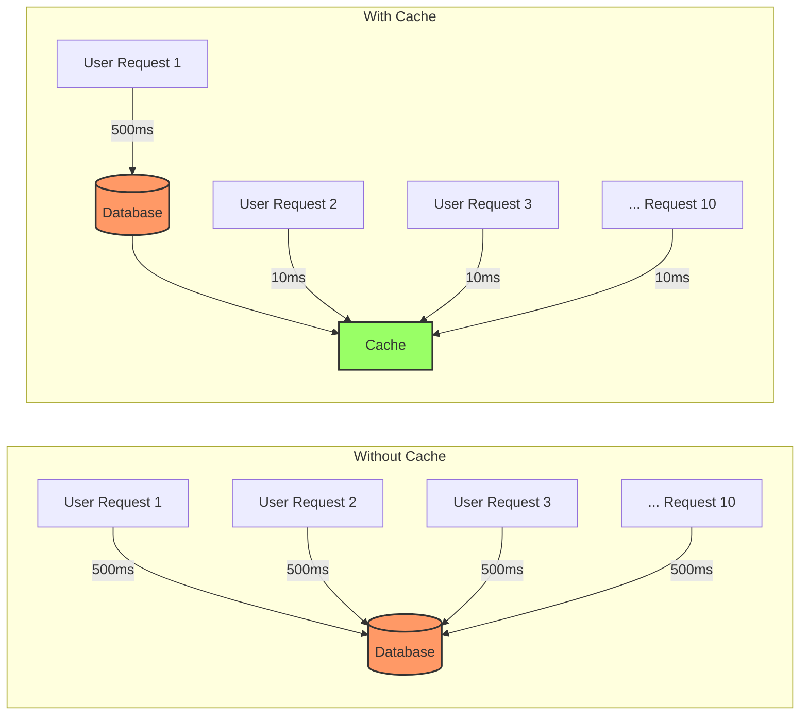

**Performance Impact:**
- Without Cache: 10 requests × 500ms = 5,000ms total
- With Cache: 500ms (first) + 9 × 10ms = 590ms total (8.5x faster!)

### Cache-Aside Pattern Flow

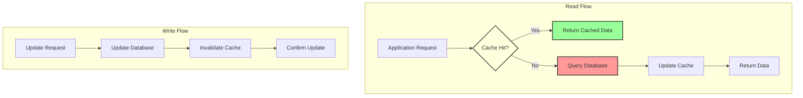

### Cache Implementation Architecture

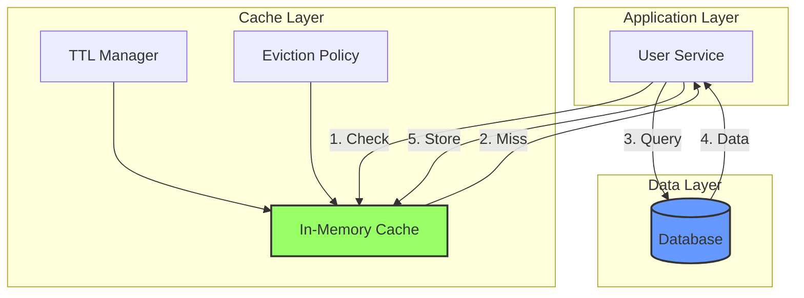

---

## 🏗️ Level 2: Foundation

### Cache Patterns Comparison

| Pattern | Write Complexity | Read Performance | Consistency | Use Case |
|---------|-----------------|------------------|-------------|----------|
| **Cache-Aside** | Simple | Fast after warm | Eventual | Read-heavy |
| **Write-Through** | Medium | Always fast | Strong | Balanced |
| **Write-Behind** | Complex | Always fast | Eventual | Write-heavy |
| **Refresh-Ahead** | Complex | Ultra-fast | Strong | Predictable |
| **Read-Through** | Medium | Fast after warm | Strong | Transparent |

### Caching Strategy Flows

```mermaid
flowchart TB
    subgraph "Cache-Aside"
        CA1[Read Request] --> CA2{In Cache?}
        CA2 -->|Yes| CA3[Return]
        CA2 -->|No| CA4[Read DB]
        CA4 --> CA5[Update Cache]
        CA5 --> CA3
    end
    
    subgraph "Write-Through"
        WT1[Write Request] --> WT2[Write Cache]
        WT2 --> WT3[Write DB]
        WT3 -->|Both Success| WT4[Return]
    end
    
    subgraph "Write-Behind"
        WB1[Write Request] --> WB2[Write Cache]
        WB2 --> WB3[Queue Write]
        WB3 --> WB4[Return Fast]
        WB5[Background Process] --> WB6[Batch Write DB]
    end
    
    subgraph "Refresh-Ahead"
        RA1[Read Request] --> RA2{Near Expiry?}
        RA2 -->|No| RA3[Return Cached]
        RA2 -->|Yes| RA4[Trigger Refresh]
        RA4 --> RA3
        RA5[Background] --> RA6[Refresh Cache]
    end
```

### Cache Pattern Architecture

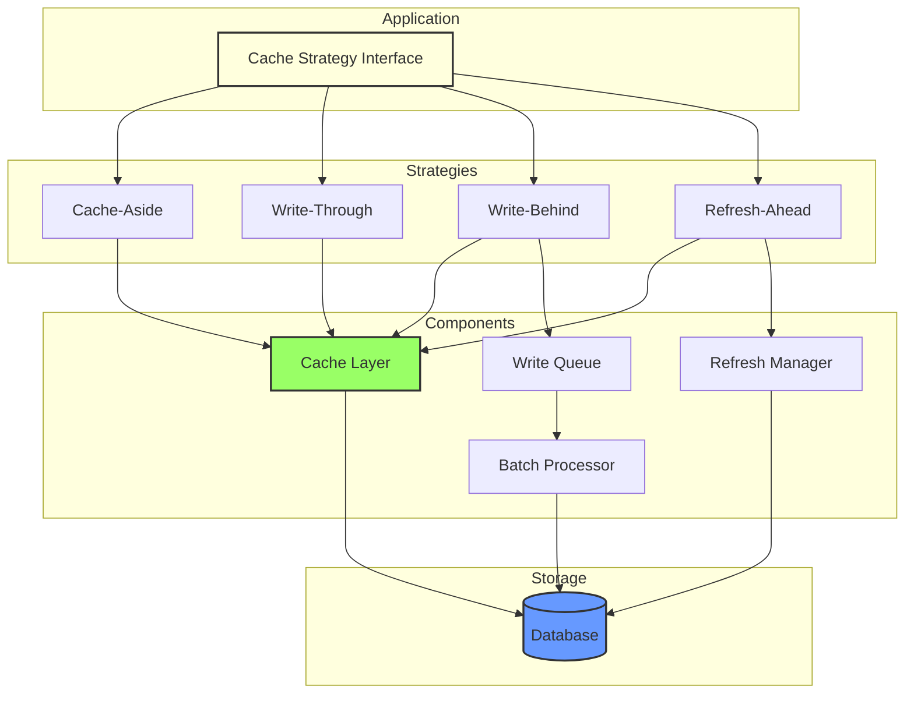

### Cache Key Design Patterns

| Key Pattern | Example | Use Case | Benefits |
|-------------|---------|----------|----------|
| **Hierarchical** | `user:123:profile` | Nested data | Easy invalidation |
| **Versioned** | `product:456:v2` | Schema changes | Cache busting |
| **Hash-based** | `hash:a1b2c3d4` | Complex queries | Consistent keys |
| **Tagged** | `post:789:tags:news,tech` | Group operations | Bulk invalidation |
| **Time-based** | `stats:2024-01:daily` | Time-series data | Auto-expiration |

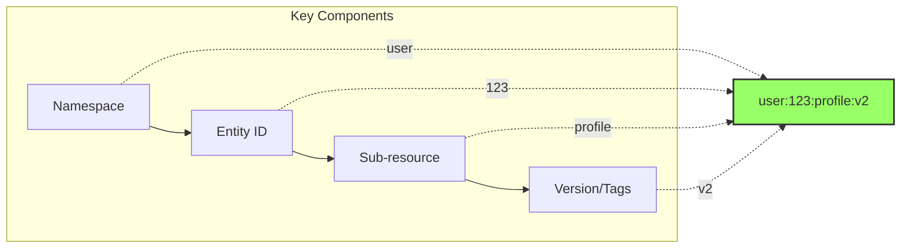

---

## 🔧 Level 3: Deep Dive

### Advanced Caching Patterns

#### 1. Multi-Level Caching Architecture

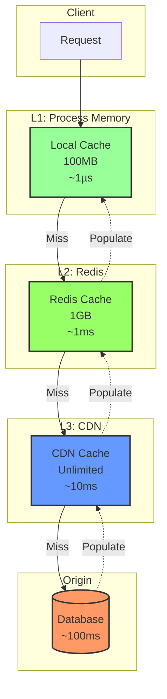

### Multi-Level Cache Characteristics

| Level | Type | Size | Latency | Use Case |
|-------|------|------|---------|----------|
| **L1** | Process Memory | 100MB | <1µs | Hot data, frequent access |
| **L2** | Redis/Memcached | 1-10GB | ~1ms | Shared across processes |
| **L3** | CDN | Unlimited | ~10ms | Global distribution |
| **Origin** | Database | - | ~100ms | Source of truth |

#### 2. Distributed Cache Coordination

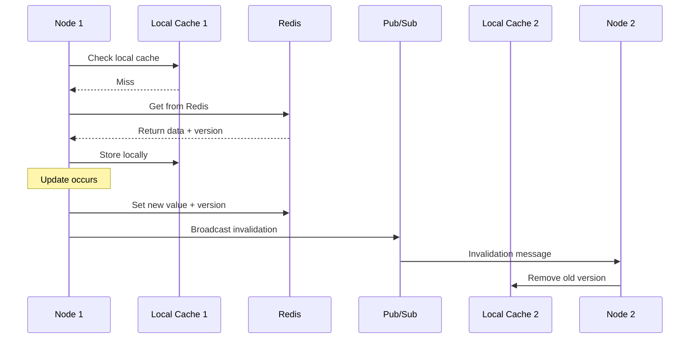

### Distributed Cache Architecture

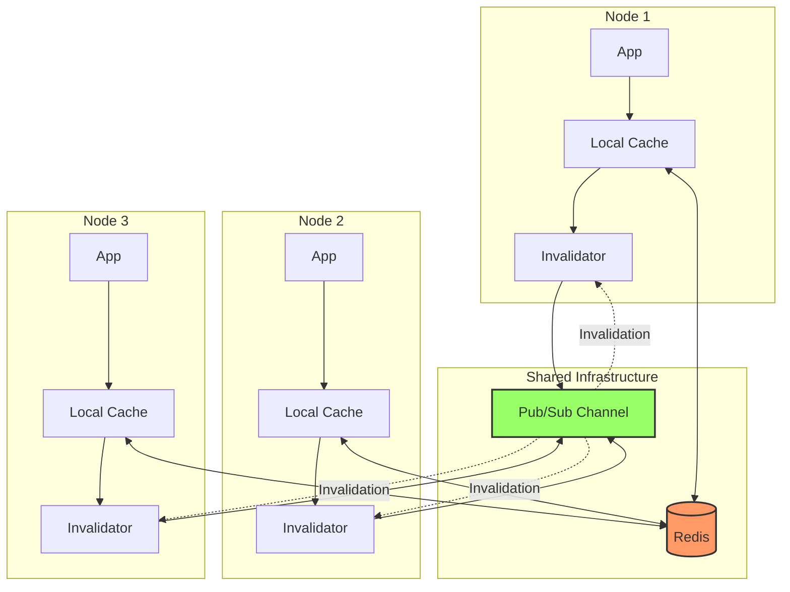

#### 3. Smart Cache Warming Strategies

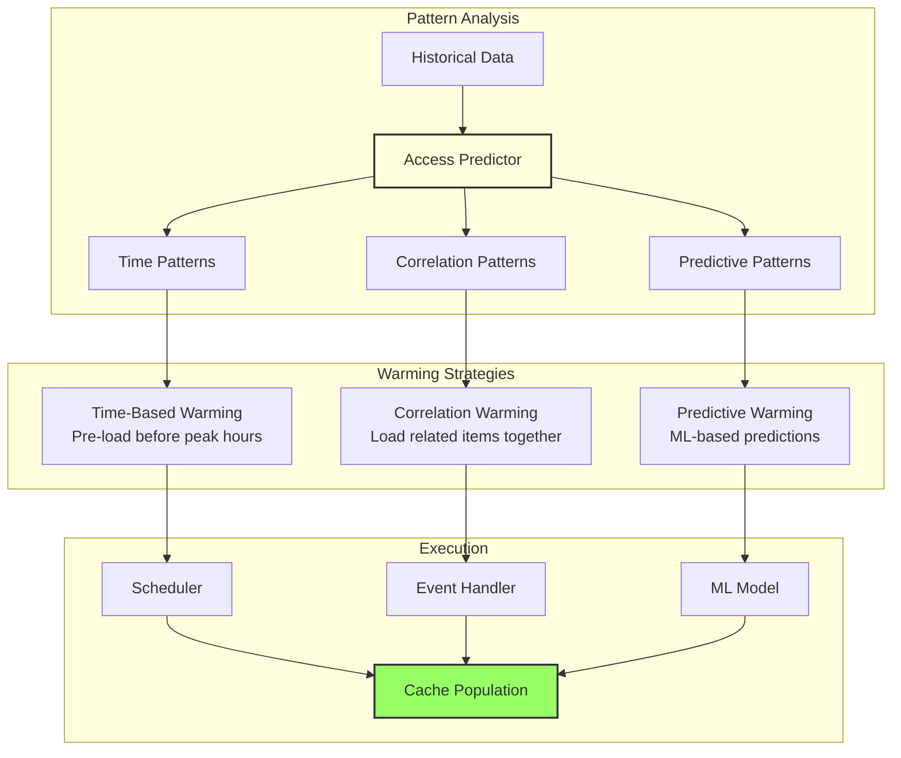

### Cache Warming Patterns

| Pattern | Detection Method | Warming Strategy | Example |
|---------|-----------------|------------------|----------|
| **Time-based** | Access logs analysis | Cron schedule | News site: warm at 7 AM |
| **Correlation** | Item association | Chain loading | Product + reviews + images |
| **Predictive** | Machine learning | Probability-based | User likely to view X next |
| **Geographic** | Location patterns | Regional pre-load | Content for timezone |
| **Event-driven** | External triggers | Hook-based | Sale starts: warm catalog |

---

## 🚀 Level 4: Expert

### Production Case Study: Reddit's Multi-Tier Caching

Reddit handles 8 billion page views/month with sophisticated multi-tier caching.

```python
class RedditCachingArchitecture:
    """Reddit's production caching: 8B views/month, 330M users, real-time updates"""
    
    def __init__(self):
        self.local_cache = LocalMemcache(size_mb=512, eviction='lru')
        self.redis_cache = RedisCluster(
            startup_nodes=[
                {"host": "redis-1", "port": 6379},
                {"host": "redis-2", "port": 6379},
                {"host": "redis-3", "port": 6379}
            ]
        )
        self.cdn_cache = FastlyCache(service_id='reddit_main')
        self.invalidator = CacheInvalidationService()
        self.metrics = PrometheusMetrics()
    
    async def get_post(self, post_id: str, user_context: Dict) -> Dict:
        """Get post with personalized data - multi-layer caching with context-aware invalidation"""
        base_key = f"post:{post_id}"
        
        # Try local cache
        post_data = self.local_cache.get(base_key)
        
        if not post_data:
            # Try Redis
            post_data = await self.redis_cache.get(base_key)
            
            if not post_data:
                # Load from database
                post_data = await self.db.get_post(post_id)
                
                if post_data:
                    ttl = self._calculate_post_ttl(post_data)
                    await asyncio.gather(
                        self.redis_cache.setex(base_key, ttl, post_data),
                        self.local_cache.set(base_key, post_data, ttl=min(ttl, 60))
                    )
                    self.metrics.increment('cache.miss', tags={'layer': 'origin'})
            else:
                self.local_cache.set(base_key, post_data, ttl=60)
                self.metrics.increment('cache.hit', tags={'layer': 'redis'})
        else:
            self.metrics.increment('cache.hit', tags={'layer': 'local'})
        
        if not post_data:
            return None
        
        # Add personalized data
        if user_context.get('user_id'):
            personalized = await self._get_personalized_data(
                post_id, user_context['user_id']
            )
            post_data.update(personalized)
        
        return post_data
    
    def _calculate_post_ttl(self, post_data: Dict) -> int:
        """Dynamic TTL based on post characteristics"""
        age_hours = (time.time() - post_data['created_utc']) / 3600
        
        if age_hours < 1:
            return 30  # Hot post: 30 seconds
        elif age_hours < 24:
            return 300  # Active: 5 minutes
        elif age_hours < 168:
            return 3600  # Cooling: 1 hour
        else:
            return 86400  # Old: 24 hours
    
    async def handle_vote(self, post_id: str, user_id: str, vote: int):
        """Handle vote with smart cache invalidation"""
        await self.db.update_vote(post_id, user_id, vote)
        
        base_key = f"post:{post_id}"
        post = await self.redis_cache.get(base_key)
        
        if post:
            # Update vote count in cache directly
            post['score'] += vote - (post.get('user_vote', 0))
            ttl = self._calculate_post_ttl(post)
            
            await asyncio.gather(
                self.redis_cache.setex(base_key, ttl, post),
                self.invalidator.broadcast_invalidation(base_key),
                self._update_cdn_if_needed(post_id, post)
            )
        else:
            await self.invalidator.invalidate_all_layers(base_key)
    
    async def _update_cdn_if_needed(self, post_id: str, post_data: Dict):
        """Selectively update CDN for hot content"""
        if post_data['score'] > 1000 or post_data['num_comments'] > 100:
            await self.cdn_cache.purge(f"/r/{post_data['subreddit']}/comments/{post_id}")
            await self.cdn_cache.set(f"post:{post_id}", post_data, ttl=300)
```

### Cache Stampede Protection

```python
class StampedeProtectedCache:
    """Production-grade cache with stampede protection"""
    
    def __init__(self, cache, database):
        self.cache = cache
        self.db = database
        self.locks = {}
        self.beta = 1.0  # Xfetch beta parameter
        
    async def get_with_protection(
        self, key: str, fetch_func: Callable, ttl: int = 300
    ) -> Any:
        """Get with multiple stampede protection mechanisms"""
        result = await self.cache.get_with_metadata(key)
        
        if result is not None:
            value, metadata = result
            
            # Probabilistic early expiration (Xfetch algorithm)
            if self._should_refresh_early(metadata, ttl):
                asyncio.create_task(
                    self._background_refresh(key, fetch_func, ttl)
                )
            
            return value
        
        return await self._fetch_with_lock(key, fetch_func, ttl)
    
    def _should_refresh_early(self, metadata: Dict, ttl: int) -> bool:
        """Xfetch algorithm - probabilistic early expiration"""
        age = time.time() - metadata['created_at']
        expiry_time = metadata['created_at'] + ttl
        xfetch = age * self.beta * math.log(random.random())
        return expiry_time + xfetch < time.time()
    
    async def _fetch_with_lock(
        self, key: str, fetch_func: Callable, ttl: int
    ) -> Any:
        """Fetch with distributed lock to prevent stampede"""
        lock_key = f"lock:{key}"
        lock_acquired = False
        
        try:
            lock_acquired = await self.cache.set_nx(
                lock_key, "locked", expire=30
            )
            
            if lock_acquired:
                value = await fetch_func()
                if value is not None:
                    await self.cache.set(key, value, ttl=ttl)
                return value
            else:
                # Wait and retry from cache
                retry_count = 0
                while retry_count < 10:
                    await asyncio.sleep(0.1 * (retry_count + 1))
                    cached = await self.cache.get(key)
                    if cached is not None:
                        return cached
                    retry_count += 1
                
                raise TimeoutError(f"Timeout waiting for cache key: {key}")
                
        finally:
            if lock_acquired:
                await self.cache.delete(lock_key)
```

### Economic Impact Analysis

```python
class CacheEconomicsAnalyzer:
    """Analyze economic impact of caching strategies"""
    
    def __init__(self):
        self.cost_model = {
            'cache_gb_month': 15.0,        # ElastiCache Redis
            'database_read_million': 0.20,  # RDS/DynamoDB
            'cdn_gb_transfer': 0.085,       # CloudFront
            'compute_hour': 0.10,           # EC2/Lambda
            'engineer_hour': 150.0          # Operational cost
        }
    
    def analyze_caching_roi(
        self, traffic_profile: Dict, current_performance: Dict,
        proposed_cache_config: Dict
    ) -> Dict:
        """Calculate ROI of implementing caching strategy"""
        current_costs = self._calculate_current_costs(
            traffic_profile, current_performance
        )
        
        projected_costs = self._calculate_projected_costs(
            traffic_profile, proposed_cache_config
        )
        
        monthly_savings = current_costs['total'] - projected_costs['total']
        annual_savings = monthly_savings * 12
        implementation_cost = self._calculate_implementation_cost(proposed_cache_config)
        roi_months = implementation_cost / monthly_savings if monthly_savings > 0 else float('inf')
        
        return {
            'current_monthly_cost': current_costs,
            'projected_monthly_cost': projected_costs,
            'monthly_savings': monthly_savings,
            'annual_savings': annual_savings,
            'implementation_cost': implementation_cost,
            'roi_months': roi_months,
            'performance_improvement': {
                'latency_reduction': f"{(1 - projected_costs['avg_latency'] / current_costs['avg_latency']) * 100:.1f}%",
                'database_load_reduction': f"{(1 - projected_costs['db_reads'] / current_costs['db_reads']) * 100:.1f}%"
            }
        }
    
    def _calculate_current_costs(self, traffic_profile: Dict, performance: Dict) -> Dict:
        """Calculate costs without proper caching"""
        monthly_requests = traffic_profile['daily_requests'] * 30
        db_reads = monthly_requests * (1 - performance.get('cache_hit_rate', 0))
        
        db_cost = (db_reads / 1_000_000) * self.cost_model['database_read_million']
        compute_hours = (monthly_requests * performance['avg_latency_ms']) / (1000 * 3600)
        compute_cost = compute_hours * self.cost_model['compute_hour']
        incident_hours = performance.get('monthly_incident_hours', 10)
        operational_cost = incident_hours * self.cost_model['engineer_hour']
        
        return {
            'database': db_cost,
            'compute': compute_cost,
            'operational': operational_cost,
            'total': db_cost + compute_cost + operational_cost,
            'db_reads': db_reads,
            'avg_latency': performance['avg_latency_ms']
        }
```

---

## 🎯 Level 5: Mastery

### Theoretical Foundations

#### Cache Optimization Theory
```python
import numpy as np
from scipy.optimize import minimize
from typing import List, Tuple

class TheoreticalCacheOptimizer:
    """Mathematical optimization of cache configurations"""
    
    def __init__(self):
        self.hit_rate_model = self._build_hit_rate_model()
    
    def optimize_cache_size(
        self, workload_distribution: np.array, cost_per_gb: float,
        value_per_hit: float, max_budget: float
    ) -> Dict:
        """Find optimal cache size using constrained optimization"""
        
        def objective(cache_size):
            hit_rate = self._predict_hit_rate(cache_size, workload_distribution)
            hits_per_day = hit_rate * np.sum(workload_distribution)
            value = hits_per_day * value_per_hit
            cost = cache_size * cost_per_gb
            return -(value - cost)
        
        constraints = [
            {'type': 'ineq', 'fun': lambda x: max_budget - x * cost_per_gb},
            {'type': 'ineq', 'fun': lambda x: x}
        ]
        
        x0 = max_budget / (2 * cost_per_gb)
        result = minimize(objective, x0, method='SLSQP', constraints=constraints)
        
        optimal_size = result.x[0]
        optimal_hit_rate = self._predict_hit_rate(optimal_size, workload_distribution)
        
        return {
            'optimal_cache_size_gb': optimal_size,
            'expected_hit_rate': optimal_hit_rate,
            'daily_value': -result.fun,
            'roi_days': (optimal_size * cost_per_gb) / (-result.fun)
        }
    
    def _predict_hit_rate(self, cache_size: float, workload: np.array) -> float:
        """Predict hit rate using Che's approximation"""
        sorted_workload = np.sort(workload)[::-1]
        
        total_items = len(workload)
        avg_item_size = np.mean(workload)
        cache_capacity = int(cache_size * 1024 / avg_item_size)
        
        if cache_capacity >= total_items:
            return 1.0
        
        popular_items = sorted_workload[:cache_capacity]
        return np.sum(popular_items) / np.sum(workload)
    
    def optimize_multi_tier_cache(
        self, tiers: List[Tuple[str, float, float]], workload: Dict, constraints: Dict
    ) -> Dict:
        """Optimize multi-tier cache configuration"""
        n_tiers = len(tiers)
        total_budget = constraints['budget']
        dp = {}
        
        def solve(tier_idx, budget, current_items_cached):
            if tier_idx >= n_tiers or budget <= 0:
                return []
            
            state = (tier_idx, round(budget, 2), current_items_cached)
            if state in dp:
                return dp[state]
            
            tier_name, cost_per_gb, latency = tiers[tier_idx]
            best_config = []
            best_value = 0
            
            for cache_size in np.linspace(0, budget / cost_per_gb, 20):
                if cache_size == 0:
                    continue
                
                items_in_tier = int(cache_size * 1024 / workload['avg_item_size'])
                items_in_tier = min(items_in_tier, workload['total_items'] - current_items_cached)
                
                hit_rate = items_in_tier / workload['total_items']
                value = hit_rate * workload['requests_per_day'] * (1 / latency)
                
                remaining_budget = budget - (cache_size * cost_per_gb)
                sub_config = solve(tier_idx + 1, remaining_budget, current_items_cached + items_in_tier)
                
                total_value = value + sum(c['value'] for c in sub_config)
                
                if total_value > best_value:
                    best_value = total_value
                    best_config = [{
                        'tier': tier_name, 'size_gb': cache_size, 'items': items_in_tier,
                        'hit_rate': hit_rate, 'value': value
                    }] + sub_config
            
            dp[state] = best_config
            return best_config
        
        optimal_config = solve(0, total_budget, 0)
        
        return {
            'configuration': optimal_config,
            'total_hit_rate': sum(t['hit_rate'] for t in optimal_config),
            'average_latency': self._calculate_weighted_latency(optimal_config, tiers),
            'total_cost': sum(t['size_gb'] * cost for t, (_, cost, _) in zip(optimal_config, tiers))
        }
```

### ML-Powered Intelligent Caching

```python
class MLPoweredCacheManager:
    """Machine learning driven cache management"""
    
    def __init__(self):
        self.access_predictor = self._build_lstm_predictor()
        self.ttl_optimizer = self._build_ttl_optimizer()
        self.eviction_scorer = self._build_eviction_model()
        
    def _build_lstm_predictor(self):
        """LSTM model for predicting future access patterns"""
        from tensorflow.keras.models import Sequential
        from tensorflow.keras.layers import LSTM, Dense, Dropout
        
        model = Sequential([
            LSTM(128, return_sequences=True, input_shape=(24, 5)),
            Dropout(0.2),
            LSTM(64, return_sequences=True),
            Dropout(0.2),
            LSTM(32),
            Dropout(0.2),
            Dense(24)
        ])
        
        model.compile(optimizer='adam', loss='mse')
        return model
    
    async def predict_and_warm(self, current_time: datetime):
        """Predict access patterns and pre-warm cache"""
        features = self._extract_temporal_features(current_time)
        historical = await self._get_historical_patterns(current_time)
        
        predictions = self.access_predictor.predict(np.array([historical]))[0]
        
        threshold = np.percentile(predictions, 90)  # Top 10%
        hot_periods = np.where(predictions > threshold)[0]
        
        for period_offset in hot_periods:
            target_time = current_time + timedelta(hours=period_offset)
            keys_to_warm = await self._get_period_hot_keys(target_time)
            
            delay = period_offset * 3600 - 300  # 5 minutes before
            if delay > 0:
                asyncio.create_task(self._delayed_warming(delay, keys_to_warm))
    
    def adaptive_ttl(self, key: str, access_history: List[float]) -> int:
        """Calculate optimal TTL using access patterns"""
        if len(access_history) < 2:
            return 300
        
        inter_access_times = [
            access_history[i] - access_history[i-1]
            for i in range(1, len(access_history))
        ]
        
        mean_inter_access = np.mean(inter_access_times)
        std_inter_access = np.std(inter_access_times)
        ttl = mean_inter_access + 2 * std_inter_access
        
        return int(max(60, min(ttl, 86400)))
```

### Future Directions

1. **Quantum-Inspired Caching** - Superposition states, quantum annealing optimization
2. **Edge AI Caching** - Federated learning, neural compression, predictive warming
3. **Blockchain Cache Validation** - Immutable audit trails, distributed consensus

---

## 📋 Quick Reference

### Cache Strategy Selection

| If you need... | Use this strategy | Key considerations |
|----------------|-------------------|-------------------|
| Simple read optimization | Cache-Aside | Handle cache misses |
| Strong consistency | Write-Through | Higher write latency |
| Write performance | Write-Behind | Risk of data loss |
| Ultra-low latency | Refresh-Ahead | Complex implementation |
| Geographic distribution | Multi-tier + CDN | Cache coherence |
| Cost optimization | Adaptive TTL | Monitoring required |

## 📊 Interactive Decision Support Tools

### 🎯 Caching Strategy Decision Tree

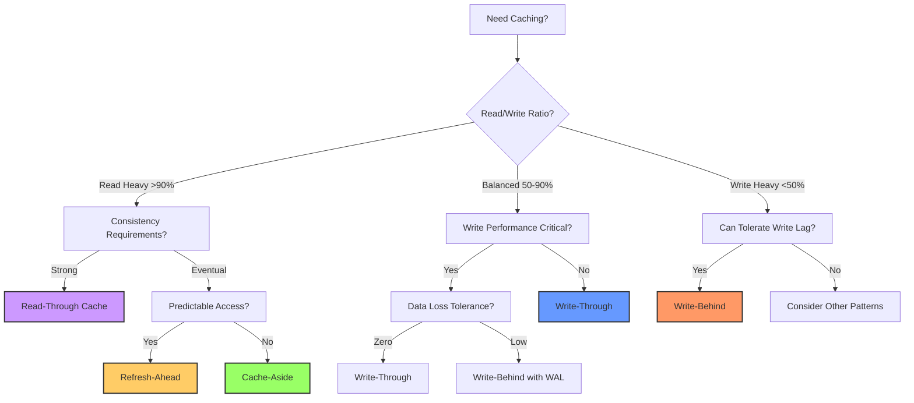

### 💰 Cache ROI Calculator

| Parameter | Your Value | Formula | Result |
|-----------|------------|---------|--------|
| **Current State** | | | |
| Daily Requests | ___ million | A | |
| DB Read Latency | ___ ms | B | |
| DB Cost per Million Reads | $___ | C | |
| Current Cache Hit Rate | ___% | D | |
| **Proposed Cache** | | | |
| Target Hit Rate | ___% | E | |
| Cache Latency | ___ ms | F | |
| Cache Size (GB) | ___ | G | |
| Cache Cost per GB/month | $___ | H | |
| **Calculations** | | | |
| DB Reads Saved/Day | | A × (E-D) | ___ million |
| Latency Improvement | | ((B×(1-D) + F×D) - (B×(1-E) + F×E)) | ___ ms |
| Monthly DB Cost Savings | | 30 × A × (E-D) × C / 1M | $___ |
| Monthly Cache Cost | | G × H | $___ |
| **Monthly Net Savings** | | DB Savings - Cache Cost | $___ |
| **ROI Period** | | Implementation Cost / Monthly Savings | ___ months |

### 🔄 Cache Invalidation Strategy Selector

| Invalidation Pattern | When to Use | Pros | Cons | Implementation Complexity |
|---------------------|-------------|------|------|--------------------------|
| **TTL-Based** | • Predictable data freshness<br>• No real-time requirements | Simple, automatic | Stale data possible | ⭐ Low |
| **Event-Driven** | • Real-time updates needed<br>• Clear update triggers | Always fresh | Complex pub/sub | ⭐⭐⭐ Medium |
| **Write-Through** | • Strong consistency<br>• Simple invalidation | No stale data | Write performance | ⭐⭐ Low-Medium |
| **Tagged Invalidation** | • Related data groups<br>• Bulk operations | Efficient bulk ops | Tag management | ⭐⭐⭐ Medium |
| **Versioned Keys** | • Schema changes<br>• A/B testing | Clean transitions | Key proliferation | ⭐⭐ Low-Medium |

### 📈 Cache Performance Estimator

```mermaid
graph LR
    subgraph "Input Parameters"
        RPS[Requests/Second]
        HR[Hit Rate %]
        CL[Cache Latency]
        DL[DB Latency]
        CS[Cache Size GB]
    end
    
    subgraph "Calculated Metrics"
        AL[Avg Latency]
        CH[Cache Hits/sec]
        CM[Cache Misses/sec]
        DBL[DB Load]
        Cost[Monthly Cost]
    end
    
    RPS --> AL
    HR --> AL
    CL --> AL
    DL --> AL
    
    RPS --> CH
    HR --> CH
    
    RPS --> CM
    HR --> CM
    
    CM --> DBL
    
    CS --> Cost
    DBL --> Cost
    
    AL -.-> |Formula: HR×CL + (1-HR)×DL| AL2[Result]
    CH -.-> |Formula: RPS × HR| CH2[Result]
    CM -.-> |Formula: RPS × (1-HR)| CM2[Result]
    DBL -.-> |Formula: CM × Query Cost| DBL2[Result]
```

### Implementation Checklist

- [ ] Choose appropriate caching strategy
- [ ] Design cache key schema
- [ ] Implement cache warming
- [ ] Add monitoring and metrics
- [ ] Handle cache stampede
- [ ] Plan invalidation strategy
- [ ] Set up alerts for hit rate
- [ ] Document TTL decisions
- [ ] Test failure scenarios
- [ ] Monitor cost impact

### Common Anti-Patterns

1. **Cache Everything** - Not all data benefits from caching
2. **Infinite TTL** - Stale data and memory bloat
3. **No Invalidation Strategy** - Serving outdated information
4. **Single Cache Layer** - No redundancy or performance tiers
5. **Ignoring Stampede** - System crashes on cache expiry

---

## 🎓 Key Takeaways

1. **Cache strategically** - Not all data needs caching
2. **Layer your caches** - L1 → L2 → L3 → Origin
3. **Monitor everything** - Hit rates, latency, costs
4. **Invalidate intelligently** - Balance consistency and performance
5. **Protect against stampedes** - Your future self will thank you

## 🎴 Quick Reference Cards

### 🚀 Cache Pattern Selection Cheat Sheet

<div style="border: 2px solid #5448C8; border-radius: 8px; padding: 16px; margin: 16px 0; background: #f8f9fa;">

**CACHE-ASIDE** ✅
- Read-heavy workloads (>90% reads)
- Can tolerate cache misses
- Simple implementation needed
- ❌ Avoid for: Write-heavy apps, strong consistency

**WRITE-THROUGH** ✅
- Balanced read/write
- Need strong consistency
- Can tolerate write latency
- ❌ Avoid for: High-throughput writes

**WRITE-BEHIND** ✅
- Write-heavy workloads
- Can tolerate eventual consistency
- Need write performance
- ❌ Avoid for: Financial data, zero data loss

**REFRESH-AHEAD** ✅
- Predictable access patterns
- Need ultra-low latency
- Have spare compute capacity
- ❌ Avoid for: Random access, simple apps

</div>

### 🔍 Common Pitfalls Checklist

<div style="border: 2px solid #dc2626; border-radius: 8px; padding: 16px; margin: 16px 0; background: #fef2f2;">

**Before Going to Production:**
- ⚠️ **Stampede Protection**: Implement distributed locks or probabilistic expiry
- ⚠️ **Key Design**: Use versioned keys for schema changes
- ⚠️ **Monitoring**: Track hit rate, latency, evictions
- ⚠️ **Failure Testing**: Test cache unavailability scenarios
- ⚠️ **Cost Tracking**: Monitor cache size and transfer costs
- ⚠️ **Documentation**: Document TTL decisions and invalidation logic

</div>

### 📏 Monitoring Metrics Guide

<div style="border: 2px solid #059669; border-radius: 8px; padding: 16px; margin: 16px 0; background: #f0fdf4;">

**Essential Metrics to Track:**

| Metric | Good Range | Alert Threshold | Action |
|--------|------------|----------------|---------|
| Hit Rate | >85% | <70% | Review access patterns |
| P99 Latency | <10ms | >50ms | Check cache health |
| Eviction Rate | <5% | >10% | Increase cache size |
| Error Rate | <0.1% | >1% | Check connectivity |
| Memory Usage | 60-80% | >90% | Scale or optimize |

**Dashboard Query Examples:**
```
cache_hit_rate = (cache_hits / (cache_hits + cache_misses)) * 100
effective_latency = (hit_rate * cache_latency) + ((1-hit_rate) * db_latency)
cost_per_request = (cache_cost + (miss_rate * db_cost)) / total_requests
```

</div>

---

*"Cache invalidation is hard. Naming things is harder. Doing both at 3 AM during an outage is impossible."*

---

**Previous**: [← Bulkhead Pattern](bulkhead.md) | **Next**: Change Data Capture (CDC) → (Coming Soon)