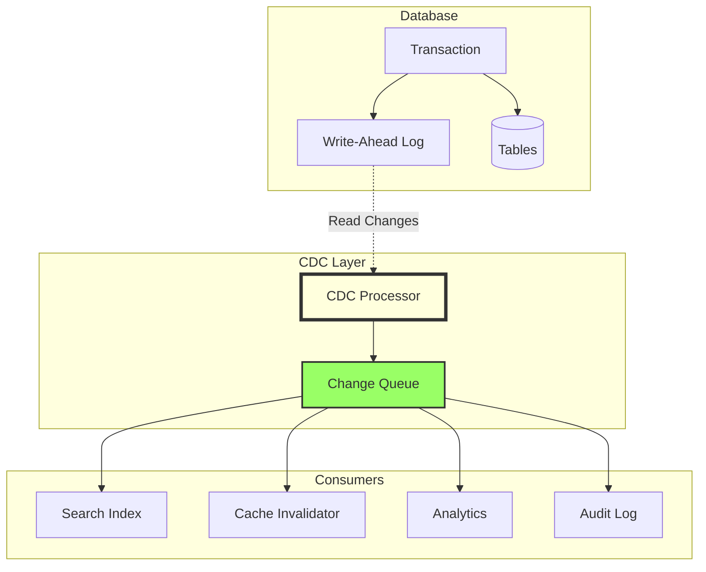
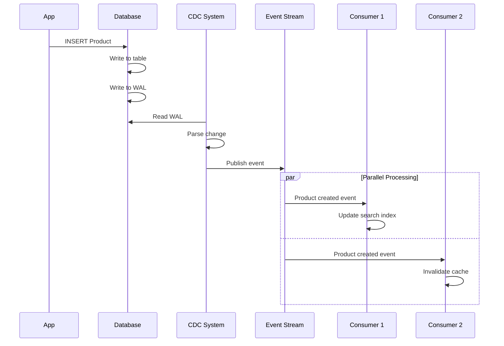
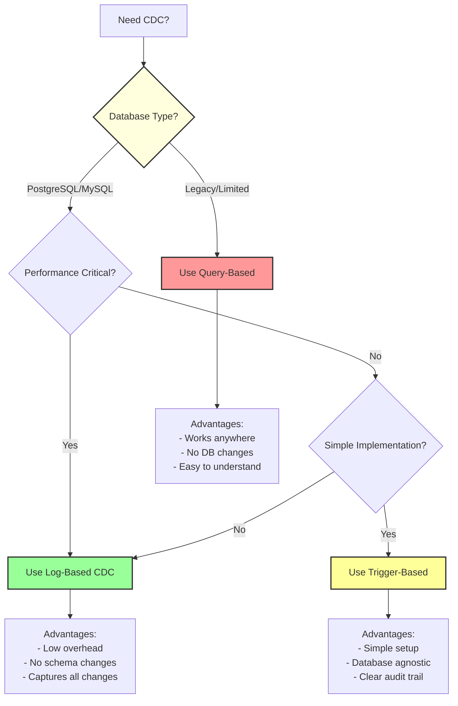
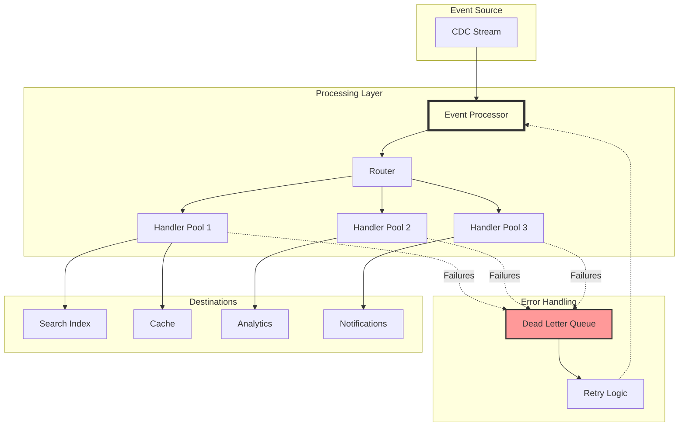

<!-- Navigation -->
[Home](../introduction/index.md) → [Part III: Patterns](index.md) → **Change Data Capture (CDC)**

# Change Data Capture (CDC)

**Every change leaves a trace - Turning database mutations into event streams**

> *"In distributed systems, the database write is just the beginning of the story."*

---

## 🎯 Level 1: Intuition

### The Security Camera Analogy

CDC is like security cameras in a bank - capturing every change, not just current state, enabling real-time alerts and complete audit trails.

### Visual Metaphor

```
Traditional: Database → Batch ETL → Target (hourly snapshots, high latency)
CDC:         Database → Change Stream → Multiple Targets (real-time, complete history)
```

### CDC Architecture Overview



### CDC Event Flow



---

## 🏗️ Level 2: Foundation

### CDC Implementation Strategies

| Strategy | How it Works | Pros | Cons | Use When |
|----------|-------------|------|------|----------|
| **Log-Based** | Read transaction log | No app changes, low overhead | Complex setup, DB-specific | Production systems |
| **Trigger-Based** | Database triggers | Simple to implement | Performance impact, maintenance | Small scale |
| **Query-Based** | Poll with timestamps | Works everywhere | Misses deletes, high latency | Legacy systems |
| **Application-Based** | Emit from app code | Full control | Requires discipline, dual writes | Greenfield projects |

### CDC Implementation Comparison

```mermaid
graph TB
    subgraph "Log-Based CDC"
        L1[Database WAL] --> L2[CDC Reader]
        L2 --> L3[Parse Binary Log]
        L3 --> L4[Event Stream]
        
        style L1 fill:#f96,stroke:#333,stroke-width:2px
        style L2 fill:#9f6,stroke:#333,stroke-width:2px
    end
    
    subgraph "Trigger-Based CDC"
        T1[Database Table] --> T2[Trigger]
        T2 --> T3[CDC Table]
        T3 --> T4[Event Stream]
        
        style T1 fill:#f96,stroke:#333,stroke-width:2px
        style T2 fill:#ff9,stroke:#333,stroke-width:2px
    end
    
    subgraph "Query-Based CDC"
        Q1[Database Table] --> Q2[Polling Process]
        Q2 --> Q3[Detect Changes]
        Q3 --> Q4[Event Stream]
        
        style Q1 fill:#f96,stroke:#333,stroke-width:2px
        style Q2 fill:#fdd,stroke:#333,stroke-width:2px
    end
```



### CDC Strategy Decision Tree



### CDC Event Processing Architecture



### CDC Processing Patterns

| Pattern | Description | Use Case | Considerations |
|---------|-------------|----------|----------------|
| **Fan-out** | One event → Multiple handlers | Update multiple systems | Parallel processing |
| **Filtering** | Process subset of events | Table/operation specific | Reduce noise |
| **Transformation** | Modify event format | System integration | Schema mapping |
| **Aggregation** | Combine multiple events | Analytics, summaries | State management |
| **Deduplication** | Remove duplicate events | Exactly-once processing | Event ID tracking |

---

## 🔧 Level 3: Deep Dive

### Advanced CDC Patterns

#### 1. Transactional Outbox Pattern
```python
class TransactionalOutbox:
    """Ensure reliable event publishing with outbox pattern"""
    
    def __init__(self, db_connection):
        self.db = db_connection
        self._create_outbox_table()
        
    def _create_outbox_table(self):
        """Create outbox table for reliable publishing"""
        cursor = self.db.cursor()
        cursor.execute("""
            CREATE TABLE IF NOT EXISTS outbox_events (
                id SERIAL PRIMARY KEY,
                aggregate_id VARCHAR(255),
                event_type VARCHAR(100),
                payload JSONB,
                created_at TIMESTAMP DEFAULT CURRENT_TIMESTAMP,
                processed_at TIMESTAMP,
                retry_count INT DEFAULT 0,
                status VARCHAR(20) DEFAULT 'PENDING'
            );
            CREATE INDEX IF NOT EXISTS idx_outbox_status 
            ON outbox_events(status, created_at) 
            WHERE status = 'PENDING';
        """)
        self.db.commit()
    
    def save_with_outbox(self, entity_data: Dict, events: List[Dict]):
        """Save entity and events in same transaction"""
        cursor = self.db.cursor()
        
        try:
            cursor.execute("BEGIN")
            
            cursor.execute("""
                INSERT INTO orders (id, customer_id, total, status)
                VALUES (%(id)s, %(customer_id)s, %(total)s, %(status)s)
            """, entity_data)
            
            for event in events:
                cursor.execute("""
                    INSERT INTO outbox_events (aggregate_id, event_type, payload)
                    VALUES (%(aggregate_id)s, %(event_type)s, %(payload)s)
                """, {
                    'aggregate_id': entity_data['id'],
                    'event_type': event['type'],
                    'payload': json.dumps(event['data'])
                })
            
            cursor.execute("COMMIT")
        except Exception:
            cursor.execute("ROLLBACK")
            raise

class OutboxPublisher:
    """Publish events from outbox table"""
    
    def __init__(self, db_connection, message_broker):
        self.db = db_connection
        self.broker = message_broker
        
    async def publish_pending_events(self):
        """Publish all pending events"""
        cursor = self.db.cursor()
        
        cursor.execute("""
            SELECT id, aggregate_id, event_type, payload
            FROM outbox_events
            WHERE status = 'PENDING'
            ORDER BY created_at
            LIMIT 100
            FOR UPDATE SKIP LOCKED
        """)
        
        events = cursor.fetchall()
        
        for event_id, aggregate_id, event_type, payload in events:
            try:
                await self.broker.publish(
                    topic=f"cdc.{event_type}",
                    key=aggregate_id,
                    value=payload
                )
                
                cursor.execute("""
                    UPDATE outbox_events
                    SET status = 'PROCESSED', processed_at = CURRENT_TIMESTAMP
                    WHERE id = %s
                """, (event_id,))
                
            except Exception:
                cursor.execute("""
                    UPDATE outbox_events
                    SET retry_count = retry_count + 1,
                        status = CASE WHEN retry_count >= 3 THEN 'FAILED' ELSE 'PENDING' END
                    WHERE id = %s
                """, (event_id,))
        
        self.db.commit()
```

#### 2. Schema Evolution Handling
```python
class SchemaEvolutionHandler:
    """Handle schema changes in CDC stream"""
    
    def __init__(self):
        self.schema_registry = {}
        self.transformation_rules = {}
        
    def register_schema(self, table: str, version: int, schema: Dict):
        """Register table schema version"""
        if table not in self.schema_registry:
            self.schema_registry[table] = {}
        self.schema_registry[table][version] = schema
        
    def add_transformation(self, table: str, from_version: int, 
                         to_version: int, transformer: Callable):
        """Add schema transformation rule"""
        key = (table, from_version, to_version)
        self.transformation_rules[key] = transformer
        
    def process_event(self, event: ChangeEvent) -> ChangeEvent:
        """Process event with schema evolution"""
        event_version = self._detect_version(event)
        current_version = self._get_current_version(event.table)
        
        if event_version == current_version:
            return event
        
        transformed_event = event
        for version in range(event_version, current_version):
            transformer = self.transformation_rules.get(
                (event.table, version, version + 1)
            )
            if transformer:
                transformed_event = transformer(transformed_event)
            else:
                raise ValueError(f"No transformation from v{version} to v{version+1}")
        
        return transformed_event

# Example schema transformations
def transform_user_v1_to_v2(event: ChangeEvent) -> ChangeEvent:
    """Split name into first_name and last_name"""
    if event.after and 'name' in event.after:
        parts = event.after['name'].split(' ', 1)
        event.after['first_name'] = parts[0]
        event.after['last_name'] = parts[1] if len(parts) > 1 else ''
        del event.after['name']
    return event

def transform_order_v2_to_v3(event: ChangeEvent) -> ChangeEvent:
    """Add currency field with default USD"""
    if event.after and 'currency' not in event.after:
        event.after['currency'] = 'USD'
    return event
```

#### 3. CDC Deduplication and Ordering
```python
import heapq
from collections import OrderedDict

class CDCDeduplicator:
    """Ensure exactly-once processing and ordering"""
    
    def __init__(self, window_size: int = 10000):
        self.seen_events = OrderedDict()
        self.window_size = window_size
        
    def is_duplicate(self, event: ChangeEvent) -> bool:
        """Check if event is duplicate"""
        event_key = self._get_event_key(event)
        
        if event_key in self.seen_events:
            return True
        
        self.seen_events[event_key] = event.timestamp
        
        if len(self.seen_events) > self.window_size:
            self.seen_events.popitem(last=False)
        
        return False
    
    def _get_event_key(self, event: ChangeEvent) -> str:
        """Generate unique key for event"""
        return f"{event.table}:{event.transaction_id}:{event.timestamp}"

class CDCOrderingBuffer:
    """Buffer events to ensure ordering"""
    
    def __init__(self, max_delay_ms: int = 1000):
        self.buffer = []  # Min heap
        self.max_delay = max_delay_ms / 1000.0
        self.watermark = 0
        
    def add_event(self, event: ChangeEvent):
        """Add event to buffer"""
        heapq.heappush(self.buffer, (event.timestamp, event))
        
    def get_ready_events(self) -> List[ChangeEvent]:
        """Get events ready for processing"""
        current_time = time.time()
        ready_events = []
        
        while self.buffer:
            timestamp, event = self.buffer[0]
            if current_time - timestamp > self.max_delay:
                heapq.heappop(self.buffer)
                ready_events.append(event)
                self.watermark = max(self.watermark, timestamp)
            else:
                break
        
        return ready_events
```

---

## 🚀 Level 4: Expert

### Production Case Study: Airbnb's SpinalTap

Airbnb processes 4+ billion database changes daily using SpinalTap for MySQL binlog streaming.

```python
class SpinalTapCDC:
    """Airbnb's MySQL CDC at scale - 4+ billion events/day"""
    
    def __init__(self):
        self.binlog_processors = {}
        self.kafka_producer = None
        self.schema_store = SchemaStore()
        self.metrics = MetricsCollector()
        
    def start_binlog_streaming(self, mysql_config: Dict):
        """Start streaming from MySQL binlog"""
        stream = BinLogStreamReader(
            connection_settings=mysql_config,
            server_id=self._generate_server_id(),
            blocking=True,
            resume_stream=True,
            only_events=[DeleteRowsEvent, UpdateRowsEvent, WriteRowsEvent]
        )
        
        processor = BinlogProcessor(
            stream=stream,
            config=mysql_config,
            schema_store=self.schema_store
        )
        
        processor.start()
        self.binlog_processors[mysql_config['host']] = processor
        return processor

class BinlogProcessor:
    """Process MySQL binlog events"""
    
    def __init__(self, stream, config, schema_store):
        self.stream = stream
        self.config = config
        self.schema_store = schema_store
        self.position_tracker = PositionTracker()
        self.mutation_buffer = MutationBuffer()
        
    async def process_stream(self):
        """Main processing loop"""
        for binlog_event in self.stream:
            try:
                mutations = self._convert_to_mutations(binlog_event)
                self.mutation_buffer.add_all(mutations)
                
                if self.mutation_buffer.should_flush():
                    await self._flush_mutations()
                
                self.position_tracker.update(
                    binlog_event.packet.log_file,
                    binlog_event.packet.log_pos
                )
            except Exception as e:
                self.handle_error(e, binlog_event)
    
    def _convert_to_mutations(self, binlog_event) -> List[Dict]:
        """Convert binlog event to mutations"""
        mutations = []
        table = f"{binlog_event.schema}.{binlog_event.table}"
        schema = self.schema_store.get_schema(table)
        
        for row in binlog_event.rows:
            if isinstance(binlog_event, WriteRowsEvent):
                mutation = {
                    'type': 'INSERT', 'table': table,
                    'timestamp': binlog_event.timestamp,
                    'data': self._serialize_row(row['values'], schema)
                }
            elif isinstance(binlog_event, UpdateRowsEvent):
                mutation = {
                    'type': 'UPDATE', 'table': table,
                    'timestamp': binlog_event.timestamp,
                    'before': self._serialize_row(row['before_values'], schema),
                    'after': self._serialize_row(row['after_values'], schema)
                }
            elif isinstance(binlog_event, DeleteRowsEvent):
                mutation = {
                    'type': 'DELETE', 'table': table,
                    'timestamp': binlog_event.timestamp,
                    'data': self._serialize_row(row['values'], schema)
                }
            mutations.append(mutation)
        
        return mutations
    
    async def _flush_mutations(self):
        """Flush mutations to Kafka"""
        mutations = self.mutation_buffer.get_and_clear()
        if not mutations:
            return
        
        by_table = defaultdict(list)
        for mutation in mutations:
            by_table[mutation['table']].append(mutation)
        
        futures = []
        for table, table_mutations in by_table.items():
            record = {
                'schema': self._get_avro_schema(table),
                'payload': table_mutations
            }
            
            future = self.kafka_producer.send(
                topic=f"mysql.cdc.{table}",
                value=record,
                timestamp_ms=int(time.time() * 1000)
            )
            futures.append(future)
        
        await asyncio.gather(*futures)
        self.metrics.increment('mutations.published', len(mutations))

class MutationBuffer:
    """Buffer mutations for efficient batching"""
    
    def __init__(self, max_size: int = 1000, max_delay_ms: int = 100):
        self.buffer = []
        self.max_size = max_size
        self.max_delay = max_delay_ms / 1000.0
        self.last_flush = time.time()
        
    def add_all(self, mutations: List[Dict]):
        self.buffer.extend(mutations)
        
    def should_flush(self) -> bool:
        return (len(self.buffer) >= self.max_size or 
                time.time() - self.last_flush > self.max_delay)
    
    def get_and_clear(self) -> List[Dict]:
        mutations = self.buffer
        self.buffer = []
        self.last_flush = time.time()
        return mutations
```

### Real-World Monitoring

```python
class CDCMonitoringDashboard:
    """Production monitoring for CDC pipeline"""
    
    def __init__(self):
        self.metrics = PrometheusMetrics()
        self.alerts = AlertManager()
        
    def track_cdc_metrics(self):
        """Track key CDC metrics"""
        self.metrics.gauge(
            'cdc.replication_lag_seconds',
            self.calculate_replication_lag(),
            labels={'source': 'mysql', 'target': 'kafka'}
        )
        
        self.metrics.counter(
            'cdc.events_processed_total',
            labels={'table': table, 'operation': operation}
        )
        
        self.metrics.counter(
            'cdc.errors_total',
            labels={'error_type': error_type, 'table': table}
        )
        
        for consumer in self.get_consumers():
            self.metrics.gauge(
                'cdc.consumer_lag_events',
                consumer.lag,
                labels={'consumer': consumer.name, 'topic': consumer.topic}
            )
    
    def setup_alerts(self):
        """Configure CDC alerts"""
        self.alerts.add_rule(
            name='CDCHighReplicationLag',
            expr='cdc_replication_lag_seconds > 60',
            duration='5m',
            severity='warning',
            annotations={
                'summary': 'CDC replication lag is high',
                'description': 'Replication lag is {{ $value }}s'
            }
        )
        
        self.alerts.add_rule(
            name='CDCConsumerLag',
            expr='cdc_consumer_lag_events > 100000',
            duration='10m',
            severity='critical',
            annotations={
                'summary': 'CDC consumer falling behind',
                'description': 'Consumer {{ $labels.consumer }} has {{ $value }} events lag'
            }
        )
```

### Economic Impact Analysis

```python
class CDCEconomicsAnalyzer:
    """Analyze economic impact of CDC implementation"""
    
    def calculate_cdc_roi(self, system_metrics: Dict) -> Dict:
        """Calculate ROI of CDC vs alternatives"""
        batch_costs = {
            'compute_hours': system_metrics['daily_batch_hours'] * 365,
            'data_staleness_impact': self._calculate_staleness_cost(
                system_metrics['batch_frequency_hours']
            ),
            'operational_overhead': system_metrics['batch_failure_hours'] * 150
        }
        
        cdc_costs = {
            'infrastructure': self._calculate_cdc_infra_cost(system_metrics),
            'development': 40 * 150 * 4,  # 4 weeks
            'operational': system_metrics['cdc_maintenance_hours'] * 150
        }
        
        benefits = {
            'real_time_analytics': system_metrics['analytics_value_per_hour'] * 24 * 365,
            'reduced_inconsistency': system_metrics['consistency_incidents'] * 10000,
            'faster_cache_invalidation': system_metrics['cache_miss_cost'] * 0.8
        }
        
        annual_savings = (sum(batch_costs.values()) + sum(benefits.values()) - 
                         sum(cdc_costs.values()))
        
        return {
            'annual_savings': annual_savings,
            'payback_months': cdc_costs['development'] / (annual_savings / 12),
            'data_freshness_improvement': f"{system_metrics['batch_frequency_hours']}h → <1s"
        }
```

---

## 🎯 Level 5: Mastery

### Theoretical Foundations

#### CDC Consistency Guarantees
```python
from enum import Enum
from abc import ABC, abstractmethod

class ConsistencyLevel(Enum):
    EVENTUAL = "eventual"
    CAUSAL = "causal"  
    STRICT = "strict"

class TheoreticalCDCModel:
    """Formal model for CDC consistency guarantees"""
    
    def __init__(self):
        self.vector_clock = VectorClock()
        self.causal_graph = CausalityGraph()
        
    def establish_ordering_guarantee(
        self,
        source_ordering: str,  # total, partial, none
        delivery_semantics: str,  # at-least-once, exactly-once
        processing_model: str  # synchronous, asynchronous
    ) -> ConsistencyLevel:
        """Determine achievable consistency level"""
        # Strict: total ordering + exactly-once + synchronous
        if (source_ordering == "total" and 
            delivery_semantics == "exactly-once" and
            processing_model == "synchronous"):
            return ConsistencyLevel.STRICT
        
        # Causal: partial ordering preserved
        elif source_ordering in ["total", "partial"]:
            return ConsistencyLevel.CAUSAL
        
        return ConsistencyLevel.EVENTUAL
    
    def prove_causal_consistency(self, events: List[ChangeEvent]) -> bool:
        """Verify causal consistency using happens-before relation"""
        for i, event1 in enumerate(events):
            for event2 in events[i+1:]:
                if self._happens_before(event1, event2):
                    if not self._delivered_before(event1, event2):
                        return False
        return True
    
    def _happens_before(self, e1: ChangeEvent, e2: ChangeEvent) -> bool:
        """Lamport's happens-before relation"""
        # Same transaction
        if e1.transaction_id == e2.transaction_id:
            return e1.timestamp < e2.timestamp
        
        # Causal dependency
        if self.causal_graph.has_path(e1, e2):
            return True
        
        return False
```

### Advanced CDC Optimization

```python
import numpy as np
from scipy.optimize import minimize

class CDCOptimizer:
    """Optimize CDC pipeline configuration using queuing theory"""
    
    def optimize_buffer_sizes(
        self,
        arrival_rate: float,  # events/second
        processing_rate: float,  # events/second
        latency_slo: float,  # seconds
        memory_budget: int  # MB
    ) -> Dict:
        """Find optimal buffer sizes using M/M/c queue model"""
        
        def objective(params):
            buffer_size, batch_size = params
            
            utilization = arrival_rate / (processing_rate * batch_size)
            if utilization >= 1:
                return float('inf')
            
            # M/M/1 queue waiting time
            avg_wait = utilization / (processing_rate * (1 - utilization))
            avg_batch_delay = batch_size / (2 * arrival_rate)
            total_latency = avg_wait + avg_batch_delay
            
            # Penalties
            slo_penalty = max(0, total_latency - latency_slo) ** 2
            memory_usage = buffer_size * avg_event_size
            memory_penalty = max(0, memory_usage - memory_budget) ** 2
            
            return total_latency + 10 * slo_penalty + 0.001 * memory_penalty
        
        constraints = [
            {'type': 'ineq', 'fun': lambda x: x[0] - 100},  # Min buffer
            {'type': 'ineq', 'fun': lambda x: 10000 - x[0]},  # Max buffer
            {'type': 'ineq', 'fun': lambda x: x[1] - 1},  # Min batch
            {'type': 'ineq', 'fun': lambda x: 1000 - x[1]}  # Max batch
        ]
        
        result = minimize(
            objective, x0=[1000, 100], constraints=constraints, method='SLSQP'
        )
        
        optimal_buffer, optimal_batch = result.x
        
        return {
            'buffer_size': int(optimal_buffer),
            'batch_size': int(optimal_batch),
            'expected_latency': result.fun,
            'utilization': arrival_rate / (processing_rate * optimal_batch)
        }
```

### Future Directions

1. **Quantum CDC** - Instant propagation via entanglement, multi-version superposition
2. **AI-Powered CDC** - Predictive capture, intelligent routing, anomaly detection
3. **Blockchain CDC** - Immutable logs, decentralized consensus, smart contract validation
4. **Edge CDC** - Distributed edge capture, CRDTs, mesh networks

---

## 📋 Quick Reference

### CDC Strategy Selection

| If you need... | Use this approach | Key considerations |
|----------------|-------------------|-------------------|
| Real-time sync | Log-based CDC | Complex setup, best performance |
| Simple implementation | Trigger-based | Performance overhead |
| Legacy system | Query-based polling | Can miss deletes |
| Full control | Application CDC | Requires discipline |
| Guaranteed delivery | Outbox pattern | Additional complexity |
| Multi-region | Federated CDC | Network latency |

### Implementation Checklist

- [ ] Choose CDC strategy based on requirements
- [ ] Set up change capture mechanism
- [ ] Implement schema evolution handling
- [ ] Add deduplication logic
- [ ] Configure monitoring and alerting
- [ ] Test failure scenarios
- [ ] Plan for backfills
- [ ] Document data flow
- [ ] Set up consumer scaling
- [ ] Implement dead letter handling

### Common Anti-Patterns

1. **Dual Writes** - Writing to multiple systems (use CDC instead)
2. **Polling Everything** - Wasting resources on unchanged data
3. **Ignoring Ordering** - Losing causal relationships
4. **No Schema Evolution** - Breaking consumers on changes
5. **Unbounded Buffers** - Running out of memory

---

## 🎓 Key Takeaways

1. **CDC enables real-time data synchronization** - Move from batch to streaming
2. **Choose the right CDC method** - Log-based for production, triggers for simplicity
3. **Handle schema evolution** - Systems change, plan for it
4. **Ensure ordering and deduplication** - Correctness matters
5. **Monitor everything** - Lag, throughput, errors, consumer health

---

*"In distributed systems, change is the only constant. CDC makes that change visible, reliable, and useful."*

---

**Previous**: [← Caching Strategies](caching-strategies.md) | **Next**: [Circuit Breaker Pattern →](circuit-breaker.md)