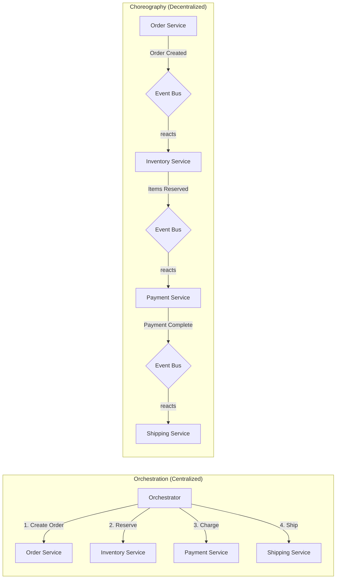
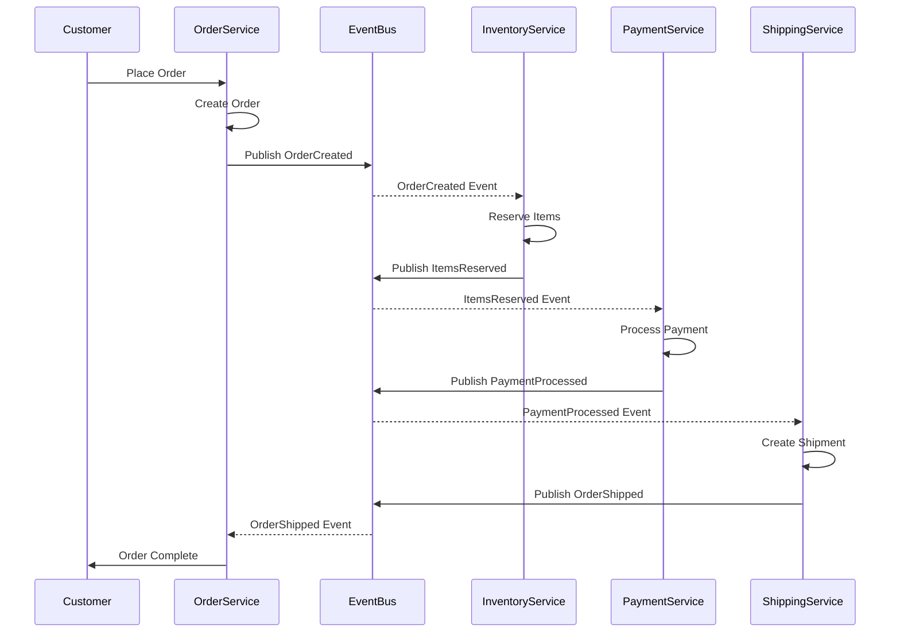
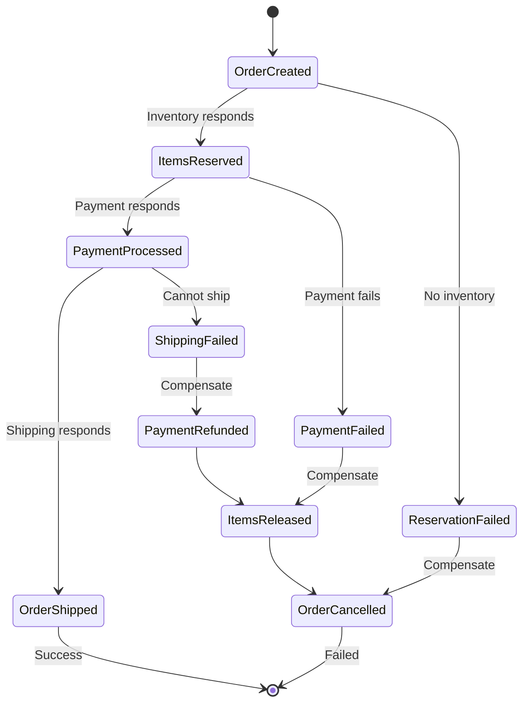

# Choreography Pattern

## 🎯 The Essence

!!! tip "Core Concept"
    Services coordinate through events without central control - like dancers responding to music and each other rather than a choreographer's commands.



## 🔍 Intuition: The Jazz Band Analogy

**Symphony Orchestra** (Orchestration): A conductor directs every musician, telling them exactly when and what to play. All coordination flows through the conductor.

**Jazz Band** (Choreography): Musicians listen to each other and respond spontaneously. Each knows their role and reacts to what others play, creating coordinated music without central direction.

Choreography creates resilient, scalable systems where services evolve independently while maintaining coordination.

## 📊 Choreography vs Orchestration

| Aspect | Choreography | Orchestration |
|--------|--------------|---------------|
| **Control** | Decentralized (each service decides) | Centralized (orchestrator controls) |
| **Coupling** | Loose (event-based) | Tighter (direct calls) |
| **Visibility** | Distributed (harder to track) | Centralized (easy monitoring) |
| **Scalability** | Excellent (no bottleneck) | Limited by orchestrator |
| **Complexity** | Emergent behavior | Explicit flow |
| **Error Handling** | Each service handles | Centralized handling |
| **Evolution** | Services evolve independently | Changes affect orchestrator |

## 🏗️ Implementation Patterns

### 1. Event-Driven Choreography



### 2. Service Implementation

```python
# Order Service
class OrderService:
    def __init__(self, event_bus: EventBus):
        self.event_bus = event_bus
        self.orders = {}
        
        # Subscribe to relevant events
        event_bus.subscribe("OrderShipped", self.handle_order_shipped)
        event_bus.subscribe("PaymentFailed", self.handle_payment_failed)
        
    async def create_order(self, order_request: OrderRequest) -> Order:
        # Create order
        order = Order(
            id=generate_id(),
            customer_id=order_request.customer_id,
            items=order_request.items,
            status="CREATED"
        )
        self.orders[order.id] = order
        
        # Publish event - no direct service calls
        await self.event_bus.publish(
            "OrderCreated",
            OrderCreatedEvent(
                order_id=order.id,
                customer_id=order.customer_id,
                items=order.items,
                timestamp=datetime.utcnow()
            )
        )
        
        return order
        
    async def handle_order_shipped(self, event: OrderShippedEvent):
        if order := self.orders.get(event.order_id):
            order.status = "COMPLETED"
            order.tracking_number = event.tracking_number
            
    async def handle_payment_failed(self, event: PaymentFailedEvent):
        if order := self.orders.get(event.order_id):
            order.status = "FAILED"
            # Publish compensation event
            await self.event_bus.publish(
                "OrderCancelled",
                OrderCancelledEvent(order_id=order.id)
            )

# Inventory Service
class InventoryService:
    def __init__(self, event_bus: EventBus):
        self.event_bus = event_bus
        self.reservations = {}
        
        # Subscribe to events this service cares about
        event_bus.subscribe("OrderCreated", self.handle_order_created)
        event_bus.subscribe("OrderCancelled", self.handle_order_cancelled)
        
    async def handle_order_created(self, event: OrderCreatedEvent):
        # React to order creation
        try:
            reservation = await self.reserve_items(
                event.order_id,
                event.items
            )
            
            # Publish next event in the flow
            await self.event_bus.publish(
                "ItemsReserved",
                ItemsReservedEvent(
                    order_id=event.order_id,
                    reservation_id=reservation.id,
                    items=event.items
                )
            )
        except InsufficientInventoryError as e:
            # Publish failure event
            await self.event_bus.publish(
                "InventoryReservationFailed",
                InventoryFailedEvent(
                    order_id=event.order_id,
                    reason=str(e)
                )
            )
            
    async def handle_order_cancelled(self, event: OrderCancelledEvent):
        # Compensate by releasing reservation
        if reservation := self.reservations.get(event.order_id):
            await self.release_items(reservation)
            del self.reservations[event.order_id]
```

### 3. Saga Pattern with Choreography



### 4. Event Correlation

```python
class EventCorrelator:
    """Track related events across services"""
    
    def __init__(self):
        self.workflows = defaultdict(list)
        self.timeout_handler = TimeoutHandler()
        
    async def track_event(self, event: Event):
        correlation_id = event.correlation_id
        self.workflows[correlation_id].append({
            'event_type': event.type,
            'timestamp': event.timestamp,
            'service': event.source_service,
            'data': event.data
        })
        
        # Check workflow completion
        if self.is_workflow_complete(correlation_id):
            await self.handle_completion(correlation_id)
        
        # Set timeout for workflow
        self.timeout_handler.set_timeout(
            correlation_id,
            timedelta(minutes=30),
            self.handle_timeout
        )
        
    def is_workflow_complete(self, correlation_id: str) -> bool:
        events = self.workflows[correlation_id]
        event_types = {e['event_type'] for e in events}
        
        # Define expected completion patterns
        completion_patterns = [
            {'OrderCreated', 'ItemsReserved', 'PaymentProcessed', 'OrderShipped'},
            {'OrderCreated', 'OrderCancelled'}
        ]
        
        return any(
            pattern.issubset(event_types) 
            for pattern in completion_patterns
        )
```

## 💥 Failure Modes & Mitigation

### 1. Event Loss Prevention

```python
class ReliableEventBus:
    def __init__(self, persistence: EventStore):
        self.persistence = persistence
        self.subscribers = defaultdict(list)
        self.dead_letter_queue = Queue()
        
    async def publish(self, event_type: str, event: Event):
        # Persist event first (Event Sourcing)
        await self.persistence.append(event)
        
        # Then publish to subscribers
        tasks = []
        for subscriber in self.subscribers[event_type]:
            task = self._deliver_with_retry(subscriber, event)
            tasks.append(task)
            
        # Wait for all deliveries
        results = await asyncio.gather(*tasks, return_exceptions=True)
        
        # Handle failures
        for i, result in enumerate(results):
            if isinstance(result, Exception):
                await self.dead_letter_queue.put({
                    'event': event,
                    'subscriber': self.subscribers[event_type][i],
                    'error': result
                })
    
    async def _deliver_with_retry(self, subscriber, event, max_retries=3):
        for attempt in range(max_retries):
            try:
                await subscriber(event)
                return
            except Exception as e:
                if attempt == max_retries - 1:
                    raise
                await asyncio.sleep(2 ** attempt)  # Exponential backoff
```

### 2. Handling Out-of-Order Events

```python
class OrderedEventProcessor:
    def __init__(self):
        self.processed_events = set()
        self.pending_events = defaultdict(list)
        self.event_sequences = defaultdict(int)
        
    async def process_event(self, event: Event):
        # Check if we've already processed this event
        if event.id in self.processed_events:
            return  # Idempotent
            
        # Check if prerequisites are met
        if not self.can_process(event):
            # Queue for later
            self.pending_events[event.correlation_id].append(event)
            return
            
        # Process the event
        await self.handle_event(event)
        self.processed_events.add(event.id)
        self.event_sequences[event.correlation_id] += 1
        
        # Check if any pending events can now be processed
        await self.process_pending(event.correlation_id)
        
    def can_process(self, event: Event) -> bool:
        # Define prerequisites for each event type
        prerequisites = {
            'ItemsReserved': ['OrderCreated'],
            'PaymentProcessed': ['ItemsReserved'],
            'OrderShipped': ['PaymentProcessed']
        }
        
        required = prerequisites.get(event.type, [])
        processed_types = self.get_processed_types(event.correlation_id)
        
        return all(req in processed_types for req in required)
```

## 🎯 Design Decisions

| Decision Point | Choreography Choice | Trade-off |
|----------------|-------------------|-----------|
| **Event Bus** | Kafka, RabbitMQ, AWS EventBridge | Throughput vs Features |
| **Event Schema** | JSON, Avro, Protobuf | Flexibility vs Performance |
| **Correlation** | Correlation ID, Saga ID | Tracking vs Simplicity |
| **Idempotency** | Event ID, Version tracking | Correctness vs Complexity |
| **Monitoring** | Distributed tracing, Event logs | Visibility vs Overhead |

## 🌍 Real-World Examples

### 1. **Netflix** - Microservices
- Services react to events independently
- No central orchestrator for most flows
- Resilient to individual service failures

### 2. **Uber** - Trip Lifecycle
- Driver app, rider app, and backend services coordinate via events
- Each service handles its domain independently
- Event-driven state transitions

### 3. **Amazon** - Order Processing
- Order, inventory, payment, and fulfillment services
- Coordinate through SNS/SQS events
- Each service owns its decisions

## ⚖️ When to Use vs Avoid

### ✅ Use When:
- **Service autonomy** is important
- **Loose coupling** is a priority
- **Scalability** requirements are high
- **Services evolve** independently
- **Event-driven** architecture exists

### ❌ Avoid When:
- **Complex workflows** need monitoring
- **Centralized control** is required
- **Debugging** ease is critical
- **Ordered processing** is strict
- **Synchronous responses** needed

## 🔗 Related Patterns

- **[Saga](saga.md)**: Distributed transaction management
- **[Event Sourcing](event-sourcing.md)**: Event persistence
- **[CQRS](cqrs.md)**: Command-query separation
- **[Event-Driven](event-driven.md)**: Architectural style
- **[Circuit Breaker](circuit-breaker.md)**: Failure handling