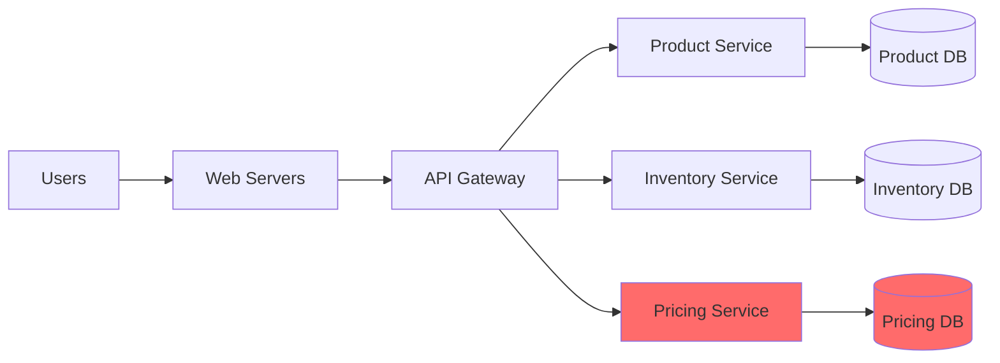
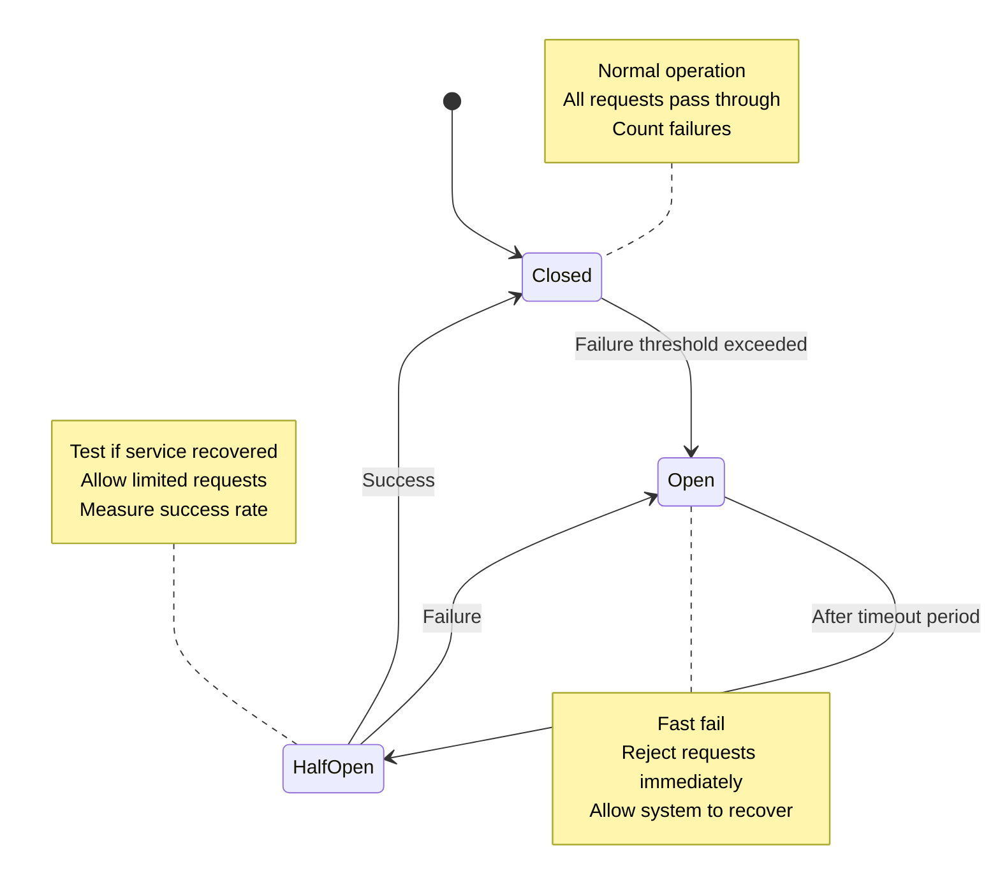

# Circuit Breaker Pattern

<span class="path-icon">🎯</span>
 <span class="path-name">Senior Engineer Path</span>
 <span class="path-progress">3/10</span>
 <div class="mini-progress">
</div>

The Circuit Breaker pattern prevents cascading failures by detecting when a downstream service is failing and temporarily blocking requests to give it time to recover.

!!! info
 <h4>📚 Before You Begin</h4>
 <p>Make sure you understand these concepts:</p>
 <ul>
 <li><a href="/part1-axioms/law1-failure/">Law 1: Correlated Failure</a> - Why failures cascade</li>
 <li><a href="/part2-pillars/state/">State Management</a> - How to track system state</li>
 <li><a href="/patterns/timeout/">Timeout Pattern</a> - Basic failure detection</li>
 </ul>

## 🎯 Problem Statement

!!! danger "The Cascade Effect"
 When a service in a distributed system fails or becomes slow, upstream services that depend on it can quickly exhaust their resources (threads, connections, memory) waiting for responses. This creates a cascade of failures throughout the system.

### Real-World Scenario

Consider an e-commerce system during Black Friday:



When the Pricing Service becomes slow:
1. API Gateway threads block waiting for pricing responses
2. Web servers exhaust their connection pools
3. Users experience timeouts
4. The entire site becomes unresponsive

## 💡 Solution: Circuit Breaker

The Circuit Breaker acts like an electrical circuit breaker, monitoring for failures and "tripping" to prevent damage to the system.

### State Machine



## 📐 Implementation

### Basic Circuit Breaker

```python
import time
from enum import Enum
from threading import Lock
from typing import Callable, Any, Optional

class CircuitState(Enum):
 CLOSED = "CLOSED"
 OPEN = "OPEN"
 HALF_OPEN = "HALF_OPEN"

class CircuitBreaker:
 def __init__(
 self,
 failure_threshold: int = 5,
 recovery_timeout: int = 60,
 expected_exception: type = Exception
 ):
 self.failure_threshold = failure_threshold
 self.recovery_timeout = recovery_timeout
 self.expected_exception = expected_exception
 
 self._state = CircuitState.CLOSED
 self._failure_count = 0
 self._last_failure_time = None
 self._lock = Lock()
 
 def call(self, func: Callable, *args, **kwargs) -> Any:
 with self._lock:
 if self._state == CircuitState.OPEN:
 if self._should_attempt_reset():
 self._state = CircuitState.HALF_OPEN
 else:
 raise CircuitOpenError("Circuit breaker is OPEN")
 
 try:
 result = func(*args, **kwargs)
 self._on_success()
 return result
 except self.expected_exception as e:
 self._on_failure()
 raise e
 
 def _should_attempt_reset(self) -> bool:
 return (
 self._last_failure_time and
 time.time() - self._last_failure_time >= self.recovery_timeout
 )
 
 def _on_success(self):
 with self._lock:
 self._failure_count = 0
 self._state = CircuitState.CLOSED
 
 def _on_failure(self):
 with self._lock:
 self._failure_count += 1
 self._last_failure_time = time.time()
 
 if self._failure_count >= self.failure_threshold:
 self._state = CircuitState.OPEN

class CircuitOpenError(Exception):
 pass
```

### Production-Ready Features

<div class="grid cards" markdown>

- :material-chart-line: **Metrics & Monitoring**
 
 ---
 
 - State transitions
 - Failure rates
 - Recovery times
 - Request volumes

- :material-cog: **Configuration**
 
 ---
 
 - Dynamic thresholds
 - Per-service settings
 - Environment-specific
 - A/B testing support

- :material-shield: **Advanced Protection**
 
 ---
 
 - Sliding windows
 - Error rate calculation
 - Partial failures
 - Bulkhead integration

- :material-puzzle: **Integration**
 
 ---
 
 - Middleware support
 - Decorator pattern
 - Async/await compatible
 - Framework plugins

</div>

## 📊 Configuration Guidelines

### Threshold Selection

| Service Type | Failure Threshold | Recovery Timeout | Half-Open Requests |
|--------------|-------------------|------------------|-------------------|
| Critical API | 5 failures | 30 seconds | 1 |
| Background Job | 10 failures | 60 seconds | 3 |
| Third-party API | 3 failures | 120 seconds | 1 |
| Internal Service | 5 failures | 45 seconds | 2 |

### Monitoring Dashboard

```python
# Metrics to track
circuit_breaker_metrics = {
 "state_transitions": Counter("circuit_breaker_state_changes"),
 "requests_total": Counter("circuit_breaker_requests"),
 "failures_total": Counter("circuit_breaker_failures"),
 "success_rate": Gauge("circuit_breaker_success_rate"),
 "open_circuits": Gauge("circuit_breaker_open_count")
}
```

## 🚨 Common Pitfalls

!!! warning "Anti-Patterns to Avoid"
 
 ### 1. **Setting Thresholds Too Low**
 Normal transient failures trigger the circuit breaker unnecessarily.
 
 ### 2. **Not Testing State Transitions**
 Circuit gets stuck in OPEN state due to bugs in reset logic.
 
 ### 3. **Sharing Circuit Breakers**
 One failing endpoint affects all endpoints.
 
 ### 4. **Ignoring Business Logic**
 Some operations should never be circuit broken (e.g., payment processing).

## 🎯 Best Practices

### 1. Fail Fast
```python
# Good: Immediate rejection when open
if circuit.is_open():
 return cached_response or error_response

# Bad: Still checking even when open
try:
 return make_request() # Wastes resources
except CircuitOpenError:
 return error_response
```

### 2. Graceful Degradation
```python
@circuit_breaker
def get_recommendations(user_id):
 # Primary: Personalized recommendations
 return recommendation_service.get_for_user(user_id)

def get_recommendations_with_fallback(user_id):
 try:
 return get_recommendations(user_id)
 except CircuitOpenError:
 # Fallback: Popular items
 return cache.get_popular_items()
```

### 3. Observability
```python
@circuit_breaker(
 on_open=lambda: logger.error("Circuit opened!"),
 on_close=lambda: logger.info("Circuit closed"),
 on_half_open=lambda: logger.info("Testing circuit...")
)
def protected_operation():
 pass
```

## 🔗 Related Patterns

<a href="/patterns/retry-backoff/" class="related-item">
 <span class="item-icon">🔄</span>
 <span class="item-title">Retry with Backoff</span>
 <span class="item-type">pattern</span>
 </a>
 <a href="/patterns/bulkhead/" class="related-item">
 <span class="item-icon">🚢</span>
 <span class="item-title">Bulkhead Pattern</span>
 <span class="item-type">pattern</span>
 </a>
 <a href="/patterns/timeout/" class="related-item">
 <span class="item-icon">⏱️</span>
 <span class="item-title">Timeout Pattern</span>
 <span class="item-type">pattern</span>
 </a>
 <a href="/case-studies/netflix-chaos/" class="related-item">
 <span class="item-icon">📊</span>
 <span class="item-title">Netflix Chaos Engineering</span>
 <span class="item-type">case-study</span>
 </a>

## 🚀 Next Steps

<div class="step-card level-beginner">
 <span class="level-badge">Beginner</span>
 <h4><a href="/tutorials/circuit-breaker-basic/">Basic Implementation Tutorial</a></h4>
 <p>Build your first circuit breaker from scratch with tests.</p>
 
 <span class="level-badge">Intermediate</span>
 <h4><a href="/tutorials/circuit-breaker-production/">Production-Ready Circuit Breaker</a></h4>
 <p>Add monitoring, configuration, and advanced features.</p>
 
 <span class="level-badge">Advanced</span>
 <h4><a href="/tutorials/circuit-breaker-advanced/">Advanced Patterns</a></h4>
 <p>Implement sliding windows, bulkheads, and adaptive thresholds.</p>
</div>

## 📚 References

- Martin Fowler's [Circuit Breaker](https://martinfowler.com/bliki/CircuitBreaker.html)
- [Netflix Hystrix](https://github.com/Netflix/Hystrix/wiki) (archived but educational)
- [Resilience4j Documentation](https://resilience4j.readme.io/)
- Michael Nygard's "Release It!" book

---

<div class="progress-bar">
 <div class="progress-fill">
 </div>
 Progress: 3 of 10 patterns completed in Senior Engineer path
</div>