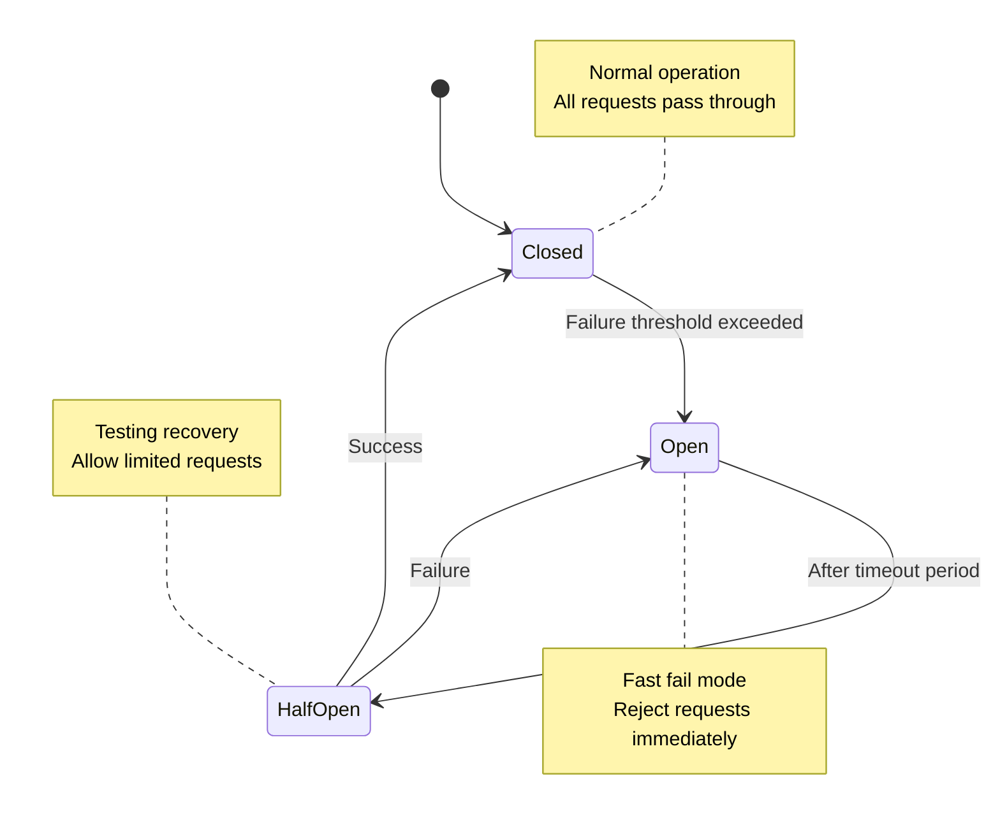

# Circuit Breaker Pattern

!!! abstract "Pattern Overview"
    The Circuit Breaker pattern prevents cascading failures by detecting when a downstream service is failing and temporarily blocking requests to give it time to recover. Like an electrical circuit breaker, it "trips" to protect the system from damage.

**Difficulty:** :material-signal-cellular-2: Intermediate | 
**Reading Time:** :material-clock: 20 min |
**Category:** :material-shield-check: Resilience Pattern |
**Tags:** `resilience` `fault-tolerance` `essential`

## Prerequisites

!!! prerequisite "Before You Begin"
    
    Make sure you understand these fundamental concepts:
    
    - :material-book: [Law 1: Correlated Failure](part1-axioms/law1-failure/index) - Why failures cascade
    - :material-book: [State Management](part2-pillars/state/index) - Tracking system state
    - :material-book: [Timeout Pattern](patterns/timeout) - Basic failure detection
    - :material-alert: [Retry Pattern](patterns/retry-backoff) - Retry strategies

## :material-lightbulb: Core Concept

The Circuit Breaker acts like an electrical circuit breaker:



!!! danger "Real-World Failure: Amazon Prime Day 2018"
    A recommendations service slowdown caused:
    
    - :material-alert: Thread pool exhaustion in upstream services
    - :material-cart-off: Cart service became unresponsive  
    - :material-cash-remove: Checkout failures
    - :material-currency-usd: $72M/hour in lost sales
    
    **Lesson:** Circuit breakers would have failed fast, preserving resources.

## Implementation

=== "Basic Pattern"

    ```python
    class CircuitBreaker:
        def __init__(self, failure_threshold=5, recovery_timeout=60):
            self.failure_threshold = failure_threshold
            self.recovery_timeout = recovery_timeout
            self.failure_count = 0
            self.last_failure_time = None
            self.state = CircuitState.CLOSED
            
        def call(self, func, *args, **kwargs):
            if self.state == CircuitState.OPEN:
                if self._should_attempt_reset():
                    self.state = CircuitState.HALF_OPEN
                else:
                    raise CircuitOpenError()
                    
            try:
                result = func(*args, **kwargs)
                self._on_success()
                return result
            except Exception as e:
                self._on_failure()
                raise e
    ```

=== "Production Ready"

    ```python
    class ProductionCircuitBreaker:
        def __init__(self, config: CircuitConfig):
            self.config = config
            self.metrics = MetricsCollector()
            self.state_store = StateStore()
            
        async def call_async(self, func: Callable) -> Any:
            # Check circuit state with distributed lock
            state = await self.state_store.get_state()
            
            if state == CircuitState.OPEN:
                self.metrics.increment("circuit.open.rejections")
                
                if await self._should_attempt_reset():
                    state = CircuitState.HALF_OPEN
                else:
                    raise CircuitOpenError(
                        "Circuit breaker is OPEN",
                        retry_after=self._get_retry_after()
                    )
            
            # Execute with monitoring
            start_time = time.time()
            try:
                result = await func()
                self._record_success(time.time() - start_time)
                return result
            except Exception as e:
                self._record_failure(e, time.time() - start_time)
                raise
    ```

=== "Spring Boot"

    ```java
    @Component
    public class PaymentService {
        @CircuitBreaker(name = "payment", fallbackMethod = "paymentFallback")
        @Retry(name = "payment")
        @Timeout(name = "payment")
        public PaymentResult processPayment(PaymentRequest request) {
            return externalPaymentAPI.process(request);
        }
        
        public PaymentResult paymentFallback(PaymentRequest request, Exception ex) {
            // Return cached response or queue for later
            return PaymentResult.queued(request.getId());
        }
    }
    ```

## Configuration Guidelines

!!! tip "Production Settings"
    
    === "Service Types"
    
        | Service Type | Failure Threshold | Recovery Timeout | Half-Open Requests |
        |--------------|-------------------|------------------|-------------------|
        | Critical API | 5 failures | 30 seconds | 1 |
        | Background Job | 10 failures | 60 seconds | 3 |
        | Third-party API | 3 failures | 120 seconds | 1 |
        | Internal Service | 5 failures | 45 seconds | 2 |
    
    === "Monitoring"
    
        Key metrics to track:
        
        - :material-chart-line: **State transitions** - When circuits open/close
        - :material-alert-circle: **Rejection rate** - Requests blocked by open circuit
        - :material-clock-fast: **Recovery time** - How long to return to normal
        - :material-gauge: **Success rate** - Health during half-open state

## Common Pitfalls

!!! warning "Implementation Mistakes"
    
    === "Setting Thresholds Too Low"
        
        **Problem:** Normal transient failures trigger circuit breaker
        
        **Solution:** 
        ```python
        # Bad: Too sensitive
        CircuitBreaker(failure_threshold=1)
        
        # Good: Allows for transient failures
        CircuitBreaker(failure_threshold=5)
        ```
    
    === "Not Testing State Transitions"
        
        **Problem:** Circuit gets stuck in OPEN state
        
        **Solution:** Always implement and test recovery logic
        ```python
        def test_circuit_recovery():
            breaker = CircuitBreaker()
            # Force circuit open
            for _ in range(5):
                try:
                    breaker.call(failing_function)
                except:
                    pass
            
            # Wait for recovery timeout
            time.sleep(breaker.recovery_timeout)
            
            # Should attempt reset
            assert breaker.state == CircuitState.HALF_OPEN
        ```
    
    === "Sharing Circuit Breakers"
        
        **Problem:** One failing endpoint affects all endpoints
        
        **Solution:** Separate circuit breakers per endpoint
        ```python
        # Bad: Shared breaker
        breaker = CircuitBreaker()
        breaker.call(api.get_users)
        breaker.call(api.get_orders)  # Affected by user failures!
        
        # Good: Separate breakers
        user_breaker = CircuitBreaker()
        order_breaker = CircuitBreaker()
        ```

## Related Patterns

=== "Complementary Patterns"

    <div class="grid cards" markdown>
    
    - :material-refresh:{ .lg .middle } __[Retry with Backoff](patterns/retry-backoff)__
    
        ---
        
        Works together with circuit breaker for transient failures. Retry handles temporary issues, circuit breaker handles persistent problems.
    
    - :material-ship:{ .lg .middle } __[Bulkhead Pattern](patterns/bulkhead)__
    
        ---
        
        Isolates resources to prevent total system failure. Use with circuit breaker for defense in depth.
    
    - :material-timer-sand:{ .lg .middle } __[Timeout Pattern](patterns/timeout)__
    
        ---
        
        Essential for circuit breaker operation. Timeouts detect slow failures that trigger circuit opening.
    
    - :material-heart-pulse:{ .lg .middle } __[Health Check](patterns/health-check)__
    
        ---
        
        Proactive monitoring complements reactive circuit breaking. Use both for comprehensive fault detection.
    
    </div>

=== "Implementation Examples"

    **Real-world implementations:**
    
    - :material-netflix: **[Netflix Hystrix](case-studies/netflix-hystrix/)** - Original implementation at scale
    - :material-aws: **[AWS API Gateway](case-studies/aws-api-gateway/)** - Built-in circuit breaking
    - :material-microsoft: **[Azure Service Fabric](case-studies/azure-service-fabric/)** - Mesh-level implementation
    - :material-kubernetes: **[Istio Service Mesh](case-studies/istio/)** - Automatic circuit breaking

=== "Alternative Approaches"

    **When circuit breaker might not be suitable:**
    
    - **Rate Limiting** - For protecting against overload rather than failures
    - **Adaptive Concurrency** - Dynamic adjustment based on system load
    - **Load Shedding** - Dropping low-priority requests during high load

## Next Steps

!!! success "Continue Your Learning Journey"
    
    **Beginner Path**
    : Master the basics with hands-on practice
    : - :material-school: [Circuit Breaker Tutorial](tutorials/circuit-breaker-basic/) - Build from scratch
    : - :material-test-tube: [Testing Circuit Breakers](tutorials/circuit-breaker-testing/) - Unit and integration tests
    : - :material-chart-box: [Monitoring Setup](tutorials/circuit-breaker-monitoring/) - Metrics and dashboards
    
    **Intermediate Path**
    : Production-ready implementations
    : - :material-cog: [Advanced Configuration](tutorials/circuit-breaker-config/) - Tuning for your system
    : - :material-lan: [Distributed Circuit Breakers](tutorials/circuit-breaker-distributed/) - Multi-node coordination
    : - :material-integration: [Framework Integration](tutorials/circuit-breaker-frameworks/) - Spring, .NET, etc.
    
    **Advanced Path**
    : Cutting-edge techniques
    : - :material-brain: [ML-Based Circuit Breakers](tutorials/circuit-breaker-ml/) - Predictive failure detection
    : - :material-wave: [Adaptive Thresholds](tutorials/circuit-breaker-adaptive/) - Self-tuning systems
    : - :material-microscope: [Research Papers](references/circuit-breaker-papers/) - Latest academic work

## Key Takeaways

!!! quote "Essential Points"
    
    1. **:material-shield: Fail Fast** - Prevent resource exhaustion by rejecting requests quickly
    2. **:material-sync: Automatic Recovery** - Self-healing through state transitions  
    3. **:material-tune: Proper Configuration** - Thresholds must match your system's behavior
    4. **:material-monitor: Observable State** - Always monitor circuit breaker metrics
    5. **:material-test-tube: Test Everything** - Especially failure scenarios and recovery

## References

??? info "Sources and Further Reading"
    
    **Foundational Works:**
    - Nygard, M. (2007). *Release It!* - Original circuit breaker pattern
    - Fowler, M. (2014). [CircuitBreaker](https://martinfowler.com/bliki/CircuitBreaker.html)
    
    **Implementation Guides:**
    - [Netflix Hystrix Wiki](https://github.com/Netflix/Hystrix/wiki)
    - [Resilience4j Documentation](https://resilience4j.readme.io/)
    - [Polly (.NET) Circuit Breaker](https://github.com/App-vNext/Polly)
    
    **Case Studies:**
    - [Netflix: Fault Tolerance in a High Volume System](https://netflixtechblog.com/fault-tolerance-in-a-high-volume-distributed-system-91ab4faae74a)
    - [Amazon: Timeouts, Retries and Backoff](https://aws.amazon.com/builders-library/timeouts-retries-and-backoff-with-jitter/)

---

<div class="page-nav" markdown>
[:material-arrow-left: Bulkhead Pattern](patterns/bulkhead) | 
[:material-arrow-up: Resilience Patterns](patterns/#resilience-patterns) | 
[:material-arrow-right: Retry Pattern](patterns/retry-backoff)
</div>