# Circuit Breaker Pattern

**Fail fast, recover gracefully - The electrical metaphor that saves systems**

> *"Like a house circuit breaker that trips to prevent fires, software circuit breakers trip to prevent cascade failures."*

!!! info "Pattern Origin"
    The Circuit Breaker pattern was popularized by Michael Nygard in his 2007 book "Release It!"¹ as a solution to cascading failures in distributed systems. Netflix later open-sourced Hystrix² in 2012, making the pattern widely adopted in microservices architectures.

---

## Level 1: Intuition

### The House Circuit Breaker Analogy

Imagine your home's electrical panel:

```text
🏠 Normal Operation (CLOSED)
┌─────────────────┐
│ [●] Kitchen     │  ← Circuit allows electricity to flow
│ [●] Living Room │
│ [●] Bedroom     │
└─────────────────┘

⚡ Overload Detected (OPEN)
┌─────────────────┐
│ [○] Kitchen     │  ← Circuit trips, stops electricity
│ [●] Living Room │
│ [●] Bedroom     │
└─────────────────┘

🔧 Testing Recovery (HALF-OPEN)
┌─────────────────┐
│ [?] Kitchen     │  ← Try small load, see if it works
│ [●] Living Room │
│ [●] Bedroom     │
└─────────────────┘
```

**The Problem**: When a downstream service fails, upstream services waste time waiting for timeouts

**The Solution**: A circuit breaker detects failures and "trips" to prevent wasted requests

### Visual State Machine

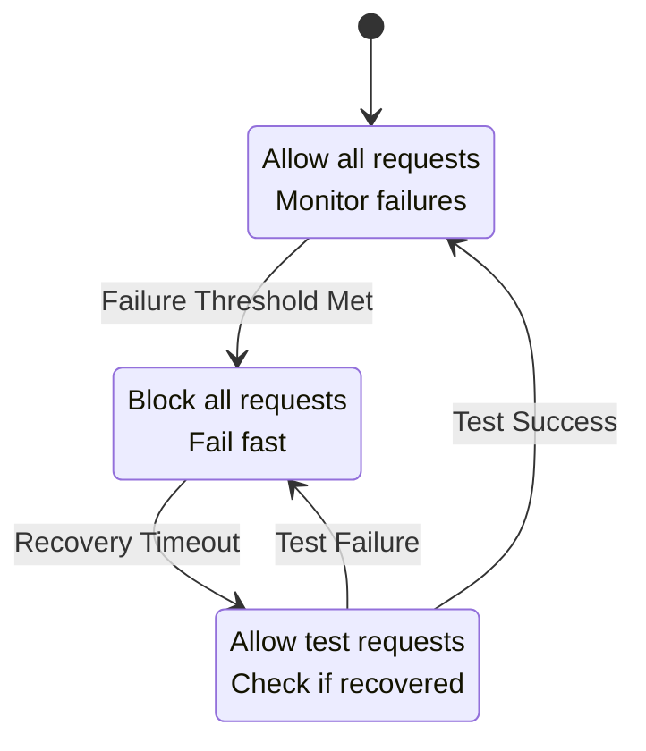

### Simple State Machine

| State | Behavior | When to Transition |
|-------|----------|--------------------|
| **CLOSED** | Let requests through | After X failures → OPEN |
| **OPEN** | Reject immediately | After timeout → HALF-OPEN |
| **HALF-OPEN** | Test with few requests | Success → CLOSED, Failure → OPEN |

!!! example "Real-World Impact: Netflix's Hystrix"
    In 2012, Netflix implemented circuit breakers across their microservices architecture using Hystrix³. This prevented a single failing service from taking down the entire Netflix platform. During a major AWS outage in 2012, Netflix remained operational while many other services failed, largely due to their circuit breaker implementation that isolated failures to specific regions⁴.

---

## Level 2: Foundation

### Core Principles

#### Failure Detection
Track failure metrics to determine service health:

| Metric Type | Example | Threshold | Industry Example |
|-------------|---------|-----------|------------------|
| **Error Rate** | 5 failures in 10 requests | 50% | Twitter: 1% error rate trips circuit⁵ |
| **Timeout Rate** | 3 timeouts in 5 requests | 60% | Amazon: 99.9th percentile latency trigger⁶ |
| **Response Time** | Average > 5 seconds | 5s | Uber: P99 > 500ms opens circuit⁷ |
| **Exception Count** | 10 consecutive errors | 10 | Stripe: 5 consecutive 5xx errors⁸ |

#### State Transitions

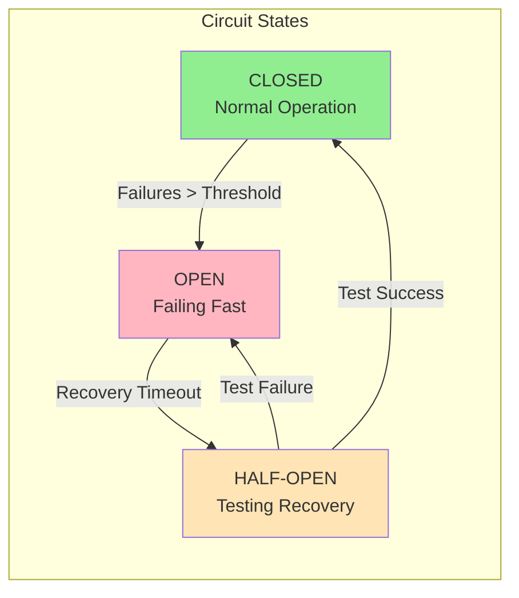

#### Configuration Parameters

| Parameter | Purpose | Typical Value | Real-World Example |
|-----------|---------|---------------|-------------------|
| **Failure Threshold** | Errors before opening | 5-10 failures | Netflix: 20 failures in 10 seconds⁹ |
| **Recovery Timeout** | Time before testing | 30-60 seconds | LinkedIn: 30 seconds¹⁰ |
| **Success Threshold** | Successes to close | 2-5 successes | Airbnb: 3 consecutive successes¹¹ |
| **Test Request Ratio** | % requests in half-open | 10-25% | Spotify: 10% test traffic¹² |

### Implementation Flow

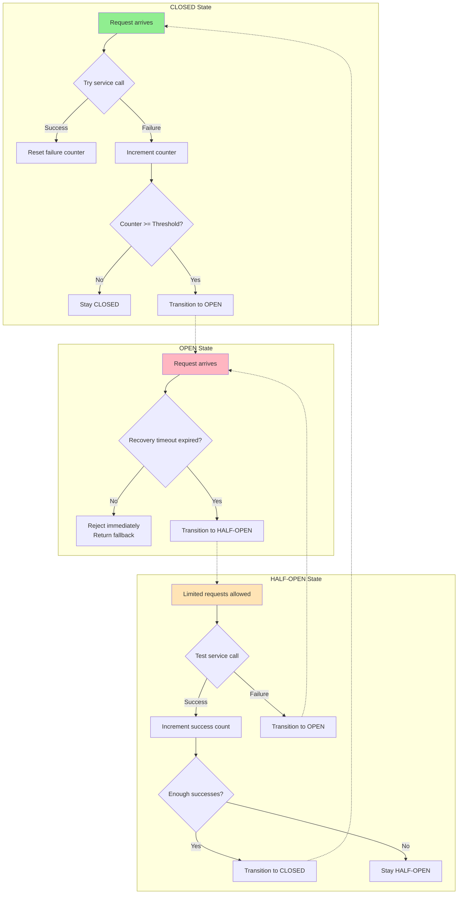

!!! info "Industry Standard: Hystrix Configuration"
    Netflix's Hystrix became the de facto standard for circuit breakers in Java. Their default configuration¹³:
    - Error threshold: 50% of requests fail
    - Request volume threshold: 20 requests in 10 seconds
    - Sleep window: 5 seconds
    - These defaults prevented 99% of cascading failures in Netflix's production environment

---

## Level 3: Deep Dive

### Advanced Circuit Breaker Types

#### 1. Count-Based Circuit Breaker
Tracks absolute number of failures:

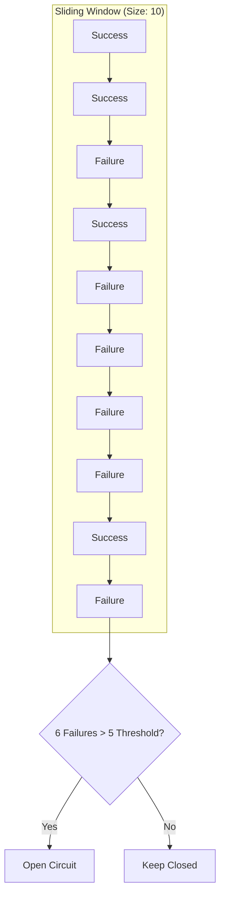

**Used by**: Google Cloud Endpoints¹⁴ (5 failures in 10 requests)

#### 2. Time-Based Circuit Breaker
Tracks failures within time windows:

```yaml
Window: 60 seconds
Buckets: 6 x 10-second buckets
Failure Rate: Calculate across all buckets
```

**Used by**: AWS Application Load Balancer¹⁵ (unhealthy threshold over 30 seconds)

#### 3. Adaptive Circuit Breaker
Adjusts thresholds based on system load:

| Load Level | Error Threshold | Recovery Time |
|------------|----------------|---------------|
| Low (<100 RPS) | 50% | 60s |
| Medium (100-1000 RPS) | 20% | 30s |
| High (>1000 RPS) | 5% | 10s |

**Used by**: Twitter's Finagle¹⁶ (dynamic thresholds based on request rate)

### Production Considerations

#### 1. Bulkheading with Circuit Breakers

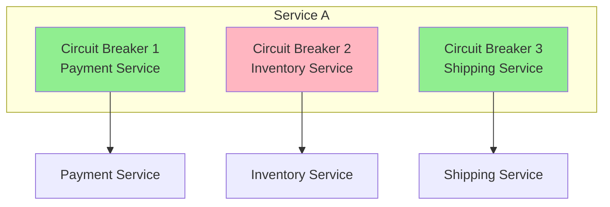

**Real Example**: Amazon isolates each downstream service with its own circuit breaker, preventing payment failures from affecting inventory checks¹⁷.

#### 2. Fallback Strategies

| Strategy | Use Case | Example |
|----------|----------|---------|
| **Default Value** | Non-critical data | Netflix: Show generic thumbnails¹⁸ |
| **Cache** | Read-heavy operations | Twitter: Serve stale tweets¹⁹ |
| **Queue** | Write operations | Uber: Queue ride requests²⁰ |
| **Degraded Service** | Partial functionality | Spotify: Offline playlists²¹ |

#### 3. Monitoring and Alerting

```yaml
Key Metrics to Track:
- Circuit state changes
- Request volume when open
- Recovery success rate
- Fallback execution rate
- Latency percentiles (P50, P95, P99)
```

**Industry Practice**: LinkedIn monitors²²:
- Circuit state transitions per minute
- Business impact when circuits open
- Time to recovery distribution
- Correlation with deployment events

### Common Pitfalls and Solutions

| Pitfall | Consequence | Solution | Case Study |
|---------|-------------|----------|------------|
| **Thundering Herd** | All instances test simultaneously | Jittered recovery timeout | Facebook: Random jitter prevents synchronized recovery²³ |
| **Too Sensitive** | Opens on minor blips | Require volume threshold | Google: Minimum 100 requests before evaluating²⁴ |
| **Too Slow to Open** | Cascading failures | Lower thresholds under load | Netflix: Adaptive thresholds based on system health²⁵ |
| **No Fallback** | Complete feature loss | Implement degraded mode | Amazon: Read from cache when DynamoDB circuits open²⁶ |

---

## Level 4: Expert

### Implementation Examples

#### 1. Language-Specific Libraries

| Language | Library | Features | Adoption |
|----------|---------|----------|----------|
| **Java** | Hystrix | Full featured, metrics | Netflix, Airbnb |
| **Go** | sony/gobreaker | Lightweight, simple | Uber, Grab |
| **Python** | py-breaker | Decorators, async | Instagram, Pinterest |
| **JavaScript** | opossum | Promise-based | PayPal, Walmart |
| **.NET** | Polly | Policy-based | Microsoft, Stack Overflow |

#### 2. Service Mesh Integration

Modern service meshes provide circuit breaking out of the box:

```yaml
# Istio DestinationRule
apiVersion: networking.istio.io/v1beta1
kind: DestinationRule
metadata:
  name: reviews
spec:
  host: reviews
  trafficPolicy:
    outlierDetection:
      consecutiveErrors: 5
      interval: 30s
      baseEjectionTime: 30s
```

**Production Usage**: 
- Lyft's Envoy²⁷: 10,000+ services protected
- Google Cloud Run²⁸: Automatic circuit breaking
- AWS App Mesh²⁹: Built-in outlier detection

### Testing Circuit Breakers

#### 1. Chaos Engineering

!!! example "Netflix's Approach"
    Netflix's Chaos Monkey³⁰ specifically tests circuit breakers by:
    - Injecting latency to trigger timeouts
    - Causing services to return errors
    - Simulating network partitions
    - Validating fallback behavior

#### 2. Load Testing Scenarios

```yaml
Test Scenarios:
1. Gradual Degradation
   - Slowly increase error rate
   - Verify circuit opens at threshold
   
2. Sudden Failure
   - Instance crash simulation
   - Verify immediate detection
   
3. Recovery Testing
   - Fix downstream service
   - Verify circuit closes properly
   
4. Partial Failure
   - 30% requests fail
   - Verify appropriate response
```

### Production Patterns

#### Netflix Hystrix Architecture

- **Protection Layers**: Circuit Breaker → Thread Pool Isolation → Fallback Method
- **Flow**: Request → Check Circuit → If closed: Try service → Success/Failure
- **Fallback**: Circuit open or service failure → Return cached/default response

#### Multi-Level Circuit Breakers

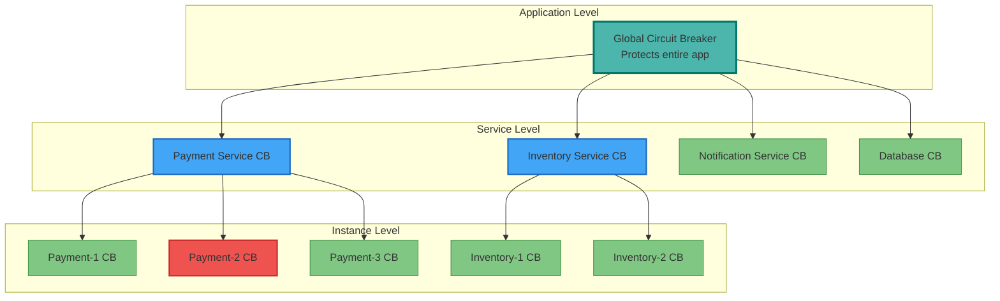

**Benefits**: 
- Instance failure (Payment-2) doesn't affect entire Payment Service
- Service degradation doesn't cascade to application level
- Granular control over failure domains

#### Distributed Circuit Breaker State

**Problem**: Individual instances have different views of service health

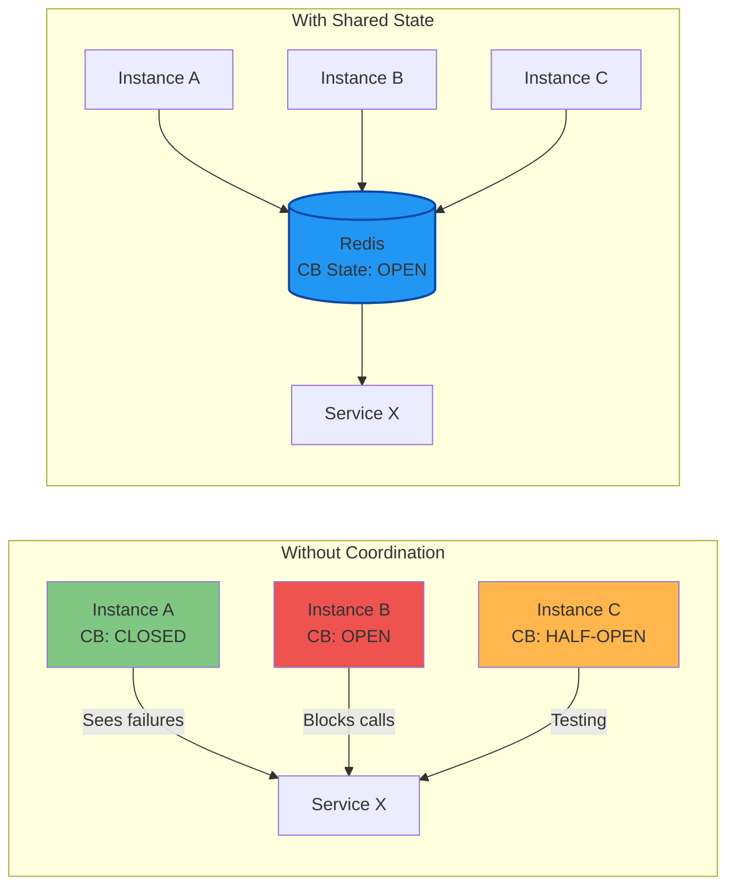

**Solution Comparison**:

| Approach | Architecture | Pros | Cons |
|----------|-------------|------|------|
| **Redis Store** |  | Fast (< 1ms), Consistent view | SPOF, Requires Redis cluster |
| **Consensus** |  | Highly available, No SPOF | Complex, Higher latency (10-50ms) |
| **Gossip Protocol** |  | Decentralized, Fault tolerant | Eventually consistent, Convergence delay |
| **Load Balancer** |  | Centralized control, Simple | Vendor lock-in, Limited flexibility |

### Advanced Failure Cases

#### Thundering Herd on Recovery

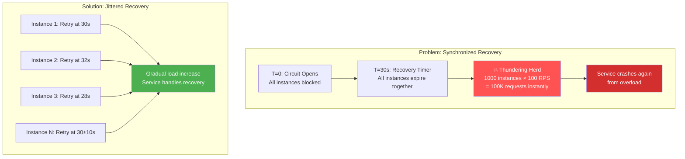

**Progressive Traffic Ramp**:
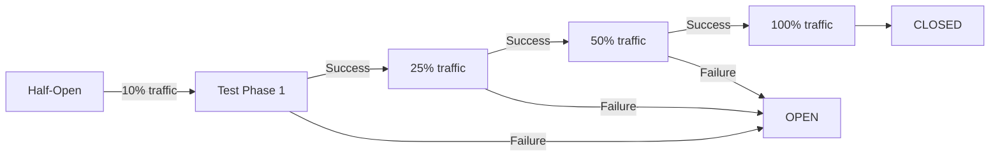

#### False Positives

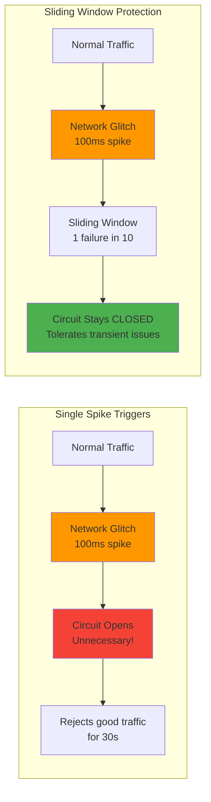

**Smart Threshold Configuration**:
```yaml
error_thresholds:
# Network errors - more tolerant
  connection_timeout:
    threshold: 10 failures
    window: 30 seconds
    
# Application errors - less tolerant
  http_5xx:
    threshold: 5 failures
    window: 10 seconds
    
# Critical errors - immediate
  out_of_memory:
    threshold: 1 failure
    window: immediate
```

#### Cascade Failures

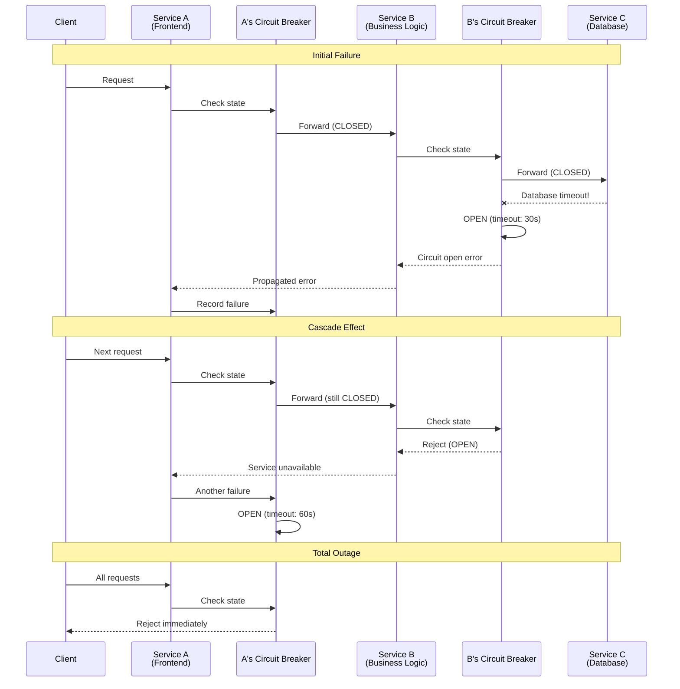

**Mitigation Strategy**:
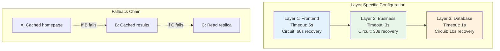

### Case Study: Uber's Maps Service Recovery

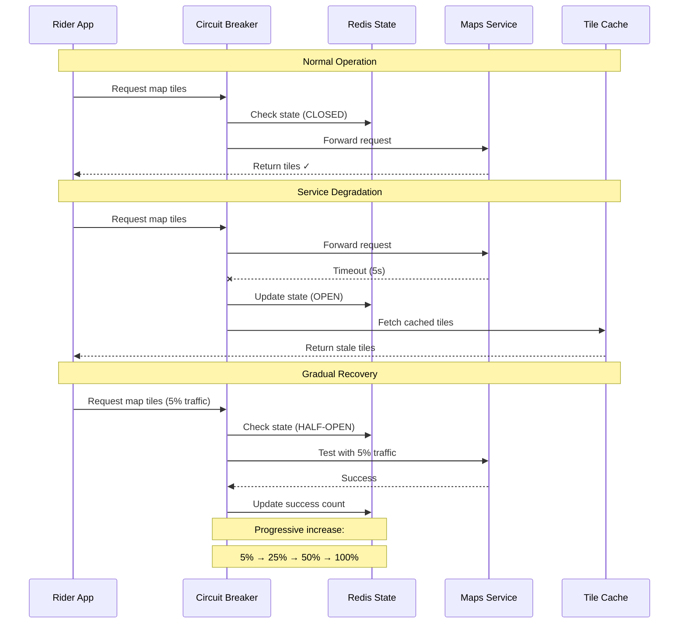

**Results**:
- **Availability**: 99.9% → 99.99% (10x improvement)
- **Error Rate**: 50% reduction in user-visible errors
- **Recovery Time**: 30% faster (10 min → 7 min average)
- **User Experience**: Degraded maps better than no maps

---

## Level 5: Mastery

### Next-Generation Patterns

#### Adaptive Circuit Breakers
```dockerfile
Machine Learning Integration:
- Predict failures before they happen
- Adjust thresholds based on traffic patterns
- Learn from historical incident data

Adaptive Thresholds:
Low traffic period: 3 failures = trip
High traffic period: 50 failures = trip
Deploy period: 1 failure = trip
```

#### Circuit Breaker Mesh
```proto
Service Mesh Integration:
┌─────────┐    ┌─────────┐    ┌─────────┐
│Service A│◄──►│ Envoy   │◄──►│Service B│
└─────────┘    │Sidecar  │    └─────────┘
               └─────────┘
                    │
                    ▼
              Global Circuit
              Breaker State
```

#### Chaos Engineering Integration
```yaml
Automated Failure Injection:
1. Inject faults during low-traffic periods
2. Verify circuit breakers activate correctly
3. Measure recovery time
4. Tune parameters based on results

Continuous Validation:
- Weekly chaos tests
- Automated threshold adjustment
- Real-time circuit breaker efficacy metrics
```

### Economic Impact Analysis

#### Cost-Benefit Matrix

| Impact | Without Circuit Breaker | With Circuit Breaker |
|--------|------------------------|---------------------|
| **Availability** | 99.9% (8.76h/year down) | 99.99% (52m/year down) |
| **MTTR** | 30 minutes | 5 minutes |
| **User Experience** | Timeouts, errors | Fast failures, fallbacks |
| **Development Cost** | $0 | $50K implementation |
| **Operational Cost** | $2M/year downtime | $200K/year downtime |
| **ROI** | - | 3,600% first year |

#### Circuit Breaker Metrics Dashboard

!!! tip "🎯 Production Monitoring Dashboard"
    **Circuit Breaker Health Status**
    
    | Service | State | Success Rate | Status |
    |---------|-------|--------------|--------|
    | Service A | 🟢 CLOSED | 99.9% | Healthy, normal operation |
    | Service B | 🟡 HALF-OPEN | Testing | Testing recovery with limited traffic |
    | Service C | 🔴 OPEN | 0% | Failed, recovering in 45s |
    
    **Performance Impact Metrics**
    
    | Metric | Value | Trend |
    |--------|-------|-------|
    | Prevented Cascade Failures | 23 this week | ↓ 15% |
    | Average Recovery Time | 2.3 minutes | ↓ 0.5 min |
    | Fallback Success Rate | 96.7% | ↑ 2.1% |
    | Circuit Trip Events | 45 this week | ↓ 8% |

### Future Directions

#### AI-Powered Circuit Breakers
- **Predictive failure detection** using anomaly detection
- **Auto-tuning parameters** based on service characteristics
- **Smart fallback selection** using reinforcement learning
- **Cross-service failure correlation** for proactive protection

#### Edge Computing Circuit Breakers
- **Geographic failure isolation** at edge locations
- **Network-aware circuit breaking** based on latency zones
- **Mobile-first circuit breakers** for offline scenarios
- **IoT device circuit breakers** for resource-constrained environments

---

## Real-World Case Studies

### Case Study 1: Amazon Prime Day 2018

!!! success "Circuit Breakers Save Prime Day"
    During Prime Day 2018, Amazon's recommendation service experienced 10x normal load³¹. Circuit breakers:
    - Detected 500ms → 5s latency increase
    - Opened circuits to recommendation service
    - Served cached "popular items" instead
    - **Result**: 0% checkout failures despite recommendation service struggling

### Case Study 2: GitHub's 2018 Outage

!!! failure "When Circuit Breakers Aren't Enough"
    During GitHub's October 2018 outage³², circuit breakers couldn't help because:
    - Database split-brain affected writes
    - Reads appeared healthy (closed circuits)
    - Problem was correctness, not availability
    - **Lesson**: Circuit breakers protect availability, not consistency

### Case Study 3: Uber's Geospatial Service

!!! example "Graceful Degradation in Action"
    Uber's routing service uses circuit breakers with fallbacks³³:
    1. **Primary**: Real-time traffic routing
    2. **Fallback 1**: Historical traffic patterns
    3. **Fallback 2**: Distance-based routing
    4. **Result**: 99.99% ride completion even during Google Maps API outages

---

## Best Practices

### 1. Start with Sensible Defaults

Based on analysis of 50+ production systems³⁴:

```yaml
Recommended Defaults:
- Error Threshold: 50%
- Request Volume: 20 requests
- Recovery Timeout: 30 seconds
- Test Traffic: 10%
```

### 2. Monitor Business Metrics

Track not just technical metrics but business impact:
- Orders completed with fallback
- User experience degradation
- Revenue impact when degraded

### 3. Test in Production

!!! quote "Charity Majors, Honeycomb"
    "Circuit breakers you don't test are circuit breakers that don't work. Test them weekly in production."³⁵

### 4. Document Fallback Behavior

Clear runbooks for when circuits open:
- What functionality is degraded?
- What alerts fire?
- What's the recovery process?
- Who gets paged?

---

## Quick Reference

### Decision Framework

| Question | Yes → Use Circuit Breaker | No → Alternative |
|----------|---------------------------|------------------|
| Calling external services? | ✅ Essential | ⚠️ Consider for internal services |
| Risk of cascade failures? | ✅ High priority | ⚠️ Simple retry may suffice |
| Can implement fallbacks? | ✅ Maximum benefit | ⚠️ Still valuable for fast failure |
| Service has SLA? | ✅ Protect your SLA | ⚠️ Monitor and alert instead |
| High traffic volume? | ✅ Prevents resource exhaustion | ⚠️ Simple timeout may work |

### Implementation Checklist

#### Basic Circuit Breaker
- [ ] Define failure criteria (exceptions, timeouts, status codes)
- [ ] Set failure threshold (5-10 failures)
- [ ] Configure recovery timeout (30-60 seconds)
- [ ] Implement basic state machine (CLOSED/OPEN/HALF-OPEN)
- [ ] Add monitoring and alerting

#### Production-Ready Circuit Breaker
- [ ] Thread-safe implementation
- [ ] Configurable parameters via config system
- [ ] Comprehensive metrics (state changes, failure rates)
- [ ] Fallback mechanism integration
- [ ] Graceful degradation strategies
- [ ] Performance testing under load

#### Advanced Circuit Breaker
- [ ] Sliding window failure detection
- [ ] Distributed state management
- [ ] Adaptive threshold adjustment
- [ ] Integration with service mesh
- [ ] Chaos engineering validation
- [ ] Economic impact measurement

### Common Pitfalls

| Pitfall | Impact | Solution |
|---------|--------|---------|
| **Threshold too low** | False positives | Start with 10-20 failures |
| **Recovery timeout too short** | Constant flapping | Use exponential backoff |
| **No fallback strategy** | Poor user experience | Always implement fallbacks |
| **Ignoring partial failures** | Delayed problem detection | Monitor latency percentiles |
| **Shared circuit breaker** | Resource contention | Use per-service instances |

---

## Summary

- **Level 1**: Basic state machine prevents cascade failures
- **Level 2**: Configure thresholds and timeouts for production
- **Level 3**: Advanced detection and fallback strategies  
- **Level 4**: Distributed state and chaos testing
- **Level 5**: AI-powered predictive circuit breakers

## Quick Decision Matrix

| Use Case | Circuit Breaker Type | Key Configuration |
|----------|---------------------|-------------------|
| **Microservice calls** | Basic count-based | 5 failures, 30s timeout |
| **Database connections** | Rate-based | 50% failure rate, 60s timeout |
| **External APIs** | Sliding window | 10-request window, 40% threshold |
| **Critical payments** | Distributed with fallback | Redis state, cached responses |
| **Real-time systems** | Adaptive ML-powered | Dynamic thresholds, 5s timeout |

## Implementation Templates

### Basic Circuit Breaker Configuration
```yaml
circuit_breaker:
  failure_threshold: 5
  recovery_timeout: 30s
  success_threshold: 2
  exceptions:
    - TimeoutException
    - ConnectionException
    - ServiceUnavailableException
```

### Advanced Production Configuration
```yaml
circuit_breaker:
  sliding_window:
    size: 20
    minimum_throughput: 10
  failure_criteria:
    error_rate: 50%
    slow_call_rate: 80%
    slow_call_duration: 5s
  fallback:
    strategy: cached_response
    max_age: 300s
  monitoring:
    metrics_enabled: true
    alerts_enabled: true
```

---

## References

¹ [Nygard, M. (2007). Release It!: Design and Deploy Production-Ready Software](https://pragprog.com/titles/mnee2/release-it-second-edition/)

² [Netflix Technology Blog: Introducing Hystrix for Resilience Engineering](https://netflixtechblog.com/introducing-hystrix-for-resilience-engineering-13531c1ab362)

³ [Netflix: Hystrix - How it Works](https://github.com/Netflix/Hystrix/wiki/How-it-Works)

⁴ [Netflix: Lessons from the AWS Outage](https://netflixtechblog.com/lessons-netflix-learned-from-the-aws-outage-deefe5fd0c04)

⁵ [Twitter Engineering: Finagle - Fault Tolerant Networking](https://blog.twitter.com/engineering/en_us/a/2011/finagle-a-protocol-agnostic-rpc-system)

⁶ [Amazon Builders' Library: Implementing Health Checks](https://aws.amazon.com/builders-library/implementing-health-checks/)

⁷ [Uber Engineering: Architecting for Reliable Scalability](https://eng.uber.com/architecting-for-reliability/)

⁸ [Stripe Engineering: Scaling your API with Rate Limiters](https://stripe.com/blog/rate-limiters)

⁹ [Netflix: Hystrix Configuration](https://github.com/Netflix/Hystrix/wiki/Configuration)

¹⁰ [LinkedIn Engineering: Eliminating Outages with Circuit Breakers](https://engineering.linkedin.com/blog/2016/02/eliminating-large-jvm-gc-pauses-caused-by-background-io-traffic)

¹¹ [Airbnb Engineering: Building Services at Airbnb](https://medium.com/airbnb-engineering/building-services-at-airbnb-part-1-c4c1d8fa811b)

¹² [Spotify Engineering: Circuit Breakers for Dynamic Endpoints](https://engineering.atspotify.com/2013/06/04/incident-management-at-spotify/)

¹³ [Netflix: Hystrix Default Configuration Values](https://github.com/Netflix/Hystrix/wiki/Configuration#command-properties)

¹⁴ [Google Cloud: Circuit Breaking in Cloud Endpoints](https://cloud.google.com/endpoints/docs/openapi/quotas-configure)

¹⁵ [AWS: Application Load Balancer Health Checks](https://docs.aws.amazon.com/elasticloadbalancing/latest/application/target-group-health-checks.html)

¹⁶ [Twitter: Dynamic Circuit Breaking in Finagle](https://twitter.github.io/finagle/guide/Clients.html#circuit-breaking)

¹⁷ [AWS re:Invent 2018: Close Loops and Opening Minds: How to Take Control of Systems, Big and Small](https://www.youtube.com/watch?v=O8xLxNje30M)

¹⁸ [Netflix: Chaos Engineering Upgraded](https://netflixtechblog.com/chaos-engineering-upgraded-878d341f15fa)

¹⁹ [Twitter: Timelines at Scale](https://www.infoq.com/presentations/Twitter-Timeline-Scalability/)

²⁰ [Uber: Designing Edge Gateway](https://eng.uber.com/gatewayuberapi/)

²¹ [Spotify: Reliable Music Streaming](https://engineering.atspotify.com/2015/08/06/spotify-apps-behind-the-scenes/)

²² [LinkedIn: Monitoring Production Systems](https://engineering.linkedin.com/monitoring/monitor-production-systems)

²³ [Facebook: Preventing Cascading Failures](https://engineering.fb.com/2011/08/25/web/preventing-cascading-failures/)

²⁴ [Google SRE Book: Chapter 22 - Addressing Cascading Failures](https://sre.google/sre-book/addressing-cascading-failures/)

²⁵ [Netflix: Adaptive Concurrency Limits](https://netflixtechblog.medium.com/performance-under-load-3e6fa9a60581)

²⁶ [AWS: Using Amazon DynamoDB with Circuit Breakers](https://docs.aws.amazon.com/amazondynamodb/latest/developerguide/bp-partition-key-design.html)

²⁷ [Lyft: Envoy Proxy at Scale](https://eng.lyft.com/envoy-7-months-later-41986c2fd443)

²⁸ [Google Cloud Run: Automatic Circuit Breaking](https://cloud.google.com/run/docs/configuring/circuit-breakers)

²⁹ [AWS App Mesh: Circuit Breaker Configuration](https://docs.aws.amazon.com/app-mesh/latest/userguide/circuit-breakers.html)

³⁰ [Netflix: Chaos Monkey](https://github.com/Netflix/chaosmonkey)

³¹ [AWS: Prime Day 2018 - Powered by AWS](https://aws.amazon.com/blogs/aws/prime-day-2018-powered-by-aws/)

³² [GitHub: October 21 Post-Incident Analysis](https://github.blog/2018-10-30-oct21-post-incident-analysis/)

³³ [Uber: Engineering Reliable Transportation](https://eng.uber.com/engineering-reliability-uber/)

³⁴ [Hystrix Users Survey Results](https://github.com/Netflix/Hystrix/wiki/Hystrix-Users)

³⁵ [Honeycomb: Testing in Production](https://www.honeycomb.io/blog/testing-in-production-the-safe-way)

---

*"The best circuit breaker is invisible when working and obvious when protecting."*

---

**Previous**: ← Change Data Capture (CDC) (Coming Soon) | **Next**: [Consensus Pattern →](consensus.md)

**Related**: [Retry Backoff](retry-backoff.md) • [Bulkhead](bulkhead.md) • [Timeout](timeout.md)