# Clock Synchronization Pattern

<div class="pattern-type">Coordination Pattern
 Synchronize physical clocks across distributed nodes to maintain a consistent view of time, accounting for drift, network delays, and the fundamental limits of distributed synchronization.
</div>

## Problem Context

!!! warning "🎯 The Challenge"

 Physical clocks in distributed systems face fundamental challenges:
 - **Clock drift**: Even atomic clocks drift ~1 nanosecond/day
 - **Network delays**: Variable and asymmetric
 - **No global time**: Einstein showed simultaneity is relative
 - **Byzantine failures**: Malicious nodes can lie about time
 - **Leap seconds**: Discontinuities in UTC

 Without synchronization, clocks can diverge by seconds per day, breaking time-dependent operations.

## Core Concepts

### Clock Drift Visualization

```mermaid
graph TD
 subgraph "Clock Drift Over Time"
 T0[Time 0<br/>All clocks: 12:00:00]
 T1[After 1 hour<br/>Node A: 12:00:00<br/>Node B: 12:00:03<br/>Node C: 11:59:57]
 T2[After 1 day<br/>Node A: 12:00:00<br/>Node B: 12:01:12<br/>Node C: 11:58:08]
 
 T0 --> T1
 T1 --> T2
 end
 
 subgraph "Drift Rates"
 Q[Quartz: 10⁻⁶<br/>1 sec/day]
 A[Atomic: 10⁻⁹<br/>1 ns/day]
 G[GPS: 10⁻¹³<br/>1 ns/3 years]
 end
```



### Synchronization Bounds

!!! example "Uncertainty Principle"

 Given:
 - **δ**: One-way network delay bound
 - **ε**: Clock drift rate
 - **τ**: Synchronization interval

 **Best possible synchronization**: |C₁(t) - C₂(t)| ≤ δ + ε·τ

 You cannot synchronize better than network uncertainty!

## Synchronization Algorithms

### 1. Cristian's Algorithm


```python
def cristians_algorithm(time_server):
 """Simple time synchronization"""
# Record local time before request
 t0 = get_local_time()
 
# Request time from server
 server_time = request_time_from(time_server)
 
# Record local time after response
 t1 = get_local_time()
 
# Calculate round-trip time
 rtt = t1 - t0
 
# Estimate current time (assuming symmetric delays)
 estimated_time = server_time + rtt / 2
 
# Accuracy bounded by RTT/2
 accuracy = rtt / 2
 
 return estimated_time, accuracy

# Problems:
# - Assumes symmetric network delays
# - Single point of failure
# - No fault tolerance
```

### 2. Berkeley Algorithm


```python
class BerkeleyAlgorithm:
 def __init__(self, nodes):
 self.nodes = nodes
 self.is_master = False
 
 def synchronize_as_master(self):
 """Master coordinates synchronization"""
# 1. Poll all slaves for their time
 times = []
 for node in self.nodes:
 t0 = time.time()
 slave_time = node.get_time()
 t1 = time.time()
 rtt = t1 - t0
 
# Adjust for network delay
 adjusted_time = slave_time + rtt/2
 times.append(adjusted_time)
 
# 2. Add master's time
 times.append(time.time())
 
# 3. Calculate average (excluding outliers)
 avg_time = self.fault_tolerant_average(times)
 
# 4. Send adjustments to all nodes
 for i, node in enumerate(self.nodes):
 adjustment = avg_time - times[i]
 node.adjust_clock(adjustment)
 
 def fault_tolerant_average(self, times):
 """Remove outliers before averaging"""
# Remove times that differ > 3σ from median
 median = statistics.median(times)
 std_dev = statistics.stdev(times)
 
 filtered = [t for t in times 
 if abs(t - median) <= 3 * std_dev]
 
 return sum(filtered) / len(filtered)
```

### 3. Network Time Protocol (NTP)


```python
class NTPClient:
 def __init__(self):
 self.offset_history = []
 self.delay_history = []
 
 def synchronize(self, server):
 """NTP synchronization with server"""
# Record timestamps
 t1 = self.get_time() # Client request time
 
# Send request and get response
 t2, t3 = server.handle_time_request(t1)
 
 t4 = self.get_time() # Client receive time
 
# Calculate offset and delay
# Offset = ((T2-T1) + (T3-T4)) / 2
# Delay = (T4-T1) - (T3-T2)
 
 offset = ((t2 - t1) + (t3 - t4)) / 2
 delay = (t4 - t1) - (t3 - t2)
 
# Sanity checks
 if delay < 0:
 return # Impossible, clock moved backwards
 
# Apply clock filter (keep best 8 samples)
 self.offset_history.append((offset, delay))
 self.offset_history.sort(key=lambda x: x[1]) # Sort by delay
 self.offset_history = self.offset_history[:8]
 
# Use sample with minimum delay
 best_offset = self.offset_history[0][0]
 
# Adjust clock gradually
 self.adjust_clock_rate(best_offset)
```

### 4. Precision Time Protocol (PTP/IEEE 1588)


## Advanced Concepts

### 1. TrueTime (Google Spanner)

```python
class TrueTime:
 """Google's TrueTime API - returns time intervals"""
 
 def now(self):
 """Returns interval [earliest, latest]"""
# GPS and atomic clock references
 gps_time = self.get_gps_time()
 atomic_time = self.get_atomic_time()
 
# Account for uncertainty
 uncertainty = self.calculate_uncertainty()
 
 earliest = min(gps_time, atomic_time) - uncertainty
 latest = max(gps_time, atomic_time) + uncertainty
 
 return TimeInterval(earliest, latest)
 
 def after(self, t):
 """True if t is definitely in the past"""
 return t < self.now().earliest
 
 def before(self, t):
 """True if t is definitely in the future"""
 return t > self.now().latest

class SpannerTransaction:
 def commit(self):
 """Commit with TrueTime guarantees"""
# Get commit timestamp
 commit_ts = TrueTime.now().latest
 
# Wait until timestamp is definitely in past
 while not TrueTime.after(commit_ts):
 time.sleep(0.001) # Wait ~7ms on average
 
# Now safe to commit
 return self.do_commit(commit_ts)
```

### 2. Hybrid Logical Clocks (HLC)

```python
class HybridLogicalClock:
 """Combines physical and logical time"""
 
 def __init__(self):
 self.physical = 0
 self.logical = 0
 
 def tick(self):
 """Local event - advance clock"""
 now = time.time()
 
 if now > self.physical:
 self.physical = now
 self.logical = 0
 else:
 self.logical += 1
 
 return (self.physical, self.logical)
 
 def receive(self, remote_physical, remote_logical):
 """Receive message - update clock"""
 now = time.time()
 
# Take maximum of all physical times
 new_physical = max(now, self.physical, remote_physical)
 
# Calculate logical component
 if new_physical == now and new_physical > max(self.physical, remote_physical):
 new_logical = 0
 elif new_physical == self.physical and new_physical == remote_physical:
 new_logical = max(self.logical, remote_logical) + 1
 elif new_physical == self.physical:
 new_logical = self.logical + 1
 elif new_physical == remote_physical:
 new_logical = remote_logical + 1
 else:
 new_logical = 0
 
 self.physical = new_physical
 self.logical = new_logical
 
 return (self.physical, self.logical)
```

## Clock Synchronization in Practice

### Dealing with Clock Adjustments

```python
class MonotonicClock:
 """Monotonic clock that never goes backwards"""
 
 def __init__(self):
 self.offset = 0
 self.last_time = 0
 
 def adjust_time(self, correction):
 """Safely adjust clock"""
 if correction > 0:
# Jump forward is safe
 self.offset += correction
 else:
# Slow down clock instead of jumping back
 self.slew_rate = correction / 3600 # Spread over 1 hour
 
 def get_time(self):
 """Get monotonic time"""
 raw_time = time.time() + self.offset
 
# Apply slew if needed
 if hasattr(self, 'slew_rate'):
 raw_time += self.slew_rate * time_since_slew_start()
 
# Ensure monotonic
 if raw_time <= self.last_time:
 raw_time = self.last_time + 0.000001
 
 self.last_time = raw_time
 return raw_time
```

### Leap Second Handling

```python
def handle_leap_second(timestamp):
 """Handle positive leap second (23:59:60)"""
# Option 1: Smear (Google's approach)
# Spread leap second over 24 hours
 if is_leap_second_day(timestamp):
# Slow down by 11.6 ppm
 adjustment = (timestamp % 86400) * 0.0000116
 return timestamp - adjustment
 
# Option 2: Step (Traditional)
# Actually have 23:59:60
 if is_leap_second_moment(timestamp):
 return "23:59:60"
 
 return timestamp
```

## Synchronization Accuracy

<table class="responsive-table">
<thead>
<tr>
<th>Method</th>
<th>Typical Accuracy</th>
<th>Best Case</th>
<th>Requirements</th>
</tr>
</thead>
<tbody>
<tr>
<td data-label="Method"><strong>NTP (Internet)</strong></td>
<td data-label="Typical Accuracy">1-50 ms</td>
<td data-label="Best Case">1 ms</td>
<td data-label="Requirements">Public servers</td>
</tr>
<tr>
<td data-label="Method"><strong>NTP (LAN)</strong></td>
<td data-label="Typical Accuracy">0.1-1 ms</td>
<td data-label="Best Case">10 μs</td>
<td data-label="Requirements">Local server</td>
</tr>
<tr>
<td data-label="Method"><strong>PTP</strong></td>
<td data-label="Typical Accuracy">1-100 μs</td>
<td data-label="Best Case">10 ns</td>
<td data-label="Requirements">Hardware support</td>
</tr>
<tr>
<td data-label="Method"><strong>GPS</strong></td>
<td data-label="Typical Accuracy">100 ns</td>
<td data-label="Best Case">10 ns</td>
<td data-label="Requirements">GPS receiver</td>
</tr>
<tr>
<td data-label="Method"><strong>Atomic Clock</strong></td>
<td data-label="Typical Accuracy">10 ns</td>
<td data-label="Best Case">1 ns</td>
<td data-label="Requirements">Local atomic clock</td>
</tr>
</tbody>
</table>

## Common Pitfalls

### 1. Virtual Machine Clock Drift

!!! danger "⚠️ VM Time Warp"
 **Problem**: VMs can pause, causing massive clock jumps
 **Symptom**: Sudden 30-second time jumps
 **Solution**:
 - Use VM-aware time sync
 - Monitor for clock jumps
 - Implement monotonic clocks

### 2. Asymmetric Network Delays


## Best Practices

!!! info "🎯 Clock Synchronization Guidelines"
 1. **Use UTC everywhere**: Never use local time
 2. **Monitor clock drift**: Alert on excessive drift
 3. **Handle failures gracefully**: Fallback to logical clocks
 4. **Test time jumps**: Simulate clock adjustments
 5. **Use monotonic clocks**: For measuring intervals
 6. **Document precision needs**: Not everyone needs microseconds
 7. **Consider time zones**: Store UTC, display local

## When to Use Physical vs Logical Clocks

<table class="responsive-table">
<thead>
<tr>
<th>Use Case</th>
<th>Physical Clocks</th>
<th>Logical Clocks</th>
</tr>
</thead>
<tbody>
<tr>
<td data-label="Use Case"><strong>Log correlation</strong></td>
<td data-label="Physical Clocks">✓ (with NTP)</td>
<td data-label="Logical Clocks">✗</td>
</tr>
<tr>
<td data-label="Use Case"><strong>Distributed transactions</strong></td>
<td data-label="Physical Clocks">✓ (TrueTime)</td>
<td data-label="Logical Clocks">✓ (Vector clocks)</td>
</tr>
<tr>
<td data-label="Use Case"><strong>Cache expiry</strong></td>
<td data-label="Physical Clocks">✓</td>
<td data-label="Logical Clocks">✗</td>
</tr>
<tr>
<td data-label="Use Case"><strong>Event ordering</strong></td>
<td data-label="Physical Clocks">~ (accuracy limited)</td>
<td data-label="Logical Clocks">✓</td>
</tr>
<tr>
<td data-label="Use Case"><strong>Billing/SLA</strong></td>
<td data-label="Physical Clocks">✓</td>
<td data-label="Logical Clocks">✗</td>
</tr>
</tbody>
</table>

## Implementation Checklist

- [ ] Choose synchronization protocol (NTP, PTP, custom)
- [ ] Set up time servers (stratum hierarchy)
- [ ] Implement clock adjustment logic
- [ ] Add monotonic clock support
- [ ] Handle leap seconds
- [ ] Monitor synchronization quality
- [ ] Test failure scenarios
- [ ] Document accuracy requirements
- [ ] Implement fallback mechanisms

## Related Patterns

- [Logical Clocks](logical-clocks.md) - Ordering without wall time
- [Vector Clocks](vector-clocks.md) - Capturing causality
- [Hybrid Logical Clocks](hlc.md) - Best of both worlds
- [Event Sourcing](event-sourcing.md) - Time-based event streams

## References

- "Time, Clocks, and the Ordering of Events" - Lamport
- "Internet Time Synchronization: NTP" - Mills
- "Spanner: Google's Globally Distributed Database" - Corbett et al.
- "Logical Physical Clocks" - Kulkarni et al.