# Consensus Pattern

**Agreement in a world of unreliable networks and failing nodes**

> *"Consensus is impossibly hard in theory, merely very hard in practice."*

---

## Level 1: Intuition

### The Jury Deliberation Analogy

Consensus is like a jury reaching a verdict:
- **Unanimous decision**: All jurors must agree
- **Majority rule**: More than half must agree
- **Discussion rounds**: Multiple rounds of voting
- **No changing minds**: Once decided, verdict stands

The challenge: What if some jurors leave mid-deliberation?

### Basic Consensus Concepts


### Consensus Data Flow


---

## Level 2: Foundation

### Consensus Properties

<div class="responsive-table" markdown>

| Property | Description | Why It Matters |
|----------|-------------|----------------|
| **Agreement** | All nodes decide same value | Consistency |
| **Validity** | Decided value was proposed | No arbitrary decisions |
| **Termination** | Eventually decides | Progress guarantee |
| **Integrity** | Decide at most once | No flip-flopping |

</div>


### Implementing Basic Paxos


### Paxos State Machine


### Paxos Safety Properties

<div class="responsive-table" markdown>

| Property | Description | How Paxos Ensures |
|----------|-------------|-------------------|
| **Single Value** | Only one value chosen | Majority quorum overlap |
| **Stability** | Chosen value never changes | Monotonic proposal numbers |
| **Validity** | Chosen value was proposed | Phase 2 uses Phase 1 results |
| **Agreement** | All learn same value | Quorum intersection |

</div>


### Multi-Paxos for Log Replication


### Multi-Paxos Log Structure


## Interactive Decision Support Tools

### Consensus Algorithm Decision Tree


### Consensus Trade-off Calculator

<div class="responsive-table" markdown>

| Factor | Raft | Multi-Paxos | PBFT | Your Priority (1-10) |
|--------|------|-------------|------|---------------------|
| **Understandability** | ✅ Simple | 🟡 Complex | 🔴 Very Complex | ___ |
| **Leader Efficiency** | ✅ High | ✅ High | 🟡 Medium | ___ |
| **Byzantine Tolerance** | ❌ None | ❌ None | ✅ Full | ___ |
| **Message Complexity** | ✅ O(n) | ✅ O(n) | 🔴 O(n²) | ___ |
| **Latency (stable)** | ✅ 1 RTT | ✅ 1 RTT | 🟡 2 RTT | ___ |
| **Partition Handling** | ✅ Good | ✅ Good | 🟡 Complex | ___ |
| **Implementation** | ✅ Many | 🟡 Some | 🔴 Few | ___ |

</div>


**Decision Score:**
- Raft Score = Understandability×3 + Implementation×2 + Efficiency×2
- Paxos Score = Robustness×3 + Flexibility×2 + History×1
- PBFT Score = Byzantine×5 + Security×3 - Complexity×2

### Leader Election Strategy Selector


### Consensus Performance Estimator

<div class="responsive-table" markdown>

| Parameter | Value | Impact |
|-----------|-------|--------|
| **Cluster Size** | | |
| Number of Nodes (n) | ___ | Quorum = ⌊n/2⌋ + 1 |
| Geographic Distribution | ___ ms RTT | Direct latency impact |
| **Workload** | | |
| Write Rate | ___ ops/sec | Leader CPU bound |
| Message Size | ___ KB | Network bandwidth |
| **Failure Tolerance** | | |
| Nodes Can Fail (f) | ___ | Need n = 2f + 1 nodes |
| Byzantine Failures | Yes/No | Need n = 3f + 1 nodes |

</div>


**Performance Formulas:**
```
Raft/Paxos:
- Commit Latency = 1.5 × RTT (stable leader)
- Throughput ≈ Leader_CPU / (Message_Size × Replication_Factor)
- Election Time = Election_Timeout + RTT

PBFT:
- Commit Latency = 3 × RTT (3-phase protocol)
- Message Complexity = O(n²) per operation
- Throughput ≈ Network_Bandwidth / (n² × Message_Size)
```

### 🎴 Quick Reference Cards

#### Consensus Algorithm Cheat Sheet

<div style="border: 2px solid #5448C8; border-radius: 8px; padding: 16px; margin: 16px 0; background: #f8f9fa;">

**RAFT** ✅
- Best for: New implementations
- Pros: Simple, well-documented
- Cons: No Byzantine tolerance
- Use when: Trusted environment

**MULTI-PAXOS** ✅
- Best for: Proven systems
- Pros: Battle-tested, flexible
- Cons: Complex to implement
- Use when: Need customization

**PBFT** ✅
- Best for: Untrusted networks
- Pros: Byzantine fault tolerant
- Cons: High message overhead
- Use when: Security critical

**VIEWSTAMPED REPLICATION** ✅
- Best for: Academic study
- Pros: Original ideas
- Cons: Less tooling
- Use when: Research focus

</div>

#### Implementation Checklist

<div style="border: 2px solid #059669; border-radius: 8px; padding: 16px; margin: 16px 0; background: #f0fdf4;">

**Before Implementing Consensus:**
- [ ] Determined failure model (crash vs Byzantine)
- [ ] Calculated required cluster size
- [ ] Designed leader election timeout strategy
- [ ] Planned network partition handling
- [ ] Created state machine abstraction
- [ ] Implemented persistent storage for logs
- [ ] Designed monitoring and observability
- [ ] Tested with network fault injection
- [ ] Documented operational procedures

</div>

#### Common Pitfalls

<div style="border: 2px solid #dc2626; border-radius: 8px; padding: 16px; margin: 16px 0; background: #fef2f2;">

**⚠️ Avoid These Mistakes:**
1. **Split Brain** - Multiple leaders due to partition
2. **Lost Updates** - Not persisting before acknowledging
3. **Livelock** - Continuous failed elections
4. **Unbounded Logs** - No log compaction strategy
5. **Clock Dependency** - Using wall clocks for ordering
6. **Single Leader** - No automatic failover

</div>

---

## Level 3: Deep Dive

### Raft Consensus Algorithm

```mermaid
stateDiagram-v2
    [*] --> Follower: Start
    
    Follower --> Candidate: Election timeout<br/>(no heartbeat)
    
    Candidate --> Leader: Receive<br/>majority votes
    Candidate --> Follower: Discover current leader<br/>or higher term
    Candidate --> Candidate: Split vote<br/>(restart election)
    
    Leader --> Follower: Discover server<br/>with higher term
    
    note right of Follower
        • Respond to RPCs
        • Convert to candidate if timeout
        • Reset timer on heartbeat
    end note
    
    note right of Candidate
        • Increment current term
        • Vote for self
        • Request votes from others
        • Become leader if majority
    end note
    
    note right of Leader
        • Send heartbeats
        • Replicate log entries
        • Respond to clients
    end note
```



### Raft Leader Election Process


### Raft Log Replication

```mermaid
graph TB
    subgraph "Leader (Term 3)"
        LL[Log Entries]
        L1[1: x←3 | term:1]
        L2[2: y←9 | term:1]
        L3[3: x←2 | term:3]
        L4[4: x←7 | term:3]
        CI1[commit_index: 3]
        
        L1 --> L2 --> L3 --> L4
        L3 -.->|committed| CI1
    end
    
    subgraph "Follower 1"
        F1L[Log Entries]
        F1_1[1: x←3 | term:1]
        F1_2[2: y←9 | term:1]
        F1_3[3: x←2 | term:3]
        CI2[commit_index: 3]
        
        F1_1 --> F1_2 --> F1_3
        F1_3 -.->|committed| CI2
    end
    
    subgraph "Follower 2 (lagging)"
        F2L[Log Entries]
        F2_1[1: x←3 | term:1]
        F2_2[2: y←9 | term:1]
        CI3[commit_index: 2]
        
        F2_1 --> F2_2
        F2_2 -.->|committed| CI3
    end
    
    Leader -->|AppendEntries| Follower1
    Leader -->|AppendEntries| Follower2
    
    Note1[Leader replicates<br/>entries to followers]
    Note2[Entries committed when<br/>replicated to majority]
    
    style L3 fill:#10b981,stroke:#059669
    style L4 fill:#fbbf24,stroke:#f59e0b
    style F1_3 fill:#10b981,stroke:#059669
```

### Raft Timing Parameters

<div class="responsive-table" markdown>

| Parameter | Typical Value | Purpose |
|-----------|---------------|---------|
| **Heartbeat Interval** | 50-150ms | Maintain leadership |
| **Election Timeout** | 150-300ms | Trigger new election |
| **Random Range** | ±150ms | Prevent split votes |
| **RPC Timeout** | 10-50ms | Network communication |

</div>


### Byzantine Fault Tolerant Consensus


### Byzantine Fault Tolerance Comparison

<div class="responsive-table" markdown>

| Aspect | Crash Fault Tolerance | Byzantine Fault Tolerance |
|--------|----------------------|---------------------------|
| **Fault Model** | Nodes crash/stop | Nodes can lie/act maliciously |
| **Nodes Required** | 2f + 1 | 3f + 1 |
| **Communication Rounds** | 2 (typically) | 3 (minimum) |
| **Message Complexity** | O(n) | O(n²) |
| **Use Cases** | Internal systems | Open/untrusted networks |

</div>


### Consensus Anti-Patterns


### Consensus Performance Tuning


### Consensus Debugging Guide

<div class="responsive-table" markdown>

| Symptom | Possible Causes | Debugging Steps |
|---------|----------------|----------------|
| **No leader elected** | Network partition<br/>All nodes down<br/>Configuration error | Check connectivity<br/>Verify quorum size<br/>Review logs |
| **Frequent elections** | Unstable network<br/>Leader overloaded<br/>Short timeouts | Monitor latency<br/>Check CPU/memory<br/>Increase timeouts |
| **Split brain** | Network partition<br/>Clock skew<br/>Bug in implementation | Verify quorum overlap<br/>Check NTP sync<br/>Review vote counting |
| **Performance degradation** | Large proposals<br/>Disk bottleneck<br/>Network congestion | Profile message size<br/>Monitor disk I/O<br/>Check bandwidth |

</div>


---

## Level 4: Expert

### Production Consensus Systems

#### etcd's Raft Implementation


### etcd Operation Flow


### etcd Performance Characteristics

<div class="responsive-table" markdown>

| Metric | Value | Description |
|--------|-------|-------------|
| **Write Throughput** | 10k writes/sec | Sequential writes |
| **Latency (3-node)** | 2-5ms | Single datacenter |
| **Latency (5-node)** | 5-20ms | Cross-region |
| **Snapshot Size** | 8GB max | Recommended limit |
| **Client Connections** | 10k+ | Per node |

</div>


### Consensus Monitoring Dashboard

```mermaid
graph TB
    subgraph "Key Metrics to Monitor"
        subgraph "Health Indicators"
            H1[Leader Elections/min<br/>Target: < 0.1]
            H2[Proposal Latency P99<br/>Target: < 50ms]
            H3[Follower Lag<br/>Target: < 100 entries]
            H4[Disk Usage<br/>Target: < 80%]
        end
        
        subgraph "Performance Metrics"
            P1[Proposals/sec]
            P2[Commits/sec]
            P3[Network RTT]
            P4[Queue Depth]
        end
        
        subgraph "Error Tracking"
            E1[Failed Proposals]
            E2[Network Timeouts]
            E3[Disk Errors]
            E4[Snapshot Failures]
        end
    end
    
    subgraph "Alert Thresholds"
        A1[🔴 No leader > 30s]
        A2[🟡 Elections > 1/min]
        A3[🟡 Latency > 100ms]
        A4[🔴 Split brain detected]
    end
    
    H1 --> A2
    H2 --> A3
    
    style A1 fill:#ef4444,stroke:#dc2626
    style A4 fill:#ef4444,stroke:#dc2626
    style A2 fill:#fbbf24,stroke:#f59e0b
    style A3 fill:#fbbf24,stroke:#f59e0b
```


#### Google's Spanner Consensus


### Spanner Transaction Flow with TrueTime

```mermaid
sequenceDiagram
    participant Client
    participant Coord as Coordinator
    participant TT as TrueTime
    participant PG1 as Paxos Group 1
    participant PG2 as Paxos Group 2
    
    Client->>Coord: Begin Transaction
    
    rect rgb(240, 240, 255)
        Note over Coord,PG2: Read Phase
        Coord->>PG1: Read at timestamp
        Coord->>PG2: Read at timestamp
        PG1-->>Coord: Data + read timestamp
        PG2-->>Coord: Data + read timestamp
    end
    
    rect rgb(240, 255, 240)
        Note over Coord,PG2: Commit Phase
        Coord->>TT: now()
        TT-->>Coord: [earliest, latest]
        
        Note over Coord: Pick commit_ts = latest
        
        Coord->>PG1: 2PC Prepare(commit_ts)
        Coord->>PG2: 2PC Prepare(commit_ts)
        
        PG1->>PG1: Paxos: Agree on prepare
        PG2->>PG2: Paxos: Agree on prepare
        
        PG1-->>Coord: Prepared
        PG2-->>Coord: Prepared
        
        Coord->>TT: wait_until_safe(commit_ts)
        Note over TT: Wait for commit_ts < TT.now().earliest
        
        Coord->>PG1: 2PC Commit
        Coord->>PG2: 2PC Commit
    end
    
    Coord-->>Client: Committed at commit_ts
```

### TrueTime Guarantees

<div class="responsive-table" markdown>

| Property | Guarantee | Implementation |
|----------|-----------|----------------|
| **Clock Uncertainty** | ±7ms (worst case) | GPS + atomic clocks |
| **External Consistency** | Serializable globally | Wait for uncertainty |
| **Timestamp Ordering** | Total order | TrueTime intervals |
| **Causality** | Preserved | Commit wait |

</div>

### Real-World Case Study: CockroachDB Consensus

```mermaid
graph TB
    subgraph "CockroachDB Architecture"
        subgraph "SQL Layer"
            SQLParser[SQL Parser]
            Optimizer[Query Optimizer]
            DistSQL[Distributed SQL]
        end
        
        subgraph "Transaction Layer"
            TxnCoord[Transaction Coordinator]
            HLC[Hybrid Logical Clock]
            IntentResolver[Intent Resolver]
        end
        
        subgraph "Distribution Layer"
            RangeCache[Range Cache]
            LeaseHolder[Lease Holder]
            
            subgraph "Range 1 [a-m]"
                R1L[Leader]
                R1F1[Follower]
                R1F2[Follower]
            end
            
            subgraph "Range 2 [n-z]"
                R2L[Leader]
                R2F1[Follower]
                R2F2[Follower]
            end
        end
        
        subgraph "Storage Layer"
            RocksDB1[RocksDB]
            RocksDB2[RocksDB]
            RocksDB3[RocksDB]
        end
    end
    
    SQLParser --> Optimizer
    Optimizer --> DistSQL
    DistSQL --> TxnCoord
    TxnCoord --> RangeCache
    RangeCache --> LeaseHolder
    LeaseHolder --> R1L
    LeaseHolder --> R2L
    
    R1L --> RocksDB1
    R2L --> RocksDB2
    
    style R1L fill:#10b981,stroke:#059669,stroke-width:3px
    style R2L fill:#10b981,stroke:#059669,stroke-width:3px
```

### CockroachDB Read/Write Flow

```mermaid
sequenceDiagram
    participant Client
    participant Gateway as Gateway Node
    participant LH as Leaseholder
    participant Raft as Raft Group
    participant F1 as Follower 1
    participant F2 as Follower 2
    
    rect rgb(240, 255, 240)
        Note over Client,F2: Fast Read Path (with lease)
        Client->>Gateway: SELECT * FROM users WHERE id=123
        Gateway->>Gateway: Lookup range for key
        Gateway->>LH: Read request
        LH->>LH: Check lease validity
        LH->>LH: Read from local storage
        LH-->>Gateway: Data
        Gateway-->>Client: Result
    end
    
    rect rgb(240, 240, 255)
        Note over Client,F2: Write Path (consensus required)
        Client->>Gateway: UPDATE users SET name='Alice' WHERE id=123
        Gateway->>LH: Write request
        LH->>LH: Create write intent
        LH->>Raft: Propose entry
        
        Raft->>F1: AppendEntries
        Raft->>F2: AppendEntries
        
        F1-->>Raft: Success
        F2-->>Raft: Success
        
        Note over Raft: Quorum achieved
        
        Raft->>LH: Committed
        LH->>LH: Apply to storage
        LH->>LH: Resolve intent
        
        LH-->>Gateway: Success
        Gateway-->>Client: OK
    end
```

### CockroachDB Key Features

<div class="responsive-table" markdown>

| Feature | Implementation | Benefit |
|---------|----------------|----------|  
| **Multi-Raft** | One Raft group per range | Fine-grained replication |
| **Range Splits** | Automatic at 512MB | Load distribution |
| **Lease Holder** | Read without consensus | Low latency reads |
| **HLC Timestamps** | Hybrid logical clocks | Causality tracking |
| **Parallel Commits** | Write intents + async resolve | Higher throughput |

</div>

---

## Level 5: Mastery

### Theoretical Foundations

#### FLP Impossibility and Practical Solutions

```mermaid
graph TB
    subgraph "FLP Impossibility Result"
        FLP["No deterministic consensus in<br/>asynchronous systems with<br/>one faulty process"]
        
        Problem1[Cannot distinguish<br/>slow from failed]
        Problem2[No global clock]
        Problem3[Unbounded delays]
        
        FLP --> Problem1
        FLP --> Problem2
        FLP --> Problem3
    end
    
    subgraph "Practical Solutions"
        Sol1[Partial Synchrony<br/>Assume eventual delivery]
        Sol2[Randomization<br/>Probabilistic termination]
        Sol3[Failure Detectors<br/>Unreliable but useful]
        
        Problem1 --> Sol1
        Problem2 --> Sol2
        Problem3 --> Sol3
    end
    
    subgraph "Real Systems"
        Paxos[Paxos<br/>Uses timeouts]
        Raft[Raft<br/>Randomized timeouts]
        PBFT[PBFT<br/>View changes]
        
        Sol1 --> Paxos
        Sol2 --> Raft
        Sol3 --> PBFT
    end
    
    style FLP fill:#ef4444,stroke:#dc2626,stroke-width:3px
    style Sol1 fill:#10b981,stroke:#059669
    style Sol2 fill:#10b981,stroke:#059669
    style Sol3 fill:#10b981,stroke:#059669
```

### Consensus Theoretical Bounds

<div class="responsive-table" markdown>

| Property | Lower Bound | Achieved By | Conditions |
|----------|-------------|-------------|------------|
| **Message Rounds** | 2 | Fast Paxos | No conflicts |
| **Messages** | O(n) | Raft (leader) | Stable leader |
| **Fault Tolerance** | n > 2f | Paxos/Raft | Crash faults |
| **Byzantine Tolerance** | n > 3f | PBFT | Byzantine faults |

</div>


```mermaid
graph LR
    subgraph "Fault Tolerance Requirements"
        subgraph "Crash Faults (2f+1)"
            N5[5 nodes]
            F2[Tolerates 2 failures]
            N5 --> F2
        end
        
        subgraph "Byzantine Faults (3f+1)"
            N7[7 nodes]
            BF2[Tolerates 2 Byzantine]
            N7 --> BF2
        end
    end
    
    Note1[Crash: Nodes stop]  
    Note2[Byzantine: Nodes lie]
    
    Note1 -.-> N5
    Note2 -.-> N7
```
#### Optimal Consensus Protocols

```mermaid
graph TB
    subgraph "Advanced Consensus Variants"
        VP[Vertical Paxos]
        SP[Speculative Paxos]
        EP[EPaxos]
        
        VP_Desc["Reconfigure membership<br/>during consensus"]
        SP_Desc["Execute optimistically<br/>rollback if needed"]
        EP_Desc["No leader<br/>optimal latency"]
        
        VP --> VP_Desc
        SP --> SP_Desc
        EP --> EP_Desc
    end
    
    subgraph "Performance Comparison"
        Metric[Latency]
        
        Classic[Classic Paxos: 2 RTT]
        FastP[Fast Paxos: 1.5 RTT]
        EPaxosL[EPaxos: 1 RTT]
        
        Metric --> Classic
        Metric --> FastP
        Metric --> EPaxosL
    end
    
    subgraph "Trade-offs"
        T1[Complexity]
        T2[Conflict Resolution]
        T3[Message Count]
        
        Note3[EPaxos: Most complex]
        Note4[Fast Paxos: Conflict rollback]
        Note5[Vertical: Reconfiguration overhead]
    end
    
    style EP fill:#10b981,stroke:#059669,stroke-width:3px
    style EPaxosL fill:#10b981,stroke:#059669,stroke-width:3px
```

### Future Directions

1. **Quantum Consensus**: Using quantum entanglement for instant agreement
2. **ML-Optimized Consensus**: Learning optimal timeouts and parameters
3. **Blockchain Consensus**: Proof-of-stake and other mechanisms
4. **Edge Consensus**: Consensus in disconnected edge environments

---

### Consensus in Cloud Providers

```mermaid
graph TB
    subgraph "AWS"
        DDB[DynamoDB<br/>Multi-Paxos]
        ECS[ECS<br/>Raft for coordination]
        Route53[Route 53<br/>Consensus for DNS]
    end
    
    subgraph "Google Cloud"
        Spanner[Spanner<br/>Paxos + TrueTime]
        Chubby[Chubby<br/>Paxos]
        GKE[GKE<br/>etcd/Raft]
    end
    
    subgraph "Azure"
        Cosmos[Cosmos DB<br/>Multiple protocols]
        SF[Service Fabric<br/>Paxos]
        AKS[AKS<br/>etcd/Raft]
    end
    
    style DDB fill:#ff9900,stroke:#c77800
    style Spanner fill:#4285f4,stroke:#1967d2
    style Cosmos fill:#0078d4,stroke:#106ebe
```

### Consensus Protocol Evolution

```mermaid
gantt
    title Evolution of Consensus Protocols
    dateFormat YYYY
    axisFormat %Y
    
    section Classical
    Paxos (Lamport)          :1989, 2001
    Viewstamped Replication  :1988, 1990
    
    section Practical
    Multi-Paxos             :2001, 2010
    Zab (ZooKeeper)         :2008, 2024
    Raft                    :2014, 2024
    
    section Byzantine
    PBFT                    :1999, 2010
    Tendermint              :2014, 2024
    HotStuff                :2019, 2024
    
    section Modern
    EPaxos                  :2013, 2020
    Flexible Paxos          :2016, 2024
    Compartmentalized Paxos :2020, 2024
```

### Consensus Cost Analysis

<div class="responsive-table" markdown>

| Scale | Protocol | Nodes | Message Complexity | Latency | Cost/Month |
|-------|----------|-------|-------------------|---------|------------|
| **Small** | Raft | 3 | O(n) | 5-10ms | ~$300 |
| **Medium** | Multi-Paxos | 5 | O(n) | 10-20ms | ~$1,000 |
| **Large** | Hierarchical | 9 | O(log n) | 20-50ms | ~$3,000 |
| **Global** | Spanner-like | 15+ | O(n²) | 50-200ms | ~$10,000+ |

</div>


## Quick Reference

### Consensus Algorithm Selection

<div class="responsive-table" markdown>

| Scenario | Algorithm | Why |
|----------|-----------|-----|
| Key-value store | Raft | Simple, understandable |
| Financial system | PBFT | Byzantine fault tolerance |
| Geo-distributed | Multi-Paxos | Flexible, proven |
| High throughput | EPaxos | Optimal latency |
| Blockchain | PoS/PoW | Permissionless |

</div>


### Implementation Checklist

- [ ] Define failure model (crash vs Byzantine)
- [ ] Choose algorithm based on requirements
- [ ] Implement leader election
- [ ] Add log replication
- [ ] Handle network partitions
- [ ] Implement snapshotting
- [ ] Add monitoring and metrics
- [ ] Test with chaos engineering

---

### Visual Summary: Consensus Decision Tree

```mermaid
flowchart TD
    Start[Need Consensus?]
    
    Start --> Q1{Strong<br/>consistency?}
    Q1 -->|Yes| Q2{Byzantine<br/>faults?}
    Q1 -->|No| EC[Use eventual<br/>consistency]
    
    Q2 -->|Yes| BFT{Scale?}
    Q2 -->|No| CFT{Performance<br/>priority?}
    
    BFT -->|Small| PBFT[Use PBFT]
    BFT -->|Large| HS[Use HotStuff]
    
    CFT -->|Latency| FP[Use EPaxos/<br/>Fast Paxos]
    CFT -->|Simplicity| Raft[Use Raft]
    CFT -->|Flexibility| MP[Use Multi-Paxos]
    
    EC --> CRDT[CRDTs]
    EC --> Gossip[Gossip Protocol]
    
    style Start fill:#e0e7ff,stroke:#6366f1,stroke-width:3px
    style Raft fill:#10b981,stroke:#059669,stroke-width:2px
    style PBFT fill:#f59e0b,stroke:#d97706,stroke-width:2px
    style CRDT fill:#8b5cf6,stroke:#7c3aed,stroke-width:2px
```

---

*"In distributed systems, consensus is the art of getting everyone to agree when no one trusts anyone completely."*

---

**Previous**: [← Circuit Breaker Pattern](circuit-breaker.md) | **Next**: [CQRS (Command Query Responsibility Segregation) →](cqrs.md)