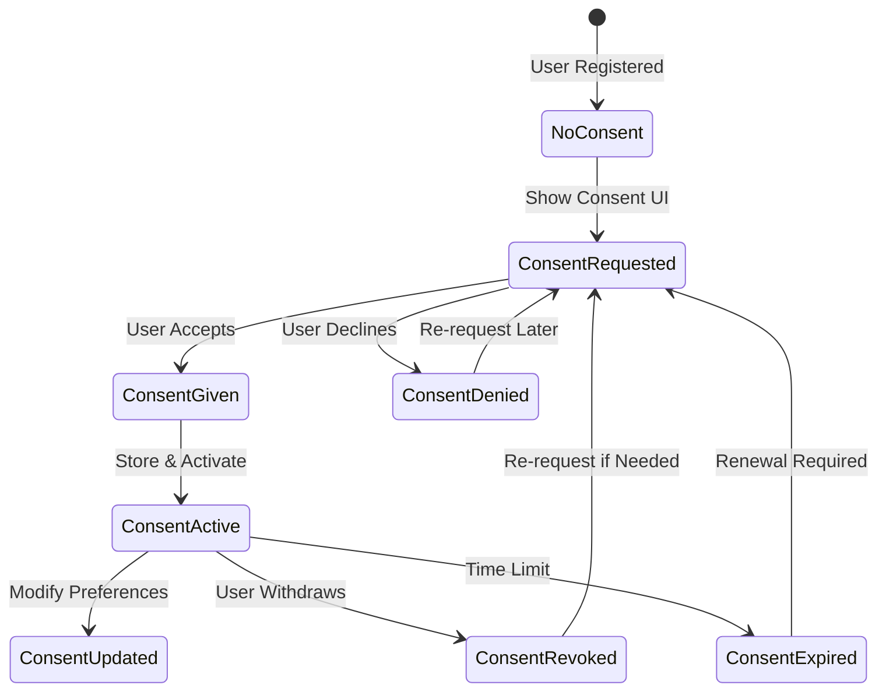
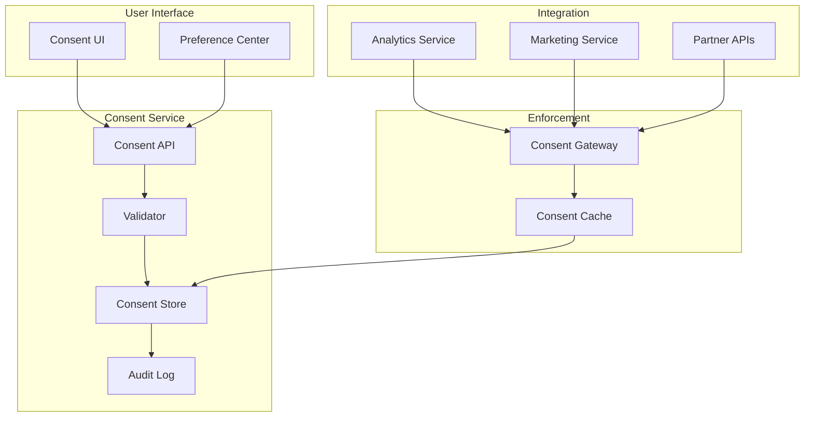

# Consent Management Pattern

**Build compliant consent systems with granular permissions and complete audit trails**

## Level 1: Intuition

## Core Concept

Like a medical consent form that tracks exactly what procedures you've agreed to, digital consent management ensures users control how their data is processed.

**Problem**: Privacy laws require explicit consent → complex tracking → compliance risks

**Solution**: Centralized consent service with versioning, audit trails, and granular controls.

## Simple Example

```text
Healthcare Consent Analogy:
- Different permissions: Treatment, research, marketing
- Can revoke specific consents
- Full history of what was agreed when
- Proof of consent for audits

Digital System:
- Purpose-specific consents (analytics, marketing, sharing)
- Granular opt-in/opt-out
- Timestamped consent records
- Compliance reporting
```

---

## Level 2: Foundation

## Consent Lifecycle



## Consent Types & Granularity

| Type | Scope | Duration | Revocable | Example |
|------|-------|----------|-----------|----------|
| **Necessary** | Core service | Unlimited | No | Account creation |
| **Functional** | Features | Session/Persistent | Yes | Language preference |
| **Analytics** | Improvement | 1-2 years | Yes | Usage tracking |
| **Marketing** | Communications | Until revoked | Yes | Email newsletters |
| **Third-party** | External sharing | Specific period | Yes | Partner integration |


## GDPR Compliance Requirements

1. **Lawful Basis**: One of six legal grounds (consent is one)
2. **Explicit Consent**: Clear affirmative action, no pre-ticked boxes
3. **Granular Control**: Separate consent for different purposes
4. **Easy Withdrawal**: As easy to withdraw as to give
5. **Record Keeping**: Demonstrate compliance with audit trail

---

## Level 3: Implementation

## Consent Service Architecture



## Consent Data Model

```typescript
// Consent record with full context
interface ConsentRecord {
  id: string;
  userId: string;
  version: string;  // Policy version
  timestamp: Date;
  
  // What was consented to
  purposes: ConsentPurpose[];
  
  // How consent was obtained
  collection: {
    method: 'explicit' | 'implicit' | 'imported';
    channel: 'web' | 'mobile' | 'api' | 'offline';
    ipAddress: string;
    userAgent: string;
    location?: string;
  };
  
  // Legal context
  legal: {
    basis: 'consent' | 'contract' | 'legal_obligation' | 
           'vital_interests' | 'public_task' | 'legitimate_interests';
    jurisdiction: string;
    minorStatus?: 'adult' | 'minor' | 'parental_consent';
  };
  
  // Consent state
  status: 'active' | 'revoked' | 'expired';
  expiresAt?: Date;
  revokedAt?: Date;
  
  // Audit fields
  createdBy: string;
  updatedBy?: string;
  updateHistory: ConsentUpdate[];
}

interface ConsentPurpose {
  id: string;
  name: string;
  description: string;
  dataCategories: string[];
  processingTypes: string[];
  retentionPeriod: string;
  thirdParties?: string[];
  granted: boolean;
}
```

## Implementation Example

```python
from datetime import datetime, timedelta
from typing import List, Optional, Dict
import hashlib
import json
from enum import Enum

class ConsentBasis(Enum):
    CONSENT = "consent"
    CONTRACT = "contract"
    LEGAL_OBLIGATION = "legal_obligation"
    VITAL_INTERESTS = "vital_interests"
    PUBLIC_TASK = "public_task"
    LEGITIMATE_INTERESTS = "legitimate_interests"

class ConsentManager:
    """
    GDPR-compliant consent management with audit trails
    """
    
    def __init__(self, db, audit_logger, cache):
        self.db = db
        self.audit = audit_logger
        self.cache = cache
        self.policy_version = "2.1"
        
    async def request_consent(
        self,
        user_id: str,
        purposes: List[str],
        channel: str,
        ip_address: str,
        user_agent: str
    ) -> Dict:
        """
        Record explicit consent with full context
        """
# Validate purposes against current policy
        valid_purposes = await self._validate_purposes(purposes)
        if not valid_purposes:
            raise ValueError("Invalid consent purposes")
            
# Check age verification
        user_age = await self._check_user_age(user_id)
        if user_age < 16:  # GDPR child age
            return {
                "status": "parental_consent_required",
                "reason": "User under 16 requires parental consent"
            }
            
# Create consent record
        consent_id = self._generate_consent_id(user_id)
        consent_record = {
            "id": consent_id,
            "user_id": user_id,
            "version": self.policy_version,
            "timestamp": datetime.utcnow(),
            "purposes": valid_purposes,
            "collection": {
                "method": "explicit",
                "channel": channel,
                "ip_address": self._hash_ip(ip_address),
                "user_agent": user_agent,
                "consent_text_shown": self._get_consent_text()
            },
            "legal": {
                "basis": ConsentBasis.CONSENT.value,
                "jurisdiction": await self._determine_jurisdiction(ip_address),
                "minor_status": "adult" if user_age >= 18 else "minor"
            },
            "status": "active",
            "expires_at": datetime.utcnow() + timedelta(days=365)
        }
        
# Store with transaction
        async with self.db.transaction() as tx:
# Save consent
            await tx.insert("consents", consent_record)
            
# Create audit entry
            await self.audit.log({
                "event": "consent_granted",
                "user_id": user_id,
                "consent_id": consent_id,
                "purposes": purposes,
                "timestamp": datetime.utcnow(),
                "ip_address": self._hash_ip(ip_address)
            })
            
# Update user profile
            await tx.update(
                "users",
                {"id": user_id},
                {"consent_status": "active", "last_consent_update": datetime.utcnow()}
            )
            
# Cache for quick lookups
        await self._update_consent_cache(user_id, consent_record)
        
# Notify downstream services
        await self._broadcast_consent_update(user_id, purposes, "granted")
        
        return {
            "status": "success",
            "consent_id": consent_id,
            "expires_at": consent_record["expires_at"]
        }
        
    async def revoke_consent(
        self,
        user_id: str,
        purposes: Optional[List[str]] = None,
        reason: Optional[str] = None
    ) -> Dict:
        """
        Handle consent withdrawal with immediate effect
        """
# Get current consent
        current = await self.get_active_consent(user_id)
        if not current:
            return {"status": "no_active_consent"}
            
# Determine which purposes to revoke
        if purposes is None:
# Revoke all
            revoked_purposes = [p["id"] for p in current["purposes"]]
            remaining_purposes = []
        else:
# Partial revocation
            revoked_purposes = purposes
            remaining_purposes = [
                p for p in current["purposes"] 
                if p["id"] not in purposes
            ]
            
        async with self.db.transaction() as tx:
            if not remaining_purposes:
# Full revocation
                await tx.update(
                    "consents",
                    {"id": current["id"]},
                    {
                        "status": "revoked",
                        "revoked_at": datetime.utcnow(),
                        "revocation_reason": reason
                    }
                )
            else:
# Create new consent with remaining purposes
                new_consent = current.copy()
                new_consent["id"] = self._generate_consent_id(user_id)
                new_consent["purposes"] = remaining_purposes
                new_consent["timestamp"] = datetime.utcnow()
                new_consent["parent_consent_id"] = current["id"]
                
                await tx.insert("consents", new_consent)
                await tx.update(
                    "consents",
                    {"id": current["id"]},
                    {"status": "superseded"}
                )
                
# Audit the revocation
            await self.audit.log({
                "event": "consent_revoked",
                "user_id": user_id,
                "consent_id": current["id"],
                "revoked_purposes": revoked_purposes,
                "remaining_purposes": [p["id"] for p in remaining_purposes],
                "reason": reason,
                "timestamp": datetime.utcnow()
            })
            
# Clear cache
        await self.cache.delete(f"consent:{user_id}")
        
# Notify services immediately
        await self._broadcast_consent_update(user_id, revoked_purposes, "revoked")
        
# Trigger data deletion workflows if needed
        if not remaining_purposes:
            await self._initiate_data_deletion(user_id, revoked_purposes)
            
        return {
            "status": "success",
            "revoked_purposes": revoked_purposes,
            "remaining_purposes": [p["id"] for p in remaining_purposes]
        }
        
    async def check_consent(
        self,
        user_id: str,
        purpose: str,
        enforce_expiry: bool = True
    ) -> bool:
        """
        Fast consent verification with caching
        """
# Check cache first
        cache_key = f"consent:{user_id}:{purpose}"
        cached = await self.cache.get(cache_key)
        if cached is not None:
            return cached == "granted"
            
# Load active consent
        consent = await self.get_active_consent(user_id)
        if not consent:
            await self.cache.set(cache_key, "denied", ttl=300)
            return False
            
# Check expiry
        if enforce_expiry and consent.get("expires_at"):
            if datetime.utcnow() > consent["expires_at"]:
                await self.cache.set(cache_key, "expired", ttl=300)
                return False
                
# Check specific purpose
        granted = any(
            p["id"] == purpose and p["granted"] 
            for p in consent["purposes"]
        )
        
# Cache result
        await self.cache.set(
            cache_key,
            "granted" if granted else "denied",
            ttl=3600  # 1 hour
        )
        
        return granted
        
    async def export_user_consents(self, user_id: str) -> Dict:
        """
        GDPR data portability - export all consent history
        """
# Get all consent records
        consents = await self.db.query(
            "SELECT * FROM consents WHERE user_id = ? ORDER BY timestamp DESC",
            [user_id]
        )
        
# Get all audit logs
        audit_logs = await self.audit.query(
            {"user_id": user_id, "event_type": "consent_*"}
        )
        
# Format for export
        export_data = {
            "export_date": datetime.utcnow().isoformat(),
            "user_id": user_id,
            "consent_history": [
                {
                    "id": c["id"],
                    "timestamp": c["timestamp"].isoformat(),
                    "version": c["version"],
                    "status": c["status"],
                    "purposes": c["purposes"],
                    "collection_method": c["collection"]["method"],
                    "expires_at": c.get("expires_at", {}).isoformat() if c.get("expires_at") else None,
                    "revoked_at": c.get("revoked_at", {}).isoformat() if c.get("revoked_at") else None
                }
                for c in consents
            ],
            "audit_trail": [
                {
                    "timestamp": log["timestamp"].isoformat(),
                    "event": log["event"],
                    "details": log.get("details", {})
                }
                for log in audit_logs
            ]
        }
        
# Log the export
        await self.audit.log({
            "event": "consent_data_exported",
            "user_id": user_id,
            "timestamp": datetime.utcnow(),
            "export_size": len(json.dumps(export_data))
        })
        
        return export_data
        
    def _hash_ip(self, ip_address: str) -> str:
        """Privacy-preserving IP storage"""
        return hashlib.sha256(f"{ip_address}:{self.policy_version}".encode()).hexdigest()[:16]
        
    async def _broadcast_consent_update(self, user_id: str, purposes: List[str], action: str):
        """Notify all services of consent changes"""
        message = {
            "user_id": user_id,
            "purposes": purposes,
            "action": action,
            "timestamp": datetime.utcnow().isoformat()
        }
        
# Send to message queue for downstream services
        await self.queue.publish("consent.updates", message)
        
# Direct API calls for critical services
        if "marketing" in purposes:
            await self.marketing_api.update_consent(user_id, action == "granted")
        if "analytics" in purposes:
            await self.analytics_api.update_consent(user_id, action == "granted")
```

## Consent UI Components

```typescript
// React consent banner with granular controls
import React, { useState, useEffect } from 'react';

interface ConsentBannerProps {
  userId: string;
  onConsentUpdate: (consents: ConsentChoices) => void;
}

const ConsentBanner: React.FC<ConsentBannerProps> = ({ userId, onConsentUpdate }) => {
  const [showBanner, setShowBanner] = useState(false);
  const [showDetails, setShowDetails] = useState(false);
  const [choices, setChoices] = useState<ConsentChoices>({
    necessary: true,  // Always true, can't be changed
    functional: false,
    analytics: false,
    marketing: false
  });
  
  useEffect(() => {
    // Check if consent needed
    checkConsentStatus();
  }, [userId]);
  
  const checkConsentStatus = async () => {
    const response = await fetch(`/api/consent/status/${userId}`);
    const data = await response.json();
    
    if (data.requiresConsent) {
      setShowBanner(true);
      // Pre-fill with any previous choices
      if (data.previousChoices) {
        setChoices(data.previousChoices);
      }
    }
  };
  
  const handleAcceptAll = async () => {
    const allConsents = {
      necessary: true,
      functional: true,
      analytics: true,
      marketing: true
    };
    
    await submitConsent(allConsents);
  };
  
  const handleAcceptSelected = async () => {
    await submitConsent(choices);
  };
  
  const handleRejectAll = async () => {
    const minimalConsents = {
      necessary: true,
      functional: false,
      analytics: false,
      marketing: false
    };
    
    await submitConsent(minimalConsents);
  };
  
  const submitConsent = async (consents: ConsentChoices) => {
    try {
      const response = await fetch('/api/consent/grant', {
        method: 'POST',
        headers: { 'Content-Type': 'application/json' },
        body: JSON.stringify({
          userId,
          purposes: Object.entries(consents)
            .filter(([_, granted]) => granted)
            .map(([purpose]) => purpose),
          timestamp: new Date().toISOString(),
          source: 'consent_banner'
        })
      });
      
      if (response.ok) {
        setShowBanner(false);
        onConsentUpdate(consents);
        
        // Set secure, httpOnly cookie
        document.cookie = `consent_given=true; 
          max-age=31536000; 
          path=/; 
          samesite=strict; 
          secure`;
      }
    } catch (error) {
      console.error('Failed to submit consent:', error);
    }
  };
  
  if (!showBanner) return null;
  
  return (
    <div className="consent-banner" role="dialog" aria-label="Cookie consent">
      <div className="consent-content">
        <h2>We value your privacy</h2>
        <p>
          We use cookies to enhance your browsing experience, serve personalized content,
          and analyze our traffic. By clicking "Accept All", you consent to our use of cookies.
        </p>
        
        {showDetails && (
          <div className="consent-details">
            <div className="consent-category">
              <input
                type="checkbox"
                id="necessary"
                checked={true}
                disabled
              />
              <label htmlFor="necessary">
                <strong>Necessary Cookies</strong>
                <p>Essential for the website to function properly</p>
              </label>
            </div>
            
            <div className="consent-category">
              <input
                type="checkbox"
                id="functional"
                checked={choices.functional}
                onChange={(e) => setChoices({...choices, functional: e.target.checked})}
              />
              <label htmlFor="functional">
                <strong>Functional Cookies</strong>
                <p>Enable personalized features like language preferences</p>
              </label>
            </div>
            
            <div className="consent-category">
              <input
                type="checkbox"
                id="analytics"
                checked={choices.analytics}
                onChange={(e) => setChoices({...choices, analytics: e.target.checked})}
              />
              <label htmlFor="analytics">
                <strong>Analytics Cookies</strong>
                <p>Help us understand how visitors interact with our website</p>
              </label>
            </div>
            
            <div className="consent-category">
              <input
                type="checkbox"
                id="marketing"
                checked={choices.marketing}
                onChange={(e) => setChoices({...choices, marketing: e.target.checked})}
              />
              <label htmlFor="marketing">
                <strong>Marketing Cookies</strong>
                <p>Used to deliver personalized advertisements</p>
              </label>
            </div>
          </div>
        )}
        
        <div className="consent-actions">
          <button 
            onClick={() => setShowDetails(!showDetails)}
            className="btn-link"
          >
            {showDetails ? 'Hide' : 'Customize'} Settings
          </button>
          
          <div className="consent-buttons">
            <button onClick={handleRejectAll} className="btn-secondary">
              Reject All
            </button>
            {showDetails && (
              <button onClick={handleAcceptSelected} className="btn-primary">
                Accept Selected
              </button>
            )}
            <button onClick={handleAcceptAll} className="btn-primary">
              Accept All
            </button>
          </div>
        </div>
      </div>
    </div>
  );
};
```

---

## Level 4: Deep Dive

## Compliance Considerations

### GDPR Requirements

1. **Freely Given**: No coercion, clear choice
2. **Specific**: Separate consent for different purposes
3. **Informed**: Clear information about processing
4. **Unambiguous**: Affirmative action required

### CCPA Requirements

1. **Notice at Collection**: What categories collected and why
2. **Opt-out Right**: "Do Not Sell My Personal Information"
3. **Equal Service**: Can't discriminate for exercising rights
4. **Verification**: Verify identity for requests

## Advanced Consent Patterns

### 1. Progressive Consent
```typescript
// Request consent contextually as features are used
class ProgressiveConsentManager {
  async requestContextualConsent(context: ConsentContext): Promise<boolean> {
    // Check if already have consent for this context
    if (await this.hasValidConsent(context.userId, context.purpose)) {
      return true;
    }
    
    // Show contextual UI
    const granted = await this.showContextualPrompt({
      title: context.featureName,
      description: context.benefitExplanation,
      dataUsed: context.dataCategories,
      duration: context.retentionPeriod
    });
    
    if (granted) {
      await this.recordConsent(context);
    }
    
    return granted;
  }
}
```

### 2. Consent Inheritance
```typescript
// Handle consent across related services
interface ConsentInheritance {
  parent: string;         // Parent service
  inherits: string[];     // Which consents inherit
  requires: string[];     // Additional consents needed
  conflicts: string[];    // Mutually exclusive consents
}

class ConsentInheritanceEngine {
  async applyInheritance(
    userId: string,
    service: string,
    requestedPurposes: string[]
  ): Promise<ConsentDecision> {
    const parentConsents = await this.getParentConsents(userId, service);
    const inherited = this.calculateInheritance(parentConsents, requestedPurposes);
    const additional = this.identifyAdditionalRequired(service, requestedPurposes);
    
    return {
      granted: inherited.granted,
      inherited: inherited.purposes,
      required: additional,
      conflicts: this.detectConflicts(requestedPurposes)
    };
  }
}
```

### 3. Consent Delegation
```typescript
// Handle consent on behalf of others (minors, employees)
class ConsentDelegation {
  async delegateConsent(
    principalId: string,
    agentId: string,
    scope: DelegationScope
  ): Promise<DelegationResult> {
    // Verify delegation authority
    const authority = await this.verifyAuthority(agentId, principalId, scope);
    if (!authority.valid) {
      throw new Error(`No authority: ${authority.reason}`);
    }
    
    // Record delegation
    const delegation = await this.recordDelegation({
      principalId,
      agentId,
      scope,
      authority: authority.type,
      expiresAt: this.calculateExpiry(authority.type)
    });
    
    // Grant consents
    return this.grantDelegatedConsents(principalId, scope.purposes, delegation.id);
  }
}
```

## Performance Optimization

### 1. Consent Caching Strategy
```typescript
class ConsentCache {
  private localCache: Map<string, CachedConsent> = new Map();
  private redis: RedisClient;
  
  async getConsent(userId: string, purpose: string): Promise<boolean | null> {
    const key = `${userId}:${purpose}`;
    
    // L1: Local memory cache
    const local = this.localCache.get(key);
    if (local && !this.isExpired(local)) {
      return local.granted;
    }
    
    // L2: Redis cache
    const cached = await this.redis.get(`consent:${key}`);
    if (cached) {
      const parsed = JSON.parse(cached);
      this.localCache.set(key, parsed);
      return parsed.granted;
    }
    
    // L3: Database
    const consent = await this.db.getActiveConsent(userId, purpose);
    if (consent) {
      await this.cacheConsent(key, consent);
      return consent.granted;
    }
    
    return null;
  }
  
  private async cacheConsent(key: string, consent: Consent): Promise<void> {
    const cached = {
      granted: consent.granted,
      expiresAt: consent.expiresAt,
      cachedAt: new Date()
    };
    
    // Write-through cache
    this.localCache.set(key, cached);
    await this.redis.setex(
      `consent:${key}`,
      3600,  // 1 hour TTL
      JSON.stringify(cached)
    );
  }
}
```

### 2. Batch Consent Checking
```typescript
class BatchConsentChecker {
  async checkMultiple(
    userId: string,
    purposes: string[]
  ): Promise<Map<string, boolean>> {
    // Single query for all purposes
    const consents = await this.db.query(`
      SELECT purpose_id, granted
      FROM consent_purposes
      WHERE consent_id = (
        SELECT id FROM consents
        WHERE user_id = ? AND status = 'active'
        ORDER BY timestamp DESC
        LIMIT 1
      )
      AND purpose_id IN (?)
    `, [userId, purposes]);
    
    // Build result map
    const results = new Map<string, boolean>();
    purposes.forEach(purpose => {
      const consent = consents.find(c => c.purpose_id === purpose);
      results.set(purpose, consent?.granted || false);
    });
    
    // Cache all results
    await this.cacheMultiple(userId, results);
    
    return results;
  }
}
```

---

## Level 5: Production

## Security Best Practices

### 1. Consent Validation
```python
class ConsentValidator:
    def validate_consent_request(self, request: ConsentRequest) -> ValidationResult:
        errors = []
        
# Verify user identity
        if not self.verify_user_token(request.auth_token):
            errors.append("Invalid authentication")
            
# Check for consent bombing
        recent_requests = self.get_recent_requests(request.user_id)
        if len(recent_requests) > 10:
            errors.append("Too many consent requests")
            
# Validate purposes
        invalid_purposes = [
            p for p in request.purposes 
            if p not in self.valid_purposes
        ]
        if invalid_purposes:
            errors.append(f"Invalid purposes: {invalid_purposes}")
            
# Check for suspicious patterns
        if self.is_suspicious_pattern(request):
            errors.append("Suspicious consent pattern detected")
            self.alert_security_team(request)
            
        return ValidationResult(valid=len(errors) == 0, errors=errors)
```

### 2. Audit Trail Security
```python
class SecureAuditLogger:
    def log_consent_event(self, event: ConsentEvent):
# Create tamper-proof record
        record = {
            "event_id": str(uuid.uuid4()),
            "timestamp": datetime.utcnow().isoformat(),
            "event_type": event.type,
            "user_id": event.user_id,
            "data": event.data,
            "system_context": {
                "service_version": self.version,
                "server_id": self.server_id,
                "request_id": event.request_id
            }
        }
        
# Add cryptographic signature
        record["signature"] = self.sign_record(record)
        
# Store in append-only log
        self.append_only_store.append(record)
        
# Replicate to backup locations
        self.replicate_to_backups(record)
        
    def sign_record(self, record: dict) -> str:
# Create canonical representation
        canonical = json.dumps(record, sort_keys=True)
        
# Sign with service key
        signature = hmac.new(
            self.signing_key.encode(),
            canonical.encode(),
            hashlib.sha256
        ).hexdigest()
        
        return signature
```

## Common Vulnerabilities

### 1. Consent Bypass
```python
# VULNERABLE: Direct purpose check without validation
def check_consent_vulnerable(user_id, purpose):
    return db.query(
        "SELECT granted FROM consents WHERE user_id = ? AND purpose = ?",
        [user_id, purpose]
    )

# SECURE: Validate and check active consent only
def check_consent_secure(user_id, purpose):
# Validate inputs
    if not validate_user_id(user_id) or purpose not in VALID_PURPOSES:
        return False
        
# Check only active, non-expired consents
    result = db.query("""
        SELECT granted FROM consents 
        WHERE user_id = ? 
        AND purpose = ?
        AND status = 'active'
        AND (expires_at IS NULL OR expires_at > NOW())
        ORDER BY timestamp DESC
        LIMIT 1
    """, [user_id, purpose])
    
    return result and result[0]['granted']
```

### 2. Consent Confusion
```typescript
// VULNERABLE: Ambiguous consent scopes
interface BadConsent {
  marketing: boolean;  // What does this include?
}

// SECURE: Explicit, granular consent
interface GoodConsent {
  emailMarketing: boolean;
  smsMarketing: boolean;
  thirdPartySharing: boolean;
  behavioralTargeting: boolean;
  crossDeviceTracking: boolean;
}
```

## Real-World Case Studies

### Facebook Cambridge Analytica (2018)
- **Issue**: Third-party app collected data without proper consent
- **Impact**: 87 million users affected, $5 billion FTC fine
- **Lesson**: Consent must cover third-party data sharing explicitly

### Google GDPR Fine (2019)
- **Issue**: Pre-ticked boxes and bundled consent
- **Impact**: €50 million fine from French regulator
- **Lesson**: Consent must be explicit and granular

### British Airways (2019)
- **Issue**: No consent for payment data processing
- **Impact**: €22 million fine (reduced from €204 million)
- **Lesson**: Sensitive data requires explicit consent

## Monitoring & Compliance

```python
class ConsentComplianceMonitor:
    def __init__(self):
        self.metrics = MetricsCollector()
        self.alerts = AlertManager()
        
    def monitor_consent_health(self):
# Track consent metrics
        self.metrics.gauge('consent.active_users', self.count_active_consents())
        self.metrics.gauge('consent.coverage_rate', self.calculate_coverage())
        self.metrics.counter('consent.grants', tags=['purpose'])
        self.metrics.counter('consent.revocations', tags=['purpose'])
        
# Check for anomalies
        if self.detect_consent_anomaly():
            self.alerts.send(
                severity='high',
                title='Consent anomaly detected',
                description='Unusual consent patterns observed'
            )
            
# Compliance checks
        self.check_expired_consents()
        self.check_missing_audits()
        self.verify_retention_compliance()
        
    def generate_compliance_report(self, period: str) -> ComplianceReport:
        return ComplianceReport(
            period=period,
            total_users=self.count_users(),
            consented_users=self.count_consented_users(),
            consent_rate=self.calculate_consent_rate(),
            revocation_requests=self.count_revocations(period),
            average_response_time=self.calculate_response_time(),
            audit_completeness=self.check_audit_completeness(),
            data_minimization_score=self.calculate_minimization_score()
        )
```

## Testing Consent Systems

```python
# Test consent lifecycle
def test_consent_lifecycle():
# Setup
    user_id = create_test_user()
    
# Test: Initial consent request
    consent_result = consent_manager.request_consent(
        user_id=user_id,
        purposes=['analytics', 'marketing'],
        channel='web'
    )
    assert consent_result['status'] == 'success'
    
# Test: Verify consent is active
    assert consent_manager.check_consent(user_id, 'analytics') == True
    assert consent_manager.check_consent(user_id, 'marketing') == True
    assert consent_manager.check_consent(user_id, 'targeting') == False
    
# Test: Partial revocation
    revoke_result = consent_manager.revoke_consent(
        user_id=user_id,
        purposes=['marketing']
    )
    assert revoke_result['status'] == 'success'
    assert consent_manager.check_consent(user_id, 'analytics') == True
    assert consent_manager.check_consent(user_id, 'marketing') == False
    
# Test: Audit trail exists
    audit_logs = audit_logger.get_user_logs(user_id)
    assert len(audit_logs) >= 2
    assert audit_logs[0]['event'] == 'consent_granted'
    assert audit_logs[1]['event'] == 'consent_revoked'
    
# Test: Data export
    export = consent_manager.export_user_consents(user_id)
    assert len(export['consent_history']) == 2
    assert export['audit_trail'] is not None
```

## Key Takeaways

### Do's ✅
- Implement granular, purpose-specific consent
- Maintain complete audit trails
- Make withdrawal as easy as granting
- Cache consent decisions for performance
- Test consent flows thoroughly
- Monitor compliance metrics

### Don'ts ❌
- Pre-tick consent boxes
- Bundle unrelated purposes
- Make consent a condition of service
- Ignore consent expiration
- Process data without valid consent
- Forget about minor protection

### Critical Success Factors
1. **User Trust**: Clear, honest communication
2. **Legal Compliance**: Meet all regulatory requirements
3. **Performance**: Fast consent checks at scale
4. **Flexibility**: Adapt to changing regulations
5. **Auditability**: Prove compliance when challenged

## Related Patterns
- [Event Sourcing](event-sourcing.md) - Audit trail implementation
- [CQRS](cqrs.md) - Separate consent reads from writes
- [Zero Trust Security] (Pattern: Zero Trust - Coming Soon) - Never assume consent
- [API Gateway](api-gateway.md) - Centralized consent enforcement

## References
- [GDPR Article 7](https://gdpr.eu/article-7-how-to-get-consent-to-collect-personal-data/) - Conditions for consent
- [CCPA Regulations](https://oag.ca.gov/privacy/ccpa) - California privacy rights
- [OneTrust Consent Guide](https://www.onetrust.com/blog/consent-management/) - Industry best practices
- [IAB Transparency Framework](https://iabeurope.eu/transparency-consent-framework/) - Advertising consent standards