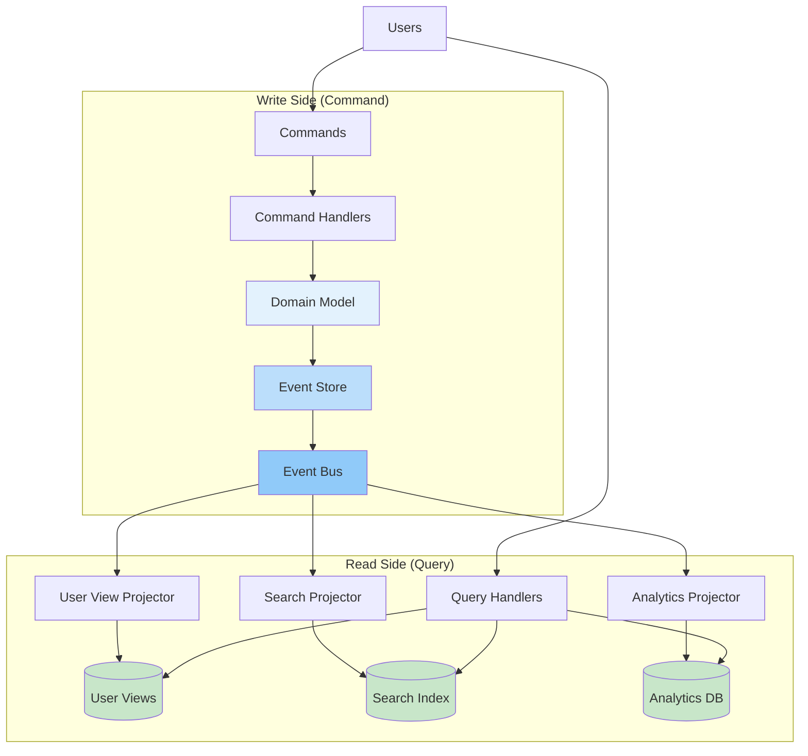
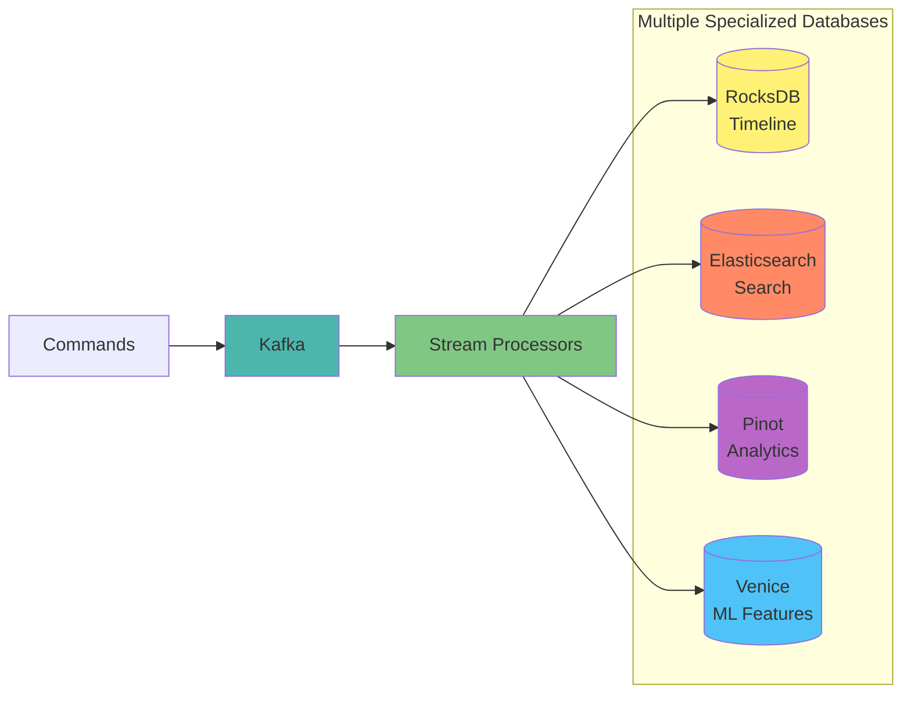
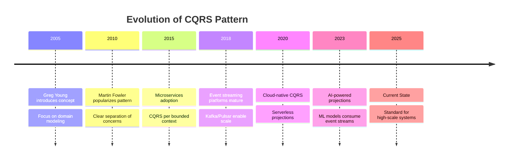
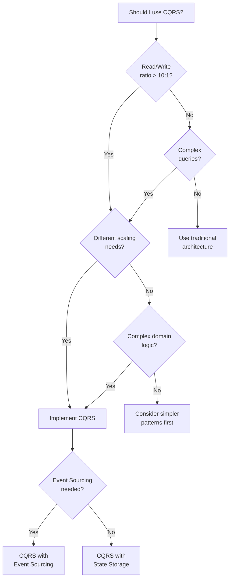

# CQRS (Command Query Responsibility Segregation)

<div class="pattern-card">
  <span class="pattern-card__category">Architectural Pattern</span>
  <div class="pattern-card__content">
    <p class="pattern-card__description">
      Separate read and write models to independently optimize complex business operations and high-performance queries.
    </p>
    <div class="pattern-card__laws">
      <span class="pattern-card__law-badge">Law 2: Asynchronous Reality</span>
      <span class="pattern-card__law-badge">Law 4: Multidimensional Optimization</span>
    </div>
  </div>
</div>

## Problem Statement

**How can we optimize both complex business operations and high-performance queries when they have fundamentally different requirements?**

<div class="content-box decision-box">
<h3>When to Use This Pattern</h3>

| Scenario | Use CQRS | Alternative |
|----------|----------|-------------|
| Read/write ratio > 10:1 | ✅ Yes | Consider read replicas |
| Complex domain logic | ✅ Yes | Traditional layered architecture |
| Different scaling needs | ✅ Yes | Vertical scaling |
| Multiple query views needed | ✅ Yes | Database views |
| Audit trail required | ✅ Yes | Simple logging |
| Simple CRUD operations | ❌ No | Traditional CRUD |
| Small teams (< 3 developers) | ❌ No | Monolithic architecture |
| Low traffic (< 1K requests/day) | ❌ No | Simple database |

</div>

## Solution Architecture



## Implementation Considerations

### Trade-offs

<table class="responsive-table">
<thead>
  <tr>
    <th>Aspect</th>
    <th>Benefit</th>
    <th>Cost</th>
  </tr>
</thead>
<tbody>
  <tr>
    <td data-label="Aspect">Performance</td>
    <td data-label="Benefit">Independent optimization</td>
    <td data-label="Cost">Eventual consistency</td>
  </tr>
  <tr>
    <td data-label="Aspect">Scalability</td>
    <td data-label="Benefit">Scale reads/writes separately</td>
    <td data-label="Cost">Infrastructure complexity</td>
  </tr>
  <tr>
    <td data-label="Aspect">Development</td>
    <td data-label="Benefit">Clear separation of concerns</td>
    <td data-label="Cost">Event synchronization logic</td>
  </tr>
  <tr>
    <td data-label="Aspect">Query Flexibility</td>
    <td data-label="Benefit">Multiple optimized views</td>
    <td data-label="Cost">Projection maintenance</td>
  </tr>
</tbody>
</table>

### Key Metrics

<div class="card-grid">
  <div class="card">
    <div class="card__title">Write Latency</div>
    <div class="card__description">P99: < 200ms</div>
  </div>
  <div class="card">
    <div class="card__title">Read Latency</div>
    <div class="card__description">P99: < 50ms</div>
  </div>
  <div class="card">
    <div class="card__title">Projection Lag</div>
    <div class="card__description">< 5 seconds</div>
  </div>
  <div class="card">
    <div class="card__title">Consistency</div>
    <div class="card__description">Eventually consistent</div>
  </div>
</div>

## Real-World Examples

<div class="content-box axiom-box">
<h3>Production Implementation</h3>

- **LinkedIn**: Used CQRS for their feed system, handling 1B+ reads/day with < 50ms P99 latency
- **Netflix**: Implemented CQRS for their viewing history, enabling personalized recommendations at scale
- **Uber**: Applied CQRS to their trip data, supporting real-time analytics while maintaining transactional integrity
- **Amazon**: Uses CQRS for product catalog, serving millions of queries while processing inventory updates

</div>

## Common Pitfalls

<div class="content-box failure-vignette">
<h3>What Can Go Wrong</h3>

1. **Synchronous Projections**: Updating read models in write transaction eliminates performance benefits. Use asynchronous event processing instead.
2. **Missing Event Versioning**: Schema changes break event replay. Implement event versioning from day one.
3. **Over-Engineering**: Applying CQRS to simple CRUD operations adds unnecessary complexity. Start with traditional architecture for simple domains.
4. **Ignoring Consistency Requirements**: Some operations need immediate consistency. Use consistency tokens or polling for critical reads.
5. **Poor Error Handling**: Failed projections create data inconsistencies. Implement dead letter queues and replay mechanisms.

</div>

## Related Patterns

- [Event Sourcing](event-sourcing.md) - Natural companion for event-driven CQRS
- [Saga Pattern](saga.md) - Handling distributed transactions with CQRS
- [Event-Driven Architecture](event-driven.md) - Foundation for CQRS communication
- [Service Mesh](service-mesh.md) - Infrastructure for distributed CQRS systems

## Further Reading

- [Greg Young's CQRS Documents](https://cqrs.files.wordpress.com/2010/11/cqrs_documents.pdf) - Original CQRS papers
- [Martin Fowler's CQRS Article](https://martinfowler.com/bliki/CQRS.html) - Clear introduction
- [Microsoft CQRS Journey](https://docs.microsoft.com/en-us/previous-versions/msp-n-p/jj554200(v=pandp.10)) - Detailed implementation guide


---

## Level 5: Mastery (45 minutes)

### Case Study: LinkedIn's Feed Architecture

<div class="truth-box">
<h4>🏢 Real-World Implementation</h4>

**Company**: LinkedIn  
**Scale**: 810M+ members, 10M+ posts/day, 100B+ impressions/month

**Challenge**: Personalized feeds with real-time posting.

**Write Side**: Post creation, privacy rules, spam checks, graph updates

**Read Side Projections**:
- Timeline Cache: Recent posts
- Follower Fanout: Pre-computed feeds
- Search Index: Full-text search
- Analytics Views: Engagement metrics
- ML Features: Recommendation data

**Architecture**:



**Results**:
- Latency: 2s → 200ms
- Cost: -40%
- Dev velocity: 3x
- Engagement: +25%

**Lessons**:
1. Start with critical read patterns
2. Event schema is critical
3. Monitor projection lag
4. Use specialized stores
</div>

### Economic Analysis

#### Cost Model

```python
def calculate_cqrs_roi(
    monthly_requests: int,
    read_write_ratio: float,
    avg_query_complexity: int,
    team_size: int
) -> dict:
    """Calculate ROI for implementing CQRS"""
    
    # Traditional approach costs
    traditional_costs = {
        'infrastructure': calculate_traditional_infra_cost(
            monthly_requests,
            avg_query_complexity
        ),
        'development': team_size * AVG_DEV_COST * 1.5,  # Complexity factor
        'operations': monthly_requests * 0.0001  # Per-request ops cost
    }
    
    # CQRS approach costs
    cqrs_costs = {
        'infrastructure': calculate_cqrs_infra_cost(
            monthly_requests,
            read_write_ratio
        ),
        'development': team_size * AVG_DEV_COST * 2.0,  # Initial complexity
        'operations': monthly_requests * 0.00008  # Lower per-request cost
    }
    
    # Benefits
    benefits = {
        'performance_improvement': 0.7,  # 70% latency reduction
        'scalability_headroom': 5.0,     # 5x more capacity
        'development_velocity': 1.5       # 50% faster after initial setup
    }
    
    # ROI calculation
    monthly_savings = (
        traditional_costs['infrastructure'] - cqrs_costs['infrastructure'] +
        traditional_costs['operations'] - cqrs_costs['operations']
    )
    
    payback_months = (
        (cqrs_costs['development'] - traditional_costs['development']) / 
        monthly_savings
    )
    
    return {
        'monthly_savings': monthly_savings,
        'payback_period_months': payback_months,
        'break_even_requests': monthly_requests * 0.3,  # 30% of current load
        'recommended': payback_months < 12 and read_write_ratio > 10
    }

# Example calculation
roi = calculate_cqrs_roi(
    monthly_requests=100_000_000,
    read_write_ratio=100,  # 100 reads per write
    avg_query_complexity=5,  # Number of joins
    team_size=5
)
print(f"ROI: ${roi['monthly_savings']:,.0f}/month, "
      f"Payback: {roi['payback_period_months']:.1f} months")
```

#### When It Pays Off

- **Break-even**: 10:1 read/write ratio + complex queries
- **High ROI**: E-commerce catalogs, social feeds, financial reports, CMS
- **Low ROI**: Simple CRUD, internal tools, basic queries

### Pattern Evolution



### Law Connections

<div class="law-box">
<h4>🔗 Fundamental Laws</h4>

This pattern directly addresses:

1. **[Law 2 (Asynchronous Reality ⏳)](/part1-axioms/law2-asynchrony/)**: Optimized read models eliminate complex queries
2. **[Law 4 (Multidimensional Optimization ⚖️)](/part1-axioms/law4-tradeoffs/)**: Independent scaling of read/write workloads  
3. **[Law 3 (Emergent Chaos 🌪️)](/part1-axioms/law3-emergence/)**: Event ordering provides natural concurrency control
4. **[Law 4 (Multidimensional Optimization ⚖️)](/part1-axioms/law4-tradeoffs/)**: Asynchronous projections reduce coupling
5. **[Law 5 (Distributed Knowledge 🧠)](/part1-axioms/law5-epistemology/)**: Event stream provides complete audit trail
</div>

### Future Directions

**Emerging Trends**:

1. **Real-time Materialized Views**: Stream processors maintaining live projections
2. **ML-Driven Projections**: AI determining optimal read model structures
3. **Edge CQRS**: Read models pushed to edge locations
4. **Blockchain Integration**: Immutable event stores with cryptographic proofs

**What's Next**:
- Automatic projection optimization based on query patterns
- Declarative projection definitions
- Cross-region consistency protocols
- Integration with graph databases for complex relationships

---

## Quick Reference

### Decision Matrix



### Command Cheat Sheet

```bash
# Event Store Operations
event-store append <aggregate-id> <event-data>  # Append event
event-store stream <from-timestamp>             # Stream events
event-store replay <aggregate-id>               # Replay aggregate

# Projection Management  
projection rebuild <name> [--from-timestamp]    # Rebuild projection
projection status <name>                        # Check lag
projection pause <name>                         # Pause updates
projection resume <name>                        # Resume updates

# Monitoring Commands
cqrs-monitor lag                               # Show projection lag
cqrs-monitor throughput                        # Event throughput
cqrs-monitor errors                            # Recent errors
```

### Configuration Template

```yaml
# Production CQRS configuration
cqrs:
  command_side:
    event_store:
      type: "postgresql"  # or eventstore, kafka
      connection_pool_size: 20
      batch_size: 100
      retention_days: 2555  # 7 years
    
    snapshot:
      enabled: true
      frequency: 100  # Every 100 events
      storage: "s3"
    
    validation:
      timeout_ms: 5000
      retry_attempts: 3
  
  query_side:
    projections:
      - name: "user_view"
        storage: "postgresql"
        update_mode: "async"
        batch_size: 1000
        
      - name: "search_index"
        storage: "elasticsearch"
        update_mode: "async"
        batch_size: 500
    
    consistency:
      default_timeout_ms: 5000
      polling_interval_ms: 100
    
    caching:
      enabled: true
      ttl_seconds: 300
      size_mb: 1024
  
  monitoring:
    metrics_interval: 10s
    health_check_interval: 30s
    alerting:
      projection_lag_threshold: 10s
      error_rate_threshold: 0.01
```

---

## Related Resources

### Patterns
- [Event Sourcing](/patterns/event-sourcing) - Natural companion for event-driven CQRS
- [Saga Pattern](/patterns/saga) - Handling distributed transactions with CQRS
- [Event-Driven Architecture](/patterns/event-driven) - Foundation for CQRS communication

### Laws
- [Law 2 (Asynchronous Reality ⏳)](/part1-axioms/law2-asynchrony/) - Why read optimization matters
- [Law 3 (Emergent Chaos 🌪️)](/part1-axioms/law3-emergence/) - Managing parallel operations
- [Law 4 (Multidimensional Optimization ⚖️)](/part1-axioms/law4-tradeoffs/) - Reducing system coupling

### Further Reading
- [Greg Young's CQRS Documents](https://cqrs.files.wordpress.com/2010/11/cqrs_documents.pdf) - Original CQRS papers
- [Martin Fowler's CQRS Article](https://martinfowler.com/bliki/CQRS.html) - Clear introduction
- [Event Store Documentation](https://eventstore.com/docs/) - Production event store
- [Microsoft CQRS Journey](https://docs.microsoft.com/en-us/previous-versions/msp-n-p/jj554200(v=pandp.10)) - Detailed implementation guide

### Tools & Libraries
- **Java**: Axon Framework - Complete CQRS/ES framework
- **C#/.NET**: MediatR, NEventStore - CQRS building blocks
- **Python**: Eventhorizon - Event sourcing with CQRS
- **Node.js**: Wolkenkit - CQRS/ES framework
- **Go**: EventStore, Watermill - Event streaming
- **Monitoring**: Prometheus + Grafana - Metrics and dashboards

---

<div class="navigation-links">
<div class="prev-link">
<a href="/patterns/queues-streaming">← Previous: Queues & Streaming</a>
</div>
<div class="next-link">
<a href="/patterns/event-driven">Next: Event-Driven Architecture →</a>
</div>
</div>