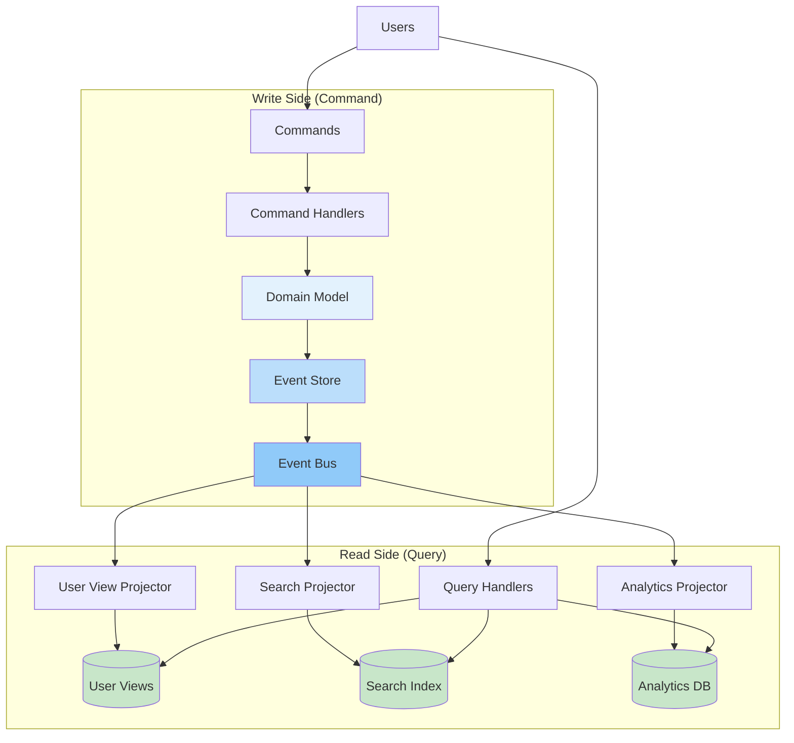

# CQRS (Command Query Responsibility Segregation)

!!! abstract "⚙️ Architectural Pattern"
 Separate read and write models to independently optimize complex business operations and high-performance queries.
 
 **Connected Laws**: Law 2 (Asynchronous Reality) • Law 4 (Multidimensional Optimization)

## Problem Statement

**How can we optimize both complex business operations and high-performance queries when they have fundamentally different requirements?**

??? tip "When to Use This Pattern (Click to expand)"
| Scenario | Use CQRS | Alternative |
 |----------|----------|-------------|
 | Read/write ratio > 10:1 | ✅ Yes | Consider read replicas |
 | Complex domain logic | ✅ Yes | Traditional layered architecture |
 | Different scaling needs | ✅ Yes | Vertical scaling |
 | Multiple query views needed | ✅ Yes | Database views |
 | Audit trail required | ✅ Yes | Simple logging |
 | Simple CRUD operations | ❌ No | Traditional CRUD |
 | Small teams (< 3 developers) | ❌ No | Monolithic architecture |
 | Low traffic (< 1K requests/day) | ❌ No | Simple database |


## Solution Architecture



## Implementation Approaches

=== "Simple CQRS"

 ```python
 # Separate models for commands and queries
 class OrderCommandService:
 def create_order(self, command: CreateOrderCommand):
 # Complex business logic
 order = Order.create(command)
 self.repository.save(order)
 self.event_bus.publish(OrderCreatedEvent(order))
 
 class OrderQueryService:
 def get_order_summary(self, order_id: str):
 # Optimized read from denormalized view
 return self.read_db.query(
 "SELECT * FROM order_summaries WHERE id = ?", 
 order_id
 )
 ```

=== "CQRS with Event Sourcing"

 ```python
 # Commands produce events, queries read from projections
 class OrderAggregate:
 def handle(self, command: CreateOrderCommand):
 # Validate business rules
 if not self.can_create_order(command):
 raise InvalidOrderException()
 
 # Return domain events
 return [
 OrderCreatedEvent(command.order_id, command.items),
 PaymentRequestedEvent(command.order_id, command.total)
 ]
 
 class OrderProjection:
 def apply(self, event: OrderCreatedEvent):
 # Update read model
 self.db.execute("""
 INSERT INTO order_summaries 
 (id, status, total, created_at)
 VALUES (?, ?, ?, ?)
 """, event.order_id, 'pending', event.total, event.timestamp)
 ```

=== "CQRS with Microservices"

 ```yaml
 # Separate services for commands and queries
 services:
 order-command-service:
 image: order-command:latest
 environment:
 - EVENT_STORE_URL=kafka:9092
 - WRITE_DB=postgresql://write-db:5432
 
 order-query-service:
 image: order-query:latest
 environment:
 - EVENT_SOURCE=kafka:9092
 - READ_DB=elasticsearch:9200
 scale: 5 # Scale read side independently
 ```

=== "CQRS with GraphQL"

 ```typescript
 // Separate GraphQL schemas for mutations and queries
 const commandSchema = `
 type Mutation {
 createOrder(input: CreateOrderInput!): Order!
 updateOrder(id: ID!, input: UpdateOrderInput!): Order!
 cancelOrder(id: ID!): Boolean!
 }
 `;
 
 const querySchema = `
 type Query {
 order(id: ID!): OrderView
 ordersByCustomer(customerId: ID!): [OrderSummary!]!
 orderAnalytics(timeRange: TimeRange!): OrderStats!
 }
 `;
 ```

## Implementation Considerations

### Trade-offs

<table class="responsive-table">
<thead>
 <tr>
 <th>Aspect</th>
 <th>Benefit</th>
 <th>Cost</th>
 </tr>
</thead>
<tbody>
 <tr>
 <td data-label="Aspect">Performance</td>
 <td data-label="Benefit">Independent optimization</td>
 <td data-label="Cost">Eventual consistency</td>
 </tr>
 <tr>
 <td data-label="Aspect">Scalability</td>
 <td data-label="Benefit">Scale reads/writes separately</td>
 <td data-label="Cost">Infrastructure complexity</td>
 </tr>
 <tr>
 <td data-label="Aspect">Development</td>
 <td data-label="Benefit">Clear separation of concerns</td>
 <td data-label="Cost">Event synchronization logic</td>
 </tr>
 <tr>
 <td data-label="Aspect">Query Flexibility</td>
 <td data-label="Benefit">Multiple optimized views</td>
 <td data-label="Cost">Projection maintenance</td>
 </tr>
</tbody>
</table>

### Key Metrics

<div class="grid cards" markdown>

- :material-speedometer:{ .lg .middle } **Write Latency**

 ---

 P99: < 200ms

- :material-flash:{ .lg .middle } **Read Latency**

 ---

 P99: < 50ms

- :material-sync:{ .lg .middle } **Projection Lag**

 ---

 < 5 seconds

- :material-check-circle:{ .lg .middle } **Consistency**

 ---

 Eventually consistent

</div>

## Real-World Examples

!!! abstract "Production Implementation"
 - **LinkedIn**: Used CQRS for their feed system, handling 1B+ reads/day with < 50ms P99 latency
 - **Netflix**: Implemented CQRS for their viewing history, enabling personalized recommendations at scale
 - **Uber**: Applied CQRS to their trip data, supporting real-time analytics while maintaining transactional integrity
 - **Amazon**: Uses CQRS for product catalog, serving millions of queries while processing inventory updates

## Related Laws & Pillars

### Fundamental Laws
This pattern directly addresses:

- **[Law 2: Asynchronous Reality ⏱️](/part1-axioms/law2-asynchrony/)**: Eventual consistency between read/write
- **[Law 3: Emergent Chaos 🌪️](/part1-axioms/law3-emergence/)**: Complex interactions between models
- **[Law 4: Multidimensional Optimization ⚖️](/part1-axioms/law4-tradeoffs/)**: Read vs write optimization
- **[Law 5: Distributed Knowledge 🧠](/part1-axioms/law5-epistemology/)**: Separate knowledge domains
- **[Law 6: Cognitive Load 🧠](/part1-axioms/law6-human-api/)**: Complexity of dual models
- **[Law 7: Economic Reality 💰](/part1-axioms/law7-economics/)**: Cost of maintaining multiple models

### Foundational Pillars
CQRS implements:

- **[Pillar 1: Distribution of Work 💪](/part2-pillars/work/)**: Separate read/write workloads
- **[Pillar 2: Distribution of State 🗃️](/part2-pillars/state/)**: Different models for different needs
- **[Pillar 3: Distribution of Truth 🔍](/part2-pillars/truth/)**: Write model as source of truth
- **[Pillar 5: Distribution of Intelligence 🤖](/part2-pillars/intelligence/)**: Smart read model optimization

## Common Pitfalls

!!! danger "What Can Go Wrong"
 1. **Synchronous Projections**: Updating read models in write transaction eliminates performance benefits. Use asynchronous event processing instead.
 2. **Missing Event Versioning**: Schema changes break event replay. Implement event versioning from day one.
 3. **Over-Engineering**: Applying CQRS to simple CRUD operations adds unnecessary complexity. Start with traditional architecture for simple domains.
 4. **Ignoring Consistency Requirements**: Some operations need immediate consistency. Use consistency tokens or polling for critical reads.
 5. **Poor Error Handling**: Failed projections create data inconsistencies. Implement dead letter queues and replay mechanisms.

## Related Patterns

### Core Companions
- **[Event Sourcing](/patterns/event-sourcing)**: Natural fit for write model
- **[Saga Pattern](/patterns/saga)**: Handling distributed transactions
- **[Event-Driven Architecture](/patterns/event-driven)**: Foundation for model sync

### Infrastructure Patterns
- **[Message Queue](/patterns/distributed-queue)**: Async projection updates
- **[Event Streaming](/patterns/event-streaming)**: Real-time projections
- **[Service Mesh](/patterns/service-mesh/)**: Infrastructure support

### Supporting Patterns
- **[Outbox Pattern](/patterns/outbox)**: Reliable event publishing
- **[CDC (Change Data Capture)](/patterns/cdc/)**: Database-level sync
- **[Materialized View](/patterns/materialized-view/)**: Read model implementation

## Further Reading

- [Greg Young's CQRS Documents](https://cqrs.files.wordpress.com/2010/11/cqrs_documents.pdf) - Original CQRS papers
- [Martin Fowler's CQRS Article](https://martinfowler.com/bliki/CQRS.html) - Clear introduction
- [Microsoft CQRS Journey](https://docs.microsoft.com/en-us#-versions/msp-n-p/jj554200(v=pandp.10)) - Detailed implementation guide


