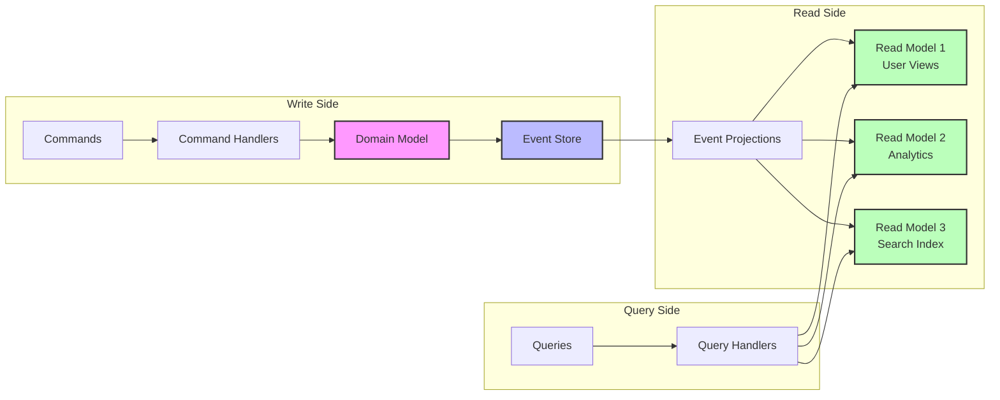

<!-- Navigation -->
[Home](/) → [Part III: Patterns](/patterns/) → **CQRS (Command Query Responsibility Segregation)**


# CQRS (Command Query Responsibility Segregation)

**Separate read and write models for optimized performance - Different problems need different solutions**

> *"Don't force a single model to serve two masters - let reads and writes each have their optimal design"*

---

## 🎯 Pattern Overview

### The Problem
Traditional CRUD systems use the same model for both reads and writes, creating fundamental conflicts:
- **Write operations need**: Strong consistency, complex validation, audit trails, normalization
- **Read operations need**: High performance, denormalization, caching, eventual consistency
- **Result**: Neither operation is optimized, leading to complex, slow systems

### The Solution
Separate the read and write sides of your system into distinct models:
- **Command side**: Handles writes with rich domain logic and consistency
- **Query side**: Handles reads with denormalized, pre-computed views
- **Event stream**: Connects both sides asynchronously

### When to Use

| ✅ Use When | ❌ Don't Use When |
|-------------|-------------------|
| • Read/write patterns differ significantly | • Simple CRUD is sufficient |
| • Complex domain logic for writes | • Low traffic applications |
| • Multiple read models needed | • Strong consistency required for all reads |
| • Performance optimization critical | • Team lacks event-driven experience |
| • Event sourcing already in use | • Maintenance complexity exceeds benefits |

---

## 🏗️ Architecture & Implementation

### Conceptual Model



### Key Components

| Component | Purpose | Responsibilities |
|-----------|---------|------------------|
| **Command Handlers** | Process write operations | • Validate commands<br>• Execute business logic<br>• Emit domain events |
| **Domain Model** | Encapsulate business rules | • Enforce invariants<br>• Generate events<br>• Maintain consistency |
| **Event Store** | Persist domain events | • Store events immutably<br>• Provide event streaming<br>• Support replay |
| **Event Projections** | Build read models | • Subscribe to events<br>• Update read models<br>• Handle idempotency |
| **Query Handlers** | Process read operations | • Route to correct model<br>• Apply filters/pagination<br>• Cache results |

### Implementation Example

```python
from dataclasses import dataclass
from datetime import datetime
from typing import List, Dict, Any
from abc import ABC, abstractmethod
import asyncio
from collections import defaultdict

# Command Side - Rich Domain Model
@dataclass
class Command(ABC):
    """Base command class"""
    timestamp: datetime = None
    
    def __post_init__(self):
        if not self.timestamp:
            self.timestamp = datetime.utcnow()

@dataclass
class CreateAccountCommand(Command):
    account_id: str
    owner_name: str
    initial_balance: float = 0.0

@dataclass
class DepositMoneyCommand(Command):
    account_id: str
    amount: float

# Domain Events
@dataclass
class DomainEvent(ABC):
    aggregate_id: str
    event_id: str
    timestamp: datetime
    version: int

@dataclass
class AccountCreatedEvent(DomainEvent):
    owner_name: str
    initial_balance: float

@dataclass
class MoneyDepositedEvent(DomainEvent):
    amount: float
    balance_after: float

# Domain Model with Business Logic
class BankAccount:
    def __init__(self, account_id: str):
        self.account_id = account_id
        self.balance = 0.0
        self.owner_name = None
        self.version = 0
        self.pending_events = []
        
    @classmethod
    def create(cls, command: CreateAccountCommand) -> 'BankAccount':
        """Factory method for creating new account"""
        account = cls(command.account_id)
        
        # Business rule: Initial balance cannot be negative
        if command.initial_balance < 0:
            raise ValueError("Initial balance cannot be negative")
            
        event = AccountCreatedEvent(
            aggregate_id=command.account_id,
            event_id=f"{command.account_id}-1",
            timestamp=command.timestamp,
            version=1,
            owner_name=command.owner_name,
            initial_balance=command.initial_balance
        )
        
        account._apply_event(event)
        account.pending_events.append(event)
        return account
        
    def deposit(self, command: DepositMoneyCommand):
        """Handle money deposit with validation"""
        # Business rule: Deposit amount must be positive
        if command.amount <= 0:
            raise ValueError("Deposit amount must be positive")
            
        # Business rule: Maximum single deposit
        if command.amount > 1_000_000:
            raise ValueError("Single deposit cannot exceed $1M")
            
        new_balance = self.balance + command.amount
        
        event = MoneyDepositedEvent(
            aggregate_id=self.account_id,
            event_id=f"{self.account_id}-{self.version + 1}",
            timestamp=command.timestamp,
            version=self.version + 1,
            amount=command.amount,
            balance_after=new_balance
        )
        
        self._apply_event(event)
        self.pending_events.append(event)
        
    def _apply_event(self, event: DomainEvent):
        """Apply event to update state"""
        if isinstance(event, AccountCreatedEvent):
            self.owner_name = event.owner_name
            self.balance = event.initial_balance
        elif isinstance(event, MoneyDepositedEvent):
            self.balance = event.balance_after
            
        self.version = event.version

# Event Store
class EventStore:
    def __init__(self):
        self.events: Dict[str, List[DomainEvent]] = defaultdict(list)
        self.subscribers = []
        
    async def save_events(self, aggregate_id: str, events: List[DomainEvent]):
        """Persist events and notify subscribers"""
        for event in events:
            self.events[aggregate_id].append(event)
            
            # Notify all subscribers asynchronously
            for subscriber in self.subscribers:
                asyncio.create_task(subscriber(event))
                
    def get_events(self, aggregate_id: str) -> List[DomainEvent]:
        """Retrieve all events for an aggregate"""
        return self.events.get(aggregate_id, [])
        
    def subscribe(self, handler):
        """Subscribe to event stream"""
        self.subscribers.append(handler)

# Command Handler
class BankAccountCommandHandler:
    def __init__(self, event_store: EventStore):
        self.event_store = event_store
        self.accounts = {}  # In-memory cache
        
    async def handle_create_account(self, command: CreateAccountCommand):
        """Process account creation command"""
        # Check if account already exists
        if command.account_id in self.accounts:
            raise ValueError(f"Account {command.account_id} already exists")
            
        # Create account through domain model
        account = BankAccount.create(command)
        
        # Save events
        await self.event_store.save_events(account.account_id, account.pending_events)
        
        # Cache aggregate
        self.accounts[account.account_id] = account
        
    async def handle_deposit(self, command: DepositMoneyCommand):
        """Process deposit command"""
        # Load or reconstruct aggregate
        account = await self._load_account(command.account_id)
        
        # Execute business logic
        account.deposit(command)
        
        # Save events
        await self.event_store.save_events(account.account_id, account.pending_events)
        
    async def _load_account(self, account_id: str) -> BankAccount:
        """Load account from cache or event store"""
        if account_id in self.accounts:
            return self.accounts[account_id]
            
        # Reconstruct from events
        events = self.event_store.get_events(account_id)
        if not events:
            raise ValueError(f"Account {account_id} not found")
            
        account = BankAccount(account_id)
        for event in events:
            account._apply_event(event)
            
        self.accounts[account_id] = account
        return account

# Query Side - Optimized Read Models
class AccountReadModel:
    """Denormalized read model for account queries"""
    
    def __init__(self):
        self.accounts = {}
        self.high_value_accounts = set()
        self.accounts_by_owner = defaultdict(list)
        
    async def project_event(self, event: DomainEvent):
        """Update read model based on events"""
        if isinstance(event, AccountCreatedEvent):
            self.accounts[event.aggregate_id] = {
                'account_id': event.aggregate_id,
                'owner_name': event.owner_name,
                'balance': event.initial_balance,
                'created_at': event.timestamp,
                'last_updated': event.timestamp,
                'transaction_count': 0
            }
            self.accounts_by_owner[event.owner_name].append(event.aggregate_id)
            
        elif isinstance(event, MoneyDepositedEvent):
            if event.aggregate_id in self.accounts:
                account = self.accounts[event.aggregate_id]
                account['balance'] = event.balance_after
                account['last_updated'] = event.timestamp
                account['transaction_count'] += 1
                
                # Update high-value index
                if event.balance_after >= 100_000:
                    self.high_value_accounts.add(event.aggregate_id)
                    
    def get_account(self, account_id: str) -> Dict[str, Any]:
        """Get account details"""
        return self.accounts.get(account_id)
        
    def get_high_value_accounts(self) -> List[Dict[str, Any]]:
        """Get all high-value accounts"""
        return [self.accounts[aid] for aid in self.high_value_accounts]
        
    def get_accounts_by_owner(self, owner_name: str) -> List[Dict[str, Any]]:
        """Get all accounts for an owner"""
        account_ids = self.accounts_by_owner.get(owner_name, [])
        return [self.accounts[aid] for aid in account_ids]

# Query Handler
class AccountQueryHandler:
    def __init__(self, read_model: AccountReadModel):
        self.read_model = read_model
        
    async def get_account_details(self, account_id: str) -> Dict[str, Any]:
        """Query account details"""
        account = self.read_model.get_account(account_id)
        if not account:
            raise ValueError(f"Account {account_id} not found")
        return account
        
    async def get_high_value_accounts(self) -> List[Dict[str, Any]]:
        """Query high-value accounts"""
        return self.read_model.get_high_value_accounts()
        
    async def get_owner_portfolio(self, owner_name: str) -> Dict[str, Any]:
        """Query all accounts for an owner"""
        accounts = self.read_model.get_accounts_by_owner(owner_name)
        
        return {
            'owner': owner_name,
            'account_count': len(accounts),
            'total_balance': sum(a['balance'] for a in accounts),
            'accounts': accounts
        }

# Wire everything together
async def setup_cqrs_system():
    """Initialize CQRS system with event flow"""
    # Create components
    event_store = EventStore()
    command_handler = BankAccountCommandHandler(event_store)
    read_model = AccountReadModel()
    query_handler = AccountQueryHandler(read_model)
    
    # Subscribe read model to events
    event_store.subscribe(read_model.project_event)
    
    return command_handler, query_handler

# Example usage
async def example_usage():
    command_handler, query_handler = await setup_cqrs_system()
    
    # Execute commands
    await command_handler.handle_create_account(
        CreateAccountCommand(
            account_id="ACC-001",
            owner_name="John Doe",
            initial_balance=1000.0
        )
    )
    
    await command_handler.handle_deposit(
        DepositMoneyCommand(
            account_id="ACC-001",
            amount=50000.0
        )
    )
    
    # Query read models
    account = await query_handler.get_account_details("ACC-001")
    print(f"Account balance: ${account['balance']:,.2f}")
    
    portfolio = await query_handler.get_owner_portfolio("John Doe")
    print(f"Total portfolio value: ${portfolio['total_balance']:,.2f}")
```

---

## 📊 Analysis & Trade-offs

### Axiom Relationships

| Axiom | How CQRS Addresses It |
|-------|----------------------|
| **Latency** | Read models optimized for query patterns, no joins needed |
| **Capacity** | Independent scaling of read and write sides |
| **Failure** | Read side can serve stale data if write side fails |
| **Concurrency** | Event ordering provides natural concurrency control |
| **Coordination** | Asynchronous projection reduces coordination needs |
| **Observability** | Event stream provides complete audit trail |
| **Human Interface** | Clear separation of concerns aids understanding |
| **Economics** | Optimize storage/compute separately for reads and writes |

### Trade-off Analysis

| Aspect | Gains | Losses |
|--------|-------|--------|
| **Performance** | Optimized read queries, no joins | Eventual consistency lag |
| **Complexity** | Clear boundaries, single responsibility | More moving parts |
| **Reliability** | Read availability during write failures | Potential inconsistency windows |
| **Cost** | Efficient resource usage | Additional infrastructure |

### Common Pitfalls

1. **Over-engineering Simple CRUD**
   - **Problem**: Applying CQRS to simple forms
   - **Solution**: Use only when read/write patterns truly differ

2. **Ignoring Eventual Consistency**
   - **Problem**: Assuming immediate consistency
   - **Solution**: Design UI to handle propagation delay

3. **Event Schema Evolution**
   - **Problem**: Changing event structure breaks projections
   - **Solution**: Version events, support multiple versions

4. **Missing Events**
   - **Problem**: Projection falls out of sync
   - **Solution**: Event sequence numbers, replay capability

5. **Complex Transactions**
   - **Problem**: ACID transactions across aggregates
   - **Solution**: Saga pattern for distributed transactions

---

## 🔧 Practical Considerations

### Configuration Guidelines

| Parameter | Description | Typical Range | Default |
|-----------|-------------|---------------|---------|
| **Projection Lag** | Max acceptable read delay | 100ms - 5s | 1s |
| **Event Retention** | How long to keep events | 30d - ∞ | 90d |
| **Snapshot Interval** | Events before snapshot | 100 - 1000 | 500 |
| **Read Model Cache** | Cache TTL for queries | 1s - 5min | 30s |

### Monitoring & Metrics

| Metric | What It Tells You | Alert Threshold |
|--------|-------------------|-----------------|
| **Projection Lag** | Read model freshness | > 5 seconds |
| **Event Rate** | Write throughput | > 10k/sec |
| **Query Latency** | Read performance | > 100ms p99 |
| **Failed Projections** | Sync issues | > 10/minute |

### Integration Patterns

How CQRS works with other patterns:
- **With Event Sourcing**: Natural fit, events drive projections
- **With Microservices**: Each service can have its own CQRS
- **With Saga Pattern**: Commands trigger distributed transactions
- **With API Gateway**: Route reads/writes to different endpoints

---

## 🚀 Real-World Examples

### Example 1: Shopify Order Management
- **Challenge**: 1M+ merchants querying orders while processing new ones
- **Implementation**: 
  - Write side: Strong consistency for order placement
  - Read side: Multiple projections (by merchant, by product, by date)
  - Result: 10x query performance improvement
- **Results**: 
  - Read latency: 500ms → 50ms
  - Write throughput: 10k → 100k orders/sec
  - System load: 80% → 30% CPU usage

### Example 2: LinkedIn Feed Generation
- **Challenge**: Generate personalized feeds for 800M users
- **Implementation**:
  - Write side: Post creation with rich validation
  - Read side: Pre-computed feed projections per user segment
  - ML models consume event stream for recommendations
- **Results**:
  - Feed generation: 2s → 200ms
  - Infrastructure cost: 40% reduction
  - User engagement: 25% increase

---

## 🎓 Key Takeaways

1. **Core Insight**: Separate models for separate concerns - don't force one model to do everything
2. **When It Shines**: Systems with complex queries, different read/write patterns, high scale
3. **What to Watch**: Eventual consistency, increased complexity, event schema evolution
4. **Remember**: CQRS is not all-or-nothing - apply it to specific bounded contexts where it adds value

---

*"The question is not whether to use one model or two, but whether your single model is serving both masters poorly."*

---

**Previous**: [← Consensus Pattern](consensus.md) | **Next**: [Distributed Lock Pattern →](distributed-lock.md)

**Related**: [Event Sourcing](/patterns/event-sourcing/) • [Saga](/patterns/saga/) • [Event Driven](/patterns/event-driven/)
