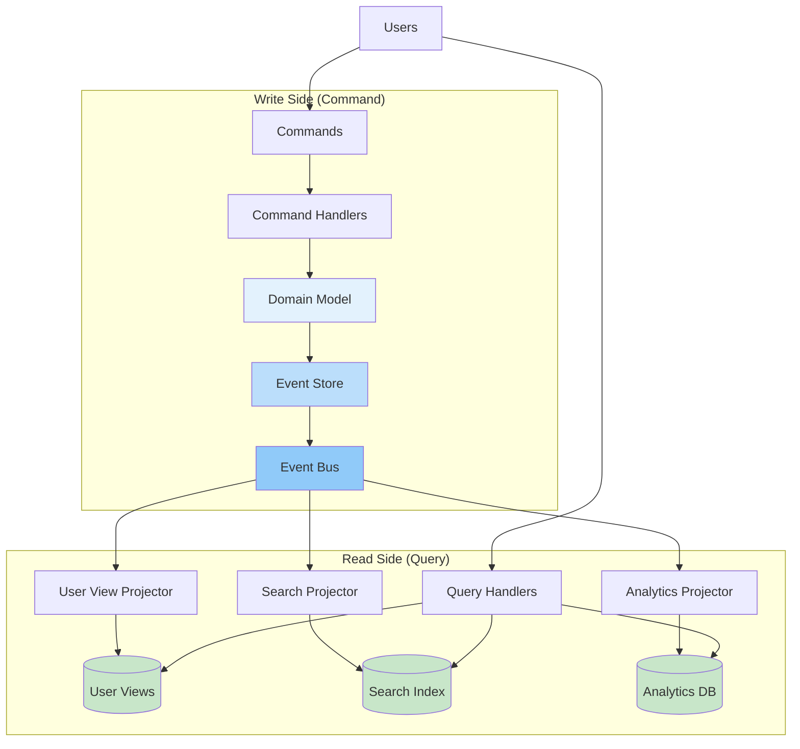

# CQRS (Command Query Responsibility Segregation)

  Architectural Pattern
  

    

      Separate read and write models to independently optimize complex business operations and high-performance queries.
    

    

      Law 2: Asynchronous Reality
      Law 4: Multidimensional Optimization
    

  

## Problem Statement

**How can we optimize both complex business operations and high-performance queries when they have fundamentally different requirements?**

!!! tip "When to Use This Pattern"
    | Scenario | Use CQRS | Alternative |
    |----------|----------|-------------|
    | Read/write ratio > 10:1 | ✅ Yes | Consider read replicas |
    | Complex domain logic | ✅ Yes | Traditional layered architecture |
    | Different scaling needs | ✅ Yes | Vertical scaling |
    | Multiple query views needed | ✅ Yes | Database views |
    | Audit trail required | ✅ Yes | Simple logging |
    | Simple CRUD operations | ❌ No | Traditional CRUD |
    | Small teams (< 3 developers) | ❌ No | Monolithic architecture |
    | Low traffic (< 1K requests/day) | ❌ No | Simple database |

## Solution Architecture

## Implementation Considerations

### Trade-offs

<table class="responsive-table">
<thead>
  <tr>
    <th>Aspect</th>
    <th>Benefit</th>
    <th>Cost</th>
  </tr>
</thead>
<tbody>
  <tr>
    <td data-label="Aspect">Performance</td>
    <td data-label="Benefit">Independent optimization</td>
    <td data-label="Cost">Eventual consistency</td>
  </tr>
  <tr>
    <td data-label="Aspect">Scalability</td>
    <td data-label="Benefit">Scale reads/writes separately</td>
    <td data-label="Cost">Infrastructure complexity</td>
  </tr>
  <tr>
    <td data-label="Aspect">Development</td>
    <td data-label="Benefit">Clear separation of concerns</td>
    <td data-label="Cost">Event synchronization logic</td>
  </tr>
  <tr>
    <td data-label="Aspect">Query Flexibility</td>
    <td data-label="Benefit">Multiple optimized views</td>
    <td data-label="Cost">Projection maintenance</td>
  </tr>
</tbody>
</table>

### Key Metrics

  

    
Write Latency

    
P99: < 200ms

  

  

    
Read Latency

    
P99: < 50ms

  

  

    
Projection Lag

    
< 5 seconds

  

  

    
Consistency

    
Eventually consistent

  

## Real-World Examples

!!! abstract "Production Implementation"
    - **LinkedIn**: Used CQRS for their feed system, handling 1B+ reads/day with < 50ms P99 latency
    - **Netflix**: Implemented CQRS for their viewing history, enabling personalized recommendations at scale
    - **Uber**: Applied CQRS to their trip data, supporting real-time analytics while maintaining transactional integrity
    - **Amazon**: Uses CQRS for product catalog, serving millions of queries while processing inventory updates

## Common Pitfalls

!!! danger "What Can Go Wrong"
    1. **Synchronous Projections**: Updating read models in write transaction eliminates performance benefits. Use asynchronous event processing instead.
    2. **Missing Event Versioning**: Schema changes break event replay. Implement event versioning from day one.
    3. **Over-Engineering**: Applying CQRS to simple CRUD operations adds unnecessary complexity. Start with traditional architecture for simple domains.
    4. **Ignoring Consistency Requirements**: Some operations need immediate consistency. Use consistency tokens or polling for critical reads.
    5. **Poor Error Handling**: Failed projections create data inconsistencies. Implement dead letter queues and replay mechanisms.

## Related Patterns

- [Event Sourcing](event-sourcing.md) - Natural companion for event-driven CQRS
- [Saga Pattern](saga.md) - Handling distributed transactions with CQRS
- [Event-Driven Architecture](event-driven.md) - Foundation for CQRS communication
- [Service Mesh](service-mesh.md) - Infrastructure for distributed CQRS systems

## Further Reading

- [Greg Young's CQRS Documents](https://cqrs.files.wordpress.com/2010/11/cqrs_documents.pdf) - Original CQRS papers
- [Martin Fowler's CQRS Article](https://martinfowler.com/bliki/CQRS.html) - Clear introduction
- [Microsoft CQRS Journey](https://docs.microsoft.com/en-us/previous-versions/msp-n-p/jj554200(v=pandp.10)) - Detailed implementation guide

