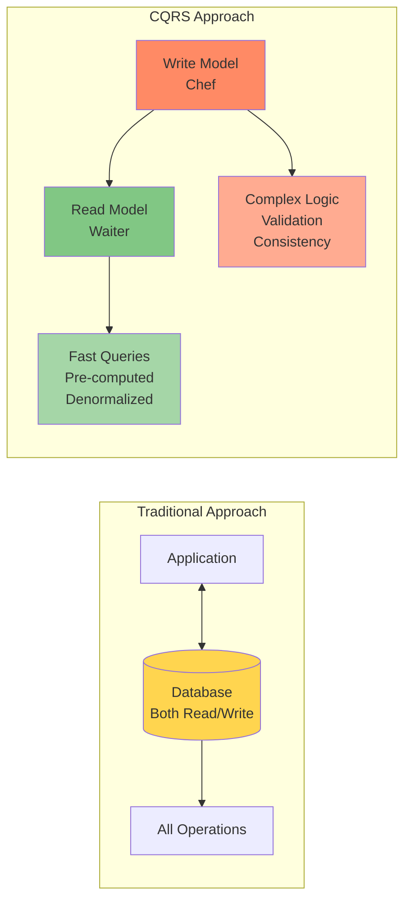

# CQRS (Command Query Responsibility Segregation)

<div class="navigation-breadcrumb">
<a href="/">Home</a> > <a href="/patterns/">Patterns</a> > CQRS
</div>

> "Don't force a single model to serve two masters - let reads and writes each have their optimal design"
> — Greg Young, CQRS Pioneer

## The Essential Question

**How can we optimize both complex business operations and high-performance queries when they have fundamentally different requirements?**

---

## Level 1: Intuition (5 minutes)

### The Story

A restaurant with one person being both chef and waiter fails at both jobs. The chef needs complex recipe execution; the waiter needs fast customer service.

CQRS separates these concerns: chefs handle food preparation (writes), waiters handle customer service (reads).

### Visual Metaphor



### In One Sentence

**CQRS**: Separate write operations (commands) from read operations (queries) into independently optimized models.

### Real-World Parallel

Like newspapers: writers carefully edit articles (write model), while printed papers optimize for reading with headlines and sections (read model).

---

## Level 2: Foundation (10 minutes)

### The Problem Space

<div class="failure-vignette">
<h4>🔥 Without CQRS: Amazon.com Outage</h4>
Sale event: Same database handled inventory updates and customer browsing. Write-optimized system made reads slow → timeouts → lost sales.
</div>

### Core Concept

CQRS splits applications:

1. **Command Side (Write Model)**
   - Handles modifications
   - Enforces business rules
   - Optimized for consistency
   - Normalized data

2. **Query Side (Read Model)**
   - Handles retrieval
   - Query-optimized
   - Multiple representations
   - Denormalized views

Sides communicate via events.

### Basic Architecture


### Key Benefits

1. **Performance**: Optimized for specific use
2. **Scalability**: Independent scaling
3. **Flexibility**: Multiple read models
4. **Simplicity**: Single responsibility

### Trade-offs

| Aspect | Gain | Cost |
|--------|------|------|
| Performance | Optimized queries, no joins | Eventual consistency delay |
| Complexity | Clear separation of concerns | More moving parts |
| Scalability | Independent scaling | Additional infrastructure |
| Development | Simpler individual models | Event synchronization logic |

---

## Level 3: Deep Dive (20 minutes)

### Detailed Architecture


### Implementation Patterns

#### Basic Implementation

```python
from abc import ABC, abstractmethod
from dataclasses import dataclass
from datetime import datetime
from typing import List, Dict, Any, Optional
import uuid

# Command Side - Commands and Events
@dataclass
class Command(ABC):
    command_id: str = None
    timestamp: datetime = None
    
    def __post_init__(self):
        if not self.command_id:
            self.command_id = str(uuid.uuid4())
        if not self.timestamp:
            self.timestamp = datetime.utcnow()

@dataclass
class CreateOrderCommand(Command):
    customer_id: str
    items: List[Dict[str, Any]]
    shipping_address: str

@dataclass
class DomainEvent(ABC):
    aggregate_id: str
    event_id: str = None
    timestamp: datetime = None
    version: int = 1
    
    def __post_init__(self):
        if not self.event_id:
            self.event_id = str(uuid.uuid4())
        if not self.timestamp:
            self.timestamp = datetime.utcnow()

@dataclass
class OrderCreatedEvent(DomainEvent):
    customer_id: str
    items: List[Dict[str, Any]]
    total_amount: float
    status: str = "PENDING"

# Domain Model
class Order:
    def __init__(self, order_id: str):
        self.order_id = order_id
        self.customer_id = None
        self.items = []
        self.total_amount = 0.0
        self.status = None
        self.version = 0
        self.pending_events = []
    
    @classmethod
    def create(cls, command: CreateOrderCommand) -> 'Order':
        order = cls(str(uuid.uuid4()))
        
        # Business rule: Minimum order amount
        total = sum(item['price'] * item['quantity'] for item in command.items)
        if total < 10.0:
            raise ValueError("Minimum order amount is $10")
        
        event = OrderCreatedEvent(
            aggregate_id=order.order_id,
            customer_id=command.customer_id,
            items=command.items,
            total_amount=total
        )
        
        order._apply_event(event)
        order.pending_events.append(event)
        return order
    
    def _apply_event(self, event: DomainEvent):
        if isinstance(event, OrderCreatedEvent):
            self.customer_id = event.customer_id
            self.items = event.items
            self.total_amount = event.total_amount
            self.status = event.status
        self.version = event.version

# Command Handler
class OrderCommandHandler:
    def __init__(self, event_store, order_repository):
        self.event_store = event_store
        self.order_repository = order_repository
    
    async def handle_create_order(self, command: CreateOrderCommand):
        # Create order through domain model
        order = Order.create(command)
        
        # Save events
        await self.event_store.append(order.order_id, order.pending_events)
        
        # Save snapshot (optional)
        await self.order_repository.save(order)
        
        return order.order_id
```

#### Production-Ready Implementation

```python
import asyncio
from contextlib import asynccontextmanager
from typing import AsyncIterator
import logging
import json
from dataclasses import asdict

# Production Event Store with proper error handling
class EventStore:
    def __init__(self, connection_pool, config):
        self.pool = connection_pool
        self.config = config
        self.logger = logging.getLogger(__name__)
        self.subscribers = []
        self.retry_policy = RetryPolicy(max_attempts=3)
    
    async def append(self, aggregate_id: str, events: List[DomainEvent]):
        """Append events with transactional guarantees"""
        async with self._transaction() as tx:
            try:
                # Check for concurrent modifications
                current_version = await self._get_aggregate_version(aggregate_id, tx)
                
                for event in events:
                    if event.version <= current_version:
                        raise ConcurrencyException(
                            f"Version conflict: expected {event.version}, found {current_version}"
                        )
                    
                    # Persist event
                    await self._insert_event(aggregate_id, event, tx)
                    
                    # Update aggregate version
                    current_version = event.version
                
                await tx.commit()
                
                # Publish events after successful commit
                await self._publish_events(events)
                
            except Exception as e:
                await tx.rollback()
                self.logger.error(f"Failed to append events: {e}")
                raise
    
    async def _publish_events(self, events: List[DomainEvent]):
        """Publish events to subscribers with retry logic"""
        tasks = []
        for event in events:
            for subscriber in self.subscribers:
                task = self._publish_with_retry(subscriber, event)
                tasks.append(task)
        
        # Wait for all publications with timeout
        await asyncio.gather(*tasks, return_exceptions=True)
    
    @asynccontextmanager
    async def _transaction(self) -> AsyncIterator:
        """Database transaction context manager"""
        conn = await self.pool.acquire()
        tx = await conn.begin()
        try:
            yield tx
        finally:
            await self.pool.release(conn)

# Production Read Model Projector
class ReadModelProjector:
    def __init__(self, read_db, cache, config):
        self.read_db = read_db
        self.cache = cache
        self.config = config
        self.logger = logging.getLogger(__name__)
        self.projection_handlers = {}
        self.checkpoint_manager = CheckpointManager(read_db)
    
    def register_handler(self, event_type: type, handler):
        """Register projection handler for event type"""
        self.projection_handlers[event_type] = handler
    
    async def project_event(self, event: DomainEvent):
        """Project event to read model with error handling"""
        event_type = type(event)
        handler = self.projection_handlers.get(event_type)
        
        if not handler:
            self.logger.warning(f"No handler for event type: {event_type}")
            return
        
        try:
            # Load checkpoint
            checkpoint = await self.checkpoint_manager.get_checkpoint(
                f"{event_type.__name__}_projection"
            )
            
            # Skip if already processed
            if checkpoint and event.timestamp <= checkpoint:
                return
            
            # Project event
            async with self.read_db.transaction() as tx:
                await handler(event, tx)
                
                # Update checkpoint
                await self.checkpoint_manager.update_checkpoint(
                    f"{event_type.__name__}_projection",
                    event.timestamp,
                    tx
                )
            
            # Invalidate relevant caches
            await self._invalidate_caches(event)
            
        except Exception as e:
            self.logger.error(f"Projection failed for {event.event_id}: {e}")
            # Could implement dead letter queue here
            raise

# Optimized Query Handler with caching
class OrderQueryHandler:
    def __init__(self, read_db, cache, config):
        self.read_db = read_db
        self.cache = cache
        self.config = config
        self.logger = logging.getLogger(__name__)
    
    async def get_order_details(self, order_id: str) -> Dict[str, Any]:
        """Get order with caching and fallback"""
        # Try cache first
        cache_key = f"order:{order_id}"
        cached = await self.cache.get(cache_key)
        if cached:
            return json.loads(cached)
        
        # Query read model
        try:
            async with self.read_db.acquire() as conn:
                result = await conn.fetchone("""
                    SELECT * FROM order_read_model 
                    WHERE order_id = $1
                """, order_id)
                
                if not result:
                    raise OrderNotFoundException(order_id)
                
                order_data = dict(result)
                
                # Cache for future queries
                await self.cache.setex(
                    cache_key,
                    self.config.cache_ttl,
                    json.dumps(order_data, default=str)
                )
                
                return order_data
                
        except Exception as e:
            self.logger.error(f"Failed to query order {order_id}: {e}")
            
            # Try stale cache as fallback
            stale = await self.cache.get(f"{cache_key}:stale")
            if stale:
                return json.loads(stale)
            
            raise
```

### State Management

CQRS manages state differently on each side:


### Common Variations

1. **CQRS + Event Sourcing**: Audit trail needed → All changes as events
2. **CQRS + Sync Projections**: Immediate consistency → Higher latency
3. **CQRS + Multiple Stores**: Different query needs → Complex sync

### Integration Points

- **Event Sourcing**: Events drive projections
- **Saga Pattern**: Commands trigger distributed transactions
- **API Gateway**: Route commands/queries separately
- **Service Mesh**: Built-in read/write routing

---

## Level 4: Expert Practitioner (30 minutes)

### Advanced Techniques

#### Projection Rebuilding

```python
class ProjectionRebuilder:
    """Rebuild read models from event stream"""
    
    def __init__(self, event_store, projector, config):
        self.event_store = event_store
        self.projector = projector
        self.config = config
        self.logger = logging.getLogger(__name__)
    
    async def rebuild_projection(self, projection_name: str, 
                                 from_timestamp: datetime = None):
        """Rebuild a specific projection from events"""
        
        # Create new projection table
        new_table = f"{projection_name}_rebuild_{int(time.time())}"
        await self._create_projection_table(new_table)
        
        # Stream events and rebuild
        processed = 0
        async for event_batch in self.event_store.stream_events(
            from_timestamp=from_timestamp,
            batch_size=self.config.rebuild_batch_size
        ):
            try:
                # Project batch to new table
                await self._project_batch(event_batch, new_table)
                processed += len(event_batch)
                
                # Report progress
                if processed % 10000 == 0:
                    self.logger.info(f"Rebuilt {processed} events")
                    
            except Exception as e:
                self.logger.error(f"Rebuild failed at event {processed}: {e}")
                await self._cleanup_failed_rebuild(new_table)
                raise
        
        # Atomic swap
        await self._swap_projection_tables(projection_name, new_table)
        
        self.logger.info(f"Rebuilt {projection_name} with {processed} events")
```

#### Eventual Consistency Handling

```python
class ConsistencyManager:
    """Handle eventual consistency in CQRS"""
    
    def __init__(self, event_store, read_db, config):
        self.event_store = event_store
        self.read_db = read_db
        self.config = config
    
    async def wait_for_consistency(self, aggregate_id: str, 
                                   expected_version: int,
                                   timeout: float = 5.0):
        """Wait for read model to catch up to a specific version"""
        
        start_time = time.time()
        check_interval = 0.1
        
        while time.time() - start_time < timeout:
            # Check read model version
            current_version = await self._get_read_model_version(aggregate_id)
            
            if current_version >= expected_version:
                return True
            
            # Exponential backoff
            await asyncio.sleep(check_interval)
            check_interval = min(check_interval * 1.5, 1.0)
        
        # Timeout - check if events are stuck
        stuck_events = await self._check_stuck_events(aggregate_id, expected_version)
        if stuck_events:
            await self._retry_stuck_events(stuck_events)
        
        return False
    
    async def get_consistent_read(self, aggregate_id: str,
                                 consistency_token: str = None):
        """Get read with consistency guarantee"""
        
        if consistency_token:
            # Parse expected version from token
            expected_version = self._parse_consistency_token(consistency_token)
            
            # Wait for consistency
            consistent = await self.wait_for_consistency(
                aggregate_id, 
                expected_version
            )
            
            if not consistent:
                raise EventualConsistencyTimeout(
                    f"Read model not updated within {self.config.consistency_timeout}s"
                )
        
        # Return consistent read
        return await self.read_db.get(aggregate_id)
```

### Performance Optimization

<div class="decision-box">
<h4>🎯 Performance Tuning Checklist</h4>

- [ ] **Event Batching**: Process events in batches for projections
- [ ] **Parallel Projections**: Run independent projections concurrently
- [ ] **Snapshot Storage**: Store aggregate snapshots every N events
- [ ] **Read Model Indexes**: Optimize indexes for query patterns
- [ ] **Connection Pooling**: Separate pools for read/write
- [ ] **Caching Strategy**: Cache hot queries at multiple levels
- [ ] **Async Processing**: Use async/await throughout
- [ ] **Event Compression**: Compress large events in storage
</div>

### Monitoring & Observability

Key metrics to track:

```yaml
metrics:
  # Command Side Metrics
  - name: command_processing_time
    description: Time to process commands
    alert_threshold: p99 > 500ms
    
  - name: event_store_append_time
    description: Time to persist events
    alert_threshold: p99 > 100ms
    
  - name: command_rejection_rate
    description: Percentage of rejected commands
    alert_threshold: > 5%
    
  # Query Side Metrics  
  - name: projection_lag
    description: Time between event creation and projection
    alert_threshold: p99 > 5s
    
  - name: query_response_time
    description: Time to serve queries
    alert_threshold: p99 > 100ms
    
  - name: cache_hit_rate
    description: Percentage of queries served from cache
    alert_threshold: < 80%
    
  # Health Metrics
  - name: event_processing_failures
    description: Failed event projections per minute
    alert_threshold: > 10/min
    
  - name: consistency_check_failures
    description: Failed consistency checks
    alert_threshold: > 1%
```

### Common Pitfalls

<div class="failure-vignette">
<h4>⚠️ Pitfall: Synchronous Projections</h4>
Team updated read models in write transaction → No performance benefit, distributed transaction nightmare.

**Solution**: Project asynchronously. For immediate consistency: use tokens or polling.
</div>

<div class="failure-vignette">
<h4>⚠️ Pitfall: Forgetting Event Evolution</h4>
Team changed event structure without handling old events → All projections failed.

**Solution**: Version events immediately. Support multiple versions. Never modify existing events.
</div>

### Production Checklist

- [ ] **Event versioning strategy** implemented
- [ ] **Projection rebuild capability** tested
- [ ] **Monitoring for projection lag** configured
- [ ] **Dead letter queue** for failed projections
- [ ] **Consistency SLAs** defined and measured
- [ ] **Backup strategy** for both event store and read models
- [ ] **Performance testing** under expected load
- [ ] **Runbooks** for common issues (projection lag, rebuilds)

---

## Level 5: Mastery (45 minutes)

### Case Study: LinkedIn's Feed Architecture

<div class="truth-box">
<h4>🏢 Real-World Implementation</h4>

**Company**: LinkedIn  
**Scale**: 810M+ members, 10M+ posts/day, 100B+ impressions/month

**Challenge**: Personalized feeds with real-time posting.

**Write Side**: Post creation, privacy rules, spam checks, graph updates

**Read Side Projections**:
- Timeline Cache: Recent posts
- Follower Fanout: Pre-computed feeds
- Search Index: Full-text search
- Analytics Views: Engagement metrics
- ML Features: Recommendation data

**Architecture**:


**Results**:
- Latency: 2s → 200ms
- Cost: -40%
- Dev velocity: 3x
- Engagement: +25%

**Lessons**:
1. Start with critical read patterns
2. Event schema is critical
3. Monitor projection lag
4. Use specialized stores
</div>

### Economic Analysis

#### Cost Model

```python
def calculate_cqrs_roi(
    monthly_requests: int,
    read_write_ratio: float,
    avg_query_complexity: int,
    team_size: int
) -> dict:
    """Calculate ROI for implementing CQRS"""
    
    # Traditional approach costs
    traditional_costs = {
        'infrastructure': calculate_traditional_infra_cost(
            monthly_requests,
            avg_query_complexity
        ),
        'development': team_size * AVG_DEV_COST * 1.5,  # Complexity factor
        'operations': monthly_requests * 0.0001  # Per-request ops cost
    }
    
    # CQRS approach costs
    cqrs_costs = {
        'infrastructure': calculate_cqrs_infra_cost(
            monthly_requests,
            read_write_ratio
        ),
        'development': team_size * AVG_DEV_COST * 2.0,  # Initial complexity
        'operations': monthly_requests * 0.00008  # Lower per-request cost
    }
    
    # Benefits
    benefits = {
        'performance_improvement': 0.7,  # 70% latency reduction
        'scalability_headroom': 5.0,     # 5x more capacity
        'development_velocity': 1.5       # 50% faster after initial setup
    }
    
    # ROI calculation
    monthly_savings = (
        traditional_costs['infrastructure'] - cqrs_costs['infrastructure'] +
        traditional_costs['operations'] - cqrs_costs['operations']
    )
    
    payback_months = (
        (cqrs_costs['development'] - traditional_costs['development']) / 
        monthly_savings
    )
    
    return {
        'monthly_savings': monthly_savings,
        'payback_period_months': payback_months,
        'break_even_requests': monthly_requests * 0.3,  # 30% of current load
        'recommended': payback_months < 12 and read_write_ratio > 10
    }

# Example calculation
roi = calculate_cqrs_roi(
    monthly_requests=100_000_000,
    read_write_ratio=100,  # 100 reads per write
    avg_query_complexity=5,  # Number of joins
    team_size=5
)
print(f"ROI: ${roi['monthly_savings']:,.0f}/month, "
      f"Payback: {roi['payback_period_months']:.1f} months")
```

#### When It Pays Off

- **Break-even**: 10:1 read/write ratio + complex queries
- **High ROI**: E-commerce catalogs, social feeds, financial reports, CMS
- **Low ROI**: Simple CRUD, internal tools, basic queries

### Pattern Evolution


### Axiom Connections

<div class="axiom-box">
<h4>🔗 Fundamental Axioms</h4>

This pattern directly addresses:

1. **[Latency Axiom](../part1-axioms/axiom1-latency/index.md)**: Optimized read models eliminate complex queries
2. **[Capacity Axiom](../part1-axioms/axiom2-capacity/index.md)**: Independent scaling of read/write workloads  
3. **[Concurrency Axiom](../part1-axioms/axiom4-concurrency/index.md)**: Event ordering provides natural concurrency control
4. **[Coordination Axiom](../part1-axioms/axiom5-coordination/index.md)**: Asynchronous projections reduce coupling
5. **[Observability Axiom](../part1-axioms/axiom6-observability/index.md)**: Event stream provides complete audit trail
</div>

### Future Directions

**Emerging Trends**:

1. **Real-time Materialized Views**: Stream processors maintaining live projections
2. **ML-Driven Projections**: AI determining optimal read model structures
3. **Edge CQRS**: Read models pushed to edge locations
4. **Blockchain Integration**: Immutable event stores with cryptographic proofs

**What's Next**:
- Automatic projection optimization based on query patterns
- Declarative projection definitions
- Cross-region consistency protocols
- Integration with graph databases for complex relationships

---

## Quick Reference

### Decision Matrix


### Command Cheat Sheet

```bash
# Event Store Operations
event-store append <aggregate-id> <event-data>  # Append event
event-store stream <from-timestamp>             # Stream events
event-store replay <aggregate-id>               # Replay aggregate

# Projection Management  
projection rebuild <name> [--from-timestamp]    # Rebuild projection
projection status <name>                        # Check lag
projection pause <name>                         # Pause updates
projection resume <name>                        # Resume updates

# Monitoring Commands
cqrs-monitor lag                               # Show projection lag
cqrs-monitor throughput                        # Event throughput
cqrs-monitor errors                            # Recent errors
```

### Configuration Template

```yaml
# Production CQRS configuration
cqrs:
  command_side:
    event_store:
      type: "postgresql"  # or eventstore, kafka
      connection_pool_size: 20
      batch_size: 100
      retention_days: 2555  # 7 years
    
    snapshot:
      enabled: true
      frequency: 100  # Every 100 events
      storage: "s3"
    
    validation:
      timeout_ms: 5000
      retry_attempts: 3
  
  query_side:
    projections:
      - name: "user_view"
        storage: "postgresql"
        update_mode: "async"
        batch_size: 1000
        
      - name: "search_index"
        storage: "elasticsearch"
        update_mode: "async"
        batch_size: 500
    
    consistency:
      default_timeout_ms: 5000
      polling_interval_ms: 100
    
    caching:
      enabled: true
      ttl_seconds: 300
      size_mb: 1024
  
  monitoring:
    metrics_interval: 10s
    health_check_interval: 30s
    alerting:
      projection_lag_threshold: 10s
      error_rate_threshold: 0.01
```

---

## Related Resources

### Patterns
- [Event Sourcing](../patterns/event-sourcing.md) - Natural companion for event-driven CQRS
- [Saga Pattern](../patterns/saga.md) - Handling distributed transactions with CQRS
- [Event-Driven Architecture](../patterns/event-driven.md) - Foundation for CQRS communication

### Axioms
- [Latency Axiom](../part1-axioms/axiom1-latency/index.md) - Why read optimization matters
- [Concurrency Axiom](../part1-axioms/axiom4-concurrency/index.md) - Managing parallel operations
- [Coordination Axiom](../part1-axioms/axiom5-coordination/index.md) - Reducing system coupling

### Further Reading
- [Greg Young's CQRS Documents](https://cqrs.files.wordpress.com/2010/11/cqrs_documents.pdf) - Original CQRS papers
- [Martin Fowler's CQRS Article](https://martinfowler.com/bliki/CQRS.html) - Clear introduction
- [Event Store Documentation](https://eventstore.com/docs/) - Production event store
- [Microsoft CQRS Journey](https://docs.microsoft.com/en-us/previous-versions/msp-n-p/jj554200(v=pandp.10)) - Detailed implementation guide

### Tools & Libraries
- **Java**: Axon Framework - Complete CQRS/ES framework
- **C#/.NET**: MediatR, NEventStore - CQRS building blocks
- **Python**: Eventhorizon - Event sourcing with CQRS
- **Node.js**: Wolkenkit - CQRS/ES framework
- **Go**: EventStore, Watermill - Event streaming
- **Monitoring**: Prometheus + Grafana - Metrics and dashboards

---

<div class="navigation-links">
<div class="prev-link">
<a href="/patterns/queues-streaming">← Previous: Queues & Streaming</a>
</div>
<div class="next-link">
<a href="/patterns/event-driven">Next: Event-Driven Architecture →</a>
</div>
</div>