# CRDT (Conflict-free Replicated Data Types)

**Automatic conflict resolution for distributed data**

<div class="law-box">
<h4>The CRDT Convergence Theorem</h4>
<p>CRDTs guarantee that all replicas will eventually converge to the same state without requiring coordination, as long as all updates are eventually delivered to all replicas. This property, called Strong Eventual Consistency (SEC), is stronger than regular eventual consistency.</p>
</div>

## Overview

CRDTs are data structures that can be replicated across multiple nodes in a distributed system, where updates can be applied concurrently without coordination, and conflicts are automatically resolved. They achieve this through mathematical properties that ensure all operations either commute or can be merged deterministically.

### Key Properties

1. **Convergence**: All replicas eventually reach the same state
2. **Coordination-free**: No consensus or locking required
3. **Availability**: Can always accept updates
4. **Partition tolerance**: Works across network splits
5. **Automatic conflict resolution**: No manual intervention needed

## Visual CRDT Type Hierarchy

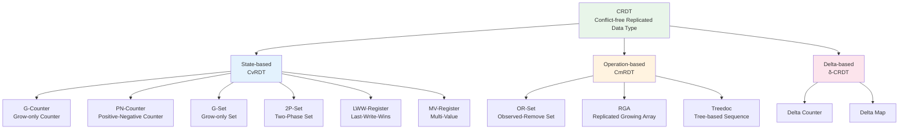

## CRDT Types and Convergence

### State-based CRDTs (CvRDT)

#### How State-based CRDTs Work

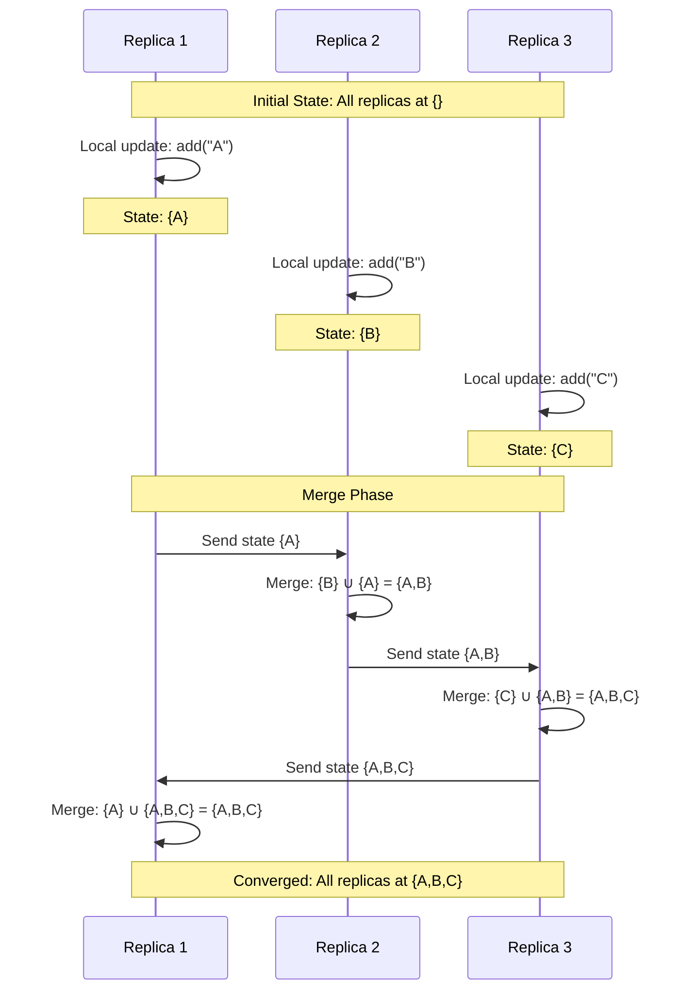

#### Join Semilattice Structure

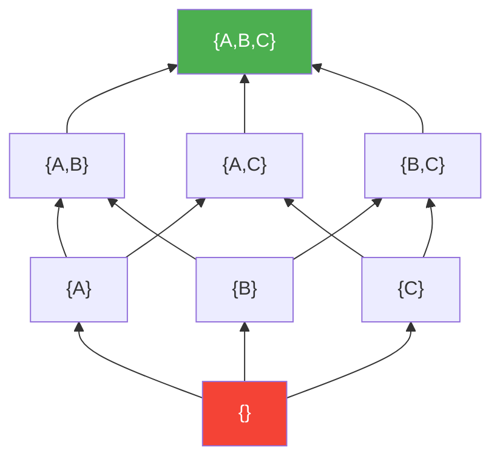

### Operation-based CRDTs (CmRDT)

#### How Operation-based CRDTs Work

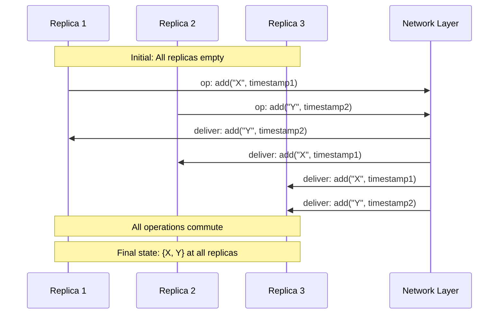

## Detailed CRDT Type Implementations

### 1. G-Counter (Grow-only Counter)

#### Visual Representation

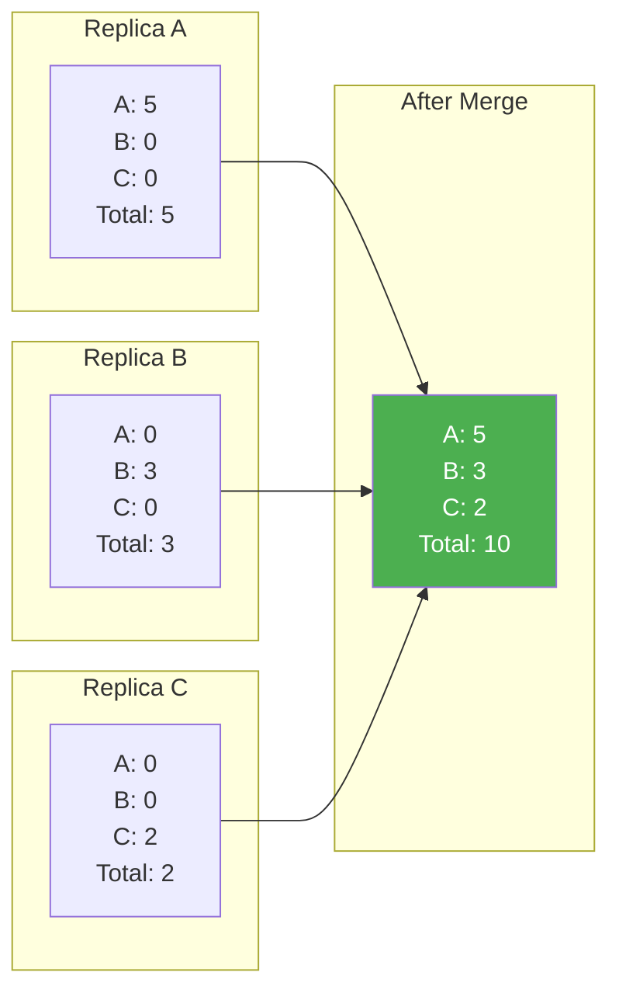

#### Python Implementation

```python
from typing import Dict, Set
import copy

class GCounter:
    """Grow-only Counter CRDT"""
    
    def __init__(self, node_id: str):
        self.node_id = node_id
        self.counts: Dict[str, int] = {}
    
    def increment(self, value: int = 1):
        """Increment counter for this node"""
        if self.node_id not in self.counts:
            self.counts[self.node_id] = 0
        self.counts[self.node_id] += value
    
    def value(self) -> int:
        """Get total count across all nodes"""
        return sum(self.counts.values())
    
    def merge(self, other: 'GCounter') -> 'GCounter':
        """Merge with another G-Counter"""
        merged = GCounter(self.node_id)
        
# Take maximum count for each node
        all_nodes = set(self.counts.keys()) | set(other.counts.keys())
        
        for node in all_nodes:
            merged.counts[node] = max(
                self.counts.get(node, 0),
                other.counts.get(node, 0)
            )
        
        return merged
    
    def __repr__(self):
        return f"GCounter({self.counts}, total={self.value()})"

# Example usage
def demo_gcounter():
# Three replicas
    counter_a = GCounter("A")
    counter_b = GCounter("B")
    counter_c = GCounter("C")
    
# Concurrent increments
    counter_a.increment(5)
    counter_b.increment(3)
    counter_c.increment(2)
    
    print("Before merge:")
    print(f"A: {counter_a}")
    print(f"B: {counter_b}")
    print(f"C: {counter_c}")
    
# Merge all replicas
    merged = counter_a.merge(counter_b).merge(counter_c)
    print(f"\nAfter merge: {merged}")
```

### 2. PN-Counter (Positive-Negative Counter)

#### Visual Representation

```mermaid
graph TB
    subgraph "PN-Counter Structure"
        PNC[PN-Counter]
        PNC --> P[P: Positive Counter<br/>G-Counter]
        PNC --> N[N: Negative Counter<br/>G-Counter]
        
        Value["Value = P.value() - N.value()"]
    end
    
    subgraph "Operations"
        Inc[increment()] --> P
        Dec[decrement()] --> N
    end
    
    P --> Value
    N --> Value
```

#### Implementation

```python
class PNCounter:
    """Positive-Negative Counter CRDT"""
    
    def __init__(self, node_id: str):
        self.node_id = node_id
        self.p_counter = GCounter(node_id)  # Positive counts
        self.n_counter = GCounter(node_id)  # Negative counts
    
    def increment(self, value: int = 1):
        """Increment the counter"""
        self.p_counter.increment(value)
    
    def decrement(self, value: int = 1):
        """Decrement the counter"""
        self.n_counter.increment(value)
    
    def value(self) -> int:
        """Get the current value"""
        return self.p_counter.value() - self.n_counter.value()
    
    def merge(self, other: 'PNCounter') -> 'PNCounter':
        """Merge with another PN-Counter"""
        merged = PNCounter(self.node_id)
        merged.p_counter = self.p_counter.merge(other.p_counter)
        merged.n_counter = self.n_counter.merge(other.n_counter)
        return merged
```

### 3. OR-Set (Observed-Remove Set)

#### Convergence Visualization

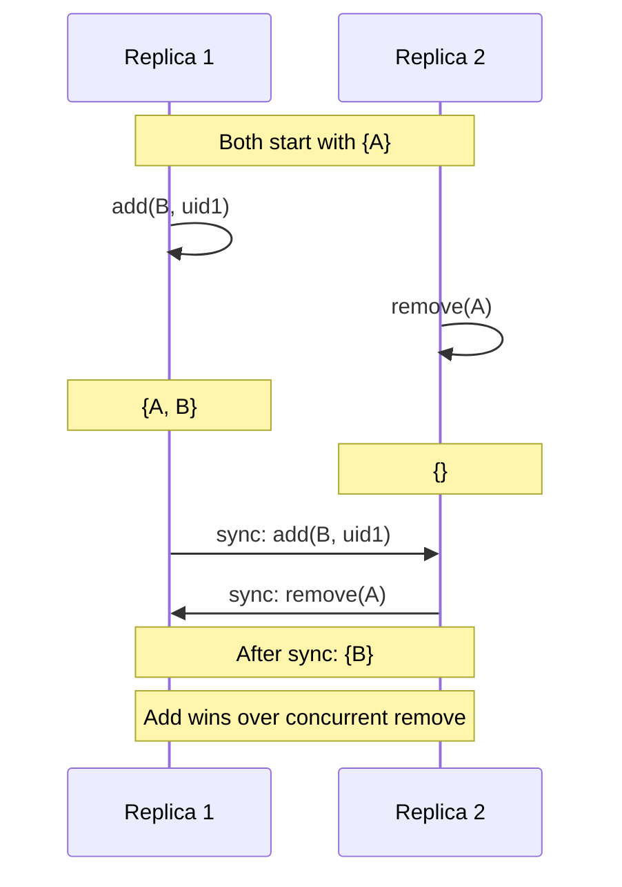

#### Implementation with Unique IDs

```python
import uuid
from typing import Set, Tuple, Any

class ORSet:
    """Observed-Remove Set CRDT"""
    
    def __init__(self):
# Elements are stored as (element, unique_id) pairs
        self.elements: Set[Tuple[Any, str]] = set()
        self.tombstones: Set[Tuple[Any, str]] = set()
    
    def add(self, element: Any) -> str:
        """Add element with unique ID"""
        uid = str(uuid.uuid4())
        self.elements.add((element, uid))
        return uid
    
    def remove(self, element: Any):
        """Remove all instances of element"""
# Move all pairs with this element to tombstones
        to_remove = {(e, uid) for e, uid in self.elements if e == element}
        self.tombstones.update(to_remove)
        self.elements -= to_remove
    
    def contains(self, element: Any) -> bool:
        """Check if element exists"""
        return any(e == element for e, _ in self.elements)
    
    def values(self) -> Set[Any]:
        """Get all unique elements"""
        return {e for e, _ in self.elements}
    
    def merge(self, other: 'ORSet') -> 'ORSet':
        """Merge with another OR-Set"""
        merged = ORSet()
        
# Union of all elements and tombstones
        all_elements = self.elements | other.elements
        all_tombstones = self.tombstones | other.tombstones
        
# Remove tombstoned elements
        merged.elements = all_elements - all_tombstones
        merged.tombstones = all_tombstones
        
        return merged
```

### 4. LWW-Register (Last-Write-Wins Register)

#### Conflict Resolution Visualization

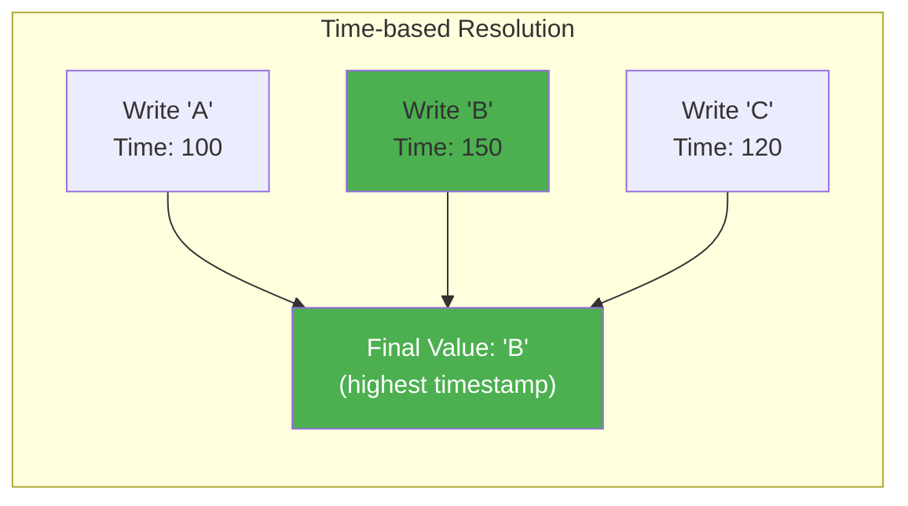

#### Implementation with Timestamps

```python
import time
from typing import Any, Optional, Tuple

class LWWRegister:
    """Last-Write-Wins Register CRDT"""
    
    def __init__(self, node_id: str):
        self.node_id = node_id
        self.value: Optional[Any] = None
        self.timestamp: float = 0
    
    def set(self, value: Any, timestamp: Optional[float] = None):
        """Set value with timestamp"""
        if timestamp is None:
            timestamp = time.time()
        
        if timestamp > self.timestamp:
            self.value = value
            self.timestamp = timestamp
    
    def get(self) -> Optional[Any]:
        """Get current value"""
        return self.value
    
    def merge(self, other: 'LWWRegister') -> 'LWWRegister':
        """Merge with another LWW-Register"""
        merged = LWWRegister(self.node_id)
        
# Choose value with highest timestamp
        if self.timestamp > other.timestamp:
            merged.value = self.value
            merged.timestamp = self.timestamp
        elif other.timestamp > self.timestamp:
            merged.value = other.value
            merged.timestamp = other.timestamp
        else:
# Tie-breaker: use node_id
            if self.node_id > other.node_id:
                merged.value = self.value
            else:
                merged.value = other.value
            merged.timestamp = self.timestamp
        
        return merged
```

### 5. MV-Register (Multi-Value Register)

#### Concurrent Value Handling

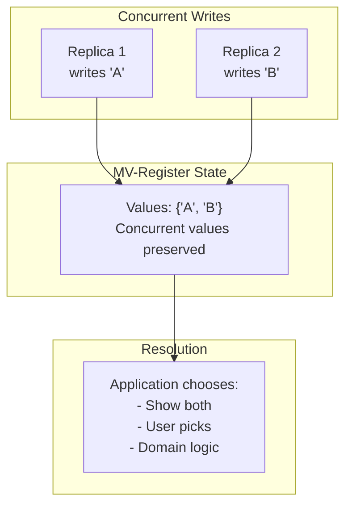

## CRDT Comparison Table

| CRDT Type | Operations | Use Case | Memory Overhead | Convergence Speed |
|-----------|------------|----------|-----------------|------------------|
| **G-Counter** | increment only | Page views, likes | Low (O(nodes)) | Fast |
| **PN-Counter** | increment, decrement | Account balances | Medium (2×G-Counter) | Fast |
| **G-Set** | add only | Append-only logs | Grows unbounded | Fast |
| **2P-Set** | add, remove once | Tombstoned items | Grows unbounded | Fast |
| **OR-Set** | add, remove | Shopping carts | High (unique IDs) | Fast |
| **LWW-Register** | set | Last value wins | Low | Fast |
| **MV-Register** | set | Preserve conflicts | Medium | Fast |
| **RGA** | insert, delete | Text editing | High | Medium |

## Network Partition Scenarios

### Partition Tolerance Visualization

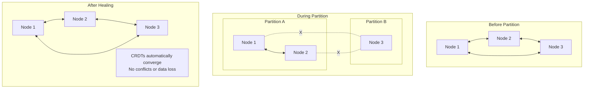

### Handling Network Partitions

```python
class PartitionTolerantCounter:
    """Example showing CRDT behavior during partition"""
    
    def simulate_partition():
# Three nodes start synchronized
        node1 = GCounter("node1")
        node2 = GCounter("node2")
        node3 = GCounter("node3")
        
# Initial increments
        node1.increment(10)
        
# Sync before partition
        node2 = node2.merge(node1)
        node3 = node3.merge(node1)
        
        print("Before partition:", node1.value())
        
# PARTITION OCCURS
# Nodes 1,2 can communicate
# Node 3 is isolated
        
# Operations during partition
        node1.increment(5)  # Only seen by node1,2
        node2.increment(3)  # Only seen by node1,2
        node3.increment(7)  # Only seen by node3
        
# Partial sync (1 and 2 only)
        node1 = node1.merge(node2)
        node2 = node2.merge(node1)
        
        print("During partition:")
        print(f"Nodes 1,2: {node1.value()}")
        print(f"Node 3: {node3.value()}")
        
# PARTITION HEALS
# Full sync
        merged = node1.merge(node3)
        node1 = node2 = node3 = merged
        
        print(f"After healing: {merged.value()}")
        print("All nodes converged!")
```

## Mathematical Properties

### Convergence Properties Visualized

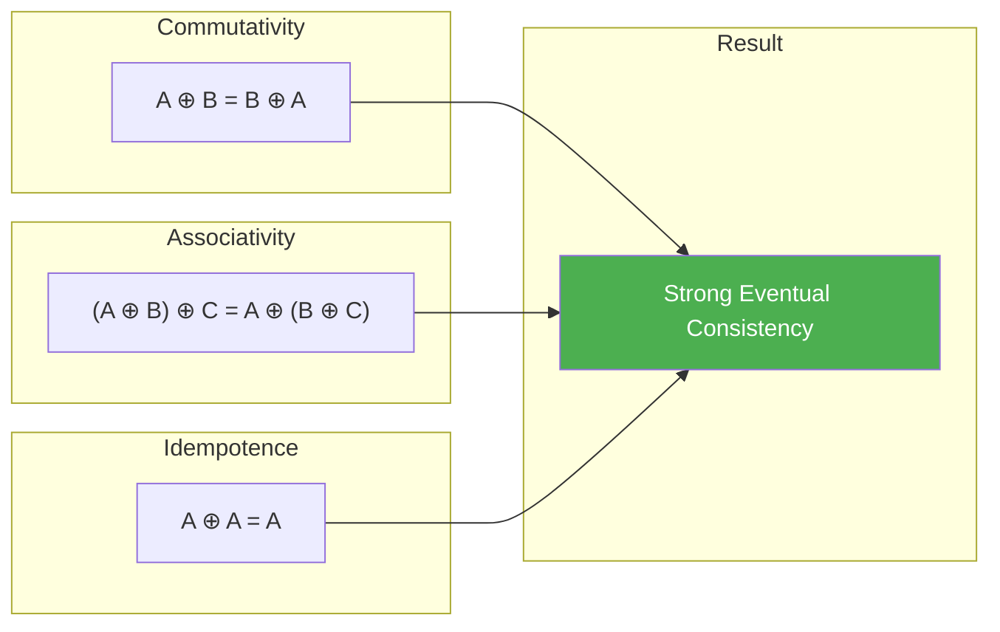

### Join Semilattice Requirements

| Property | Definition | Example (Set Union) |
|----------|------------|--------------------|
| **Commutativity** | `a ⊔ b = b ⊔ a` | `{1,2} ∪ {3} = {3} ∪ {1,2}` |
| **Associativity** | `(a ⊔ b) ⊔ c = a ⊔ (b ⊔ c)` | `({1} ∪ {2}) ∪ {3} = {1} ∪ ({2} ∪ {3})` |
| **Idempotence** | `a ⊔ a = a` | `{1,2} ∪ {1,2} = {1,2}` |

## Real-World Applications

### 1. Collaborative Text Editing

#### RGA (Replicated Growing Array) Structure

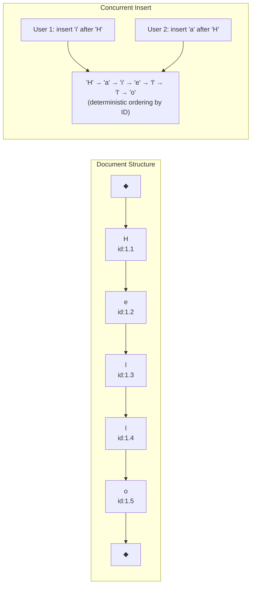

### 2. Distributed Shopping Cart

```python
class ShoppingCartCRDT:
    """Shopping cart using OR-Set"""
    
    def __init__(self, user_id: str):
        self.user_id = user_id
        self.items = ORSet()
        self.quantities = {}  # item -> PN-Counter
    
    def add_item(self, item: str, quantity: int = 1):
        """Add item to cart"""
        if item not in self.quantities:
            self.quantities[item] = PNCounter(self.user_id)
        
        self.items.add(item)
        self.quantities[item].increment(quantity)
    
    def remove_item(self, item: str):
        """Remove item from cart"""
        self.items.remove(item)
# Quantity counter remains for history
    
    def update_quantity(self, item: str, delta: int):
        """Change item quantity"""
        if item in self.quantities:
            if delta > 0:
                self.quantities[item].increment(delta)
            else:
                self.quantities[item].decrement(-delta)
    
    def get_cart(self) -> Dict[str, int]:
        """Get current cart contents"""
        cart = {}
        for item in self.items.values():
            if item in self.quantities:
                qty = self.quantities[item].value()
                if qty > 0:
                    cart[item] = qty
        return cart
    
    def merge(self, other: 'ShoppingCartCRDT') -> 'ShoppingCartCRDT':
        """Merge with another cart"""
        merged = ShoppingCartCRDT(self.user_id)
        merged.items = self.items.merge(other.items)
        
# Merge quantities
        all_items = set(self.quantities.keys()) | set(other.quantities.keys())
        for item in all_items:
            if item in self.quantities and item in other.quantities:
                merged.quantities[item] = self.quantities[item].merge(
                    other.quantities[item]
                )
            elif item in self.quantities:
                merged.quantities[item] = self.quantities[item]
            else:
                merged.quantities[item] = other.quantities[item]
        
        return merged
```

### 3. Distributed Cache with TTL

```python
class TTLMap:
    """Time-To-Live Map using LWW-Register per key"""
    
    def __init__(self, node_id: str):
        self.node_id = node_id
        self.data: Dict[str, LWWRegister] = {}
        self.ttls: Dict[str, float] = {}
    
    def set(self, key: str, value: Any, ttl: float):
        """Set value with TTL"""
        if key not in self.data:
            self.data[key] = LWWRegister(self.node_id)
        
        timestamp = time.time()
        self.data[key].set(value, timestamp)
        self.ttls[key] = timestamp + ttl
    
    def get(self, key: str) -> Optional[Any]:
        """Get value if not expired"""
        if key not in self.data:
            return None
        
        if key in self.ttls and time.time() > self.ttls[key]:
            return None  # Expired
        
        return self.data[key].get()
    
    def merge(self, other: 'TTLMap') -> 'TTLMap':
        """Merge with another TTL map"""
        merged = TTLMap(self.node_id)
        
        all_keys = set(self.data.keys()) | set(other.data.keys())
        
        for key in all_keys:
            if key in self.data and key in other.data:
                merged.data[key] = self.data[key].merge(other.data[key])
# Take TTL from the register with higher timestamp
                if self.data[key].timestamp > other.data[key].timestamp:
                    merged.ttls[key] = self.ttls.get(key, 0)
                else:
                    merged.ttls[key] = other.ttls.get(key, 0)
            elif key in self.data:
                merged.data[key] = self.data[key]
                merged.ttls[key] = self.ttls.get(key, 0)
            else:
                merged.data[key] = other.data[key]
                merged.ttls[key] = other.ttls.get(key, 0)
        
        return merged
```

## Performance Characteristics

### Space and Time Complexity

| CRDT Type | Space Complexity | Update Time | Merge Time | Query Time |
|-----------|------------------|-------------|------------|------------|
| **G-Counter** | O(n) nodes | O(1) | O(n) | O(n) |
| **PN-Counter** | O(n) nodes | O(1) | O(n) | O(n) |
| **OR-Set** | O(m) elements × unique IDs | O(1) | O(m) | O(1) |
| **LWW-Register** | O(1) | O(1) | O(1) | O(1) |
| **RGA** | O(m) characters | O(m) | O(m) | O(1) |

### Bandwidth Usage Patterns

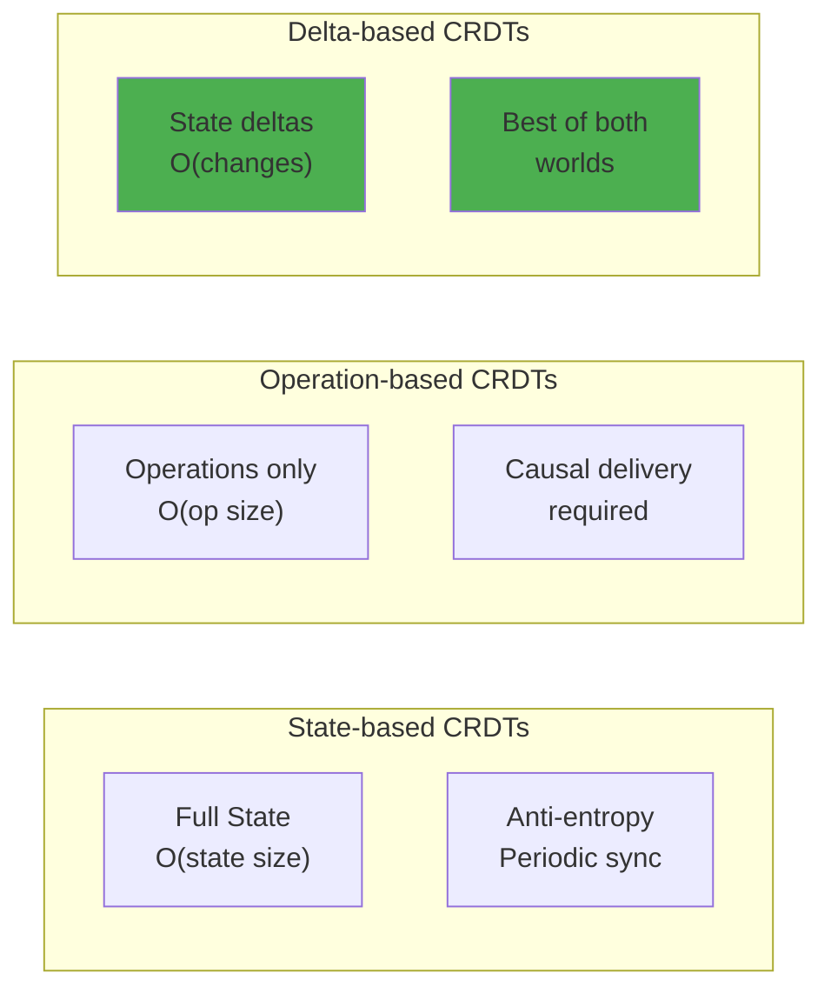

## Implementation Best Practices

### 1. Choosing the Right CRDT

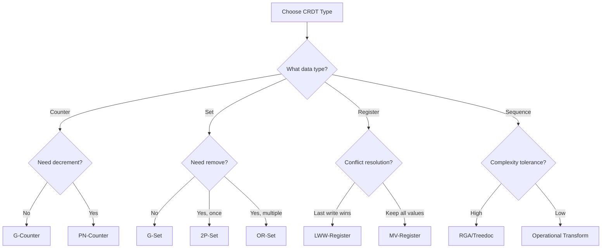

### 2. Garbage Collection Strategies

```python
class GarbageCollectedORSet(ORSet):
    """OR-Set with tombstone garbage collection"""
    
    def __init__(self, gc_interval: float = 3600):
        super().__init__()
        self.gc_interval = gc_interval
        self.last_gc = time.time()
        self.version_vector = {}  # For causal consistency
    
    def garbage_collect(self):
        """Remove old tombstones"""
        current_time = time.time()
        if current_time - self.last_gc < self.gc_interval:
            return
        
# Remove tombstones older than 2 * gc_interval
        cutoff = current_time - (2 * self.gc_interval)
        
# In practice, need consensus on what's safe to remove
# This is simplified for illustration
        self.tombstones = {
            t for t in self.tombstones 
            if self._get_timestamp(t) > cutoff
        }
        
        self.last_gc = current_time
```

### 3. Hybrid Approaches

```python
class HybridCounter:
    """Combine local state with CRDT for efficiency"""
    
    def __init__(self, node_id: str, sync_threshold: int = 100):
        self.node_id = node_id
        self.crdt = GCounter(node_id)
        self.local_delta = 0
        self.sync_threshold = sync_threshold
    
    def increment(self, value: int = 1):
        """Buffer increments locally"""
        self.local_delta += value
        
# Flush to CRDT when threshold reached
        if self.local_delta >= self.sync_threshold:
            self.flush()
    
    def flush(self):
        """Push local changes to CRDT"""
        if self.local_delta > 0:
            self.crdt.increment(self.local_delta)
            self.local_delta = 0
    
    def value(self) -> int:
        """Get current value including local delta"""
        return self.crdt.value() + self.local_delta
    
    def merge(self, other: 'HybridCounter') -> 'HybridCounter':
        """Merge requiring flush first"""
        self.flush()
        other.flush()
        
        merged = HybridCounter(self.node_id, self.sync_threshold)
        merged.crdt = self.crdt.merge(other.crdt)
        return merged
```

## Trade-offs and Limitations

### CRDT vs Other Consistency Models

| Aspect | CRDTs | Consensus (Raft/Paxos) | Last-Write-Wins | Vector Clocks |
|--------|-------|------------------------|-----------------|---------------|
| **Availability** | Always available | Requires majority | Always available | Always available |
| **Partition Tolerance** | Full tolerance | Majority partition | Full tolerance | Full tolerance |
| **Consistency** | Eventual (SEC) | Strong | Eventual | Causal |
| **Conflict Resolution** | Automatic | N/A (prevents conflicts) | Data loss possible | Manual required |
| **Latency** | Low (local ops) | High (coordination) | Low | Low |
| **Complexity** | Medium | High | Low | Medium |
| **Memory Overhead** | Can be high | Low | Low | Medium |

### When CRDTs Are Not Suitable

1. **Strong Consistency Required**
   - Banking transactions requiring ACID
   - Inventory systems with hard limits
   - Booking systems preventing double-booking

2. **Complex Invariants**
   - Business rules spanning multiple objects
   - Conditional updates based on global state
   - Transactions with preconditions

3. **Memory Constraints**
   - Embedded systems with limited memory
   - Systems with unbounded growth concerns
   - High-frequency updates with full history

## Related Patterns

- [Eventual Consistency](eventual-consistency.md) - The consistency model CRDTs provide
- [Vector Clocks](vector-clocks.md) - Used in some CRDT implementations
- Gossip Protocol (Coming Soon) - Common dissemination method
- Anti-Entropy (Coming Soon) - Synchronization mechanism

## References

1. "Conflict-free Replicated Data Types" - Shapiro et al.
2. "A Comprehensive Study of CRDTs" - Shapiro, Preguiça, Baquero, Zawirski
3. "Delta State Replicated Data Types" - Almeida, Shoker, Baquero
4. "Efficient State-based CRDTs by Delta-Mutation" - Riak implementation

---

*Next: [Vector Clocks](vector-clocks.md) - Understanding causality in distributed systems*