# CRDT (Conflict-free Replicated Data Types)

!!! success "🏆 Gold Standard Pattern"
    **Automatic Conflict Resolution** • Figma, Riak, Redis proven
    
    The breakthrough pattern for conflict-free collaboration. CRDTs enable real-time collaborative applications and geo-distributed databases by mathematically guaranteeing convergence without coordination.
    
    **Key Success Metrics:**
    - Figma: Powers real-time design collaboration for millions
    - Riak: Petabyte-scale with automatic conflict resolution
    - Redis CRDT: Active-active replication across continents

**Automatic conflict resolution for distributed data**

!!! abstract "The CRDT Convergence Theorem"
 <p>CRDTs guarantee that all replicas will eventually converge to the same state without requiring coordination, as long as all updates are eventually delivered to all replicas. This property, called Strong Eventual Consistency (SEC), is stronger than regular eventual consistency.</p>

## CRDT Properties at a Glance

| Property | Guarantee | Benefit |
|----------|-----------|----------|
| **Convergence** | All replicas reach same state | No divergence |
| **Coordination-free** | No consensus/locking | High availability |
| **Always writable** | Accept updates anytime | No blocking |
| **Partition tolerant** | Works during splits | Network resilience |
| **Auto conflict resolution** | Mathematical merge | No manual intervention |

## Visual CRDT Type Hierarchy


## CRDT Types and Convergence

### State-based CRDTs (CvRDT)

### State vs Operation vs Delta CRDTs

| Type | Mechanism | Network Cost | Delivery Requirement |
|------|-----------|--------------|---------------------|
| **State-based (CvRDT)** | Send full state | O(state size) | Idempotent |
| **Operation-based (CmRDT)** | Send operations | O(op size) | Exactly-once, causal |
| **Delta-based (δ-CRDT)** | Send state changes | O(delta size) | Idempotent |

#### Join Semilattice Structure


### Operation-based CRDTs (CmRDT)

#### How Operation-based CRDTs Work


## Detailed CRDT Type Implementations

### 1. G-Counter (Grow-only Counter)

#### Visual Representation


### G-Counter Implementation Pattern


**Key insight**: Each node tracks all node counts; merge takes maximum per node.

### 2. PN-Counter (Positive-Negative Counter)

#### Visual Representation

```mermaid
graph TB
 subgraph "PN-Counter Structure"
 PNC[PN-Counter]
 PNC --> P[P: Positive Counter<br/>G-Counter]
 PNC --> N[N: Negative Counter<br/>G-Counter]
 
 Value["Value = P.value() - N.value()"]
 end
 
 subgraph "Operations"
 Inc[increment()] --> P
 Dec[decrement()] --> N
 end
 
 P --> Value
 N --> Value
```

### PN-Counter = Two G-Counters

| Component | Purpose | Operation |
|-----------|---------|----------|  
| **P-Counter** | Track increments | `increment()` → P.add |
| **N-Counter** | Track decrements | `decrement()` → N.add |
| **Value** | Current count | P.value() - N.value() |
| **Merge** | Combine states | P.merge(), N.merge() |

### 3. OR-Set (Observed-Remove Set)

#### Convergence Visualization


### OR-Set Mechanics

```mermaid
flowchart LR
    subgraph "Add Operation"
        A1["add('X')"] --> A2["Store ('X', UUID1)"]
    end
    
    subgraph "Remove Operation"
        R1["remove('X')"] --> R2["Find all ('X', *)"]
        R2 --> R3["Move to tombstones"]
    end
    
    subgraph "Merge Resolution"
        M1["Elements ∪ Elements"] --> M2["Subtract Tombstones"]
        M2 --> M3["Final Set"]
    end
    
    style A2 fill:#4caf50
    style R3 fill:#f44336
    style M3 fill:#2196f3
```



**Key**: Unique IDs allow concurrent add/remove of same element without conflicts.

### 4. LWW-Register (Last-Write-Wins Register)

#### Conflict Resolution Visualization


### LWW-Register Conflict Resolution

| Scenario | Resolution Rule | Example |
|----------|----------------|----------|
| **Different timestamps** | Higher timestamp wins | T2 > T1 → use T2 value |
| **Same timestamp** | Node ID breaks tie | T1 = T2 → compare node IDs |
| **Clock skew** | Still deterministic | Works despite time drift |


### 5. MV-Register (Multi-Value Register)

#### Concurrent Value Handling


## CRDT Comparison Table

| CRDT Type | Operations | Use Case | Memory Overhead | Convergence Speed |
|-----------|------------|----------|-----------------|------------------|
| **G-Counter** | increment only | Page views, likes | Low (O(nodes)) | Fast |
| **PN-Counter** | increment, decrement | Account balances | Medium (2×G-Counter) | Fast |
| **G-Set** | add only | Append-only logs | Grows unbounded | Fast |
| **2P-Set** | add, remove once | Tombstoned items | Grows unbounded | Fast |
| **OR-Set** | add, remove | Shopping carts | High (unique IDs) | Fast |
| **LWW-Register** | set | Last value wins | Low | Fast |
| **MV-Register** | set | Preserve conflicts | Medium | Fast |
| **RGA** | insert, delete | Text editing | High | Medium |


## Network Partition Scenarios

### Partition Tolerance Visualization


### Handling Network Partitions

```python
class PartitionTolerantCounter:
 """Example showing CRDT behavior during partition"""
 
 def simulate_partition():
# Three nodes start synchronized
 node1 = GCounter("node1")
 node2 = GCounter("node2")
 node3 = GCounter("node3")
 
# Initial increments
 node1.increment(10)
 
# Sync before partition
 node2 = node2.merge(node1)
 node3 = node3.merge(node1)
 
 print("Before partition:", node1.value())
 
# PARTITION OCCURS
# Nodes 1,2 can communicate
# Node 3 is isolated
 
# Operations during partition
 node1.increment(5) # Only seen by node1,2
 node2.increment(3) # Only seen by node1,2
 node3.increment(7) # Only seen by node3
 
# Partial sync (1 and 2 only)
 node1 = node1.merge(node2)
 node2 = node2.merge(node1)
 
 print("During partition:")
 print(f"Nodes 1,2: {node1.value()}")
 print(f"Node 3: {node3.value()}")
 
# PARTITION HEALS
# Full sync
 merged = node1.merge(node3)
 node1 = node2 = node3 = merged
 
 print(f"After healing: {merged.value()}")
 print("All nodes converged!")
```

## Mathematical Properties

### Convergence Properties Visualized

```mermaid
graph LR
 subgraph "Commutativity"
 C1["A ⊕ B = B ⊕ A"]
 end
 
 subgraph "Associativity"
 A1["(A ⊕ B) ⊕ C = A ⊕ (B ⊕ C)"]
 end
 
 subgraph "Idempotence"
 I1["A ⊕ A = A"]
 end
 
 subgraph "Result"
 R["Strong Eventual Consistency"]
 end
 
 C1 --> R
 A1 --> R
 I1 --> R
 
 style R fill:#4caf50,color:#fff
```



### Join Semilattice Requirements

| Property | Definition | Example (Set Union) |
|----------|------------|--------------------|
| **Commutativity** | `a ⊔ b = b ⊔ a` | `{1,2} ∪ {3} = {3} ∪ {1,2}` |
| **Associativity** | `(a ⊔ b) ⊔ c = a ⊔ (b ⊔ c)` | `({1} ∪ {2}) ∪ {3} = {1} ∪ ({2} ∪ {3})` |
| **Idempotence** | `a ⊔ a = a` | `{1,2} ∪ {1,2} = {1,2}` |


## Real-World Applications

### 1. Collaborative Text Editing

#### RGA (Replicated Growing Array) Structure

```mermaid
graph LR
 subgraph "Document Structure"
 Start["◆"] --> H["H<br/>id:1.1"]
 H --> E["e<br/>id:1.2"]
 E --> L1["l<br/>id:1.3"]
 L1 --> L2["l<br/>id:1.4"]
 L2 --> O["o<br/>id:1.5"]
 O --> End["◆"]
 end
 
 subgraph "Concurrent Insert"
 User1["User 1: insert 'i' after 'H'"]
 User2["User 2: insert 'a' after 'H'"]
 
 Result["'H' → 'a' → 'i' → 'e' → 'l' → 'l' → 'o'<br/>(deterministic ordering by ID)"]
 end
 
 User1 --> Result
 User2 --> Result
```



### Real-World CRDT Applications

| Use Case | CRDT Type | Companies | Scale |
|----------|-----------|-----------|-------|
| **Collaborative Editing** | RGA/Treedoc | Figma, Google Docs | Millions concurrent |
| **Shopping Cart** | OR-Set + PN-Counter | Amazon, Riak | Global scale |
| **User Presence** | LWW-Register | Discord, Slack | Real-time updates |
| **Like Counters** | G-Counter | Twitter, Facebook | Billions/day |
| **Distributed Cache** | LWW-Map | Redis CRDT | Multi-region |
| **Session Storage** | OR-Set | Cloudflare | Edge computing |

### CRDT Design Patterns

| Pattern | Composition | Use Case |
|---------|-------------|----------|  
| **Composed CRDT** | Multiple basic CRDTs | Shopping cart (OR-Set + PN-Counter) |
| **Embedded CRDT** | CRDT inside CRDT | Map of Counters |
| **Causal CRDT** | Add happens-before | Message ordering |
| **Pure Op-Based** | No state transfer | Low bandwidth |
| **Delta-State** | Incremental sync | Large datasets |
| **Merkle-CRDT** | Efficient sync | Minimize transfers |

## Performance Characteristics

### CRDT Performance Profile

| CRDT Type | Space | Update | Merge | Query | Garbage Collection |
|-----------|-------|--------|-------|-------|-------------------|
| **G-Counter** | O(n) nodes | O(1) | O(n) | O(n) | Not needed |
| **PN-Counter** | O(n) nodes | O(1) | O(n) | O(n) | Not needed |
| **OR-Set** | O(m×u) elem×ids | O(1) | O(m) | O(1) | Critical (tombstones) |
| **LWW-Register** | O(1) | O(1) | O(1) | O(1) | Not needed |
| **RGA** | O(m) positions | O(m) | O(m) | O(1) | Optional |


### Bandwidth Usage Patterns


## Implementation Best Practices

### 1. Choosing the Right CRDT


### Garbage Collection Strategies

| Strategy | Mechanism | Pros | Cons |
|----------|-----------|------|------|
| **Timeout-based** | Remove after TTL | Simple | Unsafe if delayed |
| **Version Vector** | Track causal history | Safe | Memory overhead |
| **Consensus GC** | Agree on cutoff | Very safe | Coordination required |
| **Hybrid** | Local + periodic consensus | Balanced | Complex |
| **Bloom Filter** | Probabilistic tracking | Space efficient | False positives |

### Optimization Techniques

| Technique | Purpose | Trade-off |
|-----------|---------|-----------|  
| **Batching** | Reduce sync frequency | Latency vs efficiency |
| **Compression** | Reduce state size | CPU vs bandwidth |
| **Hierarchical** | Local + global CRDTs | Complexity vs scale |
| **Lazy propagation** | Delay non-critical updates | Consistency lag |
| **State pruning** | Remove old history | Safety vs space |
| **Delta compression** | Send only changes | Requires reliable delivery |

## Trade-offs and Limitations

### CRDT vs Other Consistency Models

| Aspect | CRDTs | Consensus (Raft/Paxos) | Last-Write-Wins | Vector Clocks |
|--------|-------|------------------------|-----------------|---------------|
| **Availability** | Always available | Requires majority | Always available | Always available |
| **Partition Tolerance** | Full tolerance | Majority partition | Full tolerance | Full tolerance |
| **Consistency** | Eventual (SEC) | Strong | Eventual | Causal |
| **Conflict Resolution** | Automatic | N/A (prevents conflicts) | Data loss possible | Manual required |
| **Latency** | Low (local ops) | High (coordination) | Low | Low |
| **Complexity** | Medium | High | Low | Medium |
| **Memory Overhead** | Can be high | Low | Low | Medium |


### CRDT Limitations Matrix

| Limitation | Why | Alternative |
|------------|-----|-------------|
| **No strong consistency** | Eventually consistent only | Use consensus (Raft/Paxos) |
| **No global invariants** | Can't enforce constraints | Use transactions |
| **Memory growth** | Metadata accumulates | Implement GC carefully |
| **Complex to reason about** | Non-intuitive behavior | Extensive testing needed |
| **Limited operations** | Not all ops have CRDT | Design around available types |
| **Network overhead** | State/metadata transfer | Use delta-CRDTs |

## Related Patterns

- [Eventual Consistency](eventual-consistency.md) - The consistency model CRDTs provide
- [Vector Clocks](vector-clocks.md) - Used in some CRDT implementations
- Gossip Protocol (Coming Soon) - Common dissemination method
- Anti-Entropy (Coming Soon) - Synchronization mechanism

## References

1. "Conflict-free Replicated Data Types" - Shapiro et al.
2. "A Comprehensive Study of CRDTs" - Shapiro, Preguiça, Baquero, Zawirski
3. "Delta State Replicated Data Types" - Almeida, Shoker, Baquero
4. "Efficient State-based CRDTs by Delta-Mutation" - Riak implementation

---

*Next: [Vector Clocks](vector-clocks.md) - Understanding causality in distributed systems*