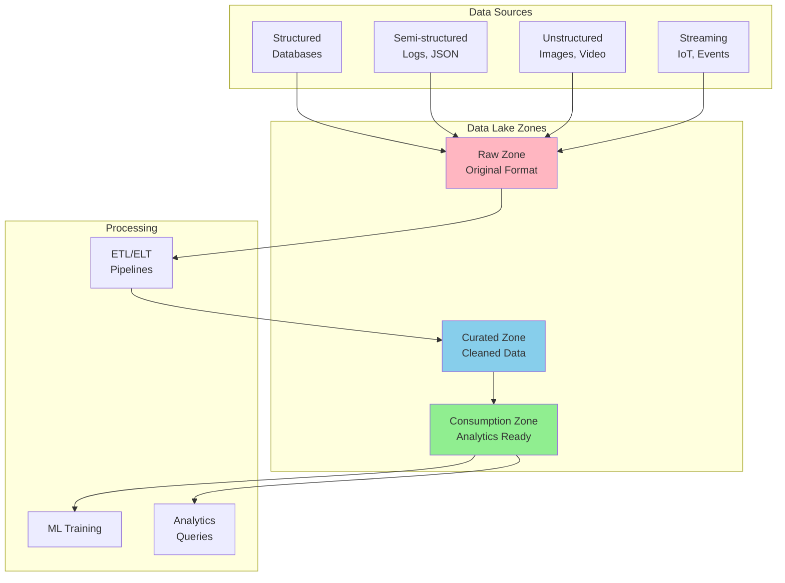
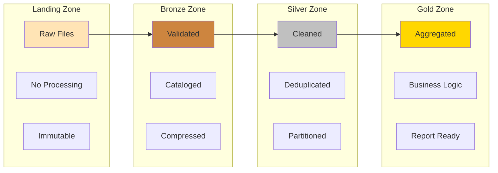
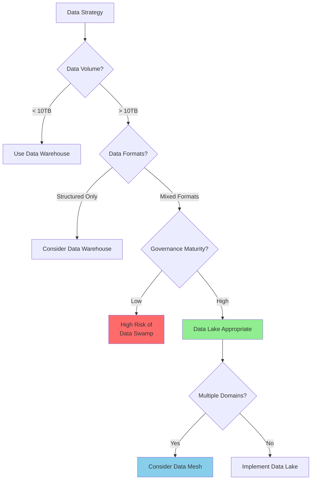

# Data Lake Pattern

!!! warning "🥉 Bronze Pattern"
    **Use with Caution** • Evolving to Data Mesh architectures
    
    Data Lakes often become "data swamps" without proper governance. Modern architectures are moving toward domain-oriented data mesh patterns for better ownership and quality.
    
    **Migration Path**: Consider Data Mesh for new implementations

**Store everything now, figure out value later**

## Visual Architecture

## Data Lake vs Data Warehouse vs Data Mesh

| Aspect | Data Lake | Data Warehouse | Data Mesh |
|--------|-----------|----------------|-----------|
| **Data Format** | All formats (raw) | Structured only | Domain-specific |
| **Schema** | Schema-on-read | Schema-on-write | Schema by domain |
| **Processing** | ELT | ETL | Domain pipelines |
| **Cost** | Low storage | High compute | Distributed |
| **Agility** | High | Low | Very high |
| **Governance** | Challenging | Centralized | Federated |
| **Users** | Data scientists | Business analysts | Domain teams |

## Zone Architecture

## Common Pitfalls

<h4>💥 The Data Swamp Problem</h4>

**What Happens**: 
- No metadata or cataloging
- Unknown data quality
- Duplicate data everywhere
- No one knows what's in the lake

**Result**: $10M+ invested, 90% of data never used

**Prevention**:
- Mandatory metadata on ingestion
- Data quality scores
- Automated cataloging
- Regular cleanup policies

## Technology Stack Comparison

| Component | AWS | Azure | GCP | Open Source |
|-----------|-----|-------|-----|-------------|
| **Storage** | S3 | ADLS Gen2 | GCS | HDFS/MinIO |
| **Catalog** | Glue | Purview | Data Catalog | Apache Atlas |
| **Processing** | EMR | Databricks | Dataproc | Spark |
| **Query** | Athena | Synapse | BigQuery | Presto/Trino |
| **Governance** | Lake Formation | Purview | Dataplex | Apache Ranger |

## Decision Framework

## Implementation Checklist

- [ ] Define zone architecture (landing, bronze, silver, gold)
- [ ] Implement data catalog from day one
- [ ] Set up access controls and encryption
- [ ] Create data retention policies
- [ ] Implement data quality monitoring
- [ ] Establish metadata standards
- [ ] Plan for disaster recovery
- [ ] Monitor storage costs
- [ ] Prevent small file problem
- [ ] Regular compaction jobs

## Modern Alternative: Data Mesh

<h4>🎯 When to Choose Data Mesh Instead</h4>

- Multiple business domains
- Domain teams want ownership
- Decentralized data governance
- Self-serve data platform needed
- Quality issues in centralized lake

**Key Difference**: Domain-oriented vs Centralized

[Learn more about Data Mesh →](data-mesh.md)

## Related Patterns

- [Data Mesh](data-mesh.md) - Modern domain-oriented alternative
- [Lambda Architecture](lambda-architecture.md) - Batch + stream processing
- [Event Streaming](event-streaming.md) - Real-time data ingestion
- [Materialized View](materialized-view.md) - Pre-computed analytics
- [Polyglot Persistence](polyglot-persistence.md) - Multiple storage systems