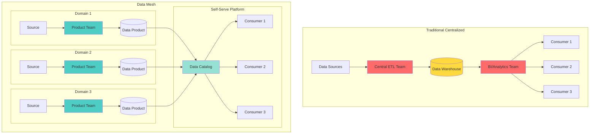
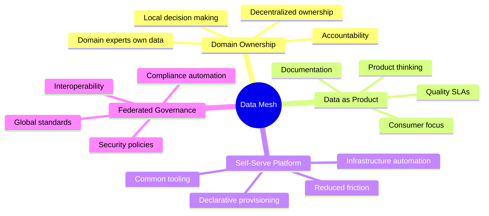
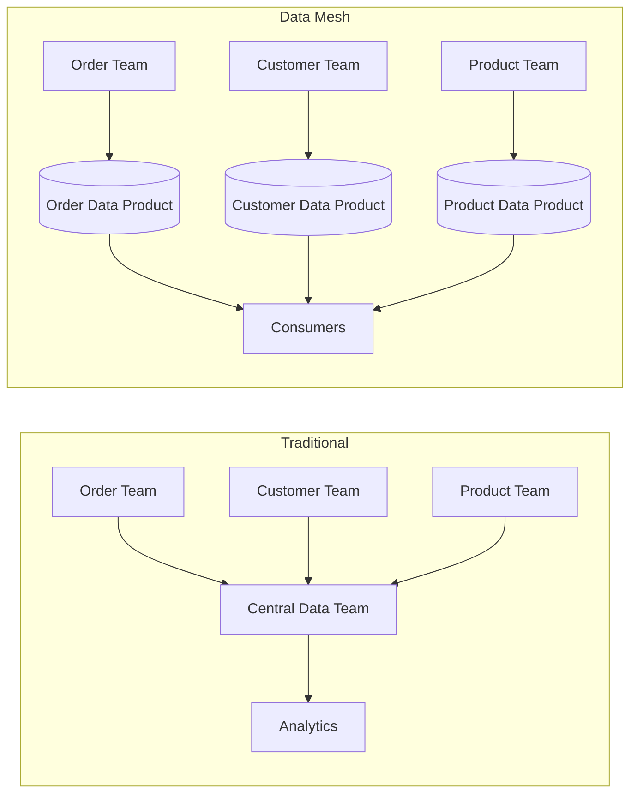
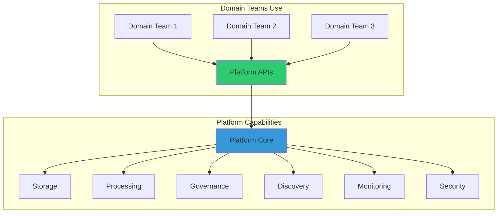
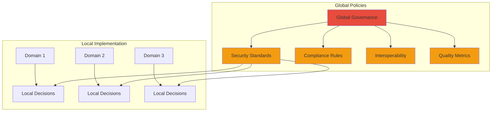
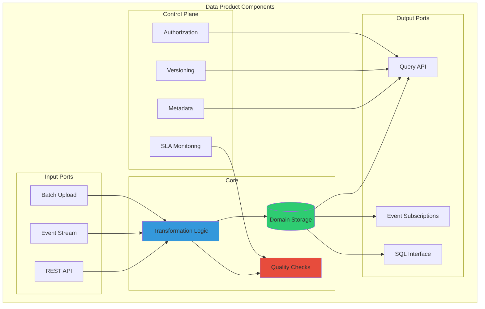
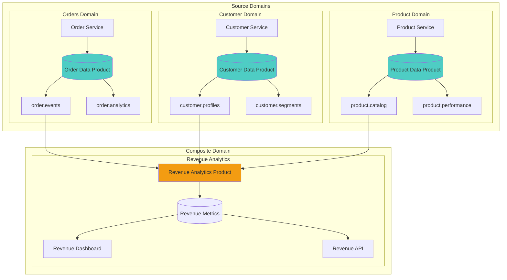
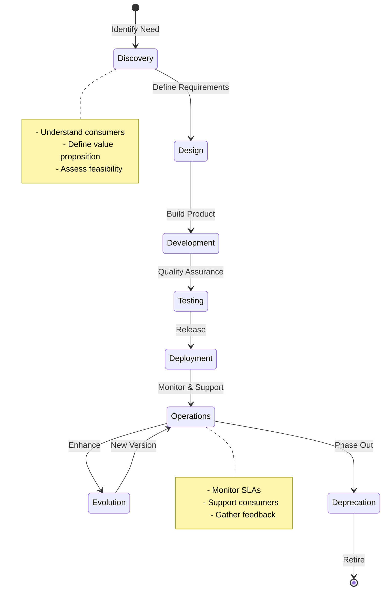
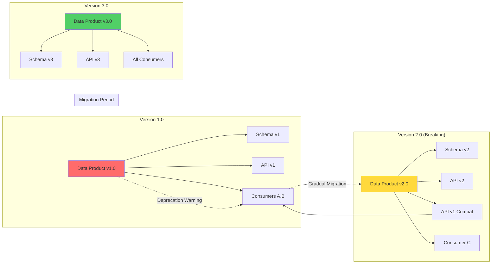
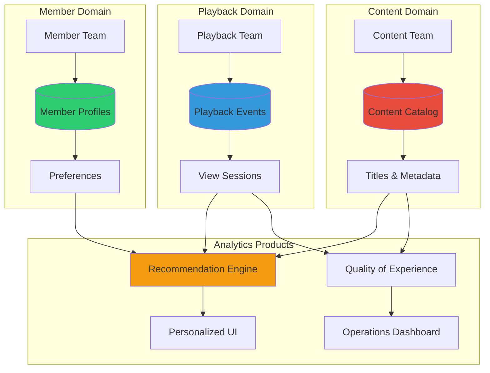

# Data Mesh

[Home](/) > [Patterns](/patterns) > [Core Patterns](/patterns/#core-patterns) > Data Mesh

!!! abstract "🌐 Organizational Data Pattern"
    Decentralize data ownership and architecture to scale data teams and analytics by treating data as a product owned by domain teams.
    
    **Connected Laws**: Law 5 (Distributed Knowledge) • Law 6 (Cognitive Load) • Law 7 (Economic Reality)
    **Related Pillars**: [Pillar 2 (State)](/part2-pillars/state) • [Pillar 5 (Intelligence)](/part2-pillars/intelligence)

## Problem Statement

**How can organizations scale their data platform and analytics capabilities beyond the limitations of centralized data teams and monolithic architectures?**

!!! tip "When to Use This Pattern"
    | Scenario | Use Data Mesh | Alternative |
    |----------|---------------|-------------|
    | Multiple autonomous teams | ✅ Yes | Centralized data team |
    | Domain complexity high | ✅ Yes | Data warehouse |
    | Cross-domain data needs | ✅ Yes | Data lake with zones |
    | Scaling bottlenecks | ✅ Yes | Scale central team |
    | Data quality issues | ✅ Yes | Data stewards |
    | Innovation velocity low | ✅ Yes | Center of excellence |
    | Small organization | ❌ No | Traditional ETL |
    | Few data sources | ❌ No | Data warehouse |
    | Weak domain boundaries | ❌ No | Data lake |
    | Low data maturity | ❌ No | Start centralized |

## Solution Architecture

### Centralized vs Mesh Architecture



### Four Principles of Data Mesh



## Level 1: Intuition 🌱

### The Restaurant Chain Analogy

Imagine a restaurant chain trying to understand customer preferences:

**Traditional Approach** (Centralized):
- All restaurants send raw data to headquarters
- Central team analyzes everything
- Insights distributed back to restaurants
- Bottleneck: Central team becomes overwhelmed

**Data Mesh Approach** (Decentralized):
- Each restaurant analyzes its own data
- Shares insights as "data products"
- Other restaurants can consume these products
- Platform provides common tools and standards

## Level 2: Fundamentals 🌿

### Core Principles Explained

#### 1. Domain-Oriented Ownership



#### 2. Data as a Product

| Aspect | Data Project | Data Product |
|--------|--------------|--------------|
| Ownership | Central team | Domain team |
| Quality | Best effort | SLA guaranteed |
| Documentation | Optional | Required |
| Discoverability | Limited | Cataloged |
| Evolution | Breaking changes | Versioned APIs |
| Support | Ticket-based | Product team |

#### 3. Self-Serve Data Platform



#### 4. Federated Computational Governance



## Level 3: Practical Implementation 🌳

### Data Product Architecture



### Implementation Patterns

=== "Data Product API"

    ```python
    class OrderDataProduct:
        """Domain-owned data product for order analytics"""
        
        def __init__(self, platform: DataPlatform):
            self.platform = platform
            self.storage = platform.get_storage("orders")
            self.catalog = platform.get_catalog()
            
        def register(self):
            """Register data product in catalog"""
            self.catalog.register({
                "name": "order-analytics",
                "version": "2.0",
                "owner": "order-team",
                "sla": {
                    "freshness": "5 minutes",
                    "availability": "99.9%",
                    "quality": "99.5%"
                },
                "schema": self.get_schema(),
                "endpoints": {
                    "rest": "/api/orders/v2",
                    "sql": "order_analytics.orders",
                    "stream": "orders.events"
                }
            })
            
        def publish_order_metrics(self, order: Order):
            """Transform and publish order metrics"""
            # Domain logic for transformation
            metrics = self.calculate_metrics(order)
            
            # Quality checks
            if not self.validate_metrics(metrics):
                raise QualityException("Metrics failed validation")
                
            # Publish to multiple interfaces
            self.storage.write(metrics)
            self.platform.emit_event("order.metrics", metrics)
    ```

=== "Self-Serve Platform"

    ```yaml
    # Declarative data product provisioning
    apiVersion: datamesh.io/v1
    kind: DataProduct
    metadata:
      name: customer-360
      team: customer-experience
    spec:
      inputs:
        - type: stream
          source: customer.events
        - type: batch
          source: crm.customers
          schedule: "0 * * * *"
      
      transformation:
        type: spark
        code: s3://transforms/customer-360.py
        
      outputs:
        - type: table
          name: customer_profiles
          schema: 
            - name: customer_id
              type: string
              key: true
            - name: lifetime_value
              type: decimal
            - name: segments
              type: array<string>
              
        - type: api
          name: customer-api
          rateLimit: 1000
          
      quality:
        checks:
          - nullCheck: [customer_id]
          - rangeCheck: 
              column: lifetime_value
              min: 0
        sla:
          completeness: 99%
          freshness: 1h
          
      governance:
        pii: [email, phone]
        retention: 90d
        compliance: [gdpr, ccpa]
    ```

=== "Federated Governance"

    ```python
    class FederatedGovernance:
        """Platform governance with local autonomy"""
        
        def __init__(self):
            self.global_policies = GlobalPolicyRegistry()
            self.local_validators = {}
            
        def register_global_policy(self, policy: Policy):
            """Register organization-wide policy"""
            self.global_policies.add(policy)
            
        def implement_local_policy(self, domain: str, 
                                 implementation: Callable):
            """Domain-specific policy implementation"""
            self.local_validators[domain] = implementation
            
        def validate_data_product(self, product: DataProduct) -> bool:
            """Validate against global and local policies"""
            # Global policies (automated)
            for policy in self.global_policies.get_applicable(product):
                if not policy.validate(product):
                    return False
                    
            # Local implementation
            domain = product.metadata.domain
            if domain in self.local_validators:
                if not self.local_validators[domain](product):
                    return False
                    
            return True
            
        # Example policies
        def setup_policies(self):
            # Global: PII must be encrypted
            self.register_global_policy(
                PIIEncryptionPolicy(required_algorithm="AES-256")
            )
            
            # Global: All products must have SLAs
            self.register_global_policy(
                SLARequiredPolicy(min_availability=99.0)
            )
            
            # Local: Order domain specific validation
            self.implement_local_policy(
                "orders",
                lambda p: validate_order_schema(p.schema)
            )
    ```

## Level 4: Production Patterns 🌲

### Multi-Domain Data Products



### Data Product Lifecycle



### Platform Capabilities Matrix

| Capability | Traditional | Data Mesh | Implementation |
|------------|-------------|-----------|----------------|
| **Storage** | Centralized warehouse | Polyglot persistence | S3, BigQuery, Snowflake per domain |
| **Compute** | Central ETL cluster | Distributed processing | Spark, Flink, dbt per product |
| **Catalog** | IT-managed metadata | Self-service discovery | DataHub, Amundsen, Collibra |
| **Quality** | Central validation | Product-level SLAs | Great Expectations, Soda |
| **Access** | Role-based central | Attribute-based federated | OPA, Ranger, Privacera |
| **Monitoring** | Infrastructure focus | Product health focus | Datadog, Prometheus, Monte Carlo |

## Level 5: Advanced Patterns 🚀

### Cross-Domain Transactions

```mermaid
sequenceDiagram
    participant C as Consumer
    participant OM as Order Mesh
    participant CM as Customer Mesh  
    participant PM as Payment Mesh
    participant E as Event Bus
    
    C->>OM: Create Order
    OM->>OM: Validate Order
    OM->>E: OrderCreated Event
    
    E->>CM: OrderCreated
    E->>PM: OrderCreated
    
    CM->>CM: Update Customer Stats
    CM->>E: CustomerUpdated Event
    
    PM->>PM: Process Payment
    PM->>E: PaymentProcessed Event
    
    E->>OM: PaymentProcessed
    OM->>OM: Update Order Status
    OM->>C: Order Confirmed
    
    Note over E: Eventual Consistency
    Note over OM,CM,PM: Domain Autonomy
```

### Data Product Versioning Strategy



## Real-World Examples

### Netflix: Media Analytics Mesh



### Zalando: E-commerce Data Mesh

| Domain | Data Products | Consumers | Tech Stack |
|--------|---------------|-----------|------------|
| **Orders** | Order events, Order analytics | Finance, Logistics, CRM | Kafka, PostgreSQL, dbt |
| **Products** | Product catalog, Inventory levels | Search, Recommendations | Elasticsearch, S3, Spark |
| **Customers** | Customer 360, Segmentation | Marketing, Personalization | BigQuery, Airflow, Tableau |
| **Logistics** | Delivery tracking, Warehouse metrics | Customer service, Planning | Kinesis, Redshift, Looker |

## Trade-offs Analysis

### Data Mesh vs Traditional Architectures

| Aspect | Data Warehouse | Data Lake | Data Mesh |
|--------|----------------|-----------|-----------|
| **Ownership** | Central IT team | Central data team | Domain teams |
| **Architecture** | Monolithic | Centralized storage | Distributed products |
| **Scalability** | Vertical (bigger warehouse) | Storage scales, processing doesn't | Horizontal (more domains) |
| **Time to insight** | Slow (central bottleneck) | Moderate (data swamp risk) | Fast (domain autonomy) |
| **Data quality** | Centrally enforced | Often poor | Product SLAs |
| **Flexibility** | Low (rigid schema) | High (schema-on-read) | High (polyglot) |
| **Governance** | Centralized | Challenging | Federated |
| **Complexity** | Low initially, high at scale | Moderate | High (distributed systems) |
| **Team skills** | SQL, ETL | Big data, ML | Full-stack, product thinking |
| **Cost model** | Predictable, expensive | Storage cheap, compute varies | Per-domain optimization |

### When Data Mesh Fails

!!! failure "Common Failure Modes"
    1. **Insufficient Platform Investment**
       - Teams reinvent infrastructure
       - High cognitive load
       - Inconsistent implementations
    
    2. **Weak Domain Boundaries**
       - Data ownership conflicts
       - Duplicate products
       - Integration nightmares
    
    3. **Lack of Product Thinking**
       - Poor documentation
       - No SLAs
       - Consumer frustration
    
    4. **Governance Gaps**
       - Security vulnerabilities
       - Compliance violations
       - Data silos re-emerge

## Cross-References

### Connected Distributed Systems Concepts

- **[Law 5: Distributed Knowledge](/part1-axioms/law5-knowledge)**: Data mesh addresses the challenge of distributed domain knowledge
- **[Law 6: Cognitive Load](/part1-axioms/law6-cognitive-load)**: Self-serve platform reduces cognitive burden on domain teams
- **[Law 7: Economic Reality](/part1-axioms/law7-economics)**: Domain ownership aligns costs with value creation
- **[Pillar 2: State Distribution](/part2-pillars/state)**: Data products are distributed state with consistency guarantees
- **[Pillar 5: Intelligence Distribution](/part2-pillars/intelligence)**: Federated analytics and ML on mesh architecture

### Related Patterns

- **[Event Sourcing](/patterns/event-sourcing)**: Source data products from event streams
- **[CQRS](/patterns/cqrs)**: Separate read/write models within data products
- **[Microservices](/patterns/microservices)**: Operational plane counterpart to analytical plane
- **[Service Mesh](/patterns/service-mesh)**: Infrastructure pattern for managing data product communication

### Implementation Technologies

- **Data Catalogs**: DataHub, Amundsen, Collibra, Alation
- **Workflow Orchestration**: Airflow, Prefect, Dagster
- **Data Quality**: Great Expectations, Soda, Monte Carlo
- **Data Platforms**: Databricks, Snowflake, BigQuery, Confluent
- **Governance**: Privacera, Immuta, OPA

## Summary

!!! success "Key Takeaways"
    - **Domain Ownership**: Teams who understand the data best should own and serve it
    - **Product Thinking**: Treat data as a product with consumers, SLAs, and lifecycle
    - **Platform Investment**: Success requires significant self-serve platform capabilities
    - **Federated Governance**: Balance global standards with local autonomy
    - **Cultural Shift**: Requires organization-wide change, not just technology

### Next Steps

1. **Assess Readiness**: Evaluate domain boundaries and data maturity
2. **Start Small**: Pick one domain for pilot implementation
3. **Invest in Platform**: Build self-serve capabilities incrementally
4. **Define Governance**: Establish federated model early
5. **Measure Success**: Track domain velocity and data product adoption