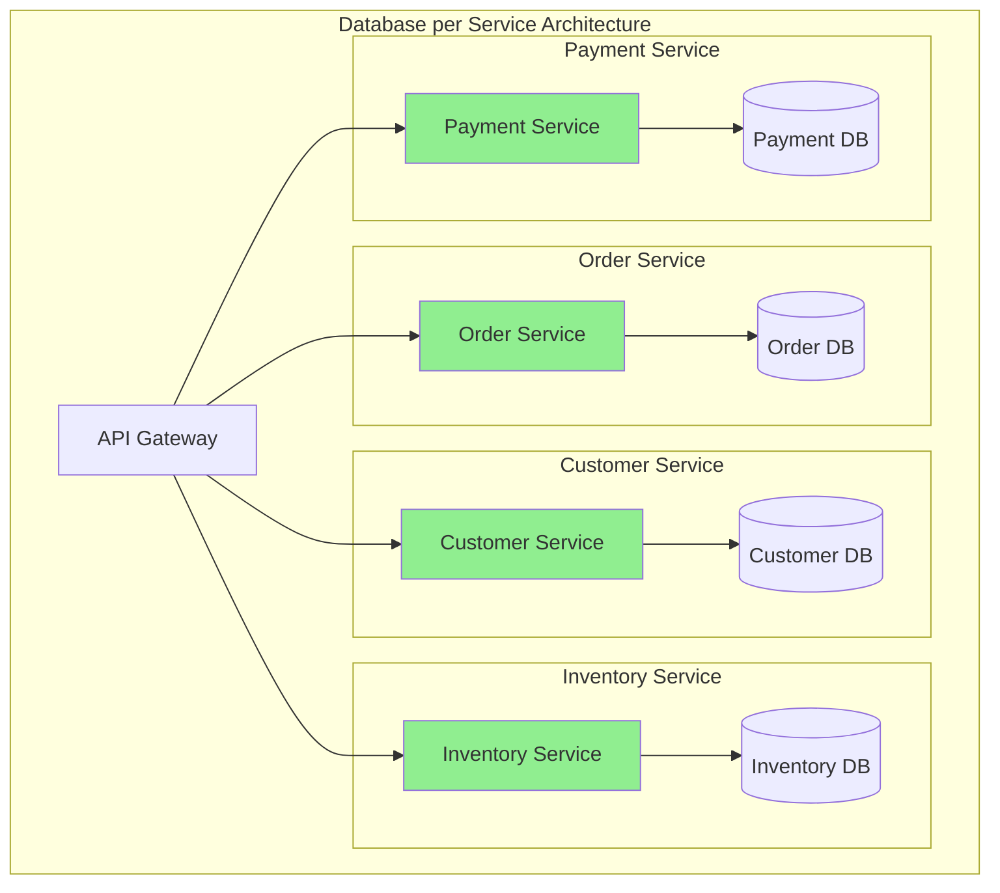
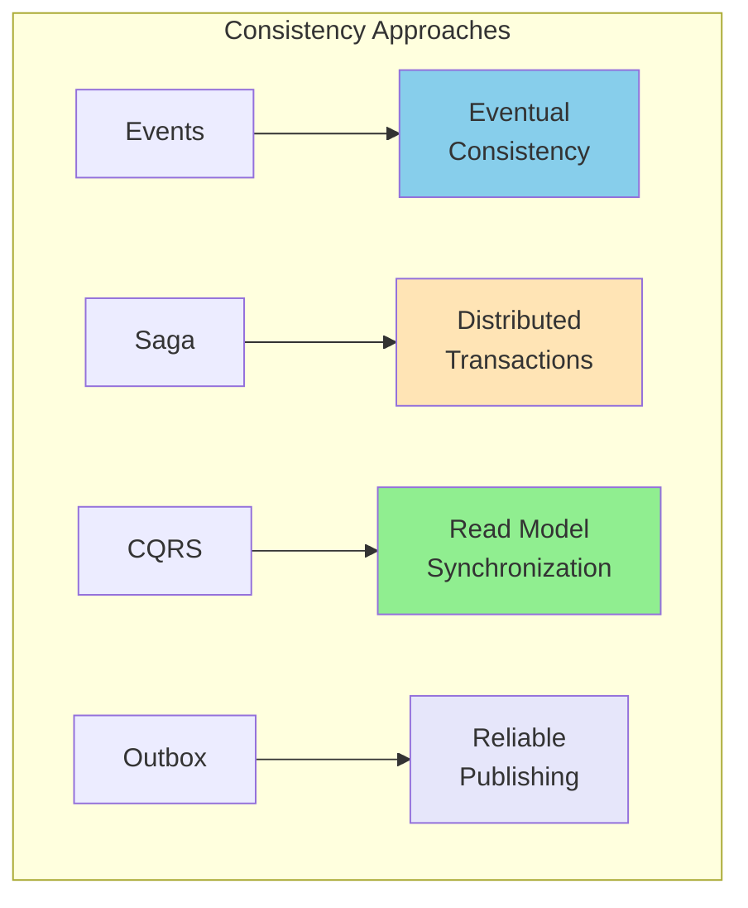
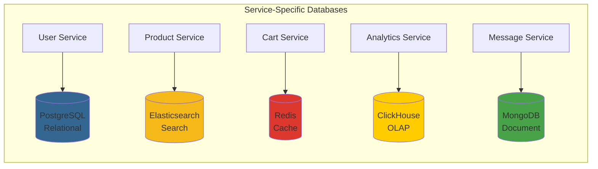
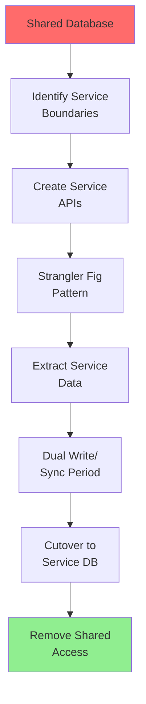
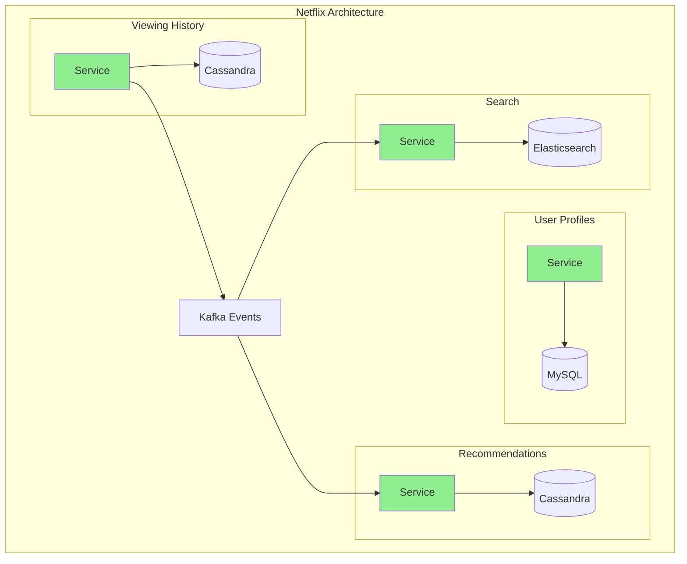

# Database per Service Pattern

!!! success "🥇 Gold Standard Pattern"
    **Recommended for microservices** • Enables true service autonomy
    
    This pattern is the foundation of successful microservices architectures, enabling independent deployment, scaling, and technology choices.

**Freedom through isolation, complexity through distribution**

## Visual Architecture



## Benefits vs Challenges

| Benefits | Challenges | Mitigation Strategies |
|----------|------------|----------------------|
| **Service Autonomy** | Data consistency | Event-driven eventual consistency |
| **Independent Scaling** | Distributed queries | CQRS, materialized views |
| **Technology Freedom** | Distributed transactions | Saga pattern |
| **Team Independence** | Data duplication | Bounded contexts |
| **Fault Isolation** | Operational complexity | Service mesh, observability |
| **Security Boundaries** | Network latency | Caching, data locality |

## Data Consistency Strategies



## Implementation Patterns

<div class="decision-box">
<h4>🎯 Key Implementation Decisions</h4>

1. **Data Ownership**
   - Service owns schema
   - No shared database access
   - API-only data access

2. **Cross-Service Queries**
   - API composition
   - CQRS read models
   - GraphQL federation

3. **Data Synchronization**
   - Event streaming
   - Change data capture
   - Scheduled syncs

4. **Transaction Management**
   - Saga orchestration
   - Event choreography
   - Compensating transactions
</div>

## Polyglot Persistence Example



## Anti-Patterns to Avoid

<div class="failure-vignette">
<h4>💥 The Shared Database Backdoor</h4>

**What Happens**: 
- Teams start with database per service
- "Just this once" shared table access
- More services access shared tables
- Back to monolithic database coupling

**Result**: Lost service autonomy, deployment coordination

**Prevention**: 
- Strict API boundaries
- No database credentials sharing
- Automated compliance checks
</div>

## Data Query Patterns

| Pattern | Use Case | Implementation | Trade-offs |
|---------|----------|----------------|------------|
| **API Composition** | Simple joins | Gateway aggregates | Multiple network calls |
| **CQRS** | Complex queries | Dedicated read model | Eventual consistency |
| **Event Sourcing** | Audit trails | Event store | Complex rebuilding |
| **Data Lake** | Analytics | Batch ETL | Not real-time |
| **GraphQL Federation** | Flexible queries | Schema stitching | Complex setup |

## Migration Strategy from Shared Database



## Handling Distributed Queries

<div class="truth-box">
<h4>💡 The JOIN Problem</h4>

**In Monolithic DB**:
```sql
SELECT * FROM orders o 
JOIN customers c ON o.customer_id = c.id
```

**In Microservices**:
1. Query Order Service
2. Extract customer IDs
3. Query Customer Service
4. Combine in application

**Better Approach**: Denormalize for read, normalize for write
</div>

## Real-World Implementation



## Operational Considerations

- [ ] Each service has dedicated database credentials
- [ ] Automated database provisioning per service
- [ ] Service-specific backup strategies
- [ ] Independent scaling policies
- [ ] Separate monitoring and alerting
- [ ] Database version management per service
- [ ] Schema migration ownership
- [ ] Cost allocation per service

## Security Benefits

<div class="axiom-box">
<h4>🔒 Security Through Isolation</h4>

**Database per Service Security**:
- Blast radius containment
- Principle of least privilege
- Service-specific encryption
- Audit trails per service
- Compliance boundaries

**vs Shared Database**:
- One breach = all data exposed
- Shared credentials
- Complex access control
</div>

## Related Patterns

- [Saga](saga.md) - Distributed transactions
- [CQRS](cqrs.md) - Query separation
- [Event Sourcing](event-sourcing.md) - Event-driven consistency
- [API Gateway](api-gateway.md) - Query aggregation
- [Outbox](outbox.md) - Reliable event publishing
- [Shared Database](shared-database.md) - The anti-pattern to avoid