# Distributed Lock Pattern

!!! success "🏆 Gold Standard Pattern"
    **Distributed Coordination** • Redis, Google Chubby, Apache Zookeeper proven
    
    Essential for coordinating access to shared resources in distributed systems. Distributed locks prevent race conditions and ensure consistency when multiple nodes need exclusive access to critical sections.
    
    **Key Success Metrics:**
    - Redis Redlock: Millisecond acquisition with fault tolerance
    - Google Chubby: Powers critical infrastructure with 99.99% reliability
    - Apache Zookeeper: Industry standard for distributed coordination

**Mutual exclusion across distributed nodes**

> *"In a distributed system, acquiring a lock is easy—it's the releasing that's hard."*

---

## Level 1: Intuition

### The Bathroom Stall Analogy

<div class="axiom-box">
<h4>🔬 Law 2: Asynchronous Reality</h4>

Distributed locks must handle the fundamental asynchrony of distributed systems. Unlike local locks that can rely on process death for cleanup, distributed locks must deal with network partitions, clock skew, and partial failures.

**Key Insight**: The hardest part isn't acquiring the lock—it's ensuring the lock is released even when the holder fails or becomes unreachable.
</div>

A distributed lock is like a public bathroom stall:
- **Lock acquisition**: Check if door is locked, if not, lock it
- **Lock holding**: Use the facility while others wait
- **Lock release**: Unlock when done
- **Lock timeout**: Janitor has master key for emergencies

The challenge: What if someone passes out inside? (node failure while holding lock)

### Basic Distributed Lock


### Distributed Lock State Machine

```mermaid
stateDiagram-v2
    [*] --> Available: Initial State
    
    Available --> Locked: Client acquires<br/>(SET NX EX)
    
    Locked --> Available: Lock released<br/>(DEL if owner)
    
    Locked --> Available: Lock expires<br/>(TTL timeout)
    
    Locked --> Locked: Renew lease<br/>(EXPIRE)
    
    note right of Locked
        Lock Info:
        • Owner ID
        • Expiry time
        • Resource name
    end note
    
    note left of Available
        Properties:
        • Mutual exclusion
        • Deadlock free
        • Fault tolerant
    end note
```



### Redis Lock Commands

| Operation | Redis Command | Purpose |
|-----------|---------------|----------|  
| **Acquire** | `SET lock:name uuid NX PX 5000` | Atomic set-if-not-exists with expiry |
| **Release** | Lua script | Atomic check-and-delete |
| **Extend** | `EXPIRE lock:name 5` | Extend TTL if still owner |
| **Check** | `GET lock:name` | Check current owner |


---

## Level 2: Foundation

### Distributed Lock Properties

| Property | Description | Why It Matters |
|----------|-------------|----------------|
| **Mutual Exclusion** | Only one holder at a time | Core requirement |
| **Deadlock Free** | Locks eventually expire | Prevents system freeze |
| **Fault Tolerant** | Survives node failures | Distributed reliability |
| **Non-Byzantine** | Assumes non-malicious nodes | Simplifies design |


### Lock Implementation Strategies

#### 1. Database-Based Locks

```mermaid
graph TB
    subgraph "Database Lock Table"
        Table[distributed_locks]
        C1[resource_name<br/>UNIQUE]
        C2[lock_holder]
        C3[acquired_at]
        C4[expires_at]
        
        Table --> C1
        Table --> C2
        Table --> C3
        Table --> C4
    end
    
    subgraph "Lock Operations"
        Insert[INSERT ... ON CONFLICT DO NOTHING]
        Delete[DELETE WHERE holder = me]
        Cleanup[DELETE WHERE expires_at < NOW()]
        
        Insert -->|Success| Acquired
        Insert -->|Conflict| NotAcquired
        Delete --> Released
        Cleanup --> ExpiredLocks
    end
    
    style C1 fill:#fbbf24,stroke:#f59e0b,stroke-width:2px
    style Acquired fill:#10b981,stroke:#059669
    style NotAcquired fill:#ef4444,stroke:#dc2626
```

#### 2. ZooKeeper-Based Locks


#### 3. Consensus-Based Locks

```mermaid
sequenceDiagram
    participant Client
    participant Leader
    participant Follower1
    participant Follower2
    participant LockTable
    
    Client->>Leader: Acquire lock "resource-X"
    
    rect rgba(240, 240, 255, 0.1)
        Note over Leader,Follower2: Consensus Protocol
        Leader->>Leader: Create proposal
        Leader->>Follower1: Replicate: LOCK(resource-X, client-1)
        Leader->>Follower2: Replicate: LOCK(resource-X, client-1)
        
        Follower1-->>Leader: Ack
        Follower2-->>Leader: Ack
        
        Note over Leader: Majority achieved
    end
    
    Leader->>LockTable: Update: resource-X → client-1
    Leader-->>Client: Lock acquired
    
    Note over Client: Perform work...
    
    Client->>Leader: Release lock "resource-X"
    
    rect rgba(240, 255, 240, 0.1)
        Note over Leader,Follower2: Consensus for release
        Leader->>Follower1: Replicate: UNLOCK(resource-X)
        Leader->>Follower2: Replicate: UNLOCK(resource-X)
        Follower1-->>Leader: Ack
        Follower2-->>Leader: Ack
    end
    
    Leader->>LockTable: Remove: resource-X
    Leader-->>Client: Lock released
```



### Lock Safety Properties


### Lock Safety Guarantees

| Property | Without Fencing | With Fencing | Implementation |
|----------|-----------------|--------------|----------------|
| **Mutual Exclusion** | ✓ (mostly) | ✓ | One holder at a time |
| **Deadlock Free** | ✓ | ✓ | TTL expiration |
| **Fault Tolerant** | ✗ | ✓ | Survives delays |
| **Protection from Delays** | ✗ | ✓ | Monotonic tokens |


---

## Level 3: Deep Dive

### The Redlock Algorithm

Martin Kleppmann's analysis of Redis Redlock revealed important limitations:


### Redlock Problems


### Lock Implementation Comparison


### Problems with Distributed Locks

<div class="failure-vignette">
<h4>💥 The MongoDB Global Lock Disaster (2014)</h4>

**What Happened**: A large e-commerce platform used MongoDB's global write lock for inventory management during Black Friday.

**Root Cause**:
- MongoDB 2.x had database-level write locks
- All inventory updates serialized through single lock
- Lock contention increased exponentially with load
- No timeout or backoff mechanisms implemented

**Impact**:
- Site went down during peak shopping hours
- 4 hours of complete unavailability
- $12M in lost sales
- Customer trust severely damaged

**The Fix**:
- Migrated to document-level locking
- Implemented distributed locks with Redis
- Added exponential backoff and timeouts
- Used optimistic concurrency control

**Lesson**: Database locks don't scale—use application-level distributed locks with proper timeouts and fencing.
</div>

<div class="decision-box">
<h4>🎯 Distributed Lock Selection Guide</h4>

**Use Database Locks When:**
- Single database system
- ACID transactions required
- Simple coordination needs
- Low contention scenarios

**Use Redis Locks When:**
- Performance is critical (< 10ms)
- Can tolerate eventual consistency
- Clock synchronization available
- Moderate availability requirements

**Use ZooKeeper Locks When:**
- Strong consistency required
- Ordered lock queues needed
- High availability essential
- Can tolerate higher latency (50-200ms)

**Use Consensus Locks When:**
- Mission-critical correctness
- Network partitions likely
- Can accept complexity overhead
- Need strongest guarantees
</div>

### Fencing Tokens for Safety


### Fencing Token Flow


---

## Level 4: Expert

### Production Distributed Lock Systems

#### Google's Chubby Lock Service


### Chubby Session & Lock Flow


#### etcd Distributed Locks

```mermaid
graph TB
    subgraph "etcd Lock Implementation"
        subgraph "Lock Components"
            Lease[Lease (TTL)]
            Key[Lock Key]
            Rev[Revision Number]
            
            Lease --> Key
            Key --> Rev
        end
        
        subgraph "Lock Algorithm"
            Create[Create key with<br/>lowest revision]
            Wait[Wait for lower<br/>revisions to delete]
            Hold[Hold lock]
            Delete[Delete key]
            
            Create --> Wait
            Wait --> Hold
            Hold --> Delete
        end
    end
    
    subgraph "Example Lock Queue"
        K1[key: /locks/x/000001<br/>holder: client-A]
        K2[key: /locks/x/000002<br/>holder: client-B]
        K3[key: /locks/x/000003<br/>holder: client-C]
        
        K1 -->|watches| K2
        K2 -->|watches| K3
        
        Note1[Client-A holds lock]
        Note2[Client-B waiting]
        Note3[Client-C waiting]
    end
    
    style K1 fill:#10b981,stroke:#059669,stroke-width:3px
    style Hold fill:#10b981,stroke:#059669
```

### etcd Lock Operations

| Operation | etcd Command | Description |
|-----------|--------------|-------------|  
| **Create Lock** | `PUT /locks/name/uuid --lease=id` | Create with lease |
| **List Waiters** | `GET /locks/name --prefix` | See all waiting |
| **Watch Previous** | `WATCH /locks/name/prev_uuid` | Wait for turn |
| **Release** | `DELETE /locks/name/uuid` | Explicit release |
| **Auto-Release** | Lease expires | Automatic on TTL |

### Real-World Case Study: Uber's Distributed Lock


### Lock Performance Metrics


### Production Lock Patterns


### Lock Debugging Checklist

| ✅ Check | Description | Command/Tool |
|----------|-------------|-------------|
| **Lock holder** | Who currently holds the lock? | `GET lock:name` |
| **TTL remaining** | Time until expiration | `TTL lock:name` |
| **Lock history** | Recent acquisitions | Check logs |
| **Network latency** | Connection health | `ping` / `traceroute` |
| **Clock sync** | NTP synchronization | `ntpq -p` |
| **Process state** | GC pauses, CPU | `jstat` / `top` |
| **Deadlock graph** | Circular dependencies | Custom tooling |

---

## Level 5: Mastery

### Theoretical Foundations

#### The FLP Impossibility Result

```mermaid
graph TB
    subgraph "FLP Impossibility for Locks"
        FLP["No perfect distributed lock<br/>in asynchronous systems"]
        
        subgraph "Fundamental Problems"
            P1[Cannot distinguish<br/>slow from dead]
            P2[No synchronized<br/>clocks]
            P3[Network delays<br/>unbounded]
        end
        
        FLP --> P1
        FLP --> P2  
        FLP --> P3
    end
    
    subgraph "Real-World Implications"
        subgraph "Scenario 1: Process Pause"
            S1A[Client acquires lock]
            S1B[GC pause for 30s]
            S1C[Lock expires (TTL=10s)]
            S1D[Other client gets lock]
            S1E[Original client resumes]
            S1F[Two clients think they have lock!]
            
            S1A --> S1B --> S1C --> S1D --> S1E --> S1F
        end
        
        subgraph "Scenario 2: Clock Skew"
            S2A[Lock expires at T+30s]
            S2B[Node A: time is T+35s]
            S2C[Node B: time is T+25s]
            S2D[Who is right?]
            
            S2A --> S2B
            S2A --> S2C
            S2B --> S2D
            S2C --> S2D
        end
    end
    
    style FLP fill:#ef4444,stroke:#dc2626,stroke-width:3px
    style S1F fill:#ef4444,stroke:#dc2626
    style S2D fill:#f59e0b,stroke:#d97706
```
#### Optimal Lock Algorithms

```mermaid
graph TB
    subgraph "Theoretical Optimal Lock Design"
        subgraph "Components"
            VC[Vector Clocks<br/>Track causality]
            QS[Quorum System<br/>Fault tolerance]
            FT[Fencing Tokens<br/>Monotonic ordering]
            HB[Happens-Before<br/>Lamport ordering]
        end
        
        subgraph "Algorithm Flow"
            A1[Increment vector clock]
            A2[Broadcast to quorum]
            A3[Collect ACKs]
            A4{Quorum<br/>reached?}
            A5{Causality<br/>preserved?}
            A6[Grant lock]
            A7[Deny lock]
            
            A1 --> A2 --> A3 --> A4
            A4 -->|Yes| A5
            A4 -->|No| A7
            A5 -->|Yes| A6
            A5 -->|No| A7
        end
    end
    
    subgraph "Trade-offs"
        T1[Safety: ✓✓✓<br/>Never two holders]
        T2[Liveness: ✓✓<br/>Progress with quorum]
        T3[Performance: ✓<br/>O(n) messages]
        T4[Complexity: ✗<br/>Hard to implement]
    end
    
    style A6 fill:#10b981,stroke:#059669
    style A7 fill:#ef4444,stroke:#dc2626
```

### Lock Algorithm Comparison

| Algorithm | Safety | Liveness | Performance | Complexity |
|-----------|--------|----------|-------------|------------|
| **Simple TTL** | ✗ (process pauses) | ✓✓✓ | ✓✓✓ | ✓✓✓ |
| **Redlock** | ✗ (timing assumptions) | ✓✓ | ✓✓ | ✓✓ |
| **ZooKeeper** | ✓✓ | ✓✓ | ✓ | ✓ |
| **Chubby/etcd** | ✓✓✓ | ✓✓ | ✓ | ✓ |
| **Optimal + Fencing** | ✓✓✓ | ✓ | ✗ | ✗ |


### Future Directions

1. **Blockchain-Based Locks**: Using smart contracts for distributed locks
2. **ML-Optimized Locks**: Predicting contention and pre-acquiring locks
3. **Quantum Distributed Locks**: Leveraging quantum entanglement
4. **Conflict-Free Locks**: CRDT-based locking mechanisms

---

### Lock Pattern Visual Guide


### Lock Performance Benchmarks

```mermaid
graph LR
    subgraph "Lock Acquisition Time"
        Local[Local Lock<br/>0.001ms]
        Redis[Redis Lock<br/>1-2ms]
        Database[DB Lock<br/>5-10ms]
        ZK[ZooKeeper<br/>10-20ms]
        Consensus[Consensus<br/>20-50ms]
    end
    
    Local --> Redis --> Database --> ZK --> Consensus
    
    style Local fill:#10b981,stroke:#059669
    style Redis fill:#3b82f6,stroke:#2563eb
    style Database fill:#f59e0b,stroke:#d97706
    style ZK fill:#8b5cf6,stroke:#7c3aed
    style Consensus fill:#ef4444,stroke:#dc2626
```

### Lock Safety Spectrum

| Safety Level | Implementation | Use Cases | Trade-offs |
|--------------|----------------|-----------|------------|
| **Level 1** | Redis SET NX | Cache locks, rate limiting | Fast but unsafe with pauses |
| **Level 2** | Database row locks | Resource allocation | ACID but single point of failure |
| **Level 3** | ZooKeeper ephemeral | Service coordination | Reliable but complex |
| **Level 4** | etcd with fencing | Critical sections | Safe but slower |
| **Level 5** | Byzantine consensus | Financial systems | Maximum safety, high cost |


## Quick Reference

### Lock Selection Guide

| Use Case | Recommended Solution | Why |
|----------|---------------------|-----|
| Leader election | etcd/ZooKeeper | Built-in lease support |
| Resource pooling | Database locks | Simple, ACID guarantees |
| Distributed cron | Redis with Redlock | Good enough for most cases |
| Critical sections | Chubby/etcd | Strong consistency |
| Cache invalidation | Eventually consistent | Locks often overkill |


### Implementation Checklist

- [ ] Define lock granularity (resource level)
- [ ] Set appropriate timeouts
- [ ] Implement lock renewal for long operations
- [ ] Add monitoring and metrics
- [ ] Handle lock release on process crash
- [ ] Test with network partitions
- [ ] Document lock hierarchy to prevent deadlocks
- [ ] Implement deadlock detection

---

### Distributed Lock Troubleshooting

```mermaid
flowchart TD
    Problem[Lock Issue]
    
    Problem --> P1{Lock not<br/>acquired?}
    Problem --> P2{Lock stuck?}
    Problem --> P3{Multiple<br/>holders?}
    Problem --> P4{Performance<br/>issues?}
    
    P1 --> S1[Check TTL expired]
    P1 --> S2[Verify connectivity]
    P1 --> S3[Check permissions]
    
    P2 --> S4[Owner crashed?]
    P2 --> S5[Network partition?]
    P2 --> S6[Force expire]
    
    P3 --> S7[Clock skew]
    P3 --> S8[Split brain]
    P3 --> S9[Add fencing]
    
    P4 --> S10[Lock contention]
    P4 --> S11[Network latency]
    P4 --> S12[Reduce granularity]
    
    style Problem fill:#ef4444,stroke:#dc2626,stroke-width:3px
    style S6 fill:#f59e0b,stroke:#d97706
    style S9 fill:#10b981,stroke:#059669
    style S12 fill:#10b981,stroke:#059669
```

---

## Related Laws & Pillars

### Fundamental Laws
This pattern directly addresses:

- **[Law 1: Correlated Failure ⛓️](part1-axioms/law1-failure/)**: Lock service failure affects all clients
- **[Law 2: Asynchronous Reality ⏱️](part1-axioms/law2-async/)**: Network delays affect lock timing
- **[Law 3: Emergent Chaos 🌪️](part1-axioms/law3-emergence/)**: Concurrent lock requests create complexity
- **[Law 4: Multidimensional Optimization ⚖️](part1-axioms/law4-tradeoffs/)**: Safety vs liveness trade-offs
- **[Law 5: Distributed Knowledge 🧠](part1-axioms/law5-epistemology/)**: No single view of lock state

### Foundational Pillars
Distributed Lock implements:

- **[Pillar 3: Distribution of Truth 🔍](part2-pillars/truth/)**: Single lock holder as truth
- **[Pillar 4: Distribution of Control 🎮](part2-pillars/control/)**: Mutual exclusion control
- **[Pillar 2: Distribution of State 🗃️](part2-pillars/state/)**: Lock state management

## Related Patterns

### Core Dependencies
- **[Consensus](patterns/consensus)**: Foundation for lock agreement
- **[Leader Election](patterns/leader-election)**: Similar coordination primitive
- **[Heartbeat](patterns/heartbeat)**: Lock renewal mechanism

### Alternative Approaches
- **[Optimistic Locking](patterns/cas)**: Compare-and-swap alternative
- **[Pessimistic Locking](patterns/two-phase-commit)**: Traditional database locks
- **[Lock-Free Algorithms](patterns/crdt)**: Coordination without locks

### Supporting Patterns
- **[Circuit Breaker](patterns/circuit-breaker)**: Protect lock service
- **[Timeout](patterns/timeout)**: Prevent indefinite waiting
- **[Retry with Backoff](patterns/retry-backoff)**: Handle lock contention

---

*"A distributed lock is a promise that's hard to keep and harder to break safely."*

---

**Previous**: [← CQRS (Command Query Responsibility Segregation)](cqrs.md) | **Next**: [Edge Computing/IoT Patterns →](edge-computing.md)

**Related**: [Leader Election](leader-election.md) • [Consensus](consensus.md) • [State Watch](state-watch.md)