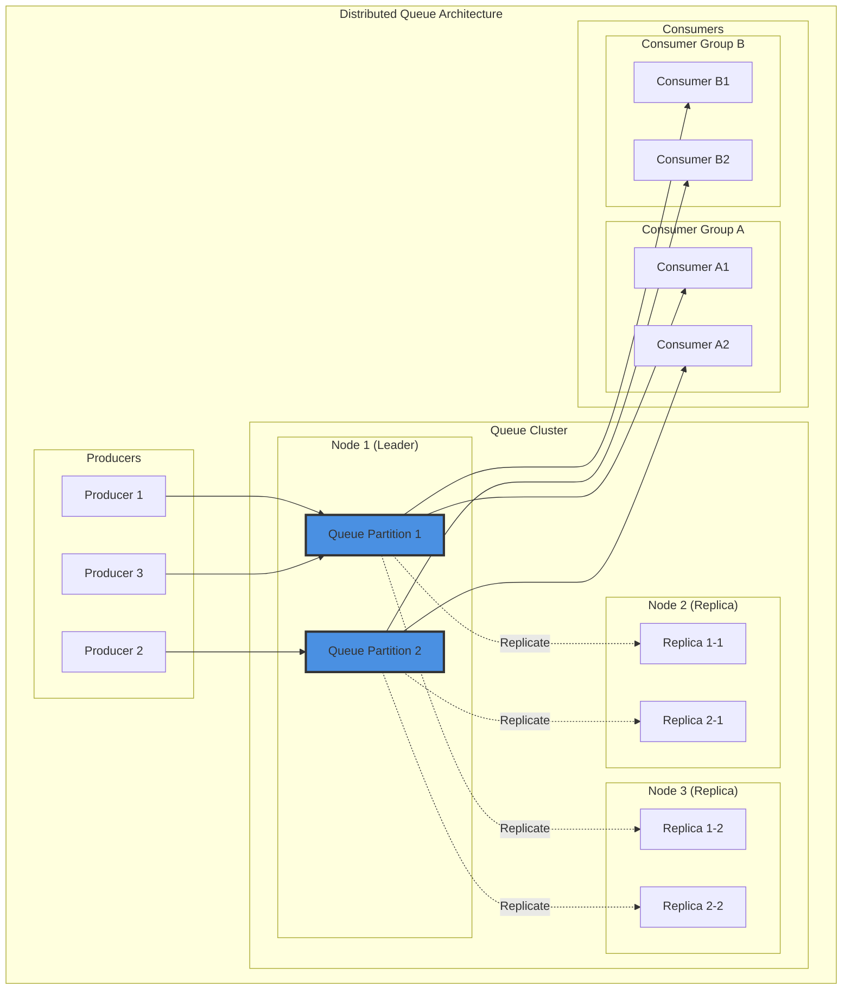
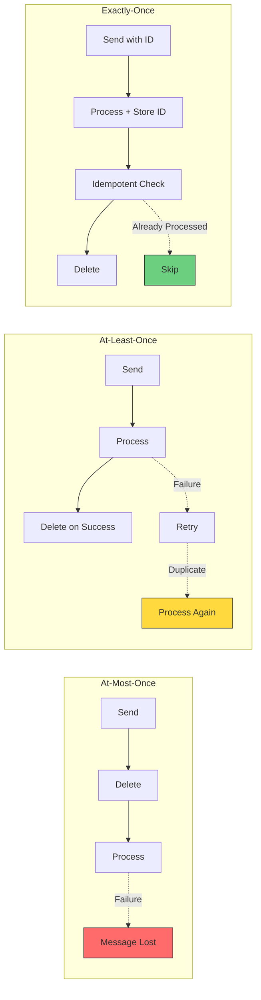
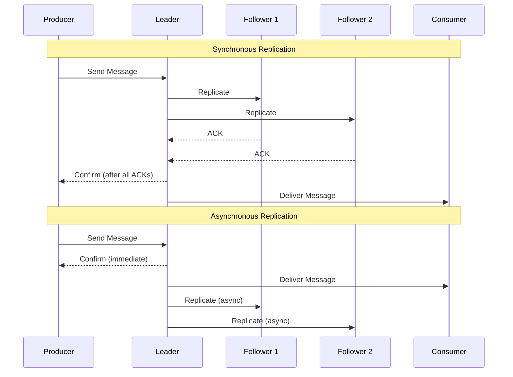
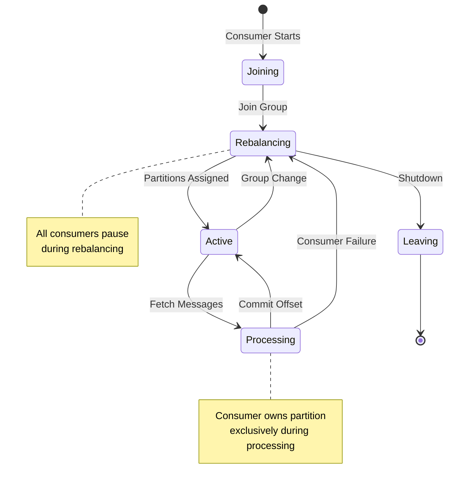
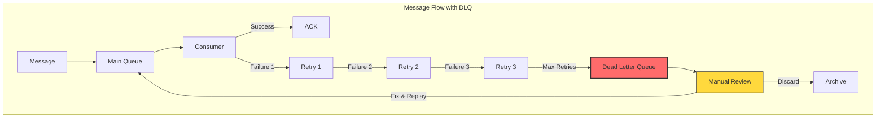
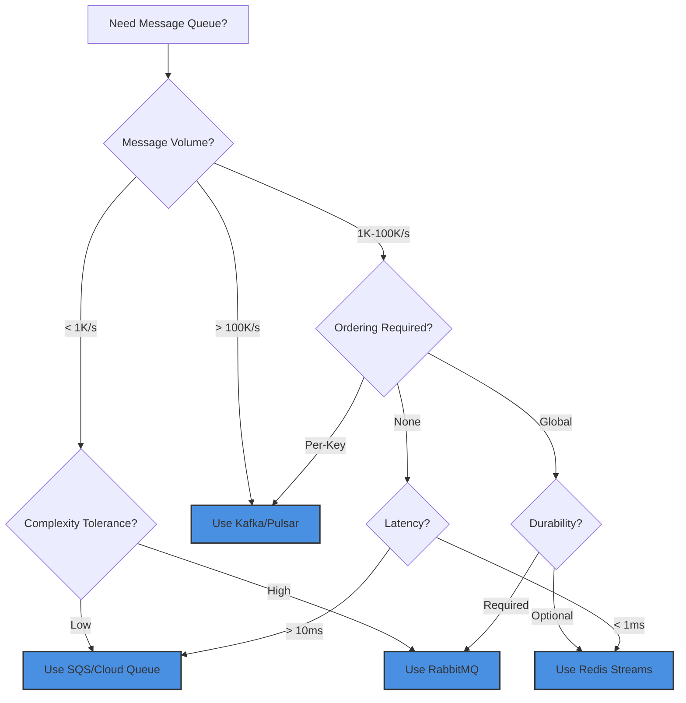

# Distributed Queue

**Reliable message queuing across distributed systems with configurable delivery guarantees**

> *"A distributed queue is the postal service of the digital world - ensuring every message reaches its destination, no matter what happens along the way."*

---

## The Essential Question

**How do we reliably pass messages between distributed components while handling failures, ensuring ordering, and preventing duplication?**

---

## Visual Overview



## Queue Semantics Comparison

| Queue Type | Ordering | Priority Support | Delay Support | Use Case |
|------------|----------|------------------|---------------|----------|
| **FIFO** | Strict order | ❌ | ❌ | Event processing, audit logs |
| **Priority** | By priority | ✅ | ❌ | Task scheduling, alerts |
| **Delay** | FIFO + delay | ❌ | ✅ | Scheduled jobs, retries |
| **Hybrid** | Configurable | ✅ | ✅ | Complex workflows |

## The Distributed Challenge

Single-node queues are simple but become bottlenecks:

```python
# ❌ Single-node queue limitations
import queue
import threading

class SingleNodeQueue:
    def __init__(self):
        self._queue = queue.Queue()
        self._lock = threading.Lock()
    
    def enqueue(self, message):
        with self._lock:
            self._queue.put(message)
    
    def dequeue(self):
        with self._lock:
            if not self._queue.empty():
                return self._queue.get()
        return None

# Problems:
# 1. Single point of failure
# 2. Limited by single machine memory/CPU
# 3. No fault tolerance
# 4. Can't scale beyond one node
```

**Distributed Queue Requirements**:
- **High Availability**: Continue operating despite node failures
- **Scalability**: Handle millions of messages per second
- **Durability**: Messages survive crashes and restarts
- **Ordering Guarantees**: Maintain message order when required
- **Exactly-Once Delivery**: Prevent message duplication
- **Load Distribution**: Spread work across multiple consumers

## Core Implementation

### Consensus-Based Distributed Queue

```python
import asyncio
import hashlib
import json
import time
import uuid
from datetime import datetime, timedelta
from dataclasses import dataclass, field
from typing import List, Optional, Dict, Any
from enum import Enum

class MessageStatus(Enum):
    PENDING = "pending"
    PROCESSING = "processing" 
    COMPLETED = "completed"
    FAILED = "failed"
    DEAD_LETTER = "dead_letter"

@dataclass
class QueueMessage:
    id: str
    topic: str
    data: Any
    partition_key: Optional[str] = None
    created_at: datetime = field(default_factory=datetime.utcnow)
    retry_count: int = 0
    max_retries: int = 3
    status: MessageStatus = MessageStatus.PENDING
    processing_timeout: Optional[datetime] = None
    
    def __post_init__(self):
        if not self.id:
            self.id = str(uuid.uuid4())
        if not self.partition_key:
            self.partition_key = self.id
    
    def can_retry(self) -> bool:
        return self.retry_count < self.max_retries
    
    def is_expired(self) -> bool:
        return (self.processing_timeout and 
                datetime.utcnow() > self.processing_timeout)
    
    def to_dict(self) -> Dict[str, Any]:
        return {
            'id': self.id,
            'topic': self.topic,
            'data': self.data,
            'partition_key': self.partition_key,
            'created_at': self.created_at.isoformat(),
            'retry_count': self.retry_count,
            'max_retries': self.max_retries,
            'status': self.status.value
        }

class DistributedQueue:
    """Consensus-based distributed queue with replication"""
    
    def __init__(self, node_id: str, cluster_nodes: List[str]):
        self.node_id = node_id
        self.cluster_nodes = cluster_nodes
        self.is_leader = False
        
# Message storage
        self.messages = {}  # message_id -> QueueMessage
        self.topics = {}    # topic -> List[message_id]
        self.partitions = {} # partition -> List[message_id]
        
# Consensus state
        self.term = 0
        self.voted_for = None
        self.log = []  # Raft log for replication
        
# Processing state
        self.consumers = {}  # consumer_id -> consumer_info
        self.processing_messages = {}  # message_id -> (consumer_id, timeout)
        
# Metrics
        self.stats = {
            'messages_enqueued': 0,
            'messages_processed': 0,
            'messages_failed': 0,
            'avg_processing_time': 0.0
        }
        
# Start background tasks
        asyncio.create_task(self._heartbeat_loop())
        asyncio.create_task(self._timeout_monitor())
        asyncio.create_task(self._replication_loop())
    
    async def enqueue(self, topic: str, data: Any, 
                     partition_key: Optional[str] = None) -> str:
        """Add message to distributed queue"""
        
        if not self.is_leader:
            leader = await self._find_leader()
            if leader:
                return await self._forward_to_leader(leader, 'enqueue', {
                    'topic': topic,
                    'data': data,
                    'partition_key': partition_key
                })
            raise Exception("No leader available")
        
# Create message
        message = QueueMessage(
            topic=topic,
            data=data,
            partition_key=partition_key
        )
        
# Replicate to cluster via Raft
        log_entry = {
            'term': self.term,
            'operation': 'enqueue',
            'message': message.to_dict()
        }
        
        if await self._replicate_log_entry(log_entry):
            await self._apply_enqueue(message)
            self.stats['messages_enqueued'] += 1
            return message.id
        
        raise Exception("Failed to replicate message")
    
    async def dequeue(self, topic: str, consumer_id: str, 
                     timeout: float = 30.0) -> Optional[QueueMessage]:
        """Get next message for processing"""
        
# Register consumer
        self.consumers[consumer_id] = {
            'last_seen': datetime.utcnow(),
            'topics': [topic]
        }
        
# Find partition for this consumer
        partition = self._get_consumer_partition(consumer_id, topic)
        
# Get next message from partition
        message = await self._get_next_message(partition, topic)
        
        if message:
# Mark as processing
            message.status = MessageStatus.PROCESSING
            message.processing_timeout = datetime.utcnow() + timedelta(seconds=timeout)
            
            self.processing_messages[message.id] = (consumer_id, message.processing_timeout)
            
# Replicate state change
            await self._replicate_status_change(message.id, MessageStatus.PROCESSING)
            
            return message
        
        return None
    
    async def ack(self, message_id: str, consumer_id: str) -> bool:
        """Acknowledge successful message processing"""
        
        message = self.messages.get(message_id)
        if not message:
            return False
        
# Verify consumer owns this message
        processing_info = self.processing_messages.get(message_id)
        if not processing_info or processing_info[0] != consumer_id:
            return False
        
# Mark as completed
        message.status = MessageStatus.COMPLETED
        del self.processing_messages[message_id]
        
# Update stats
        processing_time = (datetime.utcnow() - message.created_at).total_seconds()
        self._update_processing_stats(processing_time)
        
# Replicate completion
        await self._replicate_status_change(message_id, MessageStatus.COMPLETED)
        
        self.stats['messages_processed'] += 1
        return True
    
    async def nack(self, message_id: str, consumer_id: str, 
                  retry: bool = True) -> bool:
        """Negative acknowledgment - retry or dead letter"""
        
        message = self.messages.get(message_id)
        if not message:
            return False
        
# Verify consumer owns this message
        processing_info = self.processing_messages.get(message_id)
        if not processing_info or processing_info[0] != consumer_id:
            return False
        
        del self.processing_messages[message_id]
        
        if retry and message.can_retry():
# Retry with exponential backoff
            message.retry_count += 1
            message.status = MessageStatus.PENDING
            
# Add delay before retry
            delay = min(300, 2 ** message.retry_count)  # Max 5 minute delay
            message.created_at = datetime.utcnow() + timedelta(seconds=delay)
            
            await self._replicate_status_change(message_id, MessageStatus.PENDING)
        else:
# Move to dead letter queue
            message.status = MessageStatus.DEAD_LETTER
            await self._replicate_status_change(message_id, MessageStatus.DEAD_LETTER)
            self.stats['messages_failed'] += 1
        
        return True
    
    def _get_consumer_partition(self, consumer_id: str, topic: str) -> str:
        """Assign consumer to consistent partition"""
# Use consistent hashing to assign consumers to partitions
        hash_input = f"{consumer_id}:{topic}"
        hash_value = int(hashlib.md5(hash_input.encode()).hexdigest(), 16)
        partition_count = len(self.cluster_nodes)  # One partition per node
        return f"{topic}:partition:{hash_value % partition_count}"
    
    async def _get_next_message(self, partition: str, topic: str) -> Optional[QueueMessage]:
        """Get next available message from partition"""
        
        if partition not in self.partitions:
            return None
        
# Find first pending message in partition
        for message_id in self.partitions[partition]:
            message = self.messages.get(message_id)
            if message and message.status == MessageStatus.PENDING:
# Check if retry delay has passed
                if datetime.utcnow() >= message.created_at:
                    return message
        
        return None
    
    async def _apply_enqueue(self, message: QueueMessage):
        """Apply enqueue operation to local state"""
        
# Store message
        self.messages[message.id] = message
        
# Add to topic
        if message.topic not in self.topics:
            self.topics[message.topic] = []
        self.topics[message.topic].append(message.id)
        
# Add to partition
        partition = self._calculate_partition(message.partition_key, message.topic)
        if partition not in self.partitions:
            self.partitions[partition] = []
        self.partitions[partition].append(message.id)
    
    def _calculate_partition(self, partition_key: str, topic: str) -> str:
        """Calculate partition for message"""
        hash_value = int(hashlib.md5(partition_key.encode()).hexdigest(), 16)
        partition_count = len(self.cluster_nodes)
        partition_id = hash_value % partition_count
        return f"{topic}:partition:{partition_id}"
    
    async def _replicate_log_entry(self, log_entry: Dict[str, Any]) -> bool:
        """Replicate log entry to majority of nodes (Raft)"""
        
# Add to local log
        self.log.append(log_entry)
        
# Send to followers
        successful_replicas = 1  # Count self
        required_replicas = (len(self.cluster_nodes) // 2) + 1
        
# Simulate replication (in real implementation, send over network)
        tasks = []
        for node in self.cluster_nodes:
            if node != self.node_id:
                task = asyncio.create_task(self._send_append_entries(node, log_entry))
                tasks.append(task)
        
        if tasks:
            results = await asyncio.gather(*tasks, return_exceptions=True)
            successful_replicas += sum(1 for result in results if result is True)
        
        return successful_replicas >= required_replicas
    
    async def _send_append_entries(self, node: str, log_entry: Dict[str, Any]) -> bool:
        """Send append entries RPC to follower node"""
        try:
# Simulate network call
            await asyncio.sleep(0.01)  # Network latency
# In real implementation: send HTTP/gRPC request
            return True
        except Exception:
            return False
    
    async def _replicate_status_change(self, message_id: str, status: MessageStatus):
        """Replicate message status change"""
        log_entry = {
            'term': self.term,
            'operation': 'status_change',
            'message_id': message_id,
            'status': status.value
        }
        await self._replicate_log_entry(log_entry)
    
    async def _timeout_monitor(self):
        """Monitor for processing timeouts"""
        while True:
            await asyncio.sleep(10)  # Check every 10 seconds
            
            now = datetime.utcnow()
            expired_messages = []
            
            for message_id, (consumer_id, timeout) in self.processing_messages.items():
                if now > timeout:
                    expired_messages.append((message_id, consumer_id))
            
# Handle expired messages
            for message_id, consumer_id in expired_messages:
                await self.nack(message_id, consumer_id, retry=True)
    
    async def _heartbeat_loop(self):
        """Leader election and heartbeat"""
        while True:
            if self.is_leader:
# Send heartbeats to maintain leadership
                await self._send_heartbeats()
                await asyncio.sleep(1)
            else:
# Try to become leader if no heartbeat received
                await asyncio.sleep(3)
                if not await self._received_recent_heartbeat():
                    await self._start_election()
    
    async def _replication_loop(self):
        """Background replication for followers"""
        while True:
            if not self.is_leader:
# Followers sync from leader
                await self._sync_from_leader()
            await asyncio.sleep(5)
    
    def _update_processing_stats(self, processing_time: float):
        """Update processing time statistics"""
        current_avg = self.stats['avg_processing_time']
        processed_count = self.stats['messages_processed']
        
# Exponential moving average
        alpha = 0.1
        self.stats['avg_processing_time'] = (
            alpha * processing_time + (1 - alpha) * current_avg
        )
    
    def get_stats(self) -> Dict[str, Any]:
        """Get queue statistics"""
        return {
            **self.stats,
            'node_id': self.node_id,
            'is_leader': self.is_leader,
            'total_messages': len(self.messages),
            'topics': list(self.topics.keys()),
            'active_consumers': len(self.consumers),
            'processing_messages': len(self.processing_messages)
        }

# Usage example
async def main():
# Create distributed queue cluster
    nodes = ['node1', 'node2', 'node3']
    queues = {}
    
    for node in nodes:
        queue = DistributedQueue(node, nodes)
        queues[node] = queue
    
# Elect leader (simplified)
    queues['node1'].is_leader = True
    
# Producer: enqueue messages
    leader_queue = queues['node1']
    
    for i in range(10):
        message_id = await leader_queue.enqueue(
            topic='user_events',
            data={'user_id': i, 'action': 'login'},
            partition_key=str(i % 3)  # Distribute across 3 partitions
        )
        print(f"Enqueued message {message_id}")
    
# Consumer: process messages
    consumer_id = 'consumer_1'
    
    for _ in range(5):
        message = await leader_queue.dequeue('user_events', consumer_id)
        if message:
            print(f"Processing message {message.id}: {message.data}")
            
# Simulate processing
            await asyncio.sleep(0.1)
            
# Acknowledge completion
            await leader_queue.ack(message.id, consumer_id)
            print(f"Completed message {message.id}")
    
# Print stats
    stats = leader_queue.get_stats()
    print(f"Queue stats: {json.dumps(stats, indent=2)}")

# Run example
# asyncio.run(main())
```

## Apache Kafka Implementation

For production use, Apache Kafka provides a robust distributed queue:

```python
from kafka import KafkaProducer, KafkaConsumer
from kafka.admin import KafkaAdminClient, NewTopic
import json
import logging

class KafkaDistributedQueue:
    """Production-ready distributed queue using Apache Kafka"""
    
    def __init__(self, bootstrap_servers: List[str], 
                 security_protocol: str = 'PLAINTEXT'):
        self.bootstrap_servers = bootstrap_servers
        self.security_protocol = security_protocol
        
# Configure producer for high throughput
        self.producer = KafkaProducer(
            bootstrap_servers=bootstrap_servers,
            security_protocol=security_protocol,
            acks='all',  # Wait for all replicas
            retries=3,
            batch_size=16384,  # Batch messages for efficiency
            linger_ms=10,      # Small delay to batch more messages
            compression_type='gzip',
            value_serializer=lambda v: json.dumps(v).encode('utf-8'),
            key_serializer=lambda k: str(k).encode('utf-8') if k else None
        )
        
        self.admin = KafkaAdminClient(
            bootstrap_servers=bootstrap_servers,
            security_protocol=security_protocol
        )
    
    def create_topic(self, topic_name: str, num_partitions: int = 3, 
                    replication_factor: int = 3) -> bool:
        """Create topic with specified partitioning and replication"""
        try:
            topic = NewTopic(
                name=topic_name,
                num_partitions=num_partitions,
                replication_factor=replication_factor,
                topic_configs={
                    'cleanup.policy': 'delete',
                    'retention.ms': '604800000',  # 7 days
                    'compression.type': 'gzip'
                }
            )
            
            self.admin.create_topics([topic], validate_only=False)
            return True
            
        except Exception as e:
            logging.error(f"Failed to create topic {topic_name}: {e}")
            return False
    
    async def enqueue(self, topic: str, data: Any, key: Optional[str] = None) -> str:
        """Enqueue message with optional partitioning key"""
        try:
            future = self.producer.send(
                topic=topic,
                value=data,
                key=key
            )
            
# Get record metadata
            record_metadata = future.get(timeout=10)
            
            return f"{record_metadata.topic}:{record_metadata.partition}:{record_metadata.offset}"
            
        except Exception as e:
            logging.error(f"Failed to enqueue message: {e}")
            raise
    
    def create_consumer(self, topic: str, consumer_group: str,
                       enable_auto_commit: bool = False) -> KafkaConsumer:
        """Create consumer with optimal configuration"""
        
        return KafkaConsumer(
            topic,
            bootstrap_servers=self.bootstrap_servers,
            security_protocol=self.security_protocol,
            group_id=consumer_group,
            enable_auto_commit=enable_auto_commit,  # Manual commit for reliability
            auto_offset_reset='earliest',
            max_poll_records=100,  # Process in batches
            session_timeout_ms=30000,
            heartbeat_interval_ms=10000,
            value_deserializer=lambda m: json.loads(m.decode('utf-8')),
            key_deserializer=lambda k: k.decode('utf-8') if k else None
        )
    
    def process_messages(self, consumer: KafkaConsumer, 
                        processor_func, batch_size: int = 10):
        """Process messages in batches with manual commit"""
        
        message_batch = []
        
        try:
            for message in consumer:
                message_batch.append(message)
                
# Process batch when full
                if len(message_batch) >= batch_size:
                    self._process_batch(message_batch, processor_func, consumer)
                    message_batch = []
                    
        except KeyboardInterrupt:
            logging.info("Consumer interrupted")
        finally:
# Process remaining messages
            if message_batch:
                self._process_batch(message_batch, processor_func, consumer)
            consumer.close()
    
    def _process_batch(self, messages, processor_func, consumer):
        """Process message batch with error handling"""
        try:
# Process all messages in batch
            for message in messages:
                processor_func(message.value, message.key)
            
# Commit after successful batch processing
            consumer.commit()
            
            logging.info(f"Successfully processed batch of {len(messages)} messages")
            
        except Exception as e:
            logging.error(f"Batch processing failed: {e}")
# Don't commit - messages will be redelivered
            raise

# Usage example
def message_processor(data, key):
    """Example message processor"""
    print(f"Processing message with key {key}: {data}")
# Simulate processing
    time.sleep(0.1)

# Setup
kafka_queue = KafkaDistributedQueue(['localhost:9092'])
kafka_queue.create_topic('user_events', num_partitions=6, replication_factor=3)

# Producer
for i in range(100):
    message_id = kafka_queue.enqueue(
        topic='user_events',
        data={'user_id': i, 'timestamp': time.time()},
        key=f'user_{i % 10}'  # Partition by user
    )
    print(f"Enqueued: {message_id}")

# Consumer
consumer = kafka_queue.create_consumer('user_events', 'processing_group')
kafka_queue.process_messages(consumer, message_processor, batch_size=20)
```

## Performance Optimizations

### Message Batching

```python
class BatchedDistributedQueue:
    """Optimize throughput with message batching"""
    
    def __init__(self, base_queue, batch_size=100, flush_interval=1.0):
        self.base_queue = base_queue
        self.batch_size = batch_size
        self.flush_interval = flush_interval
        
        self.pending_messages = []
        self.last_flush = time.time()
        self._lock = asyncio.Lock()
        
# Start background flush task
        asyncio.create_task(self._periodic_flush())
    
    async def enqueue(self, topic: str, data: Any, key: Optional[str] = None):
        """Add message to batch"""
        async with self._lock:
            self.pending_messages.append((topic, data, key))
            
# Flush if batch is full
            if len(self.pending_messages) >= self.batch_size:
                await self._flush_batch()
    
    async def _flush_batch(self):
        """Flush current batch to queue"""
        if not self.pending_messages:
            return
        
        batch = self.pending_messages.copy()
        self.pending_messages.clear()
        self.last_flush = time.time()
        
# Send batch in parallel
        tasks = []
        for topic, data, key in batch:
            task = asyncio.create_task(
                self.base_queue.enqueue(topic, data, key)
            )
            tasks.append(task)
        
        await asyncio.gather(*tasks)
    
    async def _periodic_flush(self):
        """Flush batches periodically"""
        while True:
            await asyncio.sleep(self.flush_interval)
            
            async with self._lock:
                if (self.pending_messages and 
                    time.time() - self.last_flush >= self.flush_interval):
                    await self._flush_batch()
```

### Consumer Load Balancing

```python
class LoadBalancedConsumer:
    """Distribute consumption load across multiple workers"""
    
    def __init__(self, queue, topic: str, num_workers: int = 4):
        self.queue = queue
        self.topic = topic
        self.num_workers = num_workers
        self.workers = []
        self.message_counts = [0] * num_workers
        self.processing_times = [0.0] * num_workers
    
    async def start_consuming(self, processor_func):
        """Start multiple consumer workers"""
# Create worker tasks
        for worker_id in range(self.num_workers):
            consumer_id = f"worker_{worker_id}"
            task = asyncio.create_task(
                self._worker_loop(worker_id, consumer_id, processor_func)
            )
            self.workers.append(task)
        
# Wait for all workers
        await asyncio.gather(*self.workers)
    
    async def _worker_loop(self, worker_id: int, consumer_id: str, processor_func):
        """Individual worker consumer loop"""
        while True:
            try:
# Get next message
                message = await self.queue.dequeue(self.topic, consumer_id, timeout=30)
                
                if message:
                    start_time = time.time()
                    
                    try:
# Process message
                        result = await processor_func(message.data)
                        
# Acknowledge success
                        await self.queue.ack(message.id, consumer_id)
                        
# Update stats
                        processing_time = time.time() - start_time
                        self.message_counts[worker_id] += 1
                        self.processing_times[worker_id] += processing_time
                        
                    except Exception as e:
# Negative acknowledge with retry
                        await self.queue.nack(message.id, consumer_id, retry=True)
                        logging.error(f"Worker {worker_id} failed to process message: {e}")
                
                else:
# No messages available, short sleep
                    await asyncio.sleep(0.1)
                    
            except Exception as e:
                logging.error(f"Worker {worker_id} error: {e}")
                await asyncio.sleep(1)
    
    def get_worker_stats(self):
        """Get per-worker statistics"""
        stats = []
        for i in range(self.num_workers):
            avg_time = (self.processing_times[i] / max(1, self.message_counts[i]))
            stats.append({
                'worker_id': i,
                'messages_processed': self.message_counts[i],
                'avg_processing_time': avg_time
            })
        return stats
```

!!! note
    <strong>Implementation Decision Framework</strong>:
    - **High throughput (>100K msg/s)**: Apache Kafka with batching
    - **Strong consistency**: Consensus-based queue with Raft
    - **Simple deployment**: Redis Streams or RabbitMQ
    - **Multi-cloud**: Cloud-native queues (SQS, Pub/Sub, Service Bus)
    - **Event sourcing**: Kafka with log compaction
    - **Task processing**: Celery with Redis/RabbitMQ backend

## Failure Scenarios

### Network Partition Handling

```python
class PartitionTolerantQueue:
    """Handle network partitions gracefully"""
    
    def __init__(self, nodes, quorum_size):
        self.nodes = nodes
        self.quorum_size = quorum_size
        self.available_nodes = set(nodes)
    
    async def handle_node_failure(self, failed_node: str):
        """Handle node failure"""
        self.available_nodes.discard(failed_node)
        
        if len(self.available_nodes) < self.quorum_size:
# Enter read-only mode
            self.read_only = True
            logging.warning("Insufficient nodes for quorum - entering read-only mode")
        
# Redistribute partitions
        await self._rebalance_partitions()
    
    async def handle_node_recovery(self, recovered_node: str):
        """Handle node recovery"""
        self.available_nodes.add(recovered_node)
        
        if len(self.available_nodes) >= self.quorum_size:
            self.read_only = False
            logging.info("Quorum restored - resuming normal operations")
        
# Sync recovered node
        await self._sync_node(recovered_node)
        await self._rebalance_partitions()
```

## Monitoring and Observability

```python
class QueueMetrics:
    """Comprehensive queue monitoring"""
    
    def __init__(self):
        self.metrics = {
            'enqueue_rate': RateCounter(),
            'dequeue_rate': RateCounter(),
            'processing_latency': HistogramMetric(),
            'queue_depth': GaugeMetric(),
            'error_rate': RateCounter(),
            'consumer_lag': GaugeMetric()
        }
    
    def record_enqueue(self, message_size: int):
        self.metrics['enqueue_rate'].increment()
        self.metrics['queue_depth'].increment()
    
    def record_dequeue(self, processing_time: float):
        self.metrics['dequeue_rate'].increment()
        self.metrics['processing_latency'].observe(processing_time)
        self.metrics['queue_depth'].decrement()
    
    def record_error(self, error_type: str):
        self.metrics['error_rate'].increment(tags={'error_type': error_type})
    
    def export_prometheus_metrics(self) -> str:
        """Export metrics in Prometheus format"""
        return "\n".join([
            f"queue_enqueue_rate {self.metrics['enqueue_rate'].rate()}",
            f"queue_dequeue_rate {self.metrics['dequeue_rate'].rate()}",
            f"queue_processing_latency_p95 {self.metrics['processing_latency'].percentile(95)}",
            f"queue_depth {self.metrics['queue_depth'].value()}",
            f"queue_error_rate {self.metrics['error_rate'].rate()}"
        ])
```

## Delivery Guarantees

### Delivery Semantics Comparison



### Delivery Guarantee Decision Matrix

| Guarantee | Performance | Complexity | Data Loss Risk | Duplication Risk | Use When |
|-----------|-------------|------------|----------------|------------------|----------|
| **At-Most-Once** | ⚡⚡⚡ High | 🟢 Low | ❌ High | ✅ None | Metrics, logs, non-critical events |
| **At-Least-Once** | ⚡⚡ Medium | 🟡 Medium | ✅ None | ❌ High | Financial transactions (with idempotency) |
| **Exactly-Once** | ⚡ Low | 🔴 High | ✅ None | ✅ None | Critical state changes, payments |

## Queue Implementation Patterns

### Partitioning Strategies

```mermaid
graph TB
    subgraph "Partitioning Approaches"
        subgraph "Hash-Based Partitioning"
            H1[Message] --> H2[Hash(Key)]
            H2 --> H3{Partition = Hash % N}
            H3 -->|0| HP0[Partition 0]
            H3 -->|1| HP1[Partition 1]
            H3 -->|2| HP2[Partition 2]
        end
        
        subgraph "Range-Based Partitioning"
            R1[Message] --> R2[Key Value]
            R2 --> R3{Key Range}
            R3 -->|A-J| RP0[Partition 0]
            R3 -->|K-S| RP1[Partition 1]
            R3 -->|T-Z| RP2[Partition 2]
        end
        
        subgraph "Round-Robin Partitioning"
            RR1[Message 1] --> RRP0[Partition 0]
            RR2[Message 2] --> RRP1[Partition 1]
            RR3[Message 3] --> RRP2[Partition 2]
            RR4[Message 4] --> RRP0
        end
    end
```

### Replication Patterns



## Consumer Coordination

### Consumer Group Management



## Failure Handling

### Dead Letter Queue Pattern



### Retry Strategy Comparison

| Strategy | Delay Pattern | Use Case | Pros | Cons |
|----------|--------------|----------|------|------|
| **Fixed Delay** | 5s, 5s, 5s | Transient errors | Simple, predictable | May overwhelm recovering service |
| **Linear Backoff** | 5s, 10s, 15s | Gradual recovery | Balanced approach | Still predictable load |
| **Exponential Backoff** | 2s, 4s, 8s, 16s | Network issues | Reduces load effectively | Can delay recovery |
| **Jittered Backoff** | 2-4s, 3-8s, 6-16s | Distributed systems | Prevents thundering herd | More complex |

## Real-World Implementations

### System Comparison Matrix

| System | Type | Throughput | Latency | Ordering | Durability | Best For |
|--------|------|------------|---------|----------|------------|----------|
| **Kafka** | Log-based | 1M+ msg/s | 2-5ms | Per partition | Replicated | Event streaming, high volume |
| **RabbitMQ** | Traditional | 50K msg/s | <1ms | FIFO/Priority | Configurable | Enterprise messaging |
| **AWS SQS** | Managed | 3K msg/s/queue | 10-100ms | Best effort | High | Serverless, AWS ecosystem |
| **Pulsar** | Multi-tier | 1M+ msg/s | 5-10ms | Per partition | Tiered | Multi-tenancy, geo-replication |
| **Redis Streams** | In-memory | 100K msg/s | <1ms | Strict | Optional | Real-time, caching |
| **Azure Service Bus** | Managed | 2K msg/s | 20-50ms | FIFO | High | Azure ecosystem, enterprise |

### Kafka Architecture Deep Dive

```mermaid
graph TB
    subgraph "Kafka Cluster"
        subgraph "Broker 1"
            T1P0[Topic1-Partition0-Leader]
            T1P1R[Topic1-Partition1-Replica]
            T2P0R[Topic2-Partition0-Replica]
        end
        
        subgraph "Broker 2"
            T1P0R[Topic1-Partition0-Replica]
            T1P1[Topic1-Partition1-Leader]
            T2P1R[Topic2-Partition1-Replica]
        end
        
        subgraph "Broker 3"
            T2P0[Topic2-Partition0-Leader]
            T2P1[Topic2-Partition1-Leader]
            T1P0R2[Topic1-Partition0-Replica]
        end
        
        ZK[ZooKeeper/KRaft] -.->|Metadata| Broker 1
        ZK -.->|Metadata| Broker 2
        ZK -.->|Metadata| Broker 3
    end
    
    P[Producers] --> T1P0
    P --> T1P1
    P --> T2P0
    
    T1P0 --> CG1[Consumer Group 1]
    T1P1 --> CG1
    T2P0 --> CG2[Consumer Group 2]
    T2P1 --> CG2
    
    style T1P0 fill:#4a90e2,stroke:#333,stroke-width:3px
    style T1P1 fill:#4a90e2,stroke:#333,stroke-width:3px
    style T2P0 fill:#4a90e2,stroke:#333,stroke-width:3px
    style T2P1 fill:#4a90e2,stroke:#333,stroke-width:3px
```

## Performance & Scalability

### Scalability Patterns

```mermaid
graph LR
    subgraph "Vertical Partitioning"
        V1[High Priority Queue]
        V2[Normal Queue]
        V3[Bulk Queue]
        
        V1 -->|Fast Workers| VW1[Worker Pool 1]
        V2 -->|Normal Workers| VW2[Worker Pool 2]
        V3 -->|Batch Workers| VW3[Worker Pool 3]
    end
    
    subgraph "Horizontal Partitioning"
        H1[Queue] -->|Hash(UserID)| HP1[Partition 1]
        H1 -->|Hash(UserID)| HP2[Partition 2]
        H1 -->|Hash(UserID)| HP3[Partition 3]
        
        HP1 --> HW1[Workers 1-3]
        HP2 --> HW2[Workers 4-6]
        HP3 --> HW3[Workers 7-9]
    end
```

### Performance Tuning Checklist

| Component | Optimization | Impact | Trade-off |
|-----------|-------------|--------|-----------||
| **Producer** | Batch messages | ↑ Throughput 10x | ↑ Latency |
| **Producer** | Async sends | ↑ Throughput 5x | ↓ Reliability |
| **Queue** | Increase partitions | ↑ Parallelism | ↑ Complexity |
| **Queue** | Enable compression | ↓ Network 70% | ↑ CPU |
| **Consumer** | Increase prefetch | ↑ Throughput 3x | ↑ Memory |
| **Consumer** | Batch processing | ↑ Efficiency 5x | ↑ Latency |

## Decision Framework



## Production Considerations

### Monitoring Dashboard

```yaml
metrics:
  health:
    - queue_depth: < 10000 messages
    - consumer_lag: < 1000 messages
    - error_rate: < 0.1%
    - dlq_size: < 100 messages
  
  performance:
    - enqueue_rate: messages/second
    - dequeue_rate: messages/second
    - processing_time_p99: < 1s
    - batch_size_avg: messages
  
  capacity:
    - partition_count: number
    - consumer_count: number
    - disk_usage: GB
    - network_throughput: MB/s

alerts:
  critical:
    - consumer_lag > 10000
    - dlq_size > 1000
    - no_consumers > 5min
  
  warning:
    - queue_depth > 50000
    - error_rate > 1%
    - disk_usage > 80%
```

## Law Connections

!!! abstract "🔗 Fundamental Laws"
    **[Law 1: Correlated Failure](../part1-axioms/law1-failure/index.md)** - Queues must handle node failures through replication
    
    **[Law 2: Asynchronous Reality](../part1-axioms/law2-asynchrony/index.md)** - Asynchronous message passing is fundamental to distributed queues
    
    **[Law 3: Emergent Chaos](../part1-axioms/law3-emergence/index.md)** - Complex behaviors emerge from simple queue operations at scale
    
    **[Law 4: Multidimensional Optimization](../part1-axioms/law4-tradeoffs/index.md)** - Balance between throughput, latency, durability, and consistency

## Related Patterns
- [Queues & Streaming](queues-streaming.md) - General queue concepts
- [Event Sourcing](event-sourcing.md) - Event-driven architecture
- [Saga](saga.md) - Distributed transactions via queues
- [Circuit Breaker](circuit-breaker.md) - Consumer protection
- [Load Balancing](load-balancing.md) - Work distribution

## References
- [Apache Kafka: The Definitive Guide](https://www.confluent.io/resources/kafka-the-definitive-guide/)
- [Designing Data-Intensive Applications](https://dataintensive.net/) - Chapter 11
- [Amazon SQS Best Practices](https://docs.aws.amazon.com/AWSSimpleQueueService/latest/SQSDeveloperGuide/sqs-best-practices.html)
- [RabbitMQ in Depth](https://www.manning.com/books/rabbitmq-in-depth)
- [Building Event-Driven Microservices](https://www.oreilly.com/library/view/building-event-driven-microservices/9781492057888/)