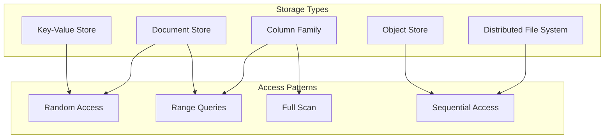

# Distributed Storage

**Scaling storage beyond single machine limits**

<div class="law-box">
<h4>The Storage Trilemma</h4>
<p>Distributed storage systems must balance three competing goals: consistency (all nodes see the same data), availability (system remains operational), and partition tolerance (system continues despite network failures). The CAP theorem proves you can only guarantee two of these three properties.</p>
</div>

## Overview

Distributed storage systems spread data across multiple nodes to achieve scalability, availability, and fault tolerance. They must handle challenges like data partitioning, replication, consistency, and failure recovery while providing acceptable performance.

### Key Challenges

1. **Data Distribution**: How to spread data across nodes
2. **Replication**: Maintaining multiple copies for fault tolerance
3. **Consistency**: Keeping replicas synchronized
4. **Failure Handling**: Recovering from node and network failures
5. **Performance**: Minimizing latency and maximizing throughput
6. **Storage Efficiency**: Balancing redundancy with space usage

## Core Concepts

### Storage Models



### Data Distribution Strategies

```python
from abc import ABC, abstractmethod
from typing import List, Dict, Any, Tuple
import hashlib
import bisect

class PartitionStrategy(ABC):
    """Abstract base for data partitioning strategies"""
    
    @abstractmethod
    def get_partition(self, key: str) -> int:
        """Determine partition for a key"""
        pass
    
    @abstractmethod
    def get_node(self, key: str, nodes: List[str]) -> str:
        """Determine node for a key"""
        pass

class HashPartitioning(PartitionStrategy):
    """Simple hash-based partitioning"""
    
    def __init__(self, num_partitions: int):
        self.num_partitions = num_partitions
    
    def get_partition(self, key: str) -> int:
        """Hash key to partition"""
        hash_value = hashlib.md5(key.encode()).hexdigest()
        return int(hash_value, 16) % self.num_partitions
    
    def get_node(self, key: str, nodes: List[str]) -> str:
        """Hash key to node"""
        partition = self.get_partition(key)
        node_index = partition % len(nodes)
        return nodes[node_index]

class RangePartitioning(PartitionStrategy):
    """Range-based partitioning"""
    
    def __init__(self, ranges: List[Tuple[str, str]]):
        self.ranges = ranges
        self.boundaries = [r[0] for r in ranges]
    
    def get_partition(self, key: str) -> int:
        """Find partition by range"""
        idx = bisect.bisect_right(self.boundaries, key) - 1
        return max(0, idx)
    
    def get_node(self, key: str, nodes: List[str]) -> str:
        """Assign node by range"""
        partition = self.get_partition(key)
        node_index = partition % len(nodes)
        return nodes[node_index]

class ConsistentHashing:
    """Consistent hashing with virtual nodes"""
    
    def __init__(self, nodes: List[str], virtual_nodes: int = 150):
        self.nodes = nodes
        self.virtual_nodes = virtual_nodes
        self.ring = {}
        self._build_ring()
    
    def _build_ring(self):
        """Build hash ring with virtual nodes"""
        for node in self.nodes:
            for i in range(self.virtual_nodes):
                virtual_node_name = f"{node}:{i}"
                hash_value = self._hash(virtual_node_name)
                self.ring[hash_value] = node
        
        self.sorted_keys = sorted(self.ring.keys())
    
    def add_node(self, node: str):
        """Add node to ring"""
        self.nodes.append(node)
        for i in range(self.virtual_nodes):
            virtual_node_name = f"{node}:{i}"
            hash_value = self._hash(virtual_node_name)
            self.ring[hash_value] = node
        
        self.sorted_keys = sorted(self.ring.keys())
    
    def remove_node(self, node: str):
        """Remove node from ring"""
        self.nodes.remove(node)
        
# Remove all virtual nodes
        keys_to_remove = [k for k, v in self.ring.items() if v == node]
        for key in keys_to_remove:
            del self.ring[key]
        
        self.sorted_keys = sorted(self.ring.keys())
    
    def get_node(self, key: str) -> str:
        """Get node responsible for key"""
        if not self.ring:
            return None
        
        hash_value = self._hash(key)
        
# Find first node clockwise from hash
        idx = bisect.bisect_right(self.sorted_keys, hash_value)
        
        if idx == len(self.sorted_keys):
            idx = 0
        
        return self.ring[self.sorted_keys[idx]]
    
    def get_nodes(self, key: str, count: int) -> List[str]:
        """Get N nodes for replication"""
        if not self.ring or count <= 0:
            return []
        
        nodes = []
        seen = set()
        
        hash_value = self._hash(key)
        idx = bisect.bisect_right(self.sorted_keys, hash_value)
        
        while len(nodes) < count and len(seen) < len(self.nodes):
            if idx >= len(self.sorted_keys):
                idx = 0
            
            node = self.ring[self.sorted_keys[idx]]
            if node not in seen:
                nodes.append(node)
                seen.add(node)
            
            idx += 1
        
        return nodes
    
    def _hash(self, key: str) -> int:
        """Hash function"""
        return int(hashlib.md5(key.encode()).hexdigest(), 16)
```

## Replication Strategies

### 1. Primary-Backup Replication

```python
import asyncio
import time
from enum import Enum
from typing import Optional, Set

class ReplicaRole(Enum):
    PRIMARY = "PRIMARY"
    BACKUP = "BACKUP"

class PrimaryBackupNode:
    """Node in primary-backup replication system"""
    
    def __init__(self, node_id: str, role: ReplicaRole):
        self.node_id = node_id
        self.role = role
        self.data = {}
        self.version = 0
        self.backups: Set[str] = set()
        self.primary: Optional[str] = None
        self.replication_log = []
        
    async def write(self, key: str, value: Any) -> bool:
        """Handle write request"""
        if self.role != ReplicaRole.PRIMARY:
# Forward to primary
            return await self._forward_to_primary(key, value)
        
# Primary handles write
        self.version += 1
        operation = {
            'op': 'write',
            'key': key,
            'value': value,
            'version': self.version,
            'timestamp': time.time()
        }
        
# Apply locally
        self.data[key] = value
        self.replication_log.append(operation)
        
# Replicate to backups
        success = await self._replicate_to_backups(operation)
        
        return success
    
    async def read(self, key: str) -> Any:
        """Handle read request"""
# Can read from any replica
        return self.data.get(key)
    
    async def _replicate_to_backups(self, operation: Dict) -> bool:
        """Replicate operation to backup nodes"""
        if not self.backups:
            return True
        
# Send to all backups in parallel
        tasks = []
        for backup_id in self.backups:
            task = self._send_to_backup(backup_id, operation)
            tasks.append(task)
        
# Wait for acknowledgments
        results = await asyncio.gather(*tasks, return_exceptions=True)
        
# Count successes
        successes = sum(1 for r in results if r is True)
        
# Require majority for success
        return successes >= len(self.backups) // 2 + 1
    
    async def _send_to_backup(self, backup_id: str, operation: Dict) -> bool:
        """Send operation to specific backup"""
# Simulate network call
        await asyncio.sleep(0.01)
        
# In real implementation, would use RPC/HTTP
        return True
    
    def apply_operation(self, operation: Dict):
        """Apply replicated operation (for backups)"""
        if operation['op'] == 'write':
            self.data[operation['key']] = operation['value']
            self.version = operation['version']
            self.replication_log.append(operation)
    
    def promote_to_primary(self):
        """Promote backup to primary"""
        self.role = ReplicaRole.PRIMARY
        self.primary = None
        
# In real system, would need to:
# 1. Ensure no split-brain
# 2. Sync with other replicas
# 3. Update cluster metadata
    
    def get_replication_lag(self, primary_version: int) -> int:
        """Calculate replication lag"""
        return primary_version - self.version

# Chain replication for strong consistency
class ChainReplicationNode:
    """Node in chain replication system"""
    
    def __init__(self, node_id: str, position: int):
        self.node_id = node_id
        self.position = position  # Position in chain
        self.data = {}
        self.predecessor: Optional[str] = None
        self.successor: Optional[str] = None
        self.pending_writes = {}  # Writes awaiting confirmation
        
    async def write(self, request_id: str, key: str, value: Any) -> bool:
        """Handle write in chain"""
        if self.position == 0:  # Head of chain
# Apply write locally
            self.data[key] = value
            
            if self.successor:
# Forward down the chain
                self.pending_writes[request_id] = (key, value)
                return await self._forward_write(request_id, key, value)
            else:
# Single node chain
                return True
        else:
# Should not receive client writes
            raise Exception("Only head accepts writes")
    
    async def read(self, key: str) -> Any:
        """Handle read request"""
        if self.successor is None:  # Tail of chain
# Read from tail for strong consistency
            return self.data.get(key)
        else:
# Forward to tail
            return await self._forward_read_to_tail(key)
    
    async def _forward_write(self, request_id: str, key: str, value: Any) -> bool:
        """Forward write to successor"""
# Send to successor
        await self._send_to_successor({
            'request_id': request_id,
            'key': key,
            'value': value
        })
        
# Wait for acknowledgment from tail
# In real system, would use callbacks/futures
        return True
    
    def receive_write(self, request_id: str, key: str, value: Any):
        """Receive write from predecessor"""
# Apply write
        self.data[key] = value
        
        if self.successor:
# Forward down chain
            self._forward_write(request_id, key, value)
        else:
# We are tail, send acknowledgment up chain
            self._send_ack_to_predecessor(request_id)
    
    def receive_ack(self, request_id: str):
        """Receive acknowledgment from successor"""
        if request_id in self.pending_writes:
            del self.pending_writes[request_id]
            
            if self.predecessor:
# Forward ack up chain
                self._send_ack_to_predecessor(request_id)
            else:
# We are head, write is committed
                pass
```

### 2. Quorum-Based Replication

```python
class QuorumReplication:
    """Quorum-based replication system"""
    
    def __init__(self, nodes: List[str], replication_factor: int):
        self.nodes = nodes
        self.replication_factor = replication_factor
        self.data_versions = {}  # Track versions for each key
        
    def calculate_quorum_sizes(self) -> Tuple[int, int]:
        """Calculate read and write quorum sizes"""
        n = self.replication_factor
        
# Various quorum configurations:
# R + W > N for strong consistency
# R = 1, W = N for read-optimized
# R = N, W = 1 for write-optimized
# R = W = (N + 1) / 2 for balanced
        
# Balanced configuration
        w = n // 2 + 1  # Write quorum
        r = n // 2 + 1  # Read quorum
        
        return r, w
    
    async def write(self, key: str, value: Any, 
                   consistency_level: str = "QUORUM") -> bool:
        """Write with quorum"""
# Get replica nodes
        replicas = self._get_replicas(key)
        
# Determine write quorum size
        if consistency_level == "ONE":
            required_acks = 1
        elif consistency_level == "QUORUM":
            _, required_acks = self.calculate_quorum_sizes()
        elif consistency_level == "ALL":
            required_acks = len(replicas)
        else:
            raise ValueError(f"Unknown consistency level: {consistency_level}")
        
# Increment version
        version = self.data_versions.get(key, 0) + 1
        self.data_versions[key] = version
        
# Send writes in parallel
        write_data = {
            'key': key,
            'value': value,
            'version': version,
            'timestamp': time.time()
        }
        
        tasks = []
        for replica in replicas:
            task = self._write_to_replica(replica, write_data)
            tasks.append(task)
        
# Wait for required acknowledgments
        results = []
        for task in asyncio.as_completed(tasks):
            try:
                result = await task
                results.append(result)
                
                if len(results) >= required_acks:
# Quorum reached, can return
                    return True
            except Exception:
# Continue waiting for other replicas
                pass
        
# Failed to reach quorum
        return False
    
    async def read(self, key: str, 
                  consistency_level: str = "QUORUM") -> Any:
        """Read with quorum"""
# Get replica nodes
        replicas = self._get_replicas(key)
        
# Determine read quorum size
        if consistency_level == "ONE":
            required_responses = 1
        elif consistency_level == "QUORUM":
            required_responses, _ = self.calculate_quorum_sizes()
        elif consistency_level == "ALL":
            required_responses = len(replicas)
        
# Read from replicas
        tasks = []
        for replica in replicas:
            task = self._read_from_replica(replica, key)
            tasks.append(task)
        
# Collect responses
        responses = []
        for task in asyncio.as_completed(tasks):
            try:
                response = await task
                responses.append(response)
                
                if len(responses) >= required_responses:
# Quorum reached, reconcile and return
                    return self._reconcile_responses(responses)
            except Exception:
                pass
        
# Failed to reach quorum
        raise Exception("Failed to reach read quorum")
    
    def _reconcile_responses(self, responses: List[Dict]) -> Any:
        """Reconcile multiple responses"""
        if not responses:
            return None
        
# Find response with highest version
        latest = max(responses, key=lambda r: (r['version'], r['timestamp']))
        
# Read repair if needed
        if any(r['version'] < latest['version'] for r in responses):
            asyncio.create_task(self._read_repair(responses, latest))
        
        return latest['value']
    
    async def _read_repair(self, responses: List[Dict], latest: Dict):
        """Repair out-of-date replicas"""
        tasks = []
        
        for response in responses:
            if response['version'] < latest['version']:
                replica = response['replica']
                task = self._write_to_replica(replica, latest)
                tasks.append(task)
        
        await asyncio.gather(*tasks, return_exceptions=True)
    
    def _get_replicas(self, key: str) -> List[str]:
        """Get replica nodes for key"""
# Use consistent hashing or similar
        consistent_hash = ConsistentHashing(self.nodes)
        return consistent_hash.get_nodes(key, self.replication_factor)
```

## Storage Efficiency

### 1. Erasure Coding

```python
import numpy as np
from typing import List, Tuple

class ReedSolomonCoding:
    """Reed-Solomon erasure coding for storage efficiency"""
    
    def __init__(self, data_shards: int, parity_shards: int):
        self.data_shards = data_shards
        self.parity_shards = parity_shards
        self.total_shards = data_shards + parity_shards
        
# Generate Vandermonde matrix for encoding
        self.encode_matrix = self._generate_matrix()
    
    def encode(self, data: bytes) -> List[bytes]:
        """Encode data into shards with parity"""
# Pad data to multiple of data_shards
        padded_data = self._pad_data(data)
        
# Split into data shards
        shard_size = len(padded_data) // self.data_shards
        data_shards = []
        
        for i in range(self.data_shards):
            start = i * shard_size
            end = (i + 1) * shard_size
            data_shards.append(padded_data[start:end])
        
# Generate parity shards
        parity_shards = self._generate_parity(data_shards)
        
        return data_shards + parity_shards
    
    def decode(self, shards: List[Optional[bytes]], 
              shard_indices: List[int]) -> bytes:
        """Decode data from available shards"""
        if len([s for s in shards if s is not None]) < self.data_shards:
            raise ValueError("Insufficient shards for decoding")
        
# Select available shards
        available_shards = []
        available_indices = []
        
        for shard, idx in zip(shards, shard_indices):
            if shard is not None:
                available_shards.append(shard)
                available_indices.append(idx)
                
                if len(available_shards) == self.data_shards:
                    break
        
# Reconstruct data
        if all(i < self.data_shards for i in available_indices):
# All data shards available
            reconstructed = b''.join(available_shards)
        else:
# Need to use parity for reconstruction
            reconstructed = self._reconstruct_data(
                available_shards, available_indices
            )
        
# Remove padding
        return self._unpad_data(reconstructed)
    
    def _generate_matrix(self) -> np.ndarray:
        """Generate Vandermonde matrix for encoding"""
        matrix = np.zeros((self.total_shards, self.data_shards), dtype=np.uint8)
        
        for i in range(self.total_shards):
            for j in range(self.data_shards):
                matrix[i, j] = self._galois_pow(i + 1, j)
        
        return matrix
    
    def _generate_parity(self, data_shards: List[bytes]) -> List[bytes]:
        """Generate parity shards"""
        parity_shards = []
        
# Convert data shards to matrix
        shard_size = len(data_shards[0])
        data_matrix = np.zeros((self.data_shards, shard_size), dtype=np.uint8)
        
        for i, shard in enumerate(data_shards):
            data_matrix[i] = np.frombuffer(shard, dtype=np.uint8)
        
# Generate parity using encoding matrix
        for i in range(self.data_shards, self.total_shards):
            parity_row = self.encode_matrix[i]
            parity_data = np.zeros(shard_size, dtype=np.uint8)
            
            for j in range(self.data_shards):
                parity_data ^= self._galois_multiply(
                    parity_row[j], data_matrix[j]
                )
            
            parity_shards.append(parity_data.tobytes())
        
        return parity_shards
    
    def _reconstruct_data(self, shards: List[bytes], 
                         indices: List[int]) -> bytes:
        """Reconstruct data from mixed data/parity shards"""
# Create decoding matrix
        decode_matrix = self._create_decode_matrix(indices)
        
# Apply matrix to recover data
# Implementation simplified for clarity
        return b''.join(shards[:self.data_shards])
    
    def _galois_multiply(self, a: int, b: np.ndarray) -> np.ndarray:
        """Galois field multiplication"""
# Simplified - real implementation uses log tables
        return (a * b) % 256
    
    def _galois_pow(self, base: int, exp: int) -> int:
        """Galois field exponentiation"""
# Simplified - real implementation uses log tables
        return pow(base, exp) % 256
    
    def _pad_data(self, data: bytes) -> bytes:
        """Pad data to multiple of data_shards"""
        remainder = len(data) % self.data_shards
        if remainder:
            padding = self.data_shards - remainder
            return data + b'\x00' * padding
        return data
    
    def _unpad_data(self, data: bytes) -> bytes:
        """Remove padding from data"""
        return data.rstrip(b'\x00')

# Storage efficiency calculator
class StorageEfficiencyCalculator:
    """Calculate storage efficiency for different schemes"""
    
    @staticmethod
    def replication_efficiency(data_size: int, 
                            replication_factor: int) -> Dict:
        """Calculate efficiency for replication"""
        total_storage = data_size * replication_factor
        
        return {
            'scheme': 'replication',
            'data_size': data_size,
            'total_storage': total_storage,
            'storage_overhead': total_storage - data_size,
            'storage_efficiency': data_size / total_storage,
            'fault_tolerance': replication_factor - 1
        }
    
    @staticmethod
    def erasure_coding_efficiency(data_size: int, 
                                data_shards: int,
                                parity_shards: int) -> Dict:
        """Calculate efficiency for erasure coding"""
        shard_size = data_size / data_shards
        total_storage = shard_size * (data_shards + parity_shards)
        
        return {
            'scheme': 'erasure_coding',
            'data_size': data_size,
            'total_storage': total_storage,
            'storage_overhead': total_storage - data_size,
            'storage_efficiency': data_size / total_storage,
            'fault_tolerance': parity_shards,
            'reconstruction_requirement': data_shards
        }
    
    @staticmethod
    def compare_schemes(data_size: int, fault_tolerance: int) -> pd.DataFrame:
        """Compare different schemes for same fault tolerance"""
        results = []
        
# Replication
        rep_factor = fault_tolerance + 1
        results.append(
            StorageEfficiencyCalculator.replication_efficiency(
                data_size, rep_factor
            )
        )
        
# Common erasure coding configurations
        ec_configs = [
            (6, 3),   # 6+3 (tolerate 3 failures)
            (10, 4),  # 10+4 (tolerate 4 failures)
            (14, 2),  # 14+2 (tolerate 2 failures)
        ]
        
        for data_shards, parity_shards in ec_configs:
            if parity_shards >= fault_tolerance:
                results.append(
                    StorageEfficiencyCalculator.erasure_coding_efficiency(
                        data_size, data_shards, parity_shards
                    )
                )
        
        return pd.DataFrame(results)
```

### 2. Compression and Deduplication

```python
import zlib
import hashlib
from typing import Dict, Set, Optional

class CompressionManager:
    """Manage compression for stored data"""
    
    def __init__(self, compression_level: int = 6):
        self.compression_level = compression_level
        self.compression_stats = {
            'total_uncompressed': 0,
            'total_compressed': 0,
            'compression_ratio': 0
        }
    
    def compress(self, data: bytes) -> Tuple[bytes, Dict]:
        """Compress data and return metadata"""
        uncompressed_size = len(data)
        
# Try different algorithms
        compressed_zlib = zlib.compress(data, self.compression_level)
        
# Choose best compression
        compressed = compressed_zlib
        algorithm = 'zlib'
        
        compressed_size = len(compressed)
        
# Update stats
        self.compression_stats['total_uncompressed'] += uncompressed_size
        self.compression_stats['total_compressed'] += compressed_size
        self.compression_stats['compression_ratio'] = (
            1 - self.compression_stats['total_compressed'] / 
            self.compression_stats['total_uncompressed']
        )
        
        metadata = {
            'algorithm': algorithm,
            'uncompressed_size': uncompressed_size,
            'compressed_size': compressed_size,
            'compression_ratio': 1 - compressed_size / uncompressed_size
        }
        
        return compressed, metadata
    
    def decompress(self, data: bytes, metadata: Dict) -> bytes:
        """Decompress data using metadata"""
        algorithm = metadata['algorithm']
        
        if algorithm == 'zlib':
            return zlib.decompress(data)
        else:
            raise ValueError(f"Unknown compression algorithm: {algorithm}")

class DeduplicationManager:
    """Content-based deduplication"""
    
    def __init__(self, chunk_size: int = 4096):
        self.chunk_size = chunk_size
        self.chunk_store = {}  # hash -> chunk data
        self.chunk_refs = {}   # hash -> reference count
        self.file_chunks = {}  # filename -> list of chunk hashes
        
    def store_file(self, filename: str, data: bytes) -> Dict:
        """Store file with deduplication"""
        chunks = self._chunk_data(data)
        chunk_hashes = []
        
        new_chunks = 0
        reused_chunks = 0
        
        for chunk in chunks:
            chunk_hash = self._hash_chunk(chunk)
            chunk_hashes.append(chunk_hash)
            
            if chunk_hash in self.chunk_store:
# Chunk already exists, increment reference
                self.chunk_refs[chunk_hash] += 1
                reused_chunks += 1
            else:
# New chunk, store it
                self.chunk_store[chunk_hash] = chunk
                self.chunk_refs[chunk_hash] = 1
                new_chunks += 1
        
        self.file_chunks[filename] = chunk_hashes
        
        return {
            'filename': filename,
            'size': len(data),
            'chunks': len(chunks),
            'new_chunks': new_chunks,
            'reused_chunks': reused_chunks,
            'dedup_ratio': reused_chunks / len(chunks) if chunks else 0
        }
    
    def retrieve_file(self, filename: str) -> bytes:
        """Retrieve deduplicated file"""
        if filename not in self.file_chunks:
            raise KeyError(f"File not found: {filename}")
        
        chunks = []
        for chunk_hash in self.file_chunks[filename]:
            if chunk_hash not in self.chunk_store:
                raise ValueError(f"Missing chunk: {chunk_hash}")
            chunks.append(self.chunk_store[chunk_hash])
        
        return b''.join(chunks)
    
    def delete_file(self, filename: str):
        """Delete file and clean up unreferenced chunks"""
        if filename not in self.file_chunks:
            return
        
# Decrement reference counts
        for chunk_hash in self.file_chunks[filename]:
            self.chunk_refs[chunk_hash] -= 1
            
# Remove chunk if no more references
            if self.chunk_refs[chunk_hash] == 0:
                del self.chunk_store[chunk_hash]
                del self.chunk_refs[chunk_hash]
        
        del self.file_chunks[filename]
    
    def _chunk_data(self, data: bytes) -> List[bytes]:
        """Split data into chunks"""
        chunks = []
        
        for i in range(0, len(data), self.chunk_size):
            chunk = data[i:i + self.chunk_size]
            chunks.append(chunk)
        
        return chunks
    
    def _hash_chunk(self, chunk: bytes) -> str:
        """Generate hash for chunk"""
        return hashlib.sha256(chunk).hexdigest()
    
    def get_dedup_stats(self) -> Dict:
        """Get deduplication statistics"""
        total_chunks = sum(len(chunks) for chunks in self.file_chunks.values())
        unique_chunks = len(self.chunk_store)
        
        return {
            'total_files': len(self.file_chunks),
            'total_chunks': total_chunks,
            'unique_chunks': unique_chunks,
            'dedup_ratio': 1 - unique_chunks / total_chunks if total_chunks else 0,
            'space_saved': (total_chunks - unique_chunks) * self.chunk_size
        }
```

## Distributed File Systems

### 1. GFS-Style Architecture

```python
class GFSMaster:
    """GFS-style master node"""
    
    def __init__(self):
        self.namespace = {}  # filename -> file metadata
        self.chunk_metadata = {}  # chunk_id -> chunk info
        self.chunkserver_info = {}  # server_id -> server metadata
        self.chunk_size = 64 * 1024 * 1024  # 64MB chunks
        
    def create_file(self, filename: str) -> str:
        """Create new file"""
        if filename in self.namespace:
            raise FileExistsError(f"File already exists: {filename}")
        
        file_id = str(uuid.uuid4())
        self.namespace[filename] = {
            'file_id': file_id,
            'size': 0,
            'chunks': [],
            'created': time.time(),
            'modified': time.time()
        }
        
        return file_id
    
    def add_chunk(self, filename: str, data_size: int) -> List[Dict]:
        """Add chunks to file"""
        if filename not in self.namespace:
            raise FileNotFoundError(f"File not found: {filename}")
        
        file_meta = self.namespace[filename]
        chunks_needed = (data_size + self.chunk_size - 1) // self.chunk_size
        
        chunk_allocations = []
        
        for i in range(chunks_needed):
            chunk_id = str(uuid.uuid4())
            
# Select chunkservers for replicas
            servers = self._select_chunkservers(3)  # 3 replicas
            
            chunk_info = {
                'chunk_id': chunk_id,
                'file_id': file_meta['file_id'],
                'index': len(file_meta['chunks']),
                'size': min(self.chunk_size, 
                          data_size - i * self.chunk_size),
                'replicas': servers,
                'version': 1,
                'checksum': None
            }
            
            self.chunk_metadata[chunk_id] = chunk_info
            file_meta['chunks'].append(chunk_id)
            chunk_allocations.append(chunk_info)
        
        file_meta['size'] += data_size
        file_meta['modified'] = time.time()
        
        return chunk_allocations
    
    def get_chunk_locations(self, filename: str, 
                          chunk_index: int) -> List[str]:
        """Get locations of a specific chunk"""
        if filename not in self.namespace:
            raise FileNotFoundError(f"File not found: {filename}")
        
        file_meta = self.namespace[filename]
        
        if chunk_index >= len(file_meta['chunks']):
            raise IndexError(f"Chunk index out of range: {chunk_index}")
        
        chunk_id = file_meta['chunks'][chunk_index]
        chunk_info = self.chunk_metadata[chunk_id]
        
# Return only alive replicas
        return [s for s in chunk_info['replicas'] 
                if self._is_chunkserver_alive(s)]
    
    def _select_chunkservers(self, count: int) -> List[str]:
        """Select chunkservers for new chunk"""
# Consider factors:
# 1. Available disk space
# 2. Current load
# 3. Network topology (rack awareness)
# 4. Recent failures
        
        available_servers = [
            server_id for server_id, info in self.chunkserver_info.items()
            if info['status'] == 'active' and info['free_space'] > self.chunk_size
        ]
        
        if len(available_servers) < count:
            raise Exception("Insufficient chunkservers available")
        
# Simple selection - in practice use sophisticated algorithm
        import random
        return random.sample(available_servers, count)
    
    def _is_chunkserver_alive(self, server_id: str) -> bool:
        """Check if chunkserver is alive"""
        if server_id not in self.chunkserver_info:
            return False
        
        info = self.chunkserver_info[server_id]
        
# Check heartbeat
        heartbeat_timeout = 60  # seconds
        return (time.time() - info['last_heartbeat'] < heartbeat_timeout and
                info['status'] == 'active')
    
    def handle_chunkserver_failure(self, server_id: str):
        """Handle chunkserver failure"""
        if server_id not in self.chunkserver_info:
            return
        
        self.chunkserver_info[server_id]['status'] = 'failed'
        
# Find all chunks on failed server
        affected_chunks = []
        
        for chunk_id, chunk_info in self.chunk_metadata.items():
            if server_id in chunk_info['replicas']:
                affected_chunks.append(chunk_id)
        
# Re-replicate affected chunks
        for chunk_id in affected_chunks:
            self._re_replicate_chunk(chunk_id, server_id)
    
    def _re_replicate_chunk(self, chunk_id: str, failed_server: str):
        """Re-replicate chunk after server failure"""
        chunk_info = self.chunk_metadata[chunk_id]
        
# Remove failed server from replicas
        chunk_info['replicas'].remove(failed_server)
        
# Check if we need more replicas
        current_replicas = len([s for s in chunk_info['replicas']
                               if self._is_chunkserver_alive(s)])
        
        if current_replicas < 3:
# Select new server for replica
            new_servers = self._select_chunkservers(3 - current_replicas)
            chunk_info['replicas'].extend(new_servers)
            
# Trigger re-replication
# In practice, would send copy command to chunkserver

class GFSChunkServer:
    """GFS-style chunk server"""
    
    def __init__(self, server_id: str, master_addr: str):
        self.server_id = server_id
        self.master_addr = master_addr
        self.chunks = {}  # chunk_id -> chunk data
        self.chunk_metadata = {}  # chunk_id -> metadata
        self.available_space = 1024 * 1024 * 1024 * 1024  # 1TB
        
    def store_chunk(self, chunk_id: str, data: bytes, 
                   checksum: str) -> bool:
        """Store chunk data"""
# Verify checksum
        calculated_checksum = hashlib.md5(data).hexdigest()
        if calculated_checksum != checksum:
            raise ValueError("Checksum mismatch")
        
# Check space
        if len(data) > self.available_space:
            raise IOError("Insufficient space")
        
# Store chunk
        self.chunks[chunk_id] = data
        self.chunk_metadata[chunk_id] = {
            'size': len(data),
            'checksum': checksum,
            'stored_at': time.time()
        }
        
        self.available_space -= len(data)
        
        return True
    
    def read_chunk(self, chunk_id: str, offset: int = 0, 
                  length: Optional[int] = None) -> bytes:
        """Read chunk data"""
        if chunk_id not in self.chunks:
            raise KeyError(f"Chunk not found: {chunk_id}")
        
        data = self.chunks[chunk_id]
        
        if length is None:
            return data[offset:]
        else:
            return data[offset:offset + length]
    
    def delete_chunk(self, chunk_id: str):
        """Delete chunk"""
        if chunk_id in self.chunks:
            chunk_size = len(self.chunks[chunk_id])
            del self.chunks[chunk_id]
            del self.chunk_metadata[chunk_id]
            self.available_space += chunk_size
    
    def send_heartbeat(self) -> Dict:
        """Send heartbeat to master"""
        return {
            'server_id': self.server_id,
            'timestamp': time.time(),
            'chunks': list(self.chunks.keys()),
            'available_space': self.available_space,
            'total_chunks': len(self.chunks)
        }
    
    def replicate_chunk(self, chunk_id: str, target_server: str):
        """Replicate chunk to another server"""
        if chunk_id not in self.chunks:
            raise KeyError(f"Chunk not found: {chunk_id}")
        
        data = self.chunks[chunk_id]
        metadata = self.chunk_metadata[chunk_id]
        
# In practice, would send over network
# Here we simulate the replication
        return {
            'chunk_id': chunk_id,
            'data': data,
            'checksum': metadata['checksum'],
            'target': target_server
        }
```

## Real-World Examples

### 1. HDFS Implementation

```python
class HDFSNameNode:
    """HDFS NameNode implementation"""
    
    def __init__(self):
        self.namespace = FSDirectory()
        self.block_manager = BlockManager()
        self.datanode_manager = DataNodeManager()
        self.lease_manager = LeaseManager()
        self.replication_monitor = ReplicationMonitor()
        
    def create(self, path: str, replication: int = 3) -> bool:
        """Create file with specified replication"""
        if self.namespace.exists(path):
            return False
        
# Create file entry
        file_inode = INode(path, is_file=True)
        file_inode.replication = replication
        
        self.namespace.add_inode(file_inode)
        
# Acquire lease for writing
        self.lease_manager.add_lease(path, client_id=self._get_client_id())
        
        return True
    
    def add_block(self, path: str) -> Optional[LocatedBlock]:
        """Allocate new block for file"""
        if not self.namespace.exists(path):
            return None
        
# Check lease
        if not self.lease_manager.has_lease(path, self._get_client_id()):
            raise Exception("No lease for file")
        
# Allocate block
        block = self.block_manager.allocate_block()
        
# Choose datanodes
        file_inode = self.namespace.get_inode(path)
        targets = self.datanode_manager.choose_targets(
            file_inode.replication
        )
        
# Create located block
        located_block = LocatedBlock(block, targets)
        
# Update file
        file_inode.add_block(located_block)
        
        return located_block
    
    def complete(self, path: str) -> bool:
        """Complete file write"""
        if not self.namespace.exists(path):
            return False
        
# Release lease
        self.lease_manager.remove_lease(path)
        
# Mark file as complete
        file_inode = self.namespace.get_inode(path)
        file_inode.complete()
        
# Check replication
        self.replication_monitor.check_file(file_inode)
        
        return True
    
    def get_block_locations(self, path: str, offset: int, 
                          length: int) -> List[LocatedBlock]:
        """Get block locations for read"""
        if not self.namespace.exists(path):
            raise FileNotFoundError(path)
        
        file_inode = self.namespace.get_inode(path)
        
# Find relevant blocks
        blocks = []
        current_offset = 0
        
        for block_info in file_inode.blocks:
            block_end = current_offset + block_info.block.num_bytes
            
            if current_offset < offset + length and block_end > offset:
# This block is needed
                locations = self.block_manager.get_locations(
                    block_info.block.block_id
                )
                
                located_block = LocatedBlock(
                    block_info.block,
                    locations,
                    current_offset
                )
                blocks.append(located_block)
            
            current_offset = block_end
            
            if current_offset >= offset + length:
                break
        
        return blocks
    
    def process_datanode_heartbeat(self, datanode_id: str, 
                                  report: Dict) -> List[Command]:
        """Process heartbeat from DataNode"""
        commands = []
        
# Update datanode info
        self.datanode_manager.update_heartbeat(datanode_id, report)
        
# Check if any blocks need replication
        if 'blocks' in report:
            for block_id in report['blocks']:
                replication_factor = self.block_manager.get_replication(block_id)
                current_replicas = self.block_manager.get_replica_count(block_id)
                
                if current_replicas < replication_factor:
# Need more replicas
                    source = self.block_manager.get_replica_location(block_id)
                    targets = self.datanode_manager.choose_targets(
                        replication_factor - current_replicas,
                        excluded=[source]
                    )
                    
                    cmd = ReplicationCommand(block_id, source, targets)
                    commands.append(cmd)
        
# Check for over-replicated blocks
        over_replicated = self.block_manager.get_over_replicated_blocks()
        for block_id in over_replicated:
            excess = self.block_manager.get_excess_replicas(block_id)
            
            for datanode in excess:
                cmd = DeletionCommand(block_id, datanode)
                commands.append(cmd)
        
        return commands

class HDFSDataNode:
    """HDFS DataNode implementation"""
    
    def __init__(self, datanode_id: str, data_dirs: List[str]):
        self.datanode_id = datanode_id
        self.data_dirs = data_dirs
        self.block_scanner = BlockScanner()
        self.block_pool = BlockPool()
        
    def write_block(self, block_id: str, data: bytes, 
                   targets: List[str]) -> bool:
        """Write block and replicate to targets"""
# Write locally
        block_file = self._get_block_file(block_id)
        meta_file = self._get_meta_file(block_id)
        
# Write data
        with open(block_file, 'wb') as f:
            f.write(data)
        
# Calculate and write checksum
        checksum = self._calculate_checksum(data)
        with open(meta_file, 'w') as f:
            f.write(checksum)
        
# Update block pool
        self.block_pool.add_block(block_id, len(data))
        
# Replicate to other datanodes
        if targets:
            next_target = targets[0]
            remaining_targets = targets[1:]
            
# Pipeline replication
            self._replicate_block(
                block_id, data, checksum, 
                next_target, remaining_targets
            )
        
        return True
    
    def read_block(self, block_id: str, offset: int = 0,
                  length: Optional[int] = None) -> bytes:
        """Read block data"""
        block_file = self._get_block_file(block_id)
        
        if not os.path.exists(block_file):
            raise FileNotFoundError(f"Block not found: {block_id}")
        
# Verify checksum before reading
        if not self._verify_block_checksum(block_id):
            raise ValueError(f"Checksum verification failed: {block_id}")
        
        with open(block_file, 'rb') as f:
            f.seek(offset)
            
            if length is None:
                data = f.read()
            else:
                data = f.read(length)
        
        return data
    
    def _replicate_block(self, block_id: str, data: bytes,
                        checksum: str, target: str, 
                        remaining: List[str]):
        """Replicate block to target datanode"""
# In practice, establish TCP connection to target
# Send block data in pipeline fashion
        
# Simulate network transfer
        transfer_request = {
            'block_id': block_id,
            'data': data,
            'checksum': checksum,
            'targets': remaining
        }
        
# Target datanode will continue the pipeline
        self._send_to_datanode(target, transfer_request)
```

### 2. Ceph Architecture

```python
class CephMonitor:
    """Ceph monitor - maintains cluster maps"""
    
    def __init__(self):
        self.cluster_map = ClusterMap()
        self.osd_map = OSDMap()
        self.pg_map = PGMap()
        self.crush_map = CRUSHMap()
        
    def handle_osd_boot(self, osd_id: int, metadata: Dict):
        """Handle OSD boot/registration"""
# Add OSD to maps
        self.osd_map.add_osd(osd_id, metadata)
        
# Update CRUSH map
        self.crush_map.add_device(
            osd_id,
            metadata['weight'],
            metadata['location']
        )
        
# Trigger rebalancing if needed
        self._maybe_rebalance()
    
    def calculate_pg_placement(self, pg_id: str) -> List[int]:
        """Calculate OSD placement for PG using CRUSH"""
        pool = self._get_pool_for_pg(pg_id)
        
# Use CRUSH to determine placement
        osds = self.crush_map.map(
            pg_id,
            pool.replication_factor,
            pool.crush_ruleset
        )
        
        return osds
    
    def handle_osd_failure(self, osd_id: int):
        """Handle OSD failure"""
# Mark OSD as down
        self.osd_map.mark_down(osd_id)
        
# Find affected PGs
        affected_pgs = self.pg_map.get_pgs_on_osd(osd_id)
        
        for pg_id in affected_pgs:
# Recalculate placement without failed OSD
            new_osds = self.calculate_pg_placement(pg_id)
            
# Update PG mapping
            self.pg_map.update_mapping(pg_id, new_osds)
            
# Mark PG for recovery
            self.pg_map.mark_degraded(pg_id)

class CephOSD:
    """Ceph OSD (Object Storage Daemon)"""
    
    def __init__(self, osd_id: int, journal_path: str):
        self.osd_id = osd_id
        self.journal = Journal(journal_path)
        self.store = ObjectStore()
        self.pg_map = {}  # pg_id -> PG instance
        
    def handle_write(self, object_name: str, data: bytes) -> bool:
        """Handle object write"""
# Calculate PG for object
        pg_id = self._calculate_pg(object_name)
        
        if pg_id not in self.pg_map:
            return False
        
        pg = self.pg_map[pg_id]
        
# Write to journal first
        transaction = Transaction()
        transaction.write(object_name, data)
        
        self.journal.append(transaction)
        
# Apply to object store
        pg.write_object(object_name, data)
        
# Replicate to other OSDs
        replica_osds = pg.get_replica_osds()
        for replica_osd in replica_osds:
            self._replicate_write(replica_osd, pg_id, object_name, data)
        
        return True
    
    def handle_read(self, object_name: str) -> Optional[bytes]:
        """Handle object read"""
        pg_id = self._calculate_pg(object_name)
        
        if pg_id not in self.pg_map:
            return None
        
        pg = self.pg_map[pg_id]
        return pg.read_object(object_name)
    
    def start_recovery(self, pg_id: str):
        """Start recovery for degraded PG"""
        if pg_id not in self.pg_map:
            return
        
        pg = self.pg_map[pg_id]
        missing_objects = pg.get_missing_objects()
        
# Request missing objects from peers
        peer_osds = pg.get_peer_osds()
        
        for obj_name in missing_objects:
            for peer in peer_osds:
                data = self._request_object(peer, pg_id, obj_name)
                if data:
                    pg.write_object(obj_name, data)
                    break
    
    def scrub_pg(self, pg_id: str):
        """Scrub PG for consistency"""
        if pg_id not in self.pg_map:
            return
        
        pg = self.pg_map[pg_id]
        objects = pg.list_objects()
        
        inconsistencies = []
        
        for obj_name in objects:
# Calculate checksum
            local_data = pg.read_object(obj_name)
            local_checksum = hashlib.sha256(local_data).hexdigest()
            
# Compare with replicas
            peer_osds = pg.get_peer_osds()
            
            for peer in peer_osds:
                peer_checksum = self._get_object_checksum(
                    peer, pg_id, obj_name
                )
                
                if peer_checksum != local_checksum:
                    inconsistencies.append({
                        'object': obj_name,
                        'local_checksum': local_checksum,
                        'peer': peer,
                        'peer_checksum': peer_checksum
                    })
        
        if inconsistencies:
            self._handle_inconsistencies(pg_id, inconsistencies)
```

## Performance Optimization

### 1. Caching Layer

```python
class DistributedCache:
    """Distributed caching layer for storage"""
    
    def __init__(self, cache_nodes: List[str]):
        self.cache_nodes = cache_nodes
        self.consistent_hash = ConsistentHashing(cache_nodes)
        self.local_cache = LRUCache(capacity=1000)
        self.cache_stats = CacheStats()
        
    async def get(self, key: str) -> Optional[Any]:
        """Get value from cache"""
# Check local cache first
        value = self.local_cache.get(key)
        if value is not None:
            self.cache_stats.record_hit('local')
            return value
        
# Check distributed cache
        cache_node = self.consistent_hash.get_node(key)
        
        try:
            value = await self._get_from_node(cache_node, key)
            if value is not None:
# Store in local cache
                self.local_cache.put(key, value)
                self.cache_stats.record_hit('distributed')
                return value
        except Exception:
            pass
        
        self.cache_stats.record_miss()
        return None
    
    async def put(self, key: str, value: Any, ttl: int = 3600):
        """Put value in cache"""
# Store in local cache
        self.local_cache.put(key, value)
        
# Store in distributed cache
        cache_node = self.consistent_hash.get_node(key)
        
        try:
            await self._put_to_node(cache_node, key, value, ttl)
            
# Optionally replicate to other nodes
            replica_nodes = self.consistent_hash.get_nodes(key, count=2)
            for node in replica_nodes[1:]:
                asyncio.create_task(
                    self._put_to_node(node, key, value, ttl)
                )
        except Exception as e:
# Log but don't fail
            pass
    
    def invalidate(self, key: str):
        """Invalidate cache entry"""
# Remove from local cache
        self.local_cache.remove(key)
        
# Remove from distributed cache
        all_nodes = self.consistent_hash.get_nodes(key, count=3)
        
        for node in all_nodes:
            asyncio.create_task(self._invalidate_on_node(node, key))

class CacheStats:
    """Track cache performance metrics"""
    
    def __init__(self):
        self.hits = {'local': 0, 'distributed': 0}
        self.misses = 0
        self.evictions = 0
        
    def record_hit(self, cache_level: str):
        self.hits[cache_level] += 1
    
    def record_miss(self):
        self.misses += 1
    
    def get_hit_rate(self) -> float:
        total_hits = sum(self.hits.values())
        total_requests = total_hits + self.misses
        
        if total_requests == 0:
            return 0.0
        
        return total_hits / total_requests
```

### 2. I/O Optimization

```python
class IOOptimizer:
    """Optimize I/O operations for distributed storage"""
    
    def __init__(self):
        self.prefetch_size = 1024 * 1024  # 1MB
        self.write_buffer_size = 4 * 1024 * 1024  # 4MB
        self.compression = CompressionManager()
        
    async def optimized_read(self, storage_client, path: str,
                           offset: int, length: int) -> bytes:
        """Read with prefetching and caching"""
# Align read to block boundaries
        block_size = 64 * 1024  # 64KB
        
        aligned_offset = (offset // block_size) * block_size
        aligned_end = ((offset + length + block_size - 1) // 
                      block_size) * block_size
        
# Prefetch if sequential access detected
        if self._is_sequential_access(path, offset):
            prefetch_end = min(
                aligned_end + self.prefetch_size,
                await storage_client.get_file_size(path)
            )
            
# Async prefetch
            asyncio.create_task(
                storage_client.read(path, aligned_end, 
                                  prefetch_end - aligned_end)
            )
        
# Read aligned data
        data = await storage_client.read(
            path, aligned_offset, 
            aligned_end - aligned_offset
        )
        
# Return requested portion
        start = offset - aligned_offset
        return data[start:start + length]
    
    async def optimized_write(self, storage_client, path: str,
                            data: bytes) -> bool:
        """Write with buffering and compression"""
# Compress if beneficial
        if len(data) > 1024:  # Only compress larger data
            compressed, metadata = self.compression.compress(data)
            
            if metadata['compression_ratio'] > 0.2:  # 20% savings
# Use compressed version
                data = compressed
                
# Store compression metadata
                await storage_client.set_metadata(
                    path, 'compression', metadata
                )
        
# Buffer small writes
        if len(data) < self.write_buffer_size // 4:
            return await self._buffered_write(storage_client, path, data)
        else:
            return await storage_client.write(path, data)
    
    def _is_sequential_access(self, path: str, offset: int) -> bool:
        """Detect sequential access pattern"""
# Track access patterns per file
# Simplified implementation
        return True
```

## Monitoring and Management

### 1. Health Monitoring

```python
class StorageHealthMonitor:
    """Monitor distributed storage health"""
    
    def __init__(self):
        self.node_health = {}
        self.disk_metrics = {}
        self.replication_status = {}
        self.alert_thresholds = {
            'disk_usage': 0.85,
            'node_failure_rate': 0.1,
            'replication_lag': 300  # seconds
        }
        
    def update_node_health(self, node_id: str, metrics: Dict):
        """Update node health metrics"""
        self.node_health[node_id] = {
            'last_update': time.time(),
            'status': self._calculate_health_status(metrics),
            'metrics': metrics
        }
        
# Check for alerts
        self._check_alerts(node_id, metrics)
    
    def _calculate_health_status(self, metrics: Dict) -> str:
        """Calculate overall health status"""
        if metrics.get('disk_usage', 0) > 0.95:
            return 'critical'
        elif metrics.get('disk_usage', 0) > 0.85:
            return 'warning'
        elif metrics.get('error_rate', 0) > 0.05:
            return 'degraded'
        else:
            return 'healthy'
    
    def get_cluster_health(self) -> Dict:
        """Get overall cluster health"""
        total_nodes = len(self.node_health)
        
        if total_nodes == 0:
            return {'status': 'unknown', 'nodes': 0}
        
        healthy_nodes = sum(
            1 for health in self.node_health.values()
            if health['status'] == 'healthy'
        )
        
        health_ratio = healthy_nodes / total_nodes
        
        if health_ratio >= 0.95:
            status = 'green'
        elif health_ratio >= 0.8:
            status = 'yellow'
        else:
            status = 'red'
        
        return {
            'status': status,
            'total_nodes': total_nodes,
            'healthy_nodes': healthy_nodes,
            'unhealthy_nodes': total_nodes - healthy_nodes,
            'health_ratio': health_ratio
        }
```

## Trade-offs and Best Practices

### Decision Matrix

<div class="responsive-table" markdown>

| Storage Type | Consistency | Availability | Scalability | Use Case |
|--------------|------------|--------------|-------------|----------|
| Replicated | Strong | Medium | Limited | Small datasets, strong consistency |
| Sharded | Variable | High | High | Large datasets, horizontal scaling |
| Erasure Coded | Eventual | High | High | Cold storage, cost efficiency |
| Distributed FS | Variable | High | High | File storage, big data |

</div>


### Best Practices

1. **Design for Failure**
   - Assume nodes will fail
   - Implement automatic recovery
   - Test failure scenarios regularly

2. **Monitor Everything**
   - Track storage utilization
   - Monitor replication lag
   - Alert on anomalies

3. **Optimize for Your Workload**
   - Read-heavy: optimize caching
   - Write-heavy: optimize buffering
   - Mixed: balance both

4. **Plan Capacity**
   - Account for replication overhead
   - Plan for growth
   - Monitor usage trends

## Related Patterns

- [Sharding](sharding.md) - Data partitioning strategies
- [Replication](leader-follower.md) - Data replication patterns
- [Consistent Hashing](sharding.md#consistent-hashing) - Distributed data placement
- CAP Theorem (Coming Soon) - Fundamental trade-offs
- [Eventual Consistency](eventual-consistency.md) - Consistency models

## References

1. "The Google File System" - Ghemawat, Gobioff, Leung
2. "Bigtable: A Distributed Storage System" - Chang et al.
3. "HDFS Architecture Guide" - Apache Hadoop Documentation
4. "Ceph: A Scalable, High-Performance Distributed File System" - Weil et al.
5. "Amazon S3: Object Storage Built to Store and Retrieve Any Amount of Data" - AWS Documentation

---

*Next: [CRDT](crdt.md) - Conflict-free Replicated Data Types for distributed systems*