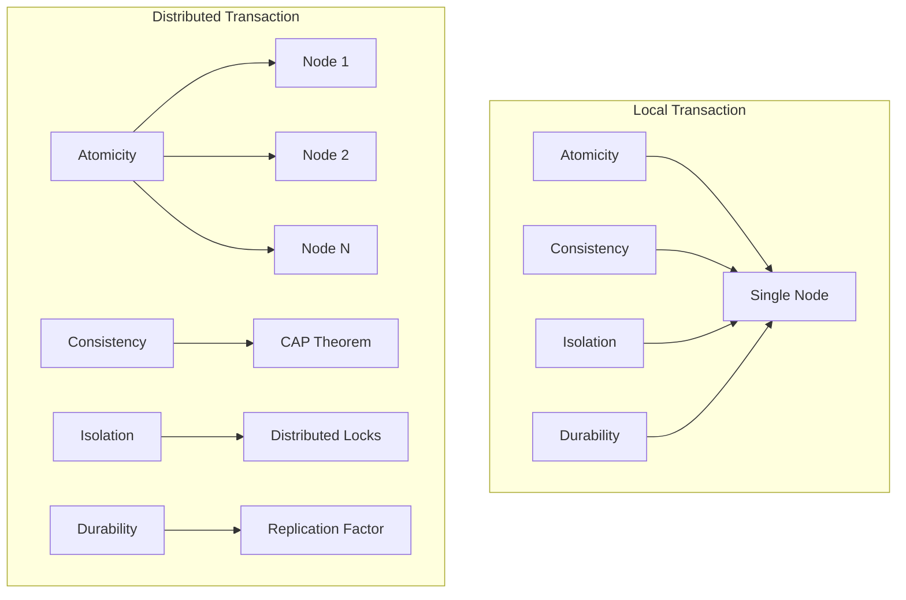
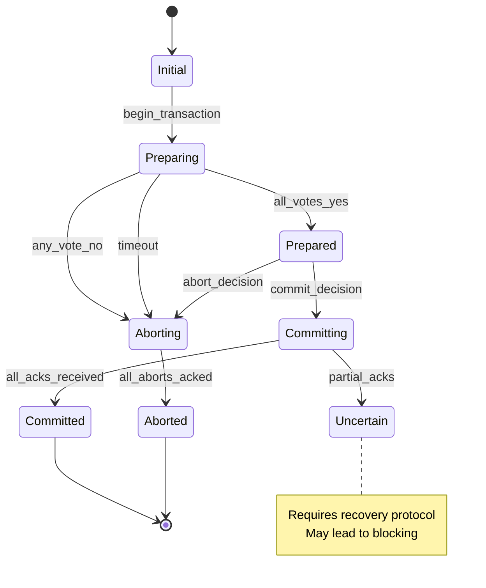
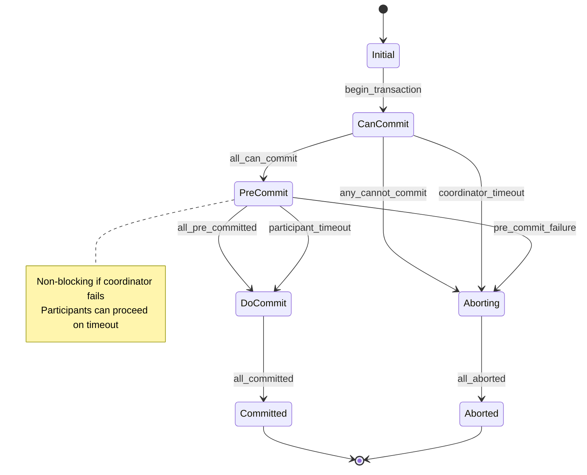
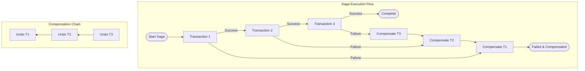
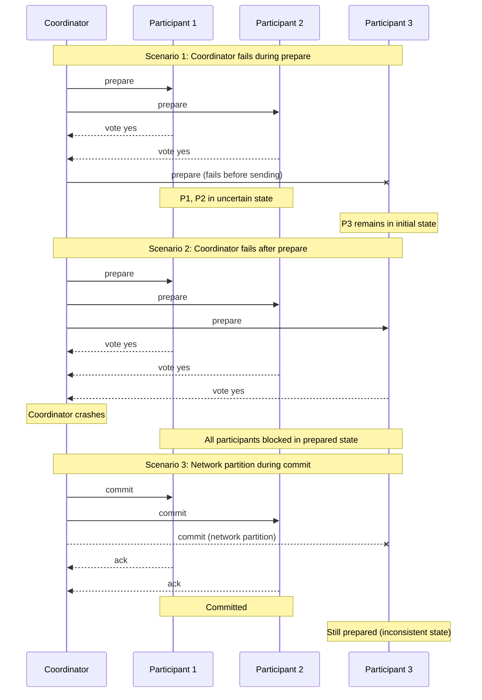
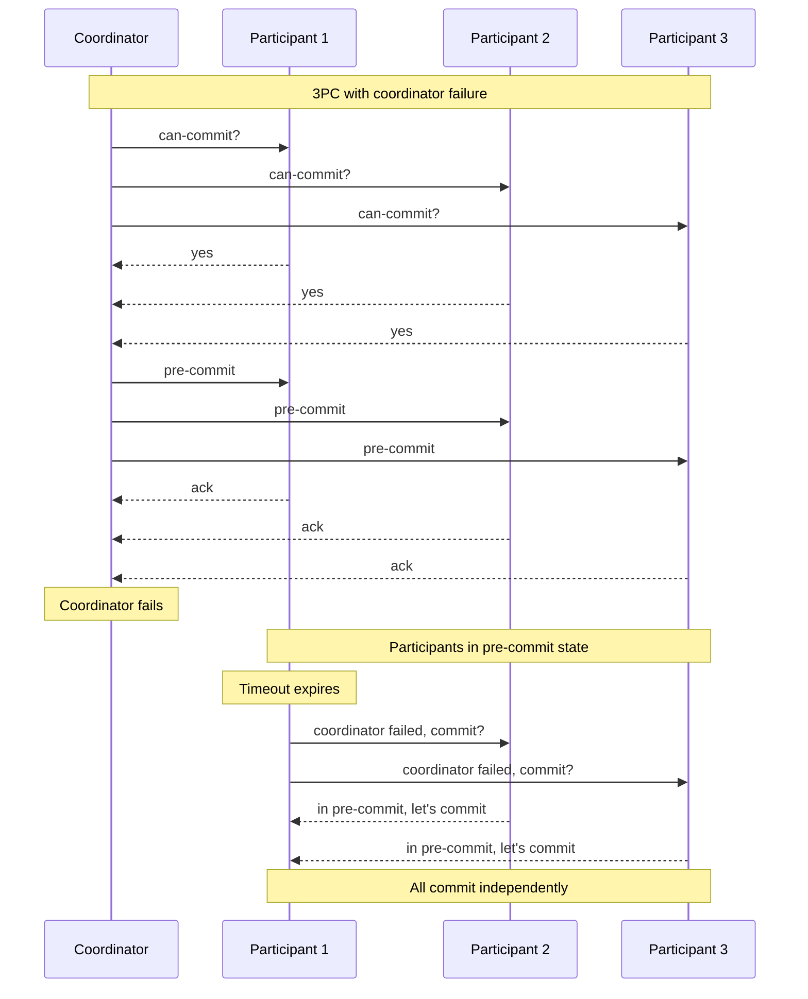
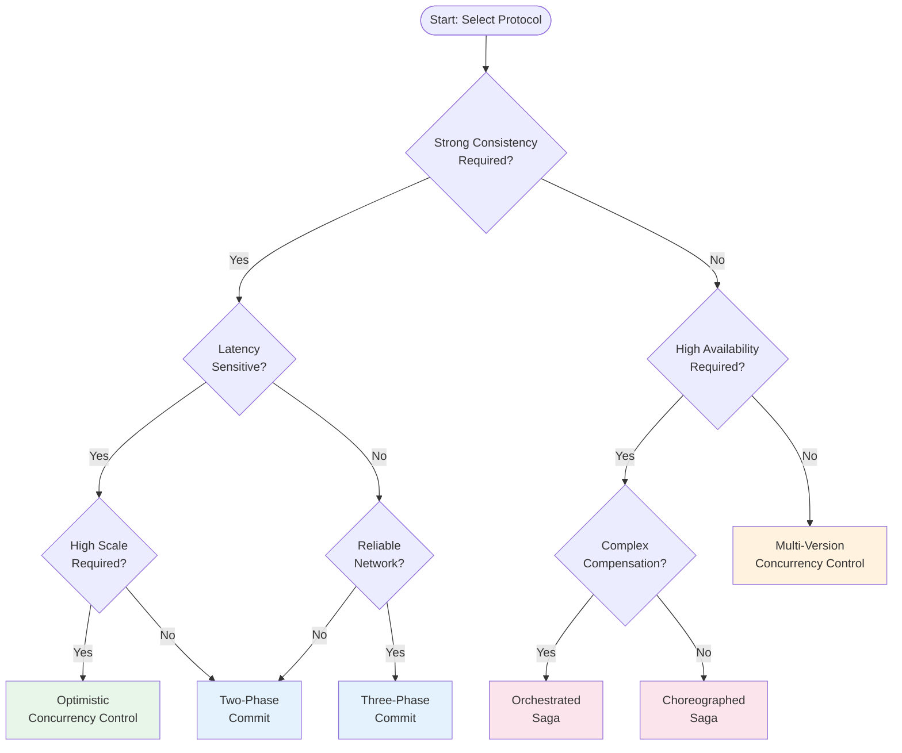
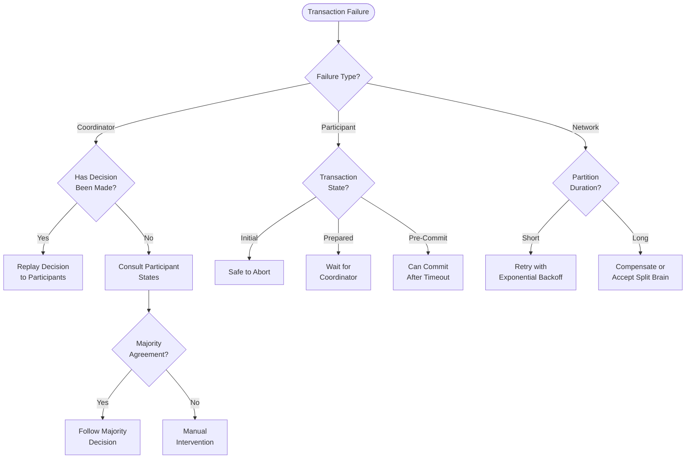
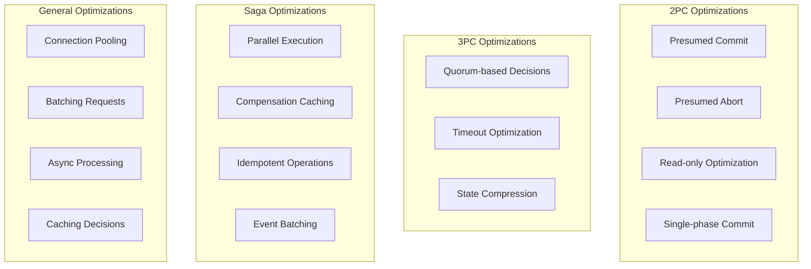
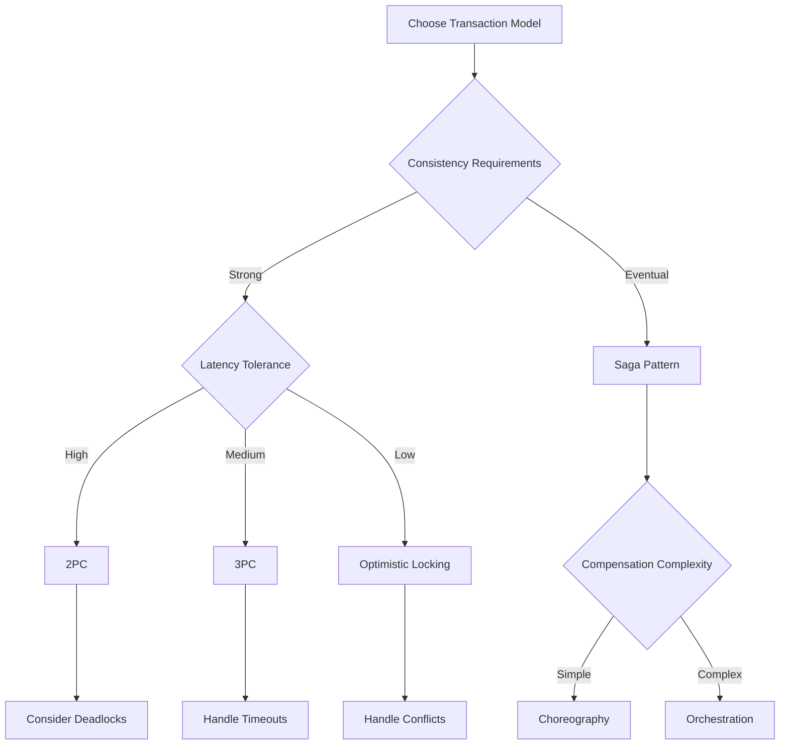

<!-- Navigation -->
[Home](../introduction/index.md) → [Part III: Patterns](index.md) → **Distributed Transactions**

# Distributed Transactions

**Coordinating atomic operations across distributed systems**

<div class="law-box">
<h4>The Distributed Transaction Challenge</h4>
<p>In a distributed system, maintaining ACID properties across multiple nodes faces fundamental constraints from network partitions, node failures, and the CAP theorem. Every distributed transaction protocol must balance consistency, availability, and partition tolerance.</p>
</div>

## Overview

Distributed transactions ensure that operations spanning multiple services, databases, or nodes either all succeed or all fail together. Unlike local transactions, they must handle network failures, timing issues, and the complexities of distributed consensus.

### Key Challenges

1. **Network Partitions**: Nodes may become unreachable
2. **Partial Failures**: Some nodes succeed while others fail
3. **Timing Issues**: No global clock, message delays
4. **Scalability**: Coordination overhead increases with participants
5. **Deadlocks**: Distributed deadlock detection is complex

## Theoretical Foundations

### ACID in Distributed Systems

Traditional ACID properties become challenging in distributed environments:



### FLP Impossibility Result

The Fischer-Lynch-Paterson theorem proves that in an asynchronous distributed system, it's impossible to guarantee consensus with even one faulty process. This fundamental limitation shapes all distributed transaction protocols.

## Core Protocols

### 1. Two-Phase Commit (2PC)

The classic distributed transaction protocol with a coordinator and participants.

```python
from enum import Enum
from typing import List, Dict, Optional
import time
import threading
import logging

class TransactionState(Enum):
    INITIAL = "INITIAL"
    PREPARING = "PREPARING"
    PREPARED = "PREPARED"
    COMMITTING = "COMMITTING"
    COMMITTED = "COMMITTED"
    ABORTING = "ABORTING"
    ABORTED = "ABORTED"

class Participant:
    """Participant in 2PC protocol"""
    
    def __init__(self, participant_id: str):
        self.id = participant_id
        self.state = TransactionState.INITIAL
        self.log = []
        self.data = {}
        self.prepared_data = {}
        self.lock = threading.Lock()
        
    def prepare(self, transaction_id: str, operations: Dict) -> bool:
        """Phase 1: Prepare to commit"""
        with self.lock:
            try:
                # Validate operations
                for op_type, data in operations.items():
                    if not self._validate_operation(op_type, data):
                        self.state = TransactionState.ABORTED
                        return False
                
                # Store prepared state
                self.prepared_data[transaction_id] = operations
                self.state = TransactionState.PREPARED
                self._log(f"PREPARED: {transaction_id}")
                
                # Simulate prepare work
                time.sleep(0.1)
                
                return True
                
            except Exception as e:
                logging.error(f"Prepare failed: {e}")
                self.state = TransactionState.ABORTED
                return False
    
    def commit(self, transaction_id: str) -> bool:
        """Phase 2: Commit the transaction"""
        with self.lock:
            if self.state != TransactionState.PREPARED:
                return False
                
            try:
                # Apply prepared operations
                operations = self.prepared_data.get(transaction_id)
                if operations:
                    for op_type, data in operations.items():
                        self._apply_operation(op_type, data)
                
                self.state = TransactionState.COMMITTED
                self._log(f"COMMITTED: {transaction_id}")
                
                # Clean up prepared data
                del self.prepared_data[transaction_id]
                
                return True
                
            except Exception as e:
                logging.error(f"Commit failed: {e}")
                return False
    
    def abort(self, transaction_id: str) -> bool:
        """Abort the transaction"""
        with self.lock:
            self.state = TransactionState.ABORTED
            self._log(f"ABORTED: {transaction_id}")
            
            # Clean up prepared data
            self.prepared_data.pop(transaction_id, None)
            
            return True
    
    def _validate_operation(self, op_type: str, data: Dict) -> bool:
        """Validate if operation can be performed"""
        # Implement validation logic
        return True
    
    def _apply_operation(self, op_type: str, data: Dict):
        """Apply the operation to local state"""
        if op_type == "UPDATE":
            self.data.update(data)
        elif op_type == "DELETE":
            for key in data.keys():
                self.data.pop(key, None)
    
    def _log(self, message: str):
        """Write to transaction log"""
        self.log.append({
            'timestamp': time.time(),
            'message': message
        })

class TwoPhaseCommitCoordinator:
    """2PC Coordinator"""
    
    def __init__(self, coordinator_id: str):
        self.id = coordinator_id
        self.participants: List[Participant] = []
        self.state = TransactionState.INITIAL
        self.transaction_log = []
        
    def add_participant(self, participant: Participant):
        """Register a participant"""
        self.participants.append(participant)
    
    def execute_transaction(self, transaction_id: str, 
                          operations: Dict[str, Dict]) -> bool:
        """Execute 2PC transaction"""
        
        self._log(f"Starting transaction: {transaction_id}")
        self.state = TransactionState.PREPARING
        
        # Phase 1: Prepare
        prepare_votes = []
        prepare_threads = []
        
        for participant in self.participants:
            # Get operations for this participant
            participant_ops = operations.get(participant.id, {})
            
            # Create thread for parallel prepare
            thread = threading.Thread(
                target=lambda p, ops: prepare_votes.append(
                    (p.id, p.prepare(transaction_id, ops))
                ),
                args=(participant, participant_ops)
            )
            prepare_threads.append(thread)
            thread.start()
        
        # Wait for all prepare responses
        for thread in prepare_threads:
            thread.join(timeout=5.0)  # 5 second timeout
        
        # Check votes
        all_prepared = all(vote[1] for vote in prepare_votes)
        
        if not all_prepared or len(prepare_votes) < len(self.participants):
            # Abort if any participant voted no or timed out
            self._log(f"Prepare phase failed, aborting: {transaction_id}")
            self.state = TransactionState.ABORTING
            self._abort_all(transaction_id)
            return False
        
        # Phase 2: Commit
        self._log(f"All participants prepared, committing: {transaction_id}")
        self.state = TransactionState.COMMITTING
        
        commit_threads = []
        commit_results = []
        
        for participant in self.participants:
            thread = threading.Thread(
                target=lambda p: commit_results.append(
                    (p.id, p.commit(transaction_id))
                ),
                args=(participant,)
            )
            commit_threads.append(thread)
            thread.start()
        
        # Wait for all commits
        for thread in commit_threads:
            thread.join(timeout=5.0)
        
        # Check commit results
        all_committed = all(result[1] for result in commit_results)
        
        if all_committed:
            self.state = TransactionState.COMMITTED
            self._log(f"Transaction committed: {transaction_id}")
            return True
        else:
            # Handle partial commits (requires recovery)
            self._log(f"Partial commit detected: {transaction_id}")
            self._handle_partial_commit(transaction_id, commit_results)
            return False
    
    def _abort_all(self, transaction_id: str):
        """Send abort to all participants"""
        for participant in self.participants:
            try:
                participant.abort(transaction_id)
            except Exception as e:
                logging.error(f"Failed to abort {participant.id}: {e}")
    
    def _handle_partial_commit(self, transaction_id: str, 
                             commit_results: List[tuple]):
        """Handle situation where some nodes committed"""
        # In practice, this requires persistent logging and recovery
        committed = [r[0] for r in commit_results if r[1]]
        failed = [r[0] for r in commit_results if not r[1]]
        
        self._log(f"Partial commit - Committed: {committed}, Failed: {failed}")
        # Recovery protocol would go here
    
    def _log(self, message: str):
        """Write to coordinator log"""
        self.transaction_log.append({
            'timestamp': time.time(),
            'message': message,
            'state': self.state.value
        })

# Example usage
def demo_2pc():
    """Demonstrate 2PC protocol"""
    
    # Create coordinator and participants
    coordinator = TwoPhaseCommitCoordinator("coord-1")
    participant1 = Participant("node-1")
    participant2 = Participant("node-2")
    participant3 = Participant("node-3")
    
    coordinator.add_participant(participant1)
    coordinator.add_participant(participant2)
    coordinator.add_participant(participant3)
    
    # Define distributed transaction
    operations = {
        "node-1": {"UPDATE": {"balance": 1000}},
        "node-2": {"UPDATE": {"balance": -500}},
        "node-3": {"UPDATE": {"audit_log": "Transfer recorded"}}
    }
    
    # Execute transaction
    success = coordinator.execute_transaction("txn-001", operations)
    
    print(f"Transaction {'succeeded' if success else 'failed'}")
    
    # Check final states
    for participant in coordinator.participants:
        print(f"{participant.id}: {participant.state.value}, Data: {participant.data}")
```

### 2. Three-Phase Commit (3PC)

3PC adds a pre-commit phase to handle coordinator failures better:

```python
class ThreePhaseCommitCoordinator(TwoPhaseCommitCoordinator):
    """3PC Coordinator with additional pre-commit phase"""
    
    def execute_transaction(self, transaction_id: str,
                          operations: Dict[str, Dict]) -> bool:
        """Execute 3PC transaction"""
        
        # Phase 1: Can-Commit (similar to 2PC prepare)
        if not self._phase_can_commit(transaction_id, operations):
            return False
        
        # Phase 2: Pre-Commit
        if not self._phase_pre_commit(transaction_id):
            self._abort_all(transaction_id)
            return False
        
        # Phase 3: Do-Commit
        return self._phase_do_commit(transaction_id)
    
    def _phase_can_commit(self, transaction_id: str,
                         operations: Dict[str, Dict]) -> bool:
        """Phase 1: Check if all participants can commit"""
        self._log(f"Phase 1 - Can-Commit: {transaction_id}")
        # Similar to 2PC prepare phase
        # Implementation details...
        return True
    
    def _phase_pre_commit(self, transaction_id: str) -> bool:
        """Phase 2: Prepare to commit"""
        self._log(f"Phase 2 - Pre-Commit: {transaction_id}")
        
        # Send pre-commit to all participants
        pre_commit_acks = []
        
        for participant in self.participants:
            # In real implementation, this would be async
            ack = self._send_pre_commit(participant, transaction_id)
            pre_commit_acks.append(ack)
        
        return all(pre_commit_acks)
    
    def _phase_do_commit(self, transaction_id: str) -> bool:
        """Phase 3: Final commit"""
        self._log(f"Phase 3 - Do-Commit: {transaction_id}")
        
        # Similar to 2PC commit phase
        # But with timeout handling for coordinator failure
        return True
    
    def _send_pre_commit(self, participant: Participant,
                        transaction_id: str) -> bool:
        """Send pre-commit message"""
        # In 3PC, participants can timeout and commit
        # if they don't hear from coordinator
        return True
```

### 3. Saga Pattern

For long-running transactions, Saga provides eventual consistency without locking:

```python
from abc import ABC, abstractmethod
from typing import Any, Callable, Optional
import uuid

class SagaStep(ABC):
    """Abstract base for saga steps"""
    
    @abstractmethod
    def execute(self, context: Dict[str, Any]) -> Dict[str, Any]:
        """Execute the step"""
        pass
    
    @abstractmethod
    def compensate(self, context: Dict[str, Any]) -> None:
        """Compensate (undo) the step"""
        pass

class SagaTransaction:
    """Saga transaction coordinator"""
    
    def __init__(self, saga_id: Optional[str] = None):
        self.saga_id = saga_id or str(uuid.uuid4())
        self.steps: List[SagaStep] = []
        self.completed_steps: List[SagaStep] = []
        self.context = {}
        self.state = "INITIAL"
        
    def add_step(self, step: SagaStep) -> 'SagaTransaction':
        """Add a step to the saga"""
        self.steps.append(step)
        return self
    
    def execute(self) -> bool:
        """Execute the saga transaction"""
        self.state = "EXECUTING"
        
        try:
            # Execute each step
            for step in self.steps:
                try:
                    self.context = step.execute(self.context)
                    self.completed_steps.append(step)
                    self._log(f"Completed step: {step.__class__.__name__}")
                    
                except Exception as e:
                    self._log(f"Step failed: {step.__class__.__name__}, {e}")
                    self.state = "COMPENSATING"
                    self._compensate()
                    return False
            
            self.state = "COMPLETED"
            return True
            
        except Exception as e:
            self._log(f"Saga failed: {e}")
            self.state = "FAILED"
            return False
    
    def _compensate(self):
        """Run compensation for completed steps in reverse order"""
        for step in reversed(self.completed_steps):
            try:
                step.compensate(self.context)
                self._log(f"Compensated step: {step.__class__.__name__}")
            except Exception as e:
                self._log(f"Compensation failed: {step.__class__.__name__}, {e}")
                # In practice, would need manual intervention
    
    def _log(self, message: str):
        """Log saga events"""
        print(f"[{self.saga_id}] {message}")

# Example: E-commerce order saga
class ReserveInventoryStep(SagaStep):
    def __init__(self, inventory_service):
        self.inventory_service = inventory_service
        
    def execute(self, context: Dict[str, Any]) -> Dict[str, Any]:
        order_id = context['order_id']
        items = context['items']
        
        reservation_id = self.inventory_service.reserve_items(
            order_id, items
        )
        
        context['reservation_id'] = reservation_id
        return context
    
    def compensate(self, context: Dict[str, Any]) -> None:
        if 'reservation_id' in context:
            self.inventory_service.cancel_reservation(
                context['reservation_id']
            )

class ProcessPaymentStep(SagaStep):
    def __init__(self, payment_service):
        self.payment_service = payment_service
        
    def execute(self, context: Dict[str, Any]) -> Dict[str, Any]:
        amount = context['total_amount']
        customer_id = context['customer_id']
        
        payment_id = self.payment_service.charge_customer(
            customer_id, amount
        )
        
        context['payment_id'] = payment_id
        return context
    
    def compensate(self, context: Dict[str, Any]) -> None:
        if 'payment_id' in context:
            self.payment_service.refund_payment(
                context['payment_id']
            )

class CreateShipmentStep(SagaStep):
    def __init__(self, shipping_service):
        self.shipping_service = shipping_service
        
    def execute(self, context: Dict[str, Any]) -> Dict[str, Any]:
        order_id = context['order_id']
        address = context['shipping_address']
        
        shipment_id = self.shipping_service.create_shipment(
            order_id, address
        )
        
        context['shipment_id'] = shipment_id
        return context
    
    def compensate(self, context: Dict[str, Any]) -> None:
        if 'shipment_id' in context:
            self.shipping_service.cancel_shipment(
                context['shipment_id']
            )

# Orchestration-based saga
class OrderSaga:
    """Order processing saga orchestrator"""
    
    def __init__(self, services):
        self.services = services
        
    def process_order(self, order_data: Dict) -> bool:
        """Process an order using saga pattern"""
        
        saga = SagaTransaction(f"order-{order_data['order_id']}")
        
        # Build saga steps
        saga.add_step(ReserveInventoryStep(self.services['inventory'])) \
            .add_step(ProcessPaymentStep(self.services['payment'])) \
            .add_step(CreateShipmentStep(self.services['shipping']))
        
        # Set initial context
        saga.context = order_data
        
        # Execute saga
        return saga.execute()

# Choreography-based saga using events
class EventDrivenSaga:
    """Event-driven saga implementation"""
    
    def __init__(self, event_bus):
        self.event_bus = event_bus
        self.handlers = {}
        
    def register_handler(self, event_type: str, 
                        handler: Callable) -> None:
        """Register event handler"""
        if event_type not in self.handlers:
            self.handlers[event_type] = []
        self.handlers[event_type].append(handler)
    
    def start_saga(self, initial_event: Dict) -> None:
        """Start saga with initial event"""
        self.event_bus.publish(initial_event)
    
    def handle_event(self, event: Dict) -> None:
        """Handle incoming events"""
        event_type = event.get('type')
        
        if event_type in self.handlers:
            for handler in self.handlers[event_type]:
                try:
                    # Handler may publish new events
                    handler(event, self.event_bus)
                except Exception as e:
                    # Publish compensation event
                    self._publish_compensation(event, str(e))
    
    def _publish_compensation(self, failed_event: Dict, 
                            error: str) -> None:
        """Publish compensation event"""
        compensation_event = {
            'type': f"{failed_event['type']}_FAILED",
            'original_event': failed_event,
            'error': error,
            'timestamp': time.time()
        }
        self.event_bus.publish(compensation_event)
```

## Implementation Patterns

### 1. Distributed Locking

Preventing conflicts in distributed transactions:

```python
import redis
import time
import uuid
from contextlib import contextmanager

class RedisDistributedLock:
    """Distributed lock using Redis"""
    
    def __init__(self, redis_client: redis.Redis):
        self.redis = redis_client
        self.lua_unlock = self.redis.register_script("""
            if redis.call("get", KEYS[1]) == ARGV[1] then
                return redis.call("del", KEYS[1])
            else
                return 0
            end
        """)
    
    @contextmanager
    def acquire_lock(self, resource_id: str, 
                     timeout: int = 10,
                     retry_delay: float = 0.1,
                     max_retries: int = 50):
        """Acquire distributed lock with automatic release"""
        
        lock_id = str(uuid.uuid4())
        lock_key = f"lock:{resource_id}"
        
        # Try to acquire lock
        acquired = False
        retries = 0
        
        while not acquired and retries < max_retries:
            acquired = self.redis.set(
                lock_key, lock_id, 
                nx=True, ex=timeout
            )
            
            if not acquired:
                time.sleep(retry_delay)
                retries += 1
        
        if not acquired:
            raise Exception(f"Failed to acquire lock for {resource_id}")
        
        try:
            yield lock_id
        finally:
            # Release lock only if we still own it
            self.lua_unlock(keys=[lock_key], args=[lock_id])

class ZookeeperDistributedLock:
    """Distributed lock using ZooKeeper"""
    
    def __init__(self, zk_client):
        self.zk = zk_client
        
    def acquire_lock(self, path: str) -> str:
        """Acquire lock using ZooKeeper's sequential znodes"""
        
        # Create sequential ephemeral node
        lock_path = self.zk.create(
            f"{path}/lock-", 
            ephemeral=True,
            sequence=True
        )
        
        while True:
            # Get all lock nodes
            children = sorted(self.zk.get_children(path))
            
            # Check if we have the lowest sequence number
            if lock_path.endswith(children[0]):
                return lock_path
            
            # Watch the node with next lower sequence
            lower_nodes = [
                n for n in children 
                if n < lock_path.split('/')[-1]
            ]
            
            if lower_nodes:
                watch_path = f"{path}/{lower_nodes[-1]}"
                
                # Wait for predecessor to be deleted
                event = threading.Event()
                
                def watch_callback(event_type, state, path):
                    event.set()
                
                self.zk.exists(watch_path, watch=watch_callback)
                event.wait()
```

### 2. Optimistic Concurrency Control

Using version numbers to detect conflicts:

```python
class OptimisticTransaction:
    """Optimistic concurrency control implementation"""
    
    def __init__(self, data_store):
        self.data_store = data_store
        self.read_set = {}  # Track read versions
        self.write_set = {}  # Track writes
        
    def read(self, key: str) -> Any:
        """Read with version tracking"""
        value, version = self.data_store.read_versioned(key)
        self.read_set[key] = version
        return value
    
    def write(self, key: str, value: Any):
        """Buffer write operation"""
        self.write_set[key] = value
    
    def commit(self) -> bool:
        """Validate and commit transaction"""
        
        # Validation phase
        for key, read_version in self.read_set.items():
            current_version = self.data_store.get_version(key)
            
            if current_version != read_version:
                # Conflict detected
                return False
        
        # Write phase
        try:
            # Apply all writes atomically
            for key, value in self.write_set.items():
                self.data_store.write_versioned(key, value)
            
            return True
            
        except Exception:
            # Rollback on error
            return False

class MVCCDataStore:
    """Multi-Version Concurrency Control"""
    
    def __init__(self):
        self.data = {}  # key -> [(value, version, timestamp)]
        self.current_version = 0
        self.lock = threading.Lock()
        
    def write(self, transaction_id: str, key: str, value: Any):
        """Write new version"""
        with self.lock:
            self.current_version += 1
            
            if key not in self.data:
                self.data[key] = []
            
            self.data[key].append({
                'value': value,
                'version': self.current_version,
                'timestamp': time.time(),
                'transaction_id': transaction_id
            })
    
    def read(self, key: str, as_of_version: Optional[int] = None) -> Any:
        """Read value as of specific version"""
        if key not in self.data:
            return None
        
        versions = self.data[key]
        
        if as_of_version is None:
            # Return latest version
            return versions[-1]['value'] if versions else None
        
        # Find version as of specified version
        for v in reversed(versions):
            if v['version'] <= as_of_version:
                return v['value']
        
        return None
    
    def garbage_collect(self, min_version: int):
        """Remove old versions no longer needed"""
        with self.lock:
            for key in self.data:
                self.data[key] = [
                    v for v in self.data[key]
                    if v['version'] >= min_version
                ]
```

## Real-World Examples

### 1. Banking System

Implementing distributed transactions for money transfers:

```python
class BankingTransactionManager:
    """Distributed transaction manager for banking"""
    
    def __init__(self, account_shards: Dict[str, AccountService]):
        self.account_shards = account_shards
        self.transaction_log = []
        
    def transfer_money(self, from_account: str, to_account: str,
                      amount: float) -> bool:
        """Transfer money between accounts using 2PC"""
        
        transaction_id = f"transfer-{uuid.uuid4()}"
        
        # Determine shards
        from_shard = self._get_shard(from_account)
        to_shard = self._get_shard(to_account)
        
        # Create 2PC coordinator
        coordinator = TwoPhaseCommitCoordinator(transaction_id)
        
        # Add participants
        if from_shard == to_shard:
            # Same shard optimization
            coordinator.add_participant(from_shard)
        else:
            coordinator.add_participant(from_shard)
            coordinator.add_participant(to_shard)
        
        # Define operations
        operations = {
            from_shard.id: {
                "DEBIT": {
                    "account": from_account,
                    "amount": amount
                }
            },
            to_shard.id: {
                "CREDIT": {
                    "account": to_account,
                    "amount": amount
                }
            }
        }
        
        # Execute transaction
        success = coordinator.execute_transaction(
            transaction_id, operations
        )
        
        # Log result
        self.transaction_log.append({
            'transaction_id': transaction_id,
            'type': 'transfer',
            'from': from_account,
            'to': to_account,
            'amount': amount,
            'status': 'success' if success else 'failed',
            'timestamp': time.time()
        })
        
        return success
    
    def _get_shard(self, account_id: str) -> AccountService:
        """Determine shard for account"""
        shard_key = hash(account_id) % len(self.account_shards)
        return list(self.account_shards.values())[shard_key]

# Saga-based implementation for complex transactions
class BankingOperationsSaga:
    """Saga for complex banking operations"""
    
    def open_account_with_initial_deposit(self, customer_data: Dict):
        """Open account with KYC, account creation, and deposit"""
        
        saga = SagaTransaction("open-account")
        
        # Add saga steps
        saga.add_step(KYCVerificationStep(self.kyc_service)) \
            .add_step(CreateAccountStep(self.account_service)) \
            .add_step(InitialDepositStep(self.payment_service)) \
            .add_step(SendWelcomeEmailStep(self.email_service))
        
        saga.context = customer_data
        
        return saga.execute()
```

### 2. E-commerce Platform

Distributed transactions in microservices architecture:

```python
class OrderProcessingSystem:
    """Order processing with distributed transactions"""
    
    def __init__(self, services: Dict[str, Any]):
        self.services = services
        self.use_saga = True  # Toggle between 2PC and Saga
        
    def process_order(self, order: Dict) -> bool:
        """Process order across multiple services"""
        
        if self.use_saga:
            return self._process_with_saga(order)
        else:
            return self._process_with_2pc(order)
    
    def _process_with_saga(self, order: Dict) -> bool:
        """Use saga for better availability"""
        
        saga = OrderSaga(self.services)
        return saga.process_order(order)
    
    def _process_with_2pc(self, order: Dict) -> bool:
        """Use 2PC for strong consistency"""
        
        coordinator = TwoPhaseCommitCoordinator("order-2pc")
        
        # Add all services as participants
        for service in self.services.values():
            coordinator.add_participant(service)
        
        # Define distributed operations
        operations = {
            'inventory': {
                'RESERVE': order['items']
            },
            'payment': {
                'CHARGE': {
                    'amount': order['total'],
                    'customer': order['customer_id']
                }
            },
            'shipping': {
                'SCHEDULE': {
                    'items': order['items'],
                    'address': order['shipping_address']
                }
            }
        }
        
        return coordinator.execute_transaction(
            f"order-{order['id']}", operations
        )

# Event sourcing with distributed transactions
class EventSourcedOrderSystem:
    """Combine event sourcing with distributed transactions"""
    
    def __init__(self, event_store, projections):
        self.event_store = event_store
        self.projections = projections
        
    def process_order_with_events(self, order: Dict):
        """Process order with event sourcing"""
        
        # Start distributed transaction
        transaction_id = f"order-{order['id']}"
        
        events = []
        
        try:
            # Generate events
            events.append(OrderCreatedEvent(order))
            events.append(PaymentProcessedEvent(order))
            events.append(InventoryReservedEvent(order))
            
            # Store events in distributed transaction
            with self.event_store.transaction(transaction_id):
                for event in events:
                    self.event_store.append(event)
                
                # Update projections
                for projection in self.projections:
                    projection.handle_events(events)
            
            # Publish events after commit
            for event in events:
                self.publish_event(event)
                
        except Exception as e:
            # Compensate by publishing failure events
            self.publish_event(OrderFailedEvent(order, str(e)))
            raise
```

## Performance Considerations

### 1. Latency Analysis

```python
class TransactionLatencyAnalyzer:
    """Analyze distributed transaction performance"""
    
    def __init__(self):
        self.metrics = {
            '2pc': [],
            '3pc': [],
            'saga': []
        }
    
    def analyze_2pc_latency(self, num_participants: int,
                           network_latency_ms: float) -> Dict:
        """Calculate 2PC latency"""
        
        # 2PC requires 2 round trips
        prepare_latency = num_participants * network_latency_ms
        commit_latency = num_participants * network_latency_ms
        
        total_latency = prepare_latency + commit_latency
        
        return {
            'protocol': '2PC',
            'participants': num_participants,
            'network_latency': network_latency_ms,
            'prepare_phase': prepare_latency,
            'commit_phase': commit_latency,
            'total_latency': total_latency,
            'throughput': 1000 / total_latency  # TPS
        }
    
    def compare_protocols(self, scenarios: List[Dict]) -> pd.DataFrame:
        """Compare different protocols"""
        
        results = []
        
        for scenario in scenarios:
            participants = scenario['participants']
            latency = scenario['network_latency']
            
            # 2PC
            results.append(self.analyze_2pc_latency(participants, latency))
            
            # 3PC (additional round)
            three_pc = self.analyze_2pc_latency(participants, latency)
            three_pc['protocol'] = '3PC'
            three_pc['total_latency'] *= 1.5
            results.append(three_pc)
            
            # Saga (parallel execution)
            saga_latency = latency * 2  # Single service round trip
            results.append({
                'protocol': 'Saga',
                'participants': participants,
                'network_latency': latency,
                'total_latency': saga_latency,
                'throughput': 1000 / saga_latency
            })
        
        return pd.DataFrame(results)
```

### 2. Scalability Patterns

```python
class ScalableTransactionManager:
    """Patterns for scaling distributed transactions"""
    
    def __init__(self):
        self.shard_managers = {}
        self.transaction_routers = {}
        
    def partition_transactions(self, transaction: Dict) -> str:
        """Partition transactions by key"""
        
        # Extract partition key
        partition_key = self._extract_partition_key(transaction)
        
        # Route to appropriate shard
        shard_id = hash(partition_key) % len(self.shard_managers)
        
        return f"shard-{shard_id}"
    
    def batch_transactions(self, transactions: List[Dict]) -> Dict:
        """Batch multiple transactions for efficiency"""
        
        batches = {}
        
        for txn in transactions:
            shard = self.partition_transactions(txn)
            
            if shard not in batches:
                batches[shard] = []
            
            batches[shard].append(txn)
        
        # Process batches in parallel
        results = {}
        threads = []
        
        for shard, batch in batches.items():
            thread = threading.Thread(
                target=lambda s, b: results.update(
                    {s: self._process_batch(s, b)}
                ),
                args=(shard, batch)
            )
            threads.append(thread)
            thread.start()
        
        for thread in threads:
            thread.join()
        
        return results
    
    def _process_batch(self, shard: str, 
                      batch: List[Dict]) -> List[bool]:
        """Process batch of transactions"""
        
        manager = self.shard_managers[shard]
        return [manager.execute(txn) for txn in batch]
```

## Visual Protocol Comparison

### State Diagrams for Transaction Protocols

#### Two-Phase Commit (2PC) State Machine



#### Three-Phase Commit (3PC) State Machine



#### Saga Pattern Flow



### Failure Scenario Visualizations

#### 2PC Coordinator Failure Scenarios



#### 3PC Handling Coordinator Failures



### Performance Comparison Tables

#### Latency Breakdown by Protocol

| Phase | 2PC | 3PC | Saga (Orchestrated) | Saga (Choreographed) |
|-------|-----|-----|---------------------|---------------------|
| **Phase 1** | Prepare request + response<br>(2 × network RTT) | Can-commit request + response<br>(2 × network RTT) | Execute T1<br>(1 × service latency) | Event publish<br>(1 × message latency) |
| **Phase 2** | Commit request + response<br>(2 × network RTT) | Pre-commit request + response<br>(2 × network RTT) | Execute T2<br>(1 × service latency) | Event reaction<br>(1 × message latency) |
| **Phase 3** | - | Do-commit request + response<br>(2 × network RTT) | Execute T3..Tn<br>(n × service latency) | Event cascade<br>(n × message latency) |
| **Total** | 4 × network RTT | 6 × network RTT | Sum of service latencies | Sum of message latencies |
| **Parallelism** | Yes (prepare phase) | Yes (all phases) | No (sequential) | Possible (depends on flow) |

#### Consistency vs Performance Trade-offs

```mermaid
scatter
    title Consistency vs Performance Trade-offs
    x-axis "Performance (Transactions/sec)" 0 --> 10000
    y-axis "Consistency Strength" 0 --> 10
    
    "2PC": [1000, 10]
    "3PC": [500, 10]
    "Saga Orchestrated": [5000, 3]
    "Saga Choreographed": [8000, 2]
    "Optimistic Locking": [9000, 6]
    "MVCC": [7000, 7]
    "Eventually Consistent": [10000, 1]
```

### Decision Matrix for Protocol Selection

#### Protocol Selection Based on Requirements



#### Detailed Comparison Matrix

| Criteria | 2PC | 3PC | Orchestrated Saga | Choreographed Saga | Optimistic Locking | MVCC |
|----------|-----|-----|-------------------|-------------------|-------------------|------|
| **Consistency Model** | Strong | Strong | Eventual | Eventual | Snapshot | Snapshot |
| **Blocking** | Yes | No* | No | No | No | No |
| **Coordinator Required** | Yes | Yes | Yes | No | No | No |
| **Network Round Trips** | 2 | 3 | 1 per step | 1 per event | 1 | 1 |
| **Failure Recovery** | Complex | Complex | Built-in | Event-driven | Retry | Version-based |
| **Scalability** | Low | Low | High | Very High | High | High |
| **Latency** | High | Very High | Medium | Low | Low | Low |
| **Resource Locking** | Yes | Yes | No | No | No | No |
| **Deadlock Risk** | High | High | None | None | None | None |
| **Use Case Fit** | Banking | Critical Systems | E-commerce | Microservices | Read-heavy | Databases |

*Non-blocking only if majority of participants are available

### Failure Recovery Strategies

#### Recovery Decision Tree



### Real-World Failure Patterns

#### Common Failure Scenarios and Solutions

| Failure Scenario | Impact | 2PC Solution | 3PC Solution | Saga Solution |
|-----------------|---------|--------------|--------------|---------------|
| **Coordinator crashes before prepare** | No impact | Participants timeout and abort | Same as 2PC | Not applicable |
| **Coordinator crashes after prepare** | Participants blocked | Manual recovery required | Participants can proceed after timeout | Not applicable |
| **Participant crashes during prepare** | Transaction aborts | Coordinator timeouts and aborts | Same as 2PC | Skip or compensate |
| **Network partition during commit** | Split brain risk | Some nodes committed, others blocked | Majority can proceed | Eventually consistent |
| **Cascading failures** | System-wide impact | Manual intervention | Partial automation | Self-healing via compensation |
| **Byzantine failures** | Data corruption | Not handled | Not handled | Depends on implementation |

### Performance Optimization Strategies

#### Optimization Techniques by Protocol



## Trade-off Analysis

### Decision Framework



### Best Practices

1. **Choose the Right Protocol**
   - 2PC for strong consistency with low scale
   - Saga for high availability and scale
   - Optimistic locking for read-heavy workloads

2. **Handle Failures Gracefully**
   - Implement timeouts at every stage
   - Log all operations for recovery
   - Design for partial failures

3. **Optimize for Common Case**
   - Single-shard transactions when possible
   - Batch operations to reduce round trips
   - Use read replicas for queries

4. **Monitor and Alert**
   - Track transaction success rates
   - Monitor coordinator health
   - Alert on prolonged locks

## Related Patterns

- [Saga Pattern](saga.md) - Long-running transactions
- [Event Sourcing](event-sourcing.md) - Transaction as events
- [CQRS](cqrs.md) - Separate read/write paths
- [Eventual Consistency](eventual-consistency.md) - Relaxed consistency

## References

1. "Distributed Transactions: The Icebergs of Microservices" - Sagas paper
2. "Life Beyond Distributed Transactions" - Pat Helland
3. "Consensus: Bridging Theory and Practice" - Diego Ongaro's thesis
4. "Building Microservices" - Sam Newman (Transaction patterns)

---

*Next: [Eventual Consistency](eventual-consistency.md) - Understanding and implementing eventual consistency models*