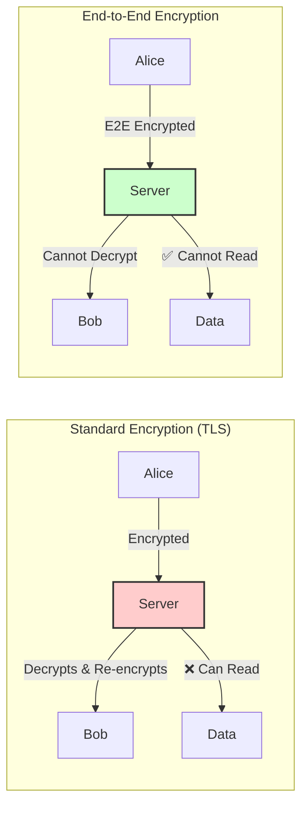
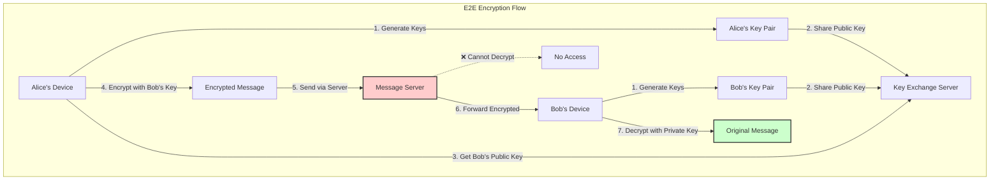

# End-to-End Encryption (E2E)

**The gold standard of privacy: Even we can't read your messages**

> *"In a world where data is the new oil, end-to-end encryption is the unbreakable safe that keeps it secure from everyone—including the safe maker."*

---

## Level 1: Intuition

### The Sealed Letter Analogy

```
Traditional Encryption (HTTPS):          End-to-End Encryption:

You → Post Office → Recipient           You → Sealed Box → Recipient
     ↓                                       ↓
Post office can open & read             Only recipient has the key
                                       Post office just delivers

WhatsApp/Server Example:
Alice → WhatsApp Server → Bob           Alice → [Encrypted] → Bob
         Can decrypt                            Cannot decrypt
         & read messages                        Just passes through
```

### Real-World Implementations

| Company | Product | Users | Implementation |
|---------|---------|-------|----------------|
| **WhatsApp** | Messaging | 2B+ | Signal Protocol |
| **Signal** | Secure messaging | 40M+ | Signal Protocol (original) |
| **ProtonMail** | Email | 70M+ | PGP-based E2E |
| **Zoom** | Video calls | 300M+ | E2E meetings option |
| **Apple** | iMessage | 1.3B+ | Apple's E2E protocol |

### Visual Comparison



### Basic Implementation

```python
from cryptography.hazmat.primitives import hashes, serialization
from cryptography.hazmat.primitives.asymmetric import rsa, padding
from cryptography.hazmat.primitives.ciphers import Cipher, algorithms, modes
import os
import base64

class SimpleE2E:
    """Basic E2E encryption demonstration"""
    
    def __init__(self):
# Generate key pair for this user
        self.private_key = rsa.generate_private_key(
            public_exponent=65537,
            key_size=2048
        )
        self.public_key = self.private_key.public_key()
    
    def get_public_key_bytes(self) -> bytes:
        """Export public key for sharing"""
        return self.public_key.public_bytes(
            encoding=serialization.Encoding.PEM,
            format=serialization.PublicFormat.SubjectPublicKeyInfo
        )
    
    def encrypt_for_recipient(self, message: str, recipient_public_key: bytes) -> dict:
        """Encrypt message that only recipient can decrypt"""
        
# Load recipient's public key
        recipient_key = serialization.load_pem_public_key(recipient_public_key)
        
# Generate AES key for this message
        aes_key = os.urandom(32)  # 256-bit key
        iv = os.urandom(16)       # 128-bit IV
        
# Encrypt message with AES
        cipher = Cipher(
            algorithms.AES(aes_key),
            modes.CBC(iv)
        )
        encryptor = cipher.encryptor()
        
# Pad message to AES block size
        message_bytes = message.encode('utf-8')
        padding_length = 16 - (len(message_bytes) % 16)
        padded_message = message_bytes + bytes([padding_length]) * padding_length
        
        ciphertext = encryptor.update(padded_message) + encryptor.finalize()
        
# Encrypt AES key with recipient's public key
        encrypted_key = recipient_key.encrypt(
            aes_key,
            padding.OAEP(
                mgf=padding.MGF1(algorithm=hashes.SHA256()),
                algorithm=hashes.SHA256(),
                label=None
            )
        )
        
        return {
            'ciphertext': base64.b64encode(ciphertext).decode(),
            'encrypted_key': base64.b64encode(encrypted_key).decode(),
            'iv': base64.b64encode(iv).decode()
        }
    
    def decrypt_message(self, encrypted_data: dict) -> str:
        """Decrypt message using private key"""
        
# Decode from base64
        ciphertext = base64.b64decode(encrypted_data['ciphertext'])
        encrypted_key = base64.b64decode(encrypted_data['encrypted_key'])
        iv = base64.b64decode(encrypted_data['iv'])
        
# Decrypt AES key with private key
        aes_key = self.private_key.decrypt(
            encrypted_key,
            padding.OAEP(
                mgf=padding.MGF1(algorithm=hashes.SHA256()),
                algorithm=hashes.SHA256(),
                label=None
            )
        )
        
# Decrypt message with AES
        cipher = Cipher(
            algorithms.AES(aes_key),
            modes.CBC(iv)
        )
        decryptor = cipher.decryptor()
        padded_plaintext = decryptor.update(ciphertext) + decryptor.finalize()
        
# Remove padding
        padding_length = padded_plaintext[-1]
        message = padded_plaintext[:-padding_length].decode('utf-8')
        
        return message

# Usage example
alice = SimpleE2E()
bob = SimpleE2E()

# Alice encrypts for Bob
message = "This message can only be read by Bob!"
encrypted = alice.encrypt_for_recipient(message, bob.get_public_key_bytes())

# Server/Network sees only encrypted data
print(f"What server sees: {encrypted['ciphertext'][:50]}...")

# Only Bob can decrypt
decrypted = bob.decrypt_message(encrypted)
print(f"Bob reads: {decrypted}")

# Alice cannot decrypt her own message!
try:
    alice.decrypt_message(encrypted)
except Exception:
    print("Alice cannot decrypt messages encrypted for Bob")
```

---

## Level 2: Foundation

### Core Concepts



### Key Components

#### 1. Key Generation and Exchange

```python
class E2EKeyManager:
    """Manages cryptographic keys for E2E encryption"""
    
    def __init__(self, user_id: str):
        self.user_id = user_id
        self.keys = {}
        
# Generate identity key pair (long-term)
        self.identity_key = self.generate_key_pair()
        
# Generate signed pre-keys (medium-term)
        self.signed_pre_keys = []
        for i in range(5):
            self.signed_pre_keys.append(self.generate_signed_pre_key(i))
        
# Generate one-time pre-keys (ephemeral)
        self.one_time_keys = []
        for i in range(100):
            self.one_time_keys.append(self.generate_key_pair())
    
    def generate_key_pair(self):
        """Generate EC key pair for Diffie-Hellman"""
        from cryptography.hazmat.primitives.asymmetric import ec
        
        private_key = ec.generate_private_key(ec.SECP256R1())
        public_key = private_key.public_key()
        
        return {
            'private': private_key,
            'public': public_key
        }
    
    def generate_signed_pre_key(self, key_id: int):
        """Generate signed pre-key for async communication"""
        pre_key = self.generate_key_pair()
        
# Sign with identity key
        from cryptography.hazmat.primitives import hashes
        from cryptography.hazmat.primitives.asymmetric import utils
        
        public_bytes = pre_key['public'].public_bytes(
            encoding=serialization.Encoding.DER,
            format=serialization.PublicFormat.SubjectPublicKeyInfo
        )
        
        signature = self.identity_key['private'].sign(
            public_bytes,
            ec.ECDSA(hashes.SHA256())
        )
        
        return {
            'key_id': key_id,
            'key_pair': pre_key,
            'signature': signature,
            'timestamp': datetime.utcnow()
        }
    
    def publish_keys(self):
        """Publish public keys to server"""
        return {
            'identity_key': self.serialize_public_key(self.identity_key['public']),
            'signed_pre_keys': [
                {
                    'key_id': spk['key_id'],
                    'public_key': self.serialize_public_key(spk['key_pair']['public']),
                    'signature': base64.b64encode(spk['signature']).decode()
                }
                for spk in self.signed_pre_keys
            ],
            'one_time_keys': [
                self.serialize_public_key(otk['public'])
                for otk in self.one_time_keys
            ]
        }
```

#### 2. Double Ratchet Algorithm

```python
class DoubleRatchet:
    """
    Signal Protocol's Double Ratchet for forward secrecy
    Provides: Forward secrecy + Break-in recovery
    """
    
    def __init__(self, shared_secret: bytes, is_alice: bool):
        self.root_key = shared_secret
        self.is_alice = is_alice
        
# Diffie-Hellman ratchet
        self.dh_ratchet_key_pair = None
        self.dh_remote_public_key = None
        
# Symmetric key ratchet
        self.sending_chain_key = None
        self.receiving_chain_key = None
        self.send_message_number = 0
        self.receive_message_number = 0
        
# Skipped message keys for out-of-order delivery
        self.skipped_messages = {}
        
    def ratchet_encrypt(self, plaintext: bytes) -> dict:
        """Encrypt with ratcheting for forward secrecy"""
        
# Perform DH ratchet if needed
        if self.send_message_number == 0:
            self.dh_ratchet_step()
        
# Derive message key from chain key
        message_key = self.kdf(self.sending_chain_key, b"MessageKey")
        
# Ratchet chain key forward
        self.sending_chain_key = self.kdf(self.sending_chain_key, b"ChainKey")
        
# Encrypt message
        iv = os.urandom(16)
        cipher = Cipher(
            algorithms.AES(message_key[:32]),
            modes.CBC(iv)
        )
        encryptor = cipher.encryptor()
        
# Pad and encrypt
        padded = self.pad(plaintext)
        ciphertext = encryptor.update(padded) + encryptor.finalize()
        
# Create header with DH public key
        header = {
            'dh_public_key': self.serialize_public_key(self.dh_ratchet_key_pair['public']),
            'message_number': self.send_message_number,
            'previous_chain_length': 0  # Simplified
        }
        
        self.send_message_number += 1
        
        return {
            'header': header,
            'ciphertext': base64.b64encode(ciphertext).decode(),
            'iv': base64.b64encode(iv).decode()
        }
    
    def ratchet_decrypt(self, message: dict) -> bytes:
        """Decrypt with ratcheting"""
        
        header = message['header']
        ciphertext = base64.b64decode(message['ciphertext'])
        iv = base64.b64decode(message['iv'])
        
# Check if we need to perform DH ratchet
        remote_public = self.deserialize_public_key(header['dh_public_key'])
        if remote_public != self.dh_remote_public_key:
            self.skip_missed_messages(header['message_number'])
            self.dh_ratchet_receive(remote_public)
        
# Check skipped messages
        skipped_key = (header['dh_public_key'], header['message_number'])
        if skipped_key in self.skipped_messages:
            message_key = self.skipped_messages.pop(skipped_key)
        else:
# Skip to correct message number
            while self.receive_message_number < header['message_number']:
                skipped_key = (header['dh_public_key'], self.receive_message_number)
                self.skipped_messages[skipped_key] = self.kdf(
                    self.receiving_chain_key, b"MessageKey"
                )
                self.receiving_chain_key = self.kdf(
                    self.receiving_chain_key, b"ChainKey"
                )
                self.receive_message_number += 1
            
# Derive message key
            message_key = self.kdf(self.receiving_chain_key, b"MessageKey")
            self.receiving_chain_key = self.kdf(self.receiving_chain_key, b"ChainKey")
            self.receive_message_number += 1
        
# Decrypt
        cipher = Cipher(
            algorithms.AES(message_key[:32]),
            modes.CBC(iv)
        )
        decryptor = cipher.decryptor()
        padded = decryptor.update(ciphertext) + decryptor.finalize()
        
        return self.unpad(padded)
    
    def dh_ratchet_step(self):
        """Perform Diffie-Hellman ratchet step"""
# Generate new DH key pair
        self.dh_ratchet_key_pair = self.generate_dh_key_pair()
        
        if self.dh_remote_public_key:
# Compute shared secret
            shared_secret = self.dh(
                self.dh_ratchet_key_pair['private'],
                self.dh_remote_public_key
            )
            
# Update root key and derive new chain keys
            self.root_key, self.sending_chain_key = self.kdf_root_key(
                self.root_key, shared_secret
            )
        
        self.send_message_number = 0
```

#### 3. Group Encryption

```python
class E2EGroupChat:
    """End-to-end encrypted group messaging"""
    
    def __init__(self, group_id: str):
        self.group_id = group_id
        self.members = {}
        self.sender_keys = {}
        
    def add_member(self, user_id: str, identity_key: bytes):
        """Add member to encrypted group"""
        self.members[user_id] = {
            'identity_key': identity_key,
            'sender_key': None
        }
    
    def create_sender_key(self, user_id: str) -> bytes:
        """Create sender key for group encryption"""
        
# Generate random 256-bit sender key
        sender_key = os.urandom(32)
        
# Create sender key message
        sender_key_message = {
            'iteration': 0,
            'chain_key': sender_key,
            'signing_key': self.generate_signing_key()
        }
        
        self.sender_keys[user_id] = sender_key_message
        
# Distribute to all members via pairwise E2E
        distribution_messages = []
        for member_id, member_data in self.members.items():
            if member_id != user_id:
                encrypted_key = self.encrypt_sender_key_for_member(
                    sender_key_message,
                    member_data['identity_key']
                )
                distribution_messages.append({
                    'to': member_id,
                    'encrypted_sender_key': encrypted_key
                })
        
        return distribution_messages
    
    def encrypt_group_message(self, sender_id: str, message: str) -> dict:
        """Encrypt message for entire group"""
        
        sender_key = self.sender_keys[sender_id]
        
# Derive message key from chain
        message_key = self.kdf(
            sender_key['chain_key'],
            f"MessageKey_{sender_key['iteration']}".encode()
        )
        
# Advance chain
        sender_key['chain_key'] = self.kdf(
            sender_key['chain_key'],
            b"ChainKey"
        )
        sender_key['iteration'] += 1
        
# Encrypt message
        iv = os.urandom(16)
        cipher = Cipher(
            algorithms.AES(message_key[:32]),
            modes.CBC(iv)
        )
        encryptor = cipher.encryptor()
        
        plaintext = message.encode('utf-8')
        padded = self.pad(plaintext)
        ciphertext = encryptor.update(padded) + encryptor.finalize()
        
# Sign with sender's signing key
        signature = self.sign_message(
            ciphertext,
            sender_key['signing_key']
        )
        
        return {
            'group_id': self.group_id,
            'sender_id': sender_id,
            'iteration': sender_key['iteration'] - 1,
            'ciphertext': base64.b64encode(ciphertext).decode(),
            'iv': base64.b64encode(iv).decode(),
            'signature': base64.b64encode(signature).decode()
        }
```

### Security Properties

| Property | Description | Implementation |
|----------|-------------|----------------|
| **Confidentiality** | Only intended recipients can read | Public key encryption |
| **Forward Secrecy** | Past messages secure if keys compromised | Double ratchet algorithm |
| **Future Secrecy** | Future messages secure after compromise | Key rotation |
| **Authentication** | Verify sender identity | Digital signatures |
| **Integrity** | Detect message tampering | HMAC/authenticated encryption |
| **Deniability** | Plausible deniability of messages | No long-term signatures |

---

## Level 3: Deep Dive

### Production Implementation: Signal Protocol

```python
class SignalProtocol:
    """
    Complete Signal Protocol implementation
    Used by WhatsApp, Signal, Facebook Messenger
    """
    
    def __init__(self, user_id: str, db_path: str):
        self.user_id = user_id
        self.store = SignalProtocolStore(db_path)
        
# Initialize if new user
        if not self.store.get_identity_key_pair():
            self.initialize_user()
    
    def initialize_user(self):
        """One-time setup for new user"""
        
# Generate identity key
        identity_key_pair = signal_protocol.KeyHelper.generateIdentityKeyPair()
        self.store.save_identity_key_pair(identity_key_pair)
        
# Generate registration ID
        registration_id = signal_protocol.KeyHelper.generateRegistrationId()
        self.store.save_registration_id(registration_id)
        
# Generate pre-keys
        pre_keys = signal_protocol.KeyHelper.generatePreKeys(0, 100)
        for pre_key in pre_keys:
            self.store.save_pre_key(pre_key.id, pre_key)
        
# Generate signed pre-key
        signed_pre_key = signal_protocol.KeyHelper.generateSignedPreKey(
            identity_key_pair, 0
        )
        self.store.save_signed_pre_key(signed_pre_key.id, signed_pre_key)
    
    def create_session(self, recipient_id: str, pre_key_bundle: dict):
        """Establish encrypted session with recipient"""
        
        session_builder = signal_protocol.SessionBuilder(
            self.store, self.store, self.store, self.store,
            signal_protocol.SignalProtocolAddress(recipient_id, 1)
        )
        
# Process pre-key bundle from recipient
        bundle = signal_protocol.PreKeyBundle(
            pre_key_bundle['registration_id'],
            1,  # device ID
            pre_key_bundle['pre_key_id'],
            signal_protocol.Curve.decodePoint(
                base64.b64decode(pre_key_bundle['pre_key_public'])
            ),
            pre_key_bundle['signed_pre_key_id'],
            signal_protocol.Curve.decodePoint(
                base64.b64decode(pre_key_bundle['signed_pre_key_public'])
            ),
            base64.b64decode(pre_key_bundle['signed_pre_key_signature']),
            signal_protocol.IdentityKey(
                base64.b64decode(pre_key_bundle['identity_key'])
            )
        )
        
        session_builder.process_pre_key_bundle(bundle)
    
    def encrypt_message(self, recipient_id: str, message: str) -> dict:
        """Encrypt message for recipient"""
        
        session_cipher = signal_protocol.SessionCipher(
            self.store, self.store, self.store, self.store,
            signal_protocol.SignalProtocolAddress(recipient_id, 1)
        )
        
        plaintext = message.encode('utf-8')
        
# Check if we have established session
        if not self.store.contains_session(recipient_id, 1):
# Need to fetch pre-key bundle first
            raise Exception("No session established. Fetch pre-key bundle first.")
        
# Encrypt
        ciphertext = session_cipher.encrypt(plaintext)
        
# Determine message type
        if ciphertext.getType() == signal_protocol.CiphertextMessage.PREKEY_TYPE:
            message_type = 'prekey'
            serialized = ciphertext.serialize()
        else:
            message_type = 'whisper'
            serialized = ciphertext.serialize()
        
        return {
            'type': message_type,
            'recipient_id': recipient_id,
            'ciphertext': base64.b64encode(serialized).decode()
        }
    
    def decrypt_message(self, sender_id: str, ciphertext_message: dict) -> str:
        """Decrypt received message"""
        
        session_cipher = signal_protocol.SessionCipher(
            self.store, self.store, self.store, self.store,
            signal_protocol.SignalProtocolAddress(sender_id, 1)
        )
        
        ciphertext_bytes = base64.b64decode(ciphertext_message['ciphertext'])
        
# Decrypt based on type
        if ciphertext_message['type'] == 'prekey':
            prekey_message = signal_protocol.PreKeySignalMessage(ciphertext_bytes)
            plaintext = session_cipher.decrypt_pre_key_signal_message(prekey_message)
        else:
            whisper_message = signal_protocol.SignalMessage(ciphertext_bytes)
            plaintext = session_cipher.decrypt_signal_message(whisper_message)
        
        return plaintext.decode('utf-8')

class SignalProtocolStore:
    """Persistent storage for Signal Protocol state"""
    
    def __init__(self, db_path: str):
        import sqlite3
        self.conn = sqlite3.connect(db_path)
        self.init_tables()
    
    def init_tables(self):
        """Initialize database schema"""
        
        cursor = self.conn.cursor()
        
# Identity store
        cursor.execute('''
            CREATE TABLE IF NOT EXISTS identities (
                name TEXT PRIMARY KEY,
                identity_key BLOB,
                trust_level INTEGER DEFAULT 0
            )
        ''')
        
# Session store
        cursor.execute('''
            CREATE TABLE IF NOT EXISTS sessions (
                name TEXT,
                device_id INTEGER,
                session BLOB,
                PRIMARY KEY (name, device_id)
            )
        ''')
        
# Pre-key store
        cursor.execute('''
            CREATE TABLE IF NOT EXISTS prekeys (
                key_id INTEGER PRIMARY KEY,
                key_pair BLOB
            )
        ''')
        
# Signed pre-key store
        cursor.execute('''
            CREATE TABLE IF NOT EXISTS signed_prekeys (
                key_id INTEGER PRIMARY KEY,
                key_pair BLOB,
                signature BLOB,
                timestamp INTEGER
            )
        ''')
        
# Local registration data
        cursor.execute('''
            CREATE TABLE IF NOT EXISTS registration (
                key TEXT PRIMARY KEY,
                value BLOB
            )
        ''')
        
        self.conn.commit()
```

### Advanced Features

#### 1. Sealed Sender (Anonymous Messaging)

```python
class SealedSender:
    """
    Hide sender identity from server
    Prevents metadata leakage
    """
    
    def __init__(self, signal_protocol: SignalProtocol):
        self.protocol = signal_protocol
        self.shared_secret = None
    
    def create_unidentified_sender_certificate(self) -> dict:
        """Create certificate for anonymous sending"""
        
# Server signs certificate (in practice)
        certificate = {
            'sender_uuid': self.generate_anonymous_id(),
            'sender_device_id': 1,
            'public_key': self.protocol.store.get_identity_key_pair().public_key,
            'expiration': int(time.time()) + 86400,  # 24 hours
        }
        
# In practice, server signs this
        certificate['signature'] = self.mock_server_sign(certificate)
        
        return certificate
    
    def encrypt_sealed_sender(self, recipient_id: str, message: str) -> dict:
        """Encrypt with sealed sender"""
        
# First, normal Signal encryption
        encrypted = self.protocol.encrypt_message(recipient_id, message)
        
# Get recipient's unidentified access key
        access_key = self.get_unidentified_access_key(recipient_id)
        
# Create sender certificate
        certificate = self.create_unidentified_sender_certificate()
        
# Create UnidentifiedSenderMessage
        content = {
            'type': encrypted['type'],
            'sender_certificate': certificate,
            'content': encrypted['ciphertext']
        }
        
# Encrypt content with shared secret
        sealed = self.seal_message(content, access_key)
        
        return {
            'recipient_id': recipient_id,
            'sealed_sender_message': sealed,
            'ephemeral_public': self.generate_ephemeral_key()
        }
    
    def decrypt_sealed_sender(self, sealed_message: dict) -> tuple:
        """Decrypt sealed sender message"""
        
# Derive shared secret from ephemeral key
        shared_secret = self.derive_shared_secret(
            sealed_message['ephemeral_public']
        )
        
# Decrypt outer layer
        content = self.unseal_message(
            sealed_message['sealed_sender_message'],
            shared_secret
        )
        
# Verify sender certificate
        if not self.verify_certificate(content['sender_certificate']):
            raise Exception("Invalid sender certificate")
        
# Extract sender identity
        sender_id = content['sender_certificate']['sender_uuid']
        
# Decrypt inner message
        decrypted = self.protocol.decrypt_message(
            sender_id,
            {'type': content['type'], 'ciphertext': content['content']}
        )
        
        return sender_id, decrypted
```

#### 2. Multi-Device Support

```python
class MultiDeviceE2E:
    """Support multiple devices per user with E2E encryption"""
    
    def __init__(self, user_id: str):
        self.user_id = user_id
        self.devices = {}
        self.device_messages = asyncio.Queue()
    
    def add_device(self, device_id: int, device_name: str):
        """Add new device to account"""
        
        device = {
            'id': device_id,
            'name': device_name,
            'protocol': SignalProtocol(f"{self.user_id}:{device_id}"),
            'last_seen': datetime.utcnow()
        }
        
        self.devices[device_id] = device
        
# Share existing sessions with new device
        if len(self.devices) > 1:
            self.sync_sessions_to_device(device_id)
    
    def send_message(self, recipient_id: str, message: str, from_device: int):
        """Send message from specific device"""
        
        results = []
        
# Get recipient's devices
        recipient_devices = self.get_recipient_devices(recipient_id)
        
# Encrypt for each recipient device
        for device_id in recipient_devices:
            encrypted = self.devices[from_device]['protocol'].encrypt_message(
                f"{recipient_id}:{device_id}",
                message
            )
            results.append({
                'device_id': device_id,
                'message': encrypted
            })
        
# Also encrypt for own other devices
        for device_id, device in self.devices.items():
            if device_id != from_device:
                sync_message = {
                    'type': 'sent_message',
                    'timestamp': datetime.utcnow().isoformat(),
                    'recipient': recipient_id,
                    'message': message
                }
                
                encrypted = self.devices[from_device]['protocol'].encrypt_message(
                    f"{self.user_id}:{device_id}",
                    json.dumps(sync_message)
                )
                
# Queue for device sync
                asyncio.create_task(
                    self.device_messages.put({
                        'device_id': device_id,
                        'sync_message': encrypted
                    })
                )
        
        return results
    
    def handle_device_sync(self):
        """Process sync messages between devices"""
        
        async def sync_worker():
            while True:
                sync_data = await self.device_messages.get()
                
# Deliver to device
                device = self.devices[sync_data['device_id']]
                
# Decrypt sync message
                decrypted = device['protocol'].decrypt_message(
                    f"{self.user_id}:{sync_data['from_device']}",
                    sync_data['sync_message']
                )
                
                sync_content = json.loads(decrypted)
                
# Process based on type
                if sync_content['type'] == 'sent_message':
# Update UI to show sent message
                    self.update_device_ui(
                        sync_data['device_id'],
                        sync_content
                    )
                elif sync_content['type'] == 'read_receipt':
# Sync read status
                    self.sync_read_status(
                        sync_data['device_id'],
                        sync_content
                    )
        
# Start sync worker
        asyncio.create_task(sync_worker())
```

#### 3. Post-Quantum Cryptography

```python
class PostQuantumE2E:
    """
    Quantum-resistant E2E encryption
    Preparing for quantum computing threats
    """
    
    def __init__(self):
# Use CRYSTALS-Kyber for key exchange
        self.kem = self.init_kyber()
        
# Use Dilithium for signatures
        self.sig = self.init_dilithium()
    
    def init_kyber(self):
        """Initialize Kyber-1024 (NIST Level 5 security)"""
        from pqcrypto.kem.kyber1024 import generate_keypair, encrypt, decrypt
        
        return {
            'generate_keypair': generate_keypair,
            'encrypt': encrypt,
            'decrypt': decrypt
        }
    
    def init_dilithium(self):
        """Initialize Dilithium5 signatures"""
        from pqcrypto.sign.dilithium5 import generate_keypair, sign, verify
        
        return {
            'generate_keypair': generate_keypair,
            'sign': sign,
            'verify': verify
        }
    
    def generate_pq_keys(self):
        """Generate post-quantum key pairs"""
        
# KEM keys for encryption
        kem_public, kem_secret = self.kem['generate_keypair']()
        
# Signature keys for authentication
        sig_public, sig_secret = self.sig['generate_keypair']()
        
        return {
            'kem': {'public': kem_public, 'secret': kem_secret},
            'sig': {'public': sig_public, 'secret': sig_secret}
        }
    
    def pq_key_exchange(self, recipient_public_key: bytes) -> dict:
        """Post-quantum key exchange"""
        
# Encapsulate shared secret
        ciphertext, shared_secret = self.kem['encrypt'](recipient_public_key)
        
# Also include classical ECDH for hybrid security
        classical_public, classical_shared = self.classical_ecdh(recipient_public_key)
        
# Combine both shared secrets
        combined_secret = self.kdf(
            shared_secret + classical_shared,
            b"PQ-Hybrid-Secret"
        )
        
        return {
            'pq_ciphertext': ciphertext,
            'classical_public': classical_public,
            'shared_secret': combined_secret
        }
    
    def encrypt_pq_message(self, message: str, shared_secret: bytes) -> dict:
        """Encrypt using post-quantum algorithms"""
        
# Use AES-256-GCM (still quantum-safe for symmetric)
        from cryptography.hazmat.primitives.ciphers.aead import AESGCM
        
# Derive encryption key
        key = self.kdf(shared_secret, b"Encryption-Key")[:32]
        
# Encrypt
        aesgcm = AESGCM(key)
        nonce = os.urandom(12)
        ciphertext = aesgcm.encrypt(
            nonce,
            message.encode('utf-8'),
            b"PQ-E2E-v1"  # Associated data
        )
        
        return {
            'ciphertext': base64.b64encode(ciphertext).decode(),
            'nonce': base64.b64encode(nonce).decode(),
            'algorithm': 'AES-256-GCM-PQ'
        }
```

---

## Level 4: Expert

### Case Study: WhatsApp's E2E Implementation

WhatsApp implements E2E encryption for 2 billion users, handling billions of messages daily with the Signal Protocol.

```python
class WhatsAppE2E:
    """
    WhatsApp's production E2E system
    - 2B+ users
    - 100B+ messages/day
    - Multi-device support
    - Media encryption
    """
    
    def __init__(self):
        self.message_fanout_limit = 256  # Max group size
        self.media_size_limit = 16 * 1024 * 1024  # 16MB
        self.backup_key_iterations = 100000  # PBKDF2 iterations
    
    def handle_message_send(self, sender: dict, message: dict) -> dict:
        """Complete message send flow"""
        
        start_time = time.time()
        
# 1. Check rate limits
        if not self.check_rate_limit(sender['id']):
            return {'error': 'RATE_LIMITED', 'retry_after': 60}
        
# 2. Validate message
        validation = self.validate_message(message)
        if not validation['valid']:
            return {'error': validation['error']}
        
# 3. Determine recipients and fanout
        if message['type'] == 'individual':
            recipients = [message['recipient_id']]
        elif message['type'] == 'group':
            recipients = self.get_group_members(message['group_id'])
            if len(recipients) > self.message_fanout_limit:
                return {'error': 'GROUP_TOO_LARGE'}
        elif message['type'] == 'broadcast':
            recipients = message['broadcast_list']
        
# 4. Encrypt for each recipient device
        encrypted_messages = []
        encryption_time = 0
        
        for recipient_id in recipients:
            devices = self.get_user_devices(recipient_id)
            
            for device in devices:
                enc_start = time.time()
                
# Check if we have session
                if not self.has_session(sender['device_id'], device['id']):
# Fetch pre-key bundle
                    bundle = self.fetch_prekey_bundle(device['id'])
                    self.create_session(sender['device_id'], device['id'], bundle)
                
# Encrypt message
                encrypted = self.encrypt_for_device(
                    sender['device_id'],
                    device['id'],
                    message['content']
                )
                
                encryption_time += time.time() - enc_start
                
                encrypted_messages.append({
                    'recipient_device': device['id'],
                    'payload': encrypted
                })
        
# 5. Handle media if present
        if 'media' in message:
            media_encrypted = self.encrypt_media(message['media'], recipients)
            message['media_reference'] = media_encrypted['reference']
        
# 6. Queue for delivery
        delivery_jobs = []
        for enc_msg in encrypted_messages:
            job_id = self.queue_delivery(enc_msg)
            delivery_jobs.append(job_id)
        
# 7. Send delivery receipts
        self.send_delivery_receipt(sender['id'], message['id'])
        
        total_time = time.time() - start_time
        
        return {
            'message_id': message['id'],
            'recipient_count': len(recipients),
            'device_count': len(encrypted_messages),
            'encryption_time_ms': encryption_time * 1000,
            'total_time_ms': total_time * 1000,
            'delivery_jobs': delivery_jobs
        }
    
    def encrypt_media(self, media: dict, recipients: list) -> dict:
        """Encrypt media with symmetric key, share key via E2E"""
        
# Generate random key for media
        media_key = os.urandom(32)
        media_iv = os.urandom(16)
        
# Encrypt media file
        encrypted_media = self.aes_encrypt_file(
            media['data'],
            media_key,
            media_iv
        )
        
# Upload encrypted media to CDN
        media_url = self.upload_to_cdn(encrypted_media)
        
# Create media reference
        media_ref = {
            'url': media_url,
            'key': base64.b64encode(media_key).decode(),
            'iv': base64.b64encode(media_iv).decode(),
            'hash': self.compute_hash(media['data']),
            'mime_type': media['mime_type'],
            'size': len(media['data'])
        }
        
# Media key will be sent via E2E in message
        return {
            'reference': media_ref,
            'cdn_url': media_url
        }
    
    def handle_multi_device_sync(self, user_id: str, primary_device: int):
        """Sync messages across user's devices"""
        
        devices = self.get_user_devices(user_id)
        
        for device in devices:
            if device['id'] == primary_device:
                continue
            
# Create device sync message
            sync_msg = {
                'type': 'device_sync',
                'sync_data': {
                    'messages': self.get_recent_messages(user_id, device['last_sync']),
                    'contacts': self.get_contact_updates(user_id, device['last_sync']),
                    'groups': self.get_group_updates(user_id, device['last_sync'])
                }
            }
            
# Encrypt for companion device
            encrypted_sync = self.encrypt_for_device(
                primary_device,
                device['id'],
                json.dumps(sync_msg)
            )
            
# Queue sync delivery
            self.queue_sync_delivery(device['id'], encrypted_sync)
            
# Update last sync time
            self.update_device_sync_time(device['id'])
    
    def implement_disappearing_messages(self, conversation_id: str, timer: int):
        """Implement disappearing messages with E2E encryption"""
        
# Timer is shared via E2E protocol
        timer_message = {
            'type': 'disappearing_timer_update',
            'conversation_id': conversation_id,
            'timer_seconds': timer,
            'timestamp': datetime.utcnow().isoformat()
        }
        
# Encrypt and send to all participants
        participants = self.get_conversation_participants(conversation_id)
        
        for participant in participants:
            encrypted = self.encrypt_for_user(participant, json.dumps(timer_message))
            self.send_protocol_message(participant, encrypted)
        
# Set local timer
        self.set_disappearing_timer(conversation_id, timer)
```

### Performance Optimization

```python
class E2EPerformanceOptimizer:
    """Optimize E2E encryption for scale"""
    
    def __init__(self):
        self.session_cache = LRUCache(maxsize=10000)
        self.prekey_cache = TTLCache(maxsize=1000, ttl=3600)
        self.thread_pool = ThreadPoolExecutor(max_workers=50)
    
    def batch_encrypt(self, messages: list) -> list:
        """Encrypt multiple messages in parallel"""
        
# Group by recipient for session reuse
        grouped = {}
        for msg in messages:
            key = (msg['sender_id'], msg['recipient_id'])
            if key not in grouped:
                grouped[key] = []
            grouped[key].append(msg)
        
# Parallel encryption
        futures = []
        
        for (sender, recipient), msgs in grouped.items():
            future = self.thread_pool.submit(
                self._encrypt_batch_for_recipient,
                sender, recipient, msgs
            )
            futures.append(future)
        
# Collect results
        results = []
        for future in concurrent.futures.as_completed(futures):
            results.extend(future.result())
        
        return results
    
    def _encrypt_batch_for_recipient(self, sender: str, recipient: str, messages: list):
        """Encrypt multiple messages to same recipient"""
        
# Get or create session
        session = self.get_cached_session(sender, recipient)
        if not session:
            session = self.create_session(sender, recipient)
            self.cache_session(sender, recipient, session)
        
        results = []
        
# Use same session for all messages
        for msg in messages:
            encrypted = session.encrypt(msg['content'])
            results.append({
                'message_id': msg['id'],
                'encrypted': encrypted,
                'recipient': recipient
            })
        
        return results
    
    def precompute_ephemeral_keys(self, count: int = 1000):
        """Precompute ephemeral keys for better performance"""
        
        keys = []
        
# Generate in parallel
        def generate_batch(batch_size):
            batch = []
            for _ in range(batch_size):
                key_pair = self.generate_ephemeral_key_pair()
                batch.append(key_pair)
            return batch
        
# Split into batches
        batch_size = 100
        futures = []
        
        for i in range(0, count, batch_size):
            future = self.thread_pool.submit(
                generate_batch,
                min(batch_size, count - i)
            )
            futures.append(future)
        
# Collect results
        for future in concurrent.futures.as_completed(futures):
            keys.extend(future.result())
        
# Store in pool
        self.ephemeral_key_pool = keys
        
        return len(keys)
    
    def optimize_group_encryption(self, group_id: str, message: str) -> dict:
        """Optimized group message encryption"""
        
# Use sender keys for groups > 10 members
        group_size = self.get_group_size(group_id)
        
        if group_size > 10:
# Sender key encryption (one encryption, multiple recipients)
            return self.sender_key_encrypt(group_id, message)
        else:
# Pairwise encryption for small groups
            return self.pairwise_group_encrypt(group_id, message)
    
    def implement_message_franking(self, message: dict) -> dict:
        """
        Facebook's message franking for abuse reporting
        while maintaining E2E encryption
        """
        
# Generate franking key
        franking_key = os.urandom(32)
        
# Create commitment
        commitment = hmac.new(
            franking_key,
            message['content'].encode(),
            hashlib.sha256
        ).digest()
        
# Include commitment in encrypted message
        message['franking'] = {
            'commitment': base64.b64encode(commitment).decode(),
            'timestamp': datetime.utcnow().isoformat(),
            'version': 1
        }
        
# Encrypt message normally
        encrypted = self.e2e_encrypt(message)
        
# Store franking key encrypted to Facebook
# (revealed only if user reports message)
        encrypted['franking_key'] = self.encrypt_to_service(franking_key)
        
        return encrypted
```

### Security Analysis

```python
class E2ESecurityAnalyzer:
    """Analyze security properties of E2E implementation"""
    
    def verify_perfect_forward_secrecy(self, protocol: E2EProtocol) -> dict:
        """Verify PFS implementation"""
        
        results = {
            'has_pfs': False,
            'key_rotation_frequency': None,
            'compromised_key_impact': None,
            'tests': []
        }
        
# Test 1: Key rotation
        old_keys = protocol.get_current_keys()
        
# Send messages
        for i in range(10):
            protocol.send_message(f"Message {i}")
        
        new_keys = protocol.get_current_keys()
        
        if old_keys != new_keys:
            results['has_pfs'] = True
            results['tests'].append({
                'name': 'Key Rotation',
                'passed': True,
                'details': 'Keys rotate with each message'
            })
        
# Test 2: Past message security
# Compromise current keys
        compromised_keys = protocol.get_current_keys()
        
# Try to decrypt past messages
        past_messages = protocol.get_message_history()
        decryptable = 0
        
        for msg in past_messages:
            try:
                protocol.decrypt_with_keys(msg, compromised_keys)
                decryptable += 1
            except:
                pass
        
        results['compromised_key_impact'] = f"{decryptable}/{len(past_messages)} messages"
        
        if decryptable == 0:
            results['tests'].append({
                'name': 'Past Message Security',
                'passed': True,
                'details': 'Past messages secure after key compromise'
            })
        
        return results
    
    def test_metadata_leakage(self, implementation: E2EImplementation) -> dict:
        """Test for metadata leakage"""
        
        metadata_exposed = {
            'sender_identity': False,
            'recipient_identity': False,
            'message_size': False,
            'message_timing': False,
            'conversation_graph': False,
            'online_status': False
        }
        
# Intercept network traffic
        traffic = self.capture_traffic(implementation)
        
        for packet in traffic:
# Check for identifiable information
            if 'sender_id' in packet or 'from' in packet:
                metadata_exposed['sender_identity'] = True
            
            if 'recipient_id' in packet or 'to' in packet:
                metadata_exposed['recipient_identity'] = True
            
            if 'content_length' in packet:
                metadata_exposed['message_size'] = True
            
            if 'timestamp' in packet:
                metadata_exposed['message_timing'] = True
        
# Check for sealed sender support
        if hasattr(implementation, 'sealed_sender_enabled'):
            if implementation.sealed_sender_enabled:
                metadata_exposed['sender_identity'] = False
        
        return {
            'metadata_exposed': metadata_exposed,
            'privacy_score': sum(1 for v in metadata_exposed.values() if not v) / len(metadata_exposed),
            'recommendations': self.get_metadata_recommendations(metadata_exposed)
        }
```

---

## Level 5: Mastery

### Theoretical Foundations

#### Information-Theoretic Security

```python
class InformationTheoreticE2E:
    """
    Achieve information-theoretic security in E2E systems
    Secure against adversaries with unlimited computational power
    """
    
    def implement_otp_e2e(self, message: str, shared_randomness: bytes) -> bytes:
        """
        One-Time Pad E2E encryption
        Perfectly secure but requires pre-shared randomness
        """
        
        if len(shared_randomness) < len(message):
            raise ValueError("Insufficient randomness for OTP")
        
# XOR message with random pad
        encrypted = bytes(
            m ^ r for m, r in zip(message.encode(), shared_randomness)
        )
        
        return encrypted
    
    def quantum_key_distribution(self, alice_qubits: list, bob_bases: list) -> bytes:
        """
        BB84 Quantum Key Distribution for E2E
        Provably secure key exchange
        """
        
# Alice prepares qubits in random bases
        alice_bases = [random.choice(['+', 'x']) for _ in alice_qubits]
        alice_bits = []
        
        for qubit, basis in zip(alice_qubits, alice_bases):
            if basis == '+':
                alice_bits.append(qubit.measure_computational())
            else:
                alice_bits.append(qubit.measure_hadamard())
        
# Bob measures in random bases
        bob_bits = []
        
        for i, qubit in enumerate(alice_qubits):
            if bob_bases[i] == '+':
                bob_bits.append(qubit.measure_computational())
            else:
                bob_bits.append(qubit.measure_hadamard())
        
# Classical channel: share bases
        matching_indices = [
            i for i in range(len(alice_bases))
            if alice_bases[i] == bob_bases[i]
        ]
        
# Extract matching bits as key
        key = bytes([
            alice_bits[i] for i in matching_indices[:len(matching_indices)//2]
        ])
        
# Use remaining for eavesdropper detection
        check_bits = [
            (alice_bits[i], bob_bits[i])
            for i in matching_indices[len(matching_indices)//2:]
        ]
        
        error_rate = sum(a != b for a, b in check_bits) / len(check_bits)
        
        if error_rate > 0.11:  # QBER threshold
            raise SecurityError("Eavesdropper detected!")
        
        return key
```

#### Zero-Knowledge Proofs for E2E

```python
class ZeroKnowledgeE2E:
    """
    Zero-knowledge proofs in E2E systems
    Prove properties without revealing content
    """
    
    def prove_message_authenticity(self, message: str, commitment: bytes) -> dict:
        """
        Prove you sent a message without revealing content
        Using Pedersen commitments
        """
        
# Public parameters
        p = self.get_large_prime()
        g = self.get_generator()
        h = self.get_secondary_generator()
        
# Create commitment: C = g^m * h^r mod p
        m = int.from_bytes(message.encode(), 'big')
        r = random.randint(1, p-1)  # Blinding factor
        C = pow(g, m, p) * pow(h, r, p) % p
        
# Interactive proof (Schnorr-like)
        def prove():
# Prover chooses random values
            v = random.randint(1, p-1)
            w = random.randint(1, p-1)
            
# First message: commitment to randomness
            T = pow(g, v, p) * pow(h, w, p) % p
            
# Verifier challenge (Fiat-Shamir for non-interactive)
            c = int(hashlib.sha256(f"{C}{T}".encode()).hexdigest(), 16) % p
            
# Response
            z_m = (v + c * m) % (p - 1)
            z_r = (w + c * r) % (p - 1)
            
            return {
                'commitment': C,
                'challenge': c,
                'response': {'z_m': z_m, 'z_r': z_r},
                'proof_data': T
            }
        
        return prove()
    
    def verify_message_proof(self, proof: dict) -> bool:
        """Verify zero-knowledge proof of message"""
        
        p = self.get_large_prime()
        g = self.get_generator()
        h = self.get_secondary_generator()
        
        C = proof['commitment']
        c = proof['challenge']
        z_m = proof['response']['z_m']
        z_r = proof['response']['z_r']
        T = proof['proof_data']
        
# Verify: g^z_m * h^z_r = T * C^c mod p
        left = pow(g, z_m, p) * pow(h, z_r, p) % p
        right = T * pow(C, c, p) % p
        
        return left == right
```

### Future Directions

#### 1. Homomorphic Encryption for E2E

```python
class HomomorphicE2E:
    """
    Compute on encrypted messages without decryption
    Next generation of E2E with computation
    """
    
    def __init__(self):
# Use Microsoft SEAL or IBM HElib
        import tenseal as ts
        self.context = ts.context(
            ts.SCHEME_TYPE.CKKS,
            poly_modulus_degree=8192,
            coeff_mod_bit_sizes=[60, 40, 40, 60]
        )
        self.context.generate_galois_keys()
        self.context.global_scale = 2**40
    
    def encrypt_computable(self, value: float, public_key: bytes) -> bytes:
        """Encrypt value for homomorphic computation"""
        
# Create ciphertext
        encrypted = ts.ckks_tensor(self.context, [value])
        
        return encrypted.serialize()
    
    def compute_on_encrypted(self, encrypted_a: bytes, encrypted_b: bytes, operation: str) -> bytes:
        """Perform computation on encrypted values"""
        
# Deserialize
        a = ts.ckks_tensor_from(self.context, encrypted_a)
        b = ts.ckks_tensor_from(self.context, encrypted_b)
        
# Compute without decryption
        if operation == 'add':
            result = a + b
        elif operation == 'multiply':
            result = a * b
        elif operation == 'dot_product':
            result = a.dot(b)
        else:
            raise ValueError(f"Unsupported operation: {operation}")
        
        return result.serialize()
    
    def e2e_private_ml_inference(self, encrypted_input: bytes, model_weights: list) -> bytes:
        """
        Machine learning inference on E2E encrypted data
        Server never sees plaintext data or results
        """
        
# Load encrypted input
        x = ts.ckks_tensor_from(self.context, encrypted_input)
        
# Neural network forward pass (encrypted)
        for i, (weights, bias) in enumerate(model_weights):
# Linear layer: y = Wx + b
            w = ts.ckks_tensor(self.context, weights)
            b = ts.ckks_tensor(self.context, [bias])
            
            x = x.mm(w) + b
            
# Polynomial activation (ReLU approximation)
# ReLU(x) ≈ 0.5 * (x + sqrt(x^2 + 0.01))
            x_squared = x * x
            x = 0.5 * (x + (x_squared + 0.01).sqrt())
        
# Return encrypted result
        return x.serialize()
```

#### 2. Distributed E2E Systems

```python
class DistributedE2E:
    """
    E2E encryption in distributed/federated systems
    No central key server
    """
    
    def __init__(self):
        self.node_id = uuid.uuid4()
        self.dht = DistributedHashTable()
        self.blockchain = BlockchainKeyRegistry()
    
    def publish_key_to_blockchain(self, public_key: bytes) -> str:
        """Publish public key to immutable ledger"""
        
        key_transaction = {
            'type': 'KEY_PUBLISH',
            'user_id': self.node_id,
            'public_key': base64.b64encode(public_key).decode(),
            'timestamp': datetime.utcnow().isoformat(),
            'revocation_height': None  # Can be set to revoke after N blocks
        }
        
# Sign transaction
        signature = self.sign_transaction(key_transaction)
        key_transaction['signature'] = signature
        
# Submit to blockchain
        tx_hash = self.blockchain.submit_transaction(key_transaction)
        
        return tx_hash
    
    def get_key_from_blockchain(self, user_id: str) -> bytes:
        """Retrieve and verify key from blockchain"""
        
# Query blockchain for user's key transactions
        key_txs = self.blockchain.query_by_user(user_id)
        
# Get latest non-revoked key
        valid_keys = [
            tx for tx in key_txs
            if tx['revocation_height'] is None or
               self.blockchain.current_height() < tx['revocation_height']
        ]
        
        if not valid_keys:
            raise KeyError(f"No valid key found for {user_id}")
        
        latest_key = max(valid_keys, key=lambda tx: tx['timestamp'])
        
# Verify signature
        if not self.verify_transaction_signature(latest_key):
            raise SecurityError("Invalid key signature")
        
        return base64.b64decode(latest_key['public_key'])
    
    def federated_e2e_routing(self, message: dict) -> dict:
        """Route E2E encrypted messages in federated network"""
        
        recipient_domain = message['recipient'].split('@')[1]
        
# Discover recipient's server
        server_info = self.discover_server(recipient_domain)
        
# Get recipient's key from their server
        recipient_key = self.fetch_federated_key(
            server_info['key_server'],
            message['recipient']
        )
        
# Encrypt message
        encrypted = self.e2e_encrypt(message['content'], recipient_key)
        
# Sign for sender authentication
        signature = self.sign_message(encrypted)
        
# Route through federation
        return {
            'from': f"{self.node_id}@{self.domain}",
            'to': message['recipient'],
            'encrypted_content': encrypted,
            'signature': signature,
            'protocol': 'matrix-e2e-v1'  # Or ActivityPub E2E
        }
```

#### 3. E2E for IoT and Constrained Devices

```python
class LightweightE2E:
    """
    E2E encryption for resource-constrained devices
    Optimized for IoT, embedded systems
    """
    
    def __init__(self):
# Use lightweight primitives
        self.cipher = 'ChaCha20-Poly1305'  # Fast, low memory
        self.kex = 'X25519'  # Small keys, fast
        self.hash = 'BLAKE2s'  # Faster than SHA-256
    
    def generate_device_identity(self, device_id: str) -> dict:
        """Generate lightweight identity for IoT device"""
        
# Small key sizes for constrained devices
        private_key = nacl.utils.random(32)  # 256-bit
        public_key = nacl.bindings.crypto_scalarmult_base(private_key)
        
# Deterministic key derivation for low memory
        device_secret = self.pbkdf2_lite(
            device_id.encode(),
            b'E2E-IoT-v1',
            iterations=1000  # Lower for embedded devices
        )
        
        return {
            'device_id': device_id,
            'public_key': public_key,
            'private_key': private_key,
            'device_secret': device_secret,
            'memory_usage': 512  # bytes
        }
    
    def ultra_lightweight_protocol(self, message: bytes) -> dict:
        """
        NOISE protocol framework for IoT
        Minimal handshake, forward secrecy
        """
        
# Noise_NK pattern (most lightweight)
# N = No static key for initiator (saves memory)
# K = Known static key for responder
        
        handshake = NoiseHandshake(
            pattern='NK',
            initiator=True,
            prologue=b'IoT-E2E-v1'
        )
        
# Single round trip handshake
        message_buffer = bytearray(1024)  # Fixed buffer for embedded
        
# -> e, es (32 + 16 bytes overhead)
        handshake.write_message(message, message_buffer)
        
        return {
            'payload': message_buffer[:handshake.message_len],
            'overhead_bytes': 48,
            'memory_required': 1024,
            'cpu_cycles': 50000  # Approximate for ARM Cortex-M
        }
```

### Economic and Social Impact

```python
class E2EImpactAnalysis:
    """Analyze economic and social impact of E2E encryption"""
    
    def calculate_privacy_value(self, user_base: int, message_volume: int) -> dict:
        """Quantify economic value of privacy"""
        
# Based on revealed preference studies
        privacy_value_per_user = 50  # USD/year
        
# Data breach costs
        avg_breach_cost_per_record = 164  # USD (IBM study)
        breach_probability_without_e2e = 0.05  # 5% annual
        breach_probability_with_e2e = 0.001  # 0.1% with E2E
        
# Calculate prevented losses
        expected_loss_without = user_base * breach_probability_without_e2e * avg_breach_cost_per_record
        expected_loss_with = user_base * breach_probability_with_e2e * avg_breach_cost_per_record
        
        prevented_losses = expected_loss_without - expected_loss_with
        
# Compliance benefits
        gdpr_max_fine = 0.04 * self.annual_revenue  # 4% of global revenue
        compliance_risk_reduction = 0.9  # 90% reduction with E2E
        
        compliance_value = gdpr_max_fine * compliance_risk_reduction
        
        return {
            'direct_privacy_value': user_base * privacy_value_per_user,
            'prevented_breach_losses': prevented_losses,
            'compliance_value': compliance_value,
            'total_economic_value': prevented_losses + compliance_value,
            'social_benefits': [
                'Protection of dissidents and journalists',
                'Medical privacy preservation',
                'Financial confidentiality',
                'Personal safety for at-risk individuals',
                'Business competitive advantage protection'
            ]
        }
    
    def measure_e2e_adoption(self) -> dict:
        """Current state of E2E adoption globally"""
        
        return {
            'messaging_apps': {
                'WhatsApp': {'users': '2B+', 'e2e_enabled': 'Default'},
                'Signal': {'users': '40M+', 'e2e_enabled': 'Always'},
                'Telegram': {'users': '700M+', 'e2e_enabled': 'Optional'},
                'iMessage': {'users': '1.3B+', 'e2e_enabled': 'Default'},
                'Facebook Messenger': {'users': '1B+', 'e2e_enabled': 'Optional'}
            },
            'email_providers': {
                'ProtonMail': {'users': '70M+', 'e2e_enabled': 'Default'},
                'Tutanota': {'users': '10M+', 'e2e_enabled': 'Default'},
                'Gmail': {'users': '1.8B+', 'e2e_enabled': 'No'},
                'Outlook': {'users': '400M+', 'e2e_enabled': 'No'}
            },
            'adoption_trend': 'Exponential growth post-2013 Snowden revelations',
            'market_size': '$2.5B by 2025',
            'growth_rate': '15.8% CAGR'
        }
```

---

## Quick Reference

### E2E Decision Framework

| Factor | Use E2E | Use Standard Encryption |
|--------|---------|------------------------|
| **Data Sensitivity** | High (PII, medical, financial) | Low (public content) |
| **Trust in Provider** | Low/None | High |
| **Regulatory Requirements** | GDPR, HIPAA compliance | Basic security |
| **Performance Needs** | Can tolerate overhead | Minimal latency |
| **Features Required** | Privacy > Features | Full features |
| **User Base** | Privacy-conscious | General public |

### Implementation Checklist

- [ ] Choose protocol (Signal, Matrix, custom)
- [ ] Implement key generation and exchange
- [ ] Add forward secrecy (Double Ratchet)
- [ ] Handle multi-device scenarios
- [ ] Implement key verification/trust
- [ ] Add metadata protection
- [ ] Plan key backup/recovery
- [ ] Handle group encryption
- [ ] Implement abuse prevention
- [ ] Add post-quantum resistance
- [ ] Test against known attacks
- [ ] Document security properties

### Common Pitfalls

1. **Metadata leakage** - E2E protects content, not metadata
2. **Key management complexity** - Users struggle with key verification
3. **Backup challenges** - E2E makes backup/sync difficult
4. **Group scaling** - Group E2E has O(n) complexity
5. **Regulatory conflicts** - Some jurisdictions require lawful access

---

## 🎓 Key Takeaways

1. **E2E is a trust model** - "Trust no one, not even us"
2. **Implementation matters** - Poor E2E is worse than good transport encryption
3. **Metadata still leaks** - E2E doesn't hide who talks to whom
4. **UX is critical** - Security without usability is futile
5. **Future is post-quantum** - Prepare for quantum threats now

---

*"The question isn't whether you have something to hide. It's whether you have something to protect."*

---

**Previous**: [← WebRTC] (Pattern: Webrtc - Coming Soon) | **Next**: Key Management → (Coming Soon)