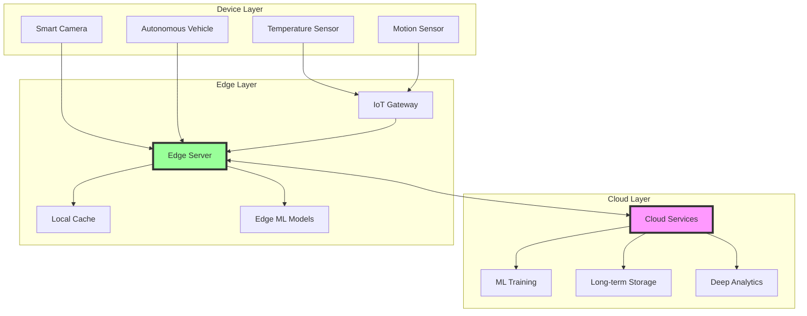
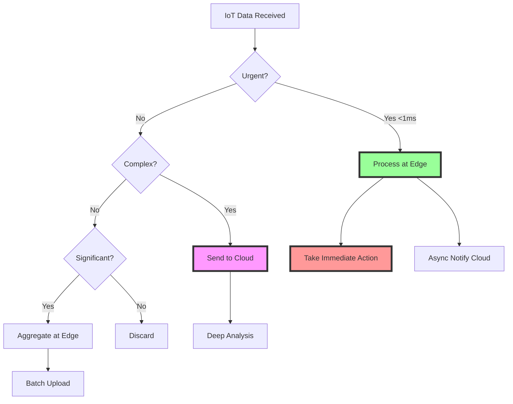
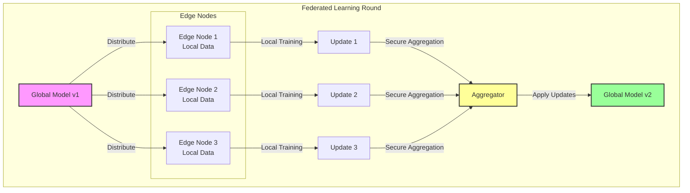
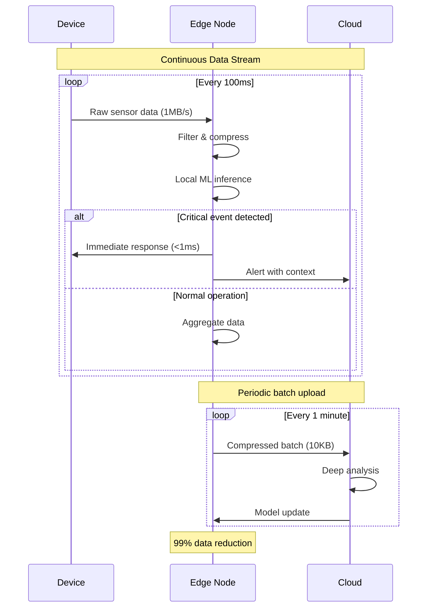

# Edge Computing/IoT Patterns

**Bringing computation to the speed of light - literally**

> *"In edge computing, every millisecond saved is a life saved, every byte reduced is a dollar earned, and every computation at the edge is a cloud server unburdened."*

---

## Level 1: Intuition

### The Hospital Network Analogy

```
Traditional Cloud (Central Hospital):        Edge Computing (Distributed Care):

🏥 Main Hospital                            🏥 Main Hospital
    ↑                                           ↑
    | (Ambulance: 30min)                       | (Complex cases only)
    ↑                                           ↑
🚑 Emergency                                🏪 Local Clinics → 🚑 Ambulances
    ↑                                           ↑                ↑
    | (Wait time)                              | (1min)         | (Immediate)
    ↑                                           ↑                ↑
🤕 Patient                                  🤕 Patient      🤕 Patient

Result: Every emergency                     Result: Most cases handled
goes to main hospital                       locally, faster response
```

```
The Edge Computing Hierarchy:

☁️ Cloud (Brain)
   ↓ Strategic decisions, deep analysis
🏢 Regional DC (Regional HQ)
   ↓ Coordination, aggregation
📡 Edge Server (Local Manager)
   ↓ Real-time processing, caching
📱 Device (Worker)
   ↓ Immediate actions, sensing
🌍 Physical World

Latency: 200ms → 50ms → 10ms → 1ms → 0ms
```

### Real-World Examples

<div class="responsive-table" markdown>

| Scenario | Without Edge | With Edge | Impact |
|----------|--------------|-----------|---------|
| **Self-driving car** | 100ms cloud round-trip | 1ms local decision | 8.8ft vs 0.088ft blind spot at 60mph |
| **Security camera** | Stream to cloud, analyze | Detect locally, alert | 99% bandwidth reduction |
| **Factory sensor** | Send all data to cloud | Process anomalies locally | $1000/month → $10/month data costs |
| **AR glasses** | Cloud rendering | Edge rendering | 20ms → 5ms latency (no nausea) |
| **Smart city traffic** | Central control | Intersection decisions | 30% traffic flow improvement |

</div>


### Basic Implementation

```python
class EdgeComputingSystem:
    def __init__(self):
        self.edge_nodes = {}
        self.cloud_endpoint = CloudService()
        self.local_ml_models = {}
        
    def process_iot_data(self, device_id: str, data: dict) -> dict:
        """Process IoT data with edge intelligence"""
        
        if self.requires_immediate_action(data):
            action = self.make_edge_decision(data)
            self.execute_locally(action)
            
            self.notify_cloud_async({
                'device': device_id,
                'action': action,
                'timestamp': time.time()
            })
            
            return {'processed_at': 'edge', 'latency_ms': 0.8}
        
        if self.can_process_at_edge(data):
            processed = self.edge_analytics(data)
            
            if processed['significance'] > 0.7:
                self.cloud_endpoint.send_insight(processed)
            
            return {'processed_at': 'edge', 'latency_ms': 5}
        
        return self.cloud_endpoint.process(data)
    
    def make_edge_decision(self, data: dict) -> str:
        """Ultra-low latency decision making"""
        
        if data['type'] == 'lidar':
            obstacles = self.detect_obstacles_locally(data['point_cloud'])
            if obstacles['distance'] < 10:
                return 'EMERGENCY_BRAKE'
            elif obstacles['distance'] < 30:
                return 'SLOW_DOWN'
        elif data['type'] == 'temperature' and data['value'] > 100:
            return 'SHUTDOWN_EQUIPMENT'
        
        return 'CONTINUE'
    
    def edge_analytics(self, data: dict) -> dict:
        """Process data at edge before cloud"""
        
        model_name = f"{data['type']}_edge_model"
        if model_name not in self.local_ml_models:
            self.local_ml_models[model_name] = self.load_edge_model(model_name)
        
        model = self.local_ml_models[model_name]
        prediction = model.predict(data['values'])
        
        return {
            'type': data['type'],
            'prediction': prediction,
            'confidence': model.confidence,
            'significance': self.calculate_significance(prediction),
            'summary_stats': self.summarize(data['values'])
        }

# Example usage
edge_system = EdgeComputingSystem()

sensor_data = {
    'type': 'vibration',
    'values': [0.1, 0.2, 0.8, 2.5, 0.3],
    'timestamp': time.time()
}

result = edge_system.process_iot_data('sensor_001', sensor_data)
print(f"Processed at: {result['processed_at']}, Latency: {result['latency_ms']}ms")
```

---

## Level 2: Foundation

### Edge Architecture Components



### Edge Processing Decision Flow



### Core Patterns

#### 1. Hierarchical Processing

```python
class HierarchicalProcessor:
    """Process data at the right level of the hierarchy"""
    
    def __init__(self):
        self.levels = {
            'device': DeviceLevel(),      # Microseconds
            'edge': EdgeLevel(),          # Milliseconds  
            'fog': FogLevel(),           # 10s of milliseconds
            'cloud': CloudLevel()        # 100s of milliseconds
        }
        
    def process(self, data: dict) -> dict:
        """Route to appropriate processing level"""
        
# Determine urgency and complexity
        urgency = self.calculate_urgency(data)
        complexity = self.calculate_complexity(data)
        
# Decision matrix
        if urgency > 0.9 and complexity < 0.3:
# Urgent + Simple = Device level
            return self.levels['device'].process(data)
            
        elif urgency > 0.7 and complexity < 0.6:
# Moderate urgency + Moderate complexity = Edge
            return self.levels['edge'].process(data)
            
        elif urgency < 0.5 and complexity > 0.8:
# Low urgency + High complexity = Cloud
            return self.levels['cloud'].process(data)
            
        else:
# Default to fog layer
            return self.levels['fog'].process(data)
```

#### 2. Store and Forward Pattern

```python
class StoreAndForward:
    """Handle intermittent connectivity gracefully"""
    
    def __init__(self, storage_path: str):
        self.storage = PersistentQueue(storage_path)
        self.uplink = UplinkConnection()
        self.metrics = ConnectionMetrics()
        
    async def send(self, data: dict, priority: str = 'normal'):
        """Store locally and forward when possible"""
        
# Always persist first
        entry = {
            'id': str(uuid.uuid4()),
            'data': data,
            'priority': priority,
            'timestamp': time.time(),
            'attempts': 0
        }
        
        await self.storage.put(entry)
        
# Try immediate send if connected
        if self.uplink.is_connected():
            await self.forward_queued_data()
        else:
# Schedule for later
            self.schedule_retry()
    
    async def forward_queued_data(self):
        """Forward data with priority and retry logic"""
        
# Process by priority
        for priority in ['critical', 'high', 'normal', 'low']:
            while True:
                entry = await self.storage.get_by_priority(priority)
                if not entry:
                    break
                    
                try:
# Adaptive compression based on bandwidth
                    bandwidth = self.metrics.get_bandwidth()
                    if bandwidth < 100:  # KB/s
                        entry['data'] = self.compress(entry['data'])
                    
# Send with timeout
                    await self.uplink.send(
                        entry['data'],
                        timeout=self.calculate_timeout(entry)
                    )
                    
# Success - remove from queue
                    await self.storage.remove(entry['id'])
                    
                except Exception as e:
# Failure - update retry count
                    entry['attempts'] += 1
                    
                    if entry['attempts'] > self.max_retries(entry['priority']):
# Move to dead letter queue
                        await self.storage.move_to_dlq(entry)
                    else:
# Return to queue with backoff
                        await self.storage.update(entry)
                        break  # Try next priority
```

#### 3. Edge ML Optimization

```python
class EdgeMLOptimizer:
    """Optimize ML models for edge deployment"""
    
    @staticmethod
    def prepare_for_edge(cloud_model, target_device: str):
        """Convert cloud model to edge-optimized version"""
        
# 1. Model Quantization (FP32 → INT8)
        quantized_model = quantize_model(
            cloud_model,
            calibration_data=get_calibration_data(),
            target_dtype='int8'
        )
        
# 2. Model Pruning (remove small weights)
        pruned_model = prune_model(
            quantized_model,
            sparsity=0.7,  # 70% sparsity
            structured=True  # Hardware-friendly pruning
        )
        
# 3. Knowledge Distillation (teacher-student)
        edge_model = distill_model(
            teacher=cloud_model,
            student_architecture=get_edge_architecture(target_device),
            temperature=5.0
        )
        
# 4. Hardware-specific compilation
        if target_device == 'nvidia_jetson':
            compiled = tensorrt_optimize(edge_model)
        elif target_device == 'google_coral':
            compiled = edgetpu_compile(edge_model)
        elif target_device == 'intel_ncs':
            compiled = openvino_optimize(edge_model)
        else:
            compiled = onnx_optimize(edge_model)
        
# 5. Benchmark and validate
        metrics = {
            'original_size_mb': get_model_size(cloud_model),
            'edge_size_mb': get_model_size(compiled),
            'compression_ratio': get_model_size(cloud_model) / get_model_size(compiled),
            'inference_time_ms': benchmark_inference(compiled, target_device),
            'accuracy_drop': validate_accuracy(cloud_model, compiled)
        }
        
        return EdgeModel(
            model=compiled,
            metrics=metrics,
            target_device=target_device
        )
```

### Edge-Specific Data Management

```python
class EdgeDataManager:
    """Manage data lifecycle at the edge"""
    
    def __init__(self, config: dict):
        self.hot_storage = InMemoryStore(
            max_size_mb=config['hot_storage_mb']
        )
        self.warm_storage = LocalDisk(
            path=config['warm_storage_path'],
            max_size_gb=config['warm_storage_gb']
        )
        self.cold_storage = CloudStorage(
            endpoint=config['cloud_endpoint']
        )
        
    def ingest(self, data: dict):
        """Smart data tiering based on value and age"""
        
# Classify data importance
        importance = self.classify_importance(data)
        
        if importance > 0.8:
# High importance - keep hot
            self.hot_storage.store(data)
            
# Replicate to cloud immediately
            self.replicate_to_cloud(data, priority='high')
            
        elif importance > 0.5:
# Medium importance - warm storage
            self.warm_storage.store(
                self.compress(data),
                ttl=3600 * 24  # 1 day
            )
            
# Batch upload to cloud
            self.schedule_batch_upload(data)
            
        else:
# Low importance - aggregate only
            self.aggregate_and_discard(data)
    
    def query(self, query: dict) -> list:
        """Query across storage tiers"""
        
        results = []
        
# 1. Check hot storage (fastest)
        hot_results = self.hot_storage.query(query)
        if hot_results and len(hot_results) >= query.get('limit', 100):
            return hot_results
        
        results.extend(hot_results)
        
# 2. Check warm storage if needed
        if len(results) < query.get('limit', 100):
            warm_results = self.warm_storage.query(query)
            results.extend(self.decompress(warm_results))
        
# 3. Fetch from cloud if still needed
        if len(results) < query.get('limit', 100) and query.get('include_cloud', False):
            cloud_results = self.cold_storage.query(query)
            results.extend(cloud_results)
        
        return results[:query.get('limit', 100)]
```

---

## Level 3: Deep Dive

### Advanced Edge Patterns

#### Federated Learning at the Edge



```python
class FederatedLearningCoordinator:
    """Coordinate ML training across edge nodes"""
    
    def __init__(self):
        self.nodes = {}
        self.global_model = None
        self.round_number = 0
        
    async def federated_round(self):
        """Execute one round of federated learning"""
        
        self.round_number += 1
        
        participants = self.select_participants(
            min_data_points=1000,
            min_battery=20,
            max_nodes=100
        )
        
        model_version = self.get_model_version()
        
        tasks = [
            self.send_model_to_node(node_id, self.global_model, model_version)
            for node_id in participants
        ]
        await asyncio.gather(*tasks)
        
        updates = await self.collect_updates(participants, timeout=300)
        aggregated_update = self.secure_aggregate(updates)
        
        self.global_model = self.apply_update(self.global_model, aggregated_update)
        self.global_model = self.add_privacy_noise(self.global_model, epsilon=1.0)
        
        return {
            'round': self.round_number,
            'participants': len(participants),
            'model_version': model_version + 1,
            'metrics': self.evaluate_model(self.global_model)
        }
    
    def secure_aggregate(self, updates: list) -> dict:
        """Aggregate updates with privacy preservation"""
        
        total_examples = sum(u['num_examples'] for u in updates)
        
        aggregated = {}
        for layer_name in updates[0]['weights'].keys():
            weighted_sum = sum(
                update['weights'][layer_name] * (update['num_examples'] / total_examples)
                for update in updates
            )
            aggregated[layer_name] = weighted_sum
        
        return aggregated

class EdgeNode:
    """Edge node participating in federated learning"""
    
    async def train_local_model(self, global_model, config: dict):
        """Train on local data"""
        
        local_data = self.load_private_data()
        local_model = copy.deepcopy(global_model)
        
        optimizer = torch.optim.SGD(
            local_model.parameters(),
            lr=config['learning_rate']
        )
        
        for epoch in range(config['local_epochs']):
            for batch in self.get_batches(local_data):
                loss = local_model(batch)
                optimizer.zero_grad()
                loss.backward()
                torch.nn.utils.clip_grad_norm_(local_model.parameters(), max_norm=1.0)
                optimizer.step()
        
        update = self.compute_update(global_model, local_model)
        update = self.add_local_noise(update, sensitivity=0.1)
        
        return {
            'node_id': self.node_id,
            'weights': update,
            'num_examples': len(local_data),
            'metrics': self.evaluate_locally(local_model)
        }
```

#### Edge Orchestration

```python
class EdgeOrchestrator:
    """Intelligent workload placement across edge nodes"""
    
    def __init__(self):
        self.nodes = {}
        self.workloads = {}
        self.network_topology = NetworkTopology()
        
    def place_workload(self, workload: Workload) -> Placement:
        """Optimally place workload on edge infrastructure"""
        
        requirements = {
            'compute': workload.cpu_requirements,
            'memory': workload.memory_requirements,
            'latency': workload.max_latency_ms,
            'bandwidth': workload.bandwidth_requirements,
            'data_locality': workload.data_sources
        }
        
        scores = {
            node_id: self.calculate_placement_score(
                node, requirements, current_load=self.get_node_load(node_id)
            )
            for node_id, node in self.nodes.items()
        }
        
        if workload.anti_affinity:
            self.apply_anti_affinity(scores, workload.anti_affinity)
        
        self.apply_network_costs(scores, workload)
        
        selected_nodes = (
            self.select_multiple_nodes(scores, count=workload.replicas, spread_across_zones=True)
            if workload.replicas > 1
            else [max(scores, key=scores.get)]
        )
        
        return Placement(
            workload_id=workload.id,
            nodes=selected_nodes,
            strategy='network_optimized',
            estimated_latency=self.estimate_latency(selected_nodes, workload)
        )
    
    def calculate_placement_score(self, node: Node, requirements: dict, current_load: dict) -> float:
        """Multi-criteria scoring for placement"""
        
        scores = {
            'cpu': (node.cpu_capacity - current_load['cpu']) / requirements['compute'],
            'memory': (node.memory_capacity - current_load['memory']) / requirements['memory'],
            'latency': 1 - (self.estimate_latency_to_node(node) / requirements['latency']),
            'bandwidth': min(1, node.available_bandwidth / requirements['bandwidth']),
            'data_locality': self.calculate_data_locality_score(node, requirements['data_locality']),
            'reliability': node.uptime_percentage / 100,
            'cost': 1 - (node.cost_per_hour / self.max_acceptable_cost)
        }
        
        weights = {
            'cpu': 0.2, 'memory': 0.2, 'latency': 0.25,
            'bandwidth': 0.15, 'data_locality': 0.1,
            'reliability': 0.05, 'cost': 0.05
        }
        
        return sum(scores[k] * weights[k] for k in scores)
```

#### Edge Security

```python
class EdgeSecurityManager:
    """Comprehensive security for edge deployments"""
    
    def __init__(self):
        self.tpm = TrustedPlatformModule()
        self.attestation_service = AttestationService()
        
    def secure_edge_node(self, node_id: str) -> dict:
        """Complete security hardening for edge node"""
        
        return {
            'node_id': node_id,
            'security_score': self.calculate_security_score(node_id),
            'configurations': {
                'hardware': {
                    'secure_boot': self.enable_secure_boot(node_id),
                    'tpm_enabled': self.tpm.initialize(node_id),
                    'encrypted_storage': self.setup_encrypted_storage(node_id)
                },
                'runtime': {
                    'container_isolation': self.setup_container_security(node_id),
                    'network_policies': self.configure_network_policies(node_id),
                    'intrusion_detection': self.deploy_ids(node_id)
                },
                'data': {
                    'encryption_at_rest': self.configure_encryption_at_rest(node_id),
                    'encryption_in_transit': self.setup_mtls(node_id),
                    'data_sanitization': self.configure_secure_deletion(node_id)
                },
                'access': {
                    'identity_management': self.setup_edge_identity(node_id),
                    'rbac_policies': self.configure_rbac(node_id),
                    'api_authentication': self.setup_api_security(node_id)
                },
                'monitoring': {
                    'security_monitoring': self.deploy_security_monitoring(node_id),
                    'audit_logging': self.configure_audit_logs(node_id),
                    'compliance_scanning': self.setup_compliance_checks(node_id)
                }
            }
        }
    
    def handle_compromised_node(self, node_id: str):
        """Incident response for compromised edge node"""
        
# 1. Immediate isolation
        self.network_isolate_node(node_id)
        
# 2. Workload migration
        affected_workloads = self.get_node_workloads(node_id)
        for workload in affected_workloads:
            self.emergency_migrate(workload)
        
# 3. Evidence collection
        self.collect_forensic_data(node_id)
        
# 4. Node remediation
        self.quarantine_and_reimage(node_id)
        
# 5. Re-attestation before rejoining
        self.require_attestation(node_id)
```

---

## Level 4: Expert

### Production Case Study: Tesla's Edge AI for Autopilot

Tesla processes 1.4 billion miles of driving data annually, with each vehicle making 2,500+ decisions per second at the edge.

```python
class TeslaAutopilotEdge:
    """
    Tesla's edge computing for autonomous driving
    - 8 cameras processing 1.2GB/s
    - Neural network inference in 10ms
    - 99.999% uptime requirement
    """
    
    def __init__(self):
        self.hw3_computer = {
            'neural_processors': 2,
            'cpu_cores': 12,
            'gpu': 'custom_fsd_chip',
            'memory_gb': 16,
            'storage_gb': 256
        }
        self.models = self.load_edge_models()
        
    def process_sensor_fusion(self, sensor_data: dict) -> dict:
        """
        Real-time sensor fusion and decision making
        Must complete in <10ms for 100Hz operation
        """
        
        start_time = time.perf_counter()
        
# 1. Camera processing (8 cameras, 36fps each)
        camera_features = self.process_cameras_parallel(
            sensor_data['cameras']  # 8x1280x960 @ 36fps
        )
        
# 2. Radar processing (redundant with vision)
        radar_features = self.process_radar(
            sensor_data['radar']  # 160m range
        )
        
# 3. Ultrasonic for close range
        ultrasonic_features = self.process_ultrasonic(
            sensor_data['ultrasonic']  # 12 sensors, 8m range
        )
        
# 4. Sensor fusion neural network
        fused_perception = self.fusion_network.predict({
            'vision': camera_features,
            'radar': radar_features,
            'ultrasonic': ultrasonic_features,
            'vehicle_state': sensor_data['vehicle_state']
        })
        
# 5. Planning and control
        trajectory = self.planning_network.predict(fused_perception)
        control_commands = self.control_network.predict(trajectory)
        
# 6. Safety validation
        validated_commands = self.safety_monitor.validate(
            control_commands,
            sensor_data,
            fused_perception
        )
        
        processing_time = (time.perf_counter() - start_time) * 1000
        
# Ensure we meet timing requirements
        if processing_time > 10:
            self.log_timing_violation(processing_time)
# Fall back to conservative behavior
            validated_commands = self.safe_fallback(validated_commands)
        
        return {
            'commands': validated_commands,
            'processing_time_ms': processing_time,
            'perception': fused_perception,
            'confidence': self.calculate_confidence(fused_perception)
        }
    
    def edge_model_update(self, update_package: dict):
        """
        Over-the-air model updates with safety validation
        """
        
# 1. Download update package (can be slow)
        new_models = self.download_models(update_package)
        
# 2. Validate on test scenarios
        validation_results = self.validate_models(
            new_models,
            test_scenarios=self.get_safety_critical_scenarios()
        )
        
        if validation_results['pass_rate'] < 0.999:
            self.reject_update('Safety validation failed')
            return
        
# 3. A/B test deployment
        self.shadow_mode_deployment(new_models, duration_hours=24)
        
# 4. Gradual rollout
        self.phased_deployment(new_models, phases=[
            {'percentage': 1, 'duration_hours': 24},
            {'percentage': 10, 'duration_hours': 72},
            {'percentage': 50, 'duration_hours': 168},
            {'percentage': 100, 'duration_hours': None}
        ])
```

### Edge Infrastructure at Scale

```python
class CloudflareEdgeNetwork:
    """
    Cloudflare's global edge network
    - 250+ cities
    - 10ms to 95% of internet users
    - 45Tbps network capacity
    """
    
    def __init__(self):
        self.edge_locations = self.load_edge_locations()
        self.anycast_network = AnycastNetwork()
        self.workers = {}  # Edge compute workers
        
    def deploy_edge_worker(self, worker_code: str) -> dict:
        """Deploy JavaScript worker to all edge locations"""
        
# 1. Validate and compile worker
        compiled_worker = self.compile_worker(worker_code)
        
# 2. Security sandbox
        sandboxed_worker = self.create_v8_isolate(compiled_worker)
        
# 3. Resource limits
        resource_limits = {
            'cpu_ms': 10,  # 10ms CPU time per request
            'memory_mb': 128,  # 128MB memory
            'subrequests': 50,  # Max 50 subrequests
            'duration_ms': 30  # 30ms wall time
        }
        
# 4. Deploy globally
        deployment_result = {}
        
        for location in self.edge_locations:
            result = self.deploy_to_location(
                location,
                sandboxed_worker,
                resource_limits
            )
            deployment_result[location] = result
        
# 5. Configure routing
        self.anycast_network.update_routing({
            'worker_id': sandboxed_worker.id,
            'routes': ['example.com/*'],
            'fallback': 'origin'
        })
        
        return {
            'worker_id': sandboxed_worker.id,
            'locations': len(deployment_result),
            'success_rate': self.calculate_success_rate(deployment_result),
            'global_latency_p50': self.measure_global_latency()
        }
    
    def handle_request_at_edge(self, request: Request) -> Response:
        """Process HTTP request at nearest edge location"""
        
# 1. Determine closest edge location
        edge_location = self.anycast_network.get_location(request.ip)
        
# 2. Load balancing within location
        edge_server = self.select_edge_server(edge_location)
        
# 3. Cache lookup
        cache_key = self.generate_cache_key(request)
        cached_response = edge_server.cache.get(cache_key)
        
        if cached_response and not cached_response.is_stale():
            return cached_response
        
# 4. Execute edge worker
        worker = self.workers.get(request.hostname)
        if worker:
            try:
                response = worker.handle_request(request)
                
# Cache if appropriate
                if response.cache_control.is_public():
                    edge_server.cache.set(
                        cache_key,
                        response,
                        ttl=response.cache_control.max_age
                    )
                
                return response
                
            except WorkerTimeout:
# Fall back to origin
                pass
        
# 5. Origin request with connection pooling
        origin_response = edge_server.fetch_from_origin(request)
        
# 6. Cache at edge
        if origin_response.is_cacheable():
            edge_server.cache.set(cache_key, origin_response)
        
        return origin_response
```

### Advanced Edge Patterns

```python
class EdgeVideoAnalytics:
    """
    Real-time video analytics at the edge
    Used in smart cities, retail, manufacturing
    """
    
    def __init__(self):
        self.detection_models = {
            'person': self.load_model('yolov5s'),  # 7ms inference
            'vehicle': self.load_model('vehicle_detector'),
            'face': self.load_model('face_detector'),
            'anomaly': self.load_model('anomaly_detector')
        }
        self.trackers = {}
        
    def process_video_stream(self, camera_id: str, frame: np.ndarray) -> dict:
        """Process single video frame at edge"""
        
# 1. Multi-scale detection
        detections = self.run_detection_cascade(frame)
        
# 2. Object tracking
        if camera_id not in self.trackers:
            self.trackers[camera_id] = MultiObjectTracker()
        
        tracked_objects = self.trackers[camera_id].update(detections)
        
# 3. Event detection
        events = self.detect_events(tracked_objects)
        
# 4. Privacy preservation
        if self.privacy_mode_enabled():
            frame = self.apply_privacy_filters(frame, detections)
        
# 5. Selective upload
        upload_decision = self.decide_upload(events, tracked_objects)
        
        results = {
            'camera_id': camera_id,
            'timestamp': time.time(),
            'object_count': len(tracked_objects),
            'events': events,
            'upload_frame': upload_decision['upload'],
            'metadata_only': not upload_decision['include_video']
        }
        
# 6. Compression for upload
        if upload_decision['upload']:
            if upload_decision['include_video']:
                results['compressed_frame'] = self.compress_frame(frame)
            results['metadata'] = self.extract_metadata(tracked_objects, events)
        
        return results
    
    def run_detection_cascade(self, frame: np.ndarray) -> list:
        """Cascade of increasingly complex models"""
        
        detections = []
        
# 1. Fast person detection
        person_detector = self.detection_models['person']
        persons = person_detector.detect(frame, conf_threshold=0.5)
        detections.extend(persons)
        
# 2. If persons detected, run face detection
        if persons:
            for person_bbox in persons:
                person_crop = crop_image(frame, person_bbox)
                faces = self.detection_models['face'].detect(person_crop)
                detections.extend(adjust_bbox(faces, person_bbox))
        
# 3. Vehicle detection in parallel
        vehicles = self.detection_models['vehicle'].detect(frame)
        detections.extend(vehicles)
        
# 4. Anomaly detection on full scene
        anomaly_score = self.detection_models['anomaly'].predict(frame)
        if anomaly_score > 0.8:
            detections.append({
                'type': 'anomaly',
                'score': anomaly_score,
                'bbox': [0, 0, frame.shape[1], frame.shape[0]]
            })
        
        return detections

class EdgeDataPipeline:
    """Efficient data pipeline for edge-to-cloud"""
    
    def __init__(self):
        self.compression = AdaptiveCompression()
        self.scheduler = UploadScheduler()
        self.bandwidth_monitor = BandwidthMonitor()
        
    async def process_iot_data(self, data_stream: AsyncIterator) -> None:
        """Process continuous IoT data stream"""
        
        buffer = []
        buffer_size = 0
        max_buffer_size = 1024 * 1024  # 1MB
        
        async for data_point in data_stream:
# 1. Local processing
            processed = self.process_locally(data_point)
            
# 2. Filtering
            if not self.should_upload(processed):
                continue
            
# 3. Batching
            buffer.append(processed)
            buffer_size += len(processed)
            
# 4. Adaptive upload
            if buffer_size >= max_buffer_size or self.is_critical(processed):
                await self.upload_batch(buffer)
                buffer = []
                buffer_size = 0
        
# Upload remaining data
        if buffer:
            await self.upload_batch(buffer)
    
    async def upload_batch(self, batch: list) -> None:
        """Smart batch upload with compression"""
        
# 1. Measure available bandwidth
        bandwidth = await self.bandwidth_monitor.get_current()
        
# 2. Choose compression level
        if bandwidth < 100:  # KB/s
            compression_level = 9  # Maximum compression
        elif bandwidth < 1000:
            compression_level = 6  # Balanced
        else:
            compression_level = 1  # Fast compression
        
# 3. Compress batch
        compressed = self.compression.compress(
            batch,
            level=compression_level,
            algorithm='zstd'  # Better than gzip for IoT data
        )
        
# 4. Upload with retry
        await self.upload_with_retry(compressed)
```

---

## Level 5: Mastery

### Theoretical Foundations

#### Edge Computing Theory

```python
class EdgeComputingTheory:
    """
    Mathematical models for edge computing optimization
    """
    
    def model_edge_latency(self, 
                          data_size: float,
                          computation_complexity: float,
                          network_distance: float) -> dict:
        """
        Model total latency for edge vs cloud processing
        
        L_total = L_network + L_compute + L_queue
        """
        
# Network latency (ms)
        c = 3e8  # Speed of light m/s
        propagation_delay = (network_distance / c) * 1000  # ms
        transmission_delay = (data_size * 8) / (bandwidth * 1e6) * 1000  # ms
        
        edge_network_latency = propagation_delay * 0.1 + transmission_delay  # 10% distance
        cloud_network_latency = propagation_delay + transmission_delay
        
# Compute latency (ms)
        edge_compute_latency = computation_complexity / edge_compute_power
        cloud_compute_latency = computation_complexity / cloud_compute_power
        
# Queuing latency (M/M/1 queue)
        edge_utilization = arrival_rate / edge_service_rate
        cloud_utilization = arrival_rate / cloud_service_rate
        
        edge_queue_latency = 1 / (edge_service_rate - arrival_rate)
        cloud_queue_latency = 1 / (cloud_service_rate - arrival_rate)
        
        return {
            'edge_total': edge_network_latency + edge_compute_latency + edge_queue_latency,
            'cloud_total': cloud_network_latency + cloud_compute_latency + cloud_queue_latency,
            'edge_advantage': cloud_total - edge_total,
            'break_even_distance': self.calculate_break_even_distance()
        }
    
    def optimize_edge_placement(self, 
                               nodes: list,
                               workloads: list,
                               constraints: dict) -> dict:
        """
        Optimal placement using Integer Linear Programming
        
        Minimize: Sum of latencies + Sum of costs
        Subject to: Capacity constraints, QoS requirements
        """
        
# Decision variables
# x[i,j] = 1 if workload i placed on node j
        
# Objective function
# min sum(latency[i,j] * x[i,j]) + sum(cost[j] * y[j])
        
        model = OptimizationModel()
        
# Variables
        x = {}
        for i, workload in enumerate(workloads):
            for j, node in enumerate(nodes):
                x[i,j] = model.add_binary_variable(f'x_{i}_{j}')
        
# Constraints
# Each workload placed exactly once
        for i in range(len(workloads)):
            model.add_constraint(
                sum(x[i,j] for j in range(len(nodes))) == 1
            )
        
# Node capacity constraints
        for j in range(len(nodes)):
            model.add_constraint(
                sum(workloads[i].resource_demand * x[i,j] 
                    for i in range(len(workloads))) <= nodes[j].capacity
            )
        
# QoS constraints
        for i, workload in enumerate(workloads):
            for j, node in enumerate(nodes):
                if self.calculate_latency(workload, node) > workload.max_latency:
                    model.add_constraint(x[i,j] == 0)
        
# Solve
        solution = model.solve()
        
        return self.extract_placement(solution, x, workloads, nodes)
```

#### Information Theory at the Edge

```python
class EdgeInformationTheory:
    """Information theoretic approach to edge computing"""
    
    def calculate_information_value(self, data: np.ndarray) -> float:
        """
        Calculate information content to decide processing location
        Using Shannon entropy
        """
        
# Entropy H(X) = -sum(p(x) * log(p(x)))
        hist, _ = np.histogram(data, bins=256)
        prob = hist / hist.sum()
        prob = prob[prob > 0]  # Remove zeros
        
        entropy = -np.sum(prob * np.log2(prob))
        
# Normalized entropy (0-1)
        max_entropy = np.log2(len(hist))
        normalized_entropy = entropy / max_entropy
        
        return normalized_entropy
    
    def optimal_data_reduction(self, 
                              raw_data: np.ndarray,
                              bandwidth_bps: float,
                              latency_requirement_ms: float) -> dict:
        """
        Determine optimal data reduction for edge upload
        """
        
# Rate-distortion theory
# R(D) = minimum bits needed for distortion D
        
        original_size = raw_data.nbytes * 8  # bits
        upload_time_ms = (original_size / bandwidth_bps) * 1000
        
        if upload_time_ms <= latency_requirement_ms:
# No compression needed
            return {'method': 'raw', 'size': original_size}
        
# Try different compression methods
        methods = {
            'sampling': self.downsample_data,
            'quantization': self.quantize_data,
            'transform': self.transform_compress,
            'semantic': self.semantic_compress
        }
        
        best_method = None
        best_quality = 0
        
        for method_name, method_func in methods.items():
            compressed = method_func(raw_data)
            size = compressed.nbytes * 8
            upload_time = (size / bandwidth_bps) * 1000
            
            if upload_time <= latency_requirement_ms:
                quality = self.measure_quality(raw_data, compressed)
                if quality > best_quality:
                    best_method = method_name
                    best_quality = quality
        
        return {
            'method': best_method,
            'quality': best_quality,
            'compression_ratio': original_size / size
        }
```

### Future Directions

#### 6G Edge Computing

```python
class SixGEdgeComputing:
    """
    Next-generation edge computing with 6G networks
    - Sub-millisecond latency
    - AI-native architecture
    - Holographic communications
    """
    
    def __init__(self):
        self.terahertz_radio = TerahertzRadio()  # 0.1-10 THz
        self.ai_processor = NeuromorphicProcessor()
        self.quantum_security = QuantumKeyDistribution()
        
    def ultra_reliable_low_latency(self, request: dict) -> dict:
        """
        URLLC with 99.9999% reliability and <1ms latency
        """
        
# 1. Predictive processing
# Start processing before request arrives
        predicted_request = self.ai_processor.predict_next_request()
        pre_computed = self.pre_compute(predicted_request)
        
# 2. Parallel multipath
        paths = self.terahertz_radio.establish_paths(count=3)
        
# 3. Send on all paths
        responses = []
        for path in paths:
            response = path.send(request, pre_computed)
            responses.append(response)
        
# 4. Use first valid response
        return self.first_valid_response(responses)
    
    def holographic_edge_rendering(self, user_position: dict) -> dict:
        """
        Real-time holographic rendering at edge
        """
        
# 1. Capture from multiple angles
        captures = self.capture_volumetric_data(user_position)
        
# 2. Edge AI processing
        hologram = self.ai_processor.generate_hologram(
            captures,
            quality='16K',  # 16K per eye
            fps=120,
            latency_budget_ms=5
        )
        
# 3. Compress using neural codec
        compressed = self.neural_compress(
            hologram,
            target_bitrate_gbps=10
        )
        
# 4. Stream with guaranteed QoS
        return self.stream_hologram(compressed)
```

#### Neuromorphic Edge Computing

```python
class NeuromorphicEdge:
    """
    Brain-inspired computing at the edge
    - Event-driven processing
    - Ultra-low power (<1W)
    - Continuous learning
    """
    
    def __init__(self):
        self.spiking_processor = SpikingNeuralProcessor()
        self.event_camera = EventCamera()  # 1M events/second
        
    def process_event_stream(self, event_stream: Iterator) -> None:
        """
        Process asynchronous event stream
        """
        
        for event in event_stream:
# Events only on change (no redundant data)
            if event.type == 'pixel_change':
# Spike-based processing
                spikes = self.encode_to_spikes(event)
                
# Asynchronous neural computation
                result = self.spiking_processor.process(
                    spikes,
                    power_budget_mw=100  # 100mW
                )
                
# Only act on significant patterns
                if result.confidence > 0.8:
                    self.trigger_action(result)
    
    def continuous_learning_at_edge(self, new_pattern: np.ndarray):
        """
        Learn new patterns without forgetting old ones
        """
        
# Hebbian learning: "Neurons that fire together wire together"
        self.spiking_processor.hebbian_update(
            pattern=new_pattern,
            learning_rate=0.01,
            homeostasis=True  # Prevent runaway excitation
        )
        
# Consolidate important patterns
        self.memory_consolidation()
```

### Economic Impact

```python
class EdgeEconomics:
    """Economic analysis of edge computing"""
    
    def calculate_edge_roi(self, deployment: dict) -> dict:
        """
        ROI calculation for edge deployment
        """
        
# Costs
        edge_infrastructure = deployment['edge_nodes'] * 50000  # $50K per edge node
        bandwidth_savings = deployment['data_reduction'] * 0.10  # $0.10 per GB
        cloud_compute_savings = deployment['edge_compute_hours'] * 0.05  # $0.05 per hour
        
# Benefits
        latency_value = self.calculate_latency_value(
            deployment['latency_reduction_ms'],
            deployment['use_case']
        )
        
        downtime_reduction = deployment['availability_improvement'] * 100000  # $100K per 1%
        
# 5-year projection
        five_year_savings = (bandwidth_savings + cloud_compute_savings) * 5 * 365
        five_year_benefits = (latency_value + downtime_reduction) * 5
        
        roi = ((five_year_benefits - edge_infrastructure) / edge_infrastructure) * 100
        
        return {
            'initial_investment': edge_infrastructure,
            'annual_savings': five_year_savings / 5,
            'annual_benefits': five_year_benefits / 5,
            'payback_months': edge_infrastructure / ((five_year_savings + five_year_benefits) / 60),
            'five_year_roi': roi
        }
    
    def calculate_latency_value(self, latency_reduction_ms: float, use_case: str) -> float:
        """
        Business value of latency reduction
        """
        
        values = {
            'autonomous_vehicle': 1000 * latency_reduction_ms,  # $1000 per ms (safety)
            'ar_vr': 100 * latency_reduction_ms,  # $100 per ms (user experience)
            'industrial_iot': 500 * latency_reduction_ms,  # $500 per ms (productivity)
            'video_analytics': 50 * latency_reduction_ms,  # $50 per ms (efficiency)
            'smart_city': 200 * latency_reduction_ms  # $200 per ms (public service)
        }
        
        return values.get(use_case, 100 * latency_reduction_ms)
```

---

## Quick Reference

### Decision Framework

<div class="responsive-table" markdown>

| Factor | Use Edge Computing | Use Cloud Computing |
|--------|-------------------|---------------------|
| **Latency** | <10ms required | >100ms acceptable |
| **Bandwidth** | Limited/expensive | Abundant/cheap |
| **Data Volume** | High volume, low value | Low volume, high value |
| **Privacy** | Local processing required | Cloud processing OK |
| **Reliability** | Must work offline | Always connected |
| **Computing** | Simple inference | Complex training |

</div>


### Edge-to-Cloud Data Pipeline



### Implementation Checklist

- [ ] Identify latency requirements
- [ ] Assess bandwidth constraints
- [ ] Evaluate data privacy needs
- [ ] Design hierarchical architecture
- [ ] Select edge hardware
- [ ] Optimize models for edge
- [ ] Implement data tiering
- [ ] Set up edge orchestration
- [ ] Configure security measures
- [ ] Plan OTA updates
- [ ] Monitor edge health
- [ ] Design fallback strategies

### Common Anti-Patterns

1. **Over-provisioning edge** - Too much compute at edge
2. **Under-estimating complexity** - Edge management is hard
3. **Ignoring security** - Edge nodes are vulnerable
4. **No offline strategy** - Assuming always connected
5. **Monolithic edge apps** - Not modular enough

---

## 🎓 Key Takeaways

1. **Physics drives architecture** - Speed of light is immutable
2. **Hierarchy matters** - Process at the right level
3. **Edge ≠ Cloud** - Different constraints, different solutions
4. **Security is harder** - Physical access to edge nodes
5. **Economics vary** - Calculate ROI for your use case

---

*"The best edge computing is invisible to users but invaluable to the business."*

---

**Previous**: [← Distributed Lock Pattern](distributed-lock.md) | **Next**: [Event-Driven Architecture →](event-driven.md)