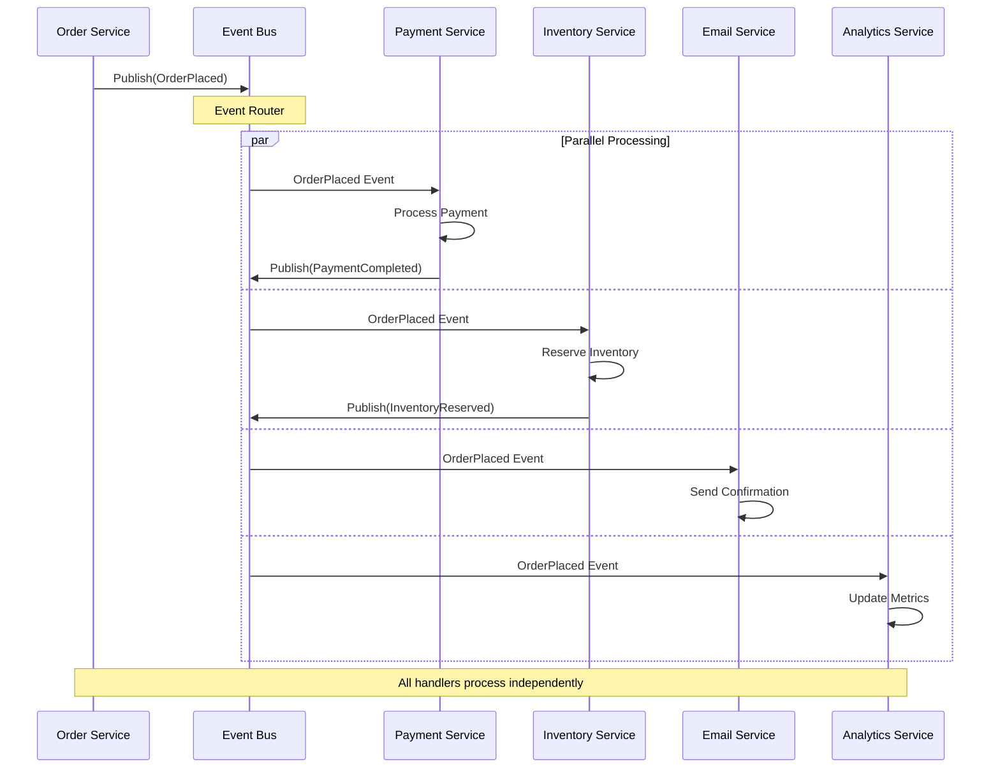
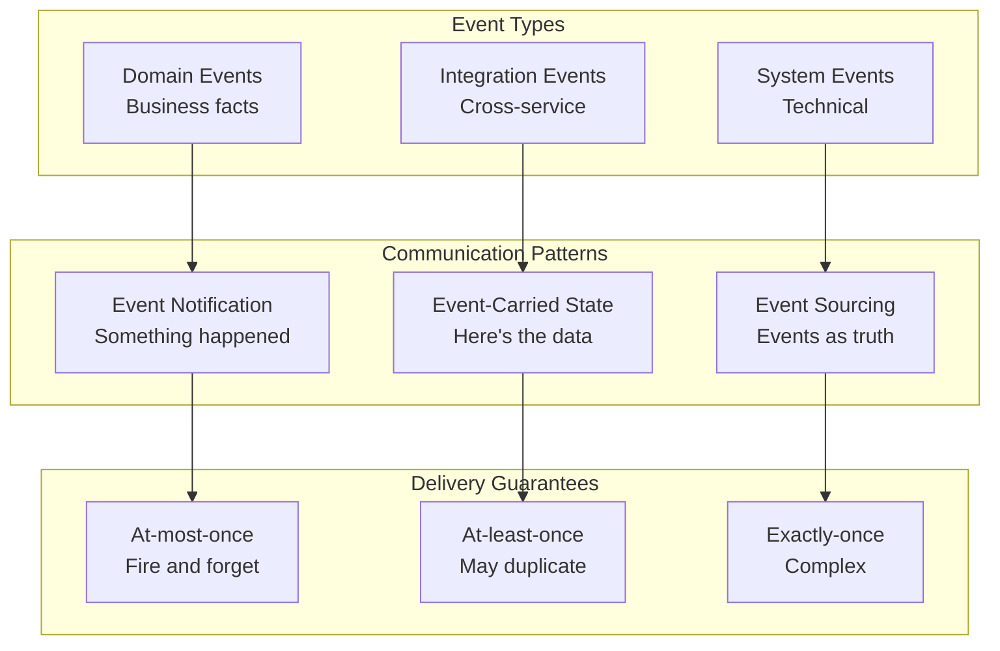
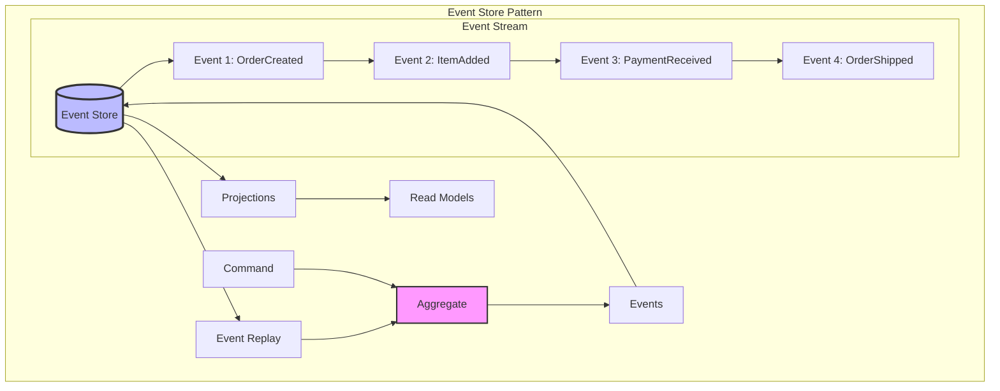
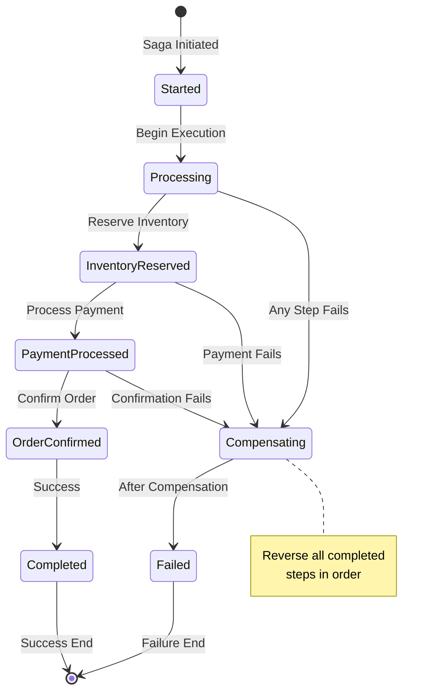
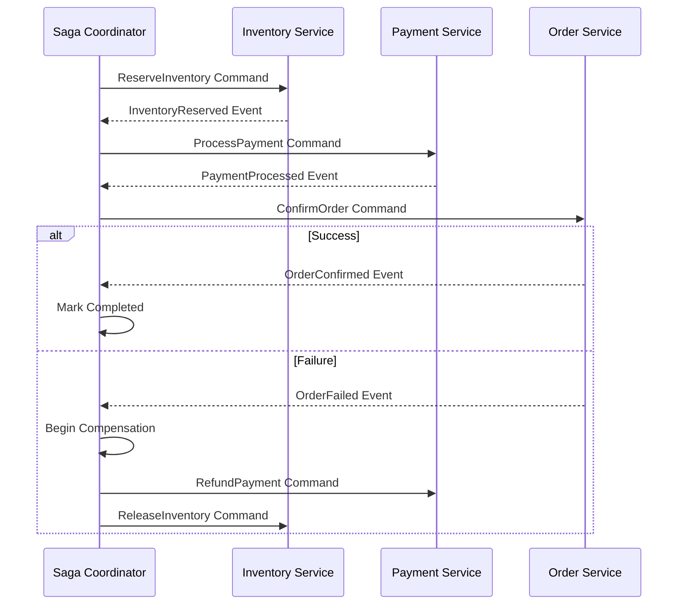

<!-- Navigation -->
[Home](../introduction/index.md) → [Part III: Patterns](index.md) → **Event-Driven Architecture**

# Event-Driven Architecture

**Everything is an event - Build systems that react to the world**

> *"In an event-driven world, services don't ask what happened, they're told when it happens."*

---

## 🎯 Level 1: Intuition

### The News Broadcasting Analogy

```
Traditional (Request-Response):          Event-Driven:

📱 Phone Calls                          📻 Radio Broadcast
Person A → calls → Person B             Station → broadcasts → Many listeners
Person A → calls → Person C             
Person A → calls → Person D             Events flow to all interested parties
                                        
Problems:                               Benefits:
- A must know B, C, D exist            - Listeners tune in when ready
- Sequential, slow                      - Broadcaster doesn't know listeners
- If B is busy, A waits                - Parallel, fast
- Tight coupling                        - Loose coupling
```

```
Synchronous Architecture:               Event-Driven Architecture:

Order Service                          Order Service
    ↓                                      ↓
    ├→ Payment Service                [Order Placed Event]
    |     ↓                                ↓    ↓    ↓
    ├→ Inventory Service            Payment  Inventory  Email
    |     ↓                         Service  Service   Service
    └→ Email Service                (async)  (async)   (async)

Chain of dependencies                 Independent reactions
```

### Real-World Examples

| System | Events | Scale |
|--------|--------|-------|
| **Netflix** | Video started, paused, completed | 150B events/day |
| **Uber** | Trip requested, driver assigned, trip completed | 50M trips/day |
| **LinkedIn** | Post created, connection made, message sent | 1B+ events/day |
| **Spotify** | Song played, playlist created, artist followed | 100M+ users |

### Event Flow Visualization



### Event-Driven Patterns

| Pattern | Description | Use Case |
|---------|-------------|----------|
| **Event Notification** | Simple "something happened" | User logged in |
| **Event-Carried State Transfer** | Full data in event | Order details in OrderPlaced |
| **Event Sourcing** | Events as source of truth | Audit trail, replay |
| **CQRS** | Separate read/write models | High-performance queries |
| **Saga** | Distributed transactions | Multi-service workflows |

### Basic Implementation

```python
from dataclasses import dataclass
from typing import Dict, List, Callable, Any
import asyncio
import json
import time

@dataclass
class Event:
    """Basic event structure"""
    event_id: str
    event_type: str
    aggregate_id: str
    payload: dict
    timestamp: float
    metadata: dict = None

class SimpleEventBus:
    """In-memory event bus for demonstration"""
    
    def __init__(self):
        self.subscribers: Dict[str, List[Callable]] = {}
        
    def subscribe(self, event_type: str, handler: Callable):
        """Subscribe to events of a specific type"""
        if event_type not in self.subscribers:
            self.subscribers[event_type] = []
        self.subscribers[event_type].append(handler)
        print(f"✓ {handler.__name__} subscribed to {event_type}")
    
    async def publish(self, event: Event):
        """Publish event to all subscribers"""
        handlers = self.subscribers.get(event.event_type, [])
        
        tasks = [
            asyncio.create_task(self._handle_event(handler, event))
            for handler in handlers
        ]
        
        await asyncio.gather(*tasks, return_exceptions=True)
    
    async def _handle_event(self, handler: Callable, event: Event):
        """Handle event with error protection"""
        try:
            print(f"→ {handler.__name__} processing {event.event_type}")
            await handler(event)
        except Exception as e:
            print(f"✗ {handler.__name__} failed: {e}")

# Example usage
async def main():
    bus = SimpleEventBus()
    
    async def send_order_confirmation(event: Event):
        await asyncio.sleep(0.1)
        print(f"  Email sent for order {event.aggregate_id}")
    
    async def update_inventory(event: Event):
        await asyncio.sleep(0.2)
        print(f"  Inventory updated for order {event.aggregate_id}")
    
    async def process_payment(event: Event):
        await asyncio.sleep(0.3)
        print(f"  Payment processed: ${event.payload['total']}")
    
    bus.subscribe("OrderPlaced", send_order_confirmation)
    bus.subscribe("OrderPlaced", update_inventory)
    bus.subscribe("OrderPlaced", process_payment)
    
    order_event = Event(
        event_id="evt-123",
        event_type="OrderPlaced",
        aggregate_id="order-456",
        payload={"items": ["laptop"], "total": 999.99},
        timestamp=time.time()
    )
    
    print("\nPublishing OrderPlaced event...")
    await bus.publish(order_event)
    print("\nAll handlers completed!")

# Run example
asyncio.run(main())
```

---

## 🏗️ Level 2: Foundation

### Core Concepts

#### Event Types and Patterns



#### Event Design Principles

| Principle | Description | Example |
|-----------|-------------|---------|
| **Immutability** | Events represent facts, never change | OrderPlaced can't be modified |
| **Self-Contained** | Include all necessary data | Don't force lookups |
| **Time-Ordered** | Clear temporal sequence | Use timestamps/versions |
| **Business-Focused** | Model domain concepts | OrderShipped not RecordUpdated |
| **Versioned** | Support schema evolution | Include version in metadata |

### Event Store Architecture



### Implementation Patterns

```python
from enum import Enum
from abc import ABC, abstractmethod
import uuid

class EventStore(ABC):
    """Abstract event store interface"""
    
    @abstractmethod
    async def append(self, stream_id: str, events: List[Event]) -> None:
        pass
    
    @abstractmethod
    async def read_stream(self, stream_id: str, from_version: int = 0) -> List[Event]:
        pass

class InMemoryEventStore(EventStore):
    """Simple in-memory implementation"""
    
    def __init__(self):
        self.streams: Dict[str, List[Event]] = {}
        
    async def append(self, stream_id: str, events: List[Event]):
        if stream_id not in self.streams:
            self.streams[stream_id] = []
        
        # Add version numbers
        current_version = len(self.streams[stream_id])
        for i, event in enumerate(events):
            event.metadata = event.metadata or {}
            event.metadata['version'] = current_version + i + 1
            self.streams[stream_id].append(event)
    
    async def read_stream(self, stream_id: str, from_version: int = 0) -> List[Event]:
        if stream_id not in self.streams:
            return []
        return self.streams[stream_id][from_version:]

class EventProcessor:
    """Processes events with delivery guarantees"""
    
    def __init__(self, event_store: EventStore):
        self.event_store = event_store
        self.handlers = {}
        self.processed_events = set()  # For idempotency
        
    def register_handler(self, event_type: str, handler: Callable):
        """Register event handler"""
        if event_type not in self.handlers:
            self.handlers[event_type] = []
        self.handlers[event_type].append(handler)
    
    async def process_stream(self, stream_id: str, checkpoint: int = 0):
        """Process all events in a stream"""
        events = await self.event_store.read_stream(stream_id, checkpoint)
        
        for event in events:
            # Idempotency check
            if event.event_id in self.processed_events:
                continue
            
            # Process event
            await self._process_event(event)
            
            # Mark as processed
            self.processed_events.add(event.event_id)
            checkpoint = event.metadata.get('version', checkpoint + 1)
        
        return checkpoint
    
    async def _process_event(self, event: Event):
        """Process single event through handlers"""
        handlers = self.handlers.get(event.event_type, [])
        
        for handler in handlers:
            try:
                await handler(event)
            except Exception as e:
                # In production: retry logic, dead letter queue
                print(f"Handler failed: {e}")

class EventDrivenAggregate(ABC):
    """Base class for event-sourced aggregates"""
    
    def __init__(self, aggregate_id: str):
        self.aggregate_id = aggregate_id
        self.version = 0
        self.pending_events = []
    
    def apply_event(self, event: Event):
        """Apply event to update state"""
        handler_name = f"_handle_{event.event_type.lower()}"
        handler = getattr(self, handler_name, None)
        
        if handler:
            handler(event)
            self.version += 1
        else:
            raise ValueError(f"No handler for {event.event_type}")
    
    def raise_event(self, event_type: str, payload: dict):
        """Raise new domain event"""
        event = Event(
            event_id=str(uuid.uuid4()),
            event_type=event_type,
            aggregate_id=self.aggregate_id,
            payload=payload,
            timestamp=time.time()
        )
        
        # Apply to self
        self.apply_event(event)
        
        # Queue for persistence
        self.pending_events.append(event)
        
        return event
    
    def get_pending_events(self) -> List[Event]:
        """Get and clear pending events"""
        events = self.pending_events
        self.pending_events = []
        return events
```

### Event-Driven Saga Pattern





### Event-Driven Saga Implementation

```python
class SagaState(Enum):
    STARTED = "started"
    PROCESSING = "processing"
    COMPLETED = "completed"
    FAILED = "failed"
    COMPENSATING = "compensating"

class EventDrivenSaga:
    """Coordinate long-running processes with events"""
    
    def __init__(self, saga_id: str, event_bus: EventBus):
        self.saga_id = saga_id
        self.event_bus = event_bus
        self.state = SagaState.STARTED
        self.completed_steps = []
        self.context = {}
        
    async def execute(self):
        """Execute saga steps"""
        try:
            self.state = SagaState.PROCESSING
            
            # Step 1: Reserve inventory
            await self._publish_command("ReserveInventory", {
                "saga_id": self.saga_id,
                "items": self.context['items']
            })
            
            # Wait for response event
            response = await self._wait_for_event("InventoryReserved")
            if not response:
                raise Exception("Inventory reservation failed")
            
            self.completed_steps.append("inventory_reserved")
            
            # Step 2: Process payment
            await self._publish_command("ProcessPayment", {
                "saga_id": self.saga_id,
                "amount": self.context['total']
            })
            
            response = await self._wait_for_event("PaymentProcessed")
            if not response:
                raise Exception("Payment failed")
            
            self.completed_steps.append("payment_processed")
            
            # Step 3: Confirm order
            await self._publish_command("ConfirmOrder", {
                "saga_id": self.saga_id,
                "order_id": self.context['order_id']
            })
            
            self.state = SagaState.COMPLETED
            
        except Exception as e:
            self.state = SagaState.COMPENSATING
            await self._compensate()
            self.state = SagaState.FAILED
            raise
    
    async def _compensate(self):
        """Compensate completed steps in reverse order"""
        for step in reversed(self.completed_steps):
            if step == "payment_processed":
                await self._publish_command("RefundPayment", {
                    "saga_id": self.saga_id
                })
            elif step == "inventory_reserved":
                await self._publish_command("ReleaseInventory", {
                    "saga_id": self.saga_id
                })
```

---

## 🔧 Level 3: Deep Dive

### Advanced Event Patterns

#### Event Sourcing with CQRS

```python
class EventSourcedOrder(EventDrivenAggregate):
    """Order aggregate using event sourcing"""
    
    def __init__(self, order_id: str):
        super().__init__(order_id)
        self.status = None
        self.items = []
        self.total = 0
        self.customer_id = None
        
    @classmethod
    async def load_from_events(cls, order_id: str, event_store: EventStore):
        """Rebuild aggregate from event history"""
        order = cls(order_id)
        events = await event_store.read_stream(f"order-{order_id}")
        
        for event in events:
            order.apply_event(event)
        
        return order
    
    def place_order(self, customer_id: str, items: List[dict]):
        """Business method that raises events"""
        if self.status is not None:
            raise ValueError("Order already placed")
        
        total = sum(item['price'] * item['quantity'] for item in items)
        
        self.raise_event("OrderPlaced", {
            "customer_id": customer_id,
            "items": items,
            "total": total
        })
    
    def _handle_orderplaced(self, event: Event):
        """Event handler to update state"""
        self.status = "placed"
        self.customer_id = event.payload['customer_id']
        self.items = event.payload['items']
        self.total = event.payload['total']

class OrderProjection:
    """Read model for orders (CQRS)"""
    
    def __init__(self):
        self.orders_by_customer = defaultdict(list)
        self.order_details = {}
        self.daily_totals = defaultdict(float)
        
    async def handle_order_placed(self, event: Event):
        """Update read model when order placed"""
        order_id = event.aggregate_id
        customer_id = event.payload['customer_id']
        
        # Update various views
        self.orders_by_customer[customer_id].append(order_id)
        self.order_details[order_id] = {
            'customer_id': customer_id,
            'total': event.payload['total'],
            'status': 'placed',
            'placed_at': event.timestamp
        }
        
        # Update daily totals
        date = datetime.fromtimestamp(event.timestamp).date()
        self.daily_totals[date] += event.payload['total']
    
    def get_customer_orders(self, customer_id: str) -> List[dict]:
        """Query customer's orders"""
        order_ids = self.orders_by_customer.get(customer_id, [])
        return [self.order_details[oid] for oid in order_ids]
```

#### Complex Event Processing (CEP)

```python
class EventPattern:
    """Define patterns to detect in event streams"""
    
    def __init__(self, name: str):
        self.name = name
        self.conditions = []
        self.time_window = None
        
    def where(self, condition: Callable) -> 'EventPattern':
        """Add condition to pattern"""
        self.conditions.append(condition)
        return self
    
    def within(self, seconds: int) -> 'EventPattern':
        """Set time window for pattern"""
        self.time_window = seconds
        return self

class ComplexEventProcessor:
    """Detect patterns across multiple events"""
    
    def __init__(self):
        self.patterns = {}
        self.event_buffer = []
        self.detected_patterns = []
        
    def register_pattern(self, pattern: EventPattern, action: Callable):
        """Register pattern and action"""
        self.patterns[pattern.name] = (pattern, action)
    
    async def process_event(self, event: Event):
        """Process event and check patterns"""
        # Add to buffer
        self.event_buffer.append(event)
        
        # Remove old events outside time windows
        self._clean_buffer()
        
        # Check all patterns
        for name, (pattern, action) in self.patterns.items():
            if self._matches_pattern(pattern):
                await action(self.event_buffer)
                self.detected_patterns.append({
                    'pattern': name,
                    'timestamp': time.time(),
                    'events': list(self.event_buffer)
                })
    
    def _matches_pattern(self, pattern: EventPattern) -> bool:
        """Check if current buffer matches pattern"""
        relevant_events = self._get_events_in_window(pattern.time_window)
        
        for condition in pattern.conditions:
            if not condition(relevant_events):
                return False
        
        return True

# Example: Fraud detection pattern
fraud_pattern = EventPattern("potential_fraud") \
    .where(lambda events: 
        len([e for e in events if e.event_type == "PaymentAttempted"]) > 5
    ) \
    .where(lambda events:
        len(set(e.payload['card_number'] for e in events 
            if e.event_type == "PaymentAttempted")) > 3
    ) \
    .within(seconds=300)  # 5 minutes

async def handle_fraud_detection(events: List[Event]):
    """Alert on potential fraud"""
    print(f"FRAUD ALERT: Multiple payment attempts detected")
    # Send alerts, block transactions, etc.
```

#### Event Stream Processing

```python
class EventStreamProcessor:
    """Process continuous streams of events"""
    
    def __init__(self):
        self.processors = []
        self.windows = {}
        
    def map(self, transform: Callable) -> 'EventStreamProcessor':
        """Transform each event"""
        self.processors.append(('map', transform))
        return self
    
    def filter(self, predicate: Callable) -> 'EventStreamProcessor':
        """Filter events"""
        self.processors.append(('filter', predicate))
        return self
    
    def window(self, size: int, slide: int = None) -> 'EventStreamProcessor':
        """Create sliding/tumbling windows"""
        self.processors.append(('window', {'size': size, 'slide': slide or size}))
        return self
    
    def aggregate(self, aggregator: Callable) -> 'EventStreamProcessor':
        """Aggregate events in window"""
        self.processors.append(('aggregate', aggregator))
        return self
    
    async def process(self, event: Event) -> Any:
        """Process event through pipeline"""
        result = event
        
        for op_type, op_config in self.processors:
            if op_type == 'map':
                result = await op_config(result)
            elif op_type == 'filter':
                if not await op_config(result):
                    return None
            elif op_type == 'window':
                result = self._add_to_window(result, op_config)
            elif op_type == 'aggregate':
                if isinstance(result, list):  # Window of events
                    result = await op_config(result)
        
        return result

# Example: Real-time analytics
order_analytics = EventStreamProcessor() \
    .filter(lambda e: e.event_type == "OrderPlaced") \
    .map(lambda e: {'timestamp': e.timestamp, 'amount': e.payload['total']}) \
    .window(size=3600, slide=300)  # 1-hour window, 5-min slide \
    .aggregate(lambda window: {
        'period_start': min(e['timestamp'] for e in window),
        'period_end': max(e['timestamp'] for e in window),
        'total_revenue': sum(e['amount'] for e in window),
        'order_count': len(window),
        'avg_order_value': sum(e['amount'] for e in window) / len(window)
    })
```

---

## 🚀 Level 4: Expert

### Production Case Study: LinkedIn's Kafka-Based Event Platform

LinkedIn processes over 7 trillion messages per day through their event-driven architecture.

```python
class LinkedInEventPlatform:
    """
    LinkedIn's production event platform
    - 7 trillion messages/day
    - 100+ Kafka clusters
    - Sub-millisecond latency
    """
    
    def __init__(self):
        self.kafka_clusters = {}
        self.schema_registry = SchemaRegistry()
        self.monitoring = EventMonitoring()
        
    def setup_multi_tier_architecture(self):
        """LinkedIn's tiered event architecture"""
        
        # Tier 1: Local Kafka (per data center)
        local_config = {
            'retention_hours': 6,
            'replication_factor': 3,
            'min_insync_replicas': 2,
            'compression': 'lz4',
            'batch_size': 64 * 1024  # 64KB
        }
        
        # Tier 2: Aggregate Kafka (regional)
        regional_config = {
            'retention_days': 3,
            'replication_factor': 4,
            'compression': 'zstd',
            'batch_size': 1024 * 1024  # 1MB
        }
        
        # Tier 3: Hadoop (long-term storage)
        hadoop_config = {
            'retention_days': 365,
            'format': 'avro',
            'partitioning': 'daily',
            'compression': 'snappy'
        }
        
        return {
            'local': local_config,
            'regional': regional_config,
            'archive': hadoop_config
        }
    
    def implement_streaming_etl(self):
        """Real-time ETL with Samza"""
        
        class ProfileViewETL:
            """ETL for profile view events"""
            
            async def process(self, event: dict) -> dict:
                # 1. Enrich with member data
                viewer = await self.get_member_data(event['viewer_id'])
                viewed = await self.get_member_data(event['viewed_id'])
                
                # 2. Extract features
                features = {
                    'viewer_seniority': viewer.get('seniority'),
                    'viewed_seniority': viewed.get('seniority'),
                    'same_company': viewer.get('company') == viewed.get('company'),
                    'connection_degree': await self.get_connection_degree(
                        event['viewer_id'], 
                        event['viewed_id']
                    )
                }
                
                # 3. Emit to multiple streams
                return {
                    'analytics_stream': {
                        **event,
                        **features,
                        'event_type': 'enriched_profile_view'
                    },
                    'ml_stream': {
                        'features': features,
                        'label': event.get('did_connect', False)
                    },
                    'metrics_stream': {
                        'metric': 'profile_view',
                        'dimensions': {
                            'viewer_seniority': features['viewer_seniority'],
                            'same_company': features['same_company']
                        }
                    }
                }
    
    def handle_event_ordering(self):
        """Ensure event ordering at scale"""
        
        class EventOrderingStrategy:
            def partition_key(self, event: dict) -> str:
                """Determine partition key for ordering"""
                
                # Member-centric events
                if event['type'] in ['profile_view', 'connection_request']:
                    return f"member:{event['actor_id']}"
                
                # Job-centric events
                elif event['type'] in ['job_view', 'job_apply']:
                    return f"job:{event['job_id']}"
                
                # Company-centric events
                elif event['type'] in ['company_follow', 'company_view']:
                    return f"company:{event['company_id']}"
                
                # Default: random partitioning
                return str(uuid.uuid4())
            
            def handle_out_of_order(self, events: List[dict]) -> List[dict]:
                """Handle out-of-order events"""
                
                # Sort by event timestamp
                sorted_events = sorted(events, key=lambda e: e['timestamp'])
                
                # Detect and handle duplicates
                seen = set()
                deduped = []
                for event in sorted_events:
                    event_id = event.get('id')
                    if event_id not in seen:
                        seen.add(event_id)
                        deduped.append(event)
                
                return deduped
```

### Advanced Event Store Implementation

```python
class ProductionEventStore:
    """Production-grade event store with Cassandra"""
    
    def __init__(self, cassandra_cluster):
        self.session = cassandra_cluster.connect()
        self._setup_schema()
        
    def _setup_schema(self):
        """Create event store schema"""
        
        # Events table (write-optimized)
        self.session.execute("""
            CREATE TABLE IF NOT EXISTS events (
                stream_id text,
                version bigint,
                event_id uuid,
                event_type text,
                event_data text,
                metadata text,
                created_at timestamp,
                PRIMARY KEY ((stream_id), version)
            ) WITH CLUSTERING ORDER BY (version ASC)
            AND compaction = {
                'class': 'TimeWindowCompactionStrategy',
                'compaction_window_unit': 'HOURS',
                'compaction_window_size': 1
            }
        """)
        
        # Snapshots table
        self.session.execute("""
            CREATE TABLE IF NOT EXISTS snapshots (
                stream_id text,
                version bigint,
                snapshot_data text,
                created_at timestamp,
                PRIMARY KEY ((stream_id), version)
            ) WITH CLUSTERING ORDER BY (version DESC)
        """)
        
        # Global event log (for projections)
        self.session.execute("""
            CREATE TABLE IF NOT EXISTS global_events (
                date_bucket text,
                timestamp timeuuid,
                stream_id text,
                event_type text,
                event_data text,
                PRIMARY KEY ((date_bucket), timestamp)
            ) WITH CLUSTERING ORDER BY (timestamp ASC)
        """)
    
    async def append_events(
        self, 
        stream_id: str, 
        events: List[Event],
        expected_version: int = None
    ):
        """Append events with optimistic concurrency control"""
        
        # Get current version
        current_version = await self._get_stream_version(stream_id)
        
        # Check expected version
        if expected_version is not None and current_version != expected_version:
            raise ConcurrencyException(
                f"Expected version {expected_version}, but was {current_version}"
            )
        
        # Prepare batch
        batch = BatchStatement()
        
        for i, event in enumerate(events):
            new_version = current_version + i + 1
            
            # Insert into events table
            batch.add(SimpleStatement(
                """
                INSERT INTO events 
                (stream_id, version, event_id, event_type, event_data, metadata, created_at)
                VALUES (?, ?, ?, ?, ?, ?, ?)
                """,
                consistency_level=ConsistencyLevel.QUORUM
            ), (
                stream_id,
                new_version,
                uuid.UUID(event.event_id),
                event.event_type,
                json.dumps(event.payload),
                json.dumps(event.metadata or {}),
                datetime.fromtimestamp(event.timestamp)
            ))
            
            # Insert into global log
            date_bucket = datetime.fromtimestamp(event.timestamp).strftime('%Y-%m-%d')
            batch.add(SimpleStatement(
                """
                INSERT INTO global_events
                (date_bucket, timestamp, stream_id, event_type, event_data)
                VALUES (?, ?, ?, ?, ?)
                """
            ), (
                date_bucket,
                time_uuid.TimeUUID.with_timestamp(event.timestamp),
                stream_id,
                event.event_type,
                json.dumps(event.payload)
            ))
        
        # Execute batch
        await self.session.execute_async(batch)
        
        # Check if snapshot needed
        if (current_version + len(events)) % 100 == 0:
            await self._create_snapshot(stream_id, current_version + len(events))
```

### Production Monitoring and Operations

```python
class EventDrivenMonitoring:
    """Monitor event-driven systems in production"""
    
    def __init__(self):
        self.metrics = MetricsCollector()
        self.alerts = AlertManager()
        
    def setup_event_metrics(self):
        """Essential metrics for event-driven systems"""
        
        # Event publishing metrics
        self.metrics.counter(
            'events.published.total',
            labels=['event_type', 'service']
        )
        
        # Event processing metrics
        self.metrics.histogram(
            'events.processing.duration',
            buckets=[0.001, 0.005, 0.01, 0.05, 0.1, 0.5, 1, 5],
            labels=['event_type', 'handler']
        )
        
        # Event lag metrics
        self.metrics.gauge(
            'events.consumer.lag',
            labels=['consumer_group', 'topic', 'partition']
        )
        
        # Error metrics
        self.metrics.counter(
            'events.processing.errors',
            labels=['event_type', 'handler', 'error_type']
        )
        
        # Dead letter queue
        self.metrics.gauge(
            'events.dlq.size',
            labels=['queue_name']
        )
    
    def setup_slo_monitoring(self):
        """Monitor Service Level Objectives"""
        
        # Event processing latency SLO
        self.alerts.add_rule(
            name='EventProcessingLatencySLO',
            expr='''
                histogram_quantile(0.99,
                    rate(events_processing_duration_bucket[5m])
                ) > 1.0
            ''',
            for_duration='5m',
            annotations={
                'summary': 'Event processing P99 latency exceeding 1s',
                'runbook': 'https://wiki/event-processing-slow'
            }
        )
        
        # Consumer lag SLO
        self.alerts.add_rule(
            name='ConsumerLagSLO',
            expr='events_consumer_lag > 100000',
            for_duration='10m',
            annotations={
                'summary': 'Consumer lag exceeding 100k events',
                'runbook': 'https://wiki/consumer-lag-high'
            }
        )

class EventDebugger:
    """Debug event flows in production"""
    
    def trace_event(self, event_id: str) -> dict:
        """Trace event through the system"""
        
        trace = {
            'event_id': event_id,
            'path': [],
            'timings': {},
            'errors': []
        }
        
        # Query all services for this event
        for service in self.get_services():
            logs = service.query_logs(f'event_id={event_id}')
            
            for log in logs:
                trace['path'].append({
                    'service': service.name,
                    'timestamp': log.timestamp,
                    'action': log.action,
                    'duration': log.duration
                })
                
                if log.error:
                    trace['errors'].append({
                        'service': service.name,
                        'error': log.error,
                        'timestamp': log.timestamp
                    })
        
        # Calculate total processing time
        if trace['path']:
            trace['total_duration'] = (
                trace['path'][-1]['timestamp'] - 
                trace['path'][0]['timestamp']
            )
        
        return trace
```

---

## 🎯 Level 5: Mastery

### Theoretical Foundations

#### Event Ordering and Causality

```python
class EventCausalityTracker:
    """Track causal relationships between events"""
    
    def __init__(self):
        self.vector_clocks = {}
        self.causal_graph = nx.DiGraph()
        
    def track_event(self, event: Event, source_node: str):
        """Track event with vector clock"""
        
        # Initialize vector clock for node
        if source_node not in self.vector_clocks:
            self.vector_clocks[source_node] = defaultdict(int)
        
        # Increment own clock
        self.vector_clocks[source_node][source_node] += 1
        
        # Attach vector clock to event
        event.metadata = event.metadata or {}
        event.metadata['vector_clock'] = dict(self.vector_clocks[source_node])
        
        # Update causal graph
        self.causal_graph.add_node(event.event_id, event=event)
        
        # Add edges for causal dependencies
        if 'caused_by' in event.metadata:
            for cause_id in event.metadata['caused_by']:
                self.causal_graph.add_edge(cause_id, event.event_id)
    
    def get_causal_order(self, events: List[Event]) -> List[Event]:
        """Sort events in causal order"""
        
        # Build temporary graph
        temp_graph = nx.DiGraph()
        event_map = {e.event_id: e for e in events}
        
        for event in events:
            temp_graph.add_node(event.event_id)
            if 'caused_by' in event.metadata:
                for cause_id in event.metadata['caused_by']:
                    if cause_id in event_map:
                        temp_graph.add_edge(cause_id, event.event_id)
        
        # Topological sort
        try:
            sorted_ids = list(nx.topological_sort(temp_graph))
            return [event_map[eid] for eid in sorted_ids]
        except nx.NetworkXUnfeasible:
            # Cycle detected - fall back to timestamp ordering
            return sorted(events, key=lambda e: e.timestamp)
```

#### Mathematical Models

```python
import numpy as np
from scipy.stats import poisson

class EventSystemModel:
    """Mathematical model of event-driven system"""
    
    def model_event_flow(self, params: dict) -> dict:
        """Model event flow using queuing theory"""
        
        # Parameters
        λ = params['arrival_rate']  # events/second
        μ = params['processing_rate']  # events/second/handler
        n = params['num_handlers']
        
        # M/M/n queue model
        ρ = λ / (n * μ)  # Utilization
        
        if ρ >= 1:
            return {'status': 'unstable', 'message': 'Arrival rate exceeds capacity'}
        
        # Calculate metrics
        # Average queue length (Erlang C formula)
        p0 = 1 / sum([(n*ρ)**k / np.math.factorial(k) for k in range(n)] + 
                    [(n*ρ)**n / (np.math.factorial(n) * (1-ρ))])
        
        Lq = (ρ * (n*ρ)**n * p0) / (np.math.factorial(n) * (1-ρ)**2)
        
        # Average wait time (Little's Law)
        Wq = Lq / λ
        
        # Total time in system
        W = Wq + 1/μ
        
        return {
            'utilization': ρ,
            'avg_queue_length': Lq,
            'avg_wait_time': Wq,
            'avg_total_time': W,
            'throughput': λ,
            'capacity': n * μ
        }
    
    def optimize_handler_allocation(self, services: List[dict]) -> dict:
        """Optimize handler allocation across services"""
        
        from scipy.optimize import linprog
        
        # Objective: minimize total processing time
        # Variables: handler allocation for each service
        
        n_services = len(services)
        
        # Coefficients (inverse of processing rate)
        c = [1/s['processing_rate'] for s in services]
        
        # Constraints: total handlers <= available
        A_ub = [[1] * n_services]
        b_ub = [params['total_handlers']]
        
        # Bounds: at least 1 handler per service
        bounds = [(1, None) for _ in range(n_services)]
        
        # Solve
        result = linprog(c, A_ub=A_ub, b_ub=b_ub, bounds=bounds)
        
        return {
            'allocation': result.x,
            'total_processing_time': result.fun,
            'utilization': [
                services[i]['arrival_rate'] / (result.x[i] * services[i]['processing_rate'])
                for i in range(n_services)
            ]
        }
```

### Future Directions

#### Event Mesh Architecture

```python
class EventMesh:
    """Next-generation event mesh for edge computing"""
    
    def __init__(self):
        self.edge_nodes = {}
        self.cloud_regions = {}
        self.mesh_topology = nx.Graph()
        
    def setup_hierarchical_mesh(self):
        """Setup hierarchical event mesh"""
        
        # Level 1: Edge nodes (IoT devices, mobile apps)
        edge_config = {
            'buffer_size': 1000,
            'batch_interval': 100,  # ms
            'local_processing': True,
            'compression': 'aggressive'
        }
        
        # Level 2: Edge gateways (5G towers, CDN PoPs)
        gateway_config = {
            'buffer_size': 100000,
            'aggregation': True,
            'filtering_rules': True,
            'local_storage': '1GB'
        }
        
        # Level 3: Regional processors
        regional_config = {
            'stream_processing': True,
            'ml_inference': True,
            'cross_region_replication': True
        }
        
        # Level 4: Global cloud
        cloud_config = {
            'unlimited_storage': True,
            'batch_processing': True,
            'historical_analysis': True
        }
        
        return {
            'edge': edge_config,
            'gateway': gateway_config,
            'regional': regional_config,
            'cloud': cloud_config
        }
```

#### AI-Enhanced Event Processing

```python
class AIEventProcessor:
    """AI-powered event processing"""
    
    def __init__(self):
        self.anomaly_detector = IsolationForest()
        self.pattern_predictor = LSTMModel()
        self.auto_scaler = RLAgent()
        
    def detect_anomalous_events(self, event_stream: List[Event]) -> List[Event]:
        """Detect anomalous events using ML"""
        
        # Extract features
        features = self.extract_features(event_stream)
        
        # Detect anomalies
        anomaly_scores = self.anomaly_detector.decision_function(features)
        
        # Flag anomalous events
        anomalous = []
        for i, score in enumerate(anomaly_scores):
            if score < -0.5:  # Threshold
                event = event_stream[i]
                event.metadata['anomaly_score'] = score
                anomalous.append(event)
        
        return anomalous
    
    def predict_event_patterns(self, historical_events: List[Event]) -> dict:
        """Predict future event patterns"""
        
        # Prepare time series data
        time_series = self.events_to_time_series(historical_events)
        
        # Predict next window
        predictions = self.pattern_predictor.predict(time_series)
        
        return {
            'predicted_volume': predictions['volume'],
            'predicted_types': predictions['event_types'],
            'confidence': predictions['confidence'],
            'recommended_scaling': self.auto_scaler.recommend(predictions)
        }
```

### Economic Impact

```python
class EventDrivenEconomics:
    """Economic analysis of event-driven architecture"""
    
    def calculate_roi(self, current_state: dict, event_driven_state: dict) -> dict:
        """Calculate ROI of event-driven transformation"""
        
        # Cost factors
        current_costs = {
            'coupling_incidents': current_state['incidents_per_year'] * 50000,
            'scaling_inefficiency': current_state['over_provisioning_cost'],
            'development_velocity': current_state['feature_delivery_days'] * 2000,
            'operational_overhead': current_state['ops_hours_per_week'] * 150 * 52
        }
        
        event_driven_costs = {
            'infrastructure': event_driven_state['kafka_clusters'] * 100000,
            'development': 500000,  # One-time migration
            'training': 50000,
            'operational': event_driven_state['ops_hours_per_week'] * 150 * 52
        }
        
        # Benefit factors
        benefits = {
            'reduced_coupling': current_costs['coupling_incidents'] * 0.8,
            'elastic_scaling': current_costs['scaling_inefficiency'] * 0.6,
            'faster_delivery': (current_state['feature_delivery_days'] - 
                              event_driven_state['feature_delivery_days']) * 2000 * 12,
            'new_capabilities': 1000000  # Business value of real-time analytics
        }
        
        annual_savings = sum(benefits.values()) - event_driven_costs['operational']
        roi_percentage = (annual_savings / event_driven_costs['development']) * 100
        
        return {
            'initial_investment': event_driven_costs['infrastructure'] + 
                                event_driven_costs['development'] + 
                                event_driven_costs['training'],
            'annual_savings': annual_savings,
            'payback_months': event_driven_costs['development'] / (annual_savings / 12),
            'five_year_roi': (annual_savings * 5 - event_driven_costs['development']) / 
                           event_driven_costs['development'] * 100,
            'intangible_benefits': [
                'Improved system resilience',
                'Better debugging capabilities',
                'Enhanced business agility',
                'Real-time insights'
            ]
        }
```

---

## 📊 Quick Reference

### Decision Framework

| Question | Yes → Event-Driven | No → Alternative |
|----------|-------------------|------------------|
| Multiple services need same data? | ✅ Publish events | ⚠️ Direct API calls |
| Need loose coupling? | ✅ Event bus | ⚠️ Shared database |
| Async processing acceptable? | ✅ Event queues | ⚠️ Synchronous APIs |
| Need audit trail? | ✅ Event sourcing | ⚠️ Traditional logging |
| Complex workflows? | ✅ Event-driven saga | ⚠️ Orchestration service |

### Implementation Checklist

- [ ] Define event schema and versioning strategy
- [ ] Choose event bus/broker (Kafka, RabbitMQ, etc.)
- [ ] Implement event publishing with retries
- [ ] Create event handlers with idempotency
- [ ] Set up event store if using event sourcing
- [ ] Configure dead letter queues
- [ ] Implement monitoring and tracing
- [ ] Plan for event replay capability
- [ ] Document event flows
- [ ] Test failure scenarios

### Common Anti-Patterns

1. **Event spaghetti** - Too many fine-grained events
2. **Missing schemas** - No event versioning strategy
3. **Synchronous events** - Using events for request-response
4. **Fat events** - Including entire aggregate state
5. **No idempotency** - Handlers not handling duplicates

---

## 🎓 Key Takeaways

1. **Events enable autonomy** - Services can evolve independently
2. **Async by default** - Embrace eventual consistency
3. **Events are facts** - Immutable, business-focused
4. **Order matters sometimes** - Use partitioning strategically
5. **Monitor everything** - Event flows need observability

---

*"In an event-driven architecture, the question isn't 'what should I call?' but 'who should I tell?'"*

---

**Previous**: [← Edge Computing/IoT Patterns](edge-computing.md) | **Next**: [Event Sourcing Pattern →](event-sourcing.md)