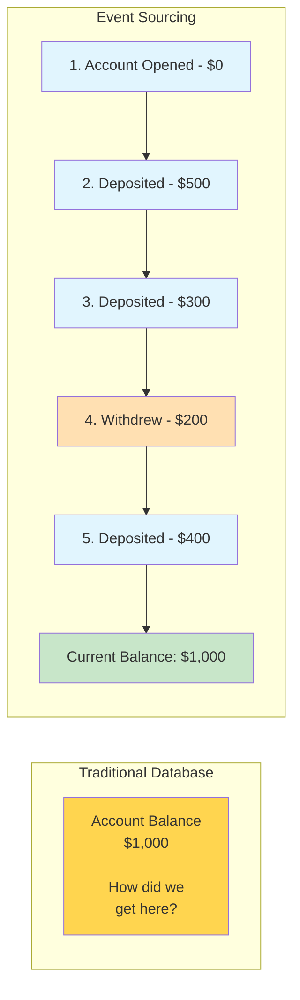
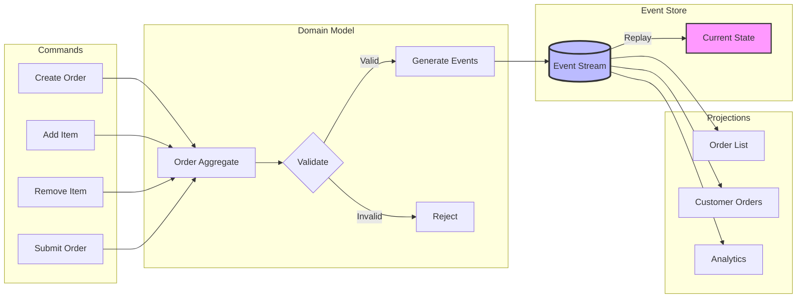
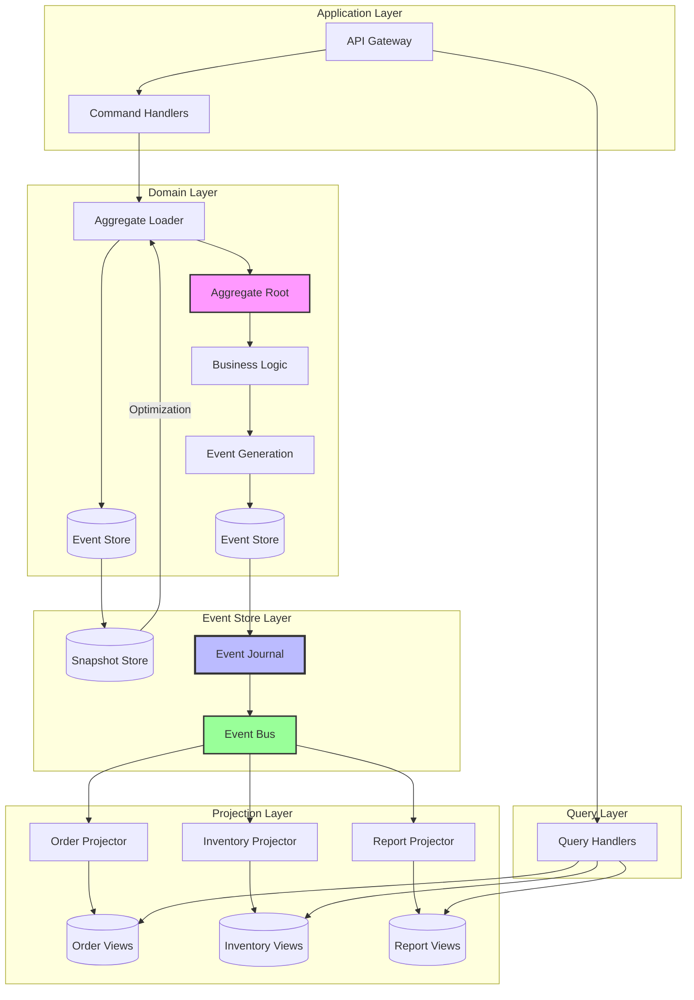
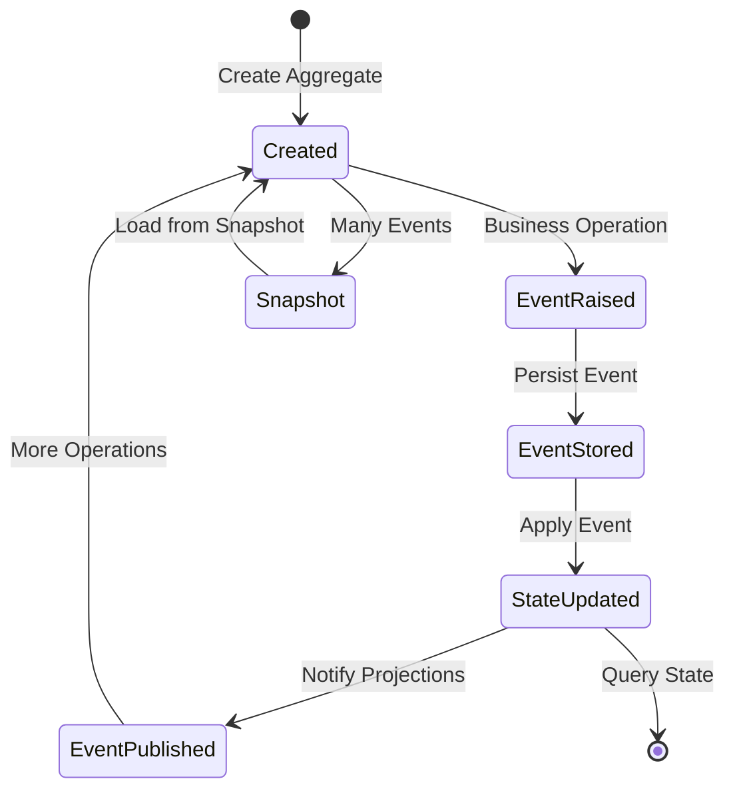
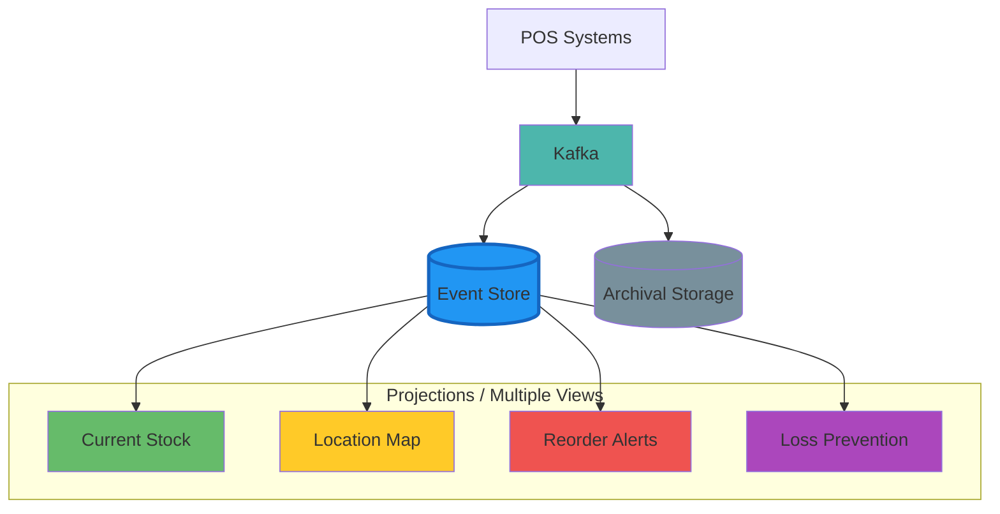
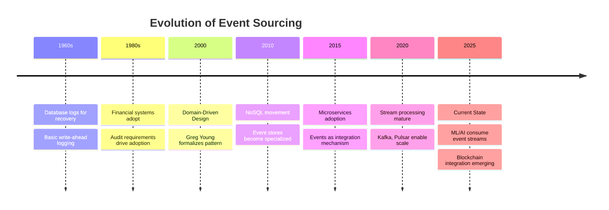

# Event Sourcing

<div class="navigation-breadcrumb">
<a href="/">Home</a> > <a href="/patterns/">Patterns</a> > Event Sourcing
</div>

> "The database is a cache; the log is the truth"
> — Pat Helland, Database Pioneer

## The Essential Question

**How can we maintain a complete, auditable history of all changes while still providing the current state of our system?**

---

## Level 1: Intuition (5 minutes)

### The Story

Your bank balance shows $1,000, but how did it get there? One deposit? Multiple transactions?

Traditional databases show only final state. Event Sourcing keeps the entire transaction history - current balance is the sum of all events.

### Visual Metaphor



### In One Sentence

**Event Sourcing**: Store every state change as an immutable event; derive current state by replaying events.

### Real-World Parallel

Like git: every commit (event) is preserved forever, showing what changed when, allowing state reconstruction at any point.

---

## Level 2: Foundation (10 minutes)

### The Problem Space

<div class="failure-vignette">
<h4>🔥 Without Event Sourcing: Trading Disaster</h4>
Trading firm couldn't explain massive position. Database showed only final state, no decision sequence.
- $50M fines
- No debugging capability
- No replay/fix option
- 6-month license suspension
</div>

### Core Concept

Event Sourcing fundamentals:

1. **Events as Facts**: Record what happened
2. **Immutability**: Events never change
3. **Event Stream**: Ordered event sequence
4. **State Derivation**: Replay events for current state
5. **Time Travel**: Recreate any past state

### Basic Architecture



### Key Benefits

1. **Audit Trail**: Complete change history
2. **Time Travel**: Debug at any point
3. **Integration**: Natural event flow
4. **Analytics**: Pattern insights

### Trade-offs

| Aspect | Gain | Cost |
|--------|------|------|
| Auditability | Complete history | Storage requirements |
| Debugging | Time travel capability | Query complexity |
| Flexibility | Multiple projections | Eventual consistency |
| Integration | Natural event flow | Schema evolution |

---

## Level 3: Deep Dive (20 minutes)

### Detailed Architecture



### Implementation Patterns

#### Basic Implementation

```python
from dataclasses import dataclass, field
from datetime import datetime
from typing import List, Dict, Any, Optional
from abc import ABC, abstractmethod
import uuid
import json

# Event Base Classes
@dataclass
class DomainEvent(ABC):
    aggregate_id: str
    event_id: str = field(default_factory=lambda: str(uuid.uuid4()))
    event_type: str = field(init=False)
    timestamp: datetime = field(default_factory=datetime.utcnow)
    version: int = 1
    metadata: Dict[str, Any] = field(default_factory=dict)
    
    def __post_init__(self):
        self.event_type = self.__class__.__name__

# Event Sourced Aggregate Base
class EventSourcedAggregate(ABC):
    def __init__(self, aggregate_id: str):
        self.id = aggregate_id
        self.version = 0
        self.uncommitted_events: List[DomainEvent] = []
        
    def apply_event(self, event: DomainEvent, is_new: bool = True):
        """Apply event to aggregate state"""
        # Use method naming convention for event handlers
        handler_name = f"_on_{event.event_type}"
        handler = getattr(self, handler_name, None)
        
        if handler:
            handler(event)
        else:
            raise ValueError(f"No handler for event type: {event.event_type}")
            
        if is_new:
            self.uncommitted_events.append(event)
            
        self.version = event.version
    
    def raise_event(self, event: DomainEvent):
        """Raise a new domain event"""
        event.aggregate_id = self.id
        event.version = self.version + 1
        self.apply_event(event, is_new=True)
    
    def mark_events_committed(self):
        """Clear uncommitted events after persistence"""
        self.uncommitted_events.clear()
    
    def load_from_history(self, events: List[DomainEvent]):
        """Rebuild aggregate state from events"""
        for event in events:
            self.apply_event(event, is_new=False)

# Example: Order Aggregate
@dataclass
class OrderCreatedEvent(DomainEvent):
    customer_id: str
    order_number: str

@dataclass
class ItemAddedEvent(DomainEvent):
    product_id: str
    product_name: str
    quantity: int
    unit_price: float

@dataclass
class ItemRemovedEvent(DomainEvent):
    product_id: str

@dataclass
class OrderSubmittedEvent(DomainEvent):
    total_amount: float
    item_count: int

class Order(EventSourcedAggregate):
    def __init__(self, order_id: str):
        super().__init__(order_id)
        self.customer_id: Optional[str] = None
        self.order_number: Optional[str] = None
        self.items: Dict[str, Dict[str, Any]] = {}
        self.status: str = "DRAFT"
        self.total_amount: float = 0.0
        
    @classmethod
    def create(cls, order_id: str, customer_id: str, order_number: str) -> 'Order':
        """Factory method to create new order"""
        order = cls(order_id)
        order.raise_event(OrderCreatedEvent(
            aggregate_id=order_id,
            customer_id=customer_id,
            order_number=order_number
        ))
        return order
    
    def add_item(self, product_id: str, product_name: str, 
                 quantity: int, unit_price: float):
        """Add item to order with business rules"""
        # Business rule: Cannot modify submitted orders
        if self.status == "SUBMITTED":
            raise ValueError("Cannot modify submitted order")
            
        # Business rule: Validate quantity and price
        if quantity <= 0:
            raise ValueError("Quantity must be positive")
        if unit_price < 0:
            raise ValueError("Price cannot be negative")
            
        self.raise_event(ItemAddedEvent(
            aggregate_id=self.id,
            product_id=product_id,
            product_name=product_name,
            quantity=quantity,
            unit_price=unit_price
        ))
    
    def remove_item(self, product_id: str):
        """Remove item from order"""
        if self.status == "SUBMITTED":
            raise ValueError("Cannot modify submitted order")
            
        if product_id not in self.items:
            raise ValueError(f"Product {product_id} not in order")
            
        self.raise_event(ItemRemovedEvent(
            aggregate_id=self.id,
            product_id=product_id
        ))
    
    def submit(self):
        """Submit order for processing"""
        if self.status == "SUBMITTED":
            raise ValueError("Order already submitted")
            
        if not self.items:
            raise ValueError("Cannot submit empty order")
            
        total = sum(item['quantity'] * item['unit_price'] 
                   for item in self.items.values())
        
        self.raise_event(OrderSubmittedEvent(
            aggregate_id=self.id,
            total_amount=total,
            item_count=len(self.items)
        ))
    
    # Event Handlers
    def _on_OrderCreatedEvent(self, event: OrderCreatedEvent):
        self.customer_id = event.customer_id
        self.order_number = event.order_number
        self.status = "DRAFT"
    
    def _on_ItemAddedEvent(self, event: ItemAddedEvent):
        if event.product_id in self.items:
            # Update existing item
            self.items[event.product_id]['quantity'] += event.quantity
        else:
            # Add new item
            self.items[event.product_id] = {
                'product_name': event.product_name,
                'quantity': event.quantity,
                'unit_price': event.unit_price
            }
        self._recalculate_total()
    
    def _on_ItemRemovedEvent(self, event: ItemRemovedEvent):
        del self.items[event.product_id]
        self._recalculate_total()
    
    def _on_OrderSubmittedEvent(self, event: OrderSubmittedEvent):
        self.status = "SUBMITTED"
        self.total_amount = event.total_amount
    
    def _recalculate_total(self):
        self.total_amount = sum(
            item['quantity'] * item['unit_price'] 
            for item in self.items.values()
        )
```

#### Production-Ready Implementation

```python
import asyncio
from typing import Optional, AsyncIterator, Callable
import asyncpg
from dataclasses import asdict

# Production Event Store with PostgreSQL
class EventStore:
    def __init__(self, connection_pool: asyncpg.Pool, config: dict):
        self.pool = connection_pool
        self.config = config
        self.event_handlers: List[Callable] = []
        
    async def initialize(self):
        """Create event store schema"""
        async with self.pool.acquire() as conn:
            await conn.execute("""
                CREATE TABLE IF NOT EXISTS events (
                    sequence_number BIGSERIAL PRIMARY KEY,
                    aggregate_id UUID NOT NULL,
                    event_id UUID NOT NULL UNIQUE,
                    event_type VARCHAR(255) NOT NULL,
                    event_data JSONB NOT NULL,
                    metadata JSONB NOT NULL,
                    version INTEGER NOT NULL,
                    timestamp TIMESTAMP NOT NULL,
                    INDEX idx_aggregate_id (aggregate_id),
                    INDEX idx_timestamp (timestamp),
                    UNIQUE(aggregate_id, version)
                );
                
                CREATE TABLE IF NOT EXISTS snapshots (
                    aggregate_id UUID PRIMARY KEY,
                    version INTEGER NOT NULL,
                    data JSONB NOT NULL,
                    timestamp TIMESTAMP NOT NULL
                );
            """)
    
    async def append_events(self, aggregate_id: str, 
                           events: List[DomainEvent],
                           expected_version: Optional[int] = None):
        """Append events with optimistic concurrency control"""
        async with self.pool.acquire() as conn:
            async with conn.transaction():
                # Check expected version if provided
                if expected_version is not None:
                    current_version = await conn.fetchval("""
                        SELECT MAX(version) FROM events 
                        WHERE aggregate_id = $1
                    """, aggregate_id)
                    
                    if current_version != expected_version:
                        raise ConcurrencyException(
                            f"Expected version {expected_version}, "
                            f"but current version is {current_version}"
                        )
                
                # Insert events
                for event in events:
                    await conn.execute("""
                        INSERT INTO events (
                            aggregate_id, event_id, event_type,
                            event_data, metadata, version, timestamp
                        ) VALUES ($1, $2, $3, $4, $5, $6, $7)
                    """, 
                        event.aggregate_id,
                        event.event_id,
                        event.event_type,
                        json.dumps(asdict(event)),
                        json.dumps(event.metadata),
                        event.version,
                        event.timestamp
                    )
                
                # Publish events asynchronously
                for event in events:
                    asyncio.create_task(self._publish_event(event))
    
    async def get_events(self, aggregate_id: str, 
                        from_version: int = 0) -> List[DomainEvent]:
        """Get events for aggregate"""
        async with self.pool.acquire() as conn:
            rows = await conn.fetch("""
                SELECT event_type, event_data, version, timestamp
                FROM events
                WHERE aggregate_id = $1 AND version > $2
                ORDER BY version
            """, aggregate_id, from_version)
            
            events = []
            for row in rows:
                event_class = self._get_event_class(row['event_type'])
                event_data = json.loads(row['event_data'])
                event = event_class(**event_data)
                events.append(event)
                
            return events
    
    async def get_aggregate(self, aggregate_class: type,
                           aggregate_id: str) -> Optional[EventSourcedAggregate]:
        """Load aggregate with snapshot optimization"""
        # Try to load from snapshot
        snapshot_data = await self._load_snapshot(aggregate_id)
        
        if snapshot_data:
            aggregate = self._deserialize_aggregate(
                aggregate_class, 
                snapshot_data['data']
            )
            from_version = snapshot_data['version']
        else:
            aggregate = aggregate_class(aggregate_id)
            from_version = 0
        
        # Load events after snapshot
        events = await self.get_events(aggregate_id, from_version)
        
        if not events and from_version == 0:
            return None  # Aggregate doesn't exist
            
        # Apply events
        aggregate.load_from_history(events)
        
        # Create snapshot if needed
        if len(events) > self.config.get('snapshot_frequency', 100):
            await self._save_snapshot(aggregate)
            
        return aggregate
    
    async def save_aggregate(self, aggregate: EventSourcedAggregate):
        """Save aggregate events"""
        if not aggregate.uncommitted_events:
            return
            
        expected_version = aggregate.version - len(aggregate.uncommitted_events)
        await self.append_events(
            aggregate.id,
            aggregate.uncommitted_events,
            expected_version
        )
        
        aggregate.mark_events_committed()

# Event Store with Event Sourcing Projections
class ProjectionManager:
    def __init__(self, event_store: EventStore):
        self.event_store = event_store
        self.projections: Dict[str, EventProjection] = {}
        self.checkpoints: Dict[str, int] = {}
        
    async def register_projection(self, projection: 'EventProjection'):
        """Register a projection handler"""
        self.projections[projection.name] = projection
        
        # Load checkpoint
        checkpoint = await self._load_checkpoint(projection.name)
        self.checkpoints[projection.name] = checkpoint
        
    async def start(self):
        """Start processing events for all projections"""
        tasks = []
        for name, projection in self.projections.items():
            task = asyncio.create_task(
                self._process_projection(name, projection)
            )
            tasks.append(task)
            
        await asyncio.gather(*tasks)
    
    async def _process_projection(self, name: str, projection: 'EventProjection'):
        """Process events for a single projection"""
        checkpoint = self.checkpoints.get(name, 0)
        
        while True:
            try:
                # Get new events
                events = await self.event_store.get_all_events_after(checkpoint)
                
                if events:
                    # Process events
                    for event in events:
                        if projection.can_handle(event):
                            await projection.handle(event)
                            
                    # Update checkpoint
                    checkpoint = events[-1].sequence_number
                    await self._save_checkpoint(name, checkpoint)
                    self.checkpoints[name] = checkpoint
                else:
                    # No new events, wait
                    await asyncio.sleep(1)
                    
            except Exception as e:
                # Log error and continue
                print(f"Projection {name} error: {e}")
                await asyncio.sleep(5)

# Temporal Queries
class TemporalQueryService:
    def __init__(self, event_store: EventStore):
        self.event_store = event_store
        
    async def get_aggregate_at_time(self, aggregate_class: type,
                                   aggregate_id: str,
                                   timestamp: datetime) -> Optional[EventSourcedAggregate]:
        """Get aggregate state at specific time"""
        events = await self.event_store.get_events_before(
            aggregate_id, 
            timestamp
        )
        
        if not events:
            return None
            
        aggregate = aggregate_class(aggregate_id)
        aggregate.load_from_history(events)
        return aggregate
    
    async def get_aggregate_history(self, aggregate_id: str,
                                   start_time: datetime,
                                   end_time: datetime) -> List[Dict[str, Any]]:
        """Get change history in time range"""
        events = await self.event_store.get_events_in_range(
            aggregate_id,
            start_time,
            end_time
        )
        
        return [
            {
                'version': event.version,
                'type': event.event_type,
                'timestamp': event.timestamp,
                'changes': self._extract_changes(event),
                'metadata': event.metadata
            }
            for event in events
        ]
```

### State Management

Event Sourcing manages state through event application:



### Common Variations

1. **ES + Snapshots**: Many events → Storage vs performance
2. **ES + CQRS**: Complex queries → Consistency vs flexibility
3. **ES + Projections**: Reporting → Real-time vs eventual consistency

### Integration Points

- **CQRS**: Events feed read models
- **Saga**: Events trigger transactions
- **CDC**: Legacy changes as events
- **Streaming**: Kafka/Pulsar distribution

---

## Level 4: Expert Practitioner (30 minutes)

### Advanced Techniques

#### Event Versioning and Upcasting

```python
class EventUpgrader:
    """Handle event schema evolution"""
    
    def __init__(self):
        self.upgraders: Dict[Tuple[str, str, str], Callable] = {}
        
    def register_upgrader(self, event_type: str, 
                         from_version: str, 
                         to_version: str,
                         upgrader: Callable):
        """Register event version upgrader"""
        key = (event_type, from_version, to_version)
        self.upgraders[key] = upgrader
        
    def upgrade_event(self, event: Dict[str, Any]) -> Dict[str, Any]:
        """Upgrade event to current version"""
        event_type = event['event_type']
        current_version = event.get('schema_version', '1.0')
        target_version = self._get_current_version(event_type)
        
        while current_version < target_version:
            next_version = self._get_next_version(event_type, current_version)
            key = (event_type, current_version, next_version)
            
            if key in self.upgraders:
                event = self.upgraders[key](event)
                current_version = next_version
            else:
                raise ValueError(f"No upgrader for {key}")
                
        return event

# Example upgraders
def upgrade_order_created_v1_to_v2(event: Dict[str, Any]) -> Dict[str, Any]:
    """Add shipping address to order created event"""
    event['shipping_address'] = event.get('customer_address', {})
    event['schema_version'] = '2.0'
    return event

def upgrade_item_added_v1_to_v2(event: Dict[str, Any]) -> Dict[str, Any]:
    """Add tax information to item added event"""
    event['tax_rate'] = 0.08  # Default 8% tax
    event['tax_amount'] = event['unit_price'] * event['quantity'] * 0.08
    event['schema_version'] = '2.0'
    return event
```

#### Event Stream Processing

```python
class EventStreamProcessor:
    """Process event streams for complex event detection"""
    
    def __init__(self, event_store: EventStore):
        self.event_store = event_store
        self.processors: List[StreamProcessor] = []
        
    async def process_stream(self, 
                           window_size: timedelta,
                           slide_interval: timedelta):
        """Process event stream with sliding windows"""
        
        last_timestamp = datetime.utcnow() - window_size
        
        while True:
            # Get events in window
            end_time = datetime.utcnow()
            events = await self.event_store.get_global_events_in_range(
                last_timestamp - window_size,
                end_time
            )
            
            # Process patterns
            for processor in self.processors:
                patterns = await processor.detect_patterns(events)
                
                for pattern in patterns:
                    await self._handle_pattern(pattern)
            
            # Slide window
            last_timestamp = end_time - slide_interval
            await asyncio.sleep(slide_interval.total_seconds())
    
    async def _handle_pattern(self, pattern: Dict[str, Any]):
        """Handle detected pattern"""
        if pattern['type'] == 'fraud_suspected':
            await self._trigger_fraud_investigation(pattern)
        elif pattern['type'] == 'unusual_activity':
            await self._alert_monitoring(pattern)

# Example: Fraud Detection Processor
class FraudDetectionProcessor:
    async def detect_patterns(self, events: List[DomainEvent]) -> List[Dict]:
        patterns = []
        
        # Group events by customer
        customer_events = defaultdict(list)
        for event in events:
            if hasattr(event, 'customer_id'):
                customer_events[event.customer_id].append(event)
        
        # Detect suspicious patterns
        for customer_id, events in customer_events.items():
            # Multiple orders in short time
            order_events = [e for e in events 
                          if e.event_type == 'OrderCreatedEvent']
            
            if len(order_events) > 5:
                time_span = (order_events[-1].timestamp - 
                           order_events[0].timestamp)
                
                if time_span < timedelta(minutes=10):
                    patterns.append({
                        'type': 'fraud_suspected',
                        'customer_id': customer_id,
                        'reason': 'multiple_orders_short_time',
                        'event_count': len(order_events),
                        'time_span': time_span
                    })
        
        return patterns
```

### Performance Optimization

<div class="decision-box">
<h4>🎯 Performance Tuning Checklist</h4>

- [ ] **Snapshotting**: Create snapshots every N events (typically 100-1000)
- [ ] **Event Batching**: Batch event writes for throughput
- [ ] **Projection Caching**: Cache frequently accessed projections
- [ ] **Event Compression**: Compress old events to save storage
- [ ] **Parallel Replay**: Replay events in parallel when possible
- [ ] **Index Optimization**: Index on aggregate_id, timestamp, event_type
- [ ] **Connection Pooling**: Separate pools for writes and reads
- [ ] **Async Processing**: Use async/await for all I/O operations
</div>

### Monitoring & Observability

Key metrics to track:

```yaml
metrics:
  # Event Store Metrics
  - name: event_append_latency
    description: Time to append events
    alert_threshold: p99 > 100ms
    
  - name: event_replay_time
    description: Time to replay aggregate events
    alert_threshold: p99 > 500ms
    
  - name: snapshot_creation_time
    description: Time to create snapshots
    alert_threshold: p99 > 1s
    
  # Projection Metrics
  - name: projection_lag
    description: Lag between event and projection update
    alert_threshold: p99 > 10s
    
  - name: projection_error_rate
    description: Failed projections per minute
    alert_threshold: > 10/min
    
  # Storage Metrics
  - name: event_storage_size
    description: Total event storage used
    alert_threshold: > 80% capacity
    
  - name: events_per_aggregate
    description: Average events per aggregate
    alert_threshold: > 10000
    
  # Business Metrics
  - name: events_per_second
    description: Event creation rate
    alert_threshold: > 10000/s
```

### Common Pitfalls

<div class="failure-vignette">
<h4>⚠️ Pitfall: Mutable Events</h4>
Team modified historical events → Broke replay, destroyed audit, diverged projections.

**Solution**: Events are immutable. Use compensating events for corrections.
</div>

<div class="failure-vignette">
<h4>⚠️ Pitfall: Missing Event Versioning</h4>
Team added fields without versioning → Couldn't deserialize old events → System failure.

**Solution**: Version events immediately. Implement upcasting.
</div>

### Production Checklist

- [ ] **Event versioning** strategy implemented
- [ ] **Snapshot strategy** defined and tested
- [ ] **Retention policy** for old events
- [ ] **Backup and restore** procedures tested
- [ ] **Event replay** capability verified
- [ ] **Projection rebuild** process documented
- [ ] **Monitoring dashboards** configured
- [ ] **Performance benchmarks** established

---

## Level 5: Mastery (45 minutes)

### Case Study: Walmart's Inventory System

<div class="truth-box">
<h4>🏢 Real-World Implementation</h4>

**Company**: Walmart  
**Scale**: 4,700+ stores, 350M+ items/day, 1M+ events/sec, 20TB+ daily

**Challenge**: Track all inventory movements with auditability and real-time queries.

**Event Types**: ItemReceived, ItemSold, ItemReturned, ItemMoved, ItemDamaged, InventoryAdjusted

**Architecture**:



**Technical**:
1. Partitioning: Store + department
2. Snapshots: Daily per SKU
3. Compression: 10:1 after 30 days
4. Retention: 7 years + archive

**Results**:
- Shrinkage detection: +40%
- Accuracy: 95% → 99.8%
- Audit: Days → Minutes
- Savings: $2B/year

**Lessons**:
1. Event granularity balance
2. Partition strategy critical
3. Index projections
4. Plan archival early
</div>

### Economic Analysis

#### Cost Model

```python
def calculate_event_sourcing_roi(
    daily_transactions: int,
    avg_events_per_transaction: float,
    audit_requirements: bool,
    compliance_years: int
) -> dict:
    """Calculate ROI for Event Sourcing implementation"""
    
    # Storage costs
    events_per_day = daily_transactions * avg_events_per_transaction
    event_size_bytes = 500  # Average event size
    
    daily_storage_gb = (events_per_day * event_size_bytes) / (1024**3)
    yearly_storage_tb = (daily_storage_gb * 365) / 1024
    
    storage_costs = {
        'hot_storage': yearly_storage_tb * 0.3 * 50,  # 30% hot at $50/TB
        'cold_storage': yearly_storage_tb * 0.7 * 10,  # 70% cold at $10/TB
        'backup': yearly_storage_tb * 5,  # Backup at $5/TB
    }
    
    # Compute costs
    replay_frequency = 100  # Replays per day
    replay_compute_hours = replay_frequency * 0.1  # 0.1 hours per replay
    
    compute_costs = {
        'event_processing': events_per_day * 0.00001,  # $0.01 per 1K events
        'replay_compute': replay_compute_hours * 50,    # $50 per hour
        'projection_updates': events_per_day * 0.000005  # $0.005 per 1K events
    }
    
    # Benefits
    benefits = {
        'audit_cost_reduction': 500000 if audit_requirements else 0,
        'debugging_time_saved': 200000,  # Developer hours saved
        'compliance_automation': 300000 if compliance_years > 0 else 0,
        'business_insights': 1000000,  # New analytics capabilities
    }
    
    # Calculate ROI
    total_costs = sum(storage_costs.values()) + sum(compute_costs.values())
    total_benefits = sum(benefits.values())
    
    return {
        'annual_cost': total_costs,
        'annual_benefit': total_benefits,
        'roi_percentage': ((total_benefits - total_costs) / total_costs) * 100,
        'payback_months': (total_costs * 12) / total_benefits,
        'storage_tb_year': yearly_storage_tb,
        'recommended': total_benefits > total_costs * 1.5
    }

# Example calculation
roi = calculate_event_sourcing_roi(
    daily_transactions=1_000_000,
    avg_events_per_transaction=3.5,
    audit_requirements=True,
    compliance_years=7
)
print(f"ROI: {roi['roi_percentage']:.1f}%, "
      f"Payback: {roi['payback_months']:.1f} months")
```

#### When It Pays Off

- **Break-even**: Audit requirements or complex domains
- **High ROI**: Financial systems, healthcare records, e-commerce orders, supply chain
- **Low ROI**: Simple CRUD, read-heavy systems, no audit needs

### Pattern Evolution



### Axiom Connections

<div class="axiom-box">
<h4>🔗 Fundamental Laws</h4>

This pattern directly addresses:

1. **[Law 5 (Distributed Knowledge 🧠)](../part1-axioms/axiom5-knowledge/index.md)**: Events capture exact time of state changes
2. **[Law 3 (Emergent Chaos 🌪️)](../part1-axioms/axiom3-chaos/index.md)**: Event sequence provides total ordering
3. **[Law 5 (Distributed Knowledge 🧠)](../part1-axioms/axiom5-knowledge/index.md)**: Complete history enables perfect knowledge
4. **[Law 5 (Distributed Knowledge 🧠)](../part1-axioms/axiom5-knowledge/index.md)**: Every change is observable
5. **[Law 6 (Cognitive Load 🤯)](../part1-axioms/axiom6-cognitive/index.md)**: Natural audit trail for compliance
</div>

### Future Directions

**Emerging Trends**:

1. **Quantum Event Stores**: Cryptographically sealed event chains
2. **AI-Driven Projections**: ML models that learn optimal projections
3. **Cross-System Event Mesh**: Federated event sourcing
4. **Immutable Ledgers**: Blockchain-backed event stores

**What's Next**:
- Standardized event formats across industries
- Hardware-accelerated event processing
- Declarative temporal queries
- Automated compliance reporting from events

---

## Quick Reference

### Decision Matrix

```mermaid
graph TD
    Start[Should I use Event Sourcing?] --> Q1{Need complete<br/>audit trail?}
    Q1 -->|Yes| UsES[Use Event Sourcing]
    Q1 -->|No| Q2{Complex domain<br/>with many states?}
    
    Q2 -->|No| Q3{Need time travel<br/>debugging?}
    Q2 -->|Yes| Q4{Can handle<br/>complexity?}
    
    Q3 -->|No| NoES[Traditional approach]
    Q3 -->|Yes| Q4
    
    Q4 -->|No| NoES
    Q4 -->|Yes| UsES
    
    UsES --> Q5{High volume?>
    Q5 -->|Yes| ESStream[ES + Streaming Platform]
    Q5 -->|No| Q6{Multiple views<br/>needed?}
    
    Q6 -->|Yes| ESCQRS[ES + CQRS]
    Q6 -->|No| ESSimple[Simple Event Store]
```

### Command Cheat Sheet

```bash
# Event Store Operations
event-store append <aggregate-id> <event>    # Append event
event-store replay <aggregate-id>            # Replay events
event-store snapshot <aggregate-id>          # Create snapshot

# Projection Management
projection rebuild <name>                    # Rebuild projection
projection status                           # Show all projections
projection pause <name>                     # Pause projection
projection resume <name>                    # Resume projection

# Temporal Queries
events at-time <aggregate-id> <timestamp>   # State at time
events between <id> <start> <end>          # Events in range
events after <sequence-number>             # Events after point

# Maintenance
event-store compact                        # Compact old events
event-store archive <before-date>          # Archive old events
event-store verify                         # Verify integrity
```

### Configuration Template

```yaml
# Production Event Sourcing configuration
event_sourcing:
  event_store:
    type: "postgresql"  # or eventstore, mongodb, cassandra
    connection_pool:
      size: 50
      timeout: 30s
    
    retention:
      hot_days: 90      # Recent events in fast storage
      warm_days: 365    # One year in medium storage  
      cold_years: 7     # Compliance period in archive
    
    partitioning:
      strategy: "aggregate_type"  # or by_date, by_tenant
      partitions: 100
  
  snapshots:
    enabled: true
    frequency: 1000     # Events before snapshot
    storage: "s3"       # Snapshot storage
    compression: "gzip"
    
  projections:
    parallel_workers: 10
    batch_size: 1000
    checkpoint_interval: 30s
    error_retry:
      max_attempts: 3
      backoff: "exponential"
  
  monitoring:
    metrics_enabled: true
    trace_sampling: 0.1  # 10% of operations
    slow_query_threshold: 100ms
    
  schema_evolution:
    versioning: true
    compatibility_mode: "forward"  # forward, backward, full
    upgrade_on_read: true
```

---

## Related Resources

### Patterns
- [CQRS](../patterns/cqrs.md) - Natural companion for read model separation
- [Saga Pattern](../patterns/saga.md) - Distributed transactions with events
- [Event-Driven Architecture](../patterns/event-driven.md) - Events as first-class citizens

### Laws
- [Law 5 (Distributed Knowledge 🧠)](../part1-axioms/axiom5-knowledge/index.md) - Why event timing matters
- [Law 3 (Emergent Chaos 🌪️)](../part1-axioms/axiom3-chaos/index.md) - Event sequence guarantees
- [Law 6 (Cognitive Load 🤯)](../part1-axioms/axiom6-cognitive/index.md) - Complete system knowledge

### Further Reading
- [Greg Young's Event Store](https://eventstore.com/) - Purpose-built event database
- [Martin Fowler on Event Sourcing](https://martinfowler.com/eaaDev/EventSourcing.html) - Clear introduction
- [Versioning in Event Sourced Systems](https://leanpub.com/esversioning) - Schema evolution
- [Event Sourcing in Production](https://medium.com/@hugo.oliveira.rocha/what-they-dont-tell-you-about-event-sourcing-6afc23c69e9a) - Practical lessons

### Tools & Libraries
- **Java**: Axon Framework, Eventuate
- **C#/.NET**: EventStore, Marten, SqlStreamStore  
- **JavaScript**: EventStore client, Eventide
- **Python**: Eventsourcing library
- **Go**: EventStore client, Eventuous
- **Databases**: EventStore, Apache Kafka, PostgreSQL with JSONB

---

<div class="navigation-links">
<div class="prev-link">
<a href="/patterns/event-driven">← Previous: Event-Driven Architecture</a>
</div>
<div class="next-link">
<a href="/patterns/saga">Next: Saga Pattern →</a>
</div>
</div>